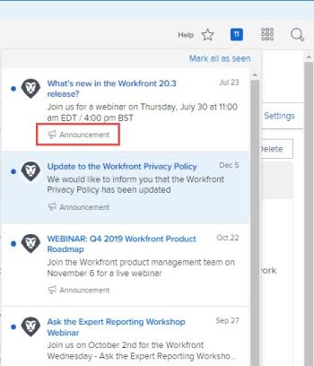
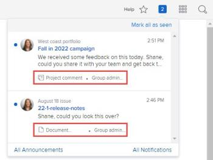

# In-app notifications overview

This article lists the in-app notifications you can receive. In-app notifications keep you informed about two types of information: announcement notifications and work item notifications. They are available from both the web application and the mobile application.

For instructions on how to view and manage these notifications, see [View and manage in-app notifications](../../workfront-basics/using-notifications/view-and-manage-in-app-notifications.md).

* [Announcement notifications](#announce) 
* [Work item notifications](#work2)

## Announcement notifications

`<li>Announcements come in one of two ways:</li>`

* Workfront sends a message to the Announcement page of your organization's Workfront administrators  
* A Workfront administrator sends a message to users from the Announcement page

In both cases, when the administrator or user clicks the numbered icon  in the upper-right corner of Workfront to open their list of notifications, the subject line of the message displays with a megaphone icon  and the word "Announcement."

For information about the Announcements page, see [View and manage in-app notifications](../../workfront-basics/using-notifications/view-and-manage-in-app-notifications.md).

## Work item notifications

When you click the numbered icon  in the upper-right corner of Workfront to open your list of notifications, the subject line of the work item message displays with an icon and brief description to identify what it's about. The icon and description types are listed below.

>[!NOTE]
>
>In-app notifications for work activities&nbsp;are not tied to email notifications in Workfront. For more information, see [Adobe Workfront notifications](../../workfront-basics/using-notifications/wf-notifications.md).

* [Approvals](#approval) 
* [Requests](#requests) 
* [Assignments](#assignme) 
* [Comments](#comments) 
* [Updates](#updates) 
* [Date changes](#date) 
* [Share](#share) 
* [Other](#error)

### `Approvals`

### `Requests`

### `Assignments`

<ul> Task assigned to you - [assigner's name] Issue assigned to you - [assigner's name] Issue assigned to [team name] - [assigner's name] Task assigned to [team name] - [assigner's name] <note type="note"> 
  <ul> 
   <li>Assignment notifications are sent only when the project status is set to Current (or to a custom status that is the equivalent of Current).</li> 
   <li>It is&nbsp;not intended for Requestors and Reviewers to be assigned work. Therefore, they are not notified if they are assigned to tasks and issues.&nbsp;</li> 
   <li>If you assign work to yourself or a team you belong to, you will not receive a notification. </li> 
  </ul> 
 </note> 
</ul>

### `Comments`

### `Updates`

### `Date changes`

### `Share`

### `Other`

