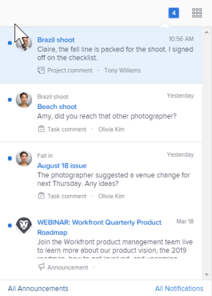
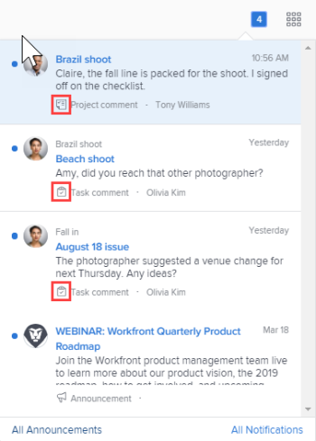
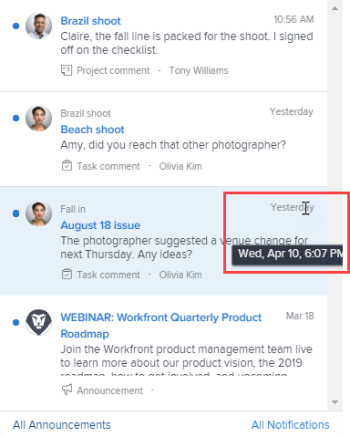
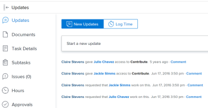

# View and manage in-app notifications {#view-and-manage-in-app-notifications}

In-app notifications are available both from the web application and the mobile application.&nbsp;They&nbsp;keep you informed about two types of information:

* Activities regarding your work
* Announcements from your *`Adobe Workfront administrator`*

>[!NOTE]
>
>In-app notifications for work activities are not tied to email notifications in *`Workfront`*. For more information, see [Adobe Workfront notifications](wf-notifications.md).

## Access requirements {#access-requirements}

You must have the following access to perform the steps in this article:

<table style="width: 100%;margin-left: 0;margin-right: auto;mc-table-style: url('../../Resources/TableStyles/TableStyle-List-options-in-steps.css');" class="TableStyle-TableStyle-List-options-in-steps" cellspacing="0"> 
 <col class="TableStyle-TableStyle-List-options-in-steps-Column-Column1"> 
 </col> 
 <col class="TableStyle-TableStyle-List-options-in-steps-Column-Column2"> 
 </col> 
 <tbody> 
  <tr class="TableStyle-TableStyle-List-options-in-steps-Body-LightGray"> 
   <td class="TableStyle-TableStyle-List-options-in-steps-BodyE-Column1-LightGray" role="rowheader">Adobe Workfront plan*</td> 
   <td class="TableStyle-TableStyle-List-options-in-steps-BodyD-Column2-LightGray"> 
Any
 </td> 
  </tr> 
  <tr class="TableStyle-TableStyle-List-options-in-steps-Body-MediumGray"> 
   <td class="TableStyle-TableStyle-List-options-in-steps-BodyB-Column1-MediumGray" role="rowheader">Adobe Workfront license*</td> 
   <td class="TableStyle-TableStyle-List-options-in-steps-BodyA-Column2-MediumGray"> 
Request or higher
 </td> 
  </tr> 
 </tbody> 
</table>

&#42;To find out what plan or license type you have, contact your *`Workfront administrator`*.

## View notifications {#view-notifications}

The numbered icon in the upper-right corner of *`Workfront`* displays the number of notifications that you have not yet acknowledged. 

>[!NOTE]
>
>You can view all in-app notifications both from the web application and the mobile&nbsp;application. Only some of these notifications are sent as push notifications in the mobile application. For more information about notifications in the mobile app, see [Adobe Workfront for iOS](workfront-for-ios.md) or [Adobe Workfront for Android](workfront-for-android.md).

1.  Click the numbered icon in the upper-right corner of *`Workfront`* to open your list of notifications.

   Your most recent unread notifications appear below the numbered icon, with the most recent at the top.

   

   Up to 80 notifications display in a scrollable list. To see more, you can click `All notifications` at the bottom of the list to view up to 100 notifications. Notifications are automatically deleted after 30 days.

   At the bottom of each notification, the notification type and a corresponding identifying icon display. These help you identify what happened to the *`Workfront`* item mentioned and alert you if you have an action item:

    
    
    *  Announcement notifications are indicated by the announcements icon.     
    
    *  All other notifications are indicated by icons that suggest the type of work item they are associated with. 
    
    
          
    

    
    
    
   The icon to the right of the blue dot displays one of the following:

    
    
    * The profile photo of the person who typed the information, usually an update about a *`Workfront`* object you're working on. 
    * The *`Workfront`* logo, if the notification is a system announcement.
    
    

1.  (Optional) If you want to view the date when you received a notification, hover the mouse over the day or time indicator in the upper-right corner of the notification.

   

1.  Click the notification that you want to view: 
    
    
    * If the notification you click is about a work item, the associated *`Workfront`* object opens, showing the full message on the `Updates` tab. You can `Start a new update area` or `<MadCap:conditionalText data-mc-conditions="QuicksilverOrClassic.Quicksilver"> Type a reply</MadCap:conditionalText>`.
    
    
          
    

    
    * If the notification you click is for an announcement`<MadCap:conditionalText data-mc-conditions="QuicksilverOrClassic.Quicksilver">  </MadCap:conditionalText>`, the `Announcements` page appears, listing all of your announcements. The announcement you clicked is selected on the left and the message is displayed on the right.
    
    
          
    

    
    
    
1.  (Optional) Download any attachments included in the notification message, or download all attachments as a ZIP file.

   

>[!NOTE]
>
>For a list of the in-app notifications you can receive, see [In-app notifications overview](in-app-notifications-overview.md).

## Acknowledge notifications {#acknowledge-notifications}

After viewing notifications, you can acknowledge them to clear them from the Notifications list or leave them to respond to later.

On the Notifications page, you can&nbsp;view current and cleared notifications. You can also bring cleared notifications back to the Notifications list.

* [Acknowledge notifications](#acknowle) 
* [View acknowledged notifications](#view2) 

### Acknowledge notifications  {#acknowledge-notifications-1}

Clicking the numbered icon to open the Notifications list does not automatically acknowledge that you have read all notifications. 

To acknowledge a notification&nbsp;and clear it&nbsp;from the Notifications list:

1.  Click the numbered icon in the upper-right corner of *`Workfront`* to open your list of notifications.
1. Do one of the following:
    
    
    * Click the blue dot in the upper-left corner of the notification.
    * If the notification is for a work item (rather than for an announcement), click the notification to go to the item.
    * If the notification is for an announcement, click the notification to open the `Announcements` page.
    * Click `All Notifications` in the lower-right corner of the list of notifications to display the `Notifications` page, then click `Mark all as seen` in the upper-right corner of *`Workfront`*.
    
    
    

### `View acknowledged notifications`  {#view-acknowledged-notifications}

To view notifications that you have already acknowledged:

1.  Click the numbered icon in the upper-right corner of *`Workfront`* to open your list of notifications.
1. Click `All Notifications` in the lower-right corner of your list of notifications.
1. On the `Notifications` page that appears, scroll down to view your past notifications.
1. (Optional) To bring an acknowledged notification back to your list of notifications, click the blue circle next to the notification.

## Delete an announcement notification  {#delete-an-announcement-notification}

You cannot delete work item notifications. *`Workfront`* deletes all notifications (whether they are read or unread) after 30 days.

However, you can delete an announcement notifications. You can also access an announcement you have deleted within 30 days after deleting it. *`Workfront`* does not automatically delete announcements.

* [Delete an announcement](#delete) 
* [Access and restore an announcement you deleted recently](#access) 

### Delete an announcement {#delete-an-announcement}

1.  Click the numbered icon in the upper-right corner of *`Workfront`* to open your list of notifications.
1. Click `Announcements` or `View All Announcements`.

1. On the `Announcements` page that appears, click the announcement you want to delete in the list on the left, then click `Delete` in the upper-right corner of the page. 

### Access and restore an announcement you deleted recently {#access-and-restore-an-announcement-you-deleted-recently}

You can access a notification that you deleted within the past 30 days.

1.  Click the numbered icon in the upper-right corner of *`Workfront`* to open your list of notifications.
1. Click `Announcements` or `View All Announcements`.

1. In the `Announcements` page that displays, click `Deleted`.

1. Click the message that you want to view.
1. (Optional) If you want to restore the announcement, click `Move to Inbox` above and to the right of the body of the announcement.

