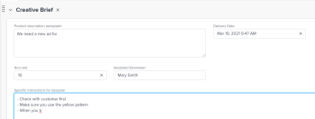
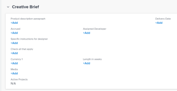
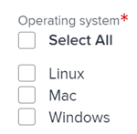

# Edit information in custom form fields in *`Adobe Workfront`* {#edit-information-in-custom-form-fields-in-adobe-workfront}

You can edit information on a custom form after the form is attached to an object. For information about adding custom forms to objects, see [Add a custom form to an object](add-a-custom-form-to-an-object.md).

## Access requirements {#access-requirements}

You must have the following:

<table class="TableStyle-TableStyle-List-options-in-steps" style="caption-side: bottom;mc-table-style: url('../../Resources/TableStyles/TableStyle-List-options-in-steps.css');" cellspacing="0"> 
 <col class="TableStyle-TableStyle-List-options-in-steps-Column-Column1"> 
 <col class="TableStyle-TableStyle-List-options-in-steps-Column-Column2"> 
 <tbody> 
  <tr class="TableStyle-TableStyle-List-options-in-steps-Body-LightGray"> 
   <td class="TableStyle-TableStyle-List-options-in-steps-BodyE-Column1-LightGray" role="rowheader"> 
Adobe Workfront plan*
 </td> 
   <td class="TableStyle-TableStyle-List-options-in-steps-BodyD-Column2-LightGray">Team or higher</td> 
  </tr> 
  <tr class="TableStyle-TableStyle-List-options-in-steps-Body-MediumGray"> 
   <td class="TableStyle-TableStyle-List-options-in-steps-BodyE-Column1-MediumGray" role="rowheader"> 
Adobe Workfront licenses*
 </td> 
   <td class="TableStyle-TableStyle-List-options-in-steps-BodyD-Column2-MediumGray"> 
Request or higher
 </td> 
  </tr> 
  <tr class="TableStyle-TableStyle-List-options-in-steps-Body-LightGray" data-mc-conditions=""> 
   <td class="TableStyle-TableStyle-List-options-in-steps-BodyE-Column1-LightGray" role="rowheader">Access level*</td> 
   <td class="TableStyle-TableStyle-List-options-in-steps-BodyD-Column2-LightGray"> 
Edit access to the object for which you want to edit the custom form
 
Note: If you still don't have access, ask your Workfront administrator if they set additional restrictions in your access level. For information on how a Workfront administrator can change your access level, see <a href="create-modify-access-levels.md" class="MCXref xref">Create or modify custom access levels</a>.
 </td> 
  </tr> 
  <tr class="TableStyle-TableStyle-List-options-in-steps-Body-MediumGray" data-mc-conditions=""> 
   <td class="TableStyle-TableStyle-List-options-in-steps-BodyB-Column1-MediumGray" style="text-align: left;" role="rowheader"> 
Object permissions
 </td> 
   <td class="TableStyle-TableStyle-List-options-in-steps-BodyA-Column2-MediumGray"> 
    <ul> 
     <li> 
Contribute or higher permissions on the object for which you want to edit the custom form
 </li> 
     <li>View permissions on the fields you want to edit.&nbsp;For information about sharing permissions for custom fields, see <a href="configure-sharing-for-a-custom-field.md" class="MCXref xref">Configure sharing for a custom field</a>.</li> 
     <li> 
Edit permissions for the sections on the form where the fields you want to edit are located
 </li> 
    </ul> 
For information on requesting additional access for objects, see <a href="request-access.md" class="MCXref xref">Request access to objects in Adobe Workfront</a>.
 </td> 
  </tr> 
 </tbody> 
</table>

&#42;To find out what plan, license type, or access you have, contact your *`Workfront administrator`*.

## Prerequisites {#prerequisites}

Before you begin, you must

* Create a custom form. For instructions, see [Create or edit a custom form](create-or-edit-a-custom-form.md).
* Attach a custom form to an object. For instructions, see [Add a custom form to an object](add-a-custom-form-to-an-object.md).

## Edit information on a custom form {#edit-information-on-a-custom-form}

Editing information on a custom form attached to an object is identical for all objects. For information about what objects can have a custom form, see [Custom forms overview](custom-forms-overview.md).

1. Go to an object for which you want to edit information on the custom form.
1.   `<MadCap:conditionalText data-mc-conditions="QuicksilverOrClassic.Quicksilver"> Click  <Object type> Details in the left panel.</MadCap:conditionalText>` 

   `<MadCap:conditionalText data-mc-conditions="QuicksilverOrClassic.Quicksilver"> For example, when editing information on a project custom form, click  Project Details.</MadCap:conditionalText>` 

1.  Scroll to the custom form. When there is a custom form attached to the object, the name of the form displays as an area in the Details section.
1.  If necessary, click the arrow  to the left of the name of the custom form to expand it.
1.   `<MadCap:conditionalText data-mc-conditions="QuicksilverOrClassic.Quicksilver">  Near the upper-right corner of the page, click the Edit icon  </MadCap:conditionalText>`.
1.  Start entering information in any field that you have access to edit.

   

   Or

   If no information has been entered yet on the form, click `Add+` for any field you have access to edit and start entering information.

   

   If multiple custom forms are attached to the object, you can do this for every form.

   Depending on the type of field you are editing consider the following: 

    
    
    * You can select only one option for radio-button fields.
    * You can select one or multiple options in a checkbox field, depending on how the form creator configured the field.
    * You can select one or multiple options in a multi-select drop-down field, depending on how the form creator configured the field.
    * You can format text fields (bold, italicize, or underline) only if the user who created the form set them up as a Text Field with Formatting field type. Single Line Text Fields and Paragraph Text Fields cannot be formatted.
    * You can update the time of the day in a Date field type only if the user who created the form has included it when creating the field.
    
    
   For information about all of the field types, see [Create or edit a custom form](create-or-edit-a-custom-form.md).

1.  Click `Save``<MadCap:conditionalText data-mc-conditions="QuicksilverOrClassic.Quicksilver"> Changes</MadCap:conditionalText>`.

   >[!IMPORTANT] {type="important"}
   >
   >You must complete all required fields on the form before you can save the form.&nbsp;`<MadCap:conditionalText data-mc-conditions="QuicksilverOrClassic.Quicksilver"> The name of a required field is followed by an asterisk.</MadCap:conditionalText>` 
   >
   >
   >   >
   >

   When someone changes data in another object that is referenced by calculated custom fields in your object, the changes are not reflected automatically in your object. For information about manually updating all calculated custom fields in your object, see [Recalculate all calculated custom fields for an object](#recalcul2) in this article.

   You can also manually update all calculated custom fields for an object when you bulk-edit the object along with other objects in a list. For instructions, see [Recalculate all calculated custom fields for multiple objects in a list](#recalcul3) in this article.

## Recalculate all calculated custom fields for an object {#recalculate-all-calculated-custom-fields-for-an-object}

1. Go to the main page of the object whose custom fields you want to recalculate. 
1.  Click the `More` menu  to the right of the object's name, then click `Recalculate Expressions`.

   This recalculates all custom fields on the object's form.

## Recalculate all calculated custom fields for multiple objects in a list {#recalculate-all-calculated-custom-fields-for-multiple-objects-in-a-list}

1.  Go to a list of objects that contain custom forms with calculated fields.
1.  Select the objects whose calculated custom fields you want to update.
1.  Click `<MadCap:conditionalText data-mc-conditions="QuicksilverOrClassic.Quicksilver">  the  Edit icon </MadCap:conditionalText>`.
1.  Click `Custom Forms` in the left menu, then select `Recalculate Custom Expressions`. 
1.  Click `Save` `Changes`.

