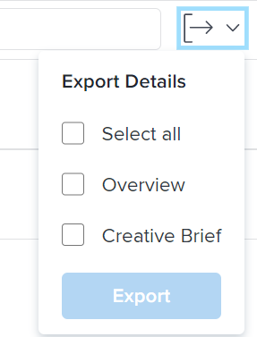

# Export custom forms and object details in Adobe Workfront

You can export the Overview and the custom form information from the Details section of an object to a PDF file. You can then print or share the PDF with other users.

This functionality is supported for the following objects:

* Projects
* Tasks
* Issues
* Portfolio
* Programs

  <!--
  Billing records After you open a billing record on a project, you can use the Details area to attach a custom form to the record and fill it out. You can also export billing record information from the Details area.
  -->

>[!NOTE]
>
>The fields in the Details section that your Workfront or group administrator removed using a layout template do not display.

## Access requirements

You must have the following:

<table cellspacing="0"> 
 <col> 
 <col> 
 <tbody> 
  <tr> 
   <td role="rowheader"> 
Adobe Workfront plan*
 </td> 
   <td>Any</td> 
  </tr> 
  <tr> 
   <td role="rowheader"> 
Adobe Workfront license*
 </td> 
   <td> 
Request or higher for issues
 
Review or higher for projects and tasks
 </td> 
  </tr> Access level configurations* View or higher for Projects, Tasks, and Issues Note: If you still don't have access, ask your Workfront administrator if they set additional restrictions in your access level. For information on how a Workfront administrator can change your access level, see Create or modify custom access levels. Object permissions View or higher permissions to the project, task, or issue whose form you want to export For information on requesting additional access, see Request access to objects in Adobe Workfront. 
 </tbody> 
</table>

&#42;To find out what plan, license type, or access you have, contact your Workfront administrator.

## Prerequisites

Before you start, you must:

* Have a custom form attached to an object or have the correct access to attach a custom form and edit the information on the form.

  For information about attaching forms to objects, see [Add a custom form to an object](../../workfront-basics/work-with-custom-forms/add-a-custom-form-to-an-object.md).

  For information about creating custom forms, see [Create or edit a custom form](../../administration-and-setup/customize-workfront/create-manage-custom-forms/create-or-edit-a-custom-form.md).

## Export information in the Details section

Exporting information from the Details section of an object is identical for all objects.

<ol> 
 <li value="1">Go to a project, task, portfolio, program, or issue for which you have at least View permissions. </li> 
 <li value="2"> 
Click the "Details" item on the left panel, such as Task Details.
 </li> 
 <li value="3"> 
(Optional) If there is no custom form attached to the object, start typing the name of a custom form in the Add custom form field, then click it when it appears in the list.
 
You can add up to 10 forms.
 </li> 
 <li value="4">(Optional) Update information in the Details section, then click Save Changes.</li> 
 <li value="5"> 
Click the Export drop-down menu in the upper-right corner, select Overview, or the forms you want to export, then click Export.
 
You can also select Select all if you want to export the Overview area and all the custom forms. 
 
  
 
  
Tips: </b>">
   <b>Tips: </b> 
   
 The following scenarios may exist:
 
   <ul> 
    <li> 
When your group or Workfront administrator deselects all fields in the Overview area and the object has custom forms attached, the Overview section does not display.
 </li> 
    <li> 
When your group or Workfront administrator deselects all fields in the Overview area and the object has no custom forms attached, the Export drop-down menu is not visible.
 </li> 
    <li> 
When the object has no custom forms attached, you can export only the Overview area.
 </li> 
    <li> 
Custom fields that are behind logic and are not visible on the form do not export. For information about adding logic to a custom form, see <a href="../../administration-and-setup/customize-workfront/create-manage-custom-forms/display-or-skip-logic-custom-form.md" class="MCXref xref">Display logic and skip logic on a custom form</a>.
 </li> 
   </ul> 
  
 
A PDF file is produced and downloaded to your computer. The PDF file contains the following information:
 
  <ul> 
   <li> 
The name of the object the form is attached to
 </li> 
   <li> 
The name of the user who exported the PDF
 </li> 
   <li> 
The date and time when the PDF was produced
 </li> 
   <li> 
The name of the forms you exported
 </li> 
   <li> 
Information from the fields completed on the form
 </li> 
  </ul> </li> 
</ol>

