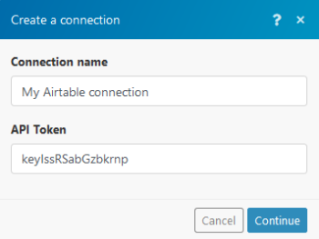

# Airtable modules

`Adobe Workfront Fusion` requires an `Adobe Workfront Fusion` license in addition to an `Adobe Workfront` license.
In a `Adobe Workfront Fusion` scenario, you can connect your `Airtable` account to multiple third-party applications and services.

<!--
For more information, see the tutorial Sync Airtable and Google contacts.
-->

## Connect Airtable to `Workfront Fusion`

<ol> 
 <li value="1">Log in to your Airtable account.</li> 
 <li value="2"> 
Open your account overview and generate the API key.
 </li> 
 <li value="3">Open Workfront Fusion and the Create a connection dialog of the desired module.</li> 
 <li value="4"> 
Enter the generated API key in the API token field.
 
  
 </li> 
 <li value="5">Click the Continue button. The connection is now established.</li> 
</ol>

## Airtable modules and their fields

### Records

* [Create a Record](#create) 
* [Delete a Record](#delete) 
* [Get a record](#get) 
* [Search Records](#search) 
* [Update a Record](#update) 
* [Watch Records](#watch2)

#### Create a Record

This action module `creates a new record`.

You specify the data you want in the record and where you want it to be stored.

The module returns any standard fields associated with the record, along with any custom fields and values that the connection accesses. You can map `this information` in subsequent modules in the scenario.

When you are configuring this module, the following fields display.

<table cellspacing="15"> 
 <col> 
 <col> 
 <tbody> 
  <tr> 
   <td>Connection </td> 
   <td> 
For instructions about connecting your Airtable account to Workfront Fusion, see <a href="#connecti" class="MCXref xref" data-mc-variable-override="">Connect Airtable to Workfront Fusion</a> in this article.
 </td> 
  </tr> 
  <tr> 
   <td> 
Record
 </td> 
   <td> 
Enter the values for the new record.
 
For more information on field types, search for "Field types reference" in the Airtable documentation.
 
    <ul> 
     <li> 
Text: string
 
A single line of text.
 </li> 
     <li> 
Long text: string
 
Multiple lines of text, which may contain "mention tokens", for example:
<pre>&lt;airtable:mention id="menE1i9oBaGX3DseR"&gt;@Alex&lt;/airtable:mention&gt;</pre> </li> 
     <li>Attachment : Add the attachment. Airtable will download the file from the provided <code>url</code> and keep its own copy of it. If the File name field is left empty, Airtable generates the name automatically.</li> 
     <li>Checkbox: Select one of the options.</li> 
     <li>Multiple select: Select multiple options in the checklist.</li> 
     <li>Single select: Select one option from the drop-down menu.</li> 
     <li>Collaborator: Enter the email that uniquely identifies a user in Airtable who this base is shared with.</li> 
     <li>Date: UTC date, for example, 2019-09-05 (ISO 8601 formatted date)</li> 
     <li>Phone number:</li> 
     <li>Emails: A valid email address.</li> 
     <li>URL: A valid URL (for example, airtable.com or https://airtable.com/universe).</li> 
     <li>Number: Enter a number.</li> 
     <li>Currency: Currency value.</li> 
     <li>Percent: A percentage value. Must be higher than or equal to 0.</li> 
     <li>Duration: Enter the duration time. If you need help, see the information about the duration field type in the Airtable support documentation. </li> 
     <li>Rating: Enter the number. For example, "3 stars" is 3. A rating cannot be 0.</li> 
     <li>Link: Enter the linked records IDs from the table. The order of record IDs will be reversed compared to what you see in the app.</li> 
     <li>Rollup: Computed value: COUNT(values)</li> 
     <li>Lookup: Array of long text fields</li> 
     <li>Autonumber: Automatically incremented unique counter for each record.</li> 
     <li> 
Barcode: The barcode object may contain the following two properties, both of which are optional.
 
Barcode data (text)
 
Barcode symbology, for example, "upce" or "code39" (type)
 </li> 
    </ul> </td> 
  </tr> 
  <tr> 
   <td>Smart links</td> 
   <td> 
<![CDATA[	]]>Enter names instead of record IDs to fields that link to another table. The record is automatically created in the linked table if there is no match.
 </td> 
  </tr> 
 </tbody> 
</table>

#### Delete a Record

This action module `deletes a particular record`.

You specify the ID and locates of the record.

The module returns the ID of the  `record` and any associated fields, along with any custom fields and values that the connection accesses. You can map `this information` in subsequent modules in the scenario.

When you are configuring this module, the following fields display.

<table cellspacing="15"> 
 <col> 
 <col> 
 <tbody> 
  <tr> 
   <td>Connection </td> 
   <td> 
For instructions about connecting your Airtable account to Workfront Fusion, see <a href="#connecti" class="MCXref xref" data-mc-variable-override="">Connect Airtable to Workfront Fusion</a> in this article.
 </td> 
  </tr> 
  <tr> 
   <td>Table </td> 
   <td> 
Select the table you want to delete the record from.
 </td> 
  </tr> 
  <tr> 
   <td>Record ID</td> 
   <td> 
<![CDATA[	]]>Enter or map the unique Airtable ID of the record that you want the module to delete. You can retrieve the ID, for example, using the Search Records module.
 </td> 
  </tr> 
 </tbody> 
</table>

#### Get a record

This action module retrieves record details.

<table cellspacing="15"> 
 <col> 
 <col> 
 <tbody> 
  <tr> 
   <td>Connection </td> 
   <td> 
For instructions about connecting your Airtable account to Workfront Fusion, see <a href="#connecti" class="MCXref xref" data-mc-variable-override="">Connect Airtable to Workfront Fusion</a> in this article.
 </td> 
  </tr> 
  <tr> 
   <td>Base </td> 
   <td> 
Select the base that contains the table with the record you want to retrieve.
 </td> 
  </tr> 
  <tr> 
   <td>Table</td> 
   <td> 
 Select the table that contains the record you want to retrieve details for.
 </td> 
  </tr> 
  <tr> 
   <td>Record ID</td> 
   <td> 
 Enter or map the ID of the record you want to retrieve details for.
 </td> 
  </tr> 
 </tbody> 
</table>

#### Search Records

This search module looks for `records in an object` in `Airtable` that match the search query you specify.

You can map `this information` in subsequent modules in the scenario.

When you are configuring this module, the following fields display.

<table cellspacing="15"> 
 <col> 
 <col> 
 <tbody> 
  <tr> 
   <td>Connection </td> 
   <td> 
For instructions about connecting your Airtable account to Workfront Fusion, see <a href="#connecti" class="MCXref xref" data-mc-variable-override="">Connect Airtable to Workfront Fusion</a> in this article.
 </td> 
  </tr> 
  <tr> 
   <td>Table </td> 
   <td> 
Select the table you want to search for records.
 </td> 
  </tr> 
  <tr> 
   <td> 
Formula
 </td> 
   <td> 
A formula used to filter records. The formula is evaluated for each record, and if the result is not <code>0</code>, <code>false</code>, <code>""</code>, <code>NaN</code>, <code>[]</code>, or <code>#Error!</code> the record is included in the response.
 
If combined with the <code>view</code>, only records in that view which satisfy the formula are returned.
 
For example, to only include records where Name isn't empty, pass in:<code> NOT({Name} = '')</code>
 
To learn more, see the information about formula field references in the Airtable support documentation.
 </td> 
  </tr> 
  <tr> 
   <td>Sort </td> 
   <td> 
Select the sorting direction and the field you want to sort the results by.
 </td> 
  </tr> 
  <tr> 
   <td>View </td> 
   <td> 
Select the view you want to search for records.
 </td> 
  </tr> 
  <tr> 
   <td>Max Records</td> 
   <td> 
<![CDATA[	]]>Enter or map the maximum number of records you want the module to return during each scenario execution cycle.
 </td> 
  </tr> 
 </tbody> 
</table>

#### Update a Record

This action module `updates a particular record`.

You specify the ID of the record and the new data you want it to contain.

The module returns any standard fields associated with the record, along with any custom fields and values that the connection accesses. You can map `this information` in subsequent modules in the scenario.

When you are configuring this module, the following fields display.

<table cellspacing="15"> 
 <col> 
 <col> 
 <tbody> 
  <tr> 
   <td>Connection </td> 
   <td> 
Establish a connection to your Airtable account. (See <a href="#connecti" class="MCXref xref">Connect Airtable to Workfront Fusion</a>.)
 </td> 
  </tr> 
  <tr> 
   <td>Record ID </td> 
   <td> 
Enter or map the unique Airtable ID of the record that you want the module to update. You can retrieve the ID, for example, using the Search Records module.
 </td> 
  </tr> 
  <tr> 
   <td> 
Record
 </td> 
   <td> 
Enter the values for the new record.
 
In order to delete the content of the field, use the erase function. 
 <!--
     screenshot
    --> 
Field types (via airtable.com/api):
 
    <ul> 
     <li> 
Text: string
 
A single line of text.
 </li> 
     <li> 
Long text: string
 
The string can contain multiple lines of text with "mention tokens." For example:
<pre>&lt;airtable:mention id="menE1i9oBaGX3DseR"&gt;@Alex&lt;/airtable:mention&gt;</pre> </li> 
     <li>Attachment: Add the attachment. Airtable will download the file from the provided url and keep its own copy of it. If the File name field is left empty, Airtable will generate the name automatically.</li> 
     <li>Checkbox: Select one of the options.</li> 
     <li>Multiple select: Select multiple options in the checklist.</li> 
     <li>Single select: Select one option from the drop-down menu.</li> 
     <li>Collaborator: Enter the email that uniquely identifies a user in Airtable who this base is shared with.</li> 
     <li>Date: UTC date, for example, 2019-09-05. (ISO 8601 formatted date)</li> 
     <li>Phone number: A telephone number, for example, (415) 555-9876.</li> 
     <li>Email: A valid email address.</li> 
     <li>URL: A valid URL such as airtable.com or https://airtable.com/universe.</li> 
     <li>Number: Enter a number.</li> 
     <li>Currency: Currency value.</li> 
     <li>Percent: A percentage value; must be equal to or more than 0.</li> 
     <li>Duration: Enter the duration time. If you need help, see the information about the duration field type in the Airtable support documentation.</li> 
     <li>Rating: Enter the number. For example, "3 stars" is 3. A rating cannot be 0.</li> 
     <li>Link: Enter the linked records IDs from the table. The order of record IDs is reversed compared to what you see in the app.</li> 
     <li>Rollup: Computed value: COUNT(values)</li> 
     <li>Lookup: Array of long text fields</li> 
     <li>Autonumber: Automatically incremented unique counter for each record.</li> 
     <li> 
Barcode: The barcode object may contain the following two properties, both of which are optional.
 
Barcode data (text)
 
Barcode symbology, for example, "upce" or "code39" (type)
 </li> 
    </ul> </td> 
  </tr> 
  <tr> 
   <td>Smart links</td> 
   <td> 
<![CDATA[	]]>Enter names instead of record IDs to fields that link to another table. The record is automatically created in the linked table if there is no match.
 </td> 
  </tr> 
 </tbody> 
</table>

#### Watch Records

This trigger module executes a scenario when `a new record is added or updated in the table`. The module `returns all standard fields associated with the record or records, along with any custom fields and values that the connection accesses`. You can map `this information` in subsequent modules in the scenario.

>[!NOTE]
>
>In order to use this module, the Created Time field must be created in your table.

<table cellspacing="15"> 
 <col> 
 <col> 
 <tbody> 
  <tr> 
   <td>Connection </td> 
   <td> 
For instructions about connecting your Airtable account to Workfront Fusion, see <a href="#connecti" class="MCXref xref" data-mc-variable-override="">Connect Airtable to Workfront Fusion</a> in this article.
 </td> 
  </tr> 
  <tr> 
   <td>Table </td> 
   <td> 
Select the table you want to watch for new records.
 </td> 
  </tr> 
  <tr> 
   <td> 
Trigger configuration
 </td> 
   <td> 
Trigger field
 
A <code>Created Time</code> field that is used to sort records. If you do not have a <code>Created Time</code> field in your schema, you need to create one. 
 
Label field
 
A field that is used as a label for a record, for example, in the Choose where to start dialog.
 </td> 
  </tr> 
  <tr> 
   <td> 
Formula
 </td> 
   <td> 
A formula used to filter records. The formula is evaluated for each record, and if the result is not <code>0</code>, <code>false</code>, <code>""</code>, <code>NaN</code>, <code>[]</code>, or <code>#Error!</code> the record is included in the response.
 
If combined with the <code>view</code>, only records in that view which satisfy the formula are returned.
 
For example, to only include records where Name isn't empty, pass in:<code> NOT({Name} = '')</code>
 
To learn more, see the information about formula field references in the Airtable support documentation.
 </td> 
  </tr> 
  <tr> 
   <td>Max Records</td> 
   <td> 
Enter or map the maximum number of records you want the module to watch during each scenario execution cycle.
 </td> 
  </tr> 
 </tbody> 
</table>

#### Watch Responses

This trigger module starts a scenario when a form is submitted.

>[!NOTE]
>
>This functionality is available only for paid Airtable Pro Plan only.

The webhook URL needs to be generated in Workfront Fusion and then added to form configuration in Airtable.

1. Add the Watch New Responses module to your Workfront Fusion scenario.
1. Generate and copy the webhook URL.

   For instructions, see [Instant triggers (webhooks)](../../workfront-fusion/webhooks/instant-triggers-webhooks.md).

1. Log in to your Airtable account.
1. Open the Base and the table you want to use for the form and create a Form view.
1. Set the form as needed, scroll down the form, and enable the Redirect to URL after the form is submitted option.
1. Enter the Webhook URL generated in step 2 to the displayed dialog box and add the ?record_id={record_id} just after the webhook URL to include the Record ID in the module's output, then click Save. The resulting URL will, for example, look like this:
1. Go back to your Workfront Fusion scenario and run the Watch Responses module only to load fields from Airtable and to be able to map those fields into the other modules.
1. Submit the form in Airtable where the Redirect to URL after the form is submitted option is enabled and Webhook URL added (step 6 above).

   The Watch Responses module is triggered and the desired data are loaded.

1. Add the Airtable > Get a Record module just after the Airtable > Watch Responses module and map the record_id to the Record ID field.

Now, every time the form is submitted, the Watch Responses module in your Workfront Fusion scenario is triggered, and the Get a Record module returns the submitted form details.
