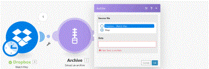

# Archive modules

In a `Adobe Workfront Fusion` scenario, you can connect an archive, such as a zipped file, to multiple third-party applications and services.

<!--
For example, you can configure a scenario that
-->

If you need instructions on creating a scenario, see [Create a scenario](../../workfront-fusion/scenarios/create-a-scenario.md). For information about modules, see [Modules in Adobe Workfront Fusion](../../workfront-fusion/modules/modules.md).

## Archive modules and their fields

When you configure `Archive` modules, `Workfront Fusion` displays the fields listed below. Along with these, additional `Archive` fields might display, depending on factors such as your access level in the app or service. A bolded title in a module indicates a required field.

If you see the map button above a field or function, you can use it to set variables and functions for that field. For more information, see [Map information from one module to another](../../workfront-fusion/mapping/map-information-between-modules.md).

* [Extract an archive](#extract) 
* [Create an archive](#create) 
* [Inflate](#inflate) 
* [Deflate](#deflate)

## Extract an archive

This action module `extracts a file you identify from an archive`.

The module returns the ID of the  `file` and any associated fields, along with any custom fields and values that the connection accesses. You can map `this information` in subsequent modules in the scenario.

<table cellspacing="15"> 
 <col> 
 <col> 
 <tbody> 
  <tr> 
   <td>Source file</td> 
   <td> 
 Select the file you want to extract. This file can be mapped from a previous module (such as Dropbox, Gmail, and so on.)
 
  
 </td> 
  </tr> 
 </tbody> 
</table>

` `**Example: **`` Get the ZIP file from the defined Dropbox folder (for example, Archives), extract it using the Archive module and send extracted files to the desired email address as attachments with the Email or Gmail module.

## Create an archive

This aggregator module adds the desired files to a ZIP or TAR archive.

When you are configuring this module, the following fields display.

<table cellspacing="15"> 
 <col> 
 <col> 
 <tbody> 
  <tr> 
   <td>Source module</td> 
   <td> 
 Select the module you want to retrieve the files from.
 </td> 
  </tr> 
  <tr> 
   <td>Type </td> 
   <td> 
Select whether you want to add files to a ZIP archive or a TAR archive.
 </td> 
  </tr> 
  <tr> 
   <td>Comment</td> 
   <td>Enter a comment that you would like to add to the archive.</td> 
  </tr> 
  <tr> 
   <td>Group by</td> 
   <td> 
Define an expression that you want to group the aggregated output by. This expression can contain one or more mapped items. The aggregated data will be then separated into groups using this expression's value. Each group outputs as a separate bundle with a key (the evaluated expression) and a value (the aggregated text). You can use the key as a filter in subsequent modules.
 </td> 
  </tr> 
  <tr> 
   <td>Stop processing after an empty aggregation</td> 
   <td>Select this option to stop the scenario when there are no results.</td> 
  </tr> 
  <tr> 
   <td>Archive name</td> 
   <td> 
 Enter a name for the created archive. Do not add an extension.
 </td> 
  </tr> 
  <tr> 
   <td>Source file</td> 
   <td> 
Select a source file from a previous module, or map the source file's name and data.
 </td> 
  </tr> 
 </tbody> 
</table>

` `**Example: **`` Watch incoming emails using the Gmail > Watch emails module. If an email is received, its attachments are iterated into individual bundles then archived to the ZIP file and saved to the defined Dropbox folder.

## Inflate

This transformer module decompresses binary data using an inflation algorithm.

<table cellspacing="15"> 
 <col> 
 <col> 
 <tbody> 
  <tr> 
   <td>Data </td> 
   <td> 
Enter or map the data you want to decompress using the inflate function.
 </td> 
  </tr> 
 </tbody> 
</table>

## Deflate

This transformer module compresses binary data using a deflation algorithm.

<table cellspacing="15"> 
 <col> 
 <col> 
 <tbody> 
  <tr> 
   <td>Data </td> 
   <td> 
Enter or map the data you want to compress using the deflate function.
 </td> 
  </tr> 
 </tbody> 
</table>

