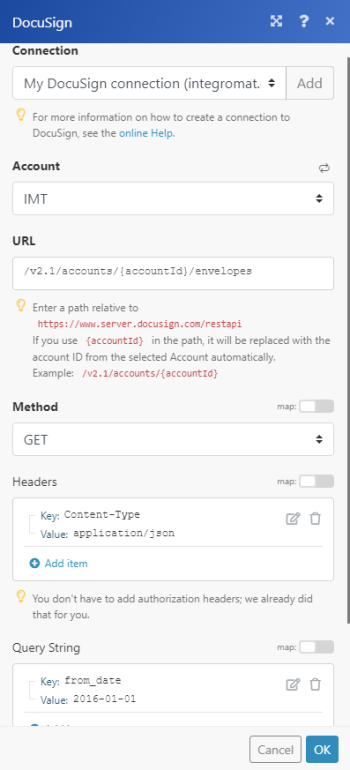
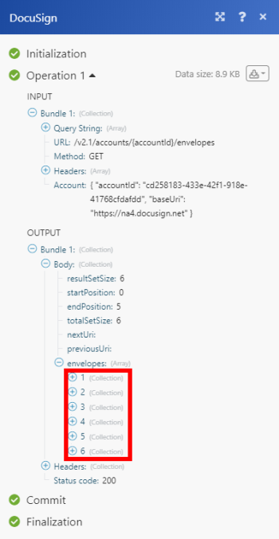

# DocuSign modules

The DocuSign modules enable you to monitor and retrieve envelope status, search and retrieve envelopes, or download and send a document to sign in your DocuSign account.

If you need instructions on creating a scenario, see [Create a scenario](../../workfront-fusion/scenarios/create-a-scenario.md).

For information about modules, see [Modules in Adobe Workfront Fusion](../../workfront-fusion/modules/modules.md).

## Access requirements

You must have the following access to use the functionality in this article:

<table cellspacing="0"> 
 <col> 
 <col> 
 <tbody> 
  <tr> 
   <td role="rowheader"><em>Adobe Workfront</em> plan*</td> 
   <td> <p><em>Pro</em> or higher</p> </td> 
  </tr> <draft-comment>
   <tr data-mc-conditions=""> 
    <td role="rowheader"><em>Adobe Workfront</em> license*</td> 
    <td> <p>Plan, Work</p> </td> 
   </tr>
  </draft-comment>
  <tr data-mc-conditions=""> 
   <td role="rowheader"><em>Adobe Workfront</em> license*</td> 
   <td> <p>Plan, Work</p> </td> 
  </tr> 
  <tr> 
   <td role="rowheader"><em>Adobe Workfront Fusion</em> license**</td> 
   <td> <p><em>Workfront Fusion for Work Automation and Integration</em> </p> </td> 
  </tr> 
  <tr> 
   <td role="rowheader">Product</td> 
   <td>Your organization must purchase <em>Adobe Workfront Fusion</em> as well as <em>Adobe Workfront</em> to use functionality described in this article.</td> 
  </tr> <draft-comment>
   <tr data-mc-conditions="QuicksilverOrClassic.Draft mode"> 
    <td role="rowheader">Access level configurations*</td> 
    <td> <draft-comment>
      <p data-mc-conditions="QuicksilverOrClassic.Draft mode">You must be a <em>Workfront Fusion</em> administrator for your organization.</p>
     </draft-comment><p data-mc-conditions="QuicksilverOrClassic.Draft mode">You must be a <em>Workfront Fusion</em> administrator for your organization.</p> <draft-comment>
      <p data-mc-conditions="QuicksilverOrClassic.Draft mode">You must be a <em>Workfront Fusion</em> administrator for your team.</p>
     </draft-comment><p data-mc-conditions="QuicksilverOrClassic.Draft mode">You must be a <em>Workfront Fusion</em> administrator for your team.</p> </td> 
   </tr>
  </draft-comment>
  <tr data-mc-conditions="QuicksilverOrClassic.Draft mode"> 
   <td role="rowheader">Access level configurations*</td> 
   <td> <p data-mc-conditions="QuicksilverOrClassic.Draft mode">You must be a <em>Workfront Fusion</em> administrator for your organization.</p> <p data-mc-conditions="QuicksilverOrClassic.Draft mode">You must be a <em>Workfront Fusion</em> administrator for your team.</p> </td> 
  </tr> 
 </tbody> 
</table>

&#42;To find out what plan, license type, or access you have, contact your *Workfront administrator*.

&#42;&#42;For information on *Adobe Workfront Fusion* licenses, see [Adobe Workfront Fusion licenses](../../workfront-fusion/get-started/license-automation-vs-integration.md)

## Prerequisites

To use DocuSign modules, you must have a DocuSign account.

## Connect DocuSign to *Workfront Fusion*

To create a connection for your DocuSign modules:

<ol> 
 <li value="1">Click <span class="bold">Add</span> next to the Connection box when you begin configuring the first DocuSign module.</li> 
 <li value="2"> <p>Enter the following:</p> 
  <table cellspacing="0"> 
   <col> 
   <col> 
   <tbody> 
    <tr> 
     <td role="rowheader"> <p>Connection name</p> </td> 
     <td>Enter a name for the new DocuSign connection</td> 
    </tr> 
    <tr> 
     <td role="rowheader">Account type</td> 
     <td>Select whether you the account you want to connect to is a production account or a demo account.</td> 
    </tr> 
   </tbody> 
  </table> </li> 
 <li value="3">Continue as described in <a href="../../workfront-fusion/connections/connect-to-fusion-general.md#connect" class="MCXref xref">Create a connection to Workfront Fusion - Basic instructions</a>.</li> 
</ol>

## DocuSign modules and their fields

When you configure *DocuSign* modules, *Workfront Fusion* displays the fields listed below. Along with these, additional *DocuSign* fields might display, depending on factors such as your access level in the app or service. A bolded title in a module indicates a required field.

If you see the map button above a field or function, you can use it to set variables and functions for that field. For more information, see [Map information from one module to another](../../workfront-fusion/mapping/map-information-between-modules.md).


* [Triggers](#triggers) 
* [Actions](#actions)

### Triggers

#### Watch envelopes

This trigger module starts a scenario when an envelope is sent, delivered, signed, completed, or declined.

<table cellspacing="0"> <draft-comment>
  <col data-mc-conditions="">
 </draft-comment>
 <col data-mc-conditions=""> <draft-comment>
  <col data-mc-conditions="">
 </draft-comment>
 <col data-mc-conditions=""> 
 <tbody> 
  <tr> 
   <td role="rowheader">Connection </td> 
   <td> <p>For instructions about connecting your DocuSign account to <em>Workfront Fusion</em>, see <a href="../../workfront-fusion/scenarios/create-a-scenario.md#connect" class="MCXref xref">Connect the module's app or web service to Workfront Fusion</a> in the article <a href="../../workfront-fusion/scenarios/create-a-scenario.md" class="MCXref xref">Create a scenario</a>.</p> </td> 
  </tr> 
  <tr> 
   <td role="rowheader">Account </td> 
   <td> <p>Select the account that contains the records you want to watch.</p> </td> 
  </tr> 
  <tr> 
   <td role="rowheader">Event type</td> 
   <td> <p> Select the type of event that you want to watch.</p> 
    <ul> 
     <li>Document completed</li> 
     <li>Document declined</li> 
     <li>Document sent</li> 
     <li>Document signed</li> 
     <li>New document in Inbox</li> 
    </ul> </td> 
  </tr> 
  <tr> 
   <td role="rowheader"> <p>Output fields</p> </td> 
   <td> <p>Select the fields that you want to include in the module output.</p> </td> 
  </tr> 
  <tr> 
   <td role="rowheader">Limit</td> 
   <td>Enter or map the maximum number of <em>record</em>s you want the module to <em>work with</em> during each scenario execution cycle.</td> 
  </tr> 
 </tbody> 
</table>

### Actions

* [Custom API Call](#custom) 
* [Download a document](#download) 
* [Read an envelope](#read) 
* [Upload a file to an envelope](#upload) 
* [Create a new envelope](#create) 
* [Add Recipient to Envelope](#add) 
* [Add custom field](#add2) 
* [Modify custom field](#modify) 
* [Send envelope](#send)

#### Custom API Call

This action module allows you to perform a custom API call.

<table> 
 <col> 
 <col> 
 <tbody> 
  <tr> 
   <td>Connection</td> 
   <td> <p>For instructions about connecting your DocuSign account to <em>Workfront Fusion</em>, see <a href="#connect" class="MCXref xref">Connect DocuSign to Workfront Fusion</a> in this article.</p> </td> 
  </tr> 
  <tr> 
   <td>Account</td> 
   <td>Enter or map the account that you want to use to access the DocuSign API.</td> 
  </tr> 
  <tr> 
   <td>URL</td> 
   <td> <p>Type the address on the web server that you want the module to interact with.</p> <p>You can type a relative URL, which means that you don’t have to include the protocol (such as <code>http://</code>) at the beginning. This suggests to the web server that the interaction is occurring on the server.</p> <p>For example: <code>/api/conversations.create</code></p> <p>Tip: For a list of available endpoints, see the <a href="https://developers.docusign.com/esign-rest-api/reference">DocuSign API Reference</a>.</p> </td> 
  </tr> 
  <tr> 
   <td>Method</td> 
   <td> <p>Select the HTTP request method you need to configure the API call. For more information, see <a href="../../workfront-fusion/modules/http-request-methods.md" class="MCXref xref" data-mc-variable-override="">HTTP request methods</a>.</p> </td> 
  </tr> 
  <tr> 
   <td>Headers</td> 
   <td> <p>Add the headers of the request in the form of a standard JSON object. This determines the content type of the request.</p> <p>For example,<code> {“Content-type”:“application/json”}</code></p> <p>Note: If you’re getting errors and it's difficult to determine their origin, consider modifying headers based on the Workfront documentation. If your Custom API Call returns a 422 HTTP Request Error, try using a “Content-Type”:“text/plain” header.</p> </td> 
  </tr> 
  <tr> 
   <td>Query String</td> 
   <td> <p>Add the query for the API call in the form of a standard JSON object.</p> <p>For example: <code>{“name”:“something-urgent”}</code></p> </td> 
  </tr> 
  <tr> 
   <td>Body</td> 
   <td> <p>Add the body content for the API call in the form of a standard JSON object.</p> <p>Note:  <p>When using conditional statements such as <code>if</code> in your JSON, put the quotation marks outside of the conditional statement.</p> 
     <div class="example" data-mc-autonum="<b>Example: </b>"> 
      <p>  </p> 
     </div> </p> </td> 
  </tr> 
  <tr> 
   <td>Limit</td> 
   <td>Enter or map the maximum number of results to be worked with during one execution cycle.</td> 
  </tr> 
 </tbody> 
</table>

` `**Example: **`` List Envelopes

The following API call returns envelopes from the specified date in your DocuSign account:

`URL`:
<pre>/v2.1/accounts/{accountId}/envelopes/</pre>`Method`:
<pre>GET</pre>`Query String`:

`Key`:

```
from_date
```

`Value`: 

```
YYYY-MM-DD
```

Specifies when the request begins checking for status changes for envelopes in the account.



The result can be found in the module's Output under Bundle > Body > envelopes.

In our example, 6 envelopes were returned:



#### Download a document

This action module downloads a single document.

<table cellspacing="0"> 
 <col> 
 <col> 
 <tbody> 
  <tr> 
   <td role="rowheader">Connection</td> 
   <td> <p>For instructions about connecting your DocuSign account to <em>Workfront Fusion</em>, see <a href="#connect" class="MCXref xref">Connect DocuSign to Workfront Fusion</a> in this article.</p> </td> 
  </tr> 
  <tr> 
   <td role="rowheader">Account </td> 
   <td> <p>Select the account that contains the document you want to download.</p> </td> 
  </tr> 
  <tr> 
   <td role="rowheader">Envelope ID</td> 
   <td> <p> Enter or map the ID of the envelope you want to download.</p> </td> 
  </tr> 
  <tr> 
   <td role="rowheader"> <p>Document ID</p> </td> 
   <td> <p>Enter or map the ID of the document you want to download.</p> </td> 
  </tr> 
  <tr> 
   <td role="rowheader">Certificate</td> 
   <td>Select <span class="bold">Yes</span> if you want to include the envelope signing certificate in the download.</td> 
  </tr> 
  <tr> 
   <td role="rowheader">Documents by User ID</td> 
   <td>Select <span class="bold">Yes</span> if you want to allow recipients to retrieve documentx by User ID. For example, if a user is included in two different routing orders with different visibilities, using this option returns all of the documents from both routings.</td> 
  </tr> 
  <tr> 
   <td role="rowheader">Encrypt</td> 
   <td>Select <span class="bold">Yes</span> if you want the PDF bytes returned in the response to be encrypted for all the key managers configured on your DocuSign account.</td> 
  </tr> 
  <tr> 
   <td role="rowheader">Language</td> 
   <td>Select the language.</td> 
  </tr> 
  <tr> 
   <td role="rowheader">Show Changes</td> 
   <td>When set to <span class="bold">Yes</span>, any changed fields for the returned PDF are highlighted in yellow and optional signatures or initials are outlined in red.</td> 
  </tr> 
  <tr> 
   <td role="rowheader">Watermark</td> 
   <td> <p>Select <span class="bold">No </span>to remove the watermark from the PDF&nbsp;documents.</p> </td> 
  </tr> 
 </tbody> 
</table>

#### Read an envelope

This action module reads information about an envelope in DocuSign using the envelope ID.

<table cellspacing="0"> 
 <col> 
 <col> 
 <tbody> 
  <tr> 
   <td role="rowheader">Connection</td> 
   <td> <p>For instructions about connecting your DocuSign account to <em>Workfront Fusion</em>, see <a href="#connect" class="MCXref xref">Connect DocuSign to Workfront Fusion</a> in this article.</p> </td> 
  </tr> 
  <tr> 
   <td role="rowheader">Account </td> 
   <td> <p>Select the account that contains the document you want to read information from.</p> </td> 
  </tr> 
  <tr> 
   <td role="rowheader">Envelope ID</td> 
   <td> <p> Enter or map the ID contains the document you want to read information from.</p> </td> 
  </tr> 
  <tr> 
   <td role="rowheader">Outputs</td> 
   <td>Select the properties that you want to appear in the module's output. </td> 
  </tr> 
 </tbody> 
</table>

#### Upload a file to an envelope

This module uploads a specified file to an existing envelope in DocuSign.

<table cellspacing="0"> 
 <col> 
 <col> 
 <tbody> 
  <tr> 
   <td role="rowheader">Connection</td> 
   <td> <p>For instructions about connecting your DocuSign account to <em>Workfront Fusion</em>, see <a href="#connect" class="MCXref xref">Connect DocuSign to Workfront Fusion</a> in this article.</p> </td> 
  </tr> 
  <tr> 
   <td role="rowheader">Account </td> 
   <td> <p>Select the account that contains the envelope where you want to upload a file.</p> </td> 
  </tr> 
  <tr> 
   <td role="rowheader">Envelope ID</td> 
   <td> <p> Enter or map the ID of the envelope where you want to upload a file.</p> </td> 
  </tr> 
  <tr> 
   <td role="rowheader">Source file</td> 
   <td>Select a source file from a previous module, or enter the source file's name and data.</td> 
  </tr> 
 </tbody> 
</table>

#### Create a new envelope

This action module creates a new envelope from a template. It returns the new envelope's ID, as well as the status of the new envelope.

<table cellspacing="0"> <draft-comment>
  <col data-mc-conditions="">
 </draft-comment>
 <col data-mc-conditions=""> <draft-comment>
  <col data-mc-conditions="">
 </draft-comment>
 <col data-mc-conditions=""> 
 <tbody> 
  <tr> <draft-comment>
    <td role="rowheader" data-mc-conditions="QuicksilverOrClassic.Draft mode">Connection </td>
   </draft-comment>
   <td role="rowheader" data-mc-conditions="QuicksilverOrClassic.Draft mode">Connection </td> 
   <td> <p>For instructions about connecting your DocuSign account to <em>Workfront Fusion</em>, see <a href="../../workfront-fusion/scenarios/create-a-scenario.md#connect" class="MCXref xref">Connect the module's app or web service to Workfront Fusion</a> in the article <a href="../../workfront-fusion/scenarios/create-a-scenario.md" class="MCXref xref">Create a scenario</a>.</p> </td> 
  </tr> 
  <tr> <draft-comment>
    <td role="rowheader" data-mc-conditions="QuicksilverOrClassic.Draft mode">Account </td>
   </draft-comment>
   <td role="rowheader" data-mc-conditions="QuicksilverOrClassic.Draft mode">Account </td> 
   <td> <p>Select the account that contains the envelope where you want to upload a file.</p> </td> 
  </tr> 
  <tr> <draft-comment>
    <td role="rowheader" data-mc-conditions="QuicksilverOrClassic.Draft mode">Template</td>
   </draft-comment>
   <td role="rowheader" data-mc-conditions="QuicksilverOrClassic.Draft mode">Template</td> 
   <td> <p> Select the template that you want to create the new envelope from. Templates are available based on the Account you selected.</p> </td> 
  </tr> 
  <tr> 
   <td role="rowheader"> <draft-comment>
     <p data-mc-conditions="QuicksilverOrClassic.Draft mode">After creation</p>
    </draft-comment><p data-mc-conditions="QuicksilverOrClassic.Draft mode">After creation</p> </td> 
   <td> <p>Select whether you want to save the envelope as a draft or send it for signing.</p> </td> 
  </tr> 
  <tr> <draft-comment>
    <td role="rowheader" data-mc-conditions="QuicksilverOrClassic.Draft mode">Template recipients</td>
   </draft-comment>
   <td role="rowheader" data-mc-conditions="QuicksilverOrClassic.Draft mode">Template recipients</td> <draft-comment>
    <td data-mc-conditions="QuicksilverOrClassic.Draft mode">Select the recipient of this envelope</td>
   </draft-comment>
   <td data-mc-conditions="QuicksilverOrClassic.Draft mode">Select the recipient of this envelope</td> 
  </tr> 
 </tbody> 
</table>

#### Add Recipient to Envelope

This action module adds one or more recipients to an existing envelope. If the envelope has already been sent, the recipient is sent an email. This module is not valid for envelopes that have already been completed.

<table cellspacing="0"> <draft-comment>
  <col data-mc-conditions="">
 </draft-comment>
 <col data-mc-conditions=""> <draft-comment>
  <col data-mc-conditions="">
 </draft-comment>
 <col data-mc-conditions=""> 
 <tbody> <draft-comment>
   <tr data-mc-conditions=""> <draft-comment>
     <td role="rowheader" data-mc-conditions="QuicksilverOrClassic.Draft mode">Connection </td>
    </draft-comment>
    <td role="rowheader" data-mc-conditions="QuicksilverOrClassic.Draft mode">Connection </td> 
    <td> <p>For instructions about connecting your DocuSign account to <em>Workfront Fusion</em>, see <a href="../../workfront-fusion/scenarios/create-a-scenario.md#connect" class="MCXref xref">Connect the module's app or web service to Workfront Fusion</a> in the article <a href="../../workfront-fusion/scenarios/create-a-scenario.md" class="MCXref xref">Create a scenario</a>.</p> </td> 
   </tr>
  </draft-comment>
  <tr data-mc-conditions=""> 
   <td role="rowheader" data-mc-conditions="QuicksilverOrClassic.Draft mode">Connection </td> 
   <td> <p>For instructions about connecting your DocuSign account to <em>Workfront Fusion</em>, see <a href="../../workfront-fusion/scenarios/create-a-scenario.md#connect" class="MCXref xref">Connect the module's app or web service to Workfront Fusion</a> in the article <a href="../../workfront-fusion/scenarios/create-a-scenario.md" class="MCXref xref">Create a scenario</a>.</p> </td> 
  </tr> <draft-comment>
   <tr data-mc-conditions=""> <draft-comment>
     <td role="rowheader" data-mc-conditions="QuicksilverOrClassic.Draft mode">Account </td>
    </draft-comment>
    <td role="rowheader" data-mc-conditions="QuicksilverOrClassic.Draft mode">Account </td> 
    <td> <p>Select the account that contains the envelope where you want add recipients.</p> </td> 
   </tr>
  </draft-comment>
  <tr data-mc-conditions=""> 
   <td role="rowheader" data-mc-conditions="QuicksilverOrClassic.Draft mode">Account </td> 
   <td> <p>Select the account that contains the envelope where you want add recipients.</p> </td> 
  </tr> 
  <tr> <draft-comment>
    <td role="rowheader" data-mc-conditions="QuicksilverOrClassic.Draft mode">Envelope ID</td>
   </draft-comment>
   <td role="rowheader" data-mc-conditions="QuicksilverOrClassic.Draft mode">Envelope ID</td> <draft-comment>
    <td data-mc-conditions="QuicksilverOrClassic.Draft mode">Select the or map the ID of the envelope where you want to add the recipient.</td>
   </draft-comment>
   <td data-mc-conditions="QuicksilverOrClassic.Draft mode">Select the or map the ID of the envelope where you want to add the recipient.</td> 
  </tr> <draft-comment>
   <tr data-mc-conditions=""> <draft-comment>
     <td role="rowheader" data-mc-conditions="QuicksilverOrClassic.Draft mode">Recipient type</td>
    </draft-comment>
    <td role="rowheader" data-mc-conditions="QuicksilverOrClassic.Draft mode">Recipient type</td> 
    <td> <p> Select the type of recipient that you want to add to the envelope.</p> 
     <ul> 
      <li> <p>Agent</p> </li> 
      <li> <p>Carbon copy</p> </li> 
      <li> <p>Certified delivery</p> </li> 
      <li> <p>In-person signer</p> </li> 
      <li> <p>Intermediary</p> </li> 
      <li> <p>Signer</p> </li> 
     </ul> </td> 
   </tr>
  </draft-comment>
  <tr data-mc-conditions=""> 
   <td role="rowheader" data-mc-conditions="QuicksilverOrClassic.Draft mode">Recipient type</td> 
   <td> <p> Select the type of recipient that you want to add to the envelope.</p> 
    <ul> 
     <li> <p>Agent</p> </li> 
     <li> <p>Carbon copy</p> </li> 
     <li> <p>Certified delivery</p> </li> 
     <li> <p>In-person signer</p> </li> 
     <li> <p>Intermediary</p> </li> 
     <li> <p>Signer</p> </li> 
    </ul> </td> 
  </tr> 
  <tr> <draft-comment>
    <td role="rowheader" data-mc-conditions="QuicksilverOrClassic.Draft mode"> <p>Email</p> </td>
   </draft-comment>
   <td role="rowheader" data-mc-conditions="QuicksilverOrClassic.Draft mode"> <p>Email</p> </td> 
   <td> <p>Enter or map the email address of the recipient you want to add to the envelope.</p> </td> 
  </tr> 
  <tr> <draft-comment>
    <td role="rowheader" data-mc-conditions="QuicksilverOrClassic.Draft mode"> <p>Name</p> </td>
   </draft-comment>
   <td role="rowheader" data-mc-conditions="QuicksilverOrClassic.Draft mode"> <p>Name</p> </td> 
   <td>Enter or map the name of the recipient you want to add to the envelope.</td> 
  </tr> 
  <tr> <draft-comment>
    <td role="rowheader" data-mc-conditions="QuicksilverOrClassic.Draft mode"> <p>Routing order</p> </td>
   </draft-comment>
   <td role="rowheader" data-mc-conditions="QuicksilverOrClassic.Draft mode"> <p>Routing order</p> </td> 
   <td> <p>Enter or map the routing number for the recipient. Routing number determines the order in which recipients receive and sign your documents.</p> </td> 
  </tr> 
  <tr> <draft-comment>
    <td role="rowheader" data-mc-conditions="QuicksilverOrClassic.Draft mode"> <li> <p>Email body</p> </li> </td>
   </draft-comment>
   <td role="rowheader" data-mc-conditions="QuicksilverOrClassic.Draft mode"> <li> <p>Email body</p> </li> </td> 
   <td>Enter or map the body (content) of the email is sent to the recipent.</td> 
  </tr> 
  <tr> <draft-comment>
    <td role="rowheader" data-mc-conditions="QuicksilverOrClassic.Draft mode"> <li> <p>Email subject</p> </li> </td>
   </draft-comment>
   <td role="rowheader" data-mc-conditions="QuicksilverOrClassic.Draft mode"> <li> <p>Email subject</p> </li> </td> 
   <td>Enter or map the subject of the email that is sent to the recipient.</td> 
  </tr> 
  <tr> <draft-comment>
    <td role="rowheader" data-mc-conditions="QuicksilverOrClassic.Draft mode"> <p>Private message</p> </td>
   </draft-comment>
   <td role="rowheader" data-mc-conditions="QuicksilverOrClassic.Draft mode"> <p>Private message</p> </td> 
   <td> <li> <p>Only the selected recipient sees the private message, as well as the general message. The private message is limited to 1000 characters.</p> </li> </td> 
  </tr> 
  <tr> 
   <td role="rowheader"> <draft-comment>
     <p data-mc-conditions="QuicksilverOrClassic.Draft mode">Authentication</p>
    </draft-comment><p data-mc-conditions="QuicksilverOrClassic.Draft mode">Authentication</p> </td> 
   <td> <p>Select the authentication method that you want to use to confirm the recipient's identity.</p> 
    <ul> 
     <li> <p><span class="bold">None</span> </p> </li> 
     <li> <p><span class="bold">Access code</span> </p> <p>Enter or map the access code.</p> </li> 
     <li> <p><span class="bold">Phone</span> </p> <p>Enter or map the phone number</p> </li> 
     <li> <p><span class="bold">SMS</span> </p> <p>Enter or map the phone number</p> </li> 
    </ul> </td> 
  </tr> 
 </tbody> 
</table>

#### Add custom field

This action module adds a custom field to the document

<table cellspacing="0"> 
 <col> 
 <col> 
 <tbody> 
  <tr> 
   <td role="rowheader">Connection</td> 
   <td> <p>For instructions about connecting your DocuSign account to <em>Workfront Fusion</em>, see <a href="#connect" class="MCXref xref">Connect DocuSign to Workfront Fusion</a> in this article.</p> </td> 
  </tr> 
  <tr> 
   <td role="rowheader">Account </td> 
   <td> <p>Select the account that contains the document where you want to add a custom field.</p> </td> 
  </tr> 
  <tr> 
   <td role="rowheader">Envelope ID</td> 
   <td> <p> Enter or map the ID of the envelope that contains the document where you want to add a custom field.</p> </td> 
  </tr> 
  <tr> 
   <td role="rowheader">Field name</td> 
   <td>Enter or map a name for the new field that you want to add.</td> 
  </tr> 
  <tr> 
   <td role="rowheader">Required</td> 
   <td>Enable this option if you want the added field to be a required field.</td> 
  </tr> 
  <tr> 
   <td role="rowheader">Show field</td> 
   <td>Enable this option if you want the field to be visible.</td> 
  </tr> 
  <tr> 
   <td role="rowheader">Value</td> 
   <td>Enter or map the value (contents) of the added field. </td> 
  </tr> 
 </tbody> 
</table>

#### Modify custom field

This action module modifies a custom field using the field name.

<table cellspacing="0"> 
 <col> 
 <col> 
 <tbody> 
  <tr> 
   <td role="rowheader">Connection</td> 
   <td> <p>For instructions about connecting your DocuSign account to <em>Workfront Fusion</em>, see <a href="#connect" class="MCXref xref">Connect DocuSign to Workfront Fusion</a> in this article.</p> </td> 
  </tr> 
  <tr> 
   <td role="rowheader">Account </td> 
   <td> <p>Select the account that contains the document where you want to modify a custom field.</p> </td> 
  </tr> 
  <tr> 
   <td role="rowheader">Envelope ID</td> 
   <td> <p> Enter or map the ID of the envelope that contains the document where you want to modify a custom field.</p> </td> 
  </tr> 
  <tr> 
   <td role="rowheader">Field ID</td> 
   <td>Enter or map the ID&nbsp;of the field you want to modify.</td> 
  </tr> 
  <tr> 
   <td role="rowheader">Field name</td> 
   <td>Enter or map the name of the field you want to modify.</td> 
  </tr> 
  <tr> 
   <td role="rowheader">Required</td> 
   <td>Enable this option if you want the modified field to be a required field.</td> 
  </tr> 
  <tr> 
   <td role="rowheader">Show field</td> 
   <td>Enable this option if you want the field to be visible.</td> 
  </tr> 
  <tr> 
   <td role="rowheader">Value</td> 
   <td>Enter or map the value (contents) of the modified field. </td> 
  </tr> 
 </tbody> 
</table>

#### Send envelope

This action module sends a draft envelope to its recipients.

<table cellspacing="0"> 
 <col> 
 <col> 
 <tbody> 
  <tr> 
   <td role="rowheader">Connection</td> 
   <td> <p>For instructions about connecting your DocuSign account to <em>Workfront Fusion</em>, see <a href="#connect" class="MCXref xref">Connect DocuSign to Workfront Fusion</a> in this article.</p> </td> 
  </tr> 
  <tr> 
   <td role="rowheader">Account </td> 
   <td> <p>Select the account that contains the draft envelope that you want to send to its recipients.</p> </td> 
  </tr> 
  <tr> 
   <td role="rowheader">Envelope ID</td> 
   <td> <p> Enter or map the ID of the draft envelope that you want to send to its recipients.</p> </td> 
  </tr> 
 </tbody> 
</table>

&nbsp;
