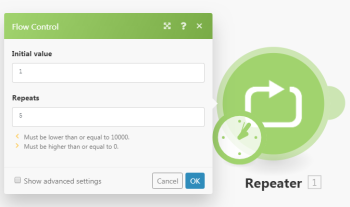

# Flow control

When you are creating or editing a scenario, you can configure settings to control the way data flows through it.

## Access requirements

You must have the following access to use the functionality in this article:

<table cellspacing="0"> 
 <col> 
 <col> 
 <tbody> 
  <tr> 
   <td role="rowheader"><span>Adobe Workfront</span> plan*</td> 
   <td> <p><span>Pro</span> or higher</p> </td> 
  </tr> Adobe Workfront license* Plan, Work 
  <tr> 
   <td role="rowheader"><span>Adobe Workfront Fusion</span> license**</td> 
   <td> <p><span>Workfront Fusion for Work Automation and Integration</span> </p>  </td> 
  </tr> 
  <tr> 
   <td role="rowheader">Product</td> 
   <td>Your organization must purchase <span>Adobe Workfront Fusion</span> as well as <span>Adobe Workfront</span> to use functionality described in this article.</td> 
  </tr> <!--
   Access level configurations* You must be a Workfront Fusion administrator for your organization. You must be a Workfront Fusion administrator for your team.
  --> 
 </tbody> 
</table>

&#42;To find out what plan, license type, or access you have, contact your `Workfront administrator`.

&#42;&#42;For information on `Adobe Workfront Fusion` licenses, see [Adobe Workfront Fusion licenses](../../workfront-fusion/get-started/license-automation-vs-integration.md)

## Repeater

You can use a Repeater module to repeat a task a given number of times. A Repeater module generates bundles, one after another.

For example, you could use a Repeater module to send five emails with the subjects "Hello 1," "Hello 2," and so on, by connecting the `Email > Send me an email` module to the Repeater module.

To use a Repeater module:

<ol> 
 <li value="1"> <p>Click the Flow Control icon  at the bottom of the screen, then click <span class="bold">Repeater</span> in the menu that displays.</p> </li> 
 <li value="2"> <p> Click the Repeater bundle, then click <span class="bold">Connect automatically</span> in the box that displays.</p> </li> 
 <li value="3"> <p>In the Flow Control box that appears, type the number of repetitions (outputted bundles) you want in the <span class="bold">Repeats</span> box.</p> <p>In our email example, you would type 5.</p> <p>  </p> <p>The value of the item increases in each repetition by this value specified in the <span class="bold">Step</span> field, which you can view by selecting <span class="bold">Show advanced settings</span>. This number is 1 by default.</p> </li> 
 <li value="4">Click <span class="bold">OK</span> to close the <span class="bold">Flow Control</span> box.</li> 
 <li value="5">Click the app or service module connected to the Repeater module.</li> 
 <li value="6"> <p>In the box that appears, type the information that you want to repeat.</p> <p>In our email example, you would type Hello in the Subject box, then map <code>i</code> from the repeater module.</p> <p>  </p> </li> 
</ol>

| Initial value |Enter or map the number that you want the module to set as 

```
i
```

in the first iteration. The default value is 1. |
|---|---|
| Repeats |Enter or map the number of times that you want the module to repeat. This number must be greater than or equal to 0, and less than or equal to 10,000. |
| Step |This is the number by which the module increases the value of 

```
i
```

. The default value is 1. |

>[!NOTE]
>
>The number of repeats is not determined by the value of >
>```>
>i
>```>
>, as it would be in a loop in programming. The module will repeat the number of times indicated in the Repeats field. The value >
>```>
>i
>```>
>changes with each iteration of the repeater module, and can be mapped to later modules. The example above maps the value of >
>```>
>i
>```>
>into the Hello message, resulting in messages that read "Hello 1," Hello 2," and so on.

## Iterator

An Iterator is a special type of module that converts an array into a series of bundles. Each array item will be a separate bundle in the Iterator module output. For more information, see [Iterator module](../../workfront-fusion/modules/iterator-module.md).

## Array aggregator

An array aggregator is a special type of module which allows to merge several bundles into one single bundle. For more information, see [Aggregator module](../../workfront-fusion/modules/aggregator-module.md).

## Router

The Router module allows you to branch your flow into several routes and process the data within each route differently. Once a Router module receives a bundle, it forwards it to each connected route in the order the routes were attached to the Router module. For more information, see [Router module](../../workfront-fusion/modules/router-module.md).

<!--
Directives The error handling directives allow you to control how your scenario reacts to errors. For more information, see Advanced error handling and Directives for error handling.
-->

