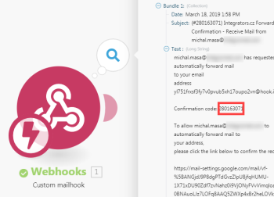

# Google Calendar modules {#google-calendar-modules}

In a *`Adobe Workfront Fusion`* scenario, you can connect your *`Google Calendar`* account to multiple third-party applications and services.


If you need instructions on creating a scenario, see [Create a scenario](create-a-scenario.md). 


For information about modules, see [Modules in Adobe Workfront Fusion](_modules.md).


## Access requirements {#access-requirements}

You must have the following access to use the functionality in this article:

<table style="width: 100%;margin-left: 0;margin-right: auto;mc-table-style: url('../../Resources/TableStyles/TableStyle-List-options-in-steps.css');" class="TableStyle-TableStyle-List-options-in-steps" cellspacing="0"> 
 <col class="TableStyle-TableStyle-List-options-in-steps-Column-Column1"> 
 <col class="TableStyle-TableStyle-List-options-in-steps-Column-Column2"> 
 <tbody> 
  <tr class="TableStyle-TableStyle-List-options-in-steps-Body-LightGray"> 
   <td class="TableStyle-TableStyle-List-options-in-steps-BodyE-Column1-LightGray" role="rowheader"><span class="mc-variable WFVariables.FullProdNameWF variable varname">Adobe Workfront</span> plan*</td> 
   <td class="TableStyle-TableStyle-List-options-in-steps-BodyD-Column2-LightGray"> <p><span class="mc-variable WFVariables.WFPlan-Pro variable varname">Pro</span> or higher</p> </td> 
  </tr> 
  <tr class="TableStyle-TableStyle-List-options-in-steps-Body-MediumGray"> 
   <td class="TableStyle-TableStyle-List-options-in-steps-BodyE-Column1-MediumGray" role="rowheader"><span class="mc-variable WFVariables.FullProdNameWFF variable varname">Adobe Workfront Fusion</span> license**</td> 
   <td class="TableStyle-TableStyle-List-options-in-steps-BodyD-Column2-MediumGray"> <p><span class="mc-variable WFVariables.WFFusionIntegration variable varname">Workfront Fusion for Work Automation and Integration</span> </p> </td> 
  </tr> 
  <tr class="TableStyle-TableStyle-List-options-in-steps-Body-LightGray"> 
   <td class="TableStyle-TableStyle-List-options-in-steps-BodyB-Column1-LightGray" role="rowheader">Product</td> 
   <td class="TableStyle-TableStyle-List-options-in-steps-BodyA-Column2-LightGray">Your organization must purchase <span class="mc-variable WFVariables.FullProdNameWFF variable varname">Adobe Workfront Fusion</span> as well as <span class="mc-variable WFVariables.FullProdNameWF variable varname">Adobe Workfront</span> to use functionality described in this article.</td> 
  </tr> 
 </tbody> 
</table>

&#42;To find out what plan, license type, or access you have, contact your *`Workfront administrator`*.


## Prerequisites {#prerequisites}

To use Google Calendar modules, you must have a Google account.


## Google Calendar modules and their fields {#google-calendar-modules-and-their-fields}

When you configure *`Google Calendar`* modules, *`Workfront Fusion`* displays the fields listed below. Along with these, additional *`Google Calendar`* fields might display, depending on factors such as your access level in the app or service. A bolded title in a module indicates a required field.


If you see the map button above a field or function, you can use it to set variables and functions for that field. For more information, see [Map information from one module to another](map-information-between-modules.md).


* [Events](#events) 
* [Calendars](#calendar) 
* [Access control rules](#access) 
* [Iterators (deprecated)](#iterator) 
* [Other](#other) 


### Events {#events}


* [Watch events](#watch) 
* [Search events](#search) 
* [Get an event](#get) 
* [Create an event](#create) 
* [Update an event](#update) 
* [Delete an event](#delete) 


#### Watch events {#watch-events}

This trigger module executes a scenario when *`a new event is added, updated, deleted, started, or ended in the calendar you specify`*. The module *`returns all standard fields associated with the record or records, along with any custom fields and values that the connection accesses`*. You can map *`this information`* in subsequent modules in the scenario.


When you are configuring this module, the following fields display`<MadCap:conditionalText data-mc-conditions="SnippetConditions.HIDE"> , along with any other available  <span class="mc-variable Snippet_Variables.Fusion-Apps variable varname">Google Calendar</span> fields, depending on the connection and options you choose</MadCap:conditionalText>`.

<table style="width: 100%;mc-table-style: url('../../Resources/TableStyles/TableStyle-HeaderRow.css');" class="TableStyle-TableStyle-HeaderRow" cellspacing="15"> 
 <col class="TableStyle-TableStyle-HeaderRow-Column-Column1"> 
 <col class="TableStyle-TableStyle-HeaderRow-Column-Column1"> 
 <tbody> 
  <tr class="TableStyle-TableStyle-HeaderRow-Body-LightGray"> 
   <td class="TableStyle-TableStyle-HeaderRow-BodyE-Column1-LightGray" style="font-weight: bold;">Connection </td> 
   <td class="TableStyle-TableStyle-HeaderRow-BodyD-Column1-LightGray"> <p>For instructions about connecting your <span class="mc-variable WFVariables.WFFusion-Apps variable varname">Google Calendar</span> account to <span class="mc-variable WFVariables.ProdNameWFF variable varname">Workfront Fusion</span>, see <a href="connect-to-fusion-general.md" class="MCXref xref" data-mc-variable-override="">Create a connection to Workfront Fusion - Basic instructions</a></p> </td> 
  </tr> 
  <tr class="TableStyle-TableStyle-HeaderRow-Body-MediumGray"> 
   <td class="TableStyle-TableStyle-HeaderRow-BodyE-Column1-MediumGray" style="font-weight: bold;">Calendar </td> 
   <td class="TableStyle-TableStyle-HeaderRow-BodyD-Column1-MediumGray"> <p>Select the calendar you want the module to work with.</p> </td> 
  </tr> 
  <tr class="TableStyle-TableStyle-HeaderRow-Body-LightGray"> 
   <td class="TableStyle-TableStyle-HeaderRow-BodyE-Column1-LightGray" style="font-weight: bold;">Watch Events</td> 
   <td class="TableStyle-TableStyle-HeaderRow-BodyD-Column1-LightGray"> <p>Choose whether you want to watch events by Created Date, Updated Date, Starting Date, or Ending Date.</p> </td> 
  </tr> 
  <tr class="TableStyle-TableStyle-HeaderRow-Body-MediumGray"> 
   <td class="TableStyle-TableStyle-HeaderRow-BodyE-Column1-MediumGray" style="font-weight: bold;">Show deleted events</td> 
   <td class="TableStyle-TableStyle-HeaderRow-BodyD-Column1-MediumGray"> <p>Enable this option to include events that were deleted.</p> </td> 
  </tr> 
  <tr class="TableStyle-TableStyle-HeaderRow-Body-LightGray"> 
   <td class="TableStyle-TableStyle-HeaderRow-BodyE-Column1-LightGray" style="font-weight: bold;">Query </td> 
   <td class="TableStyle-TableStyle-HeaderRow-BodyD-Column1-LightGray"> <p>Enter text that you want to search for.</p> </td> 
  </tr> 
  <tr class="TableStyle-TableStyle-HeaderRow-Body-MediumGray"> 
   <td class="TableStyle-TableStyle-HeaderRow-BodyB-Column1-MediumGray" style="font-weight: bold;">Limit</td> 
   <td class="TableStyle-TableStyle-HeaderRow-BodyA-Column1-MediumGray"> <p> Set the maximum number of events that <span class="mc-variable WFVariables.ProdNameWFF variable varname">Workfront Fusion</span> works with during one cycle (the number of repetitions per scenario run). If the value is set too high, the connection may be interrupted on the side of the given third-party service (timeout). <span class="mc-variable WFVariables.ProdNameWFF variable varname">Workfront Fusion</span> has no influence on this. We recommend that you set a lower value and either define a higher value for the maximum number of cycles or run the scenario more frequently.</p> </td> 
  </tr> 
 </tbody> 
</table>


#### Search events {#search-events}

This action module *`searches for an event in the selected calendar`*`<MadCap:conditionalText data-mc-conditions="SnippetConditions.HIDE">  in  <span class="mc-variable Snippet_Variables.Fusion-Apps variable varname">Google Calendar</span></MadCap:conditionalText>`.


You specify the calendar and the parameters of the search.


The module returns the ID of the `<MadCap:conditionalText data-mc-conditions="SnippetConditions.HIDE">  <span class="mc-variable Snippet_Variables.FusionAction variable varname">[action]</span></MadCap:conditionalText>` *`event`* and any associated fields, along with any custom fields and values that the connection accesses. You can map *`this information`* in subsequent modules in the scenario.


When you are configuring this module, the following fields display`<MadCap:conditionalText data-mc-conditions="SnippetConditions.HIDE"> , along with any other available  <span class="mc-variable Snippet_Variables.Fusion-Apps variable varname">Google Calendar</span> fields, depending on the connection and options you choose</MadCap:conditionalText>`.

<table style="width: 100%;mc-table-style: url('../../Resources/TableStyles/TableStyle-HeaderRow.css');" class="TableStyle-TableStyle-HeaderRow" cellspacing="15"> 
 <col class="TableStyle-TableStyle-HeaderRow-Column-Column1"> 
 <col class="TableStyle-TableStyle-HeaderRow-Column-Column1"> 
 <tbody> 
  <tr class="TableStyle-TableStyle-HeaderRow-Body-LightGray"> 
   <td class="TableStyle-TableStyle-HeaderRow-BodyE-Column1-LightGray" style="font-weight: bold;">Connection </td> 
   <td class="TableStyle-TableStyle-HeaderRow-BodyD-Column1-LightGray">For instructions about connecting your <span class="mc-variable WFVariables.WFFusion-Apps variable varname">Google Calendar</span> account to <span class="mc-variable WFVariables.ProdNameWFF variable varname">Workfront Fusion</span>, see <a href="connect-to-fusion-general.md" class="MCXref xref" data-mc-variable-override="">Create a connection to Workfront Fusion - Basic instructions</a></td> 
  </tr> 
  <tr class="TableStyle-TableStyle-HeaderRow-Body-MediumGray"> 
   <td class="TableStyle-TableStyle-HeaderRow-BodyE-Column1-MediumGray" style="font-weight: bold;">Calendar ID</td> 
   <td class="TableStyle-TableStyle-HeaderRow-BodyD-Column1-MediumGray"> <p>Select the calendar you want to search.</p> </td> 
  </tr> 
  <tr class="TableStyle-TableStyle-HeaderRow-Body-LightGray"> 
   <td class="TableStyle-TableStyle-HeaderRow-BodyE-Column1-LightGray" style="font-weight: bold;">Start date</td> 
   <td class="TableStyle-TableStyle-HeaderRow-BodyD-Column1-LightGray"> <p> Enter or map the date when the event starts. This module also retrieves events starting before this date, that are still occurring on the entered start date. </p> <p>For a list of supported date and time formats, see <a href="type-coercion.md" class="MCXref xref">Type coercion</a>.</p> </td> 
  </tr> 
  <tr class="TableStyle-TableStyle-HeaderRow-Body-MediumGray"> 
   <td class="TableStyle-TableStyle-HeaderRow-BodyE-Column1-MediumGray" style="font-weight: bold;">End date</td> 
   <td class="TableStyle-TableStyle-HeaderRow-BodyD-Column1-MediumGray"> <p> Enter or map the date when the event ends. </p> <p> For a list of supported date and time formats, see <a href="type-coercion.md" class="MCXref xref">Type coercion</a>.</p> </td> 
  </tr> 
  <tr class="TableStyle-TableStyle-HeaderRow-Body-LightGray"> 
   <td class="TableStyle-TableStyle-HeaderRow-BodyE-Column1-LightGray" style="font-weight: bold;">Single events</td> 
   <td class="TableStyle-TableStyle-HeaderRow-BodyD-Column1-LightGray"> <p> Enable this option to treat recurring events as single instances. For example, if you have a weekly meeting and this option is enabled, the module returns each week's meeting as a separate event.</p> </td> 
  </tr> 
  <tr class="TableStyle-TableStyle-HeaderRow-Body-MediumGray"> 
   <td class="TableStyle-TableStyle-HeaderRow-BodyE-Column1-MediumGray" style="font-weight: bold;">Query</td> 
   <td class="TableStyle-TableStyle-HeaderRow-BodyD-Column1-MediumGray"> <p>Enter or map the search term that you want to search by. </p> </td> 
  </tr> 
  <tr class="TableStyle-TableStyle-HeaderRow-Body-LightGray"> 
   <td class="TableStyle-TableStyle-HeaderRow-BodyE-Column1-LightGray" style="font-weight: bold;">Order by</td> 
   <td class="TableStyle-TableStyle-HeaderRow-BodyD-Column1-LightGray"> <p>Select the order of the events returned in the result.</p> 
    <ul> 
     <li><span class="bold">Start Time</span>: Order by the start date and time (ascending). This is only available when querying single events.</li> 
     <li><span class="bold">Updated Time</span>: Order by last modification time (ascending).</li> 
    </ul> </td> 
  </tr> 
  <tr class="TableStyle-TableStyle-HeaderRow-Body-MediumGray"> 
   <td class="TableStyle-TableStyle-HeaderRow-BodyB-Column1-MediumGray" style="font-weight: bold;">Limit</td> 
   <td class="TableStyle-TableStyle-HeaderRow-BodyA-Column1-MediumGray"> <p>Set the maximum number of events <span class="mc-variable WFVariables.ProdNameWFF variable varname">Workfront Fusion</span> returns during one execution cycle.</p> </td> 
  </tr> 
 </tbody> 
</table>


#### Get an event {#get-an-event}

This action module *`returns the metadata for a single event in the specified calendar`*`<MadCap:conditionalText data-mc-conditions="SnippetConditions.HIDE">  in  <span class="mc-variable Snippet_Variables.Fusion-Apps variable varname">Google Calendar</span></MadCap:conditionalText>`.


You specify the calendar and event.


The module returns the ID of the event and all associated fields, along with any custom fields and values that the connection accesses. You can map *`this information`* in subsequent modules in the scenario.


When you are configuring this module, the following fields display`<MadCap:conditionalText data-mc-conditions="SnippetConditions.HIDE"> , along with any other available  <span class="mc-variable Snippet_Variables.Fusion-Apps variable varname">Google Calendar</span> fields, depending on the connection and options you choose</MadCap:conditionalText>`.

<table style="width: 100%;mc-table-style: url('../../Resources/TableStyles/TableStyle-HeaderRow.css');" class="TableStyle-TableStyle-HeaderRow" cellspacing="15"> 
 <col class="TableStyle-TableStyle-HeaderRow-Column-Column1"> 
 <col class="TableStyle-TableStyle-HeaderRow-Column-Column1"> 
 <tbody> 
  <tr class="TableStyle-TableStyle-HeaderRow-Body-LightGray"> 
   <td class="TableStyle-TableStyle-HeaderRow-BodyE-Column1-LightGray" style="font-weight: bold;">Connection </td> 
   <td class="TableStyle-TableStyle-HeaderRow-BodyD-Column1-LightGray"> <p>For instructions about connecting your <span class="mc-variable WFVariables.WFFusion-Apps variable varname">Google Calendar</span> account to <span class="mc-variable WFVariables.ProdNameWFF variable varname">Workfront Fusion</span>, see <a href="connect-to-fusion-general.md" class="MCXref xref" data-mc-variable-override="">Create a connection to Workfront Fusion - Basic instructions</a></p> </td> 
  </tr> 
  <tr class="TableStyle-TableStyle-HeaderRow-Body-MediumGray"> 
   <td class="TableStyle-TableStyle-HeaderRow-BodyE-Column1-MediumGray" style="font-weight: bold;">Calendar ID</td> 
   <td class="TableStyle-TableStyle-HeaderRow-BodyD-Column1-MediumGray"> <p>Enter or map the ID of the calendar that contains the event you want to get.</p> </td> 
  </tr> 
  <tr class="TableStyle-TableStyle-HeaderRow-Body-LightGray"> 
   <td class="TableStyle-TableStyle-HeaderRow-BodyB-Column1-LightGray" style="font-weight: bold;">Event ID </td> 
   <td class="TableStyle-TableStyle-HeaderRow-BodyA-Column1-LightGray"> <p>Enter the event ID of the existing Google Calendar event that you want to get.</p> </td> 
  </tr> 
 </tbody> 
</table>


#### Create an event {#create-an-event}

This action module *`creates an event`*`<MadCap:conditionalText data-mc-conditions="SnippetConditions.HIDE">  in  <span class="mc-variable Snippet_Variables.Fusion-Apps variable varname">Google Calendar</span></MadCap:conditionalText>`.


You specify the calendar and the parameters for the event.


The module returns the ID of the `<MadCap:conditionalText data-mc-conditions="SnippetConditions.HIDE">  <span class="mc-variable Snippet_Variables.FusionAction variable varname">new </span></MadCap:conditionalText>` *`event`* and any associated fields, along with any custom fields and values that the connection accesses. You can map *`this information`* in subsequent modules in the scenario.


When you are configuring this module, the following fields display`<MadCap:conditionalText data-mc-conditions="SnippetConditions.HIDE"> , along with any other available  <span class="mc-variable Snippet_Variables.Fusion-Apps variable varname">Google Calendar</span> fields, depending on the connection and options you choose</MadCap:conditionalText>`.

<table style="width: 100%;mc-table-style: url('../../Resources/TableStyles/TableStyle-HeaderRow.css');" class="TableStyle-TableStyle-HeaderRow" cellspacing="15"> 
 <col class="TableStyle-TableStyle-HeaderRow-Column-Column1"> 
 <col class="TableStyle-TableStyle-HeaderRow-Column-Column1"> 
 <tbody> 
  <tr class="TableStyle-TableStyle-HeaderRow-Body-LightGray"> 
   <td class="TableStyle-TableStyle-HeaderRow-BodyE-Column1-LightGray" style="font-weight: bold;">Connection </td> 
   <td class="TableStyle-TableStyle-HeaderRow-BodyD-Column1-LightGray">For instructions about connecting your <span class="mc-variable WFVariables.WFFusion-Apps variable varname">Google Calendar</span> account to <span class="mc-variable WFVariables.ProdNameWFF variable varname">Workfront Fusion</span>, see <a href="connect-to-fusion-general.md" class="MCXref xref" data-mc-variable-override="">Create a connection to Workfront Fusion - Basic instructions</a></td> 
  </tr> 
  <tr class="TableStyle-TableStyle-HeaderRow-Body-MediumGray"> 
   <td class="TableStyle-TableStyle-HeaderRow-BodyE-Column1-MediumGray" style="font-weight: bold;">Create an Event</td> 
   <td class="TableStyle-TableStyle-HeaderRow-BodyD-Column1-MediumGray"> <p>Select whether you would like to create the event.</p> 
    <ul> 
     <li>In Detail<p>This option allows you to put in more detail about the event.<br></p></li> 
     <li>Quickly<p>You only need to select the calendar and enter a name for the event. You can include time and place details in the name, and Google Calendar will schedule the event for that place and time.</p></li> 
    </ul> </td> 
  </tr> 
  <tr class="TableStyle-TableStyle-HeaderRow-Body-LightGray"> 
   <td class="TableStyle-TableStyle-HeaderRow-BodyE-Column1-LightGray" style="font-weight: bold;">Calendar ID</td> 
   <td class="TableStyle-TableStyle-HeaderRow-BodyD-Column1-LightGray"> <p>Select the calendar where you want the event to appear.</p> </td> 
  </tr> 
  <tr class="TableStyle-TableStyle-HeaderRow-Body-MediumGray"> 
   <td class="TableStyle-TableStyle-HeaderRow-BodyE-Column1-MediumGray" style="font-weight: bold;">Color</td> 
   <td class="TableStyle-TableStyle-HeaderRow-BodyD-Column1-MediumGray">Select the color that the event shows on the calendar.</td> 
  </tr> 
  <tr class="TableStyle-TableStyle-HeaderRow-Body-LightGray"> 
   <td class="TableStyle-TableStyle-HeaderRow-BodyE-Column1-LightGray" style="font-weight: bold;">Event name</td> 
   <td class="TableStyle-TableStyle-HeaderRow-BodyD-Column1-LightGray"> <p> Enter or map a name for the event. </p> <p>Note: If you have selected Quick add in the Create an event field, you can include the date and time of the event, and <span class="mc-variable WFVariables.ProdNameWFF variable varname">Workfront Fusion</span> creates the event for that date and time. Example: <code>Appointment at Capitol Hill on June 3rd 10am-10:25am</code>. If you selected Quick add but do not include a date and time in the event name, the event is created from the current time and lasts an hour.</p> </td> 
  </tr> 
  <tr class="TableStyle-TableStyle-HeaderRow-Body-MediumGray"> 
   <td class="TableStyle-TableStyle-HeaderRow-BodyE-Column1-MediumGray" style="font-weight: bold;">All day event</td> 
   <td class="TableStyle-TableStyle-HeaderRow-BodyD-Column1-MediumGray">Enable this option if the event is an all-day event (does not require start and end times).</td> 
  </tr> 
  <tr class="TableStyle-TableStyle-HeaderRow-Body-LightGray"> 
   <td class="TableStyle-TableStyle-HeaderRow-BodyE-Column1-LightGray" style="font-weight: bold;">Start date</td> 
   <td class="TableStyle-TableStyle-HeaderRow-BodyD-Column1-LightGray"> <p>If this is an all-day event, enter the start date of the event. </p> <p>For a list of supported date formats, see <a href="type-coercion.md" class="MCXref xref">Type coercion</a>.</p> </td> 
  </tr> 
  <tr class="TableStyle-TableStyle-HeaderRow-Body-MediumGray"> 
   <td class="TableStyle-TableStyle-HeaderRow-BodyE-Column1-MediumGray" style="font-weight: bold;">End date</td> 
   <td class="TableStyle-TableStyle-HeaderRow-BodyD-Column1-MediumGray"> <p> If this is an all-day event, enter the end date of the event. </p> <p>For a list of supported date formats, see <a href="type-coercion.md" class="MCXref xref">Type coercion</a>.</p> </td> 
  </tr> 
  <tr class="TableStyle-TableStyle-HeaderRow-Body-LightGray"> 
   <td class="TableStyle-TableStyle-HeaderRow-BodyE-Column1-LightGray" style="font-weight: bold;">Description</td> 
   <td class="TableStyle-TableStyle-HeaderRow-BodyD-Column1-LightGray">Enter or map a description for the event. This field supports HTML.</td> 
  </tr> 
  <tr class="TableStyle-TableStyle-HeaderRow-Body-MediumGray"> 
   <td class="TableStyle-TableStyle-HeaderRow-BodyE-Column1-MediumGray" style="font-weight: bold;">Location</td> 
   <td class="TableStyle-TableStyle-HeaderRow-BodyD-Column1-MediumGray">Enter a location for the event in text form.</td> 
  </tr> 
  <tr class="TableStyle-TableStyle-HeaderRow-Body-LightGray"> 
   <td class="TableStyle-TableStyle-HeaderRow-BodyE-Column1-LightGray" style="font-weight: bold;">Use the default reminder settings for this event</td> 
   <td class="TableStyle-TableStyle-HeaderRow-BodyD-Column1-LightGray">Enable this option to use default reminder settings. If you set a custom reminder in the Reminder field, this value is set to No.</td> 
  </tr> 
  <tr class="TableStyle-TableStyle-HeaderRow-Body-MediumGray"> 
   <td class="TableStyle-TableStyle-HeaderRow-BodyE-Column1-MediumGray" style="font-weight: bold;">Reminder </td> 
   <td class="TableStyle-TableStyle-HeaderRow-BodyD-Column1-MediumGray"> <p>Add reminder for the event. For each reminder, select the method you want to be reminded with and define how long (in minutes) before the event you want to be reminded.</p> </td> 
  </tr> 
  <tr class="TableStyle-TableStyle-HeaderRow-Body-LightGray"> 
   <td class="TableStyle-TableStyle-HeaderRow-BodyE-Column1-LightGray" style="font-weight: bold;">Attendees</td> 
   <td class="TableStyle-TableStyle-HeaderRow-BodyD-Column1-LightGray">Add the attendees to the event. For each attendee, enter or map their name and email address.</td> 
  </tr> 
  <tr class="TableStyle-TableStyle-HeaderRow-Body-MediumGray"> 
   <td class="TableStyle-TableStyle-HeaderRow-BodyE-Column1-MediumGray" style="font-weight: bold;">Show me as</td> 
   <td class="TableStyle-TableStyle-HeaderRow-BodyD-Column1-MediumGray">Select whether you want people who view your calendar to see you as Busy or Available during this event.</td> 
  </tr> 
  <tr class="TableStyle-TableStyle-HeaderRow-Body-LightGray"> 
   <td class="TableStyle-TableStyle-HeaderRow-BodyE-Column1-LightGray" style="font-weight: bold;">Visibility </td> 
   <td class="TableStyle-TableStyle-HeaderRow-BodyD-Column1-LightGray"> <p>Select the visibility of this event. </p> 
    <ul> 
     <li> <p>Default</p> <p>The event has the visibility that you have set in your calendar settings.</p> </li> 
     <li> <p>Public</p> <p>Anyone the calendar is shared with can see this event.</p> </li> 
     <li> <p>Private</p> <p>Only attendees can see this event.</p> </li> 
    </ul> </td> 
  </tr> 
  <tr class="TableStyle-TableStyle-HeaderRow-Body-MediumGray"> 
   <td class="TableStyle-TableStyle-HeaderRow-BodyE-Column1-MediumGray" style="font-weight: bold;">Send notification about the event creation</td> 
   <td class="TableStyle-TableStyle-HeaderRow-BodyD-Column1-MediumGray"> <p>Select whether to send notifications about the creation of a new event to all guests, to non-Google Calendar guests, or to no one.</p> <p>Tip: We recommend using the None option only for migration use cases.</p> </td> 
  </tr> 
  <tr class="TableStyle-TableStyle-HeaderRow-Body-LightGray"> 
   <td class="TableStyle-TableStyle-HeaderRow-BodyE-Column1-LightGray" style="font-weight: bold;">Guests can modify the event</td> 
   <td class="TableStyle-TableStyle-HeaderRow-BodyD-Column1-LightGray"> <p>Enable this option if you want to guests to be able to modify this event.</p> </td> 
  </tr> 
  <tr class="TableStyle-TableStyle-HeaderRow-Body-MediumGray"> 
   <td class="TableStyle-TableStyle-HeaderRow-BodyB-Column1-MediumGray" style="font-weight: bold;">Recurrence</td> 
   <td class="TableStyle-TableStyle-HeaderRow-BodyA-Column1-MediumGray">Add any recurrence rules that you want to apply to this event. Each rule requires a list of RRULE, EXRULE, RDATE, and EXDATE lines for a recurring event. Note that DTSTART and DTEND lines are not allowed in this field; event start and end times are specified in the start and end fields. This field is omitted for single events or instances of recurring events. For more information, see <a href="https://tools.ietf.org/html/rfc5545#section-3.8.5">RFC5545</a>.</td> 
  </tr> 
 </tbody> 
</table>


#### Update an event {#update-an-event}

This action module *`changes an existing event`*`<MadCap:conditionalText data-mc-conditions="SnippetConditions.HIDE">  in  <span class="mc-variable Snippet_Variables.Fusion-Apps variable varname">Google Calendar</span></MadCap:conditionalText>`.


You specify the calendar and event ID.


The module returns the ID of the `<MadCap:conditionalText data-mc-conditions="SnippetConditions.HIDE">  <span class="mc-variable Snippet_Variables.FusionAction variable varname">changed </span></MadCap:conditionalText>` *`event`* and any associated fields, along with any custom fields and values that the connection accesses. You can map *`this information`* in subsequent modules in the scenario.


When you are configuring this module, the following fields display`<MadCap:conditionalText data-mc-conditions="SnippetConditions.HIDE"> , along with any other available  <span class="mc-variable Snippet_Variables.Fusion-Apps variable varname">Google Calendar</span> fields, depending on the connection and options you choose</MadCap:conditionalText>`.

<table style="width: 100%;mc-table-style: url('../../Resources/TableStyles/TableStyle-HeaderRow.css');" class="TableStyle-TableStyle-HeaderRow" cellspacing="15"> 
 <col class="TableStyle-TableStyle-HeaderRow-Column-Column1"> 
 <col class="TableStyle-TableStyle-HeaderRow-Column-Column1"> 
 <tbody> 
  <tr class="TableStyle-TableStyle-HeaderRow-Body-LightGray"> 
   <td class="TableStyle-TableStyle-HeaderRow-BodyE-Column1-LightGray" style="font-weight: bold;">Connection </td> 
   <td class="TableStyle-TableStyle-HeaderRow-BodyD-Column1-LightGray"> <p>For instructions about connecting your <span class="mc-variable WFVariables.WFFusion-Apps variable varname">Google Calendar</span> account to <span class="mc-variable WFVariables.ProdNameWFF variable varname">Workfront Fusion</span>, see <a href="connect-to-fusion-general.md" class="MCXref xref" data-mc-variable-override="">Create a connection to Workfront Fusion - Basic instructions</a></p> </td> 
  </tr> 
  <tr class="TableStyle-TableStyle-HeaderRow-Body-MediumGray"> 
   <td class="TableStyle-TableStyle-HeaderRow-BodyE-Column1-MediumGray" style="font-weight: bold;">Calendar </td> 
   <td class="TableStyle-TableStyle-HeaderRow-BodyD-Column1-MediumGray"> <p>Select the calendar you want to work with.</p> </td> 
  </tr> 
  <tr class="TableStyle-TableStyle-HeaderRow-Body-LightGray"> 
   <td class="TableStyle-TableStyle-HeaderRow-BodyB-Column1-LightGray" style="font-weight: bold;">Event ID </td> 
   <td class="TableStyle-TableStyle-HeaderRow-BodyA-Column1-LightGray"> <p>Enter the event ID from the previously created Google Calendar event that you want to update.</p> </td> 
  </tr> 
 </tbody> 
</table>

You can update the event information by entering new values to the desired field. For details about the individual fields, see [Create an event](#create).


#### Delete an event {#delete-an-event}

This action module *`deletes an event`*`<MadCap:conditionalText data-mc-conditions="SnippetConditions.HIDE">  in  <span class="mc-variable Snippet_Variables.Fusion-Apps variable varname">Google Calendar</span></MadCap:conditionalText>`.


You specify the calendar and event ID.


The module returns the ID of the `<MadCap:conditionalText data-mc-conditions="SnippetConditions.HIDE">  <span class="mc-variable Snippet_Variables.FusionAction variable varname">deleted </span></MadCap:conditionalText>` *`event`* and any associated fields, along with any custom fields and values that the connection accesses. You can map *`this information`* in subsequent modules in the scenario.


When you are configuring this module, the following fields display`<MadCap:conditionalText data-mc-conditions="SnippetConditions.HIDE"> , along with any other available  <span class="mc-variable Snippet_Variables.Fusion-Apps variable varname">Google Calendar</span> fields, depending on the connection and options you choose</MadCap:conditionalText>`.

<table style="width: 100%;mc-table-style: url('../../Resources/TableStyles/TableStyle-HeaderRow.css');" class="TableStyle-TableStyle-HeaderRow" cellspacing="15"> 
 <col class="TableStyle-TableStyle-HeaderRow-Column-Column1"> 
 <col class="TableStyle-TableStyle-HeaderRow-Column-Column1"> 
 <tbody> 
  <tr class="TableStyle-TableStyle-HeaderRow-Body-LightGray"> 
   <td class="TableStyle-TableStyle-HeaderRow-BodyE-Column1-LightGray" style="font-weight: bold;">Connection </td> 
   <td class="TableStyle-TableStyle-HeaderRow-BodyD-Column1-LightGray"> <p>For instructions about connecting your <span class="mc-variable WFVariables.WFFusion-Apps variable varname">Google Calendar</span> account to <span class="mc-variable WFVariables.ProdNameWFF variable varname">Workfront Fusion</span>, see <a href="connect-to-fusion-general.md" class="MCXref xref" data-mc-variable-override="">Create a connection to Workfront Fusion - Basic instructions</a></p> </td> 
  </tr> 
  <tr class="TableStyle-TableStyle-HeaderRow-Body-MediumGray"> 
   <td class="TableStyle-TableStyle-HeaderRow-BodyE-Column1-MediumGray" style="font-weight: bold;">Calendar ID</td> 
   <td class="TableStyle-TableStyle-HeaderRow-BodyD-Column1-MediumGray"> <p>Select the calendar that contains the event you want to delete.</p> </td> 
  </tr> 
  <tr class="TableStyle-TableStyle-HeaderRow-Body-LightGray"> 
   <td class="TableStyle-TableStyle-HeaderRow-BodyE-Column1-LightGray" style="font-weight: bold;">Event ID</td> 
   <td class="TableStyle-TableStyle-HeaderRow-BodyD-Column1-LightGray"> <p> Enter the event ID from a previously created Google Calendar event you want to delete.</p> </td> 
  </tr> 
  <tr class="TableStyle-TableStyle-HeaderRow-Body-MediumGray"> 
   <td class="TableStyle-TableStyle-HeaderRow-BodyB-Column1-MediumGray" style="font-weight: bold;">Send notification about the event deletion</td> 
   <td class="TableStyle-TableStyle-HeaderRow-BodyA-Column1-MediumGray">Select whether you want to send notifications about the event deletion to all guests, guests that do not use Google Calendar, or no one.</td> 
  </tr> 
 </tbody> 
</table>


### Calendars {#calendars}


* [List calendars](#list) 
* [Get a calendar](#get2) 
* [Create a calendar](#create2) 
* [Update a calendar](#update2) 
* [Delete a calendar](#delete2) 
* [Clear a calendar](#clear) 


#### List calendars {#list-calendars}

This action module returns the calendars on a user's calendar list.


The module returns the ID of the `<MadCap:conditionalText data-mc-conditions="SnippetConditions.HIDE">  <span class="mc-variable Snippet_Variables.FusionAction variable varname">new </span></MadCap:conditionalText>` *`calendar`* and any associated fields, along with any custom fields and values that the connection accesses. You can map *`this information`* in subsequent modules in the scenario.


When you are configuring this module, the following fields display`<MadCap:conditionalText data-mc-conditions="SnippetConditions.HIDE"> , along with any other available  <span class="mc-variable Snippet_Variables.Fusion-Apps variable varname">Google Calendar</span> fields, depending on the connection and options you choose</MadCap:conditionalText>`.

<table style="mc-table-style: url('../../Resources/TableStyles/TableStyle-List-options-in-steps.css');" class="TableStyle-TableStyle-List-options-in-steps" cellspacing="0"> 
 <col class="TableStyle-TableStyle-List-options-in-steps-Column-Column1"> 
 <col class="TableStyle-TableStyle-List-options-in-steps-Column-Column2"> 
 <tbody> 
  <tr class="TableStyle-TableStyle-List-options-in-steps-Body-LightGray"> 
   <td class="TableStyle-TableStyle-List-options-in-steps-BodyE-Column1-LightGray" role="rowheader">Connection </td> 
   <td class="TableStyle-TableStyle-List-options-in-steps-BodyD-Column2-LightGray"> <p>For instructions about connecting your <span class="mc-variable WFVariables.WFFusion-Apps variable varname">Google Calendar</span> account to <span class="mc-variable WFVariables.ProdNameWFF variable varname">Workfront Fusion</span>, see <a href="connect-to-fusion-general.md" class="MCXref xref" data-mc-variable-override="">Create a connection to Workfront Fusion - Basic instructions</a></p> </td> 
  </tr> 
  <tr class="TableStyle-TableStyle-List-options-in-steps-Body-MediumGray"> 
   <td class="TableStyle-TableStyle-List-options-in-steps-BodyE-Column1-MediumGray" role="rowheader">Minimum access role</td> 
   <td class="TableStyle-TableStyle-List-options-in-steps-BodyD-Column2-MediumGray"> <p>Select the minimum access role for the user. The module returns calendars based on this minimum access role.</p> 
    <ul> 
     <li><span class="bold">Free Busy Reader</span>: The user can read free/busy information. </li> 
     <li><span class="bold">Owner</span>: The user can read and modify events and can access control lists. </li> 
     <li><span class="bold">Reader</span>: The user can read events that are not private. </li> 
     <li><span class="bold">Writer</span>: The user can read and modify events.</li> 
    </ul> </td> 
  </tr> 
  <tr class="TableStyle-TableStyle-List-options-in-steps-Body-LightGray"> 
   <td class="TableStyle-TableStyle-List-options-in-steps-BodyE-Column1-LightGray" role="rowheader">Show hidden calendars</td> 
   <td class="TableStyle-TableStyle-List-options-in-steps-BodyD-Column2-LightGray">Enable this option to include hidden calendars in the list that the module returns.</td> 
  </tr> 
  <tr class="TableStyle-TableStyle-List-options-in-steps-Body-MediumGray"> 
   <td class="TableStyle-TableStyle-List-options-in-steps-BodyB-Column1-MediumGray" role="rowheader">Limit</td> 
   <td class="TableStyle-TableStyle-List-options-in-steps-BodyA-Column2-MediumGray">Set the maximum number of calendars <span class="mc-variable WFVariables.ProdNameWFF variable varname">Workfront Fusion</span> returns during one execution cycle.</td> 
  </tr> 
 </tbody> 
</table>


#### Get a calendar {#get-a-calendar}

This action module *`retrieves a calendar`*`<MadCap:conditionalText data-mc-conditions="SnippetConditions.HIDE">  in  <span class="mc-variable Snippet_Variables.Fusion-Apps variable varname">Google Calendar</span></MadCap:conditionalText>`.


You specify the ID of the calendar you want to retrieve.


The module returns the ID of the record and any associated fields, along with any custom fields and values that the connection accesses. You can map *`this information`* in subsequent modules in the scenario.


When you are configuring this module, the following fields display`<MadCap:conditionalText data-mc-conditions="SnippetConditions.HIDE"> , along with any other available  <span class="mc-variable Snippet_Variables.Fusion-Apps variable varname">Google Calendar</span> fields, depending on the connection and options you choose</MadCap:conditionalText>`.

<table style="mc-table-style: url('../../Resources/TableStyles/TableStyle-List-options-in-steps.css');" class="TableStyle-TableStyle-List-options-in-steps" cellspacing="0"> 
 <col class="TableStyle-TableStyle-List-options-in-steps-Column-Column1"> 
 <col class="TableStyle-TableStyle-List-options-in-steps-Column-Column2"> 
 <tbody> 
  <tr class="TableStyle-TableStyle-List-options-in-steps-Body-LightGray"> 
   <td class="TableStyle-TableStyle-List-options-in-steps-BodyE-Column1-LightGray" role="rowheader">Connection </td> 
   <td class="TableStyle-TableStyle-List-options-in-steps-BodyD-Column2-LightGray"> <p>For instructions about connecting your <span class="mc-variable WFVariables.WFFusion-Apps variable varname">Google Calendar</span> account to <span class="mc-variable WFVariables.ProdNameWFF variable varname">Workfront Fusion</span>, see <a href="connect-to-fusion-general.md" class="MCXref xref" data-mc-variable-override="">Create a connection to Workfront Fusion - Basic instructions</a></p> </td> 
  </tr> 
  <tr class="TableStyle-TableStyle-List-options-in-steps-Body-MediumGray"> 
   <td class="TableStyle-TableStyle-List-options-in-steps-BodyB-Column1-MediumGray" role="rowheader">Calendar ID</td> 
   <td class="TableStyle-TableStyle-List-options-in-steps-BodyA-Column2-MediumGray"> <p>Select the calendar you want to retrieve.</p> </td> 
  </tr> 
 </tbody> 
</table>


#### Create a calendar {#create-a-calendar}

This action module *`creates a new calendar`*`<MadCap:conditionalText data-mc-conditions="SnippetConditions.HIDE">  in  <span class="mc-variable Snippet_Variables.Fusion-Apps variable varname">Google Calendar</span></MadCap:conditionalText>`.


You specify a name for the calendar.


The module returns the ID of the `<MadCap:conditionalText data-mc-conditions="SnippetConditions.HIDE">  <span class="mc-variable Snippet_Variables.FusionAction variable varname">new </span></MadCap:conditionalText>` *`calendar`* and any associated fields, along with any custom fields and values that the connection accesses. You can map *`this information`* in subsequent modules in the scenario.


When you are configuring this module, the following fields display`<MadCap:conditionalText data-mc-conditions="SnippetConditions.HIDE"> , along with any other available  <span class="mc-variable Snippet_Variables.Fusion-Apps variable varname">Google Calendar</span> fields, depending on the connection and options you choose</MadCap:conditionalText>`.

<table style="width: 100%;mc-table-style: url('../../Resources/TableStyles/TableStyle-HeaderRow.css');" class="TableStyle-TableStyle-HeaderRow" cellspacing="15"> 
 <col class="TableStyle-TableStyle-HeaderRow-Column-Column1"> 
 <col class="TableStyle-TableStyle-HeaderRow-Column-Column1"> 
 <tbody> 
  <tr class="TableStyle-TableStyle-HeaderRow-Body-LightGray"> 
   <td class="TableStyle-TableStyle-HeaderRow-BodyE-Column1-LightGray" style="font-weight: bold;">Connection </td> 
   <td class="TableStyle-TableStyle-HeaderRow-BodyD-Column1-LightGray"> <p>For instructions about connecting your <span class="mc-variable WFVariables.WFFusion-Apps variable varname">Google Calendar</span> account to <span class="mc-variable WFVariables.ProdNameWFF variable varname">Workfront Fusion</span>, see <a href="connect-to-fusion-general.md" class="MCXref xref" data-mc-variable-override="">Create a connection to Workfront Fusion - Basic instructions</a></p> </td> 
  </tr> 
  <tr class="TableStyle-TableStyle-HeaderRow-Body-MediumGray"> 
   <td class="TableStyle-TableStyle-HeaderRow-BodyB-Column1-MediumGray" style="font-weight: bold;">Calendar name</td> 
   <td class="TableStyle-TableStyle-HeaderRow-BodyA-Column1-MediumGray"> <p> Enter a name for the new calendar.</p> </td> 
  </tr> 
 </tbody> 
</table>


#### Update a calendar {#update-a-calendar}

This action module *`updates a calendar`*`<MadCap:conditionalText data-mc-conditions="SnippetConditions.HIDE">  in  <span class="mc-variable Snippet_Variables.Fusion-Apps variable varname">Google Calendar</span></MadCap:conditionalText>`.


You specify the ID of the calendar you want to update.


The module returns the ID of the `<MadCap:conditionalText data-mc-conditions="SnippetConditions.HIDE">  <span class="mc-variable Snippet_Variables.FusionAction variable varname">updated </span></MadCap:conditionalText>` *`calendar`* and any associated fields, along with any custom fields and values that the connection accesses. You can map *`this information`* in subsequent modules in the scenario.


When you are configuring this module, the following fields display`<MadCap:conditionalText data-mc-conditions="SnippetConditions.HIDE"> , along with any other available  <span class="mc-variable Snippet_Variables.Fusion-Apps variable varname">Google Calendar</span> fields, depending on the connection and options you choose</MadCap:conditionalText>`.

<table style="width: 100%;mc-table-style: url('../../Resources/TableStyles/TableStyle-HeaderRow.css');" class="TableStyle-TableStyle-HeaderRow" cellspacing="15"> 
 <col class="TableStyle-TableStyle-HeaderRow-Column-Column1"> 
 <col class="TableStyle-TableStyle-HeaderRow-Column-Column1"> 
 <tbody> 
  <tr class="TableStyle-TableStyle-HeaderRow-Body-LightGray"> 
   <td class="TableStyle-TableStyle-HeaderRow-BodyE-Column1-LightGray" style="font-weight: bold;">Connection </td> 
   <td class="TableStyle-TableStyle-HeaderRow-BodyD-Column1-LightGray"> <p>For instructions about connecting your <span class="mc-variable WFVariables.WFFusion-Apps variable varname">Google Calendar</span> account to <span class="mc-variable WFVariables.ProdNameWFF variable varname">Workfront Fusion</span>, see <a href="connect-to-fusion-general.md" class="MCXref xref" data-mc-variable-override="">Create a connection to Workfront Fusion - Basic instructions</a></p> </td> 
  </tr> 
  <tr class="TableStyle-TableStyle-HeaderRow-Body-MediumGray"> 
   <td class="TableStyle-TableStyle-HeaderRow-BodyE-Column1-MediumGray" style="font-weight: bold;">Calendar ID</td> 
   <td class="TableStyle-TableStyle-HeaderRow-BodyD-Column1-MediumGray"> <p>Select the calendar you want to update.</p> </td> 
  </tr> 
  <tr class="TableStyle-TableStyle-HeaderRow-Body-LightGray"> 
   <td class="TableStyle-TableStyle-HeaderRow-BodyB-Column1-LightGray" style="font-weight: bold;">Calendar name</td> 
   <td class="TableStyle-TableStyle-HeaderRow-BodyA-Column1-LightGray"> <p> Enter a new name for the calendar.</p> </td> 
  </tr> 
 </tbody> 
</table>


#### Delete a calendar {#delete-a-calendar}

This action module *`deletes a calendar`*`<MadCap:conditionalText data-mc-conditions="SnippetConditions.HIDE">  in  <span class="mc-variable Snippet_Variables.Fusion-Apps variable varname">Google Calendar</span></MadCap:conditionalText>`.


You specify the ID of the calendar you want to delete.


The module returns the ID of the `<MadCap:conditionalText data-mc-conditions="SnippetConditions.HIDE">  <span class="mc-variable Snippet_Variables.FusionAction variable varname">deleted </span></MadCap:conditionalText>` *`calendar`* and any associated fields, along with any custom fields and values that the connection accesses. You can map *`this information`* in subsequent modules in the scenario.


When you are configuring this module, the following fields display`<MadCap:conditionalText data-mc-conditions="SnippetConditions.HIDE"> , along with any other available  <span class="mc-variable Snippet_Variables.Fusion-Apps variable varname">Google Calendar</span> fields, depending on the connection and options you choose</MadCap:conditionalText>`.

<table style="mc-table-style: url('../../Resources/TableStyles/TableStyle-List-options-in-steps.css');" class="TableStyle-TableStyle-List-options-in-steps" cellspacing="0"> 
 <col class="TableStyle-TableStyle-List-options-in-steps-Column-Column1"> 
 <col class="TableStyle-TableStyle-List-options-in-steps-Column-Column2"> 
 <tbody> 
  <tr class="TableStyle-TableStyle-List-options-in-steps-Body-LightGray"> 
   <td class="TableStyle-TableStyle-List-options-in-steps-BodyE-Column1-LightGray" role="rowheader">Connection </td> 
   <td class="TableStyle-TableStyle-List-options-in-steps-BodyD-Column2-LightGray"> <p>For instructions about connecting your <span class="mc-variable WFVariables.WFFusion-Apps variable varname">Google Calendar</span> account to <span class="mc-variable WFVariables.ProdNameWFF variable varname">Workfront Fusion</span>, see <a href="connect-to-fusion-general.md" class="MCXref xref" data-mc-variable-override="">Create a connection to Workfront Fusion - Basic instructions</a></p> </td> 
  </tr> 
  <tr class="TableStyle-TableStyle-List-options-in-steps-Body-MediumGray"> 
   <td class="TableStyle-TableStyle-List-options-in-steps-BodyB-Column1-MediumGray" role="rowheader">Calendar ID</td> 
   <td class="TableStyle-TableStyle-List-options-in-steps-BodyA-Column2-MediumGray"> <p>Enter or map the ID&nbsp;of the calendar you want to delete.</p> </td> 
  </tr> 
 </tbody> 
</table>


#### Clear a calendar {#clear-a-calendar}

This action module *`removes all events from an account's primary calendar`*`<MadCap:conditionalText data-mc-conditions="SnippetConditions.HIDE">  in  <span class="mc-variable Snippet_Variables.Fusion-Apps variable varname">Google Calendar</span></MadCap:conditionalText>`.


You specify the connection that connects to the account that contains the calendar you want to clear.


The module returns the ID of the `<MadCap:conditionalText data-mc-conditions="SnippetConditions.HIDE">  <span class="mc-variable Snippet_Variables.FusionAction variable varname">cleared </span></MadCap:conditionalText>` *`calendar`* and any associated fields, along with any custom fields and values that the connection accesses. You can map *`this information`* in subsequent modules in the scenario.


When you are configuring this module, the following fields display`<MadCap:conditionalText data-mc-conditions="SnippetConditions.HIDE"> , along with any other available  <span class="mc-variable Snippet_Variables.Fusion-Apps variable varname">Google Calendar</span> fields, depending on the connection and options you choose</MadCap:conditionalText>`.

<table style="mc-table-style: url('../../Resources/TableStyles/TableStyle-List-options-in-steps.css');" class="TableStyle-TableStyle-List-options-in-steps" cellspacing="0"> 
 <col class="TableStyle-TableStyle-List-options-in-steps-Column-Column1"> 
 <col class="TableStyle-TableStyle-List-options-in-steps-Column-Column2"> 
 <tbody> 
  <tr class="TableStyle-TableStyle-List-options-in-steps-Body-LightGray"> 
   <td class="TableStyle-TableStyle-List-options-in-steps-BodyB-Column1-LightGray" role="rowheader">Connection </td> 
   <td class="TableStyle-TableStyle-List-options-in-steps-BodyA-Column2-LightGray"> <p>For instructions about connecting your <span class="mc-variable WFVariables.WFFusion-Apps variable varname">Google Calendar</span> account to <span class="mc-variable WFVariables.ProdNameWFF variable varname">Workfront Fusion</span>, see <a href="connect-to-fusion-general.md" class="MCXref xref" data-mc-variable-override="">Create a connection to Workfront Fusion - Basic instructions</a></p> </td> 
  </tr> 
 </tbody> 
</table>


### Access control rules {#access-control-rules}


* [List access control rules](#list2) 
* [Get an access control rule](#get3) 
* [Create an access control rule](#create3) 
* [Update an access control rule](#update3) 
* [Delete an access control rule](#delete3) 


#### List access control rules {#list-access-control-rules}

This action module returns the rules in the access control list on a calendar.


When you are configuring this module, the following fields display`<MadCap:conditionalText data-mc-conditions="SnippetConditions.HIDE"> , along with any other available  <span class="mc-variable Snippet_Variables.Fusion-Apps variable varname">Google Calendar</span> fields, depending on the connection and options you choose</MadCap:conditionalText>`.

<table style="mc-table-style: url('../../Resources/TableStyles/TableStyle-List-options-in-steps.css');" class="TableStyle-TableStyle-List-options-in-steps" cellspacing="0"> 
 <col class="TableStyle-TableStyle-List-options-in-steps-Column-Column1"> 
 <col class="TableStyle-TableStyle-List-options-in-steps-Column-Column2"> 
 <tbody> 
  <tr class="TableStyle-TableStyle-List-options-in-steps-Body-LightGray"> 
   <td class="TableStyle-TableStyle-List-options-in-steps-BodyE-Column1-LightGray" role="rowheader">Connection </td> 
   <td class="TableStyle-TableStyle-List-options-in-steps-BodyD-Column2-LightGray"> <p>For instructions about connecting your <span class="mc-variable WFVariables.WFFusion-Apps variable varname">Google Calendar</span> account to <span class="mc-variable WFVariables.ProdNameWFF variable varname">Workfront Fusion</span>, see <a href="connect-to-fusion-general.md" class="MCXref xref" data-mc-variable-override="">Create a connection to Workfront Fusion - Basic instructions</a></p> </td> 
  </tr> 
  <tr class="TableStyle-TableStyle-List-options-in-steps-Body-MediumGray"> 
   <td class="TableStyle-TableStyle-List-options-in-steps-BodyE-Column1-MediumGray" role="rowheader">Calendar ID</td> 
   <td class="TableStyle-TableStyle-List-options-in-steps-BodyD-Column2-MediumGray"> <p>Select the calendar that contains the access control rules that you want to retrieve.</p> </td> 
  </tr> 
  <tr class="TableStyle-TableStyle-List-options-in-steps-Body-LightGray"> 
   <td class="TableStyle-TableStyle-List-options-in-steps-BodyB-Column1-LightGray" role="rowheader">Limit</td> 
   <td class="TableStyle-TableStyle-List-options-in-steps-BodyA-Column2-LightGray">Set the maximum number of results <span class="mc-variable WFVariables.ProdNameWFF variable varname">Workfront Fusion</span> returns during one execution cycle.</td> 
  </tr> 
 </tbody> 
</table>


#### Get an access control rule {#get-an-access-control-rule}

This action module returns the metadata of an access control rule.


When you are configuring this module, the following fields display`<MadCap:conditionalText data-mc-conditions="SnippetConditions.HIDE"> , along with any other available  <span class="mc-variable Snippet_Variables.Fusion-Apps variable varname">Google Calendar</span> fields, depending on the connection and options you choose</MadCap:conditionalText>`.

<table style="mc-table-style: url('../../Resources/TableStyles/TableStyle-List-options-in-steps.css');" class="TableStyle-TableStyle-List-options-in-steps" cellspacing="0"> 
 <col class="TableStyle-TableStyle-List-options-in-steps-Column-Column1"> 
 <col class="TableStyle-TableStyle-List-options-in-steps-Column-Column2"> 
 <tbody> 
  <tr class="TableStyle-TableStyle-List-options-in-steps-Body-LightGray"> 
   <td class="TableStyle-TableStyle-List-options-in-steps-BodyE-Column1-LightGray" role="rowheader">Connection </td> 
   <td class="TableStyle-TableStyle-List-options-in-steps-BodyD-Column2-LightGray"> <p>For instructions about connecting your <span class="mc-variable WFVariables.WFFusion-Apps variable varname">Google Calendar</span> account to <span class="mc-variable WFVariables.ProdNameWFF variable varname">Workfront Fusion</span>, see <a href="connect-to-fusion-general.md" class="MCXref xref" data-mc-variable-override="">Create a connection to Workfront Fusion - Basic instructions</a></p> </td> 
  </tr> 
  <tr class="TableStyle-TableStyle-List-options-in-steps-Body-MediumGray"> 
   <td class="TableStyle-TableStyle-List-options-in-steps-BodyE-Column1-MediumGray" role="rowheader">Calendar ID</td> 
   <td class="TableStyle-TableStyle-List-options-in-steps-BodyD-Column2-MediumGray"> <p>Select the calendar that contains the access control rule that you want to retrieve.</p> </td> 
  </tr> 
  <tr class="TableStyle-TableStyle-List-options-in-steps-Body-LightGray"> 
   <td class="TableStyle-TableStyle-List-options-in-steps-BodyB-Column1-LightGray" role="rowheader">Access control rule ID</td> 
   <td class="TableStyle-TableStyle-List-options-in-steps-BodyA-Column2-LightGray">Select the access control rule you want to retrieve.</td> 
  </tr> 
 </tbody> 
</table>


#### Create an access control rule {#create-an-access-control-rule}

This action module *`creates a new access control rule`*`<MadCap:conditionalText data-mc-conditions="SnippetConditions.HIDE">  in  <span class="mc-variable Snippet_Variables.Fusion-Apps variable varname">Google Calendar</span></MadCap:conditionalText>`.


You specify a name for the calendar.


The module returns the ID of the `<MadCap:conditionalText data-mc-conditions="SnippetConditions.HIDE">  <span class="mc-variable Snippet_Variables.FusionAction variable varname">new </span></MadCap:conditionalText>` *`access control rule`* and any associated fields, along with any custom fields and values that the connection accesses. You can map *`this information`* in subsequent modules in the scenario.


When you are configuring this module, the following fields display`<MadCap:conditionalText data-mc-conditions="SnippetConditions.HIDE"> , along with any other available  <span class="mc-variable Snippet_Variables.Fusion-Apps variable varname">Google Calendar</span> fields, depending on the connection and options you choose</MadCap:conditionalText>`.

<table style="width: 100%;mc-table-style: url('../../Resources/TableStyles/TableStyle-HeaderRow.css');" class="TableStyle-TableStyle-HeaderRow" cellspacing="15"> 
 <col class="TableStyle-TableStyle-HeaderRow-Column-Column1"> 
 <col class="TableStyle-TableStyle-HeaderRow-Column-Column1"> 
 <tbody> 
  <tr class="TableStyle-TableStyle-HeaderRow-Body-LightGray"> 
   <td class="TableStyle-TableStyle-HeaderRow-BodyE-Column1-LightGray" style="font-weight: bold;">Connection </td> 
   <td class="TableStyle-TableStyle-HeaderRow-BodyD-Column1-LightGray"> <p>For instructions about connecting your <span class="mc-variable WFVariables.WFFusion-Apps variable varname">Google Calendar</span> account to <span class="mc-variable WFVariables.ProdNameWFF variable varname">Workfront Fusion</span>, see <a href="connect-to-fusion-general.md" class="MCXref xref" data-mc-variable-override="">Create a connection to Workfront Fusion - Basic instructions</a></p> </td> 
  </tr> 
  <tr class="TableStyle-TableStyle-HeaderRow-Body-MediumGray"> 
   <td class="TableStyle-TableStyle-HeaderRow-BodyE-Column1-MediumGray" style="font-weight: bold;">Calendar ID</td> 
   <td class="TableStyle-TableStyle-HeaderRow-BodyD-Column1-MediumGray"> <p>Select the calendar where you want to create an access control rule.</p> </td> 
  </tr> 
  <tr class="TableStyle-TableStyle-HeaderRow-Body-LightGray"> 
   <td class="TableStyle-TableStyle-HeaderRow-BodyE-Column1-LightGray" style="font-weight: bold;">Role</td> 
   <td class="TableStyle-TableStyle-HeaderRow-BodyD-Column1-LightGray"> <p>Select the role to assign to the access rule. </p> 
    <ul> 
     <li><span class="bold">Free Busy Reader</span>: The user can read free/busy information. </li> 
     <li><span class="bold">Owner</span>: The user can read and modify events and can access control lists. </li> 
     <li><span class="bold">Reader</span>: The user can read events that are not private. </li> 
     <li><span class="bold">Writer</span>: The user can read and modify events.</li> 
    </ul> </td> 
  </tr> 
  <tr class="TableStyle-TableStyle-HeaderRow-Body-MediumGray"> 
   <td class="TableStyle-TableStyle-HeaderRow-BodyE-Column1-MediumGray" style="font-weight: bold;">Type</td> 
   <td class="TableStyle-TableStyle-HeaderRow-BodyD-Column1-MediumGray"> <p>Select the type of scope. </p> 
    <ul> 
     <li><span class="bold">Default</span>: The public scope. This is the default value. </li> 
     <li><span class="bold">User</span>: Limits the scope to a single user. </li> 
     <li><span class="bold">Group</span>: Limits the scope to a group. </li> 
     <li><span class="bold">Domain</span>: Limits the scope to a domain. </li> 
    </ul> <p>Note: The permissions granted to the Default, or the public, scope apply to any user, authenticated or not.</p> </td> 
  </tr> 
  <tr class="TableStyle-TableStyle-HeaderRow-Body-LightGray"> 
   <td class="TableStyle-TableStyle-HeaderRow-BodyE-Column1-LightGray" style="font-weight: bold;">Value</td> 
   <td class="TableStyle-TableStyle-HeaderRow-BodyD-Column1-LightGray">Enter the email address of a user or a group, or the name of a domain, depending on the scope type.</td> 
  </tr> 
  <tr class="TableStyle-TableStyle-HeaderRow-Body-MediumGray"> 
   <td class="TableStyle-TableStyle-HeaderRow-BodyB-Column1-MediumGray" style="font-weight: bold;">Send notifications</td> 
   <td class="TableStyle-TableStyle-HeaderRow-BodyA-Column1-MediumGray"> <p>Enable this option to send notifications about the access change. </p> <p>Note: There are no notifications on access removal. </p> </td> 
  </tr> 
 </tbody> 
</table>


#### Update an access control rule {#update-an-access-control-rule}

This action module *`updates an access control rule`*`<MadCap:conditionalText data-mc-conditions="SnippetConditions.HIDE">  in  <span class="mc-variable Snippet_Variables.Fusion-Apps variable varname">Google Calendar</span></MadCap:conditionalText>`.


You specify a name for the calendar.


The module returns the ID of the `<MadCap:conditionalText data-mc-conditions="SnippetConditions.HIDE">  <span class="mc-variable Snippet_Variables.FusionAction variable varname">updated </span></MadCap:conditionalText>` *`access control rule`* and any associated fields, along with any custom fields and values that the connection accesses. You can map *`this information`* in subsequent modules in the scenario.


When you are configuring this module, the following fields display`<MadCap:conditionalText data-mc-conditions="SnippetConditions.HIDE"> , along with any other available  <span class="mc-variable Snippet_Variables.Fusion-Apps variable varname">Google Calendar</span> fields, depending on the connection and options you choose</MadCap:conditionalText>`.

<table style="width: 100%;mc-table-style: url('../../Resources/TableStyles/TableStyle-HeaderRow.css');" class="TableStyle-TableStyle-HeaderRow" cellspacing="15"> 
 <col class="TableStyle-TableStyle-HeaderRow-Column-Column1"> 
 <col class="TableStyle-TableStyle-HeaderRow-Column-Column1"> 
 <tbody> 
  <tr class="TableStyle-TableStyle-HeaderRow-Body-LightGray"> 
   <td class="TableStyle-TableStyle-HeaderRow-BodyE-Column1-LightGray" style="font-weight: bold;">Connection </td> 
   <td class="TableStyle-TableStyle-HeaderRow-BodyD-Column1-LightGray"> <p>For instructions about connecting your <span class="mc-variable WFVariables.WFFusion-Apps variable varname">Google Calendar</span> account to <span class="mc-variable WFVariables.ProdNameWFF variable varname">Workfront Fusion</span>, see <a href="connect-to-fusion-general.md" class="MCXref xref" data-mc-variable-override="">Create a connection to Workfront Fusion - Basic instructions</a></p> </td> 
  </tr> 
  <tr class="TableStyle-TableStyle-HeaderRow-Body-MediumGray"> 
   <td class="TableStyle-TableStyle-HeaderRow-BodyE-Column1-MediumGray" style="font-weight: bold;">Calendar ID</td> 
   <td class="TableStyle-TableStyle-HeaderRow-BodyD-Column1-MediumGray"> <p>Select the calendar that contains the access control rule you want to update.</p> </td> 
  </tr> 
  <tr class="TableStyle-TableStyle-HeaderRow-Body-LightGray"> 
   <td class="TableStyle-TableStyle-HeaderRow-BodyE-Column1-LightGray" style="font-weight: bold;">Access control rule ID</td> 
   <td class="TableStyle-TableStyle-HeaderRow-BodyD-Column1-LightGray">Select the access control rule you want to update.</td> 
  </tr> 
  <tr class="TableStyle-TableStyle-HeaderRow-Body-MediumGray"> 
   <td class="TableStyle-TableStyle-HeaderRow-BodyE-Column1-MediumGray" style="font-weight: bold;">Role</td> 
   <td class="TableStyle-TableStyle-HeaderRow-BodyD-Column1-MediumGray"> <p>Select the role to assign to the access rule. </p> 
    <ul> 
     <li><span class="bold">None</span>: This role provides no access.</li> 
     <li><span class="bold">Free Busy Reader</span>: The user can read free/busy information. </li> 
     <li><span class="bold">Owner</span>: The user can read and modify events and can access control lists. </li> 
     <li><span class="bold">Reader</span>: The user can read events that are not private. </li> 
     <li><span class="bold">Writer</span>: The user can read and modify events.</li> 
    </ul> </td> 
  </tr> 
  <tr class="TableStyle-TableStyle-HeaderRow-Body-LightGray"> 
   <td class="TableStyle-TableStyle-HeaderRow-BodyB-Column1-LightGray" style="font-weight: bold;">Send notifications</td> 
   <td class="TableStyle-TableStyle-HeaderRow-BodyA-Column1-LightGray"> <p>Enable this option to send notifications about the access change. </p> <p>Note: There are no notifications on access removal. </p> </td> 
  </tr> 
 </tbody> 
</table>


#### Delete an access control rule {#delete-an-access-control-rule}

This action module *`deletes an access control rule`*`<MadCap:conditionalText data-mc-conditions="SnippetConditions.HIDE">  in  <span class="mc-variable Snippet_Variables.Fusion-Apps variable varname">Google Calendar</span></MadCap:conditionalText>`.


You specify a name for the calendar.


The module returns the ID of the `<MadCap:conditionalText data-mc-conditions="SnippetConditions.HIDE">  <span class="mc-variable Snippet_Variables.FusionAction variable varname">deleted </span></MadCap:conditionalText>` *`access control rule`* and any associated fields, along with any custom fields and values that the connection accesses. You can map *`this information`* in subsequent modules in the scenario.


When you are configuring this module, the following fields display`<MadCap:conditionalText data-mc-conditions="SnippetConditions.HIDE"> , along with any other available  <span class="mc-variable Snippet_Variables.Fusion-Apps variable varname">Google Calendar</span> fields, depending on the connection and options you choose</MadCap:conditionalText>`.

<table style="width: 100%;mc-table-style: url('../../Resources/TableStyles/TableStyle-HeaderRow.css');" class="TableStyle-TableStyle-HeaderRow" cellspacing="15"> 
 <col class="TableStyle-TableStyle-HeaderRow-Column-Column1"> 
 <col class="TableStyle-TableStyle-HeaderRow-Column-Column1"> 
 <tbody> 
  <tr class="TableStyle-TableStyle-HeaderRow-Body-LightGray"> 
   <td class="TableStyle-TableStyle-HeaderRow-BodyE-Column1-LightGray" style="font-weight: bold;">Connection </td> 
   <td class="TableStyle-TableStyle-HeaderRow-BodyD-Column1-LightGray"> <p>For instructions about connecting your <span class="mc-variable WFVariables.WFFusion-Apps variable varname">Google Calendar</span> account to <span class="mc-variable WFVariables.ProdNameWFF variable varname">Workfront Fusion</span>, see <a href="connect-to-fusion-general.md" class="MCXref xref" data-mc-variable-override="">Create a connection to Workfront Fusion - Basic instructions</a></p> </td> 
  </tr> 
  <tr class="TableStyle-TableStyle-HeaderRow-Body-MediumGray"> 
   <td class="TableStyle-TableStyle-HeaderRow-BodyE-Column1-MediumGray" style="font-weight: bold;">Calendar ID</td> 
   <td class="TableStyle-TableStyle-HeaderRow-BodyD-Column1-MediumGray"> <p>Select or map the ID&nbsp;of the calendar that contains the access control rule you want to delete.</p> </td> 
  </tr> 
  <tr class="TableStyle-TableStyle-HeaderRow-Body-LightGray"> 
   <td class="TableStyle-TableStyle-HeaderRow-BodyB-Column1-LightGray" style="font-weight: bold;">Access control rule ID</td> 
   <td class="TableStyle-TableStyle-HeaderRow-BodyA-Column1-LightGray">Select or map the ID of the access control rule you want to delete.</td> 
  </tr> 
 </tbody> 
</table>


### Iterators (deprecated) {#iterators-deprecated}

The iterate attachments and iterate attendees modules have been deprecated. To iterate attachments or attendees, use the Flow Control > Iterator module. For more information, see [Iterator module](iterator-module.md)


### Other {#other}


* [Make an API Call](#make) 
* [Get Free/Busy Information](#get4) 


#### Make an API&nbsp;Call {#make-an-api-call}

This module allows you to perform a custom API call.

<table class="TableStyle-TableStyle-List-options-in-steps" style="mc-table-style: url('../../Resources/TableStyles/TableStyle-List-options-in-steps.css');" cellspacing="0"> 
 <col class="TableStyle-TableStyle-List-options-in-steps-Column-Column1"> 
 <col class="TableStyle-TableStyle-List-options-in-steps-Column-Column2"> 
 <tbody> 
  <tr class="TableStyle-TableStyle-List-options-in-steps-Body-LightGray"> 
   <td class="TableStyle-TableStyle-List-options-in-steps-BodyE-Column1-LightGray" role="rowheader">Connection</td> 
   <td class="TableStyle-TableStyle-List-options-in-steps-BodyD-Column2-LightGray"> <p>For instructions about connecting your <span class="mc-variable WFVariables.WFFusion-Apps variable varname">Google Calendar</span> account to <span class="mc-variable WFVariables.ProdNameWFF variable varname">Workfront Fusion</span>, see <a href="connect-to-fusion-general.md" class="MCXref xref" data-mc-variable-override="">Create a connection to Workfront Fusion - Basic instructions</a></p> </td> 
  </tr> 
  <tr class="TableStyle-TableStyle-List-options-in-steps-Body-MediumGray"> 
   <td class="TableStyle-TableStyle-List-options-in-steps-BodyE-Column1-MediumGray" role="rowheader"> <p>URL</p> </td> 
   <td class="TableStyle-TableStyle-List-options-in-steps-BodyD-Column2-MediumGray">Enter a path relative to <code>https://www.googleapis.com/calendar</code>. Example: <code>/v3/users/me/calendarList</code></td> 
  </tr> 
  <tr class="TableStyle-TableStyle-List-options-in-steps-Body-LightGray"> 
   <td class="TableStyle-TableStyle-List-options-in-steps-BodyE-Column1-LightGray" role="rowheader"> <p>Method</p> </td> 
   <td class="TableStyle-TableStyle-List-options-in-steps-BodyD-Column2-LightGray"> <p>Select the HTTP request method you need to configure the API call. For more information, see <a href="http-request-methods.md" class="MCXref xref" data-mc-variable-override="">HTTP request methods</a>.</p> </td> 
  </tr> 
  <tr class="TableStyle-TableStyle-List-options-in-steps-Body-MediumGray"> 
   <td class="TableStyle-TableStyle-List-options-in-steps-BodyE-Column1-MediumGray" role="rowheader">Headers</td> 
   <td class="TableStyle-TableStyle-List-options-in-steps-BodyD-Column2-MediumGray"> <p>Add the headers of the request in the form of a standard JSON object.For example, <code>{"Content-type":"application/json"}</code>. <span class="mc-variable WFVariables.ProdNameWFF variable varname">Workfront Fusion</span> adds the authorization headers for you.</p> </td> 
  </tr> 
  <tr class="TableStyle-TableStyle-List-options-in-steps-Body-LightGray"> 
   <td class="TableStyle-TableStyle-List-options-in-steps-BodyE-Column1-LightGray" role="rowheader">Query String</td> 
   <td class="TableStyle-TableStyle-List-options-in-steps-BodyD-Column2-LightGray"> <p> Add the query for the API call in the form of a standard JSON object.</p> </td> 
  </tr> 
  <tr class="TableStyle-TableStyle-List-options-in-steps-Body-MediumGray"> 
   <td class="TableStyle-TableStyle-List-options-in-steps-BodyB-Column1-MediumGray" role="rowheader">Body</td> 
   <td class="TableStyle-TableStyle-List-options-in-steps-BodyA-Column2-MediumGray"> <p>Add the body content for the API call in the form of a standard JSON object.</p> <p>Note:  <p>When using conditional statements such as <code>if</code> in your JSON, put the quotation marks outside of the conditional statement.</p> 
     <div class="example" data-mc-autonum="<b>Example: </b>"> 
      <p>  </p> 
     </div> </p> </td> 
  </tr> 
 </tbody> 
</table>


#### Get Free/Busy Information {#get-free-busy-information}

This action module returns free and busy information for a set of calendars.


The module returns the ID of the `<MadCap:conditionalText data-mc-conditions="SnippetConditions.HIDE">  <span class="mc-variable Snippet_Variables.FusionAction variable varname">new </span></MadCap:conditionalText>` *`calendar`* and any associated fields, along with any custom fields and values that the connection accesses. You can map *`this information`* in subsequent modules in the scenario.


When you are configuring this module, the following fields display`<MadCap:conditionalText data-mc-conditions="SnippetConditions.HIDE"> , along with any other available  <span class="mc-variable Snippet_Variables.Fusion-Apps variable varname">Google Calendar</span> fields, depending on the connection and options you choose</MadCap:conditionalText>`.

<table style="width: 100%;mc-table-style: url('../../Resources/TableStyles/TableStyle-HeaderRow.css');" class="TableStyle-TableStyle-HeaderRow" cellspacing="15"> 
 <col class="TableStyle-TableStyle-HeaderRow-Column-Column1"> 
 <col class="TableStyle-TableStyle-HeaderRow-Column-Column1"> 
 <tbody> 
  <tr class="TableStyle-TableStyle-HeaderRow-Body-LightGray"> 
   <td class="TableStyle-TableStyle-HeaderRow-BodyE-Column1-LightGray" style="font-weight: bold;">Connection </td> 
   <td class="TableStyle-TableStyle-HeaderRow-BodyD-Column1-LightGray">For instructions about connecting your <span class="mc-variable WFVariables.WFFusion-Apps variable varname">Google Calendar</span> account to <span class="mc-variable WFVariables.ProdNameWFF variable varname">Workfront Fusion</span>, see <a href="connect-to-fusion-general.md" class="MCXref xref" data-mc-variable-override="">Create a connection to Workfront Fusion - Basic instructions</a></td> 
  </tr> 
  <tr class="TableStyle-TableStyle-HeaderRow-Body-MediumGray"> 
   <td class="TableStyle-TableStyle-HeaderRow-BodyE-Column1-MediumGray" style="font-weight: bold;">Minimum time</td> 
   <td class="TableStyle-TableStyle-HeaderRow-BodyD-Column1-MediumGray"> <p> Enter the start of the interval that you want to retrieve information for.</p> <p> For a list of supported date and time formats, see <a href="type-coercion.md" class="MCXref xref">Type coercion</a>.</p> </td> 
  </tr> 
  <tr class="TableStyle-TableStyle-HeaderRow-Body-LightGray"> 
   <td class="TableStyle-TableStyle-HeaderRow-BodyE-Column1-LightGray" style="font-weight: bold;">Maximum time</td> 
   <td class="TableStyle-TableStyle-HeaderRow-BodyD-Column1-LightGray"> <p> Enter the end of the interval that you want to retrieve information for. </p> <p>For a list of supported date and time formats, see <a href="type-coercion.md" class="MCXref xref">Type coercion</a>.</p> </td> 
  </tr> 
  <tr class="TableStyle-TableStyle-HeaderRow-Body-MediumGray"> 
   <td class="TableStyle-TableStyle-HeaderRow-BodyB-Column1-MediumGray" style="font-weight: bold;">Calendars</td> 
   <td class="TableStyle-TableStyle-HeaderRow-BodyA-Column1-MediumGray"> <p>For each calendar that you want to retrieve information from, click <span class="bold">Add </span>and enter or map the Calendar ID.</p> </td> 
  </tr> 
 </tbody> 
</table>


## Trigger a scenario before an event {#trigger-a-scenario-before-an-event}

You can trigger a scenario a specified time before an event with the help of standard Google Calendar email reminders and the Webhooks > Custom mailhook module.


1.  Use the Google Calendar > Update an event module to add an email reminder to your event:


   


1. Create a new scenario starting with the Webhooks > Custom mailhook module.
    
    
    1. Copy the mailhook's email address.
    1. Save the scenario and execute it.
    
    
1. In Gmail, redirect the Google Calendar email reminders to the mailhook's email address:
    
    
    1. Open your `Gmail settings`.
    1. Open the `Forwarding and POP/IMAP` tab.
    1. Click `Add a forwarding address.`
    1. Paste the copied mailhooks's email address, click `Next`, confirm by pressing `Proceed` in the popup window, then click `OK`.
    
    1. In *`Workfront Fusion`*, switch to the new scenario that should finish its execution by receiving the confirmation email.
    1. Click the bubble above the module to inspect the module's output.
    1. Expand the     
    
       ```    
       Text
       ```    
    
       item and copy the Confirmation code:
    
    
           
    

    
    1. In Gmail, paste the Confirmation code in the edit box and click `Verify`:
    
    
           
    

    
    1. Open the `Filters and Blocked Addresses` tab.
    1. Click `Create a new filter`.
    1. Setup a filter for all emails coming from     
    
       ```    
       calendar-notification@google.com
       ```    
    
       and click `Create a filter`:
    1. Select `Forward it to` and choose the mailhooks's email address from the list.
    1. Click `Create filter` to create the filter.
    
    
1.  (Optional) In *`Workfront Fusion`*, add the Text parser > Match pattern module after the Webhooks > Custom mailhook module to parse the email's HTML code to obtain any information you need.


   For example, you could configure the module as follows to obtain the event's ID:


   *Pattern*:

   ```
   <meta itemprop="eventId/googleCalendar" content="(?<evenitID>.*?)"/>
   ```


   *Text*: The 

   ```
   HTML content
   ```

   item outputted from the Webhooks > Custom mailhook module:


