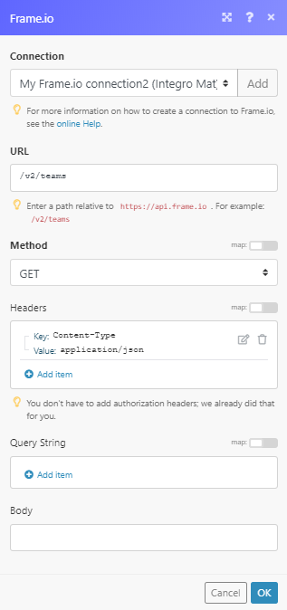
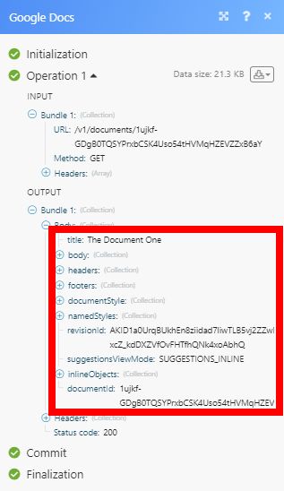

# Google Docs modules

The Google Docs modules enable you to monitor, create, edit and retrieve documents in your Google Docs and Google Shared Drive (for G Suite users).

In order to use Google Docswith *Adobe Workfront Fusion*, it is necessary to have a Google account. If you don't have a Google account yet, you can create one at the Google Account help page.

If you need instructions on creating a scenario, see [Create a scenario](../../workfront-fusion/scenarios/create-a-scenario.md).

For information about modules, see [Modules in Adobe Workfront Fusion](../../workfront-fusion/modules/modules.md).

## Access requirements

You must have the following access to use the functionality in this article:

<table cellspacing="0"> 
 <col> 
 <col> 
 <tbody> 
  <tr> 
   <td role="rowheader"><em>Adobe Workfront</em> plan*</td> 
   <td> 
<em>Pro</em> or higher
 </td> 
  </tr> <draft-comment>
   <tr data-mc-conditions=""> 
    <td role="rowheader"><em>Adobe Workfront</em> license*</td> 
    <td> 
Plan, Work
 </td> 
   </tr>
  </draft-comment>
  <tr data-mc-conditions=""> 
   <td role="rowheader"><em>Adobe Workfront</em> license*</td> 
   <td> 
Plan, Work
 </td> 
  </tr> 
  <tr> 
   <td role="rowheader"><em>Adobe Workfront Fusion</em> license**</td> 
   <td> 
<em>Workfront Fusion for Work Automation and Integration</em> 
 </td> 
  </tr> 
  <tr> 
   <td role="rowheader">Product</td> 
   <td>Your organization must purchase <em>Adobe Workfront Fusion</em> as well as <em>Adobe Workfront</em> to use functionality described in this article.</td> 
  </tr> <draft-comment>
   <tr data-mc-conditions="QuicksilverOrClassic.Draft mode"> 
    <td role="rowheader">Access level configurations*</td> 
    <td> <draft-comment>
      
You must be a <em>Workfront Fusion</em> administrator for your organization.

     </draft-comment>
You must be a <em>Workfront Fusion</em> administrator for your organization.
 <draft-comment>
      
You must be a <em>Workfront Fusion</em> administrator for your team.

     </draft-comment>
You must be a <em>Workfront Fusion</em> administrator for your team.
 </td> 
   </tr>
  </draft-comment>
  <tr data-mc-conditions="QuicksilverOrClassic.Draft mode"> 
   <td role="rowheader">Access level configurations*</td> 
   <td> 
You must be a <em>Workfront Fusion</em> administrator for your organization.
 
You must be a <em>Workfront Fusion</em> administrator for your team.
 </td> 
  </tr> 
 </tbody> 
</table>

&#42;To find out what plan, license type, or access you have, contact your *Workfront administrator*.

&#42;&#42;For information on *Adobe Workfront Fusion* licenses, see [Adobe Workfront Fusion licenses](../../workfront-fusion/get-started/license-automation-vs-integration.md)

## Prerequisites

To use Google Doc modules, you must have a Google account.

## Google Doc modules and their fields

When you configure *Google Docs* modules, *Workfront Fusion* displays the fields listed below. Along with these, additional *Google Docs* fields might display, depending on factors such as your access level in the app or service. A bolded title in a module indicates a required field.

If you see the map button above a field or function, you can use it to set variables and functions for that field. For more information, see [Map information from one module to another](../../workfront-fusion/mapping/map-information-between-modules.md).

### Document

* [Watch Documents](#watch) 
* [List Documents](#list) 
* [Get Content of a Document](#get) 
* [Create a Document](#create) 
* [Create a Document From a Template](#create2) 
* [Insert a Paragraph to a Document](#insert) 
* [Insert an Image to a Document](#insert2) 
* [Replace an Image with a New Image](#replace) 
* [Replace an Image with a New Image](#replace) 
* [Download a Document](#download) 
* [Delete a Document](#delete)

#### Watch Documents

This trigger module returns document details when a new document is created or modified in the selected folder.

<table cellspacing="0"> 
 <col> 
 <col> 
 <tbody> 
  <tr> 
   <td role="rowheader">Connection</td> 
   <td> 
For instructions about connecting your Google account to <em>Workfront Fusion</em>, see <a href="../../workfront-fusion/scenarios/create-a-scenario.md#connect" class="MCXref xref">Connect the module's app or web service to Workfront Fusion</a> in the article <a href="../../workfront-fusion/scenarios/create-a-scenario.md" class="MCXref xref">Create a scenario</a>.
 </td> 
  </tr> 
  <tr> 
   <td role="rowheader">Watch Documents</td> 
   <td> 
Select whether you want to watch created (By Created Date) or modified (By Modified Date) documents.
 </td> 
  </tr> 
  <tr> 
   <td role="rowheader">Choose a Drive</td> 
   <td> 
Select the type of drive you want to monitor.
 
    <ul> 
     <li> 
My Drive 
 
Select the folder you want to watch for created or modified documents.
 </li> 
     <li> 
Shared With Me 
 
Select the folder you want to watch for created or modified documents.
 </li> 
     <li> 
Google Shared Drive (available for G Suite users only)
 
Select whether you want to Use Domain Admin Access. Selecting Yes issues the request as a domain administrator, and all shared drived in which the requester is an administrator are returned.
 
Select the shared drive you want to watch.
 
Note: If you have selected the Google Shared Drive option in this field and you are not a G Suite user, the error <code>[400] Invalid Value</code> is returned.
 </li> 
    </ul> </td> 
  </tr> 
  <tr> 
   <td role="rowheader">Limit </td> 
   <td> 
Set the maximum number of documents <em>Workfront Fusion</em> returns in one execution cycle.
 </td> 
  </tr> 
 </tbody> 
</table>

#### List Documents

This action module retrieves a list of documents from the selected folder.

<table cellspacing="0"> 
 <col> 
 <col> 
 <tbody> 
  <tr> 
   <td role="rowheader">Connection</td> 
   <td> 
For instructions about connecting your Google account to <em>Workfront Fusion</em>, see <a href="../../workfront-fusion/scenarios/create-a-scenario.md#connect" class="MCXref xref">Connect the module's app or web service to Workfront Fusion</a> in the article <a href="../../workfront-fusion/scenarios/create-a-scenario.md" class="MCXref xref">Create a scenario</a>.
 </td> 
  </tr> 
  <tr> 
   <td role="rowheader">Choose a Drive</td> 
   <td> 
Select the type of drive you want to list documents from.
 
    <ul> 
     <li> 
My Drive 
 
Select the folder you want to list documents from.
 </li> 
     <li> 
Shared With Me 
 
Select the folder you want to list documents from.
 </li> 
     <li> 
Google Shared Drive (available for G Suite users only)
 
Select whether you want to Use Domain Admin Access. Selecting Yes issues the request as a domain administrator, and all shared drived in which the requester is an administrator are returned.
 
Select the shared drive you want to list documents from.
 
Note: If you have selected the Google Shared Drive option in this field and you are not a G Suite user, the error <code>[400] Invalid Value</code> is returned.
 </li> 
    </ul> </td> 
  </tr> 
  <tr> 
   <td role="rowheader">Limit </td> 
   <td> 
Set the maximum number of documents <em>Workfront Fusion</em> returns in one execution cycle.
 </td> 
  </tr> 
 </tbody> 
</table>

#### Get Content of a Document

This action module retrieves a specified document.

You may need to extend your permissions.

<table cellspacing="0"> 
 <col> 
 <col> 
 <tbody> 
  <tr> 
   <td role="rowheader">Connection</td> 
   <td> 
For instructions about connecting your Google account to <em>Workfront Fusion</em>, see <a href="../../workfront-fusion/scenarios/create-a-scenario.md#connect" class="MCXref xref">Connect the module's app or web service to Workfront Fusion</a> in the article <a href="../../workfront-fusion/scenarios/create-a-scenario.md" class="MCXref xref">Create a scenario</a>.
 </td> 
  </tr> 
  <tr> 
   <td role="rowheader">Get Content of a Document</td> 
   <td> 
Select whether you want to map the document ID of the document or select the document from the drop-down menu manually.
 </td> 
  </tr> 
  <tr> 
   <td role="rowheader">Choose a Drive</td> 
   <td> 
Select the type of drive that contains the document you want to retrieve.
 
    <ul> 
     <li> 
My Drive 
 
Select the folder that contains the document you want to retrieve.
 </li> 
     <li> 
Shared With Me 
 
Select the folder that contains the document you want to retrieve.
 </li> 
     <li> 
Google Shared Drive (available for G Suite users only)
 
Select whether you want to Use Domain Admin Access. Selecting Yes issues the request as a domain administrator, and all shared drived in which the requester is an administrator are returned.
 
Select the shared drive that contains the document you want to retrieve.
 
Note: If you have selected the Google Shared Drive option in this field and you are not a G Suite user, the error <code>[400] Invalid Value</code> is returned.
 </li> 
    </ul> </td> 
  </tr> 
  <tr> 
   <td role="rowheader"> 
Filter
 </td> 
   <td> 
Select the object you want to be returned in the module's output.
 
    <ul> 
     <li>Image (default)</li> 
     <li>Drawing</li> 
     <li>Chart</li> 
    </ul> 
Note:  
For further mapping of these objects, please use the Inline Objects Array value in this module's output (instead of inlineObjects).
 
The Inline Objects Array objects are sorted in the same order they appear in the document. It will make any further processing easier.
 
 </td> 
  </tr> 
 </tbody> 
</table>

#### Create a Document

This action module allows you to create a new document in the selected folder.

<table cellspacing="0"> 
 <col> 
 <col> 
 <tbody> 
  <tr> 
   <td role="rowheader">Connection</td> 
   <td> 
For instructions about connecting your Google account to <em>Workfront Fusion</em>, see <a href="../../workfront-fusion/scenarios/create-a-scenario.md#connect" class="MCXref xref">Connect the module's app or web service to Workfront Fusion</a> in the article <a href="../../workfront-fusion/scenarios/create-a-scenario.md" class="MCXref xref">Create a scenario</a>.
 </td> 
  </tr> 
  <tr> 
   <td role="rowheader">Name </td> 
   <td> 
Enter the name of the document.
 </td> 
  </tr> 
  <tr> 
   <td role="rowheader">Content</td> 
   <td> 
Enter the content of the document. HTML is supported.
 </td> 
  </tr> 
  <tr> 
   <td role="rowheader">Choose a Drive</td> 
   <td> 
Select the type of drive where you want to create a document.
 
    <ul> 
     <li> 
My Drive 
 
Select the folder where you want to create a document.
 </li> 
     <li> 
Shared With Me 
 
Select the folder where you want to create a document.
 </li> 
     <li> 
Google Shared Drive (available for G Suite users only)
 
Select whether you want to Use Domain Admin Access. Selecting Yes issues the request as a domain administrator, and all shared drived in which the requester is an administrator are returned.
 
Select the shared drive where you want to create a document.
 
Note: If you have selected the Google Shared Drive option in this field and you are not a G Suite user, the error <code>[400] Invalid Value</code> is returned.
 </li> 
    </ul> </td> 
  </tr> 
  <tr> 
   <td role="rowheader">Insert a Header</td> 
   <td> 
 Enable this option to insert the header to the document, then enter or map the text of the header.
 </td> 
  </tr> 
  <tr> 
   <td role="rowheader">Insert a Footer </td> 
   <td> 
Enable this option to insert the footer to the document, then enter or map the text of the header.
 </td> 
  </tr> 
 </tbody> 
</table>

#### Create a Document From a Template

This action module creates a copy of an existing template document and replaces any tags. This module also allows users to replace images with new images by URL.

<table cellspacing="0"> 
 <col> 
 <col> 
 <tbody> 
  <tr> 
   <td role="rowheader">Connection</td> 
   <td> 
For instructions about connecting your Google account to <em>Workfront Fusion</em>, see <a href="../../workfront-fusion/scenarios/create-a-scenario.md#connect" class="MCXref xref">Connect the module's app or web service to Workfront Fusion</a> in the article <a href="../../workfront-fusion/scenarios/create-a-scenario.md" class="MCXref xref">Create a scenario</a>.
 </td> 
  </tr> 
  <tr> 
   <td role="rowheader"> 
Create a Document from a Template
 </td> 
   <td> 
    <ul> 
     <li>By Mapping  Select this option to map the document template.</li> 
     <li>By Dropdown  Select this option to choose the document template from the drop-down menu.</li> 
    </ul> </td> 
  </tr> 
  <tr> 
   <td role="rowheader">Choose a Drive</td> 
   <td> 
Select the type of drive where your template is located. This option is available if you selected By Dropdown in the previous field.
 
    <ul> 
     <li> 
My Drive 
 
Select the folder where your template is located.
 </li> 
     <li> 
Shared With Me 
 
Select the folder where your template is located.
 </li> 
     <li> 
Google Shared Drive (available for G Suite users only)
 
Select whether you want to Use Domain Admin Access. Selecting Yes issues the request as a domain administrator, and all shared drived in which the requester is an administrator are returned.
 
Select the shared drive where your template is located.
 
Note: If you have selected the Google Shared Drive option in this field and you are not a G Suite user, the error <code>[400] Invalid Value</code> is returned.
 </li> 
    </ul> </td> 
  </tr> 
  <tr> 
   <td role="rowheader"> 
Values
 </td> 
   <td> 
Enter the values that will be entered instead of the variables to the new document.
 
    <ul> 
     <li>Tags   Enter the tags that are contained in the document template. Do not use <code>{{}}</code>. Example: use <code>name </code>instead of <code>{{name}}</code>.</li> 
     <li>Replaced Value<![CDATA[	]]> Enter the value of the tag.</li> 
    </ul> 
For example the<code> {{name}}</code> variable in the source document will be displayed as the name field here, where the value can be inserted, such as <code>John</code>.
 </td> 
  </tr> 
  <tr> 
   <td role="rowheader"> 
Images Replacement
 </td> 
   <td> 
Enter the link to the Image Object ID and Image URL that will replace the current image.
 
Note:  You can retrieve the image IDs by using Get a Document module, where the IDs are contained in the array Inline Object Array.
 
We recommend that you add ALT text to images in your Google document. 
 
To add an ALT Text to the Google Docs image:
 
    <ol> 
     <li value="1">Right click on the image.</li> 
     <li value="2">Select the ALT text option.</li> 
     <li value="3">Enter the ALT text in the Title field and click OK.</li> 
    </ol> 
After the ALT text is added to the image, the ALT text is displayed in the field name in parentheses.
 </td> 
  </tr> 
  <tr> 
   <td role="rowheader">Title </td> 
   <td> 
Enter the name for the new document.
 </td> 
  </tr> 
  <tr> 
   <td role="rowheader">Choose a Drive</td> 
   <td> 
Select the type of drive where your template is located. This option is available if you selected By Dropdown in the previous field.
 
    <ul> 
     <li> 
My Drive 
 
Select the folder where you want the document to be created.
 </li> 
     <li> 
Shared With Me 
 
Select the folder where you want the document to be created.
 </li> 
     <li> 
Google Shared Drive (available for G Suite users only)
 
Select whether you want to Use Domain Admin Access. Selecting Yes issues the request as a domain administrator, and all shared drived in which the requester is an administrator are returned.
 
Select the shared drive where you want the document to be created.
 
Note: If you have selected the Google Shared Drive option in this field and you are not a G Suite user, the error <code>[400] Invalid Value</code> is returned.
 </li> 
    </ul> </td> 
  </tr> 
 </tbody> 
</table>

#### Insert a Paragraph to a Document

This action module appends or inserts a new paragraph to an existing document.

<table cellspacing="0"> 
 <col> 
 <col> 
 <tbody> 
  <tr> 
   <td role="rowheader">Connection</td> 
   <td> 
For instructions about connecting your Google account to <em>Workfront Fusion</em>, see <a href="../../workfront-fusion/scenarios/create-a-scenario.md#connect" class="MCXref xref">Connect the module's app or web service to Workfront Fusion</a> in the article <a href="../../workfront-fusion/scenarios/create-a-scenario.md" class="MCXref xref">Create a scenario</a>.
 </td> 
  </tr> 
  <tr> 
   <td role="rowheader"> 
Select a Document
 </td> 
   <td> 
    <ul> 
     <li>By Mapping  Select this option to map the document.</li> 
     <li>By Dropdown   Select this option to choose the document from the drop-down menu.</li> 
    </ul> </td> 
  </tr> 
  <tr> 
   <td role="rowheader">Choose a Drive</td> 
   <td> 
Select the type of drive where the document you want to add a paragraph to is located. This option is available if you selected By Dropdown in the previous field.
 
    <ul> 
     <li> 
My Drive 
 
Select the folder where the document you want to add a paragraph to is located, then select the document.
 </li> 
     <li> 
Shared With Me 
 
Select the folder where the document you want to add a paragraph to is located, then select the document.
 </li> 
     <li> 
Google Shared Drive (available for G Suite users only)
 
Select whether you want to Use Domain Admin Access. Selecting Yes issues the request as a domain administrator, and all shared drived in which the requester is an administrator are returned.
 
Select the shared drive where the document you want to add a paragraph to is located, then select the document.
 
Note: If you have selected the Google Shared Drive option in this field and you are not a G Suite user, the error <code>[400] Invalid Value</code> is returned.
 </li> 
    </ul> </td> 
  </tr> 
  <tr> 
   <td role="rowheader"> 
Insert a Paragraph
 </td> 
   <td> 
Select how you want the new text to be inserted in the document.
 
    <ul> 
     <li> 
By specification of location 
 
      <ul> 
       <li> 
By index 
 
        <ul> 
         <li> 
Index 
 
Enter the Index number where you would like to insert your text. You can use the Get a Document module retrieve Index number.
 
To display all characters (including hidden) in the document, you can use the Show add-on. You can find the add-on under Add-ons &gt; Get add-ons. Search for Show and install the Show add-on.
 </li> 
         <li> 
Inserted text 
 
Enter the text you want to insert to the document.
 </li> 
        </ul> </li> 
       <li> 
By segment ID 
 
Select the header and footer you want to insert the text content to and enter the text you want to insert to the corresponding fields.
 
If the header or footer already contains text, the new text will be added before the existing text.
 </li> 
      </ul> </li> 
     <li> 
By appending to the body of the document 
 
Appends entered text at the end of the document's body content.
 
The style of the new paragraph will be copied from the paragraph at the current insertion index, including lists and bullets.
 </li> 
    </ul> 
    <ul> 
     <li> 
By appending to the end of segment (Header and Footer) 
 
Select the header and footer you want to insert the text content to and enter the text you want to insert to the corresponding fields.
 
If the header or footer already contain text, the new text will be added after the existing text.
 </li> 
    </ul> </td> 
  </tr> 
  <tr> 
   <td role="rowheader">Appended Text</td> 
   <td>Enter or map the text you want to append to the document</td> 
  </tr> 
 </tbody> 
</table>

#### Insert an Image to a Document

This action module inserts an image from the URL to the document.

<table cellspacing="0"> 
 <col> 
 <col> 
 <tbody> 
  <tr> 
   <td role="rowheader">Connection</td> 
   <td> 
For instructions about connecting your Google account to <em>Workfront Fusion</em>, see <a href="../../workfront-fusion/scenarios/create-a-scenario.md#connect" class="MCXref xref">Connect the module's app or web service to Workfront Fusion</a> in the article <a href="../../workfront-fusion/scenarios/create-a-scenario.md" class="MCXref xref">Create a scenario</a>.
 </td> 
  </tr> 
  <tr> 
   <td role="rowheader"> 
Select a Document
 </td> 
   <td> 
    <ul> 
     <li>By Mapping  Select this option to map the document template.</li> 
     <li>By Dropdown   Select this option to choose the document from the drop-down menu.</li> 
    </ul> </td> 
  </tr> 
  <tr> 
   <td role="rowheader">Choose a Drive</td> 
   <td> 
Select the type of drive where the document you want to add an image to is located. This option is available if you selected By Dropdown in the previous field.
 
    <ul> 
     <li> 
My Drive 
 
Select the folder where the document you want to add an image to is located, then select the document.
 </li> 
     <li> 
Shared With Me 
 
Select the folder where the document you want to add an image to is located, then select the document.
 </li> 
     <li> 
Google Shared Drive (available for G Suite users only)
 
Select whether you want to Use Domain Admin Access. Selecting Yes issues the request as a domain administrator, and all shared drived in which the requester is an administrator are returned.
 
Select the shared drive where the document you want to add an image to is located, then select the document.
 
Note: If you have selected the Google Shared Drive option in this field and you are not a G Suite user, the error <code>[400] Invalid Value</code> is returned.
 </li> 
    </ul> </td> 
  </tr> 
  <tr> 
   <td role="rowheader"> 
Insert an Image
 </td> 
   <td> 
Select how you want the new image to be inserted in the document.
 
    <ul> 
     <li> 
By specification of location 
 
      <ul> 
       <li> 
By index 
 
        <ul> 
         <li> 
Index 
 
Enter the Index number where you would like to insert your image. You can use the Get a Document module retrieve Index number.
 
To display all characters (including hidden) in the document, you can use the Show add-on. You can find the add-on under Add-ons &gt; Get add-ons. Search for Show and install the Show add-on.
 </li> 
         <li> 
Image URL 
 
Enter the URL of the image you want to insert to the document.
 
The maximum image size is 50 MB. Must not exceed 25 megapixels. Only PNG, JPEG or GIF format is supported.
 </li> 
        </ul> </li> 
       <li> 
By segment ID 
 
Select the header and footer you want to insert the image to and enter the image URL to the corresponding fields.
 
The maximum image size is 50 MB. The image must not exceed 25 megapixels. Only PNG, JPEG, or GIF format is supported.
 </li> 
      </ul> </li> 
     <li> 
By appending to the body of the document 
 
Appends a specific image at the end of the document's body content.
 </li> 
    </ul> 
    <ul> 
     <li> 
By appending to the end of segment (Header and Footer) 
 
Select the header and footer you want to insert an image to and enter the image URL you want to insert to the corresponding fields.
 </li> 
    </ul> </td> 
  </tr> 
  <tr> 
   <td role="rowheader"> 
Height Magnitude in Points/Width Magnitude in Points
 </td> 
   <td> 
Define the size of the inserted image. The aspect ratio will be kept.
 </td> 
  </tr> 
 </tbody> 
</table>

#### Replace an Image with a New Image

This action module replaces an existing image. The aspect ratio of the original image will be maintained.

<table cellspacing="0"> 
 <col> 
 <col> 
 <tbody> 
  <tr> 
   <td role="rowheader">Connection</td> 
   <td> 
For instructions about connecting your Google account to <em>Workfront Fusion</em>, see <a href="../../workfront-fusion/scenarios/create-a-scenario.md#connect" class="MCXref xref">Connect the module's app or web service to Workfront Fusion</a> in the article <a href="../../workfront-fusion/scenarios/create-a-scenario.md" class="MCXref xref">Create a scenario</a>.
 </td> 
  </tr> 
  <tr> 
   <td role="rowheader"> 
Select a Document
 </td> 
   <td> 
    <ul> 
     <li>By Mapping  Select this option to map the document template.</li> 
     <li>By Dropdown   Select this option to choose the document from the drop-down menu.</li> 
    </ul> </td> 
  </tr> 
  <tr> 
   <td role="rowheader">Choose a Drive</td> 
   <td> 
Select the type of drive where the document you want to replace an image is located. This option is available if you selected By Dropdown in the previous field.
 
    <ul> 
     <li> 
My Drive 
 
Select the folder where the document you want to replace an image is located, then select the document.
 </li> 
     <li> 
Shared With Me 
 
Select the folder where the document you want to replace an image is located, then select the document.
 </li> 
     <li> 
Google Shared Drive (available for G Suite users only)
 
Select whether you want to Use Domain Admin Access. Selecting Yes issues the request as a domain administrator, and all shared drived in which the requester is an administrator are returned.
 
Select the shared drive where the document you want to replace an image is located, then select the document.
 
Note: If you have selected the Google Shared Drive option in this field and you are not a G Suite user, the error <code>[400] Invalid Value</code> is returned.
 </li> 
    </ul> </td> 
  </tr> 
  <tr> 
   <td role="rowheader"> 
Image URL
 </td> 
   <td> 
Enter or map the URL of the new image that will replace the existing image.
 
Images are listed in the order they appear in the document. For example, <code>Body: Image No. 1</code> is the first image in the document.
 </td> 
  </tr> 
 </tbody> 
</table>

#### Replace Text in a Document

This action module replaces text in a document.

<table cellspacing="0"> 
 <col> 
 <col> 
 <tbody> 
  <tr> 
   <td role="rowheader">Connection</td> 
   <td> 
For instructions about connecting your Google account to <em>Workfront Fusion</em>, see <a href="../../workfront-fusion/scenarios/create-a-scenario.md#connect" class="MCXref xref">Connect the module's app or web service to Workfront Fusion</a> in the article <a href="../../workfront-fusion/scenarios/create-a-scenario.md" class="MCXref xref">Create a scenario</a>.
 </td> 
  </tr> 
  <tr> 
   <td role="rowheader"> 
Select a Document
 </td> 
   <td> 
    <ul> 
     <li>By Mapping  Select this option to map the document template.</li> 
     <li>By Dropdown   Select this option to choose the document from the drop-down menu.</li> 
    </ul> </td> 
  </tr> 
  <tr> 
   <td role="rowheader">Choose a Drive</td> 
   <td> 
Select the type of drive where the document you want to add text to is located. This option is available if you selected By Dropdown in the previous field.
 
    <ul> 
     <li> 
My Drive 
 
Select the folder where the document you want to add text to is located, then select the document.
 </li> 
     <li> 
Shared With Me 
 
Select the folder where the document you want to add text to is located, then select the document.
 </li> 
     <li> 
Google Shared Drive (available for G Suite users only)
 
Select whether you want to Use Domain Admin Access. Selecting Yes issues the request as a domain administrator, and all shared drived in which the requester is an administrator are returned.
 
Select the shared drive where the document you want to add text to is located, then select the document.
 
Note: If you have selected the Google Shared Drive option in this field and you are not a G Suite user, the error <code>[400] Invalid Value</code> is returned.
 </li> 
    </ul> </td> 
  </tr> 
  <tr> 
   <td role="rowheader"> 
Replace a Text
 </td> 
   <td> 
Add each text that you want to replace.
 
    <ul> 
     <li> 
Old text to be replaced 
 
Enter the text you want to replace.
 </li> 
     <li> 
New text to be inserted 
 
Enter the new text.
 </li> 
    </ul> </td> 
  </tr> 
 </tbody> 
</table>

#### Download a Document

This action module converts and downloads the selected document.

<table cellspacing="0"> 
 <col> 
 <col> 
 <tbody> 
  <tr> 
   <td role="rowheader">Connection</td> 
   <td> 
For instructions about connecting your Google account to <em>Workfront Fusion</em>, see <a href="../../workfront-fusion/scenarios/create-a-scenario.md#connect" class="MCXref xref">Connect the module's app or web service to Workfront Fusion</a> in the article <a href="../../workfront-fusion/scenarios/create-a-scenario.md" class="MCXref xref">Create a scenario</a>.
 </td> 
  </tr> 
  <tr> 
   <td role="rowheader">Choose a Drive</td> 
   <td> 
Select the type of drive where the document you want to download is located. This option is available if you selected By Dropdown in the previous field.
 
    <ul> 
     <li> 
My Drive 
 
Select the folder where the document you want to download is located, then select the document.
 </li> 
     <li> 
Shared With Me 
 
Select the folder where the document you want to download is located, then select the document.
 </li> 
     <li> 
Google Shared Drive (available for G Suite users only)
 
Select whether you want to Use Domain Admin Access. Selecting Yes issues the request as a domain administrator, and all shared drived in which the requester is an administrator are returned.
 
Select the shared drive where the document you want to download is located, then select the document.
 
Note: If you have selected the Google Shared Drive option in this field and you are not a G Suite user, the error <code>[400] Invalid Value</code> is returned.
 </li> 
    </ul> </td> 
  </tr> 
  <tr> 
   <td role="rowheader"> 
Type 
 </td> 
   <td> 
Select the target file format of the downloaded document.
 </td> 
  </tr> 
 </tbody> 
</table>

#### Delete a Document

This action module deletes a document.

<table cellspacing="0"> 
 <col> 
 <col> 
 <tbody> 
  <tr> 
   <td role="rowheader">Connection</td> 
   <td> 
For instructions about connecting your Google account to <em>Workfront Fusion</em>, see <a href="../../workfront-fusion/scenarios/create-a-scenario.md#connect" class="MCXref xref">Connect the module's app or web service to Workfront Fusion</a> in the article <a href="../../workfront-fusion/scenarios/create-a-scenario.md" class="MCXref xref">Create a scenario</a>.
 </td> 
  </tr> 
  <tr> 
   <td role="rowheader">Choose a Drive</td> 
   <td> 
Select the type of drive where the document you want to delete is located. This option is available if you selected By Dropdown in the previous field.
 
    <ul> 
     <li> 
My Drive 
 
Select the folder where the document you want to delete is located, then select the document.
 </li> 
     <li> 
Shared With Me 
 
Select the folder where the document you want to delete is located, then select the document.
 </li> 
     <li> 
Google Shared Drive (available for G Suite users only)
 
Select whether you want to Use Domain Admin Access. Selecting Yes issues the request as a domain administrator, and all shared drived in which the requester is an administrator are returned.
 
Select the shared drive where the document you want to delete is located, then select the document.
 
Note: If you have selected the Google Shared Drive option in this field and you are not a G Suite user, the error <code>[400] Invalid Value</code> is returned.
 </li> 
    </ul> </td> 
  </tr> 
  <tr> 
   <td role="rowheader">Shared Drive</td> 
   <td> 
Select the drive that contains the document you want to download, then select a document. This option is available if you have selected Google Shared Drive in the Choose a Drive field.
 </td> 
  </tr> 
  <tr> 
   <td role="rowheader">Document ID</td> 
   <td> 
 Select or map the document you want to replace one or more images in.
 </td> 
  </tr> 
 </tbody> 
</table>

### Other

* [Make an API Call](#make2) 
* [Make All Links in a Document Clickable](#make)

#### Make an API Call

This action module allows you to perform a custom API call.

<table cellspacing="0"> 
 <col> 
 <col> 
 <tbody> 
  <tr> 
   <td role="rowheader">Connection </td> 
   <td> 
For instructions about connecting your Google account to <em>Workfront Fusion</em>, see <a href="../../workfront-fusion/scenarios/create-a-scenario.md#connect" class="MCXref xref">Connect the module's app or web service to Workfront Fusion</a> in the article <a href="../../workfront-fusion/scenarios/create-a-scenario.md" class="MCXref xref">Create a scenario</a>.
 </td> 
  </tr> 
  <tr> 
   <td role="rowheader">URL</td> 
   <td> 
Enter a path relative to <code>https://docs.googleapis.com/</code>. Example: <code>/v1/documents/{presentationID}</code>. 
 </td> 
  </tr> 
  <tr> 
   <td role="rowheader">Method</td> 
   <td> 
Select the HTTP request method you need to configure the API call. For more information, see <a href="../../workfront-fusion/modules/http-request-methods.md" class="MCXref xref">HTTP request methods</a>.
 
&nbsp;
 </td> 
  </tr> 
  <tr> 
   <td role="rowheader">Headers</td> 
   <td> 
Add the headers of the request in the form of a standard JSON object.For example, <code>{"Content-type":"application/json"}</code>. <em>Workfront Fusion</em> adds the authorization headers for you.
 </td> 
  </tr> 
  <tr> 
   <td role="rowheader">Query String</td> 
   <td> 
 Enter the request query string.
 </td> 
  </tr> 
  <tr> 
   <td role="rowheader">Body</td> 
   <td> 
Add the body content for the API call in the form of a standard JSON object.
 
Note:  
When using conditional statements such as <code>if</code> in your JSON, put the quotation marks outside of the conditional statement.
 
     
Example: </b>"> 
      
  
 
     
 
 </td> 
  </tr> 
 </tbody> 
</table>

` `**Example: **`` The following API call retrieves the details for the specified document in your Google Docs:

`URL:`

/v1/documents/1ujkf-GDgB0TQSYPrxbCSK4Uso54tHVMqHZEVZZxB6aY

`Method:`

GET

Details of the retrieved document can be found in the module's Output under Bundle > Body.

#### Make All Links in a Document Clickable

This action module finds all links in the document and makes them clickable.

<table cellspacing="0"> 
 <col> 
 <col> 
 <tbody> 
  <tr> 
   <td role="rowheader">Connection</td> 
   <td> 
For instructions about connecting your Google account to <em>Workfront Fusion</em>, see <a href="../../workfront-fusion/scenarios/create-a-scenario.md#connect" class="MCXref xref">Connect the module's app or web service to Workfront Fusion</a> in the article <a href="../../workfront-fusion/scenarios/create-a-scenario.md" class="MCXref xref">Create a scenario</a>.
 </td> 
  </tr> 
  <tr> 
   <td role="rowheader"> 
Make All Links in a Document
 </td> 
   <td> 
    <ul> 
     <li>By Mapping  Select this option to map the document template.</li> 
     <li>By Dropdown   Select this option to choose the document from the drop-down menu.</li> 
    </ul> </td> 
  </tr> 
  <tr> 
   <td role="rowheader">Choose a Drive</td> 
   <td> 
Select the type of drive where the document you want to make links clickable in is located. This option is available if you selected By Dropdown in the previous field.
 
    <ul> 
     <li> 
My Drive 
 
Select the folder where the document you want to make links clickable in is located, then select the document.
 </li> 
     <li> 
Shared With Me 
 
Select the folder where the document you want to make links clickable in is located, then select the document.
 </li> 
     <li> 
Google Shared Drive (available for G Suite users only)
 
Select whether you want to Use Domain Admin Access. Selecting Yes issues the request as a domain administrator, and all shared drived in which the requester is an administrator are returned.
 
Select the shared drive where the document you want to make links clickable in is located, then select the document.
 
Note: If you have selected the Google Shared Drive option in this field and you are not a G Suite user, the error <code>[400] Invalid Value</code> is returned.
 </li> 
    </ul> </td> 
  </tr> 
  <tr> 
   <td role="rowheader">Shared Drive</td> 
   <td> 
Select the drive that contains the document you want to update links in, then select a document. This option is available if you have selected Google Shared Drive in the Choose a Drive field.
 </td> 
  </tr> 
  <tr> 
   <td role="rowheader">Document ID</td> 
   <td> 
 Select or map the document you want to update the links in.
 </td> 
  </tr> 
 </tbody> 
</table>

