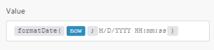

# Google Sheets modules {#google-sheets-modules}

In a *`Adobe Workfront Fusion`* scenario, you can connect your *`Google`* account to multiple third-party applications and services.


For instructions about connecting your *`Google Sheets`* account to *`Workfront Fusion`*, see [Create a connection to Workfront Fusion - Basic instructions](connect-to-fusion-general.md) 


## Access requirements {#access-requirements}

You must have the following access to use the functionality in this article:

<table style="width: 100%;margin-left: 0;margin-right: auto;mc-table-style: url('../../Resources/TableStyles/TableStyle-List-options-in-steps.css');" class="TableStyle-TableStyle-List-options-in-steps" cellspacing="0"> 
 <col class="TableStyle-TableStyle-List-options-in-steps-Column-Column1"> 
 <col class="TableStyle-TableStyle-List-options-in-steps-Column-Column2"> 
 <tbody> 
  <tr class="TableStyle-TableStyle-List-options-in-steps-Body-LightGray"> 
   <td class="TableStyle-TableStyle-List-options-in-steps-BodyE-Column1-LightGray" role="rowheader"><span class="mc-variable WFVariables.FullProdNameWF variable varname">Adobe Workfront</span> plan*</td> 
   <td class="TableStyle-TableStyle-List-options-in-steps-BodyD-Column2-LightGray"> <p><span class="mc-variable WFVariables.WFPlan-Pro variable varname">Pro</span> or higher</p> </td> 
  </tr> 
  <tr class="TableStyle-TableStyle-List-options-in-steps-Body-MediumGray"> 
   <td class="TableStyle-TableStyle-List-options-in-steps-BodyE-Column1-MediumGray" role="rowheader"><span class="mc-variable WFVariables.FullProdNameWFF variable varname">Adobe Workfront Fusion</span> license**</td> 
   <td class="TableStyle-TableStyle-List-options-in-steps-BodyD-Column2-MediumGray"> <p><span class="mc-variable WFVariables.WFFusionIntegration variable varname">Workfront Fusion for Work Automation and Integration</span> </p> </td> 
  </tr> 
  <tr class="TableStyle-TableStyle-List-options-in-steps-Body-LightGray"> 
   <td class="TableStyle-TableStyle-List-options-in-steps-BodyB-Column1-LightGray" role="rowheader">Product</td> 
   <td class="TableStyle-TableStyle-List-options-in-steps-BodyA-Column2-LightGray">Your organization must purchase <span class="mc-variable WFVariables.FullProdNameWFF variable varname">Adobe Workfront Fusion</span> as well as <span class="mc-variable WFVariables.FullProdNameWF variable varname">Adobe Workfront</span> to use functionality described in this article.</td> 
  </tr> 
 </tbody> 
</table>

&#42;To find out what plan, license type, or access you have, contact your *`Workfront administrator`*.


## Prerequisites {#prerequisites}

To use Google Sheets modules, you must have a Google account.


## Triggers {#triggers}


### Watch Rows {#watch-rows}

Retrieves values from every newly added row in the spreadsheet.


The module retrieves only new rows that have not been filled in before. The trigger will not process an overwritten row.


>[!IMPORTANT] {type="important"}
>
>If the worksheet contains a blank row, no rows after the blank row will be processed.


<table style="width: 100%;margin-left: 0;margin-right: auto;mc-table-style: url('../../Resources/TableStyles/TableStyle-List-options-in-steps.css');" class="TableStyle-TableStyle-List-options-in-steps" cellspacing="0"> 
 <col class="TableStyle-TableStyle-List-options-in-steps-Column-Column1"> 
 <col class="TableStyle-TableStyle-List-options-in-steps-Column-Column2"> 
 <tbody> 
  <tr class="TableStyle-TableStyle-List-options-in-steps-Body-LightGray"> 
   <td class="TableStyle-TableStyle-List-options-in-steps-BodyE-Column1-LightGray" role="rowheader">Connection </td> 
   <td class="TableStyle-TableStyle-List-options-in-steps-BodyD-Column2-LightGray"> <p>For instructions about connecting your Google Sheets account to <span class="mc-variable WFVariables.ProdNameWFF variable varname">Workfront Fusion</span>, see <a href="create-a-scenario.md#connect" class="MCXref xref">Connect the module's app or web service to Workfront Fusion</a> in the article <a href="create-a-scenario.md" class="MCXref xref">Create a scenario</a>.</p> </td> 
  </tr> 
  <tr class="TableStyle-TableStyle-List-options-in-steps-Body-MediumGray"> 
   <td class="TableStyle-TableStyle-List-options-in-steps-BodyE-Column1-MediumGray" role="rowheader">Spreadsheet </td> 
   <td class="TableStyle-TableStyle-List-options-in-steps-BodyD-Column2-MediumGray"> <p>Select the spreadsheet that contains the sheet you want to watch.</p> </td> 
  </tr> 
  <tr class="TableStyle-TableStyle-List-options-in-steps-Body-LightGray"> 
   <td class="TableStyle-TableStyle-List-options-in-steps-BodyE-Column1-LightGray" role="rowheader">Sheet </td> 
   <td class="TableStyle-TableStyle-List-options-in-steps-BodyD-Column2-LightGray"> <p>Select the sheet you want to watch for a new row.</p> </td> 
  </tr> 
  <tr class="TableStyle-TableStyle-List-options-in-steps-Body-MediumGray"> 
   <td class="TableStyle-TableStyle-List-options-in-steps-BodyE-Column1-MediumGray" role="rowheader">Table contains headers</td> 
   <td class="TableStyle-TableStyle-List-options-in-steps-BodyD-Column2-MediumGray"> <p> Select whether the spreadsheet contains the header row.</p> 
    <ul> 
     <li> <p><span class="bold">Yes</span> </p> <p>The module doesn't retrieve the header row as output data. </p> <p>Variable names in the output are called by the headers.</p> </li> 
     <li> <p><span class="bold">No </span> </p> <p>The module also retrieves the first table row</p> <p>Variable names in the output are called A, B, C, D, and so on.</p> </li> 
    </ul> </td> 
  </tr> 
  <tr class="TableStyle-TableStyle-List-options-in-steps-Body-LightGray"> 
   <td class="TableStyle-TableStyle-List-options-in-steps-BodyE-Column1-LightGray" role="rowheader">Row with headers </td> 
   <td class="TableStyle-TableStyle-List-options-in-steps-BodyD-Column2-LightGray"> <p>Enter the range of the header row. For example, <code>A1:F1</code>.</p> </td> 
  </tr> 
  <tr class="TableStyle-TableStyle-List-options-in-steps-Body-MediumGray"> 
   <td class="TableStyle-TableStyle-List-options-in-steps-BodyE-Column1-MediumGray" role="rowheader">First table row</td> 
   <td class="TableStyle-TableStyle-List-options-in-steps-BodyD-Column2-MediumGray"> <p>Enter the range of the first row of the table. For example, <code>A1:F1</code>.</p> </td> 
  </tr> 
  <tr class="TableStyle-TableStyle-List-options-in-steps-Body-LightGray"> 
   <td class="TableStyle-TableStyle-List-options-in-steps-BodyE-Column1-LightGray" role="rowheader"> <p>Value render option</p> </td> 
   <td class="TableStyle-TableStyle-List-options-in-steps-BodyD-Column2-LightGray"> <p style="font-weight: bold;">Formatted value</p> <p>The values will be calculated and formatted in the reply according to the cell's formatting. Formatting is based on the spreadsheet's locale, not the requesting user's locale. For example, if <code>A1</code> is <code>1.23</code> and <code>A2</code> is <code>=A1</code> and formatted as currency, then <code>A2</code> would return <code>"$1.23"</code>.</p> <p style="font-weight: bold;">Unformatted value</p> <p>The values will be calculated, but not formatted in the reply. For example, if <code>A1</code> is <code>1.23</code> and <code>A2</code> is <code>=A1</code> and formatted as currency, then <code>A2</code> would return the number <code>"1.23"</code>.</p> <p style="font-weight: bold;">Formula</p> <p>The values will not be calculated. The reply will include the formulas. For example, if <code>A1</code> is <code>1.23</code> and <code>A2</code> is <code>=A1</code> and formatted as currency, then <code>A2</code> would return <code>"=A1"</code>.</p> </td> 
  </tr> 
  <tr class="TableStyle-TableStyle-List-options-in-steps-Body-MediumGray"> 
   <td class="TableStyle-TableStyle-List-options-in-steps-BodyE-Column1-MediumGray" role="rowheader"> <p>Date and time render option</p> </td> 
   <td class="TableStyle-TableStyle-List-options-in-steps-BodyD-Column2-MediumGray"> <p style="font-weight: bold;">Serial number</p> <p>Instructs date, time, datetime, and duration fields to be outputted as doubles in "serial number" format, as popularized by Lotus 1-2-3. The whole number portion of the value (left of the decimal) counts the days since December 30th 1899. The fractional portion (right of the decimal) counts the time as a fraction of the day. For example, January 1st 1900 at noon would be 2.5, 2 because it's 2 days after December 30th 1899, and .5 because noon is half a day. February 1st 1900 at 3pm would be 33.625. This correctly treats the year 1900 as not a leap year.</p> <p style="font-weight: bold;">Formatted string</p> <p>Instructs date, time, datetime, and duration fields to be outputted as strings in their given number format (which is dependent on the spreadsheet's locale).</p> </td> 
  </tr> 
  <tr class="TableStyle-TableStyle-List-options-in-steps-Body-LightGray"> 
   <td class="TableStyle-TableStyle-List-options-in-steps-BodyB-Column1-LightGray" role="rowheader">Limit </td> 
   <td class="TableStyle-TableStyle-List-options-in-steps-BodyA-Column2-LightGray"> <p>Set the maximum number of results that <span class="mc-variable WFVariables.ProdNameWFF variable varname">Workfront Fusion</span> will work with during one execution cycle.</p> </td> 
  </tr> 
 </tbody> 
</table>


## Actions {#actions}


* [Add a Row](#add) 
* [Update a Row](#update2) 
* [Clear a Row](#clear2) 
* [Delete a Row](#delete) 
* [Get a Cell](#get) 
* [Update a Cell](#update) 
* [Clear a Cell](#clear) 
* [Add a Sheet](#add2) 
* [Create a Spreadsheet](#create) 
* [Delete a Sheet](#delete2) 
* [Make an API Call](#make) 


### Add a Row {#add-a-row}

This module appends adds a row to a sheet.


When you configure *`[Fusion app]`* modules, *`Workfront Fusion`* displays the fields listed below. Along with these, additional *`[Fusion app]`* fields might display, depending on factors such as your access level in the app or service. A bolded title in a module indicates a required field.


If you see the map button above a field or function, you can use it to set variables and functions for that field. For more information, see [Map information from one module to another](map-information-between-modules.md).


<table style="width: 100%;mc-table-style: url('../../Resources/TableStyles/TableStyle-HeaderRow.css');" class="TableStyle-TableStyle-HeaderRow" cellspacing="15"> 
 <col class="TableStyle-TableStyle-HeaderRow-Column-Column1" style="width: 101px;"> 
 <col class="TableStyle-TableStyle-HeaderRow-Column-Column1"> 
 <tbody> 
  <tr class="TableStyle-TableStyle-HeaderRow-Body-LightGray"> 
   <td class="TableStyle-TableStyle-HeaderRow-BodyE-Column1-LightGray" style="font-weight: bold;">Connection </td> 
   <td class="TableStyle-TableStyle-HeaderRow-BodyD-Column1-LightGray"> <p>For instructions about connecting your Google Sheets account to <span class="mc-variable WFVariables.ProdNameWFF variable varname">Workfront Fusion</span>, see <a href="create-a-scenario.md#connect" class="MCXref xref">Connect the module's app or web service to Workfront Fusion</a> in the article <a href="create-a-scenario.md" class="MCXref xref">Create a scenario</a>.</p> </td> 
  </tr> 
  <tr class="TableStyle-TableStyle-HeaderRow-Body-MediumGray"> 
   <td class="TableStyle-TableStyle-HeaderRow-BodyE-Column1-MediumGray" style="font-weight: bold;">Mode</td> 
   <td class="TableStyle-TableStyle-HeaderRow-BodyD-Column1-MediumGray"> <p>Select whether you want to select the spreadsheet and sheet manually or by mapping.</p> <p>Note: Manual mapping is useful, for example, when a new spreadsheet is created in an <span class="mc-variable WFVariables.ProdNameWFF variable varname">Workfront Fusion</span> scenario and you want to add data in the newly created spreadsheet directly in the scenario.</p> </td> 
  </tr> 
  <tr class="TableStyle-TableStyle-HeaderRow-Body-LightGray"> 
   <td class="TableStyle-TableStyle-HeaderRow-BodyE-Column1-LightGray" style="font-weight: bold;">Spreadsheet </td> 
   <td class="TableStyle-TableStyle-HeaderRow-BodyD-Column1-LightGray"> <p>Select the Google spreadsheet.</p> </td> 
  </tr> 
  <tr class="TableStyle-TableStyle-HeaderRow-Body-MediumGray"> 
   <td class="TableStyle-TableStyle-HeaderRow-BodyE-Column1-MediumGray" style="font-weight: bold;">Sheet </td> 
   <td class="TableStyle-TableStyle-HeaderRow-BodyD-Column1-MediumGray"> <p>Select the sheet you want to add a row to.</p> </td> 
  </tr> 
  <tr class="TableStyle-TableStyle-HeaderRow-Body-LightGray"> 
   <td class="TableStyle-TableStyle-HeaderRow-BodyE-Column1-LightGray" style="font-weight: bold;">Column Range</td> 
   <td class="TableStyle-TableStyle-HeaderRow-BodyD-Column1-LightGray">Select the column range you want to work with.</td> 
  </tr> 
  <tr class="TableStyle-TableStyle-HeaderRow-Body-MediumGray"> 
   <td class="TableStyle-TableStyle-HeaderRow-BodyE-Column1-MediumGray" style="font-weight: bold;">Table contains headers</td> 
   <td class="TableStyle-TableStyle-HeaderRow-BodyD-Column1-MediumGray"> <p> Select whether the spreadsheet contains the header row.</p> 
    <ul> 
     <li> <p><span class="bold">Yes</span> </p> <p>The module doesn't retrieve the header row as output data. </p> <p>Variable names in the output are called by the headers.</p> </li> 
     <li> <p><span class="bold">No </span> </p> <p>The module also retrieves the first table row</p> <p>Variable names in the output are called A, B, C, D, and so on.</p> </li> 
    </ul> </td> 
  </tr> 
  <tr class="TableStyle-TableStyle-HeaderRow-Body-LightGray"> 
   <td class="TableStyle-TableStyle-HeaderRow-BodyE-Column1-LightGray" style="font-weight: bold;">Values </td> 
   <td class="TableStyle-TableStyle-HeaderRow-BodyD-Column1-LightGray"> <p>Enter or map the desired cells of the row you want to add.</p> </td> 
  </tr> 
  <tr class="TableStyle-TableStyle-HeaderRow-Body-MediumGray"> 
   <td class="TableStyle-TableStyle-HeaderRow-BodyE-Column1-MediumGray" style="font-weight: bold;">Value input option</td> 
   <td class="TableStyle-TableStyle-HeaderRow-BodyD-Column1-MediumGray"> 
    <ul> 
     <li> <p><span class="bold">User entered</span><![CDATA[	]]></p> <p>The values are parsed as if the user typed them into the UI. Numbers remain numbers, but strings may be converted to numbers, dates, or other formats following the same rules that are applied when entering text into a cell via the Google Sheets UI.</p> </li> 
     <li> <p><span class="bold">Raw</span> </p> <p> The values that the user enters are not parsed and are stored as-is. </p> </li> 
    </ul> </td> 
  </tr> 
  <tr class="TableStyle-TableStyle-HeaderRow-Body-LightGray"> 
   <td class="TableStyle-TableStyle-HeaderRow-BodyB-Column1-LightGray" style="font-weight: bold;">Insert data option</td> 
   <td class="TableStyle-TableStyle-HeaderRow-BodyA-Column1-LightGray"> <p>Specify how existing data is changed when new data is input. </p> 
    <ul> 
     <li> <p><span class="bold">Insert rows</span><![CDATA[	]]></p> <p>Rows are inserted for the new data.</p> </li> 
     <li> <p><span class="bold">Overwrite </span> </p> <p>The new data overwrites existing data in the areas where it is written. Adding data to the end of the sheet inserts new rows or columns so the data can be written.</p> </li> 
    </ul> </td> 
  </tr> 
 </tbody> 
</table>


### Update a Row {#update-a-row}

This module allows you to change the cell content in a selected row.

<table style="width: 100%;mc-table-style: url('../../Resources/TableStyles/TableStyle-HeaderRow.css');" class="TableStyle-TableStyle-HeaderRow" cellspacing="15"> 
 <col class="TableStyle-TableStyle-HeaderRow-Column-Column1"> 
 <col class="TableStyle-TableStyle-HeaderRow-Column-Column1"> 
 <tbody> 
  <tr class="TableStyle-TableStyle-HeaderRow-Body-LightGray"> 
   <td class="TableStyle-TableStyle-HeaderRow-BodyE-Column1-LightGray" style="font-weight: bold;">Connection </td> 
   <td class="TableStyle-TableStyle-HeaderRow-BodyD-Column1-LightGray"> <p>For instructions about connecting your Google Sheets account to <span class="mc-variable WFVariables.ProdNameWFF variable varname">Workfront Fusion</span>, see <a href="create-a-scenario.md#connect" class="MCXref xref">Connect the module's app or web service to Workfront Fusion</a> in the article <a href="create-a-scenario.md" class="MCXref xref">Create a scenario</a>.</p> </td> 
  </tr> 
  <tr class="TableStyle-TableStyle-HeaderRow-Body-MediumGray"> 
   <td class="TableStyle-TableStyle-HeaderRow-BodyE-Column1-MediumGray" style="font-weight: bold;">Mode</td> 
   <td class="TableStyle-TableStyle-HeaderRow-BodyD-Column1-MediumGray"> <p>Select whether you want to select the spreadsheet and sheet manually or by mapping.</p> <p>Note: Manual mapping is useful, for example, when a new spreadsheet is created in the <span class="mc-variable WFVariables.ProdNameWFF variable varname">Workfront Fusion</span> scenario and you want to add data to the newly created spreadsheet directly in the scenario.</p> </td> 
  </tr> 
  <tr class="TableStyle-TableStyle-HeaderRow-Body-LightGray"> 
   <td class="TableStyle-TableStyle-HeaderRow-BodyE-Column1-LightGray" style="font-weight: bold;">Spreadsheet </td> 
   <td class="TableStyle-TableStyle-HeaderRow-BodyD-Column1-LightGray"> <p>Select the Google spreadsheet.</p> </td> 
  </tr> 
  <tr class="TableStyle-TableStyle-HeaderRow-Body-MediumGray"> 
   <td class="TableStyle-TableStyle-HeaderRow-BodyE-Column1-MediumGray" style="font-weight: bold;">Sheet </td> 
   <td class="TableStyle-TableStyle-HeaderRow-BodyD-Column1-MediumGray"> <p>Select the sheet you want to update a row in.</p> </td> 
  </tr> 
  <tr class="TableStyle-TableStyle-HeaderRow-Body-LightGray"> 
   <td class="TableStyle-TableStyle-HeaderRow-BodyE-Column1-LightGray" style="font-weight: bold;">Row number</td> 
   <td class="TableStyle-TableStyle-HeaderRow-BodyD-Column1-LightGray"> <p> Enter the number of the row you want to update.</p> </td> 
  </tr> 
  <tr class="TableStyle-TableStyle-HeaderRow-Body-MediumGray"> 
   <td class="TableStyle-TableStyle-HeaderRow-BodyE-Column1-MediumGray" style="font-weight: bold;">Table contains headers</td> 
   <td class="TableStyle-TableStyle-HeaderRow-BodyD-Column1-MediumGray"> <p> Select whether the spreadsheet contains the header row.</p> 
    <ul> 
     <li> <p><span class="bold">Yes</span> </p> <p>The module doesn't retrieve the header row as output data. </p> <p>Variable names in the output are called by the headers.</p> </li> 
     <li> <p><span class="bold">No </span> </p> <p>The module also retrieves the first table row</p> <p>Variable names in the output are called A, B, C, D, and so on.</p> </li> 
    </ul> </td> 
  </tr> 
  <tr class="TableStyle-TableStyle-HeaderRow-Body-LightGray"> 
   <td class="TableStyle-TableStyle-HeaderRow-BodyE-Column1-LightGray" style="font-weight: bold;">Values </td> 
   <td class="TableStyle-TableStyle-HeaderRow-BodyD-Column1-LightGray"> <p>Enter or map the values to the desired cells of the row you want to change (update).</p> </td> 
  </tr> 
  <tr class="TableStyle-TableStyle-HeaderRow-Body-MediumGray"> 
   <td class="TableStyle-TableStyle-HeaderRow-BodyB-Column1-MediumGray" style="font-weight: bold;">Value input option</td> 
   <td class="TableStyle-TableStyle-HeaderRow-BodyA-Column1-MediumGray"> 
    <ul> 
     <li> <p><span class="bold">User entered</span><![CDATA[	]]></p> <p>The values are parsed as if the user typed them into the UI. Numbers remain numbers, but strings may be converted to numbers, dates, or other formats following the same rules that are applied when entering text into a cell via the Google Sheets UI.</p> </li> 
     <li> <p><span class="bold">Raw</span> </p> <p> The values that the user enters are not parsed and are stored as-is. </p> </li> 
    </ul> </td> 
  </tr> 
 </tbody> 
</table>


### Clear a Row {#clear-a-row}

Deletes values from a specified row.

<table style="width: 100%;mc-table-style: url('../../Resources/TableStyles/TableStyle-HeaderRow.css');" class="TableStyle-TableStyle-HeaderRow" cellspacing="15"> 
 <col class="TableStyle-TableStyle-HeaderRow-Column-Column1"> 
 <col class="TableStyle-TableStyle-HeaderRow-Column-Column1"> 
 <tbody> 
  <tr class="TableStyle-TableStyle-HeaderRow-Body-LightGray"> 
   <td class="TableStyle-TableStyle-HeaderRow-BodyE-Column1-LightGray" style="font-weight: bold;">Connection </td> 
   <td class="TableStyle-TableStyle-HeaderRow-BodyD-Column1-LightGray"> <p>For instructions about connecting your Google Sheets account to <span class="mc-variable WFVariables.ProdNameWFF variable varname">Workfront Fusion</span>, see <a href="create-a-scenario.md#connect" class="MCXref xref">Connect the module's app or web service to Workfront Fusion</a> in the article <a href="create-a-scenario.md" class="MCXref xref">Create a scenario</a>.</p> </td> 
  </tr> 
  <tr class="TableStyle-TableStyle-HeaderRow-Body-MediumGray"> 
   <td class="TableStyle-TableStyle-HeaderRow-BodyE-Column1-MediumGray" style="font-weight: bold;">Spreadsheet </td> 
   <td class="TableStyle-TableStyle-HeaderRow-BodyD-Column1-MediumGray"> <p>Select the Google spreadsheet that contains the sheet you want to clear a row from.</p> </td> 
  </tr> 
  <tr class="TableStyle-TableStyle-HeaderRow-Body-LightGray"> 
   <td class="TableStyle-TableStyle-HeaderRow-BodyE-Column1-LightGray" style="font-weight: bold;">Sheet </td> 
   <td class="TableStyle-TableStyle-HeaderRow-BodyD-Column1-LightGray"> <p> Select the sheet you want to clear data from.</p> </td> 
  </tr> 
  <tr class="TableStyle-TableStyle-HeaderRow-Body-MediumGray"> 
   <td class="TableStyle-TableStyle-HeaderRow-BodyB-Column1-MediumGray" style="font-weight: bold;">Row number</td> 
   <td class="TableStyle-TableStyle-HeaderRow-BodyA-Column1-MediumGray"> <p>Enter the number of the row you want to clear data from. For example, <code> 23</code></p> </td> 
  </tr> 
 </tbody> 
</table>


### Delete a Row {#delete-a-row}

Deletes a specified row.

<table style="width: 100%;mc-table-style: url('../../Resources/TableStyles/TableStyle-HeaderRow.css');" class="TableStyle-TableStyle-HeaderRow" cellspacing="15"> 
 <col class="TableStyle-TableStyle-HeaderRow-Column-Column1"> 
 <col class="TableStyle-TableStyle-HeaderRow-Column-Column1"> 
 <tbody> 
  <tr class="TableStyle-TableStyle-HeaderRow-Body-LightGray"> 
   <td class="TableStyle-TableStyle-HeaderRow-BodyE-Column1-LightGray" style="font-weight: bold;">Connection </td> 
   <td class="TableStyle-TableStyle-HeaderRow-BodyD-Column1-LightGray"> <p>For instructions about connecting your Google Sheets account to <span class="mc-variable WFVariables.ProdNameWFF variable varname">Workfront Fusion</span>, see <a href="create-a-scenario.md#connect" class="MCXref xref">Connect the module's app or web service to Workfront Fusion</a> in the article <a href="create-a-scenario.md" class="MCXref xref">Create a scenario</a>.</p> </td> 
  </tr> 
  <tr class="TableStyle-TableStyle-HeaderRow-Body-MediumGray"> 
   <td class="TableStyle-TableStyle-HeaderRow-BodyE-Column1-MediumGray" style="font-weight: bold;">Spreadsheet </td> 
   <td class="TableStyle-TableStyle-HeaderRow-BodyD-Column1-MediumGray"> <p>Select the Google spreadsheet that contains the sheet you want to delete a row from.</p> </td> 
  </tr> 
  <tr class="TableStyle-TableStyle-HeaderRow-Body-LightGray"> 
   <td class="TableStyle-TableStyle-HeaderRow-BodyE-Column1-LightGray" style="font-weight: bold;">Sheet </td> 
   <td class="TableStyle-TableStyle-HeaderRow-BodyD-Column1-LightGray"> <p>Select the sheet you want to delete a row from.</p> </td> 
  </tr> 
  <tr class="TableStyle-TableStyle-HeaderRow-Body-MediumGray"> 
   <td class="TableStyle-TableStyle-HeaderRow-BodyB-Column1-MediumGray" style="font-weight: bold;">Row number</td> 
   <td class="TableStyle-TableStyle-HeaderRow-BodyA-Column1-MediumGray"> <p>Enter the number of the row you want to delete. Example: <code>23</code></p> </td> 
  </tr> 
 </tbody> 
</table>


### Get a Cell {#get-a-cell}

Retrieves a value from a selected cell.

<table style="width: 100%;mc-table-style: url('../../Resources/TableStyles/TableStyle-HeaderRow.css');" class="TableStyle-TableStyle-HeaderRow" cellspacing="15"> 
 <col class="TableStyle-TableStyle-HeaderRow-Column-Column1"> 
 <col class="TableStyle-TableStyle-HeaderRow-Column-Column1"> 
 <tbody> 
  <tr class="TableStyle-TableStyle-HeaderRow-Body-LightGray"> 
   <td class="TableStyle-TableStyle-HeaderRow-BodyE-Column1-LightGray" style="font-weight: bold;">Connection </td> 
   <td class="TableStyle-TableStyle-HeaderRow-BodyD-Column1-LightGray"> <p>For instructions about connecting your Google Sheets account to <span class="mc-variable WFVariables.ProdNameWFF variable varname">Workfront Fusion</span>, see <a href="create-a-scenario.md#connect" class="MCXref xref">Connect the module's app or web service to Workfront Fusion</a> in the article <a href="create-a-scenario.md" class="MCXref xref">Create a scenario</a>.</p> </td> 
  </tr> 
  <tr class="TableStyle-TableStyle-HeaderRow-Body-MediumGray"> 
   <td class="TableStyle-TableStyle-HeaderRow-BodyE-Column1-MediumGray" style="font-weight: bold;">Spreadsheet </td> 
   <td class="TableStyle-TableStyle-HeaderRow-BodyD-Column1-MediumGray"> <p>Select the Google spreadsheet.</p> </td> 
  </tr> 
  <tr class="TableStyle-TableStyle-HeaderRow-Body-LightGray"> 
   <td class="TableStyle-TableStyle-HeaderRow-BodyE-Column1-LightGray" style="font-weight: bold;">Sheet </td> 
   <td class="TableStyle-TableStyle-HeaderRow-BodyD-Column1-LightGray"> <p>Select the sheet that contains the cell you want to retrieve data from.</p> </td> 
  </tr> 
  <tr class="TableStyle-TableStyle-HeaderRow-Body-MediumGray"> 
   <td class="TableStyle-TableStyle-HeaderRow-BodyE-Column1-MediumGray" style="font-weight: bold;">Cell </td> 
   <td class="TableStyle-TableStyle-HeaderRow-BodyD-Column1-MediumGray"> <p>Enter the ID of the cell you want to retrieve data from. Example: <code>A6</code></p> </td> 
  </tr> 
  <tr class="TableStyle-TableStyle-HeaderRow-Body-LightGray"> 
   <td class="TableStyle-TableStyle-HeaderRow-BodyE-Column1-LightGray" style="font-weight: bold;">Value render option</td> 
   <td class="TableStyle-TableStyle-HeaderRow-BodyD-Column1-LightGray"> <p style="font-weight: bold;">Formatted value</p> <p>The values will be calculated and formatted in the reply according to the cell's formatting. Formatting is based on the spreadsheet's locale, not the requesting user's locale. For example, if <code>A1</code> is <code>1.23</code> and <code>A2</code> is <code>=A1</code> and formatted as currency, then <code>A2</code> would return <code>"$1.23"</code>.</p> <p style="font-weight: bold;">Unformatted value</p> <p>The values will be calculated, but not formatted in the reply. For example, if <code>A1</code> is <code>1.23</code> and <code>A2</code> is <code>=A1</code> and formatted as currency, then <code>A2</code> would return the number <code>"1.23"</code>.</p> <p style="font-weight: bold;">Formula</p> <p>The values will not be calculated. The reply will include the formulas. For example, if <code>A1</code> is <code>1.23</code> and <code>A2</code> is <code>=A1</code> and formatted as currency, then <code>A2</code> would return <code>"=A1"</code>.</p> </td> 
  </tr> 
  <tr class="TableStyle-TableStyle-HeaderRow-Body-MediumGray"> 
   <td class="TableStyle-TableStyle-HeaderRow-BodyB-Column1-MediumGray" style="font-weight: bold;">Date and time render option</td> 
   <td class="TableStyle-TableStyle-HeaderRow-BodyA-Column1-MediumGray"> <p style="font-weight: bold;">Serial number</p> <p>Instructs date, time, datetime, and duration fields to be outputted as doubles in "serial number" format, as popularized by Lotus 1-2-3. The whole number portion of the value (left of the decimal) counts the days since December 30th 1899. The fractional portion (right of the decimal) counts the time as a fraction of the day. For example, January 1st 1900 at noon would be 2.5, 2 because it's 2 days after December 30th 1899, and .5 because noon is half a day. February 1st 1900 at 3pm would be 33.625. This correctly treats the year 1900 as not a leap year.</p> <p style="font-weight: bold;">Formatted string</p> <p>Instructs date, time, datetime, and duration fields to be outputted as strings in their given number format (which is dependent on the spreadsheet's locale).</p> </td> 
  </tr> 
 </tbody> 
</table>


### Update a Cell {#update-a-cell}


<table style="width: 100%;mc-table-style: url('../../Resources/TableStyles/TableStyle-HeaderRow.css');" class="TableStyle-TableStyle-HeaderRow" cellspacing="15"> 
 <col class="TableStyle-TableStyle-HeaderRow-Column-Column1"> 
 <col class="TableStyle-TableStyle-HeaderRow-Column-Column1"> 
 <tbody> 
  <tr class="TableStyle-TableStyle-HeaderRow-Body-LightGray"> 
   <td class="TableStyle-TableStyle-HeaderRow-BodyE-Column1-LightGray" style="font-weight: bold;">Connection </td> 
   <td class="TableStyle-TableStyle-HeaderRow-BodyD-Column1-LightGray"> <p>For instructions about connecting your Google Sheets account to <span class="mc-variable WFVariables.ProdNameWFF variable varname">Workfront Fusion</span>, see <a href="create-a-scenario.md#connect" class="MCXref xref">Connect the module's app or web service to Workfront Fusion</a> in the article <a href="create-a-scenario.md" class="MCXref xref">Create a scenario</a>.</p> </td> 
  </tr> 
  <tr class="TableStyle-TableStyle-HeaderRow-Body-MediumGray"> 
   <td class="TableStyle-TableStyle-HeaderRow-BodyE-Column1-MediumGray" style="font-weight: bold;">Spreadsheet </td> 
   <td class="TableStyle-TableStyle-HeaderRow-BodyD-Column1-MediumGray"> <p>Select the Google spreadsheet.</p> </td> 
  </tr> 
  <tr class="TableStyle-TableStyle-HeaderRow-Body-LightGray"> 
   <td class="TableStyle-TableStyle-HeaderRow-BodyE-Column1-LightGray" style="font-weight: bold;">Cell </td> 
   <td class="TableStyle-TableStyle-HeaderRow-BodyD-Column1-LightGray"> <p>Enter the ID of the cell you want to update. Example: <code>A5</code></p> </td> 
  </tr> 
  <tr class="TableStyle-TableStyle-HeaderRow-Body-MediumGray"> 
   <td class="TableStyle-TableStyle-HeaderRow-BodyE-Column1-MediumGray" style="font-weight: bold;">Value</td> 
   <td class="TableStyle-TableStyle-HeaderRow-BodyD-Column1-MediumGray"> <p>Enter the new value for the cell.</p> </td> 
  </tr> 
  <tr class="TableStyle-TableStyle-HeaderRow-Body-LightGray"> 
   <td class="TableStyle-TableStyle-HeaderRow-BodyB-Column1-LightGray" style="font-weight: bold;">Value input option</td> 
   <td class="TableStyle-TableStyle-HeaderRow-BodyA-Column1-LightGray"> 
    <ul> 
     <li> <p><span class="bold">User entered</span><![CDATA[	]]></p> <p>The values are parsed as if the user typed them into the UI. Numbers remain numbers, but strings may be converted to numbers, dates, or other formats following the same rules that are applied when entering text into a cell via the Google Sheets UI.</p> </li> 
     <li> <p><span class="bold">Raw</span> </p> <p> The values that the user enters are not parsed and are stored as-is. </p> </li> 
    </ul> </td> 
  </tr> 
 </tbody> 
</table>


### Clear a Cell {#clear-a-cell}

Deletes a value from a specified cell.

<table style="width: 100%;mc-table-style: url('../../Resources/TableStyles/TableStyle-HeaderRow.css');" class="TableStyle-TableStyle-HeaderRow" cellspacing="15"> 
 <col class="TableStyle-TableStyle-HeaderRow-Column-Column1"> 
 <col class="TableStyle-TableStyle-HeaderRow-Column-Column1"> 
 <tbody> 
  <tr class="TableStyle-TableStyle-HeaderRow-Body-LightGray"> 
   <td class="TableStyle-TableStyle-HeaderRow-BodyE-Column1-LightGray" style="font-weight: bold;">Connection </td> 
   <td class="TableStyle-TableStyle-HeaderRow-BodyD-Column1-LightGray"> <p>For instructions about connecting your Google Sheets account to <span class="mc-variable WFVariables.ProdNameWFF variable varname">Workfront Fusion</span>, see <a href="create-a-scenario.md#connect" class="MCXref xref">Connect the module's app or web service to Workfront Fusion</a> in the article <a href="create-a-scenario.md" class="MCXref xref">Create a scenario</a>.</p> </td> 
  </tr> 
  <tr class="TableStyle-TableStyle-HeaderRow-Body-MediumGray"> 
   <td class="TableStyle-TableStyle-HeaderRow-BodyE-Column1-MediumGray" style="font-weight: bold;">Spreadsheet </td> 
   <td class="TableStyle-TableStyle-HeaderRow-BodyD-Column1-MediumGray"> <p>Select the Google spreadsheet that contains the sheet that you want to clear a cell from.</p> </td> 
  </tr> 
  <tr class="TableStyle-TableStyle-HeaderRow-Body-LightGray"> 
   <td class="TableStyle-TableStyle-HeaderRow-BodyE-Column1-LightGray" style="font-weight: bold;">Sheet </td> 
   <td class="TableStyle-TableStyle-HeaderRow-BodyD-Column1-LightGray"> <p>Select the sheet you want to clear a cell from.</p> </td> 
  </tr> 
  <tr class="TableStyle-TableStyle-HeaderRow-Body-MediumGray"> 
   <td class="TableStyle-TableStyle-HeaderRow-BodyB-Column1-MediumGray" style="font-weight: bold;">Cell </td> 
   <td class="TableStyle-TableStyle-HeaderRow-BodyA-Column1-MediumGray"> <p>Enter the ID of the cell you want to clear. Example: <code>A5</code></p> </td> 
  </tr> 
 </tbody> 
</table>


### Add a Sheet {#add-a-sheet}

Creates a new sheet in a selected spreadsheet.

<table style="width: 100%;mc-table-style: url('../../Resources/TableStyles/TableStyle-HeaderRow.css');" class="TableStyle-TableStyle-HeaderRow" cellspacing="15"> 
 <col class="TableStyle-TableStyle-HeaderRow-Column-Column1"> 
 <col class="TableStyle-TableStyle-HeaderRow-Column-Column1"> 
 <tbody> 
  <tr class="TableStyle-TableStyle-HeaderRow-Body-LightGray"> 
   <td class="TableStyle-TableStyle-HeaderRow-BodyE-Column1-LightGray" style="font-weight: bold;">Connection </td> 
   <td class="TableStyle-TableStyle-HeaderRow-BodyD-Column1-LightGray"> <p>For instructions about connecting your Google Sheets account to <span class="mc-variable WFVariables.ProdNameWFF variable varname">Workfront Fusion</span>, see <a href="create-a-scenario.md#connect" class="MCXref xref">Connect the module's app or web service to Workfront Fusion</a> in the article <a href="create-a-scenario.md" class="MCXref xref">Create a scenario</a>.</p> </td> 
  </tr> 
  <tr class="TableStyle-TableStyle-HeaderRow-Body-MediumGray"> 
   <td class="TableStyle-TableStyle-HeaderRow-BodyE-Column1-MediumGray" style="font-weight: bold;">Spreadsheet </td> 
   <td class="TableStyle-TableStyle-HeaderRow-BodyD-Column1-MediumGray"> <p>Select the Google spreadsheet where you want to add a sheet.</p> </td> 
  </tr> 
  <tr class="TableStyle-TableStyle-HeaderRow-Body-LightGray"> 
   <td class="TableStyle-TableStyle-HeaderRow-BodyB-Column1-LightGray" style="font-weight: bold;">Properties</td> 
   <td class="TableStyle-TableStyle-HeaderRow-BodyA-Column1-LightGray"> 
    <ul> 
     <li> <p style="font-weight: bold;">Title</p> <p>Enter the name of the new sheet.</p> </li> 
     <li> <p style="font-weight: bold;">Index</p> <p>Enter the sheet position. The default is 0 (places the sheet in the first place)</p> </li> 
    </ul> </td> 
  </tr> 
 </tbody> 
</table>


### Create a Spreadsheet {#create-a-spreadsheet}


<table style="width: 100%;mc-table-style: url('../../Resources/TableStyles/TableStyle-HeaderRow.css');" class="TableStyle-TableStyle-HeaderRow" cellspacing="15"> 
 <col class="TableStyle-TableStyle-HeaderRow-Column-Column1"> 
 <col class="TableStyle-TableStyle-HeaderRow-Column-Column1"> 
 <tbody> 
  <tr class="TableStyle-TableStyle-HeaderRow-Body-LightGray"> 
   <td class="TableStyle-TableStyle-HeaderRow-BodyE-Column1-LightGray" style="font-weight: bold;">Connection </td> 
   <td class="TableStyle-TableStyle-HeaderRow-BodyD-Column1-LightGray"> <p>For instructions about connecting your Google Sheets account to <span class="mc-variable WFVariables.ProdNameWFF variable varname">Workfront Fusion</span>, see <a href="create-a-scenario.md#connect" class="MCXref xref">Connect the module's app or web service to Workfront Fusion</a> in the article <a href="create-a-scenario.md" class="MCXref xref">Create a scenario</a>.</p> </td> 
  </tr> 
  <tr class="TableStyle-TableStyle-HeaderRow-Body-MediumGray"> 
   <td class="TableStyle-TableStyle-HeaderRow-BodyE-Column1-MediumGray" style="font-weight: bold;">Title </td> 
   <td class="TableStyle-TableStyle-HeaderRow-BodyD-Column1-MediumGray"> <p>Enter the name of a new spreadsheet.</p> </td> 
  </tr> 
  <tr class="TableStyle-TableStyle-HeaderRow-Body-LightGray"> 
   <td class="TableStyle-TableStyle-HeaderRow-BodyE-Column1-LightGray" style="font-weight: bold;">Locale</td> 
   <td class="TableStyle-TableStyle-HeaderRow-BodyD-Column1-LightGray"> <p>Enter the locale of the spreadsheet in one of the following formats:</p> 
    <ul> 
     <li>an ISO 639-1 language code such as <code>en</code></li> 
     <li>an ISO 639-2 language code such as <code>haw</code>, if no 639-1 code exists</li> 
     <li>a combination of the ISO language code and country code, such as <code>en_US</code></li> 
    </ul> </td> 
  </tr> 
  <tr class="TableStyle-TableStyle-HeaderRow-Body-MediumGray"> 
   <td class="TableStyle-TableStyle-HeaderRow-BodyE-Column1-MediumGray" style="font-weight: bold;">Recalculation interval</td> 
   <td class="TableStyle-TableStyle-HeaderRow-BodyD-Column1-MediumGray"> <p>The amount of time to wait before volatile functions are recalculated:</p> <p style="font-weight: bold;">On change</p> <p>Volatile functions are updated upon every change.</p> <p style="font-weight: bold;">On change and every minute</p> <p>Volatile functions are updated upon every change and every minute.</p> <p style="font-weight: bold;">On change and hourly</p> <p>Volatile functions are updated upon every change and hourly.</p> </td> 
  </tr> 
  <tr class="TableStyle-TableStyle-HeaderRow-Body-LightGray"> 
   <td class="TableStyle-TableStyle-HeaderRow-BodyE-Column1-LightGray" style="font-weight: bold;">Time zone</td> 
   <td class="TableStyle-TableStyle-HeaderRow-BodyD-Column1-LightGray"> <p> Select the time zone of the spreadsheet.</p> </td> 
  </tr> 
  <tr class="TableStyle-TableStyle-HeaderRow-Body-MediumGray"> 
   <td class="TableStyle-TableStyle-HeaderRow-BodyE-Column1-MediumGray" style="font-weight: bold;">Number format</td> 
   <td class="TableStyle-TableStyle-HeaderRow-BodyD-Column1-MediumGray"> <p>Select the default format of all cells in the spreadsheet.</p> <p><span class="bold">Text</span>: Text formatting. Example: <code>1000. 12</code></p> <p><span class="bold">Number</span>: Number formatting. Example: <code>1,000.12</code></p> <p><span class="bold">Percent</span>: Percent formatting. Example: <code>10. 12%</code></p> <p><span class="bold">Currency</span>: Currency formatting. Example: <code>$1,000.12</code></p> <p><span class="bold">Date</span>: Date formatting. Example: <code>9/26/2008</code></p> <p><span class="bold">Time</span>: Time formatting. Example: <code>3:59:00 PM</code></p> <p><span class="bold">Date time</span>: Date and Time formatting. Example: <code>9/26/08 15:59:00</code> </p> <p><span class="bold">Scientific</span>Scientific number formatting. Example: <code>1. 01E+03</code></p> </td> 
  </tr> 
  <tr class="TableStyle-TableStyle-HeaderRow-Body-LightGray"> 
   <td class="TableStyle-TableStyle-HeaderRow-BodyB-Column1-LightGray" style="font-weight: bold;">Sheets </td> 
   <td class="TableStyle-TableStyle-HeaderRow-BodyA-Column1-LightGray"> <p>Click <span class="bold">Add </span>to add a sheet to the spreadsheet. For each sheet, enter or map a title for the sheet and the sheet's index. An index of 0 represents the first sheet.</p> </td> 
  </tr> 
 </tbody> 
</table>


### Delete a Sheet {#delete-a-sheet}

Deletes a specific sheet.

<table style="width: 100%;mc-table-style: url('../../Resources/TableStyles/TableStyle-HeaderRow.css');" class="TableStyle-TableStyle-HeaderRow" cellspacing="15"> 
 <col class="TableStyle-TableStyle-HeaderRow-Column-Column1"> 
 <col class="TableStyle-TableStyle-HeaderRow-Column-Column1"> 
 <tbody> 
  <tr class="TableStyle-TableStyle-HeaderRow-Body-LightGray"> 
   <td class="TableStyle-TableStyle-HeaderRow-BodyE-Column1-LightGray" style="font-weight: bold;">Connection </td> 
   <td class="TableStyle-TableStyle-HeaderRow-BodyD-Column1-LightGray"> <p>For instructions about connecting your Google Sheets account to <span class="mc-variable WFVariables.ProdNameWFF variable varname">Workfront Fusion</span>, see <a href="create-a-scenario.md#connect" class="MCXref xref">Connect the module's app or web service to Workfront Fusion</a> in the article <a href="create-a-scenario.md" class="MCXref xref">Create a scenario</a>.</p> </td> 
  </tr> 
  <tr class="TableStyle-TableStyle-HeaderRow-Body-MediumGray"> 
   <td class="TableStyle-TableStyle-HeaderRow-BodyE-Column1-MediumGray" style="font-weight: bold;">Spreadsheet </td> 
   <td class="TableStyle-TableStyle-HeaderRow-BodyD-Column1-MediumGray"> <p>Select the Google spreadsheet.</p> </td> 
  </tr> 
  <tr class="TableStyle-TableStyle-HeaderRow-Body-LightGray"> 
   <td class="TableStyle-TableStyle-HeaderRow-BodyB-Column1-LightGray" style="font-weight: bold;">Sheet </td> 
   <td class="TableStyle-TableStyle-HeaderRow-BodyA-Column1-LightGray"> <p>Select the sheet you want to delete.</p> </td> 
  </tr> 
 </tbody> 
</table>


### Make an API&nbsp;Call {#make-an-api-call}

This action module allows you to perform a custom API call.

<table class="TableStyle-TableStyle-List-options-in-steps" style="mc-table-style: url('../../Resources/TableStyles/TableStyle-List-options-in-steps.css');" cellspacing="0"> 
 <col class="TableStyle-TableStyle-List-options-in-steps-Column-Column1"> 
 <col class="TableStyle-TableStyle-List-options-in-steps-Column-Column2"> 
 <tbody> 
  <tr class="TableStyle-TableStyle-List-options-in-steps-Body-LightGray"> 
   <td class="TableStyle-TableStyle-List-options-in-steps-BodyE-Column1-LightGray" role="rowheader">Connection</td> 
   <td class="TableStyle-TableStyle-List-options-in-steps-BodyD-Column2-LightGray"> <p>For instructions about connecting your <span class="mc-variable WFVariables.WFFusion-Apps variable varname">[Fusion App]</span> account to <span class="mc-variable WFVariables.ProdNameWFF variable varname">Workfront Fusion</span>, see <a href="connect-to-fusion-general.md" class="MCXref xref">Create a connection to Workfront Fusion - Basic instructions</a></p> </td> 
  </tr> 
  <tr class="TableStyle-TableStyle-List-options-in-steps-Body-MediumGray"> 
   <td class="TableStyle-TableStyle-List-options-in-steps-BodyE-Column1-MediumGray" role="rowheader"> <p>URL</p> </td> 
   <td class="TableStyle-TableStyle-List-options-in-steps-BodyD-Column2-MediumGray">Enter a path relative to <code>https://sheets.googleapis.com/v4/</code>.</td> 
  </tr> 
  <tr class="TableStyle-TableStyle-List-options-in-steps-Body-LightGray"> 
   <td class="TableStyle-TableStyle-List-options-in-steps-BodyE-Column1-LightGray" role="rowheader"> <p>Method</p> </td> 
   <td class="TableStyle-TableStyle-List-options-in-steps-BodyD-Column2-LightGray"> <p>Select the HTTP request method you need to configure the API call. For more information, see <a href="http-request-methods.md" class="MCXref xref">HTTP request methods</a>.</p> </td> 
  </tr> 
  <tr class="TableStyle-TableStyle-List-options-in-steps-Body-MediumGray"> 
   <td class="TableStyle-TableStyle-List-options-in-steps-BodyE-Column1-MediumGray" role="rowheader">Headers</td> 
   <td class="TableStyle-TableStyle-List-options-in-steps-BodyD-Column2-MediumGray"> <p>Add the headers of the request in the form of a standard JSON object.For example, <code>{"Content-type":"application/json"}</code>. <span class="mc-variable WFVariables.ProdNameWFF variable varname">Workfront Fusion</span> adds the authorization headers for you.</p> </td> 
  </tr> 
  <tr class="TableStyle-TableStyle-List-options-in-steps-Body-LightGray"> 
   <td class="TableStyle-TableStyle-List-options-in-steps-BodyE-Column1-LightGray" role="rowheader">Query String</td> 
   <td class="TableStyle-TableStyle-List-options-in-steps-BodyD-Column2-LightGray"> <p> Add the query for the API call in the form of a standard JSON object.</p> </td> 
  </tr> 
  <tr class="TableStyle-TableStyle-List-options-in-steps-Body-MediumGray"> 
   <td class="TableStyle-TableStyle-List-options-in-steps-BodyB-Column1-MediumGray" role="rowheader">Body</td> 
   <td class="TableStyle-TableStyle-List-options-in-steps-BodyA-Column2-MediumGray"> <p>Add the body content for the API call in the form of a standard JSON object.</p> <p>Note:  <p>When using conditional statements such as <code>if</code> in your JSON, put the quotation marks outside of the conditional statement.</p> 
     <div class="example" data-mc-autonum="<b>Example: </b>"> 
      <p>  </p> 
     </div> </p> </td> 
  </tr> 
 </tbody> 
</table>


## Searches {#searches}


* [Search Rows](#search) 
* [Search Rows (Advanced)](#search2) 
* [Get Range Values](#get2) 
* [List Sheets](#list) 


### Search Rows {#search-rows}

Searches rows using the filter options.

<table style="width: 100%;mc-table-style: url('../../Resources/TableStyles/TableStyle-HeaderRow.css');" class="TableStyle-TableStyle-HeaderRow" cellspacing="15"> 
 <col class="TableStyle-TableStyle-HeaderRow-Column-Column1" data-mc-conditions=""> 
 <col class="TableStyle-TableStyle-HeaderRow-Column-Column1" data-mc-conditions=""> 
 <tbody> 
  <tr class="TableStyle-TableStyle-HeaderRow-Body-LightGray"> 
   <td class="TableStyle-TableStyle-HeaderRow-BodyE-Column1-LightGray" style="font-weight: bold;">Connection </td> 
   <td class="TableStyle-TableStyle-HeaderRow-BodyD-Column1-LightGray"> <p>Establish a connection to the spreadsheet using your Google account. (See <a href="#connecti" class="MCXref xref">Google Sheets modules</a>.)</p> </td> 
  </tr> 
  <tr class="TableStyle-TableStyle-HeaderRow-Body-MediumGray"> 
   <td class="TableStyle-TableStyle-HeaderRow-BodyE-Column1-MediumGray" style="font-weight: bold;">Spreadsheet </td> 
   <td class="TableStyle-TableStyle-HeaderRow-BodyD-Column1-MediumGray"> <p>Select the Google spreadsheet.</p> </td> 
  </tr> 
  <tr class="TableStyle-TableStyle-HeaderRow-Body-LightGray"> 
   <td class="TableStyle-TableStyle-HeaderRow-BodyE-Column1-LightGray" style="font-weight: bold;">Sheet </td> 
   <td class="TableStyle-TableStyle-HeaderRow-BodyD-Column1-LightGray"> <p>Select the sheet you want to search the rows in.</p> </td> 
  </tr> 
  <tr class="TableStyle-TableStyle-HeaderRow-Body-MediumGray"> 
   <td class="TableStyle-TableStyle-HeaderRow-BodyE-Column1-MediumGray" style="font-weight: bold;">Table contains headers</td> 
   <td class="TableStyle-TableStyle-HeaderRow-BodyD-Column1-MediumGray"> <p> Select whether the spreadsheet contains the header row. If the Yes option is selected, the module doesn't retrieve the header row as output data and variable names in the output are then called by the headers. If the No option is selected, then the module also retrieves the first table row and variable names in the output are then called just A, B, C, D, and so on.</p> </td> 
  </tr> 
  <tr class="TableStyle-TableStyle-HeaderRow-Body-LightGray"> 
   <td class="TableStyle-TableStyle-HeaderRow-BodyE-Column1-LightGray" style="font-weight: bold;">Column range</td> 
   <td class="TableStyle-TableStyle-HeaderRow-BodyD-Column1-LightGray">Select the column range to work with. Example: <code>A-F</code></td> 
  </tr> 
  <tr class="TableStyle-TableStyle-HeaderRow-Body-MediumGray"> 
   <td class="TableStyle-TableStyle-HeaderRow-BodyE-Column1-MediumGray" style="font-weight: bold;">Filter</td> 
   <td class="TableStyle-TableStyle-HeaderRow-BodyD-Column1-MediumGray"> <p>Set the filter for the row to be searched by.</p> <p>For more information about filters, see <a href="add-a-filter-to-a-scenario.md" class="MCXref xref">Add a filter to a scenario</a>.</p> </td> 
  </tr> 
  <tr class="TableStyle-TableStyle-HeaderRow-Body-LightGray"> 
   <td class="TableStyle-TableStyle-HeaderRow-BodyE-Column1-LightGray" style="font-weight: bold;">Sort order</td> 
   <td class="TableStyle-TableStyle-HeaderRow-BodyD-Column1-LightGray">Select whether you want to sort ascending or descending.</td> 
  </tr> 
  <tr class="TableStyle-TableStyle-HeaderRow-Body-MediumGray"> 
   <td class="TableStyle-TableStyle-HeaderRow-BodyE-Column1-MediumGray" style="font-weight: bold;">Order by</td> 
   <td class="TableStyle-TableStyle-HeaderRow-BodyD-Column1-MediumGray">Choose the column that you want to sort by.</td> 
  </tr> 
  <tr class="TableStyle-TableStyle-HeaderRow-Body-LightGray"> 
   <td class="TableStyle-TableStyle-HeaderRow-BodyE-Column1-LightGray" style="font-weight: bold;">Value render option</td> 
   <td class="TableStyle-TableStyle-HeaderRow-BodyD-Column1-LightGray"> <p style="font-weight: bold;">Formatted value</p> <p>The values will be calculated and formatted in the reply according to the cell's formatting. Formatting is based on the spreadsheet's locale, not the requesting user's locale. For example, if <code>A1</code> is <code>1.23</code> and <code>A2</code> is <code>=A1</code> and formatted as currency, then <code>A2</code> would return <code>"$1.23"</code>.</p> <p style="font-weight: bold;">Unformatted value</p> <p>The values will be calculated, but not formatted in the reply. For example, if <code>A1</code> is <code>1.23</code> and <code>A2</code> is <code>=A1</code> and formatted as currency, then <code>A2</code> would return the number <code>"1.23"</code>.</p> <p style="font-weight: bold;">Formula</p> <p>The values will not be calculated. The reply will include the formulas. For example, if <code>A1</code> is <code>1.23</code> and <code>A2</code> is <code>=A1</code> and formatted as currency, then <code>A2</code> would return <code>"=A1"</code>.</p> </td> 
  </tr> 
  <tr class="TableStyle-TableStyle-HeaderRow-Body-MediumGray"> 
   <td class="TableStyle-TableStyle-HeaderRow-BodyE-Column1-MediumGray" style="font-weight: bold;">Date and time render option</td> 
   <td class="TableStyle-TableStyle-HeaderRow-BodyD-Column1-MediumGray"> <p style="font-weight: bold;">Serial number</p> <p>Instructs date, time, datetime, and duration fields to be output as doubles in "serial number" format, as popularized by Lotus 1-2-3. The whole number portion of the value (left of the decimal) counts the days since December 30th 1899. The fractional portion (right of the decimal) counts the time as a fraction of the day. For example, January 1st 1900 at noon would be 2.5, 2 because it's 2 days after December 30th 1899, and .5 because noon is half a day. February 1st 1900 at 3pm would be 33.625. This correctly treats the year 1900 as not a leap year.</p> <p style="font-weight: bold;">Formatted string</p> <p>Instructs date, time, datetime, and duration fields to be outputted as strings in their given number format (which is dependent on the spreadsheet's locale).</p> </td> 
  </tr> 
  <tr class="TableStyle-TableStyle-HeaderRow-Body-LightGray"> 
   <td class="TableStyle-TableStyle-HeaderRow-BodyB-Column1-LightGray" style="font-weight: bold;">Maximum number of returned rows</td> 
   <td class="TableStyle-TableStyle-HeaderRow-BodyA-Column1-LightGray">Set the maximum number of rows that <span class="mc-variable WFVariables.ProdNameWFF variable varname">Workfront Fusion</span> will return during one execution cycle.</td> 
  </tr> 
 </tbody> 
</table>


### Search Rows (Advanced) {#search-rows-advanced}

Returns results matching the given criteria.

<table style="width: 100%;mc-table-style: url('../../Resources/TableStyles/TableStyle-HeaderRow.css');" class="TableStyle-TableStyle-HeaderRow" cellspacing="15"> 
 <col class="TableStyle-TableStyle-HeaderRow-Column-Column1"> 
 <col class="TableStyle-TableStyle-HeaderRow-Column-Column1"> 
 <tbody> 
  <tr class="TableStyle-TableStyle-HeaderRow-Body-LightGray"> 
   <td class="TableStyle-TableStyle-HeaderRow-BodyE-Column1-LightGray" style="font-weight: bold;">Connection </td> 
   <td class="TableStyle-TableStyle-HeaderRow-BodyD-Column1-LightGray"> <p>For instructions about connecting your Google Sheets account to <span class="mc-variable WFVariables.ProdNameWFF variable varname">Workfront Fusion</span>, see <a href="create-a-scenario.md#connect" class="MCXref xref">Connect the module's app or web service to Workfront Fusion</a> in the article <a href="create-a-scenario.md" class="MCXref xref">Create a scenario</a>.</p> </td> 
  </tr> 
  <tr class="TableStyle-TableStyle-HeaderRow-Body-MediumGray"> 
   <td class="TableStyle-TableStyle-HeaderRow-BodyE-Column1-MediumGray" style="font-weight: bold;">Spreadsheet </td> 
   <td class="TableStyle-TableStyle-HeaderRow-BodyD-Column1-MediumGray"> <p>Select the Google spreadsheet that contains the sheet you want to search..</p> </td> 
  </tr> 
  <tr class="TableStyle-TableStyle-HeaderRow-Body-LightGray"> 
   <td class="TableStyle-TableStyle-HeaderRow-BodyE-Column1-LightGray" style="font-weight: bold;">Sheet </td> 
   <td class="TableStyle-TableStyle-HeaderRow-BodyD-Column1-LightGray"> <p>Select the sheet that contains the rows you want to search.</p> </td> 
  </tr> 
  <tr class="TableStyle-TableStyle-HeaderRow-Body-MediumGray"> 
   <td class="TableStyle-TableStyle-HeaderRow-BodyB-Column1-MediumGray" style="font-weight: bold;">Query</td> 
   <td class="TableStyle-TableStyle-HeaderRow-BodyA-Column1-MediumGray"> <p>Use the Google Charts Query Language. Example: <code>select * where B = "John"</code></p> <p>For more information on Google Charts Query Language, see <a href="https://developers.google.com/chart/interactive/docs/querylanguage">Query Language Reference</a> in the Google documentation.</p> </td> 
  </tr> 
 </tbody> 
</table>


### Get Range Values {#get-range-values}


<table style="width: 100%;mc-table-style: url('../../Resources/TableStyles/TableStyle-HeaderRow.css');" class="TableStyle-TableStyle-HeaderRow" cellspacing="15"> 
 <col class="TableStyle-TableStyle-HeaderRow-Column-Column1"> 
 <col class="TableStyle-TableStyle-HeaderRow-Column-Column1"> 
 <tbody> 
  <tr class="TableStyle-TableStyle-HeaderRow-Body-LightGray"> 
   <td class="TableStyle-TableStyle-HeaderRow-BodyE-Column1-LightGray" style="font-weight: bold;">Connection </td> 
   <td class="TableStyle-TableStyle-HeaderRow-BodyD-Column1-LightGray"> <p>For instructions about connecting your Google Sheets account to <span class="mc-variable WFVariables.ProdNameWFF variable varname">Workfront Fusion</span>, see <a href="create-a-scenario.md#connect" class="MCXref xref">Connect the module's app or web service to Workfront Fusion</a> in the article <a href="create-a-scenario.md" class="MCXref xref">Create a scenario</a>.</p> </td> 
  </tr> 
  <tr class="TableStyle-TableStyle-HeaderRow-Body-MediumGray"> 
   <td class="TableStyle-TableStyle-HeaderRow-BodyE-Column1-MediumGray" style="font-weight: bold;">Spreadsheet </td> 
   <td class="TableStyle-TableStyle-HeaderRow-BodyD-Column1-MediumGray"> <p>Select the Google spreadsheet.</p> </td> 
  </tr> 
  <tr class="TableStyle-TableStyle-HeaderRow-Body-LightGray"> 
   <td class="TableStyle-TableStyle-HeaderRow-BodyE-Column1-LightGray" style="font-weight: bold;">Sheet </td> 
   <td class="TableStyle-TableStyle-HeaderRow-BodyD-Column1-LightGray"> <p>Select the sheet you want to get the range content from.</p> </td> 
  </tr> 
  <tr class="TableStyle-TableStyle-HeaderRow-Body-MediumGray"> 
   <td class="TableStyle-TableStyle-HeaderRow-BodyE-Column1-MediumGray" style="font-weight: bold;">Range </td> 
   <td class="TableStyle-TableStyle-HeaderRow-BodyD-Column1-MediumGray"> <p>Enter the range you want to get. Example: <code>A1:D25</code>.</p> </td> 
  </tr> 
  <tr class="TableStyle-TableStyle-HeaderRow-Body-LightGray"> 
   <td class="TableStyle-TableStyle-HeaderRow-BodyE-Column1-LightGray" style="font-weight: bold;">Table contains headers</td> 
   <td class="TableStyle-TableStyle-HeaderRow-BodyD-Column1-LightGray"> <p>Check this box if the sheet has a header row</p> </td> 
  </tr> 
  <tr class="TableStyle-TableStyle-HeaderRow-Body-MediumGray"> 
   <td class="TableStyle-TableStyle-HeaderRow-BodyE-Column1-MediumGray" style="font-weight: bold;">Row with headers</td> 
   <td class="TableStyle-TableStyle-HeaderRow-BodyD-Column1-MediumGray">Enter the range of the table headers. Example <code>A1:F1</code>. If you leave the field empty, <span class="mc-variable WFVariables.ProdNameWFF variable varname">Workfront Fusion</span> will suppose that the header is in the first row of the specified range.</td> 
  </tr> 
  <tr class="TableStyle-TableStyle-HeaderRow-Body-LightGray"> 
   <td class="TableStyle-TableStyle-HeaderRow-BodyE-Column1-LightGray" style="font-weight: bold;">Value render option</td> 
   <td class="TableStyle-TableStyle-HeaderRow-BodyD-Column1-LightGray"> <p style="font-weight: bold;">Formatted value</p> <p>The values will be calculated and formatted in the reply according to the cell's formatting. Formatting is based on the spreadsheet's locale, not the requesting user's locale. For example, if <code>A1</code> is <code>1.23</code> and <code>A2</code> is <code>=A1</code> and formatted as currency, then <code>A2</code> would return <code>"$1.23"</code>.</p> <p style="font-weight: bold;">Unformatted value</p> <p>The values will be calculated, but not formatted in the reply. For example, if <code>A1</code> is <code>1.23</code> and <code>A2</code> is <code>=A1</code> and formatted as currency, then <code>A2</code> would return the number <code>"1.23"</code>.</p> <p style="font-weight: bold;">Formula</p> <p>The values will not be calculated. The reply will include the formulas. For example, if <code>A1</code> is <code>1.23</code> and <code>A2</code> is <code>=A1</code> and formatted as currency, then <code>A2</code> would return <code>"=A1"</code>.</p> </td> 
  </tr> 
  <tr class="TableStyle-TableStyle-HeaderRow-Body-MediumGray"> 
   <td class="TableStyle-TableStyle-HeaderRow-BodyB-Column1-MediumGray" style="font-weight: bold;">Date and time render option</td> 
   <td class="TableStyle-TableStyle-HeaderRow-BodyA-Column1-MediumGray"> <p style="font-weight: bold;">Serial number</p> <p>Instructs date, time, datetime, and duration fields to be output as doubles in "serial number" format, as popularized by Lotus 1-2-3. The whole number portion of the value (left of the decimal) counts the days since December 30th 1899. The fractional portion (right of the decimal) counts the time as a fraction of the day. For example, January 1st 1900 at noon would be 2.5, 2 because it's 2 days after December 30th 1899, and .5 because noon is half a day. February 1st 1900 at 3pm would be 33.625. This correctly treats the year 1900 as not a leap year.</p> <p style="font-weight: bold;">Formatted string</p> <p>Instructs date, time, datetime, and duration fields to be outputted as strings in their given number format (which is dependent on the spreadsheet's locale).</p> </td> 
  </tr> 
 </tbody> 
</table>


### List Sheets {#list-sheets}

This module returns a list of all sheets in a spreadsheet.

<table style="width: 100%;mc-table-style: url('../../Resources/TableStyles/TableStyle-HeaderRow.css');" class="TableStyle-TableStyle-HeaderRow" cellspacing="15"> 
 <col class="TableStyle-TableStyle-HeaderRow-Column-Column1"> 
 <col class="TableStyle-TableStyle-HeaderRow-Column-Column1"> 
 <tbody> 
  <tr class="TableStyle-TableStyle-HeaderRow-Body-LightGray"> 
   <td class="TableStyle-TableStyle-HeaderRow-BodyE-Column1-LightGray" style="font-weight: bold;">Connection </td> 
   <td class="TableStyle-TableStyle-HeaderRow-BodyD-Column1-LightGray"> <p>For instructions about connecting your Google Sheets account to <span class="mc-variable WFVariables.ProdNameWFF variable varname">Workfront Fusion</span>, see <a href="create-a-scenario.md#connect" class="MCXref xref">Connect the module's app or web service to Workfront Fusion</a> in the article <a href="create-a-scenario.md" class="MCXref xref">Create a scenario</a>.</p> </td> 
  </tr> 
  <tr class="TableStyle-TableStyle-HeaderRow-Body-MediumGray"> 
   <td class="TableStyle-TableStyle-HeaderRow-BodyB-Column1-MediumGray" style="font-weight: bold;">Spreadsheet </td> 
   <td class="TableStyle-TableStyle-HeaderRow-BodyA-Column1-MediumGray"> <p>Select the Google spreadsheet that contains the sheets you want to list.</p> </td> 
  </tr> 
 </tbody> 
</table>


## Usage Limits {#usage-limits}

If the error 

```
429: RESOURCE_EXHAUSTED
```

occurs, you have exceeded the API rate limit.


The Google Sheets API has a limit of 500 requests per 100 seconds per project, and 100 requests per 100 seconds per user. Limits for reads and writes are tracked separately. There is no daily usage limit.


See more details at [developers.google.com/sheets/api/limits](https://developers.google.com/sheets/api/limits).


## Tips & Tricks {#tips-tricks}


* [How to get Empty Cells from a Google Sheet](#how) 
* [Add a button in a sheet to run a scenario](#add3) 


### How to get Empty Cells from a Google Sheet {#how-to-get-empty-cells-from-a-google-sheet}

Use the Search Rows (Advanced) module & use this formula to get the columns which are empty.
`<pre>select * where E is null​</pre>` Here "E" is the column & "is null" is the condition. You can create a more advanced query using [Google Query Lang.](https://developers.google.com/chart/interactive/docs/querylanguage)


### Add a button in a sheet to run a scenario {#add-a-button-in-a-sheet-to-run-a-scenario}


1. In *`Workfront Fusion`*, insert the `Webhook`> `Custom webhooks` module/trigger in the scenario and configure it (see [Webhooks](webhooks-updated.md)).

1. Copy the webhook's URL.
1. Execute the scenario.
1. In Google Sheets, choose `Insert` > `Drawing`... from the main menu bar.

1.  In the Drawing window, Click the `Text box` icon  near the top of the window.
1.  Design a button and click the `Save and Close` button in the top-right corner:
1.  The button will be placed in your worksheet. Click the three vertical dots in the button's top-right corner:
1. Choose `Assign script...` from the menu.
1.  Enter the name of your script (function), e.g. 

   ```
   runScenario
   ```

   and click `OK`:
1. Choose `Tools` > `Script editor` from the main menu bar.

1.  Insert the following code:

    
    
    * The name of the function must correspond to the name you specified in step 9.
    *  Replace the URL with the webhook's URL you copied in step 2.
      `<pre>function runScenario() {</pre>``<pre>UrlFetchApp.fetch("<webhook you copied>");</pre>``<pre>}</pre>` 
    
    
    

1. Press `Ctrl+S` to save the script file, enter a project name and click `OK`.

1. Switch back to Google Sheets and click your new button.
1.  Grant the required authorization to the script: 
1. In *`Workfront Fusion`*, verify that the scenario has successfully executed.


## Storing dates in a spreadsheet {#storing-dates-in-a-spreadsheet}

If you store a Date value in a spreadsheet without any formatting, it will appear in the spreadsheet as text in ISO 8601 format. However, Google Sheets formulas or functions that work with dates that do not understand this text (Example: formula 

```
=A1+10
```

) will display the following error:


To help the GS to understand the date, format it with the [formatDate (date; format; [timezone])](date-and-time-functions.md#formatda) function. The correct format passed to the function as the second argument depends on the spreadsheet's locale settings. 


To determine the correct format:


1. Choose `File`> `Spreadsheet`settings from the main menu to verify/set the locale.

1. Once you have verified/set the proper locale, determine the corresponding date and time format by choosing `Format`> `Number`from the main menu. The format is displayed next to the Date time menu item:

1. To compose the correct format that should be passed to the formatDate() function, refer to the list of [Tokens for date and time formatting](tokens-for-date-and-time-formatting.md).


` `**Example: **`` The use of 

```
M/D/YYYY HH:mm:ss
```

format for the United States locale:





## Exploiting Google Sheets functions {#exploiting-google-sheets-functions}

If you miss a built-in function, but it is featured by Google Sheets, you may exploit it. For more information, see [Use Google Sheets functions](map-using-functions.md#exploiti) in [Map items using functions](map-using-functions.md) .


## Keep Google Sheets from changing numbers into dates {#keep-google-sheets-from-changing-numbers-into-dates}

You might find that a string of numbers that you are using as text is being interpreted as a date in a Google worksheet. For example, you type 1-2019, intending it as text, but Google interprets it as a date. You can pre-format the number as plain text to prevent this.


1.  In Google Sheets, highlight the column or cell containing the number or numbers.
1.   Click `Format` > `Number` > `Plain text`.


Another workaround in *`Workfront Fusion`* is to type an apostrophe (') before a number, for example, '1-2019 or '1/47. The apostrophe does not display in the cell after the data is sent from *`Workfront Fusion`*.
