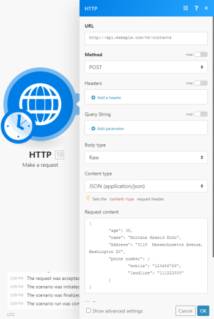

# HTTP > Make a request module {#http-make-a-request-module}

*`Adobe Workfront Fusion`* requires an *`Adobe Workfront Fusion`* license in addition to an *`Adobe Workfront`* license.
The HTTP > Make a request module is a universal module that enables you to configure an HTTP request and submit it to a server. The received HTTP response is then contained in the output bundle.

## Access requirements {#access-requirements}

You must have the following access to use the functionality in this article:

<table style="width: 100%;margin-left: 0;margin-right: auto;mc-table-style: url('../../../Resources/TableStyles/TableStyle-List-options-in-steps.css');" class="TableStyle-TableStyle-List-options-in-steps" cellspacing="0"> 
 <col class="TableStyle-TableStyle-List-options-in-steps-Column-Column1"> 
 <col class="TableStyle-TableStyle-List-options-in-steps-Column-Column2"> 
 <tbody> 
  <tr class="TableStyle-TableStyle-List-options-in-steps-Body-LightGray"> 
   <td class="TableStyle-TableStyle-List-options-in-steps-BodyE-Column1-LightGray" role="rowheader">Adobe Workfront plan*</td> 
   <td class="TableStyle-TableStyle-List-options-in-steps-BodyD-Column2-LightGray"> 
Pro or higher
 </td> 
  </tr> 
  <tr class="TableStyle-TableStyle-List-options-in-steps-Body-MediumGray"> 
   <td class="TableStyle-TableStyle-List-options-in-steps-BodyE-Column1-MediumGray" role="rowheader">Adobe Workfront Fusion license**</td> 
   <td class="TableStyle-TableStyle-List-options-in-steps-BodyD-Column2-MediumGray"> 
Workfront Fusion for Work Automation and Integration 
 
Workfront Fusion for Work Automation 
 </td> 
  </tr> 
  <tr class="TableStyle-TableStyle-List-options-in-steps-Body-LightGray"> 
   <td class="TableStyle-TableStyle-List-options-in-steps-BodyB-Column1-LightGray" role="rowheader">Product</td> 
   <td class="TableStyle-TableStyle-List-options-in-steps-BodyA-Column2-LightGray">Your organization must purchase Adobe Workfront Fusion as well as Adobe Workfront to use functionality described in this article.</td> 
  </tr> 
 </tbody> 
</table>

&#42;To find out what plan, license type, or access you have, contact your *`Workfront administrator`*.

## HTTP > Make a request module configuration {#http-make-a-request-module-configuration}

When you configure the HTTP > Make a request module, *`Adobe Workfront Fusion`* displays the fields listed below. A bolded title in a module indicates a required field.

If you see the map button above a field or function, you can use it to set variables and functions for that field. For more information, see [Map information from one module to another](map-information-between-modules.md).

<table style="width: 717px;mc-table-style: url('../../../Resources/TableStyles/TableStyle-List-options-in-steps.css');" class="TableStyle-TableStyle-List-options-in-steps" cellspacing="0"> 
 <col class="TableStyle-TableStyle-List-options-in-steps-Column-Column1"> 
 <col class="TableStyle-TableStyle-List-options-in-steps-Column-Column2"> 
 <tbody> 
  <tr class="TableStyle-TableStyle-List-options-in-steps-Body-LightGray"> 
   <td class="TableStyle-TableStyle-List-options-in-steps-BodyE-Column1-LightGray" role="rowheader">Evaluate all states as errors (except for 2xx and 3xx ) </td> 
   <td class="TableStyle-TableStyle-List-options-in-steps-BodyD-Column2-LightGray"> 
Use this option to set up error handling.
 
For more information, see <a href="error-handling.md" class="MCXref xref">Error handling</a>.
 </td> 
  </tr> 
  <tr class="TableStyle-TableStyle-List-options-in-steps-Body-MediumGray"> 
   <td class="TableStyle-TableStyle-List-options-in-steps-BodyE-Column1-MediumGray" role="rowheader">URL </td> 
   <td class="TableStyle-TableStyle-List-options-in-steps-BodyD-Column2-MediumGray"> 
Enter the URL you want to send a request to, such as an API endpoint, website, etc.
 </td> 
  </tr> 
  <tr class="TableStyle-TableStyle-List-options-in-steps-Body-LightGray"> 
   <td class="TableStyle-TableStyle-List-options-in-steps-BodyE-Column1-LightGray" role="rowheader"> 
Method
 </td> 
   <td class="TableStyle-TableStyle-List-options-in-steps-BodyD-Column2-LightGray"> 
Select the HTTP request method you need to configure the API call. For more information, see <a href="http-request-methods.md" class="MCXref xref">HTTP request methods</a>.
 </td> 
  </tr> 
  <tr class="TableStyle-TableStyle-List-options-in-steps-Body-MediumGray"> 
   <td class="TableStyle-TableStyle-List-options-in-steps-BodyE-Column1-MediumGray" role="rowheader">Headers </td> 
   <td class="TableStyle-TableStyle-List-options-in-steps-BodyD-Column2-MediumGray"> 
Add the headers of the request in the form of a standard JSON object.For example, <code>{"Content-type":"application/json"}</code>
 </td> 
  </tr> 
  <tr class="TableStyle-TableStyle-List-options-in-steps-Body-LightGray"> 
   <td class="TableStyle-TableStyle-List-options-in-steps-BodyE-Column1-LightGray" role="rowheader">Query String</td> 
   <td class="TableStyle-TableStyle-List-options-in-steps-BodyD-Column2-LightGray"> 
 Enter the desired query key-value pairs.
 </td> 
  </tr> 
  <tr class="TableStyle-TableStyle-List-options-in-steps-Body-MediumGray"> 
   <td class="TableStyle-TableStyle-List-options-in-steps-BodyE-Column1-MediumGray" role="rowheader"> 
Body type
 </td> 
   <td class="TableStyle-TableStyle-List-options-in-steps-BodyD-Column2-MediumGray"> 
The HTTP Body is the data bytes transmitted in an HTTP transaction message immediately following the headers if there are any to be used.
 
    <ul> 
     <li> 
Raw 
 
The Raw body type is generally suitable for most HTTP body requests even in situations where developer documentation does not specify data to send.
 
Specify a form of parsing the data in the Content type field.
 
Despite the content type selected, data is entered in any format that is stipulated or required by the developer documentation.
 </li> 
     <li> 
Application/x-www-form-urlencoded 
 
This body type is to POST data using <code>application/x-www-form-urlencoded</code>.
 
For <code>application/x-www-form-urlencoded</code>, the body of the HTTP message sent to the server is essentially one query string. The keys and values are encoded in key-value pairs separated by <code>&amp;</code> and with a <code>=</code> between the key and the value. 
 
For binary data, <code>use multipart/form-data</code> instead.
 
      
Example: </b>">
       <b>Example: </b> 
       
Example of the resulting HTTP request format:
 
       
<code>field1=value1&amp;field2=value2</code> 
 
      
 </li> 
     <li> 
Multipart/form-data 
 
The Multipart/form-data is an HTTP multipart request used to send files and data. It is commonly used to upload files to the server.
 
Add fields to be sent in the request. Each field must contain Key-Value pair.
 
      <ul> 
       <li> 
Text 
 
Enter the key and value to be sent within the request body.
 </li> 
       <li> 
File  
 
Enter the key and specify the source file you want to send in the request body.
 
Map the file you want to upload from the previous module (such as HTTP &gt; Get a File or Google Drive &gt; Download a File), or enter the file name and file data manually.
 </li> 
      </ul> </li> 
    </ul> </td> 
  </tr> 
  <tr class="TableStyle-TableStyle-List-options-in-steps-Body-LightGray"> 
   <td class="TableStyle-TableStyle-List-options-in-steps-BodyE-Column1-LightGray" role="rowheader"> 
Parse response
 </td> 
   <td class="TableStyle-TableStyle-List-options-in-steps-BodyD-Column2-LightGray"> 
Enable this option to automatically parse responses and convert JSON and XML responses so you don't need to use JSON &gt; Parse JSON or XML &gt; Parse XML modules.
 
Before you can use parsed JSON or XML content, run the module once manually so that the module can recognize the response content and allow you to map it in subsequent modules.
 </td> 
  </tr> 
  <tr class="TableStyle-TableStyle-List-options-in-steps-Body-MediumGray"> 
   <td class="TableStyle-TableStyle-List-options-in-steps-BodyE-Column1-MediumGray" role="rowheader"> 
User name
 </td> 
   <td class="TableStyle-TableStyle-List-options-in-steps-BodyD-Column2-MediumGray"> 
 Enter the user name if you want to send a request using basic authorization.
 </td> 
  </tr> 
  <tr class="TableStyle-TableStyle-List-options-in-steps-Body-LightGray"> 
   <td class="TableStyle-TableStyle-List-options-in-steps-BodyE-Column1-LightGray" role="rowheader">Password </td> 
   <td class="TableStyle-TableStyle-List-options-in-steps-BodyD-Column2-LightGray"> 
Enter the password if you want to send a request using basic authorization.
 </td> 
  </tr> 
  <tr class="TableStyle-TableStyle-List-options-in-steps-Body-MediumGray"> 
   <td class="TableStyle-TableStyle-List-options-in-steps-BodyE-Column1-MediumGray" role="rowheader">Timeout </td> 
   <td class="TableStyle-TableStyle-List-options-in-steps-BodyD-Column2-MediumGray"> 
Specify the request timeout in seconds (1-300). The default is 40 seconds.
 </td> 
  </tr> 
  <tr class="TableStyle-TableStyle-List-options-in-steps-Body-LightGray"> 
   <td class="TableStyle-TableStyle-List-options-in-steps-BodyE-Column1-LightGray" role="rowheader">Share cookies with other HTTP modules</td> 
   <td class="TableStyle-TableStyle-List-options-in-steps-BodyD-Column2-LightGray"> 
 Enable this option to share cookies from the server with all HTTP modules in your scenario.
 </td> 
  </tr> 
  <tr class="TableStyle-TableStyle-List-options-in-steps-Body-MediumGray"> 
   <td class="TableStyle-TableStyle-List-options-in-steps-BodyE-Column1-MediumGray" role="rowheader">Self-signed certificate</td> 
   <td class="TableStyle-TableStyle-List-options-in-steps-BodyD-Column2-MediumGray"> 
 Upload your certificate if you want to use TLS using your self-signed certificate.
 </td> 
  </tr> 
  <tr class="TableStyle-TableStyle-List-options-in-steps-Body-LightGray"> 
   <td class="TableStyle-TableStyle-List-options-in-steps-BodyE-Column1-LightGray" role="rowheader">Reject connections that are using unverified (self-signed) certificates </td> 
   <td class="TableStyle-TableStyle-List-options-in-steps-BodyD-Column2-LightGray"> 
Enable this option to reject connections that are using unverified TLS certificates.
 </td> 
  </tr> 
  <tr class="TableStyle-TableStyle-List-options-in-steps-Body-MediumGray"> 
   <td class="TableStyle-TableStyle-List-options-in-steps-BodyE-Column1-MediumGray" role="rowheader">Follow redirect</td> 
   <td class="TableStyle-TableStyle-List-options-in-steps-BodyD-Column2-MediumGray"> 
 Enable this option to follow the URL redirects with 3xx responses.
 </td> 
  </tr> 
  <tr class="TableStyle-TableStyle-List-options-in-steps-Body-LightGray"> 
   <td class="TableStyle-TableStyle-List-options-in-steps-BodyE-Column1-LightGray" role="rowheader">Follow all redirects </td> 
   <td class="TableStyle-TableStyle-List-options-in-steps-BodyD-Column2-LightGray"> 
Enable this option to follow the URL redirects with all response codes.
 </td> 
  </tr> 
  <tr class="TableStyle-TableStyle-List-options-in-steps-Body-MediumGray"> 
   <td class="TableStyle-TableStyle-List-options-in-steps-BodyE-Column1-MediumGray" role="rowheader"> 
Disable serialization of multiple same query string keys as arrays
 </td> 
   <td class="TableStyle-TableStyle-List-options-in-steps-BodyD-Column2-MediumGray"> 
By default, Workfront Fusion handles multiple values for the same URL query string parameter key as arrays. For example, <code>www.test.com?foo=bar&amp;foo=baz</code> will be converted to <code>www.test.com?foo[0]=bar&amp;foo[1]=baz</code>. Activate this option to disable this feature. 
 </td> 
  </tr> 
  <tr class="TableStyle-TableStyle-List-options-in-steps-Body-LightGray"> 
   <td class="TableStyle-TableStyle-List-options-in-steps-BodyE-Column1-LightGray" role="rowheader">Request compressed content</td> 
   <td class="TableStyle-TableStyle-List-options-in-steps-BodyD-Column2-LightGray"> 
 Enable this option to request a compressed version of the website.
 
Adds an <code>Accept-Encoding</code> header to request compressed content.
 </td> 
  </tr> 
  <tr class="TableStyle-TableStyle-List-options-in-steps-Body-MediumGray"> 
   <td class="TableStyle-TableStyle-List-options-in-steps-BodyB-Column1-MediumGray" role="rowheader">Use Mutual TLS</td> 
   <td class="TableStyle-TableStyle-List-options-in-steps-BodyA-Column2-MediumGray"> 
Enable this option to use Mutual TLS in the HTTP request.
 
For more information on Mutual TLS, see <a href="use-mtls-in-http-modules.md" class="MCXref xref">Use Mutual TLS in HTTP modules</a>.
 </td> 
  </tr> 
 </tbody> 
</table>

` `**Example: **`` This example shows how to set up the module to submit a POST request with JSON payload:

>[!NOTE]
>
>To make sure your JSON is valid, you can use one of the available online services such as [https://jsonlint.com/](https://jsonlint.com/). You can also use JSON > Create JSON module to create the JSON dynamically and take care of all the necessary escaping.
>
>
>Mixing JSON pieces with expressions and items directly in the Request content field is not recommended as it can result in invalid JSON.

