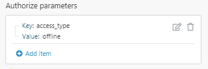

# HTTP > Make an OAuth 2.0 request module

Adobe Workfront Fusion requires an Adobe Workfront Fusion license in addition to an Adobe Workfront license.
In order to make an HTTP(S) request to servers that require an OAuth 2.0 authorization, you first need to create an OAuth connection. Adobe Workfront Fusion ensures that all calls made with this connection have the appropriate authorization headers and automatically refresh associated tokens when required.

Workfront Fusion supports the following OAuth 2.0 authentication flows:

* Authorization Code Flow
* Implicit Flow

Other flows, such as Resource Owner Password Credentials Flow and Client Credentials Flow, are not automatically supported through this module.

For more information on OAuth 2.0 authentication, see [The OAuth 2.0 Authorization Framework](https://tools.ietf.org/html/rfc6749).

## Access requirements

You must have the following access to use the functionality in this article:

<table cellspacing="0"> 
 <col> 
 <col> 
 <tbody> 
  <tr> 
   <td role="rowheader">Adobe Workfront plan*</td> 
   <td> 
Pro or higher
 </td> 
  </tr> Adobe Workfront license* Plan, Work 
  <tr> 
   <td role="rowheader">Adobe Workfront Fusion license**</td> 
   <td> 
Workfront Fusion for Work Automation and Integration 
  </td> 
  </tr> 
  <tr> 
   <td role="rowheader">Product</td> 
   <td>Your organization must purchase Adobe Workfront Fusion as well as Adobe Workfront to use functionality described in this article.</td> 
  </tr> <!--
   Access level configurations* You must be a Workfront Fusion administrator for your organization. You must be a Workfront Fusion administrator for your team.
  --> 
 </tbody> 
</table>

&#42;To find out what plan, license type, or access you have, contact your Workfront administrator.

&#42;&#42;For information on Adobe Workfront Fusion licenses, see [Adobe Workfront Fusion licenses](../../../workfront-fusion/get-started/license-automation-vs-integration.md)

## Creating a connection for an OAuth request

* [General instructions for creating a connection in the HTTP > Make an OAuth 2.0 request module](#general) 
* [Instructions for creating a connection to Google in the HTTP > Make an OAuth 2.0 request module](#instruct) 
* [Instructions for connecting to Microsoft Graph API via the HTTP > Make an OAuth 2.0 request module](#instruct2)

### General instructions for creating a connection in the HTTP > Make an OAuth 2.0 request module

<ol> 
 <li value="1"> 
Create an OAuth client in the target service with which you want Adobe Workfront Fusion to communicate. This option is most likely found in the Developer section of the given service. 
 
  <ol style="list-style-type: lower-alpha;"> 
   <li value="1"> 
When creating a client, enter the appropriate URL in the <code>Redirect URL</code> or <code>Callback URL</code> field:
 
    <table cellspacing="0"> 
     <col> 
     <col> 
     <tbody> 
      <tr> 
       <td role="rowheader">Americas / APAC</td> 
       <td>https://app.workfrontfusion.com/oauth/cb/oauth2</td> 
      </tr> 
      <tr> 
       <td role="rowheader">EMEA </td> 
       <td>https://app-eu.workfrontfusion.com/oauth/cb/oauth2</td> 
      </tr> 
     </tbody> 
    </table> </li> 
   <li value="2"> 
After you create the client, the given service displays 2 keys: <code>Client ID</code> and <code>Client Secret</code>. Some services call these <code>App Key</code> and <code>App Secret</code>. Save the key and secret in a secure location, so you can provide them when creating the connection in Workfront Fusion.
 </li> 
  </ol> </li> 
 <li value="2"> 
Find the <code>Authorize URI</code> and <code>Token URI</code> in the API documentation of the given service. These are URL addresses through which Workfront Fusion communicates with the target service. The addresses serve for OAuth authorization.
 <note type="note">
    If the service uses Implicit flow, you will need only the 
   <code>Authorize URI</code>. 
  </note> 
  
Example: </b>">
   <b>Example: </b> 
   
Yahoo addresses:
 
   <ul> 
    <li>Authorize URI: <code>https://api.login.yahoo.com/oauth2/request_auth</code></li> 
    <li>Token URI: <code>https://api.login.yahoo.com/oauth2/get_token</code></li> 
   </ul> 
  
 </li> 
 <li value="3">(Conditional) If the target service uses scopes (access rights), check how the service separates individual scopes and make sure you set the separator in the advanced settings accordingly. If the separator is not set correctly, Workfront Fusion fails to create the connection, and you receive an invalid scope error.</li> 
 <li value="4">After you complete the steps above, you can start to create the OAuth connection in Workfront Fusion. Add the OAuth 2.0 HTTP(S) request and response processing module to your scenario.</li> 
 <li value="5">In the module's Connection field, click Add.</li> 
 <li value="6"> 
Fill in the following fields to create a connection: 
 
  <table cellspacing="0"> 
   <col> 
   <col> 
   <tbody> 
    <tr> 
     <td role="rowheader">Connection name </td> 
     <td> 
Enter the name of the connection.
 </td> 
    </tr> 
    <tr> 
     <td role="rowheader"> 
Flow type
 </td> 
     <td> 
Select the flow for obtaining tokens.
 
      <ul> 
       <li>Authorization Code: Enter the <code>Authorize URI</code> and <code>Token URI</code> from the service's API documentation.</li> 
       <li>Implicit: Enter the <code>Authorize URI</code> from the service's API documentation.</li> 
      </ul> </td> 
    </tr> 
    <tr> 
     <td role="rowheader">Scope </td> 
     <td> 
Add individual scopes. You can find this information in the given service's developer (API) documentation.
 </td> 
    </tr> 
    <tr> 
     <td role="rowheader">Scope separator </td> 
     <td> 
Select what the scopes entered above should be separated by. You can find this information in the given service's developer (API) documentation.
 
Warning: </b>"><b>Warning: </b>If the separator is not set correctly, Workfront Fusion fails to create the connection and you receive an invalid scope error.
 </td> 
    </tr> 
    <tr> 
     <td role="rowheader">Client ID </td> 
     <td> 
Enter the Client ID. You obtained the Client ID when you created an OAuth client in the service you want to connect.
 </td> 
    </tr> 
    <tr> 
     <td role="rowheader">Client Secret</td> 
     <td> 
 Enter the Client Secret. You obtained the Client Secret when you created an OAuth client in the service you want to connect.
 </td> 
    </tr> 
    <tr> 
     <td role="rowheader"> 
Authorize parameters
 </td> 
     <td> 
Add any parameters that you want to include in the authorization call. The following standard parameters are always automatically included and do not need to be added.
 
Standard parameters:
 
      <ul> 
       <li> 
response_type 
 
 <code>code </code>for Authorization Code flow and <code>token </code>for Implicit flow
 </li> 
       <li> 
redirect_uri 
 
        <table cellspacing="0"> 
         <col> 
         <col> 
         <tbody> 
          <tr> 
           <td role="rowheader">Americas / APAC</td> 
           <td>https://app.workfrontfusion.com/oauth/cb/oauth2</td> 
          </tr> 
          <tr> 
           <td role="rowheader">EMEA </td> 
           <td>https://app-eu.workfrontfusion.com/oauth/cb/oauth2</td> 
          </tr> 
         </tbody> 
        </table> </li> 
       <li> 
client_id 
 
 The Client ID you received when creating the account
 </li> 
      </ul> </td> 
    </tr> 
    <tr> 
     <td role="rowheader"> 
Access token parameters
 </td> 
     <td> 
Add any parameters that you want to include in the token call. The following standard parameters are always automatically included and do not need to be added.
 
Standard parameters:
 
      <ul> 
       <li>grant_type: <code>authorization_code</code></li> 
       <li> 
redirect_uri: 
 
        <table cellspacing="0"> 
         <col> 
         <col> 
         <tbody> 
          <tr> 
           <td role="rowheader">Americas / APAC</td> 
           <td>https://app.workfrontfusion.com/oauth/cb/oauth2</td> 
          </tr> 
          <tr> 
           <td role="rowheader">EMEA </td> 
           <td>https://app-eu.workfrontfusion.com/oauth/cb/oauth2</td> 
          </tr> 
         </tbody> 
        </table> </li> 
       <li>client_id: The Client ID you received when creating the account is automatically included in the request body</li> 
       <li>client_secret: The Client Secret you received when creating the account is automatically included in the request body</li> 
       <li>code: The code returned by the authorization request</li> 
      </ul> <note type="note"> 
       
The OAuth 2.0 standard supports at least 2 methods of client authentication during this step (<code>client_secret_basic</code> and <code>client_secret_post</code>). Workfront Fusion automatically sends the specified client ID and secret through the <code>client_secret_post</code> method. Therefore, these parameters are included as part of the token request body automatically. 
 
       
For more information on OAuth 2.0 authentication, see <a href="https://tools.ietf.org/html/rfc6749">The OAuth 2.0 Authorization Framework</a>.
 
      </note> </td> 
    </tr> 
    <tr> 
     <td role="rowheader"> 
Refresh token parameters
 </td> 
     <td> 
Add any parameters that you want to include in the token call. The following standard parameters are always automatically included and do not need to be added.
 
Standard parameters:
 
      <ul> 
       <li> 
grant_type: <code>refresh_token</code>
 </li> 
       <li> 
refresh_token: The most recent refresh token obtained by the service you are connecting to
 </li> 
       <li> 
client_id: The Client ID you received when creating the account is automatically included in the request body
 </li> 
       <li> 
client_secret: The Client Secret you received when creating the account is automatically included in the request body
 </li> 
      </ul> <note type="note"> 
       
The OAuth 2.0 standard supports at least 2 methods of client authentication during this step (<code>client_secret_basic</code> and <code>client_secret_post</code>). Workfront Fusion automatically sends the specified client ID and secret through the <code>client_secret_post</code> method. Therefore, these parameters are included as part of the token request body automatically. 
 
       
For more information on OAuth 2.0 authentication, see <a href="https://tools.ietf.org/html/rfc6749">The OAuth 2.0 Authorization Framework</a>.
 
      </note> </td> 
    </tr> 
    <tr> 
     <td role="rowheader"> 
Custom Headers
 </td> 
     <td> 
Specify any additional keys and values to include in the header of Token and Refresh Token steps.
 <note type="note"> 
       
The OAuth 2.0 standard supports at least 2 methods of client authentication during this step (<code>client_secret_basic</code> and <code>client_secret_post</code>). Workfront Fusion does not automatically support the <code>client_secret_basic</code> method. If the service that you are connecting to expects the Client ID and Client Secret to be combined into a single string and then base64 encoded into the Authorization header, then you should add that header and key value here.
 
       
 For more information on OAuth 2.0 authentication, see <a href="https://tools.ietf.org/html/rfc6749">The OAuth 2.0 Authorization Framework</a>.
 
      </note> </td> 
    </tr> 
    <tr> 
     <td role="rowheader"> 
Token placement
 </td> 
     <td> 
Select whether to send the token in the header, query string, or in both when connecting to the specified URL.
 
Tokens are most commonly sent in the request header.
 </td> 
    </tr> 
    <tr> 
     <td role="rowheader">Header token name </td> 
     <td> 
Enter the name of the authorization token in the header. Default: <code>Bearer</code>.
 </td> 
    </tr> 
    <tr> 
     <td role="rowheader">Query string parameter name </td> 
     <td> 
Enter the name of the authorization token in the query string. Default: <code>access_token</code>.
 </td> 
    </tr> 
   </tbody> 
  </table> </li> 
 <li value="7">Click Continue to save connection settings. </li> 
 <li value="8">Continue to <a href="#oauth" class="MCXref xref">OAuth 2.0 request module setup</a>.</li> 
</ol>

### Instructions for creating a connection to Google in the HTTP > Make an OAuth 2.0 request module

The following example shows how to use the HTTP > Make an OAuth 2.0 request module to connect to Google.

<ol> 
 <li value="1"> 
Ensure that you have created a project, configured OAuth settings, and generated your credentials as described in <a href="../../../workfront-fusion/connections/connect-fusion-to-google-using-oauth.md" class="MCXref xref">Connect Adobe Workfront Fusion to Google Services using a custom OAuth client</a>.
 </li> 
 <li value="2"> 
Open the HTTP > Make an OAuth 2.0 request module.
 </li> 
 <li value="3"> 
Click Add next to the connection box.
 </li> 
 <li value="4"> 
Enter the following values:
 
  <table cellspacing="0"> 
   <col> 
   <col> 
   <tbody> 
    <tr> 
     <td role="rowheader">Connection name </td> 
     <td> 
Enter the name of the connection.
 </td> 
    </tr> 
    <tr> 
     <td role="rowheader"> 
Flow type
 </td> 
     <td> 
Authorization Code
 </td> 
    </tr> 
    <tr> 
     <td role="rowheader">Authorize URI</td> 
     <td><code>https://accounts.google.com/o/oauth2/v2/auth</code> </td> 
    </tr> 
    <tr> 
     <td role="rowheader">Token URI</td> 
     <td><code>https://www.googleapis.com/oauth2/v4/token</code> </td> 
    </tr> 
    <tr> 
     <td role="rowheader">Scope </td> 
     <td> 
Add individual scopes. For more information on scopes, see <a href="https://developers.google.com/identity/protocols/oauth2/scopes">OAuth 2.O Scopes for Google APIs</a> in the Google documentation.
 </td> 
    </tr> 
    <tr> 
     <td role="rowheader">Scope separator </td> 
     <td> 
SPACE
 </td> 
    </tr> 
    <tr> 
     <td role="rowheader">Client ID </td> 
     <td> 
Enter your Google Client ID. 
 
To create a client ID, see <a href="../../../workfront-fusion/connections/connect-fusion-to-google-using-oauth.md#create2" class="MCXref xref">Create OAuth Credentials</a> in <a href="../../../workfront-fusion/connections/connect-fusion-to-google-using-oauth.md" class="MCXref xref">Connect Adobe Workfront Fusion to Google Services using a custom OAuth client</a>.
 </td> 
    </tr> 
    <tr> 
     <td role="rowheader">Client Secret</td> 
     <td> 
Enter your Google Client Secret. 
 
To create a client secret, see <a href="../../../workfront-fusion/connections/connect-fusion-to-google-using-oauth.md#create2" class="MCXref xref">Create OAuth Credentials</a> in <a href="../../../workfront-fusion/connections/connect-fusion-to-google-using-oauth.md" class="MCXref xref">Connect Adobe Workfront Fusion to Google Services using a custom OAuth client</a>.
 </td> 
    </tr> 
    <tr> 
     <td role="rowheader"> 
Authorize parameters
 </td> 
     <td> 
Add <code>access_type</code> - <code>offline </code>key-value pair.
 
  
 <note type="note">
       If you experience authentication issues, for example with token refreshing, try adding the 
       <code>prompt </code>- 
       <code>consent </code>key-value pair.
      </note> </td> 
    </tr> 
   </tbody> 
  </table> </li> 
 <li value="5">Click Continue to save connection settings. </li> 
 <li value="6">Continue to <a href="#oauth" class="MCXref xref">OAuth 2.0 request module setup</a>.</li> 
</ol>

### Instructions for connecting to Microsoft Graph API via the HTTP > Make an OAuth 2.0 request module

For instructions regarding Microsoft Graph API, see [Call the MS Graph REST API via the HTTP > Make an OAuth 2.0 request module](../../../workfront-fusion/connections/call-the-ms-graph-rest-api-.md).

## OAuth 2.0 request module setup

When you have established an Oauth 2.0 connection as described in [Creating a connection for an OAuth request](#creating), continue setting up the module as desired. All authorization tokens are automatically included in this request, and in any other request that uses the same connection.

When you configure the HTTP > Make an OAuth 2.0 request module, Workfront Fusion displays the fields listed below. A bolded title in a module indicates a required field.

If you see the map button above a field or function, you can use it to set variables and functions for that field. For more information, see [Map information from one module to another](../../../workfront-fusion/mapping/map-information-between-modules.md).

<!--

-->

<table cellspacing="0"> 
 <col> 
 <col> 
 <tbody> Connection For information on setting up a connection, see Creating a connection for an OAuth request in this article. 
  <tr> 
   <td role="rowheader">Evaluate all states as errors (except for 2xx and 3xx ) </td> 
   <td> 
Use this option to set up error handling.
 
For more information, see <a href="../../../workfront-fusion/errors/error-handling.md" class="MCXref xref">Error handling</a>.
 </td> 
  </tr> 
  <tr> 
   <td role="rowheader">URL </td> 
   <td> 
Enter the URL you want to send a request to, such as an API endpoint, website, etc.
 </td> 
  </tr> 
  <tr> 
   <td role="rowheader"> 
Method
 </td> 
   <td> 
Select the HTTP request method you need to configure the API call. For more information, see <a href="../../../workfront-fusion/modules/http-request-methods.md" class="MCXref xref">HTTP request methods</a>.
 </td> 
  </tr> 
  <tr> 
   <td role="rowheader">Headers </td> 
   <td> 
Add the headers of the request in the form of a standard JSON object. For example, <code>{"Content-type":"application/json"}</code>
 </td> 
  </tr> 
  <tr> 
   <td role="rowheader">Query String</td> 
   <td> 
 Enter the desired query key-value pairs.
 </td> 
  </tr> 
  <tr> 
   <td role="rowheader"> 
Body type
 </td> 
   <td> 
The HTTP Body is the data bytes transmitted in an HTTP transaction message immediately following the headers if there are any to be used.
 
    <ul> 
     <li> 
Raw 
 
The Raw body type is generally suitable for most HTTP body requests even in situations where developer documentation does not specify data to send.
 
Specify a form of parsing the data in the Content type field.
 
Despite the content type selected, data is entered in any format that is stipulated or required by the developer documentation.
 </li> 
     <li> 
Application/x-www-form-urlencoded 
 
This body type is to POST data using <code>application/x-www-form-urlencoded</code>.
 
For <code>application/x-www-form-urlencoded</code>, the body of the HTTP message sent to the server is essentially one query string. The keys and values are encoded in key-value pairs separated by <code>&amp;</code> and with an <code>=</code> between the key and the value. 
 
For binary data, <code>use multipart/form-data</code> instead.
 
      
Example: </b>">
       <b>Example: </b> 
       
Example of the resulting HTTP request format:
 
       
<code>field1=value1&amp;field2=value2</code> 
 
      
 </li> 
     <li> 
Multipart/form-data 
 
The Multipart/form-data is an HTTP multipart request used to send files and data. It is commonly used to upload files to the server.
 
Add fields to be sent in the request. Each field must contain a key-value pair.
 
      <ul> 
       <li> 
Text 
 
Enter the key and value to be sent within the request body.
 </li> 
       <li> 
File  
 
Enter the key and specify the source file you want to send in the request body.
 
Map the file you want to upload from the previous module (such as HTTP &gt; Get a File or Google Drive &gt; Download a File), or enter the file name and file data manually.
 </li> 
      </ul> </li> 
    </ul> </td> 
  </tr> 
  <tr> 
   <td role="rowheader"> 
Parse response
 </td> 
   <td> 
Enable this option to automatically parse responses and convert JSON and XML responses so you don't need to use JSON &gt; Parse JSON or XML &gt; Parse XML modules.
 
Before you can use parsed JSON or XML content, run the module once manually so that the module can recognize the response content and allow you to map it in subsequent modules.
 </td> 
  </tr> 
  <tr> 
   <td role="rowheader">Timeout </td> 
   <td> 
Enter the request timeout in seconds (1-300). The default is 40 seconds.
 </td> 
  </tr> 
  <tr> 
   <td role="rowheader">Share cookies with other HTTP modules</td> 
   <td> 
 Enable this option to share cookies from the server with all HTTP modules in your scenario.
 </td> 
  </tr> 
  <tr> 
   <td role="rowheader">Self-signed certificate</td> 
   <td> 
 Upload your certificate if you want to use TLS using your self-signed certificate.
 </td> 
  </tr> 
  <tr> 
   <td role="rowheader">Reject connections that are using unverified (self-signed) certificates </td> 
   <td> 
Enable this option to reject connections that are using unverified TLS certificates.
 </td> 
  </tr> 
  <tr> 
   <td role="rowheader">Follow redirect</td> 
   <td> 
 Enable this option to follow the URL redirects with 3xx responses.
 </td> 
  </tr> 
  <tr> 
   <td role="rowheader">Follow all redirects </td> 
   <td> 
Enable this option to follow the URL redirects with all response codes.
 </td> 
  </tr> 
  <tr> 
   <td role="rowheader"> 
Disable serialization of multiple same query string keys as arrays
 </td> 
   <td> 
By default, Workfront Fusion handles multiple values for the same URL query string parameter key as arrays. For example, <code>www.test.com?foo=bar&amp;foo=baz</code> will be converted to <code>www.test.com?foo[0]=bar&amp;foo[1]=baz</code>. Activate this option to disable this feature. 
 </td> 
  </tr> 
  <tr> 
   <td role="rowheader">Request compressed content</td> 
   <td> 
 Enable this option to request a compressed version of the website.
 
This adds an <code>Accept-Encoding</code> header to request compressed content.
 </td> 
  </tr> 
  <tr> 
   <td role="rowheader">Use Mutual TLS</td> 
   <td> 
Enable this option to use Mutual TLS in the HTTP request.
 
For more information on Mutual TLS, see <a href="../../../workfront-fusion/apps-and-their-modules/http-modules/use-mtls-in-http-modules.md" class="MCXref xref">Use Mutual TLS in HTTP modules</a>.
 </td> 
  </tr> 
 </tbody> 
</table>

