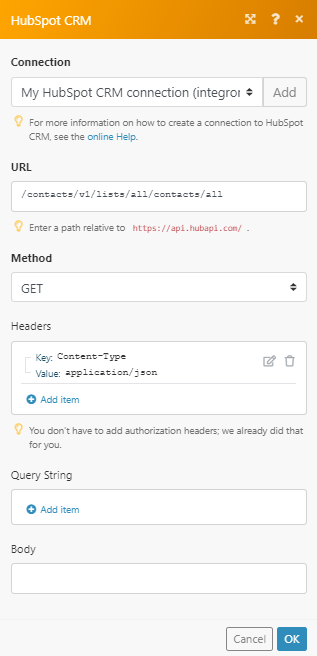
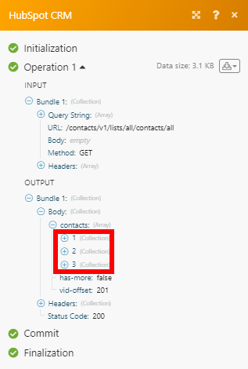

# HubSpot CRM modules {#hubspot-crm-modules}

The HubSpot CRM modules enable you to monitor events, records, contacts, engagements, file and form submissions, or create, retrieve, update and delete records, contacts, engagements, events, or files in your HubSpot CRM account.


## Access requirements {#access-requirements}

You must have the following access to use the functionality in this article:

<table style="width: 100%;margin-left: 0;margin-right: auto;mc-table-style: url('../../Resources/TableStyles/TableStyle-List-options-in-steps.css');" class="TableStyle-TableStyle-List-options-in-steps" cellspacing="0"> 
 <col class="TableStyle-TableStyle-List-options-in-steps-Column-Column1"> 
 <col class="TableStyle-TableStyle-List-options-in-steps-Column-Column2"> 
 <tbody> 
  <tr class="TableStyle-TableStyle-List-options-in-steps-Body-LightGray"> 
   <td class="TableStyle-TableStyle-List-options-in-steps-BodyE-Column1-LightGray" role="rowheader"><span class="mc-variable WFVariables.FullProdNameWF variable varname">Adobe Workfront</span> plan*</td> 
   <td class="TableStyle-TableStyle-List-options-in-steps-BodyD-Column2-LightGray"> <p><span class="mc-variable WFVariables.WFPlan-Pro variable varname">Pro</span> or higher</p> </td> 
  </tr> 
  <tr class="TableStyle-TableStyle-List-options-in-steps-Body-MediumGray"> 
   <td class="TableStyle-TableStyle-List-options-in-steps-BodyE-Column1-MediumGray" role="rowheader"><span class="mc-variable WFVariables.FullProdNameWFF variable varname">Adobe Workfront Fusion</span> license**</td> 
   <td class="TableStyle-TableStyle-List-options-in-steps-BodyD-Column2-MediumGray"> <p><span class="mc-variable WFVariables.WFFusionIntegration variable varname">Workfront Fusion for Work Automation and Integration</span> </p> </td> 
  </tr> 
  <tr class="TableStyle-TableStyle-List-options-in-steps-Body-LightGray"> 
   <td class="TableStyle-TableStyle-List-options-in-steps-BodyB-Column1-LightGray" role="rowheader">Product</td> 
   <td class="TableStyle-TableStyle-List-options-in-steps-BodyA-Column2-LightGray">Your organization must purchase <span class="mc-variable WFVariables.FullProdNameWFF variable varname">Adobe Workfront Fusion</span> as well as <span class="mc-variable WFVariables.FullProdNameWF variable varname">Adobe Workfront</span> to use functionality described in this article.</td> 
  </tr> 
 </tbody> 
</table>

&#42;To find out what plan, license type, or access you have, contact your *`Workfront administrator`*.


## Prerequisites {#prerequisites}

To use HubSpot CRM modules, you must have a HubSpot CRM account.


## Connect *`Adobe Workfront Fusion`* to HubSpot CRM {#connect-adobe-workfront-fusion-to-hubspot-crm}

For instructions about connecting your *`HubSpot CRM`* account to *`Workfront Fusion`*, see [Create a connection to Workfront Fusion - Basic instructions](connect-to-fusion-general.md)


## HubSpot CRM modules and their fields {#hubspot-crm-modules-and-their-fields}

When you configure *`Hubspot CRM`* modules, *`Workfront Fusion`* displays the fields listed below. Along with these, additional *`Hubspot CRM`* fields might display, depending on factors such as your access level in the app or service. A bolded title in a module indicates a required field.


If you see the map button above a field or function, you can use it to set variables and functions for that field. For more information, see [Map information from one module to another](map-information-between-modules.md).


* [CRM objects](#crm) 
* [Records (Deals, Contacts, and Companies)](#records) 
* [Contacts](#contacts) 
* [Deals](#deals) 
* [Companies](#companie) 
* [Files](#files) 
* [Tickets](#tickets) 
* [Make an API Call](#make) 


### CRM objects {#crm-objects}


#### Search for CRM Objects {#search-for-crm-objects}

This search module searches for CRM objects by custom properties or by query. To search for products or line items, use a special connection with a required custom scope.

<table style="width: 100%;margin-left: 0;margin-right: auto;mc-table-style: url('../../Resources/TableStyles/TableStyle-List-options-in-steps.css');" class="TableStyle-TableStyle-List-options-in-steps" cellspacing="0"> 
 <col class="TableStyle-TableStyle-List-options-in-steps-Column-Column1"> 
 <col class="TableStyle-TableStyle-List-options-in-steps-Column-Column2"> 
 <tbody> 
  <tr class="TableStyle-TableStyle-List-options-in-steps-Body-LightGray"> 
   <td class="TableStyle-TableStyle-List-options-in-steps-BodyE-Column1-LightGray" role="rowheader"> <p>Connection</p> </td> 
   <td class="TableStyle-TableStyle-List-options-in-steps-BodyD-Column2-LightGray"> <p>For instructions about connecting your <span class="mc-variable WFVariables.WFFusion-Apps variable varname">HubSpot CRM</span> account to <span class="mc-variable WFVariables.ProdNameWFF variable varname">Workfront Fusion</span>, see <a href="connect-to-fusion-general.md" class="MCXref xref" data-mc-variable-override="">Create a connection to Workfront Fusion - Basic instructions</a></p> </td> 
  </tr> 
  <tr class="TableStyle-TableStyle-List-options-in-steps-Body-MediumGray"> 
   <td class="TableStyle-TableStyle-List-options-in-steps-BodyE-Column1-MediumGray" role="rowheader">Limit</td> 
   <td class="TableStyle-TableStyle-List-options-in-steps-BodyD-Column2-MediumGray">Enter or map the maximum number of items that the module will return in one execution cycle.</td> 
  </tr> 
  <tr class="TableStyle-TableStyle-List-options-in-steps-Body-LightGray"> 
   <td class="TableStyle-TableStyle-List-options-in-steps-BodyE-Column1-LightGray" role="rowheader">Object Type to Search</td> 
   <td class="TableStyle-TableStyle-List-options-in-steps-BodyD-Column2-LightGray">Select the type of Hubspot CRM&nbsp;object that you want to search for.</td> 
  </tr> 
  <tr class="TableStyle-TableStyle-List-options-in-steps-Body-MediumGray"> 
   <td class="TableStyle-TableStyle-List-options-in-steps-BodyE-Column1-MediumGray" role="rowheader">Output properties</td> 
   <td class="TableStyle-TableStyle-List-options-in-steps-BodyD-Column2-MediumGray">Select the properties that you want to appear in the module's output. The available fields depend on the object you selected.</td> 
  </tr> 
  <tr class="TableStyle-TableStyle-List-options-in-steps-Body-LightGray"> 
   <td class="TableStyle-TableStyle-List-options-in-steps-BodyE-Column1-LightGray" role="rowheader">Filter by </td> 
   <td class="TableStyle-TableStyle-List-options-in-steps-BodyD-Column2-LightGray"> <p>Select how you want to filter the search</p> 
    <ul> 
     <li> <p><span class="bold">Query</span> </p> <p>Enter or map the query</p> </li> 
     <li> <p><span class="bold">Properties</span> </p> <p>Enter the groups or filters for your search.</p> </li> 
    </ul> </td> 
  </tr> 
  <tr class="TableStyle-TableStyle-List-options-in-steps-Body-MediumGray"> 
   <td class="TableStyle-TableStyle-List-options-in-steps-BodyB-Column1-MediumGray" role="rowheader">Sort by</td> 
   <td class="TableStyle-TableStyle-List-options-in-steps-BodyA-Column2-MediumGray"> <p>Click if you want to sort the results. If you choose to sort results, the following fields appear. </p> 
    <ul> 
     <li> <p><span class="bold">Property name</span> </p> <p>Select the property by which you want to sort results</p> </li> 
     <li> <p><span class="bold">Direction</span> </p> <p>Choose whether you want to sort the results in an ascending or descending direction.</p> </li> 
    </ul> </td> 
  </tr> 
 </tbody> 
</table>


### Records (Deals, Contacts, and Companies) {#records-deals-contacts-and-companies}


* [Create a Record (Legacy)](#create) 
* [Get a Record](#get) 
* [Update a Record](#update) 
* [Delete a Record](#delete) 
* [Get a Record Property](#get2) 
* [Watch Records](#watch) 


#### Create a Record (Legacy) {#create-a-record-legacy}

This action module creates contact, a company, or a deal.

<table style="width: 100%;margin-left: 0;margin-right: auto;mc-table-style: url('../../Resources/TableStyles/TableStyle-List-options-in-steps.css');" class="TableStyle-TableStyle-List-options-in-steps" cellspacing="0"> 
 <col class="TableStyle-TableStyle-List-options-in-steps-Column-Column1"> 
 <col class="TableStyle-TableStyle-List-options-in-steps-Column-Column2"> 
 <tbody> 
  <tr class="TableStyle-TableStyle-List-options-in-steps-Body-LightGray"> 
   <td class="TableStyle-TableStyle-List-options-in-steps-BodyE-Column1-LightGray" role="rowheader"> <p>Connection</p> </td> 
   <td class="TableStyle-TableStyle-List-options-in-steps-BodyD-Column2-LightGray"> <p>For instructions about connecting your <span class="mc-variable WFVariables.WFFusion-Apps variable varname">HubSpot CRM</span> account to <span class="mc-variable WFVariables.ProdNameWFF variable varname">Workfront Fusion</span>, see <a href="connect-to-fusion-general.md" class="MCXref xref" data-mc-variable-override="">Create a connection to Workfront Fusion - Basic instructions</a></p> </td> 
  </tr> 
  <tr class="TableStyle-TableStyle-List-options-in-steps-Body-MediumGray"> 
   <td class="TableStyle-TableStyle-List-options-in-steps-BodyE-Column1-MediumGray" role="rowheader">Record Type</td> 
   <td class="TableStyle-TableStyle-List-options-in-steps-BodyD-Column2-MediumGray"> <p>Select the type of record you want to create</p> </td> 
  </tr> 
  <tr class="TableStyle-TableStyle-List-options-in-steps-Body-LightGray"> 
   <td class="TableStyle-TableStyle-List-options-in-steps-BodyB-Column1-LightGray" role="rowheader">Properties</td> 
   <td class="TableStyle-TableStyle-List-options-in-steps-BodyA-Column2-LightGray">Fill in any properties that you want to set for the record. The available fields depend on the type of record you want to create.</td> 
  </tr> 
 </tbody> 
</table>


#### Get a Record {#get-a-record}

This action module gets details of a contact, a company, or a deal.

<table style="width: 100%;margin-left: 0;margin-right: auto;mc-table-style: url('../../Resources/TableStyles/TableStyle-List-options-in-steps.css');" class="TableStyle-TableStyle-List-options-in-steps" cellspacing="0"> 
 <col class="TableStyle-TableStyle-List-options-in-steps-Column-Column1"> 
 <col class="TableStyle-TableStyle-List-options-in-steps-Column-Column2"> 
 <tbody> 
  <tr class="TableStyle-TableStyle-List-options-in-steps-Body-LightGray" style="height: 53px;"> 
   <td class="TableStyle-TableStyle-List-options-in-steps-BodyE-Column1-LightGray" role="rowheader"> <p>Connection</p> </td> 
   <td class="TableStyle-TableStyle-List-options-in-steps-BodyD-Column2-LightGray"> <p>For instructions about connecting your <span class="mc-variable WFVariables.WFFusion-Apps variable varname">HubSpot CRM</span> account to <span class="mc-variable WFVariables.ProdNameWFF variable varname">Workfront Fusion</span>, see <a href="connect-to-fusion-general.md" class="MCXref xref" data-mc-variable-override="">Create a connection to Workfront Fusion - Basic instructions</a></p> </td> 
  </tr> 
  <tr class="TableStyle-TableStyle-List-options-in-steps-Body-MediumGray"> 
   <td class="TableStyle-TableStyle-List-options-in-steps-BodyE-Column1-MediumGray" role="rowheader">Record Type</td> 
   <td class="TableStyle-TableStyle-List-options-in-steps-BodyD-Column2-MediumGray"> <p>Select the record type.</p> 
    <ul> 
     <li>Contact</li> 
     <li>Company </li> 
     <li>Deal</li> 
    </ul> </td> 
  </tr> 
  <tr class="TableStyle-TableStyle-List-options-in-steps-Body-LightGray"> 
   <td class="TableStyle-TableStyle-List-options-in-steps-BodyE-Column1-LightGray" role="rowheader">Search Type</td> 
   <td class="TableStyle-TableStyle-List-options-in-steps-BodyD-Column2-LightGray">If you are getting a contact, select whether you want to identify it by ID or by Email address.</td> 
  </tr> 
  <tr class="TableStyle-TableStyle-List-options-in-steps-Body-MediumGray"> 
   <td class="TableStyle-TableStyle-List-options-in-steps-BodyE-Column1-MediumGray" role="rowheader">ID</td> 
   <td class="TableStyle-TableStyle-List-options-in-steps-BodyD-Column2-MediumGray">Enter the ID of the contact, company or deal that you want to retrieve. </td> 
  </tr> 
  <tr class="TableStyle-TableStyle-List-options-in-steps-Body-LightGray"> 
   <td class="TableStyle-TableStyle-List-options-in-steps-BodyB-Column1-LightGray" role="rowheader">Email</td> 
   <td class="TableStyle-TableStyle-List-options-in-steps-BodyA-Column2-LightGray">Enter the email address of the contact whose details you want to retrieve. </td> 
  </tr> 
 </tbody> 
</table>


#### Update a Record {#update-a-record}

This action module updates a contact, a company, or a deal.

<table style="width: 100%;margin-left: 0;margin-right: auto;mc-table-style: url('../../Resources/TableStyles/TableStyle-List-options-in-steps.css');" class="TableStyle-TableStyle-List-options-in-steps" cellspacing="0"> 
 <col class="TableStyle-TableStyle-List-options-in-steps-Column-Column1"> 
 <col class="TableStyle-TableStyle-List-options-in-steps-Column-Column2"> 
 <tbody> 
  <tr class="TableStyle-TableStyle-List-options-in-steps-Body-LightGray"> 
   <td class="TableStyle-TableStyle-List-options-in-steps-BodyE-Column1-LightGray" role="rowheader"> <p>Connection</p> </td> 
   <td class="TableStyle-TableStyle-List-options-in-steps-BodyD-Column2-LightGray"> <p>For instructions about connecting your <span class="mc-variable WFVariables.WFFusion-Apps variable varname">HubSpot CRM</span> account to <span class="mc-variable WFVariables.ProdNameWFF variable varname">Workfront Fusion</span>, see <a href="connect-to-fusion-general.md" class="MCXref xref" data-mc-variable-override="">Create a connection to Workfront Fusion - Basic instructions</a></p> </td> 
  </tr> 
  <tr class="TableStyle-TableStyle-List-options-in-steps-Body-MediumGray"> 
   <td class="TableStyle-TableStyle-List-options-in-steps-BodyE-Column1-MediumGray" role="rowheader">Record Type</td> 
   <td class="TableStyle-TableStyle-List-options-in-steps-BodyD-Column2-MediumGray">Select the type of record you want to update.</td> 
  </tr> 
  <tr class="TableStyle-TableStyle-List-options-in-steps-Body-LightGray"> 
   <td class="TableStyle-TableStyle-List-options-in-steps-BodyE-Column1-LightGray" role="rowheader">Search Type</td> 
   <td class="TableStyle-TableStyle-List-options-in-steps-BodyD-Column2-LightGray"> <p>If you are getting a contact, select how you want to identify the record:</p> 
    <ul> 
     <li> <p>ID</p> </li> 
     <li> <p>Email</p> </li> 
    </ul> </td> 
  </tr> 
  <tr class="TableStyle-TableStyle-List-options-in-steps-Body-MediumGray"> 
   <td class="TableStyle-TableStyle-List-options-in-steps-BodyE-Column1-MediumGray" role="rowheader">ID</td> 
   <td class="TableStyle-TableStyle-List-options-in-steps-BodyD-Column2-MediumGray">Enter the ID of the contact, company or deal that you want to update. </td> 
  </tr> 
  <tr class="TableStyle-TableStyle-List-options-in-steps-Body-LightGray"> 
   <td class="TableStyle-TableStyle-List-options-in-steps-BodyE-Column1-LightGray" role="rowheader">Email</td> 
   <td class="TableStyle-TableStyle-List-options-in-steps-BodyD-Column2-LightGray">Enter the email address of the contact whose details you want to update. </td> 
  </tr> 
  <tr class="TableStyle-TableStyle-List-options-in-steps-Body-MediumGray"> 
   <td class="TableStyle-TableStyle-List-options-in-steps-BodyB-Column1-MediumGray" role="rowheader">Properties</td> 
   <td class="TableStyle-TableStyle-List-options-in-steps-BodyA-Column2-MediumGray">Fill in any properties that you want to set for the record. The available fields depend on the type of record you want to create.</td> 
  </tr> 
 </tbody> 
</table>


#### Delete a Record {#delete-a-record}

This action module deletes a contact, a company, or a deal.

<table style="width: 100%;margin-left: 0;margin-right: auto;mc-table-style: url('../../Resources/TableStyles/TableStyle-List-options-in-steps.css');" class="TableStyle-TableStyle-List-options-in-steps" cellspacing="0"> 
 <col class="TableStyle-TableStyle-List-options-in-steps-Column-Column1"> 
 <col class="TableStyle-TableStyle-List-options-in-steps-Column-Column2"> 
 <tbody> 
  <tr class="TableStyle-TableStyle-List-options-in-steps-Body-LightGray"> 
   <td class="TableStyle-TableStyle-List-options-in-steps-BodyE-Column1-LightGray" role="rowheader"> <p>Connection</p> </td> 
   <td class="TableStyle-TableStyle-List-options-in-steps-BodyD-Column2-LightGray"> <p>For instructions about connecting your <span class="mc-variable WFVariables.WFFusion-Apps variable varname">HubSpot CRM</span> account to <span class="mc-variable WFVariables.ProdNameWFF variable varname">Workfront Fusion</span>, see <a href="connect-to-fusion-general.md" class="MCXref xref" data-mc-variable-override="">Create a connection to Workfront Fusion - Basic instructions</a></p> </td> 
  </tr> 
  <tr class="TableStyle-TableStyle-List-options-in-steps-Body-MediumGray"> 
   <td class="TableStyle-TableStyle-List-options-in-steps-BodyE-Column1-MediumGray" role="rowheader">Record Type</td> 
   <td class="TableStyle-TableStyle-List-options-in-steps-BodyD-Column2-MediumGray">Select the type of record you want to delete.</td> 
  </tr> 
  <tr class="TableStyle-TableStyle-List-options-in-steps-Body-LightGray"> 
   <td class="TableStyle-TableStyle-List-options-in-steps-BodyB-Column1-LightGray" role="rowheader">ID</td> 
   <td class="TableStyle-TableStyle-List-options-in-steps-BodyA-Column2-LightGray">Enter the ID of the contact, company, or deal you want to delete. </td> 
  </tr> 
 </tbody> 
</table>


#### Get a Record Property {#get-a-record-property}

This action module gets metadata for a specific record property by its (internal) name.

<table style="width: 100%;margin-left: 0;margin-right: auto;mc-table-style: url('../../Resources/TableStyles/TableStyle-List-options-in-steps.css');" class="TableStyle-TableStyle-List-options-in-steps" cellspacing="0"> 
 <col class="TableStyle-TableStyle-List-options-in-steps-Column-Column1"> 
 <col class="TableStyle-TableStyle-List-options-in-steps-Column-Column2"> 
 <tbody> 
  <tr class="TableStyle-TableStyle-List-options-in-steps-Body-LightGray"> 
   <td class="TableStyle-TableStyle-List-options-in-steps-BodyE-Column1-LightGray" role="rowheader"> <p>Connection</p> </td> 
   <td class="TableStyle-TableStyle-List-options-in-steps-BodyD-Column2-LightGray"> <p>For instructions about connecting your <span class="mc-variable WFVariables.WFFusion-Apps variable varname">HubSpot CRM</span> account to <span class="mc-variable WFVariables.ProdNameWFF variable varname">Workfront Fusion</span>, see <a href="connect-to-fusion-general.md" class="MCXref xref" data-mc-variable-override="">Create a connection to Workfront Fusion - Basic instructions</a></p> </td> 
  </tr> 
  <tr class="TableStyle-TableStyle-List-options-in-steps-Body-MediumGray"> 
   <td class="TableStyle-TableStyle-List-options-in-steps-BodyE-Column1-MediumGray" role="rowheader">Record Type</td> 
   <td class="TableStyle-TableStyle-List-options-in-steps-BodyD-Column2-MediumGray">Select the type of record that has the property you want to retrieve metadata for.</td> 
  </tr> 
  <tr class="TableStyle-TableStyle-List-options-in-steps-Body-LightGray"> 
   <td class="TableStyle-TableStyle-List-options-in-steps-BodyE-Column1-LightGray" role="rowheader">Property Name</td> 
   <td class="TableStyle-TableStyle-List-options-in-steps-BodyD-Column2-LightGray">Select the property that you want to retrieve metadata for.</td> 
  </tr> 
  <tr class="TableStyle-TableStyle-List-options-in-steps-Body-MediumGray"> 
   <td class="TableStyle-TableStyle-List-options-in-steps-BodyB-Column1-MediumGray" role="rowheader">Option ID</td> 
   <td class="TableStyle-TableStyle-List-options-in-steps-BodyA-Column2-MediumGray"> <p> Some properties have a set of available options that a user can select as the property value. Enter the ID of the option that represents the property value you want to retrieve.</p> </td> 
  </tr> 
 </tbody> 
</table>


#### Watch Records  {#watch-records}

This trigger module starts a scenario when a contact, company, or deal has been modified or created within the last 30 days. Output is limited to 10,000 records.

<table style="width: 100%;margin-left: 0;margin-right: auto;mc-table-style: url('../../Resources/TableStyles/TableStyle-List-options-in-steps.css');" class="TableStyle-TableStyle-List-options-in-steps" cellspacing="0"> 
 <col class="TableStyle-TableStyle-List-options-in-steps-Column-Column1"> 
 <col class="TableStyle-TableStyle-List-options-in-steps-Column-Column2"> 
 <tbody> 
  <tr class="TableStyle-TableStyle-List-options-in-steps-Body-LightGray"> 
   <td class="TableStyle-TableStyle-List-options-in-steps-BodyE-Column1-LightGray" role="rowheader"> <p>Connection</p> </td> 
   <td class="TableStyle-TableStyle-List-options-in-steps-BodyD-Column2-LightGray"> <p>For instructions about connecting your <span class="mc-variable WFVariables.WFFusion-Apps variable varname">HubSpot CRM</span> account to <span class="mc-variable WFVariables.ProdNameWFF variable varname">Workfront Fusion</span>, see <a href="connect-to-fusion-general.md" class="MCXref xref" data-mc-variable-override="">Create a connection to Workfront Fusion - Basic instructions</a></p> </td> 
  </tr> 
  <tr class="TableStyle-TableStyle-List-options-in-steps-Body-MediumGray"> 
   <td class="TableStyle-TableStyle-List-options-in-steps-BodyE-Column1-MediumGray" role="rowheader">Record Type</td> 
   <td class="TableStyle-TableStyle-List-options-in-steps-BodyD-Column2-MediumGray">Select the type of record that has the property you want to watch.</td> 
  </tr> 
  <tr class="TableStyle-TableStyle-List-options-in-steps-Body-LightGray"> 
   <td class="TableStyle-TableStyle-List-options-in-steps-BodyE-Column1-LightGray" role="rowheader">Search</td> 
   <td class="TableStyle-TableStyle-List-options-in-steps-BodyD-Column2-LightGray">Select whether you want to watch recently modified or recently created records.</td> 
  </tr> 
  <tr class="TableStyle-TableStyle-List-options-in-steps-Body-MediumGray"> 
   <td class="TableStyle-TableStyle-List-options-in-steps-BodyE-Column1-MediumGray" role="rowheader">Output Properties</td> 
   <td class="TableStyle-TableStyle-List-options-in-steps-BodyD-Column2-MediumGray">Select the properties that you want to include in the module's output.</td> 
  </tr> 
  <tr class="TableStyle-TableStyle-List-options-in-steps-Body-LightGray"> 
   <td class="TableStyle-TableStyle-List-options-in-steps-BodyB-Column1-LightGray" role="rowheader">Limit</td> 
   <td class="TableStyle-TableStyle-List-options-in-steps-BodyA-Column2-LightGray"> <p>Enter or map the maximum number of <span class="mc-variable Snippet_Variables.Fusion-Record variable varname">record</span>s you want the module to <span class="mc-variable Snippet_Variables.FusionAction variable varname">return</span> during each scenario execution cycle.</p> </td> 
  </tr> 
 </tbody> 
</table>


### Contacts {#contacts}


* [Create/Update a Contact (Legacy)](#create/u) 
* [Create/Update a Group of Contacts](#create/u2) 
* [Add Contacts to a List](#add) 
* [Remove a Contact from a List](#remove) 
* [Merge contacts](#merge) 
* [Search for Contacts](#search) 
* [List Contacts](#list) 
* [List Contacts of a Company](#list2) 


#### Create/Update a Contact (Legacy) {#create-update-a-contact-legacy}

Creates a contact if it doesn't exist in a portal already, or updates it with the latest property values if it does exist in a portal.

<table style="width: 100%;margin-left: 0;margin-right: auto;mc-table-style: url('../../Resources/TableStyles/TableStyle-List-options-in-steps.css');" class="TableStyle-TableStyle-List-options-in-steps" cellspacing="0"> 
 <col class="TableStyle-TableStyle-List-options-in-steps-Column-Column1"> 
 <col class="TableStyle-TableStyle-List-options-in-steps-Column-Column2"> 
 <tbody> 
  <tr class="TableStyle-TableStyle-List-options-in-steps-Body-LightGray"> 
   <td class="TableStyle-TableStyle-List-options-in-steps-BodyE-Column1-LightGray" role="rowheader"> <p>Connection</p> </td> 
   <td class="TableStyle-TableStyle-List-options-in-steps-BodyD-Column2-LightGray"> <p>For instructions about connecting your <span class="mc-variable WFVariables.WFFusion-Apps variable varname">HubSpot CRM</span> account to <span class="mc-variable WFVariables.ProdNameWFF variable varname">Workfront Fusion</span>, see <a href="connect-to-fusion-general.md" class="MCXref xref" data-mc-variable-override="">Create a connection to Workfront Fusion - Basic instructions</a></p> </td> 
  </tr> 
  <tr class="TableStyle-TableStyle-List-options-in-steps-Body-MediumGray"> 
   <td class="TableStyle-TableStyle-List-options-in-steps-BodyB-Column1-MediumGray" role="rowheader">Properties</td> 
   <td class="TableStyle-TableStyle-List-options-in-steps-BodyA-Column2-MediumGray">Fill in any properties that you want to set or update for the contact. </td> 
  </tr> 
 </tbody> 
</table>


#### Create/Update a Group of Contacts {#create-update-a-group-of-contacts}

Creates a group of contacts or updates them if they already exist. Performance is best when batch size is limited to 100 contacts or fewer. Changes made through this endpoint are processed asynchronously, so it can take several minutes for changes to be applied to contact records.

<table style="width: 100%;margin-left: 0;margin-right: auto;mc-table-style: url('../../Resources/TableStyles/TableStyle-List-options-in-steps.css');" class="TableStyle-TableStyle-List-options-in-steps" cellspacing="0"> 
 <col class="TableStyle-TableStyle-List-options-in-steps-Column-Column1"> 
 <col class="TableStyle-TableStyle-List-options-in-steps-Column-Column2"> 
 <tbody> 
  <tr class="TableStyle-TableStyle-List-options-in-steps-Body-LightGray"> 
   <td class="TableStyle-TableStyle-List-options-in-steps-BodyE-Column1-LightGray" role="rowheader"> <p>Connection</p> </td> 
   <td class="TableStyle-TableStyle-List-options-in-steps-BodyD-Column2-LightGray"> <p>For instructions about connecting your <span class="mc-variable WFVariables.WFFusion-Apps variable varname">HubSpot CRM</span> account to <span class="mc-variable WFVariables.ProdNameWFF variable varname">Workfront Fusion</span>, see <a href="connect-to-fusion-general.md" class="MCXref xref" data-mc-variable-override="">Create a connection to Workfront Fusion - Basic instructions</a></p> </td> 
  </tr> 
  <tr class="TableStyle-TableStyle-List-options-in-steps-Body-MediumGray"> 
   <td class="TableStyle-TableStyle-List-options-in-steps-BodyB-Column1-MediumGray" role="rowheader">Batch of Contacts to Create/Update </td> 
   <td class="TableStyle-TableStyle-List-options-in-steps-BodyA-Column2-MediumGray"> <p>Add the batch of contacts.</p> <p>Click <span class="bold">Add item</span> to add a new contact. In the window that appears, enter or map the following information:</p> 
    <ul> 
     <li> <p><span class="bold">Search Type</span> </p> <p>Select how you want to identify the contact:</p> 
      <ul> 
       <li> <p>ID</p> <p>Enter the ID of the contact that you want to create or update. </p> </li> 
       <li> <p>Email</p> <p>Enter the email address of the contact that you want to create or update. </p> </li> 
      </ul> </li> 
     <li> <p><span class="bold">Properties</span> </p> <p>Fill in any properties that you want to set or updatefor the contact.</p> </li> 
    </ul> </td> 
  </tr> 
 </tbody> 
</table>


#### Add Contacts to a List {#add-contacts-to-a-list}

This module adds contact records that have already been created in the system to a contact list.

<table style="width: 100%;margin-left: 0;margin-right: auto;mc-table-style: url('../../Resources/TableStyles/TableStyle-List-options-in-steps.css');" class="TableStyle-TableStyle-List-options-in-steps" cellspacing="0"> 
 <col class="TableStyle-TableStyle-List-options-in-steps-Column-Column1"> 
 <col class="TableStyle-TableStyle-List-options-in-steps-Column-Column2"> 
 <tbody> 
  <tr class="TableStyle-TableStyle-List-options-in-steps-Body-LightGray"> 
   <td class="TableStyle-TableStyle-List-options-in-steps-BodyE-Column1-LightGray" role="rowheader"> <p>Connection</p> </td> 
   <td class="TableStyle-TableStyle-List-options-in-steps-BodyD-Column2-LightGray"> <p>For instructions about connecting your <span class="mc-variable WFVariables.WFFusion-Apps variable varname">HubSpot CRM</span> account to <span class="mc-variable WFVariables.ProdNameWFF variable varname">Workfront Fusion</span>, see <a href="connect-to-fusion-general.md" class="MCXref xref" data-mc-variable-override="">Create a connection to Workfront Fusion - Basic instructions</a></p> </td> 
  </tr> 
  <tr class="TableStyle-TableStyle-List-options-in-steps-Body-MediumGray"> 
   <td class="TableStyle-TableStyle-List-options-in-steps-BodyE-Column1-MediumGray" role="rowheader">List ID </td> 
   <td class="TableStyle-TableStyle-List-options-in-steps-BodyD-Column2-MediumGray">Select the ID of the list to which you want to add the contact. </td> 
  </tr> 
  <tr class="TableStyle-TableStyle-List-options-in-steps-Body-LightGray"> 
   <td class="TableStyle-TableStyle-List-options-in-steps-BodyB-Column1-LightGray" role="rowheader">IDs/Emails </td> 
   <td class="TableStyle-TableStyle-List-options-in-steps-BodyA-Column2-LightGray"> <p>Select how you want to identify the contacts you want to add to the list:</p> 
    <ul> 
     <li> <p>IDs</p> <p>Add the IDs of the contacts that you want to add to the list.</p> </li> 
     <li> <p>Emails</p> <p>Add the email addresses of the contacts that you want to add to the list.</p> </li> 
    </ul> </td> 
  </tr> 
 </tbody> 
</table>


#### Remove a Contact from a List {#remove-a-contact-from-a-list}

Removes a contact from a contact list.


>[!NOTE]
>
>You cannot manually remove contacts from a dynamic list.


<table style="width: 100%;margin-left: 0;margin-right: auto;mc-table-style: url('../../Resources/TableStyles/TableStyle-List-options-in-steps.css');" class="TableStyle-TableStyle-List-options-in-steps" cellspacing="0"> 
 <col class="TableStyle-TableStyle-List-options-in-steps-Column-Column1"> 
 <col class="TableStyle-TableStyle-List-options-in-steps-Column-Column2"> 
 <tbody> 
  <tr class="TableStyle-TableStyle-List-options-in-steps-Body-LightGray"> 
   <td class="TableStyle-TableStyle-List-options-in-steps-BodyE-Column1-LightGray" role="rowheader"> <p>Connection</p> </td> 
   <td class="TableStyle-TableStyle-List-options-in-steps-BodyD-Column2-LightGray"> <p>For instructions about connecting your <span class="mc-variable WFVariables.WFFusion-Apps variable varname">HubSpot CRM</span> account to <span class="mc-variable WFVariables.ProdNameWFF variable varname">Workfront Fusion</span>, see <a href="connect-to-fusion-general.md" class="MCXref xref" data-mc-variable-override="">Create a connection to Workfront Fusion - Basic instructions</a></p> </td> 
  </tr> 
  <tr class="TableStyle-TableStyle-List-options-in-steps-Body-MediumGray"> 
   <td class="TableStyle-TableStyle-List-options-in-steps-BodyE-Column1-MediumGray" role="rowheader">List ID </td> 
   <td class="TableStyle-TableStyle-List-options-in-steps-BodyD-Column2-MediumGray">Select the ID of the list from which you want to remove the contact. </td> 
  </tr> 
  <tr class="TableStyle-TableStyle-List-options-in-steps-Body-LightGray"> 
   <td class="TableStyle-TableStyle-List-options-in-steps-BodyB-Column1-LightGray" role="rowheader">Contact ID </td> 
   <td class="TableStyle-TableStyle-List-options-in-steps-BodyA-Column2-LightGray">Enter the ID of the contact you want to remove from the list. </td> 
  </tr> 
 </tbody> 
</table>


#### Merge contacts {#merge-contacts}


<table style="width: 100%;margin-left: 0;margin-right: auto;mc-table-style: url('../../Resources/TableStyles/TableStyle-List-options-in-steps.css');" class="TableStyle-TableStyle-List-options-in-steps" cellspacing="0"> 
 <col class="TableStyle-TableStyle-List-options-in-steps-Column-Column1"> 
 <col class="TableStyle-TableStyle-List-options-in-steps-Column-Column2"> 
 <tbody> 
  <tr class="TableStyle-TableStyle-List-options-in-steps-Body-LightGray"> 
   <td class="TableStyle-TableStyle-List-options-in-steps-BodyE-Column1-LightGray" role="rowheader"> <p>Connection</p> </td> 
   <td class="TableStyle-TableStyle-List-options-in-steps-BodyD-Column2-LightGray"> <p>For instructions about connecting your <span class="mc-variable WFVariables.WFFusion-Apps variable varname">HubSpot CRM</span> account to <span class="mc-variable WFVariables.ProdNameWFF variable varname">Workfront Fusion</span>, see <a href="connect-to-fusion-general.md" class="MCXref xref" data-mc-variable-override="">Create a connection to Workfront Fusion - Basic instructions</a></p> </td> 
  </tr> 
  <tr class="TableStyle-TableStyle-List-options-in-steps-Body-MediumGray"> 
   <td class="TableStyle-TableStyle-List-options-in-steps-BodyE-Column1-MediumGray" role="rowheader">ID 1 </td> 
   <td class="TableStyle-TableStyle-List-options-in-steps-BodyD-Column2-MediumGray">Enter the ID of the one of the contacts you want to merge. </td> 
  </tr> 
  <tr class="TableStyle-TableStyle-List-options-in-steps-Body-LightGray"> 
   <td class="TableStyle-TableStyle-List-options-in-steps-BodyB-Column1-LightGray" role="rowheader">ID 2 </td> 
   <td class="TableStyle-TableStyle-List-options-in-steps-BodyA-Column2-LightGray">Enter the ID&nbsp;of the other contact that you want to merge.</td> 
  </tr> 
 </tbody> 
</table>


#### Search for Contacts {#search-for-contacts}

Retrieves a list of contacts using the search query.

<table style="width: 100%;margin-left: 0;margin-right: auto;mc-table-style: url('../../Resources/TableStyles/TableStyle-List-options-in-steps.css');" class="TableStyle-TableStyle-List-options-in-steps" cellspacing="0"> 
 <col class="TableStyle-TableStyle-List-options-in-steps-Column-Column1"> 
 <col class="TableStyle-TableStyle-List-options-in-steps-Column-Column2"> 
 <tbody> 
  <tr class="TableStyle-TableStyle-List-options-in-steps-Body-LightGray"> 
   <td class="TableStyle-TableStyle-List-options-in-steps-BodyE-Column1-LightGray" role="rowheader"> <p>Connection</p> </td> 
   <td class="TableStyle-TableStyle-List-options-in-steps-BodyD-Column2-LightGray"> <p>For instructions about connecting your <span class="mc-variable WFVariables.WFFusion-Apps variable varname">HubSpot CRM</span> account to <span class="mc-variable WFVariables.ProdNameWFF variable varname">Workfront Fusion</span>, see <a href="connect-to-fusion-general.md" class="MCXref xref" data-mc-variable-override="">Create a connection to Workfront Fusion - Basic instructions</a></p> </td> 
  </tr> 
  <tr class="TableStyle-TableStyle-List-options-in-steps-Body-MediumGray"> 
   <td class="TableStyle-TableStyle-List-options-in-steps-BodyE-Column1-MediumGray" role="rowheader">Query</td> 
   <td class="TableStyle-TableStyle-List-options-in-steps-BodyD-Column2-MediumGray">Enter the search query.</td> 
  </tr> 
  <tr class="TableStyle-TableStyle-List-options-in-steps-Body-LightGray"> 
   <td class="TableStyle-TableStyle-List-options-in-steps-BodyB-Column1-LightGray" role="rowheader">Limit </td> 
   <td class="TableStyle-TableStyle-List-options-in-steps-BodyA-Column2-LightGray">Enter or map the maximum number of contacts <span class="mc-variable WFVariables.ProdNameWFF variable varname">Workfront Fusion</span> should return during one scenario execution cycle. </td> 
  </tr> 
 </tbody> 
</table>


#### List Contacts {#list-contacts}

Returns all contacts that have been created in the portal. The output is limited to 5000 contacts. To list previous or next contacts, you can use the advanced parameter to offset the list.

<table style="width: 100%;margin-left: 0;margin-right: auto;mc-table-style: url('../../Resources/TableStyles/TableStyle-List-options-in-steps.css');" class="TableStyle-TableStyle-List-options-in-steps" cellspacing="0"> 
 <col class="TableStyle-TableStyle-List-options-in-steps-Column-Column1"> 
 <col class="TableStyle-TableStyle-List-options-in-steps-Column-Column2"> 
 <tbody> 
  <tr class="TableStyle-TableStyle-List-options-in-steps-Body-LightGray"> 
   <td class="TableStyle-TableStyle-List-options-in-steps-BodyE-Column1-LightGray" role="rowheader"> <p>Connection</p> </td> 
   <td class="TableStyle-TableStyle-List-options-in-steps-BodyD-Column2-LightGray"> <p>For instructions about connecting your <span class="mc-variable WFVariables.WFFusion-Apps variable varname">HubSpot CRM</span> account to <span class="mc-variable WFVariables.ProdNameWFF variable varname">Workfront Fusion</span>, see <a href="connect-to-fusion-general.md" class="MCXref xref" data-mc-variable-override="">Create a connection to Workfront Fusion - Basic instructions</a></p> </td> 
  </tr> 
  <tr class="TableStyle-TableStyle-List-options-in-steps-Body-MediumGray"> 
   <td class="TableStyle-TableStyle-List-options-in-steps-BodyE-Column1-MediumGray" role="rowheader">Limit</td> 
   <td class="TableStyle-TableStyle-List-options-in-steps-BodyD-Column2-MediumGray">The maximum number of contacts <span class="mc-variable WFVariables.ProdNameWFF variable varname">Workfront Fusion</span> should return during one scenario execution cycle. </td> 
  </tr> 
  <tr class="TableStyle-TableStyle-List-options-in-steps-Body-LightGray"> 
   <td class="TableStyle-TableStyle-List-options-in-steps-BodyB-Column1-LightGray" role="rowheader">Output properties</td> 
   <td class="TableStyle-TableStyle-List-options-in-steps-BodyA-Column2-LightGray">Select the properties that you want to appear in the module's output. </td> 
  </tr> 
 </tbody> 
</table>


#### List Contacts of a Company {#list-contacts-of-a-company}

Retrieves a list of contacts in the company. The output is limited to 5000 contacts. To list previous or next contacts, you can use the advanced parameter to offset the list.

<table style="width: 100%;margin-left: 0;margin-right: auto;mc-table-style: url('../../Resources/TableStyles/TableStyle-List-options-in-steps.css');" class="TableStyle-TableStyle-List-options-in-steps" cellspacing="0"> 
 <col class="TableStyle-TableStyle-List-options-in-steps-Column-Column1"> 
 <col class="TableStyle-TableStyle-List-options-in-steps-Column-Column2"> 
 <tbody> 
  <tr class="TableStyle-TableStyle-List-options-in-steps-Body-LightGray"> 
   <td class="TableStyle-TableStyle-List-options-in-steps-BodyE-Column1-LightGray" role="rowheader"> <p>Connection</p> </td> 
   <td class="TableStyle-TableStyle-List-options-in-steps-BodyD-Column2-LightGray"> <p>For instructions about connecting your <span class="mc-variable WFVariables.WFFusion-Apps variable varname">HubSpot CRM</span> account to <span class="mc-variable WFVariables.ProdNameWFF variable varname">Workfront Fusion</span>, see <a href="connect-to-fusion-general.md" class="MCXref xref" data-mc-variable-override="">Create a connection to Workfront Fusion - Basic instructions</a></p> </td> 
  </tr> 
  <tr class="TableStyle-TableStyle-List-options-in-steps-Body-MediumGray"> 
   <td class="TableStyle-TableStyle-List-options-in-steps-BodyE-Column1-MediumGray" role="rowheader">ID</td> 
   <td class="TableStyle-TableStyle-List-options-in-steps-BodyD-Column2-MediumGray">Enter the ID of the company whose contacts you want to list. </td> 
  </tr> 
  <tr class="TableStyle-TableStyle-List-options-in-steps-Body-LightGray"> 
   <td class="TableStyle-TableStyle-List-options-in-steps-BodyB-Column1-LightGray" role="rowheader">Limit</td> 
   <td class="TableStyle-TableStyle-List-options-in-steps-BodyA-Column2-LightGray">The maximum number of contacts <span class="mc-variable WFVariables.ProdNameWFF variable varname">Workfront Fusion</span> should return during one scenario execution cycle. </td> 
  </tr> 
 </tbody> 
</table>


#### Watch contacts added to a list {#watch-contacts-added-to-a-list}

This trigger module starts a scenario when a new contact is added to a list. This is available only to users with a paid Marketing account.

<table style="width: 100%;margin-left: 0;margin-right: auto;mc-table-style: url('../../Resources/TableStyles/TableStyle-List-options-in-steps.css');" class="TableStyle-TableStyle-List-options-in-steps" cellspacing="0"> 
 <col class="TableStyle-TableStyle-List-options-in-steps-Column-Column1"> 
 <col class="TableStyle-TableStyle-List-options-in-steps-Column-Column2"> 
 <tbody> 
  <tr class="TableStyle-TableStyle-List-options-in-steps-Body-LightGray"> 
   <td class="TableStyle-TableStyle-List-options-in-steps-BodyE-Column1-LightGray" role="rowheader"> <p>Connection</p> </td> 
   <td class="TableStyle-TableStyle-List-options-in-steps-BodyD-Column2-LightGray"> <p>For instructions about connecting your <span class="mc-variable WFVariables.WFFusion-Apps variable varname">HubSpot CRM</span> account to <span class="mc-variable WFVariables.ProdNameWFF variable varname">Workfront Fusion</span>, see <a href="connect-to-fusion-general.md" class="MCXref xref" data-mc-variable-override="">Create a connection to Workfront Fusion - Basic instructions</a></p> </td> 
  </tr> 
  <tr class="TableStyle-TableStyle-List-options-in-steps-Body-MediumGray"> 
   <td class="TableStyle-TableStyle-List-options-in-steps-BodyE-Column1-MediumGray" role="rowheader">List ID</td> 
   <td class="TableStyle-TableStyle-List-options-in-steps-BodyD-Column2-MediumGray">Enter or map the ID of the list that contains the contacts you want to watch.</td> 
  </tr> 
  <tr class="TableStyle-TableStyle-List-options-in-steps-Body-LightGray"> 
   <td class="TableStyle-TableStyle-List-options-in-steps-BodyE-Column1-LightGray" role="rowheader">Output Properties</td> 
   <td class="TableStyle-TableStyle-List-options-in-steps-BodyD-Column2-LightGray">Select the properties that you want to include in the module's output.</td> 
  </tr> 
  <tr class="TableStyle-TableStyle-List-options-in-steps-Body-MediumGray"> 
   <td class="TableStyle-TableStyle-List-options-in-steps-BodyB-Column1-MediumGray" role="rowheader">Limit</td> 
   <td class="TableStyle-TableStyle-List-options-in-steps-BodyA-Column2-MediumGray"> <p>Enter or map the maximum number of <span class="mc-variable Snippet_Variables.Fusion-Record variable varname">record</span>s you want the module to <span class="mc-variable Snippet_Variables.FusionAction variable varname">return</span> during each scenario execution cycle.</p> </td> 
  </tr> 
 </tbody> 
</table>


### Deals  {#deals}


* [List Deal/Ticket Pipelines](#list3) 
* [Get a Deal's CRM Pipeline](#get3) 


#### List Deal/Ticket Pipelines {#list-deal-ticket-pipelines}

Returns all deal and ticket pipelines for a given portal.

<table style="width: 100%;margin-left: 0;margin-right: auto;mc-table-style: url('../../Resources/TableStyles/TableStyle-List-options-in-steps.css');" class="TableStyle-TableStyle-List-options-in-steps" cellspacing="0"> 
 <col class="TableStyle-TableStyle-List-options-in-steps-Column-Column1"> 
 <col class="TableStyle-TableStyle-List-options-in-steps-Column-Column2"> 
 <tbody> 
  <tr class="TableStyle-TableStyle-List-options-in-steps-Body-LightGray"> 
   <td class="TableStyle-TableStyle-List-options-in-steps-BodyE-Column1-LightGray" role="rowheader"> <p>Connection</p> </td> 
   <td class="TableStyle-TableStyle-List-options-in-steps-BodyD-Column2-LightGray"> <p>For instructions about connecting your <span class="mc-variable WFVariables.WFFusion-Apps variable varname">HubSpot CRM</span> account to <span class="mc-variable WFVariables.ProdNameWFF variable varname">Workfront Fusion</span>, see <a href="connect-to-fusion-general.md" class="MCXref xref" data-mc-variable-override="">Create a connection to Workfront Fusion - Basic instructions</a></p> </td> 
  </tr> 
  <tr class="TableStyle-TableStyle-List-options-in-steps-Body-MediumGray"> 
   <td class="TableStyle-TableStyle-List-options-in-steps-BodyB-Column1-MediumGray" role="rowheader">Object Type </td> 
   <td class="TableStyle-TableStyle-List-options-in-steps-BodyA-Column2-MediumGray">Select whether you want to list deals or tickets.</td> 
  </tr> 
 </tbody> 
</table>


#### Get a Deal's CRM Pipeline {#get-a-deals-crm-pipeline}

Returns a specific deal pipeline..

<table style="width: 100%;margin-left: 0;margin-right: auto;mc-table-style: url('../../Resources/TableStyles/TableStyle-List-options-in-steps.css');" class="TableStyle-TableStyle-List-options-in-steps" cellspacing="0"> 
 <col class="TableStyle-TableStyle-List-options-in-steps-Column-Column1"> 
 <col class="TableStyle-TableStyle-List-options-in-steps-Column-Column2"> 
 <tbody> 
  <tr class="TableStyle-TableStyle-List-options-in-steps-Body-LightGray"> 
   <td class="TableStyle-TableStyle-List-options-in-steps-BodyE-Column1-LightGray" role="rowheader"> <p>Connection</p> </td> 
   <td class="TableStyle-TableStyle-List-options-in-steps-BodyD-Column2-LightGray"> <p>For instructions about connecting your <span class="mc-variable WFVariables.WFFusion-Apps variable varname">HubSpot CRM</span> account to <span class="mc-variable WFVariables.ProdNameWFF variable varname">Workfront Fusion</span>, see <a href="connect-to-fusion-general.md" class="MCXref xref" data-mc-variable-override="">Create a connection to Workfront Fusion - Basic instructions</a></p> </td> 
  </tr> 
  <tr class="TableStyle-TableStyle-List-options-in-steps-Body-MediumGray"> 
   <td class="TableStyle-TableStyle-List-options-in-steps-BodyE-Column1-MediumGray" role="rowheader">Pipeline ID </td> 
   <td class="TableStyle-TableStyle-List-options-in-steps-BodyD-Column2-MediumGray">Enter or map the ID of the pipeline you want to retrieve details for. </td> 
  </tr> 
  <tr class="TableStyle-TableStyle-List-options-in-steps-Body-LightGray"> 
   <td class="TableStyle-TableStyle-List-options-in-steps-BodyB-Column1-LightGray" role="rowheader">Stage ID </td> 
   <td class="TableStyle-TableStyle-List-options-in-steps-BodyA-Column2-LightGray">Enter or map the ID of the stage you want to retrieve details for. </td> 
  </tr> 
 </tbody> 
</table>


### Companies  {#companies}


#### Search for Companies by domain {#search-for-companies-by-domain}

Retrieves a list of companies based on an exact match to the domain property.

<table style="width: 100%;margin-left: 0;margin-right: auto;mc-table-style: url('../../Resources/TableStyles/TableStyle-List-options-in-steps.css');" class="TableStyle-TableStyle-List-options-in-steps" cellspacing="0"> 
 <col class="TableStyle-TableStyle-List-options-in-steps-Column-Column1"> 
 <col class="TableStyle-TableStyle-List-options-in-steps-Column-Column2"> 
 <tbody> 
  <tr class="TableStyle-TableStyle-List-options-in-steps-Body-LightGray"> 
   <td class="TableStyle-TableStyle-List-options-in-steps-BodyE-Column1-LightGray" role="rowheader"> <p>Connection</p> </td> 
   <td class="TableStyle-TableStyle-List-options-in-steps-BodyD-Column2-LightGray"> <p>For instructions about connecting your <span class="mc-variable WFVariables.WFFusion-Apps variable varname">HubSpot CRM</span> account to <span class="mc-variable WFVariables.ProdNameWFF variable varname">Workfront Fusion</span>, see <a href="connect-to-fusion-general.md" class="MCXref xref" data-mc-variable-override="">Create a connection to Workfront Fusion - Basic instructions</a></p> </td> 
  </tr> 
  <tr class="TableStyle-TableStyle-List-options-in-steps-Body-MediumGray"> 
   <td class="TableStyle-TableStyle-List-options-in-steps-BodyE-Column1-MediumGray" role="rowheader">Domain </td> 
   <td class="TableStyle-TableStyle-List-options-in-steps-BodyD-Column2-MediumGray">Enter the domain of the companies you want to search for, such as <code>hubspot.com</code>. </td> 
  </tr> 
  <tr class="TableStyle-TableStyle-List-options-in-steps-Body-LightGray"> 
   <td class="TableStyle-TableStyle-List-options-in-steps-BodyE-Column1-LightGray" role="rowheader">Limit</td> 
   <td class="TableStyle-TableStyle-List-options-in-steps-BodyD-Column2-LightGray">The maximum number of companies <span class="mc-variable WFVariables.ProdNameWFF variable varname">Workfront Fusion</span> should return during one scenario execution cycle. </td> 
  </tr> 
  <tr class="TableStyle-TableStyle-List-options-in-steps-Body-MediumGray"> 
   <td class="TableStyle-TableStyle-List-options-in-steps-BodyB-Column1-MediumGray" role="rowheader">Output properties</td> 
   <td class="TableStyle-TableStyle-List-options-in-steps-BodyA-Column2-MediumGray">Select the properties that you want to appear in the module's output. </td> 
  </tr> 
 </tbody> 
</table>


### Files {#files}


* [Create a Folder](#create2) 
* [Delete a Folder](#delete2) 
* [Move a File](#move) 


#### Create a Folder {#create-a-folder}

This module creates a folder.

<table style="width: 100%;margin-left: 0;margin-right: auto;mc-table-style: url('../../Resources/TableStyles/TableStyle-List-options-in-steps.css');" class="TableStyle-TableStyle-List-options-in-steps" cellspacing="0"> 
 <col class="TableStyle-TableStyle-List-options-in-steps-Column-Column1"> 
 <col class="TableStyle-TableStyle-List-options-in-steps-Column-Column2"> 
 <tbody> 
  <tr class="TableStyle-TableStyle-List-options-in-steps-Body-LightGray"> 
   <td class="TableStyle-TableStyle-List-options-in-steps-BodyE-Column1-LightGray" role="rowheader"> <p>Connection</p> </td> 
   <td class="TableStyle-TableStyle-List-options-in-steps-BodyD-Column2-LightGray"> <p>For instructions about connecting your <span class="mc-variable WFVariables.WFFusion-Apps variable varname">HubSpot CRM</span> account to <span class="mc-variable WFVariables.ProdNameWFF variable varname">Workfront Fusion</span>, see <a href="connect-to-fusion-general.md" class="MCXref xref" data-mc-variable-override="">Create a connection to Workfront Fusion - Basic instructions</a></p> </td> 
  </tr> 
  <tr class="TableStyle-TableStyle-List-options-in-steps-Body-MediumGray"> 
   <td class="TableStyle-TableStyle-List-options-in-steps-BodyE-Column1-MediumGray" role="rowheader">Folder Name </td> 
   <td class="TableStyle-TableStyle-List-options-in-steps-BodyD-Column2-MediumGray">Enter or map a name for the new folder.</td> 
  </tr> 
  <tr class="TableStyle-TableStyle-List-options-in-steps-Body-LightGray"> 
   <td class="TableStyle-TableStyle-List-options-in-steps-BodyB-Column1-LightGray" role="rowheader">Parent Folder ID </td> 
   <td class="TableStyle-TableStyle-List-options-in-steps-BodyA-Column2-LightGray">Select the ID of the parent folder for the folder you are creating. </td> 
  </tr> 
 </tbody> 
</table>


#### Delete a Folder {#delete-a-folder}

Marks a folder as deleted.

<table style="width: 100%;margin-left: 0;margin-right: auto;mc-table-style: url('../../Resources/TableStyles/TableStyle-List-options-in-steps.css');" class="TableStyle-TableStyle-List-options-in-steps" cellspacing="0"> 
 <col class="TableStyle-TableStyle-List-options-in-steps-Column-Column1"> 
 <col class="TableStyle-TableStyle-List-options-in-steps-Column-Column2"> 
 <tbody> 
  <tr class="TableStyle-TableStyle-List-options-in-steps-Body-LightGray"> 
   <td class="TableStyle-TableStyle-List-options-in-steps-BodyE-Column1-LightGray" role="rowheader"> <p>Connection</p> </td> 
   <td class="TableStyle-TableStyle-List-options-in-steps-BodyD-Column2-LightGray"> <p>For instructions about connecting your <span class="mc-variable WFVariables.WFFusion-Apps variable varname">HubSpot CRM</span> account to <span class="mc-variable WFVariables.ProdNameWFF variable varname">Workfront Fusion</span>, see <a href="connect-to-fusion-general.md" class="MCXref xref" data-mc-variable-override="">Create a connection to Workfront Fusion - Basic instructions</a></p> </td> 
  </tr> 
  <tr class="TableStyle-TableStyle-List-options-in-steps-Body-MediumGray"> 
   <td class="TableStyle-TableStyle-List-options-in-steps-BodyB-Column1-MediumGray" role="rowheader">ID</td> 
   <td class="TableStyle-TableStyle-List-options-in-steps-BodyA-Column2-MediumGray">Enter the ID of the folder that you want to delete.</td> 
  </tr> 
 </tbody> 
</table>


#### Move a File {#move-a-file}

Moves a file to a different folder.

<table style="width: 100%;margin-left: 0;margin-right: auto;mc-table-style: url('../../Resources/TableStyles/TableStyle-List-options-in-steps.css');" class="TableStyle-TableStyle-List-options-in-steps" cellspacing="0"> 
 <col class="TableStyle-TableStyle-List-options-in-steps-Column-Column1"> 
 <col class="TableStyle-TableStyle-List-options-in-steps-Column-Column2"> 
 <tbody> 
  <tr class="TableStyle-TableStyle-List-options-in-steps-Body-LightGray"> 
   <td class="TableStyle-TableStyle-List-options-in-steps-BodyE-Column1-LightGray" role="rowheader"> <p>Connection</p> </td> 
   <td class="TableStyle-TableStyle-List-options-in-steps-BodyD-Column2-LightGray"> <p>For instructions about connecting your <span class="mc-variable WFVariables.WFFusion-Apps variable varname">HubSpot CRM</span> account to <span class="mc-variable WFVariables.ProdNameWFF variable varname">Workfront Fusion</span>, see <a href="connect-to-fusion-general.md" class="MCXref xref" data-mc-variable-override="">Create a connection to Workfront Fusion - Basic instructions</a></p> </td> 
  </tr> 
  <tr class="TableStyle-TableStyle-List-options-in-steps-Body-MediumGray"> 
   <td class="TableStyle-TableStyle-List-options-in-steps-BodyE-Column1-MediumGray" role="rowheader">File ID </td> 
   <td class="TableStyle-TableStyle-List-options-in-steps-BodyD-Column2-MediumGray">Enter or map the ID of the file you want to move. </td> 
  </tr> 
  <tr class="TableStyle-TableStyle-List-options-in-steps-Body-LightGray"> 
   <td class="TableStyle-TableStyle-List-options-in-steps-BodyE-Column1-LightGray" role="rowheader">Folder ID </td> 
   <td class="TableStyle-TableStyle-List-options-in-steps-BodyD-Column2-LightGray">Select the ID of the folder where you want to move the file. </td> 
  </tr> 
  <tr class="TableStyle-TableStyle-List-options-in-steps-Body-MediumGray"> 
   <td class="TableStyle-TableStyle-List-options-in-steps-BodyB-Column1-MediumGray" role="rowheader">Name</td> 
   <td class="TableStyle-TableStyle-List-options-in-steps-BodyA-Column2-MediumGray">Enter a name for the moved file.</td> 
  </tr> 
 </tbody> 
</table>


### Tickets {#tickets}


#### Delete a Ticket {#delete-a-ticket}

Deletes an existing ticket by its ID.

<table style="width: 100%;margin-left: 0;margin-right: auto;mc-table-style: url('../../Resources/TableStyles/TableStyle-List-options-in-steps.css');" class="TableStyle-TableStyle-List-options-in-steps" cellspacing="0"> 
 <col class="TableStyle-TableStyle-List-options-in-steps-Column-Column1"> 
 <col class="TableStyle-TableStyle-List-options-in-steps-Column-Column2"> 
 <tbody> 
  <tr class="TableStyle-TableStyle-List-options-in-steps-Body-LightGray"> 
   <td class="TableStyle-TableStyle-List-options-in-steps-BodyE-Column1-LightGray" role="rowheader"> <p>Connection</p> </td> 
   <td class="TableStyle-TableStyle-List-options-in-steps-BodyD-Column2-LightGray"> <p>For instructions about connecting your <span class="mc-variable WFVariables.WFFusion-Apps variable varname">HubSpot CRM</span> account to <span class="mc-variable WFVariables.ProdNameWFF variable varname">Workfront Fusion</span>, see <a href="connect-to-fusion-general.md" class="MCXref xref" data-mc-variable-override="">Create a connection to Workfront Fusion - Basic instructions</a></p> </td> 
  </tr> 
  <tr class="TableStyle-TableStyle-List-options-in-steps-Body-MediumGray"> 
   <td class="TableStyle-TableStyle-List-options-in-steps-BodyB-Column1-MediumGray" role="rowheader">ID</td> 
   <td class="TableStyle-TableStyle-List-options-in-steps-BodyA-Column2-MediumGray">Enter the ID of the ticket that you want to delete. </td> 
  </tr> 
 </tbody> 
</table>


### Make an API Call {#make-an-api-call}

Allows you to perform a custom API call.

<table style="width: 100%;margin-left: 0;margin-right: auto;mc-table-style: url('../../Resources/TableStyles/TableStyle-List-options-in-steps.css');" class="TableStyle-TableStyle-List-options-in-steps" cellspacing="0"> 
 <col class="TableStyle-TableStyle-List-options-in-steps-Column-Column1"> 
 <col class="TableStyle-TableStyle-List-options-in-steps-Column-Column2"> 
 <tbody> 
  <tr class="TableStyle-TableStyle-List-options-in-steps-Body-LightGray"> 
   <td class="TableStyle-TableStyle-List-options-in-steps-BodyE-Column1-LightGray" role="rowheader">Connection</td> 
   <td class="TableStyle-TableStyle-List-options-in-steps-BodyD-Column2-LightGray"> <p>For instructions about connecting your <span class="mc-variable WFVariables.WFFusion-Apps variable varname">HubSpot CRM</span> account to <span class="mc-variable WFVariables.ProdNameWFF variable varname">Workfront Fusion</span>, see <a href="connect-to-fusion-general.md" class="MCXref xref" data-mc-variable-override="">Create a connection to Workfront Fusion - Basic instructions</a></p> </td> 
  </tr> 
  <tr class="TableStyle-TableStyle-List-options-in-steps-Body-MediumGray"> 
   <td class="TableStyle-TableStyle-List-options-in-steps-BodyE-Column1-MediumGray" role="rowheader"> <p>URL</p> </td> 
   <td class="TableStyle-TableStyle-List-options-in-steps-BodyD-Column2-MediumGray"> <p>Enter a path relative to https://api.hubapi.com/. For example, /contacts/v1/lists/all/contacts/all</p> <p>For the list of available endpoints, refer to the <a href="https://legacydocs.hubspot.com/docs/overview">HubSpot API Documentation</a>.</p> </td> 
  </tr> 
  <tr class="TableStyle-TableStyle-List-options-in-steps-Body-LightGray"> 
   <td class="TableStyle-TableStyle-List-options-in-steps-BodyE-Column1-LightGray" role="rowheader"> <p>Method</p> </td> 
   <td class="TableStyle-TableStyle-List-options-in-steps-BodyD-Column2-LightGray"> <p>Select the HTTP method you want to use:</p> <p>GET</p> <p>to retrieve information for an entry.</p> <p>POST</p> <p>to create a new entry.</p> <p>PUT</p> <p>to update/replace an existing entry.</p> <p>PATCH</p> <p>to make a partial entry update.</p> <p>DELETE</p> <p>to delete an entry.</p> </td> 
  </tr> 
  <tr class="TableStyle-TableStyle-List-options-in-steps-Body-MediumGray"> 
   <td class="TableStyle-TableStyle-List-options-in-steps-BodyE-Column1-MediumGray" role="rowheader">Headers</td> 
   <td class="TableStyle-TableStyle-List-options-in-steps-BodyD-Column2-MediumGray"> <p> Enter the desired request headers. You don't have to add authorization headers; we already did that for you.</p> </td> 
  </tr> 
  <tr class="TableStyle-TableStyle-List-options-in-steps-Body-LightGray"> 
   <td class="TableStyle-TableStyle-List-options-in-steps-BodyE-Column1-LightGray" role="rowheader">Query String</td> 
   <td class="TableStyle-TableStyle-List-options-in-steps-BodyD-Column2-LightGray"> <p> Enter the request query string.</p> </td> 
  </tr> 
  <tr class="TableStyle-TableStyle-List-options-in-steps-Body-MediumGray"> 
   <td class="TableStyle-TableStyle-List-options-in-steps-BodyB-Column1-MediumGray" role="rowheader">Body</td> 
   <td class="TableStyle-TableStyle-List-options-in-steps-BodyA-Column2-MediumGray"> <p><![CDATA[	]]>Add the body content for the API call in the form of a standard JSON object.When using conditional statements such as <code>if</code> in your JSON, put the quotation marks outside of the conditional statement.</p> </td> 
  </tr> 
 </tbody> 
</table>


` `**Example: **`` The following API call returns all contacts in your HubSpot account:


`URL`:


```
/contacts/v1/lists/all/contacts/all
```


`Method`:


```
GET
```





Matches of the search can be found in the module's Output under Bundle > Body > contacts.


In our example, 3 contacts were returned:





## Create a new application {#create-a-new-application}


1. Log in to your HubSpot developer account.
1.  Select the Create an App option.
1.  Enter the App Name and Save the dialog.
1.  Select the scopes you will need for your webhook. 


   For example, add contacts scopes for triggering the module when a new contact is created or deleted.


   The contacts scope is all you need to receive contacts, deals, and company event webhooks.


   >[!IMPORTANT] {type="important"}
   >
   >Do not fill in the Redirect URL field.


