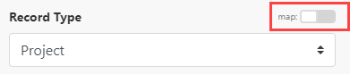

# Jira Software modules

In a *Adobe Workfront Fusion* scenario, you can connect your *Jira Software* account to multiple third-party applications and services.

If you need instructions on creating a scenario, see [Create a scenario](../../workfront-fusion/scenarios/create-a-scenario.md).

For information about modules, see [Modules in Adobe Workfront Fusion](../../workfront-fusion/modules/modules.md).

## Access requirements

You must have the following access to use the functionality in this article:

<table cellspacing="0"> 
 <col> 
 <col> 
 <tbody> 
  <tr> 
   <td role="rowheader"><em>Adobe Workfront</em> plan*</td> 
   <td> 
<em>Pro</em> or higher
 </td> 
  </tr> <draft-comment>
   <tr data-mc-conditions=""> 
    <td role="rowheader"><em>Adobe Workfront</em> license*</td> 
    <td> 
Plan, Work
 </td> 
   </tr>
  </draft-comment>
  <tr data-mc-conditions=""> 
   <td role="rowheader"><em>Adobe Workfront</em> license*</td> 
   <td> 
Plan, Work
 </td> 
  </tr> 
  <tr> 
   <td role="rowheader"><em>Adobe Workfront Fusion</em> license**</td> 
   <td> 
<em>Workfront Fusion for Work Automation and Integration</em> 
 </td> 
  </tr> 
  <tr> 
   <td role="rowheader">Product</td> 
   <td>Your organization must purchase <em>Adobe Workfront Fusion</em> as well as <em>Adobe Workfront</em> to use functionality described in this article.</td> 
  </tr> <draft-comment>
   <tr data-mc-conditions="QuicksilverOrClassic.Draft mode"> 
    <td role="rowheader">Access level configurations*</td> 
    <td> <draft-comment>
      
You must be a <em>Workfront Fusion</em> administrator for your organization.

     </draft-comment>
You must be a <em>Workfront Fusion</em> administrator for your organization.
 <draft-comment>
      
You must be a <em>Workfront Fusion</em> administrator for your team.

     </draft-comment>
You must be a <em>Workfront Fusion</em> administrator for your team.
 </td> 
   </tr>
  </draft-comment>
  <tr data-mc-conditions="QuicksilverOrClassic.Draft mode"> 
   <td role="rowheader">Access level configurations*</td> 
   <td> 
You must be a <em>Workfront Fusion</em> administrator for your organization.
 
You must be a <em>Workfront Fusion</em> administrator for your team.
 </td> 
  </tr> 
 </tbody> 
</table>

&#42;To find out what plan, license type, or access you have, contact your *Workfront administrator*.

&#42;&#42;For information on *Adobe Workfront Fusion* licenses, see [Adobe Workfront Fusion licenses](../../workfront-fusion/get-started/license-automation-vs-integration.md)

## Prerequisites

To use Jira modules you must have a Jira account.

## Connect Jira Software to *Workfront Fusion*

Your connection method is based on whether you are using Jira Cloud or Jira Server.

* [Connect Jira Cloud to Workfront Fusion](#connect) 
* [Connect Jira Server to Workfront Fusion](#connect2)

### Connect Jira Cloud to *Workfront Fusion*

Connect Jira Cloud to *Workfront Fusion*

To connect Jira Software to *Workfront Fusion*, you must create an API token and insert it together with your Service URL and Username to the Create a connection field in *Workfront Fusion*.

#### Create an API&nbsp;token in Jira

<ol> 
 <li value="1">Go to <a href="https://id.atlassian.com/manage/api-tokens">https://id.atlassian.com/manage/api-tokens</a> and log in.</li> 
 <li value="2">Click Create API token.</li> 
 <li value="3">Type a name for the token, such as <i>Workfront Fusion</i>.</li> 
 <li value="4"> 
Copy the token using the Copy to clipboard button.
 <note type="important">
   You can't view the token again after closing this dialog.
  </note> </li> 
 <li value="5">Store the generated token in a safe place.</li> 
 <li value="6">Continue with <a href="#configur2" class="MCXref xref">Configure the Jira API token in Workfront Fusion</a>.</li> 
</ol>

#### Configure the Jira API token in *Workfront Fusion*

1. In *Workfront Fusion*, add a Jira module to a scenario to open the `Create a connection` box.

1. Specify the following information:

  * `Service URL:`
  * `Username:`
  * `API token:`&nbsp;This is the API token you created in the [Create an API token in Jira](#create3) section of this article.

1. Click Continue to create the connection and return to the module.

### Connect Jira Server to *Workfront Fusion*

To authorize a connection between *Workfront Fusion* and Jira Server, you need your Consumer Key, Private Key, And Service URL. You might need to contact your Jira administrator for this information.

* [Generate Public and Private keys for your Jira connection](#generate) 
* [Configure the client app as a consumer in Jira](#configur) 
* [Create a connection to Jira Server or Jira Data Center in Workfront Fusion](#create2)

#### Generate Public and Private keys for your Jira connection

To acquire a private key for your *Workfront Fusion* Jira connection, you need to generate public and private keys.

<ol> 
 <li value="1"> 
In your terminal, run the following <code>openssl </code>commands.
 
  <ul> 
   <li><pre>openssl genrsa -out jira_privatekey.pem 1024</pre> 
This command generates a 1024 bit private key.
 </li> 
   <li><pre>openssl req -newkey rsa:1024 -x509 -key jira_privatekey.pem -out jira_publickey.cer -days 365</pre> 
This command creates an X509 certificate.
 </li> 
   <li><pre>openssl pkcs8 -topk8 -nocrypt -in jira_privatekey.pem -out jira_privatekey.pcks8</pre> 
This command extracts the private key (PKCS8 format) to the <code>jira_privatekey.pcks8</code> file.
 </li> 
   <li><pre>openssl x509 -pubkey -noout -in jira_publickey.cer  > jira_publickey.pem</pre> 
This command extracts the public key from the certificate to the<code> jira_publickey.pem</code> file.
 <note type="note"> 
     
If you are using Windows, you might need to save the public key to the <code>jira_publickey.pem</code> file manually:
 
     <ol> 
      <li value="1"> 
In your terminal, run the following command:
 
openssl x509 -pubkey -noout -in jira_publickey.cer 
 </li> 
      <li value="2">Copy the terminal output (including <code>-------BEGIN PUBLIC KEY--------</code> and <code>-------END PUBLIC KEY--------</code></li> 
      <li value="3">Paste the terminal output into a file named <code>jira_publickey.pem</code>.</li> 
     </ol> 
    </note> </li> 
  </ul> </li> 
 <li value="2"> 
Continue to <a href="#configur" class="MCXref xref">Configure the client app as a consumer in Jira</a>
 </li> 
</ol>

#### Configure the client app as a consumer in Jira

<ol> 
 <li value="1"> 
Log into your Jira instance.
 </li> 
 <li value="2"> 
In the left navigation panel, click Jira Settings > Applications> Application links.
 </li> 
 <li value="3"> 
In the Enter the URL of the application you want to link field, enter <code>https://app.workfrontfusion.com/oauth/cb/workfront-jiraserver-oauth1</code>
 </li> 
 <li value="4"> 
Click Create new link. Ignore the "No response was received from the URL you entered" error message.
 </li> 
 <li value="5"> 
In the Link applications window, enter values into the Consumer key and Shared secret fields. You can choose the values for these fields. 
 </li> 
 <li value="6"> 
Copy the values of the Consumer key and Shared secret fields to a secure location. You will require these values later in the configuration process.
 </li> 
 <li value="7"> 
Fill in the URL fields as follows:
 
  <table cellspacing="0"> 
   <col> 
   <col> 
   <tbody> 
    <tr> 
     <td role="rowheader">Request Token URL</td> 
     <td><code><Jira base url>/plugins/servlet/oauth/request-token</code> </td> 
    </tr> 
    <tr> 
     <td role="rowheader">Authorization URL</td> 
     <td><code><Jira base url>/plugins/servlet/oauth/authorize</code> </td> 
    </tr> 
    <tr> 
     <td role="rowheader">Access Token URL</td> 
     <td><code><Jira base url>/plugins/servlet/oauth/access-token</code> </td> 
    </tr> 
   </tbody> 
  </table> </li> 
 <li value="8"> 
Select the Create incoming link checkbox.
 </li> 
 <li value="9"> 
Click Continue.
 </li> 
 <li value="10"> 
 the Link applications window, fill in the following fields:
 
  <table cellspacing="0"> <draft-comment>
    <col data-mc-conditions="">
   </draft-comment>
   <col data-mc-conditions=""> <draft-comment>
    <col data-mc-conditions="">
   </draft-comment>
   <col data-mc-conditions=""> 
   <tbody> 
    <tr> 
     <td role="rowheader"> 
Consumer Key
 </td> 
     <td> Paste in the consumer key that you copied to a secure location.</td> 
    </tr> 
    <tr> 
     <td role="rowheader">Consumer name</td> 
     <td>Enter a name of your choice. This name is for your own reference.</td> 
    </tr> 
    <tr> 
     <td role="rowheader">Public key</td> 
     <td>Paste in the public key from your <code>jira_publickey.pem</code> file.</td> 
    </tr> 
   </tbody> 
  </table> </li> 
 <li value="11"> 
Click Continue
 </li> 
 <li value="12"> 
Continue to <a href="#create2" class="MCXref xref">Create a connection to Jira Server or Jira Data Center in Workfront Fusion</a>
 </li> 
</ol>

#### Create a connection to Jira Server or Jira Data Center in *Workfront Fusion*

>[!NOTE]
>
>Use the Jira Server app to connect to Jira Server or Jira Data Center.

<ol> 
 <li value="1">In any Jira Server module in <em>Workfront Fusion</em>, click Add next to the connection field.</li> 
 <li value="2"> 
In the Create a connection panel, fill in the following fields:
 
  <table cellspacing="0"> 
   <col> 
   <col> 
   <tbody> 
    <tr> 
     <td role="rowheader"> 
Connection name
 </td> 
     <td> 
Enter a name for the connection
 </td> 
    </tr> 
    <tr> 
     <td role="rowheader">Consumer Key</td> 
     <td>Paste in the consumer key that you copied to a secure location in <a href="#configur" class="MCXref xref">Configure the client app as a consumer in Jira</a></td> 
    </tr> 
    <tr> 
     <td role="rowheader">Private Key</td> 
     <td>Paste in the private key from the <code>jira_privatekey.pcks8</code> file you created in <a href="#generate" class="MCXref xref">Generate Public and Private keys for your Jira connection</a>.</td> 
    </tr> 
    <tr> 
     <td role="rowheader">Service URL</td> 
     <td>Enter your Jira instance URL. </td> 
    </tr> 
   </tbody> 
  </table> </li> 
 <li value="3">Click Continue to create the connection and go back to the module.</li> 
</ol>

## Jira Software modules and their fields

When you configure *Jira Software* modules, *Workfront Fusion* displays the fields listed below. Along with these, additional *Jira Software* fields might display, depending on factors such as your access level in the app or service. A bolded title in a module indicates a required field.

If you see the map button above a field or function, you can use it to set variables and functions for that field. For more information, see [Map information from one module to another](../../workfront-fusion/mapping/map-information-between-modules.md).

* [Triggers](#triggers) 
* [Actions](#actions) 
* [Searches](#searches)

### Triggers

#### Watch for records

This trigger module starts a scenario when a record is added, updated, or deleted.

<table cellspacing="0"> 
 <col> 
 <col> 
 <tbody> 
  <tr> 
   <td role="rowheader">Webhook</td> 
   <td> 
Select the webhook that you want to use to watch for records. 
 
To add a new webhook:
 
    <ol> 
     <li value="1">Click Add</li> 
     <li value="2">Enter a name for the webhook.</li> 
     <li value="3"> 
Select the connection you want to use for your webhook. 
 
For instructions about connecting your <em>Jira Software</em> account to <em>Workfront Fusion</em>, see <a href="#connect" class="MCXref xref" data-mc-variable-override="">Connect Jira Cloud to Workfront Fusion</a> in this article.
 </li> 
     <li value="4"> 
Select the record type that you want the software to watch for:
 
      <ul> 
       <li>Comment </li> 
       <li>Issue</li> 
       <li>Project </li> 
       <li>Sprint</li> 
      </ul> </li> 
    </ol> </td> 
  </tr> 
 </tbody> 
</table>

### Actions

* [Add issue to sprint](#add) 
* [Custom API Call](#custom) 
* [Create a Record](#create) 
* [Delete a record](#delete) 
* [Download an attachment](#download) 
* [Read a record](#read) 
* [Update a record](#update)

#### Add issue to sprint

This action module *adds one or more issues to a sprint*

<!--
<MadCap:conditionalText data-mc-conditions="SnippetConditions.HIDE">
in
<em>Jira Software</em>
</MadCap:conditionalText>
-->

`<MadCap:conditionalText data-mc-conditions="SnippetConditions.HIDE">  in  <em>Jira Software</em></MadCap:conditionalText>`.

When you are configuring this module, the following fields display

<!--
<MadCap:conditionalText data-mc-conditions="SnippetConditions.HIDE">
, along with any other available
<em>Jira Software</em> fields, depending on the connection and options you choose
</MadCap:conditionalText>
-->

`<MadCap:conditionalText data-mc-conditions="SnippetConditions.HIDE"> , along with any other available  <em>Jira Software</em> fields, depending on the connection and options you choose</MadCap:conditionalText>`.

<table cellspacing="0"> 
 <col> 
 <col> 
 <tbody> 
  <tr> 
   <td role="rowheader">Connection</td> 
   <td> 
For instructions about connecting your <em>Jira Software</em> account to <em>Workfront Fusion</em>, see <a href="#connect" class="MCXref xref" data-mc-variable-override="">Connect Jira Cloud to Workfront Fusion</a> in this article.
 </td> 
  </tr> 
  <tr> 
   <td role="rowheader">Sprint ID</td> 
   <td>Enter or map the Sprint ID of the sprint that you want to add an issue to.</td> 
  </tr> 
  <tr> 
   <td role="rowheader">Issue ID or Keys</td> 
   <td>Add an Issue ID or Key for each issue you want to add to the sprint.</td> 
  </tr> 
 </tbody> 
</table>

#### Create a Record

This action module creates a new record in Jira.

The module returns any standard fields associated with the record

<!--
<MadCap:conditionalText data-mc-conditions="SnippetConditions.HIDE">
or records
</MadCap:conditionalText>
-->

`<MadCap:conditionalText data-mc-conditions="SnippetConditions.HIDE">  or records</MadCap:conditionalText>`, along with any custom fields and values that the connection accesses. You can map *this information* in subsequent modules in the scenario.

When you are configuring this module, the following fields display

<!--
<MadCap:conditionalText data-mc-conditions="SnippetConditions.HIDE">
, along with any other available
<em>Jira Software</em> fields, depending on the connection and options you choose
</MadCap:conditionalText>
-->

`<MadCap:conditionalText data-mc-conditions="SnippetConditions.HIDE"> , along with any other available  <em>Jira Software</em> fields, depending on the connection and options you choose</MadCap:conditionalText>`.

<table cellspacing="0"> 
 <col> 
 <col> 
 <tbody> 
  <tr> 
   <td role="rowheader">Connection</td> 
   <td> 
For instructions about connecting your <em>Jira Software</em> account to <em>Workfront Fusion</em>, see <a href="#connect" class="MCXref xref" data-mc-variable-override="">Connect Jira Cloud to Workfront Fusion</a> in this article.
 </td> 
  </tr> 
  <tr> 
   <td role="rowheader">Record Type</td> 
   <td> 
Select the type of record you want the module to create. When you select a record type, other fields specific to that record type appear in the module.
 
    <ul> 
     <li>Attachment</li> 
     <li>Comment</li> 
     <li>Issue</li> 
     <li>Project</li> 
     <li>Sprint </li> 
     <li>Worklog</li> 
    </ul> </td> 
  </tr> 
 </tbody> 
</table>

#### Custom API Call

This action module lets you make a custom authenticated call to the *Jira Software* API

<!--
<MadCap:conditionalText data-mc-conditions="SnippetConditions.HIDE">
without having to think through authentication
</MadCap:conditionalText>
-->

`<MadCap:conditionalText data-mc-conditions="SnippetConditions.HIDE">  without having to think through authentication</MadCap:conditionalText>`. This way, you can create a data flow automation that can't be accomplished by the other *Jira Software* modules.

When you are configuring this module, the following fields display

<!--
<MadCap:conditionalText data-mc-conditions="SnippetConditions.HIDE">
, along with any other available
<em>Jira Software</em> fields, depending on the connection and options you choose
</MadCap:conditionalText>
-->

`<MadCap:conditionalText data-mc-conditions="SnippetConditions.HIDE"> , along with any other available  <em>Jira Software</em> fields, depending on the connection and options you choose</MadCap:conditionalText>`.

<table cellspacing="0"> 
 <col> 
 <col> 
 <tbody> 
  <tr> 
   <td role="rowheader">Connection</td> 
   <td> 
For instructions about connecting your <em>Jira Software</em> account to <em>Workfront Fusion</em>, see <a href="#connect" class="MCXref xref" data-mc-variable-override="">Connect Jira Cloud to Workfront Fusion</a> in this article.
 </td> 
  </tr> 
  <tr> 
   <td role="rowheader">URL</td> 
   <td>Enter a path relative to<code>&lt;Instance URL&gt;/rest/api/2/ </code></td> 
  </tr> 
  <tr> 
   <td role="rowheader">Method</td> 
   <td> 
Select the HTTP request method you need to configure the API call. For more information, see <a href="../../workfront-fusion/modules/http-request-methods.md" class="MCXref xref" data-mc-variable-override="">HTTP request methods</a>.
 </td> 
  </tr> 
  <tr> 
   <td role="rowheader">Headers</td> 
   <td> 
Add the headers of the request in the form of a standard JSON object.
 
For example, <code>{"Content-type":"application/json"}</code>
 
<em>Workfront Fusion</em> adds the authorization headers for you.
 </td> 
  </tr> 
  <tr> 
   <td role="rowheader">Query String</td> 
   <td> 
Add the query for the API call in the form of a standard JSON object.
 
For example: <code>{“name”:“something-urgent”}</code>
 </td> 
  </tr> 
  <tr> 
   <td role="rowheader">Body</td> 
   <td> 
Add the body content for the API call in the form of a standard JSON object.
 
Note:  
When using conditional statements such as <code>if</code> in your JSON, put the quotation marks outside of the conditional statement.
 
     
Example: </b>"> 
      
  
 
     
 
 </td> 
  </tr> 
 </tbody> 
</table>

#### Delete a record

This action module *deletes a particular record*

<!--
<MadCap:conditionalText data-mc-conditions="SnippetConditions.HIDE">
in
<em>Jira Software</em>
</MadCap:conditionalText>
-->

`<MadCap:conditionalText data-mc-conditions="SnippetConditions.HIDE">  in  <em>Jira Software</em></MadCap:conditionalText>`.

You specify the

<!--
<MadCap:conditionalText data-mc-conditions="SnippetConditions.HIDE">
type and
</MadCap:conditionalText>
-->

`<MadCap:conditionalText data-mc-conditions="SnippetConditions.HIDE">  type and</MadCap:conditionalText>` ID of the *record*.

The module returns the ID of the 

<!--
<MadCap:conditionalText data-mc-conditions="SnippetConditions.HIDE">
<em>deleted</em>
</MadCap:conditionalText>
-->

`<MadCap:conditionalText data-mc-conditions="SnippetConditions.HIDE">  <em>deleted</em></MadCap:conditionalText>` *record* and any associated fields, along with any custom fields and values that the connection accesses. You can map *this information* in subsequent modules in the scenario.

When you are configuring this module, the following fields display

<!--
<MadCap:conditionalText data-mc-conditions="SnippetConditions.HIDE">
, along with any other available
<em>Jira Software</em> fields, depending on the connection and options you choose
</MadCap:conditionalText>
-->

`<MadCap:conditionalText data-mc-conditions="SnippetConditions.HIDE"> , along with any other available  <em>Jira Software</em> fields, depending on the connection and options you choose</MadCap:conditionalText>`.

<table cellspacing="0"> 
 <col> 
 <col> 
 <tbody> 
  <tr> 
   <td role="rowheader">Connection</td> 
   <td> 
For instructions about connecting your <em>Jira Software</em> account to <em>Workfront Fusion</em>, see <a href="#connect" class="MCXref xref" data-mc-variable-override="">Connect Jira Cloud to Workfront Fusion</a> in this article.
 </td> 
  </tr> 
  <tr> 
   <td role="rowheader">Record Type</td> 
   <td> 
Select the type of record you want the module to delete. 
 
    <ul> 
     <li>Attachment</li> 
     <li>Comment</li> 
     <li>Issue</li> 
     <li>Project</li> 
     <li>Sprint </li> 
    </ul> </td> 
  </tr> 
  <tr> 
   <td role="rowheader">ID or Key</td> 
   <td>Enter or map the ID or Key of the record you want to delete.</td> 
  </tr> 
 </tbody> 
</table>

#### Download an attachment

This action module *downloads a particular attachment*

<!--
<MadCap:conditionalText data-mc-conditions="SnippetConditions.HIDE">
in
<em>Jira Software</em>
</MadCap:conditionalText>
-->

`<MadCap:conditionalText data-mc-conditions="SnippetConditions.HIDE">  in  <em>Jira Software</em></MadCap:conditionalText>`.

When you are configuring this module, the following fields display

<!--
<MadCap:conditionalText data-mc-conditions="SnippetConditions.HIDE">
, along with any other available
<em>Jira Software</em> fields, depending on the connection and options you choose
</MadCap:conditionalText>
-->

`<MadCap:conditionalText data-mc-conditions="SnippetConditions.HIDE"> , along with any other available  <em>Jira Software</em> fields, depending on the connection and options you choose</MadCap:conditionalText>`.

<table cellspacing="0"> 
 <col> 
 <col> 
 <tbody> 
  <tr> 
   <td role="rowheader">Connection</td> 
   <td> 
For instructions about connecting your <em>Jira Software</em> account to <em>Workfront Fusion</em>, see <a href="#connect" class="MCXref xref" data-mc-variable-override="">Connect Jira Cloud to Workfront Fusion</a> in this article.
 </td> 
  </tr> 
  <tr> 
   <td role="rowheader">ID</td> 
   <td>Enter or map the ID of the attachment you want to download.</td> 
  </tr> 
 </tbody> 
</table>

#### Read a record

This action module reads *data from a single record* in *Jira Software*.

You specify the

<!--
<MadCap:conditionalText data-mc-conditions="SnippetConditions.HIDE">
type and
</MadCap:conditionalText>
-->

`<MadCap:conditionalText data-mc-conditions="SnippetConditions.HIDE">  type and</MadCap:conditionalText>` ID of the *record*.

The module returns any standard fields associated with the record

<!--
<MadCap:conditionalText data-mc-conditions="SnippetConditions.HIDE">
or records
</MadCap:conditionalText>
-->

`<MadCap:conditionalText data-mc-conditions="SnippetConditions.HIDE">  or records</MadCap:conditionalText>`, along with any custom fields and values that the connection accesses. You can map *this information* in subsequent modules in the scenario.

When you are configuring this module, the following fields display

<!--
<MadCap:conditionalText data-mc-conditions="SnippetConditions.HIDE">
, along with any other available
<em>Jira Software</em> fields, depending on the connection and options you choose
</MadCap:conditionalText>
-->

`<MadCap:conditionalText data-mc-conditions="SnippetConditions.HIDE"> , along with any other available  <em>Jira Software</em> fields, depending on the connection and options you choose</MadCap:conditionalText>`.

<table cellspacing="0"> 
 <col> 
 <col> 
 <tbody> 
  <tr> 
   <td role="rowheader">Connection</td> 
   <td> 
For instructions about connecting your <em>Jira Software</em> account to <em>Workfront Fusion</em>, see <a href="#connect" class="MCXref xref" data-mc-variable-override="">Connect Jira Cloud to Workfront Fusion</a> in this article.
 </td> 
  </tr> 
  <tr> 
   <td role="rowheader">Record Type</td> 
   <td> 
Select the type of Jira record you want the module to read.
 
    <ul> 
     <li>Attachment</li> 
     <li>Issue</li> 
     <li>Project</li> 
     <li>Sprint </li> 
     <li>User</li> 
    </ul> </td> 
  </tr> 
  <tr> 
   <td role="rowheader">Outputs</td> 
   <td>Select the outputs that you want to receive. Output options are available based on the type of record selected in the "Record Type" field.</td> 
  </tr> 
  <tr> 
   <td role="rowheader">ID</td> 
   <td> 
Enter or map the unique <em>Jira Software</em> ID of the <em>record</em> that you want the module to <em>read</em>.
 </td> 
  </tr> 
 </tbody> 
</table>

#### Update a record

This action module *updates an existing record, such as an issue or project,*

<!--
<MadCap:conditionalText data-mc-conditions="SnippetConditions.HIDE">
in
<em>Jira Software</em>
</MadCap:conditionalText>
-->

`<MadCap:conditionalText data-mc-conditions="SnippetConditions.HIDE">  in  <em>Jira Software</em></MadCap:conditionalText>`.

You specify the

<!--
<MadCap:conditionalText data-mc-conditions="SnippetConditions.HIDE">
type and
</MadCap:conditionalText>
-->

`<MadCap:conditionalText data-mc-conditions="SnippetConditions.HIDE">  type and</MadCap:conditionalText>` ID of the *record*.

The module returns the ID of the 

<!--
<MadCap:conditionalText data-mc-conditions="SnippetConditions.HIDE">
<em>updated</em>
</MadCap:conditionalText>
-->

`<MadCap:conditionalText data-mc-conditions="SnippetConditions.HIDE">  <em>updated</em></MadCap:conditionalText>` *record* and any associated fields, along with any custom fields and values that the connection accesses. You can map *this information* in subsequent modules in the scenario.

When you are configuring this module, the following fields display

<!--
<MadCap:conditionalText data-mc-conditions="SnippetConditions.HIDE">
, along with any other available
<em>Jira Software</em> fields, depending on the connection and options you choose
</MadCap:conditionalText>
-->

`<MadCap:conditionalText data-mc-conditions="SnippetConditions.HIDE"> , along with any other available  <em>Jira Software</em> fields, depending on the connection and options you choose</MadCap:conditionalText>`.

<table cellspacing="0"> 
 <col> 
 <col> 
 <tbody> 
  <tr> 
   <td role="rowheader">Connection</td> 
   <td> 
For instructions about connecting your <em>Jira Software</em> account to <em>Workfront Fusion</em>, see <a href="#connect" class="MCXref xref" data-mc-variable-override="">Connect Jira Cloud to Workfront Fusion</a> in this article.
 </td> 
  </tr> 
  <tr> 
   <td role="rowheader">Record Type</td> 
   <td> 
Select the type of record you want the module to update. When you select a record type, other fields specific to that record type appear in the module.
 
    <ul> 
     <li>Comment</li> 
     <li>Issue</li> 
     <li>Project</li> 
     <li>Sprint </li> 
     <li>Transition issue</li> 
    </ul> </td> 
  </tr> 
  <tr> 
   <td role="rowheader">ID or Key</td> 
   <td>Enter or map the ID or Key of the record you want to update.</td> 
  </tr> 
 </tbody> 
</table>

### Searches

* [List records](#list) 
* [Search for records](#search)

#### List records

This search module retrieves all items of a specific type that match your search query

<!--
<MadCap:conditionalText data-mc-conditions="SnippetConditions.HIDE">
The module returns all standard fields associated with the record or records, along with any custom fields and values that the connection accesses.
</MadCap:conditionalText>
-->

`<MadCap:conditionalText data-mc-conditions="SnippetConditions.HIDE"> The module returns all standard fields associated with the record or records, along with any custom fields and values that the connection accesses.</MadCap:conditionalText>`You can map *this information* in subsequent modules in the scenario.

When you are configuring this module, the following fields display

<!--
<MadCap:conditionalText data-mc-conditions="SnippetConditions.HIDE">
, along with any other available
<em>Jira Software</em> fields, depending on the connection and options you choose
</MadCap:conditionalText>
-->

`<MadCap:conditionalText data-mc-conditions="SnippetConditions.HIDE"> , along with any other available  <em>Jira Software</em> fields, depending on the connection and options you choose</MadCap:conditionalText>`.

<table cellspacing="0"> 
 <col> 
 <col> 
 <tbody> 
  <tr> 
   <td role="rowheader">Connection</td> 
   <td> 
For instructions about connecting your <em>Jira Software</em> account to <em>Workfront Fusion</em>, see <a href="#connect" class="MCXref xref" data-mc-variable-override="">Connect Jira Cloud to Workfront Fusion</a> in this article.
 </td> 
  </tr> 
  <tr> 
   <td role="rowheader">Record Type</td> 
   <td> 
Select the type of record you want the module to list. When you select a record type, other fields specific to that record type appear in the module.
 
    <ul> 
     <li>Comment</li> 
     <li>Issue</li> 
     <li>Project</li> 
     <li>Sprint issue</li> 
     <li>Worklog</li> 
    </ul> </td> 
  </tr> 
  <tr> 
   <td role="rowheader"> 
Max Results
 </td> 
   <td> 
Enter or map the maximum number of <em>record</em>s you want the module to <em>retrieve</em> during each scenario execution cycle.
 </td> 
  </tr> <draft-comment>
   <tr data-mc-conditions="QuicksilverOrClassic.Draft mode"> 
    <td role="rowheader">Offset</td> 
    <td> Enter or map the ID of the first item you want to retrieve details for. This is a way to paginate the records. If you enter the 5000th item as the offset, the module would return items 5000-9999.</td> 
   </tr>
  </draft-comment>
  <tr data-mc-conditions="QuicksilverOrClassic.Draft mode"> 
   <td role="rowheader">Offset</td> 
   <td> Enter or map the ID of the first item you want to retrieve details for. This is a way to paginate the records. If you enter the 5000th item as the offset, the module would return items 5000-9999.</td> 
  </tr> 
 </tbody> 
</table>

#### Search for records

This search module looks for *records in an object* in *Jira Software* that match the search query you specify.

<!--
<MadCap:conditionalText data-mc-conditions="SnippetConditions.HIDE">
The module
<em>returns all standard fields associated with the record or records, along with any custom fields and values that the connection accesses</em>.
</MadCap:conditionalText>
-->

`<MadCap:conditionalText data-mc-conditions="SnippetConditions.HIDE"> The module  <em>returns all standard fields associated with the record or records, along with any custom fields and values that the connection accesses</em>.</MadCap:conditionalText>` You can map *this information* in subsequent modules in the scenario.

When you are configuring this module, the following fields display

<!--
<MadCap:conditionalText data-mc-conditions="SnippetConditions.HIDE">
, along with any other available
<em>Jira Software</em> fields, depending on the connection and options you choose
</MadCap:conditionalText>
-->

`<MadCap:conditionalText data-mc-conditions="SnippetConditions.HIDE"> , along with any other available  <em>Jira Software</em> fields, depending on the connection and options you choose</MadCap:conditionalText>`.

<table cellspacing="0"> 
 <col> 
 <col> 
 <tbody> 
  <tr> 
   <td role="rowheader">Connection</td> 
   <td> 
For instructions about connecting your <em>Jira Software</em> account to <em>Workfront Fusion</em>, see <a href="#connect" class="MCXref xref" data-mc-variable-override="">Connect Jira Cloud to Workfront Fusion</a> in this article.
 </td> 
  </tr> 
  <tr> 
   <td role="rowheader">Record Type</td> 
   <td> 
Select the type of record you want the module to search for. When you select a record type, other fields specific to that record type appear in the module.
 
    <ul> 
     <li>Issues</li> 
     <li> 
Issues by JQL (Jira Query Lanuguage) 
 
For more information on JQL, see <a href="https://www.atlassian.com/blog/jira-software/jql-the-most-flexible-way-to-search-jira-14#:~:text=JQL stands for Jira Query,project managers%2C and business users.">JQL</a> at the Atlassian help site. 
 </li> 
     <li>Project</li> 
     <li>Project by issue</li> 
     <li>User</li> 
    </ul> </td> 
  </tr> 
 </tbody> 
</table>

