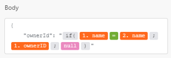

# Microsoft Office 365 Email

In order to use Office 365 Email with `Adobe Workfront Fusion`, it is necessary to have an Office 365 account. You can create one at www.office.com.

For instructions about connecting your `Office 365` account to `Workfront Fusion`, see [Create a connection to Workfront Fusion - Basic instructions](../../workfront-fusion/connections/connect-to-fusion-general.md)

After you grant consent, you are redirected back to the `Workfront Fusion` administration page where you can continue creating your scenario.

## Access requirements

You must have the following access to use the functionality in this article:

<table cellspacing="0"> 
 <col> 
 <col> 
 <tbody> 
  <tr> 
   <td role="rowheader">Adobe Workfront plan*</td> 
   <td> 
Pro or higher
 </td> 
  </tr> Adobe Workfront license* Plan, Work 
  <tr> 
   <td role="rowheader">Adobe Workfront Fusion license**</td> 
   <td> 
Workfront Fusion for Work Automation and Integration 
 </td> 
  </tr> 
  <tr> 
   <td role="rowheader">Product</td> 
   <td>Your organization must purchase Adobe Workfront Fusion as well as Adobe Workfront to use functionality described in this article.</td> 
  </tr> <!--
   Access level configurations* You must be a Workfront Fusion administrator for your organization. You must be a Workfront Fusion administrator for your team.
  --> 
 </tbody> 
</table>

&#42;To find out what plan, license type, or access you have, contact your `Workfront administrator`.

&#42;&#42;For information on `Adobe Workfront Fusion` licenses, see [Adobe Workfront Fusion licenses](../../workfront-fusion/get-started/license-automation-vs-integration.md)

## Prerequisites

To use Microsoft Office 365 Email modules, you must have a Microsoft Office 365 Email account.

## Microsoft Office 365 Email modules and their fields

When you configure `Microsoft Office 365 Email` modules, `Workfront Fusion` displays the fields listed below. Along with these, additional `Microsoft Office 365 Email` fields might display, depending on factors such as your access level in the app or service. A bolded title in a module indicates a required field.

If you see the map button above a field or function, you can use it to set variables and functions for that field. For more information, see [Map information from one module to another](../../workfront-fusion/mapping/map-information-between-modules.md).

* [Message](#message) 
* [Draft Message](#draft) 
* [Attachment](#attachme) 
* [Other](#other)

### Message

* [Watch Messages](#watch) 
* [Search messages](#search) 
* [Get a message](#get) 
* [Create and Send a Message](#create) 
* [Move a Message](#move) 
* [Delete a Message](#delete)

#### Watch Messages

Triggers when a new email message is sent or received.

<table cellspacing="0"> 
 <col> 
 <col> 
 <tbody> 
  <tr> 
   <td role="rowheader">Connection </td> 
   <td> 
For instructions about connecting your Office 365 account to Workfront Fusion, see <a href="../../workfront-fusion/connections/connect-to-fusion-general.md" class="MCXref xref" data-mc-variable-override="">Create a connection to Workfront Fusion - Basic instructions</a>
 </td> 
  </tr> 
  <tr> 
   <td role="rowheader"> 
Watch Messages
 </td> 
   <td> 
Select the messages you want to watch:
 
    <ul> 
     <li>Only Unread</li> 
     <li>Only read</li> 
     <li>All</li> 
    </ul> </td> 
  </tr> 
  <tr> 
   <td role="rowheader">Mail Folder</td> 
   <td> 
Select the folder that contains the messages you want to watch.
 </td> 
  </tr> 
  <tr> 
   <td role="rowheader">Search</td> 
   <td>Enter your search query. For information on how to write a search query, see the Microsoft support article <a href="https://support.microsoft.com/en-us/office/search-mail-and-people-in-outlook-com-88108edf-028e-4306-b87e-7400bbb40aa7?ui=en-us&amp;rs=en-us&amp;ad=us">Search Mail and People in Outlook.com</a>.</td> 
  </tr> 
  <tr> 
   <td role="rowheader">Limit </td> 
   <td> 
Enter the maximum number of messages Workfront Fusion should return during one scenario execution cycle.
 </td> 
  </tr> 
 </tbody> 
</table>

#### Search messages

Searches for messages based on specific criteria.

<table cellspacing="0"> 
 <col> 
 <col> 
 <tbody> 
  <tr> 
   <td role="rowheader">Connection </td> 
   <td> 
For instructions about connecting your Office 365 account to Workfront Fusion, see <a href="../../workfront-fusion/connections/connect-to-fusion-general.md" class="MCXref xref" data-mc-variable-override="">Create a connection to Workfront Fusion - Basic instructions</a>
 </td> 
  </tr> 
  <tr> 
   <td role="rowheader">Mail Folder</td> 
   <td> 
Select the folder that contains the messages you want to search.
 </td> 
  </tr> 
  <tr> 
   <td role="rowheader">Search</td> 
   <td>Enter your search query. For information on how to write a search query, see the Microsoft support article <a href="https://support.microsoft.com/en-us/office/search-mail-and-people-in-outlook-com-88108edf-028e-4306-b87e-7400bbb40aa7?ui=en-us&amp;rs=en-us&amp;ad=us">Search Mail and People in Outlook.com</a>.</td> 
  </tr> 
  <tr> 
   <td role="rowheader">Order by</td> 
   <td> 
Select how you want to order the results:
 
    <ul> 
     <li>Subject (Ascending or descending)</li> 
     <li>Created Date Time (Ascending or descending)</li> 
     <li>Last Modified Date Time (Ascending or descending)</li> 
     <li>Received Date Time (Ascending or descending)</li> 
    </ul> </td> 
  </tr> 
  <tr> 
   <td role="rowheader">Limit</td> 
   <td> 
Enter the maximum number of messages Workfront Fusion should return during one scenario execution cycle.
 </td> 
  </tr> 
 </tbody> 
</table>

#### Get a message

Gets the metadata of a specific message

<table cellspacing="0"> 
 <col> 
 <col> 
 <tbody> 
  <tr> 
   <td role="rowheader">Connection </td> 
   <td> 
For instructions about connecting your Office 365 account to Workfront Fusion, see <a href="../../workfront-fusion/connections/connect-to-fusion-general.md" class="MCXref xref" data-mc-variable-override="">Create a connection to Workfront Fusion - Basic instructions</a>
 </td> 
  </tr> 
  <tr> 
   <td role="rowheader">Message ID</td> 
   <td> 
 Select or map the ID of the message you want to retrieve metadata for.
 </td> 
  </tr> 
  <tr> 
   <td role="rowheader">Get Mime contents</td> 
   <td>Enable this option to retrieve data about the MIME content of the message. MIME content may include images, audio, video, or other types of files.</td> 
  </tr> 
 </tbody> 
</table>

#### Create and Send a Message

Creates and sends an email message.

<table cellspacing="0"> 
 <col> 
 <col> 
 <tbody> 
  <tr> 
   <td role="rowheader">Connection </td> 
   <td> 
For instructions about connecting your Office 365 account to Workfront Fusion, see <a href="../../workfront-fusion/connections/connect-to-fusion-general.md" class="MCXref xref" data-mc-variable-override="">Create a connection to Workfront Fusion - Basic instructions</a>
 </td> 
  </tr> 
  <tr> 
   <td role="rowheader">Subject</td> 
   <td> 
Enter or map the subject line of the message.
 </td> 
  </tr> Body Content Type Select whether the body content of the message is HTML or Text. 
  <tr> 
   <td role="rowheader">Body content</td> 
   <td> 
Enter or map the message body text of the email.
 </td> 
  </tr> 
  <tr> 
   <td role="rowheader">Importance</td> 
   <td> 
Select the importance of the email
 
    <ul> 
     <li>Low</li> 
     <li>Normal</li> 
     <li>High</li> 
    </ul> </td> 
  </tr> 
  <tr> 
   <td role="rowheader"> 
To Recipients
 </td> 
   <td> 
Add the email address to which you want to send the messages:
 
    <ul> 
     <li> 
Name 
 
Enter the name of the contact
 </li> 
     <li> 
Email Address 
 
Enter the email address of the contact.
 </li> 
    </ul> </td> 
  </tr> 
  <tr> 
   <td role="rowheader"> 
CC Recipients
 </td> 
   <td> 
Add the recipients that you want to receive a copy of the message:
 
    <ul> 
     <li> 
Name 
 
Enter the name of the contact
 </li> 
     <li> 
Email Address 
 
Enter the email address of the contact.
 </li> 
    </ul> </td> 
  </tr> 
  <tr> 
   <td role="rowheader"> 
Bcc Recipients
 </td> 
   <td> 
Add the recipients that you want to copy on the message, without allowing other recipients to see their names or email addresses:
 
    <ul> 
     <li> 
Name 
 
Enter the name of the contact
 </li> 
     <li> 
Email Address 
 
Enter the email address of the contact.
 </li> 
    </ul> </td> 
  </tr> 
  <tr> 
   <td role="rowheader"> 
Attachments
 </td> 
   <td> 
Add the attachments to the email:
 
    <ul> 
     <li> 
File name 
 
Enter the file name. Example: <code>sample.doc</code>
 </li> 
     <li> 
Data 
 
Enter the file data to the field or map the source of the file.
 </li> 
    </ul> </td> 
  </tr> 
  <tr> 
   <td role="rowheader">Internet Message Headers</td> 
   <td> 
Add the message headers for the email.
 
    <ul> 
     <li> 
Name 
 
Enter the name of the header
 </li> 
     <li> 
Email Address 
 
Enter a value for the header.
 </li> 
    </ul> </td> 
  </tr> 
 </tbody> 
</table>

#### Move a Message

Moves an email message to a selected folder in the mailbox.

<table cellspacing="0"> 
 <col> 
 <col> 
 <tbody> 
  <tr> 
   <td role="rowheader">Connection </td> 
   <td> 
For instructions about connecting your Office 365 account to Workfront Fusion, see <a href="../../workfront-fusion/connections/connect-to-fusion-general.md" class="MCXref xref" data-mc-variable-override="">Create a connection to Workfront Fusion - Basic instructions</a>
 </td> 
  </tr> 
  <tr> 
   <td role="rowheader">Message ID</td> 
   <td> 
 Select or map the ID of the message you want to move to a different folder.
 </td> 
  </tr> 
  <tr> 
   <td role="rowheader">Mail Folder </td> 
   <td> 
Select or map the ID of the folder where you want to move the message.
 </td> 
  </tr> 
 </tbody> 
</table>

#### Delete a Message

Deletes an existing email message.

<table cellspacing="0"> 
 <col> 
 <col> 
 <tbody> 
  <tr> 
   <td role="rowheader">Connection </td> 
   <td> 
For instructions about connecting your Office 365 account to Workfront Fusion, see <a href="../../workfront-fusion/connections/connect-to-fusion-general.md" class="MCXref xref" data-mc-variable-override="">Create a connection to Workfront Fusion - Basic instructions</a>
 </td> 
  </tr> 
  <tr> 
   <td role="rowheader">Message ID</td> 
   <td> 
 Select or map the ID of the message you want to delete.
 </td> 
  </tr> 
 </tbody> 
</table>

### Draft Message

* [Create a Draft Message](#create2) 
* [Send a Draft Message](#send) 
* [Update a Message](#update)

#### Create a Draft Message

Creates a new email message.

<table cellspacing="0"> 
 <col> 
 <col> 
 <tbody> 
  <tr> 
   <td role="rowheader">Connection </td> 
   <td> 
For instructions about connecting your Office 365 account to Workfront Fusion, see <a href="../../workfront-fusion/connections/connect-to-fusion-general.md" class="MCXref xref" data-mc-variable-override="">Create a connection to Workfront Fusion - Basic instructions</a>
 </td> 
  </tr> 
  <tr> 
   <td role="rowheader">Subject</td> 
   <td> 
Enter the subject line of the message.
 </td> 
  </tr> 
  <tr> 
   <td role="rowheader">Body Content Type</td> 
   <td>Select whether the body content of the message is HTML or Text.</td> 
  </tr> 
  <tr> 
   <td role="rowheader">Body content</td> 
   <td> 
Enter the message body text of the email.
 </td> 
  </tr> 
  <tr> 
   <td role="rowheader">Importance</td> 
   <td> 
Select the importance of the email
 
    <ul> 
     <li>Low</li> 
     <li>Normal</li> 
     <li>High</li> 
    </ul> </td> 
  </tr> 
  <tr> 
   <td role="rowheader"> 
To Recipients
 </td> 
   <td> 
Add the recipients to which you want to send the messages:
 
    <ul> 
     <li> 
Name 
 
Enter the name of the contact
 </li> 
     <li> 
Email Address 
 
Enter the email address of the contact.
 </li> 
    </ul> </td> 
  </tr> 
  <tr> 
   <td role="rowheader"> 
CC Recipients
 </td> 
   <td> 
Add the recipients The you want to receive a copy of the message:
 
    <ul> 
     <li> 
Name 
 
Enter the name of the contact
 </li> 
     <li> 
Email Address 
 
Enter the email address of the contact.
 </li> 
    </ul> </td> 
  </tr> 
  <tr> 
   <td role="rowheader"> 
Bcc Recipients
 </td> 
   <td> 
Add the recipients that you want to copy on the message, without allowing other recipients to see their names or email addresses:
 
    <ul> 
     <li> 
Name 
 
Enter the name of the contact
 </li> 
     <li> 
Email Address 
 
Enter the email address of the contact.
 </li> 
    </ul> </td> 
  </tr> 
  <tr> 
   <td role="rowheader"> 
Attachments
 </td> 
   <td> 
Add the attachments to the email:
 
    <ul> 
     <li> 
File name 
 
Enter the file name. Example: <code>sample.doc</code>
 </li> 
     <li> 
Data 
 
Enter the file data to the field or map the source of the file.
 </li> 
    </ul> </td> 
  </tr> 
 </tbody> 
</table>

#### Send a Draft Message

Sends an email message that is currently in draft.

<table cellspacing="0"> 
 <col> 
 <col> 
 <tbody> 
  <tr> 
   <td role="rowheader">Connection </td> 
   <td> 
For instructions about connecting your Office 365 account to Workfront Fusion, see <a href="../../workfront-fusion/connections/connect-to-fusion-general.md" class="MCXref xref" data-mc-variable-override="">Create a connection to Workfront Fusion - Basic instructions</a>
 </td> 
  </tr> 
  <tr> 
   <td role="rowheader">Draft Message ID</td> 
   <td> 
 Select or map the Message ID of the draft you want to send.
 </td> 
  </tr> 
 </tbody> 
</table>

#### Update a Message

Updates an existing message.

<table cellspacing="0"> 
 <col> 
 <col> 
 <tbody> 
  <tr> 
   <td role="rowheader">Connection </td> 
   <td> 
For instructions about connecting your Office 365 account to Workfront Fusion, see <a href="../../workfront-fusion/connections/connect-to-fusion-general.md" class="MCXref xref" data-mc-variable-override="">Create a connection to Workfront Fusion - Basic instructions</a>
 </td> 
  </tr> 
  <tr> 
   <td role="rowheader">Enter a message ID</td> 
   <td> 
Select how you want to identify the message to update:
 
    <ul> 
     <li> 
Enter Manually 
 
Enter or map the message ID.
 </li> 
     <li> 
Select from the list 
 
Select the folder that contains the message you want to update, then select the message
 </li> 
    </ul> </td> 
  </tr> 
  <tr> 
   <td role="rowheader">Subject</td> 
   <td> 
Enter the subject line of the message.
 </td> 
  </tr> 
  <tr> 
   <td role="rowheader">Body content</td> 
   <td> 
Enter the message body text of the email.
 </td> 
  </tr> 
  <tr> 
   <td role="rowheader">Importance</td> 
   <td> 
Select the importance of the email
 
    <ul> 
     <li>Low</li> 
     <li>Normal</li> 
     <li>High</li> 
    </ul> </td> 
  </tr> 
  <tr> 
   <td role="rowheader"> 
To Recipients
 </td> 
   <td> 
Add the email address to which you want to send the messages:
 
    <ul> 
     <li> 
Name 
 
Enter the name of the contact
 </li> 
     <li> 
Email Address 
 
Enter the email address of the contact.
 </li> 
    </ul> </td> 
  </tr> 
  <tr> 
   <td role="rowheader"> 
CC Recipients
 </td> 
   <td> 
Add the recipients The you want to receive a copy of the message:
 
    <ul> 
     <li> 
Name 
 
Enter the name of the contact
 </li> 
     <li> 
Email Address 
 
Enter the email address of the contact.
 </li> 
    </ul> </td> 
  </tr> 
  <tr> 
   <td role="rowheader"> 
Bcc Recipients
 </td> 
   <td> 
Add the recipients that you want to copy on the message, without allowing other recipients to see their names or email addresses:
 
    <ul> 
     <li> 
Name 
 
Enter the name of the contact
 </li> 
     <li> 
Email Address 
 
Enter the email address of the contact.
 </li> 
    </ul> </td> 
  </tr> 
  <tr> 
   <td role="rowheader"> 
Attachments
 </td> 
   <td> 
Add the attachments to the email:
 
    <ul> 
     <li> 
File name 
 
Enter the file name. Example: <code>sample.doc</code>
 </li> 
     <li> 
Data 
 
Enter the file data to the field or map the source of the file.
 </li> 
    </ul> </td> 
  </tr> 
  <tr> 
   <td role="rowheader">Mark it as Read</td> 
   <td>Enable this option to mark the updated message as read.</td> 
  </tr> 
 </tbody> 
</table>

### Attachment

* [List Attachments](#list) 
* [Download an Attachment](#download)

#### List Attachments

This module retrieves a list of attachments belonging to the specified message.

<table cellspacing="0"> 
 <col> 
 <col> 
 <tbody> 
  <tr> 
   <td role="rowheader">Connection </td> 
   <td> 
For instructions about connecting your Office 365 account to Workfront Fusion, see <a href="../../workfront-fusion/connections/connect-to-fusion-general.md" class="MCXref xref" data-mc-variable-override="">Create a connection to Workfront Fusion - Basic instructions</a>
 </td> 
  </tr> 
  <tr> 
   <td role="rowheader">Message ID</td> 
   <td> 
 Select or map the ID of the message you want to retrieve attachments from.
 </td> 
  </tr> 
  <tr> 
   <td role="rowheader">Limit</td> 
   <td> 
Enter or map the maximum number of attachments you want the module to return during each scenario execution cycle.
 </td> 
  </tr> 
 </tbody> 
</table>

#### Download an Attachment

This module downloads the specified attachment.

<table cellspacing="0"> 
 <col> 
 <col> 
 <tbody> 
  <tr> 
   <td role="rowheader">Connection </td> 
   <td> 
For instructions about connecting your Office 365 account to Workfront Fusion, see <a href="../../workfront-fusion/connections/connect-to-fusion-general.md" class="MCXref xref" data-mc-variable-override="">Create a connection to Workfront Fusion - Basic instructions</a>
 </td> 
  </tr> 
  <tr> 
   <td role="rowheader">Message ID</td> 
   <td> 
 Select or map the ID of the message that contains the attachment you want to download.
 </td> 
  </tr> 
  <tr> 
   <td role="rowheader">Attachment ID</td> 
   <td> 
Enter or map the ID&nbsp;of the attachment you want to download.
 </td> 
  </tr> 
 </tbody> 
</table>

### Other

* [Make an API Call](#make) 
* [Add an Attachment](#add)

#### Make an API&nbsp;Call

This module allows you to perform a custom API call.

<table cellspacing="0"> 
 <col> 
 <col> 
 <tbody> 
  <tr> 
   <td role="rowheader">Connection</td> 
   <td> 
For instructions about connecting your Office 365 account to Workfront Fusion, see <a href="../../workfront-fusion/connections/connect-to-fusion-general.md" class="MCXref xref" data-mc-variable-override="">Create a connection to Workfront Fusion - Basic instructions</a>
 </td> 
  </tr> 
  <tr> 
   <td role="rowheader"> 
URL
 </td> 
   <td> 
Enter a path relative to <code>https://graph.microsoft.com</code>. Example:<code> /v1.0/me/messages</code>
 </td> 
  </tr> 
  <tr> 
   <td role="rowheader"> 
Method
 </td> 
   <td> 
Select the HTTP request method you need to configure the API call. For more information, see <a href="../../workfront-fusion/modules/http-request-methods.md" class="MCXref xref" data-mc-variable-override="">HTTP request methods</a>.
 </td> 
  </tr> 
  <tr> 
   <td role="rowheader">Headers</td> 
   <td> 
Add the headers of the request in the form of a standard JSON object.For example, <code>{"Content-type":"application/json"}</code>. Workfront Fusion adds the authorization headers for you.
 </td> 
  </tr> 
  <tr> 
   <td role="rowheader">Query String</td> 
   <td> 
 Add the query for the API call in the form of a standard JSON object.
 </td> 
  </tr> 
  <tr> 
   <td role="rowheader">Body</td> 
   <td> 
Add the body content for the API call in the form of a standard JSON object.
 
Note:  
When using conditional statements such as <code>if</code> in your JSON, put the quotation marks outside of the conditional statement.
 
     
Example: </b>"> 
      
  
 
     
 
 </td> 
  </tr> 
 </tbody> 
</table>

#### Add an Attachment

This module adds a large attachment to a message.

<table cellspacing="0"> 
 <col> 
 <col> 
 <tbody> 
  <tr> 
   <td role="rowheader">Connection </td> 
   <td> 
For instructions about connecting your Office 365 account to Workfront Fusion, see <a href="../../workfront-fusion/connections/connect-to-fusion-general.md" class="MCXref xref" data-mc-variable-override="">Create a connection to Workfront Fusion - Basic instructions</a>
 </td> 
  </tr> 
  <tr> 
   <td role="rowheader">Message ID</td> 
   <td> 
 Select or map the ID of the message you want to add an attachment to.
 </td> 
  </tr> 
  <tr> 
   <td role="rowheader">Source file</td> 
   <td> 
Select a file from a previous module, or map the source file's name and data.
 </td> 
  </tr> 
 </tbody> 
</table>

