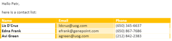
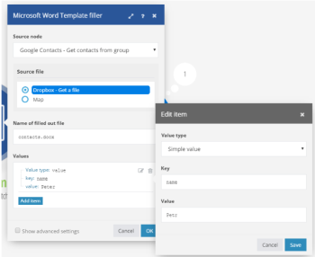
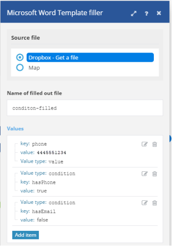
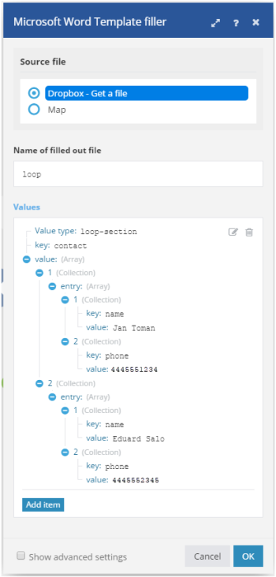
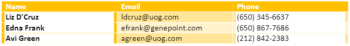

# Microsoft Word Template modules {#microsoft-word-template-modules}

In a *`Adobe Workfront Fusion`* scenario, you can connect your *`MIcrosoft Word Templates`* account to multiple third-party applications and services.


If you need instructions on creating a scenario, see [Create a scenario](create-a-scenario.md). 


For information about modules, see [Modules in Adobe Workfront Fusion](_modules.md).


## Access requirements {#access-requirements}

You must have the following access to use the functionality in this article:

<table style="width: 100%;margin-left: 0;margin-right: auto;mc-table-style: url('../../Resources/TableStyles/TableStyle-List-options-in-steps.css');" class="TableStyle-TableStyle-List-options-in-steps" cellspacing="0"> 
 <col class="TableStyle-TableStyle-List-options-in-steps-Column-Column1"> 
 <col class="TableStyle-TableStyle-List-options-in-steps-Column-Column2"> 
 <tbody> 
  <tr class="TableStyle-TableStyle-List-options-in-steps-Body-LightGray"> 
   <td class="TableStyle-TableStyle-List-options-in-steps-BodyE-Column1-LightGray" role="rowheader"><span class="mc-variable WFVariables.FullProdNameWF variable varname">Adobe Workfront</span> plan*</td> 
   <td class="TableStyle-TableStyle-List-options-in-steps-BodyD-Column2-LightGray"> <p><span class="mc-variable WFVariables.WFPlan-Pro variable varname">Pro</span> or higher</p> </td> 
  </tr> 
  <tr class="TableStyle-TableStyle-List-options-in-steps-Body-MediumGray"> 
   <td class="TableStyle-TableStyle-List-options-in-steps-BodyE-Column1-MediumGray" role="rowheader"><span class="mc-variable WFVariables.FullProdNameWFF variable varname">Adobe Workfront Fusion</span> license**</td> 
   <td class="TableStyle-TableStyle-List-options-in-steps-BodyD-Column2-MediumGray"> <p><span class="mc-variable WFVariables.WFFusionIntegration variable varname">Workfront Fusion for Work Automation and Integration</span> </p> </td> 
  </tr> 
  <tr class="TableStyle-TableStyle-List-options-in-steps-Body-LightGray"> 
   <td class="TableStyle-TableStyle-List-options-in-steps-BodyB-Column1-LightGray" role="rowheader">Product</td> 
   <td class="TableStyle-TableStyle-List-options-in-steps-BodyA-Column2-LightGray">Your organization must purchase <span class="mc-variable WFVariables.FullProdNameWFF variable varname">Adobe Workfront Fusion</span> as well as <span class="mc-variable WFVariables.FullProdNameWF variable varname">Adobe Workfront</span> to use functionality described in this article.</td> 
  </tr> 
 </tbody> 
</table>

&#42;To find out what plan, license type, or access you have, contact your *`Workfront administrator`*.


## Prerequisites {#prerequisites}

In order to use *`Miscrosoft Word Templates`* with *`Adobe Workfront Fusion`*, it is necessary to have an Office 365 account. You can create one at www.office.com.


## Using Microsoft Word Templates modules {#using-microsoft-word-templates-modules}

You can use a Microsoft Word Template module to merge data from multiple web services into a Microsoft Word document.


For example, you could use this Microsoft Word template:


To create this document:





## About value tags {#about-value-tags}

A Microsoft Word template is a regular Microsoft Word document (.docx file) with special tags in its text that determine where and how to merge or fill in data. There are three types of tags:


* [Simple value tag](#simple) 
* [Condition tag](#conditio) 
* [Loop tag](#loop) 


### Simple value tag {#simple-value-tag}

A simple value tag is simply replaced with a corresponding value. The tag's name corresponds with the Key field's value, which is placed inside double curly braces; for example, 

```
{{name}}
```

.

` `**Example: **`` To create a document that says "Hi, Peter!", you could use a Microsoft WordTemplate module to create the following template:


```
> Hi {{name}}!
```


To do this, you would set up the module as follows:





### Condition tag {#condition-tag}

You can use a condition tag to wrap text that should be rendered only when certain conditions are met. To wrap the text, place it between opening and closing condition tags, such as "hasPhone" if the condition is whether or not the data includes a phone number. The name of an opening tag is prepended with a hash sign #, the name of a closing tag is prepended with a slash /, as shown in the example below.

` `**Example: **`` To produce a document that includes a customer's phone number if the input data includes a phone number, but no email address, you could use a Microsoft Word Template module and create the following template:
`<pre>> {{#hasPhone}}Phone: {{phone}} {{/hasPhone}}</pre>``<pre>> {{#hasEmail}}Email: {{email}} {{/hasEmail}}</pre>` To do this, you would set up the module as follows:





In the document, the phone number would appear as follows:
`<pre>> Phone: 4445551234</pre>`  

### Loop tag {#loop-tag}

You can use a loop tag, also known as a section tag, to repeat a section of text. Wrap the text by placing it between the opening and closing loop tags. The name of an opening tag is prepended with a hash sign #; the name of a closing tag is prepended with a slash /.


* [Loop tag with Fill out a document module](#loop2) 
* [Loop tag with Fill a document with a batch of data module](#loop3) 


#### Loop tag with Fill out a document module {#loop-tag-with-fill-out-a-document-module}


` `**Example: **`` To produce a document that lists the name and phone number of each contact in a customer list, you could use a Microsoft Word Template module and create the following template:
`<pre>> {{#contact}}</pre>``<pre>>     {{name}}, {{phone}}</pre>``<pre>> {{/contact}}</pre>` To do this, you would set up the module as follows:





The module would create the following document:
`<pre>> Jan Toman, 4445551234</pre>``<pre>> Eduard Salo, 4445552345</pre>`  

#### Loop tag with Fill a document with a batch of data module {#loop-tag-with-fill-a-document-with-a-batch-of-data-module}


` `**Example: **`` You can export Google contacts into a table that you create using loop tags.


The first module loads the template. The next module retrieves all contacts from the group you specify in Google Contacts. The aggregator module aggregates all values retrieved from Google Contacts and merges them into the template. And the last module saves the filled template to the desired location.


You could use this scenario with the following template:


To do this, you would set up the module as follows:


The module would create the following document:





## Microsoft Word Template modules {#microsoft-word-template-modules-1}

These modules do not require a connection.


* [Fill out a document](#fill) 
* [Fill a document with a batch of data](#fill2) 


### Fill out a document {#fill-out-a-document}


<table style="width: 100%;mc-table-style: url('../../Resources/TableStyles/TableStyle-List-options-in-steps.css');" class="TableStyle-TableStyle-List-options-in-steps" cellspacing="0"> 
 <col class="TableStyle-TableStyle-List-options-in-steps-Column-Column1"> 
 <col style="width: 50%;" class="TableStyle-TableStyle-List-options-in-steps-Column-Column2"> 
 <tbody> 
  <tr class="TableStyle-TableStyle-List-options-in-steps-Body-LightGray"> 
   <td class="TableStyle-TableStyle-List-options-in-steps-BodyE-Column1-LightGray" role="rowheader">Start delimiter of the text being replaced</td> 
   <td class="TableStyle-TableStyle-List-options-in-steps-BodyD-Column2-LightGray"> <p>Enter the character(s) that you want to mark the beginning of the text being replaced. </p> <p class="example" data-mc-autonum="<b>Example: </b>"><span class="autonumber"><span><b>Example: </b></span></span>Enter <code>[[</code> if you want to replace a text similar to this one: <code>[[replace_me]]</code></p> </td> 
  </tr> 
  <tr class="TableStyle-TableStyle-List-options-in-steps-Body-MediumGray"> 
   <td class="TableStyle-TableStyle-List-options-in-steps-BodyE-Column1-MediumGray" role="rowheader"> <p>Start delimiter of the text being replaced</p> </td> 
   <td class="TableStyle-TableStyle-List-options-in-steps-BodyD-Column2-MediumGray"> <p>Enter the character(s) that you want to mark the end of the text being replaced. </p> <p class="example" data-mc-autonum="<b>Example: </b>"><span class="autonumber"><span><b>Example: </b></span></span>Enter <code>]]</code> if you want to replace a text similar to this one: <code>[[replace_me]]</code></p> </td> 
  </tr> 
  <tr class="TableStyle-TableStyle-List-options-in-steps-Body-LightGray"> 
   <td class="TableStyle-TableStyle-List-options-in-steps-BodyE-Column1-LightGray" role="rowheader">Source file</td> 
   <td class="TableStyle-TableStyle-List-options-in-steps-BodyD-Column2-LightGray"> <p> Map the file you want to upload from the previous module (for example, the HTTP &gt; Get a File or Dropbox &gt; Get a file module). Or enter the data file manually.</p> </td> 
  </tr> 
  <tr class="TableStyle-TableStyle-List-options-in-steps-Body-MediumGray"> 
   <td class="TableStyle-TableStyle-List-options-in-steps-BodyE-Column1-MediumGray" role="rowheader">Name of filled out file</td> 
   <td class="TableStyle-TableStyle-List-options-in-steps-BodyD-Column2-MediumGray">Enter a file name (including extension) for the target output file.</td> 
  </tr> 
  <tr class="TableStyle-TableStyle-List-options-in-steps-Body-LightGray"> 
   <td class="TableStyle-TableStyle-List-options-in-steps-BodyE-Column1-LightGray" role="rowheader">Data source</td> 
   <td class="TableStyle-TableStyle-List-options-in-steps-BodyD-Column2-LightGray"> <p>Select an option to indicate whether the data you're using is from a form or from a raw data collection (unprocessed computer data).</p> </td> 
  </tr> 
  <tr class="TableStyle-TableStyle-List-options-in-steps-Body-MediumGray"> 
   <td class="TableStyle-TableStyle-List-options-in-steps-BodyB-Column1-MediumGray" role="rowheader">Values</td> 
   <td class="TableStyle-TableStyle-List-options-in-steps-BodyA-Column2-MediumGray"> <p>This must be an array of collections, where:</p> 
    <ul> 
     <li>Each collection corresponds to one data entry and contains one item <code>entry</code></li> 
     <li>Item <code>entry </code>contains a collection of the <code>key </code>and <code>value</code></li> 
     <li>Item <code>key </code>contains the tag's name</li> 
     <li>item <code>value </code>contains the tag's value</li> 
    </ul> 
    <ol> 
     <li value="1">To add an entry:</li> 
     <li value="2"> Click Add Item. </li> 
     <li value="3">Select the value type of the entry.</li> 
     <li value="4">Add the name and value. For more information, see the example for the chosen value type in this article.
      <ul>
       <li><a href="#simple" class="MCXref xref">Simple value tag</a></li>
       <li><a href="#conditio" class="MCXref xref">Condition tag</a></li>
       <li><a href="#loop" class="MCXref xref">Loop tag</a></li>
      </ul></li> 
    </ol> </td> 
  </tr> 
 </tbody> 
</table>


### Fill a document with a batch of data {#fill-a-document-with-a-batch-of-data}

This aggregator module is useful if your data entries come as separate bundles. With this module, you can easily set up the structure required for the Value field and it map items to each value item. In contrast to the Fill out a document module, the Values field in the Fill a document with a batch of data module allows only a single entry containing variables. 


You can also use this module also if your data entries come as an array, by using the *Iterator* module to transform the content of the array to a series of bundles.


The actual values are created and populated for each incoming bundle. The template is produced after all input bundles are processed. 


This aggregator module is especially useful for creating lists or reports.

<table style="width: 100%;mc-table-style: url('../../Resources/TableStyles/TableStyle-List-options-in-steps.css');" class="TableStyle-TableStyle-List-options-in-steps" cellspacing="0"> 
 <col class="TableStyle-TableStyle-List-options-in-steps-Column-Column1"> 
 <col style="width: 50%;" class="TableStyle-TableStyle-List-options-in-steps-Column-Column2"> 
 <tbody> 
  <tr class="TableStyle-TableStyle-List-options-in-steps-Body-LightGray"> 
   <td class="TableStyle-TableStyle-List-options-in-steps-BodyE-Column1-LightGray" role="rowheader">Source Module</td> 
   <td class="TableStyle-TableStyle-List-options-in-steps-BodyD-Column2-LightGray">Select the module that is the source of your text.</td> 
  </tr> 
  <tr class="TableStyle-TableStyle-List-options-in-steps-Body-MediumGray"> 
   <td class="TableStyle-TableStyle-List-options-in-steps-BodyE-Column1-MediumGray" role="rowheader">Start delimiter of the text being replaced</td> 
   <td class="TableStyle-TableStyle-List-options-in-steps-BodyD-Column2-MediumGray"> <p>Enter the character(s) that you want to mark the beginning of the text being replaced. </p> <p class="example" data-mc-autonum="<b>Example: </b>"><span class="autonumber"><span><b>Example: </b></span></span>Enter <code>[[</code> if you want to replace a text similar to this one: <code>[[replace_me]]</code></p> </td> 
  </tr> 
  <tr class="TableStyle-TableStyle-List-options-in-steps-Body-LightGray"> 
   <td class="TableStyle-TableStyle-List-options-in-steps-BodyE-Column1-LightGray" role="rowheader"> <p>Start delimiter of the text being replaced</p> </td> 
   <td class="TableStyle-TableStyle-List-options-in-steps-BodyD-Column2-LightGray"> <p>Enter the character(s) that you want to mark the end of the text being replaced. </p> <p class="example" data-mc-autonum="<b>Example: </b>"><span class="autonumber"><span><b>Example: </b></span></span>Enter <code>]]</code> if you want to replace a text similar to this one: <code>[[replace_me]]</code></p> </td> 
  </tr> 
  <tr class="TableStyle-TableStyle-List-options-in-steps-Body-MediumGray"> 
   <td class="TableStyle-TableStyle-List-options-in-steps-BodyE-Column1-MediumGray" role="rowheader">Group by</td> 
   <td class="TableStyle-TableStyle-List-options-in-steps-BodyD-Column2-MediumGray"> Define an expression containing one or more mapped items. The aggregated data is separated under Groups with the same expression's value. Each Group outputs as a separate bundle containing a Key with the evaluated expression and the aggregated text. By doing this, you can use the Key as a filter in subsequent modules.</td> 
  </tr> 
  <tr class="TableStyle-TableStyle-List-options-in-steps-Body-LightGray"> 
   <td class="TableStyle-TableStyle-List-options-in-steps-BodyE-Column1-LightGray" role="rowheader">Stop processing after an empty aggregation</td> 
   <td class="TableStyle-TableStyle-List-options-in-steps-BodyD-Column2-LightGray">Enable this option to stop processing when an aggregation contains no bundles.</td> 
  </tr> 
  <tr class="TableStyle-TableStyle-List-options-in-steps-Body-MediumGray"> 
   <td class="TableStyle-TableStyle-List-options-in-steps-BodyE-Column1-MediumGray" role="rowheader">Source file</td> 
   <td class="TableStyle-TableStyle-List-options-in-steps-BodyD-Column2-MediumGray"> <p> Map the file you want to upload from the previous module (for example, the HTTP &gt; Get a File or Dropbox &gt; Get a file module). Or enter the data file manually.</p> </td> 
  </tr> 
  <tr class="TableStyle-TableStyle-List-options-in-steps-Body-LightGray"> 
   <td class="TableStyle-TableStyle-List-options-in-steps-BodyE-Column1-LightGray" role="rowheader">Name of filled out file</td> 
   <td class="TableStyle-TableStyle-List-options-in-steps-BodyD-Column2-LightGray">Enter a file name (including extension) for the target output file.</td> 
  </tr> 
  <tr class="TableStyle-TableStyle-List-options-in-steps-Body-MediumGray"> 
   <td class="TableStyle-TableStyle-List-options-in-steps-BodyE-Column1-MediumGray" role="rowheader">Data source</td> 
   <td class="TableStyle-TableStyle-List-options-in-steps-BodyD-Column2-MediumGray"> <p>Select an option to indicate whether the data you're using is from a form or from a raw data collection (unprocessed computer data).</p> </td> 
  </tr> 
  <tr class="TableStyle-TableStyle-List-options-in-steps-Body-LightGray"> 
   <td class="TableStyle-TableStyle-List-options-in-steps-BodyB-Column1-LightGray" role="rowheader">Values</td> 
   <td class="TableStyle-TableStyle-List-options-in-steps-BodyA-Column2-LightGray"> <p>This must be an array of collections, where:</p> 
    <ul> 
     <li>Each collection corresponds to one data entry and contains one item <code>entry</code></li> 
     <li>Item <code>entry </code>contains a collection of the <code>key </code>and <code>value</code></li> 
     <li>Item <code>key </code>contains the tag's name</li> 
     <li>item <code>value </code>contains the tag's value</li> 
    </ul> 
    <ol> 
     <li value="1">To add an entry:</li> 
     <li value="2"> Click Add Item. </li> 
     <li value="3">Select the value type of the entry.</li> 
     <li value="4">Add the name and value. For more information, see the example for the chosen value type in this article.
      <ul>
       <li><a href="#simple" class="MCXref xref">Simple value tag</a></li>
       <li><a href="#conditio" class="MCXref xref">Condition tag</a></li>
       <li><a href="#loop" class="MCXref xref">Loop tag</a></li>
      </ul></li> 
    </ol> </td> 
  </tr> 
 </tbody> 
</table>

