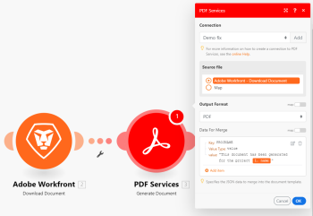

# Adobe PDF&nbsp;Services {#adobe-pdf-services}

With the PDF Services, You can extract data from a PDF file, or generate a new PDF file from data you supply. In addition, you can convert a variety of file types to PDFs, or PDFs to other file types. PDF&nbsp;Services also allow you to combine, compress, or read metadata for a PDF&nbsp;file, as well as control password protection on the file. 

If you need instructions on creating a scenario, see [Create a scenario](create-a-scenario.md). 

For information about modules, see [Modules in Adobe Workfront Fusion](_modules.md).

For information on the API used for PDF Services, see [Adobe Document Generation API](https://www.adobe.io/apis/documentcloud/dcsdk/doc-generation.html).

## Considerations when using Adobe PDF Services {#considerations-when-using-adobe-pdf-services}

*  [You do not need an Adobe account](#you) 
*  [Workfront Fusion does not store your files](#workfron) 

### You do not need an Adobe account {#you-do-not-need-an-adobe-account}

Because Workfront Fusion is part of the Adobe product suite, you don't need a separate Adobe account to use these tools. Each tool accesses Adobe PDF&nbsp;functionality without using a connection.

Although Workfront Fusion does not require an Adobe account to use the PDF Services, the modules do require a connection. There are no credentials involved in this connection, and you provide only a name for the connection itself.

### Workfront Fusion does not store your files {#workfront-fusion-does-not-store-your-files}

The Adobe PDF Services can read, convert, or modify your files, but neither Adobe nor Workfront Fusion store your files or data. This means that :

*  You maintain control over your files, including their security
*  You do not need to have an Adobe storage or cloud storage account to use the PDF&nbsp;Services.

## Access requirements {#access-requirements}

You must have the following access to use the functionality in this article:

<table style="width: 100%;margin-left: 0;margin-right: auto;mc-table-style: url('../../Resources/TableStyles/TableStyle-List-options-in-steps.css');" class="TableStyle-TableStyle-List-options-in-steps" cellspacing="0"> 
 <col class="TableStyle-TableStyle-List-options-in-steps-Column-Column1"> 
 <col class="TableStyle-TableStyle-List-options-in-steps-Column-Column2"> 
 <tbody> 
  <tr class="TableStyle-TableStyle-List-options-in-steps-Body-LightGray"> 
   <td class="TableStyle-TableStyle-List-options-in-steps-BodyE-Column1-LightGray" role="rowheader">Adobe Workfront plan*</td> 
   <td class="TableStyle-TableStyle-List-options-in-steps-BodyD-Column2-LightGray"> 
Pro or higher
 </td> 
  </tr> 
  <tr class="TableStyle-TableStyle-List-options-in-steps-Body-MediumGray"> 
   <td class="TableStyle-TableStyle-List-options-in-steps-BodyE-Column1-MediumGray" role="rowheader">Adobe Workfront Fusion license**</td> 
   <td class="TableStyle-TableStyle-List-options-in-steps-BodyD-Column2-MediumGray"> 
Workfront Fusion for Work Automation and Integration 
 </td> 
  </tr> 
  <tr class="TableStyle-TableStyle-List-options-in-steps-Body-LightGray"> 
   <td class="TableStyle-TableStyle-List-options-in-steps-BodyB-Column1-LightGray" role="rowheader">Product</td> 
   <td class="TableStyle-TableStyle-List-options-in-steps-BodyA-Column2-LightGray">Your organization must purchase Adobe Workfront Fusion as well as Adobe Workfront to use functionality described in this article.</td> 
  </tr> 
 </tbody> 
</table>

&#42;To find out what plan, license type, or access you have, contact your *`Workfront administrator`*.

## Adobe PDF Services and their fields.  {#adobe-pdf-services-and-their-fields}

When you configure PDF Services, *`Workfront Fusion`* displays the fields listed below. Along with these, additional fields might display, depending on factors such as your access level in the app or service. A bolded title in a module indicates a required field.

If you see the map button above a field or function, you can use it to set variables and functions for that field. For more information, see [Map information from one module to another](map-information-between-modules.md).

*  [Generate document](#generate) 
*  [Extract Text / Table](#extract) 
*  [Combine PDF files](#combine) 
*  [Compress PDF files](#compress) 
*  [Convert document to PDF file](#convert) 
*  [Convert HTML to PDF file](#convert2) 
*  [Convert image to PDF file](#convert3) 
*  [Convert PDF to document](#convert4) 
*  [Convert PDF to image](#convert5) 
*  [Linearize a PDF file](#lineariz) 
*  [OCR for PDF file](#ocr) 
*  [PDF page manipulation](#pdf%c2%a0page) 
*  [PDF file properties](#pdf%c2%a0file) 
*  [Protect PDF file](#protect) 
*  [Remove protection of a PDF file](#remove) 

### Generate document {#generate-document}

The Generate document module is a powerful way to create a PDF that contains data you select. You can format it by using a Microsoft Word template, or by providing data in JSON format. 

For more information on the Adobe PDF&nbsp;Services Generate document functionality, see the [Overview of Document Generation](https://www.adobe.io/apis/documentcloud/dcsdk/docs.html) in the Adobe Document Services documentation.

*  [Use the Generate document module with a Microsoft Word template](#use) 
*  [Use the Generate document module with JSON](#use2) 

#### Use the Generate document module with a Microsoft Word template {#use-the-generate-document-module-with-a-microsoft-word-template}

>[!NOTE]
>
>For a discussion of Microsoft Word templates, see [Microsoft Word Template modules](microsoft-word-templates-modules.md). 
>
>
>You do not need to use Microsoft Word template modules to use a Microsoft Word template with the PDF&nbsp;Services Generate document module.

To use the Generate document module with a Microsoft Word template, you must first create the template. 

For instructions, search for "Create a template" in the Microsoft Office documentation.

Fill in the Generate document module fields as follows:

<table style="width: 100%;mc-table-style: url('../../Resources/TableStyles/TableStyle-List-options-in-steps.css');" class="TableStyle-TableStyle-List-options-in-steps" cellspacing="0"> 
 <col class="TableStyle-TableStyle-List-options-in-steps-Column-Column1"> 
 <col class="TableStyle-TableStyle-List-options-in-steps-Column-Column2"> 
 <tbody> 
  <tr class="TableStyle-TableStyle-List-options-in-steps-Body-LightGray"> 
   <td class="TableStyle-TableStyle-List-options-in-steps-BodyE-Column1-LightGray" role="rowheader">Connection</td> 
   <td class="TableStyle-TableStyle-List-options-in-steps-BodyD-Column2-LightGray"> 
Select the connection that you want to use for this module.
 
You do not need an Adobe account to create a PDF&nbsp;Services connection. For more information, see <a href="#you" class="MCXref xref">You do not need an Adobe account</a> in this article.
 </td> 
  </tr> 
  <tr class="TableStyle-TableStyle-List-options-in-steps-Body-MediumGray"> 
   <td class="TableStyle-TableStyle-List-options-in-steps-BodyE-Column1-MediumGray" role="rowheader">Source File</td> 
   <td class="TableStyle-TableStyle-List-options-in-steps-BodyD-Column2-MediumGray"> 
Select a source file from a previous module, or map the source file's name and data.
 
This source file is the Microsoft Word template that the module uses to generate the new PDF.
 
We recommend creating a project in Workfront for the Microsoft Word templates that you use in Workfront Fusion. You can then use the Workfront &gt; Download document module to pull the appropriate template into your scenario.
 </td> 
  </tr> 
  <tr class="TableStyle-TableStyle-List-options-in-steps-Body-LightGray"> 
   <td class="TableStyle-TableStyle-List-options-in-steps-BodyE-Column1-LightGray" role="rowheader">Output Format</td> 
   <td class="TableStyle-TableStyle-List-options-in-steps-BodyD-Column2-LightGray"> 
Select the format for the generated document.
 
    <ul> 
     <li> 
PDF
 </li> 
     <li> 
DOCX
 </li> 
    </ul> </td> 
  </tr> 
  <tr class="TableStyle-TableStyle-List-options-in-steps-Body-MediumGray"> 
   <td class="TableStyle-TableStyle-List-options-in-steps-BodyB-Column1-MediumGray" role="rowheader">Data for merge</td> 
   <td class="TableStyle-TableStyle-List-options-in-steps-BodyA-Column2-MediumGray"> 
For each value tag in your template that you want to replace with text, fill in the following:
 
    <ul> 
     <li> 
Key
 
Enter a key. In the template, the key is the text shown in the value tag. For example, if you want to place text in the value tag <code>{{name}}</code>, enter <code>name </code>in the key field.
 </li> 
     <li> 
Value Type
 
Select whether the value is a value, an object, or an array of objects.
 </li> 
     <li> 
Value
 
Enter or map the text that you want to appear in the generated document in place of the value tag.
 </li> 
    </ul> 
  
 </td> 
  </tr> 
 </tbody> 
</table>

#### Use the Generate document module with JSON {#use-the-generate-document-module-with-json}

To use the Generate document module with JSON, fill in the fields as follows:

<table style="width: 100%;mc-table-style: url('../../Resources/TableStyles/TableStyle-List-options-in-steps.css');" class="TableStyle-TableStyle-List-options-in-steps" cellspacing="0"> 
 <col class="TableStyle-TableStyle-List-options-in-steps-Column-Column1"> 
 <col class="TableStyle-TableStyle-List-options-in-steps-Column-Column2"> 
 <tbody> 
  <tr class="TableStyle-TableStyle-List-options-in-steps-Body-LightGray"> 
   <td class="TableStyle-TableStyle-List-options-in-steps-BodyE-Column1-LightGray" role="rowheader">Connection</td> 
   <td class="TableStyle-TableStyle-List-options-in-steps-BodyD-Column2-LightGray"> 
Select the connection that you want to use for this module.
 
You do not need an Adobe account to create a PDF&nbsp;Services connection. For more information, see <a href="#you" class="MCXref xref">You do not need an Adobe account</a> in this article.
 </td> 
  </tr> 
  <tr class="TableStyle-TableStyle-List-options-in-steps-Body-MediumGray"> 
   <td class="TableStyle-TableStyle-List-options-in-steps-BodyE-Column1-MediumGray" role="rowheader">Source File</td> 
   <td class="TableStyle-TableStyle-List-options-in-steps-BodyD-Column2-MediumGray"> 
This source file is the Microsoft Word template that the module uses to generate the new PDF.
 
We recommend creating a project in Workfront for the Microsoft Word templates that you use in Workfront Fusion. You can then use the Workfront &gt; Download document module to pull the appropriate template into your scenario.
 </td> 
  </tr> 
  <tr class="TableStyle-TableStyle-List-options-in-steps-Body-LightGray"> 
   <td class="TableStyle-TableStyle-List-options-in-steps-BodyE-Column1-LightGray" role="rowheader">Output Format</td> 
   <td class="TableStyle-TableStyle-List-options-in-steps-BodyD-Column2-LightGray"> 
Select the format for the generated document.
 
    <ul> 
     <li> 
PDF
 </li> 
     <li> 
DOCX
 </li> 
    </ul> </td> 
  </tr> 
  <tr class="TableStyle-TableStyle-List-options-in-steps-Body-MediumGray"> 
   <td class="TableStyle-TableStyle-List-options-in-steps-BodyB-Column1-MediumGray" role="rowheader">Data for merge</td> 
   <td class="TableStyle-TableStyle-List-options-in-steps-BodyA-Column2-MediumGray"> 
To use JSON in this module, you must enable mapping on this field.
 
Enter or map the JSON that you want to generate the document from. 
 
You can type JSON&nbsp;directly into this field, or map JSON output from a JSON module.
 </td> 
  </tr> 
 </tbody> 
</table>

### Extract Text / Table {#extract-text-table}

This action module allows you to extract data from a PDF file. The module outputs individual text elements, such as a paragraph or the text in a single cell of a table.

<table style="width: 100%;mc-table-style: url('../../Resources/TableStyles/TableStyle-List-options-in-steps.css');" class="TableStyle-TableStyle-List-options-in-steps" cellspacing="0"> 
 <col class="TableStyle-TableStyle-List-options-in-steps-Column-Column1"> 
 <col class="TableStyle-TableStyle-List-options-in-steps-Column-Column2"> 
 <tbody> 
  <tr class="TableStyle-TableStyle-List-options-in-steps-Body-LightGray"> 
   <td class="TableStyle-TableStyle-List-options-in-steps-BodyE-Column1-LightGray" role="rowheader">Connection</td> 
   <td class="TableStyle-TableStyle-List-options-in-steps-BodyD-Column2-LightGray"> 
Select the connection that you want to use for this module.
 
You do not need an Adobe account to create a PDF&nbsp;Services connection. For more information, see <a href="#you" class="MCXref xref">You do not need an Adobe account</a> in this article.
 </td> 
  </tr> 
  <tr class="TableStyle-TableStyle-List-options-in-steps-Body-MediumGray"> 
   <td class="TableStyle-TableStyle-List-options-in-steps-BodyE-Column1-MediumGray" role="rowheader">Source file</td> 
   <td class="TableStyle-TableStyle-List-options-in-steps-BodyD-Column2-MediumGray">Select a source file from a previous module, or map the source file's name and data.</td> 
  </tr> 
  <tr class="TableStyle-TableStyle-List-options-in-steps-Body-LightGray"> 
   <td class="TableStyle-TableStyle-List-options-in-steps-BodyE-Column1-LightGray" role="rowheader">Elements that should be extracted as JSON</td> 
   <td class="TableStyle-TableStyle-List-options-in-steps-BodyD-Column2-LightGray"> 
    <ul> 
     <li> 
Text
 </li> 
     <li> 
Tables
 </li> 
    </ul> </td> 
  </tr> 
  <tr class="TableStyle-TableStyle-List-options-in-steps-Body-MediumGray"> 
   <td class="TableStyle-TableStyle-List-options-in-steps-BodyE-Column1-MediumGray" role="rowheader">Extract Bounding boxes?</td> 
   <td class="TableStyle-TableStyle-List-options-in-steps-BodyD-Column2-MediumGray">Enable this option to extract data about the bounding box of the text.</td> 
  </tr> 
  <tr class="TableStyle-TableStyle-List-options-in-steps-Body-LightGray"> 
   <td class="TableStyle-TableStyle-List-options-in-steps-BodyB-Column1-LightGray" role="rowheader">Include styling information for output?</td> 
   <td class="TableStyle-TableStyle-List-options-in-steps-BodyA-Column2-LightGray">Enable this option to add styling information to the output JSON.</td> 
  </tr> 
 </tbody> 
</table>

### Combine PDF&nbsp;files {#combine-pdf-files}

This action module takes multiple PDF files and combines them into a single PDF file. For example, this module could combine all of the documents in a *`Workfront`* project into a single PDF upon completion of the project.

<table style="width: 100%;mc-table-style: url('../../Resources/TableStyles/TableStyle-List-options-in-steps.css');" class="TableStyle-TableStyle-List-options-in-steps" cellspacing="0"> 
 <col class="TableStyle-TableStyle-List-options-in-steps-Column-Column1"> 
 <col class="TableStyle-TableStyle-List-options-in-steps-Column-Column2"> 
 <tbody> 
  <tr class="TableStyle-TableStyle-List-options-in-steps-Body-LightGray"> 
   <td class="TableStyle-TableStyle-List-options-in-steps-BodyE-Column1-LightGray" role="rowheader">Connection</td> 
   <td class="TableStyle-TableStyle-List-options-in-steps-BodyD-Column2-LightGray"> 
Select the connection that you want to use for this module.
 
You do not need an Adobe account to create a PDF&nbsp;Services connection. For more information, see <a href="#you" class="MCXref xref">You do not need an Adobe account</a> in this article.
 </td> 
  </tr> 
  <tr class="TableStyle-TableStyle-List-options-in-steps-Body-MediumGray"> 
   <td class="TableStyle-TableStyle-List-options-in-steps-BodyB-Column1-MediumGray" role="rowheader">Documents</td> 
   <td class="TableStyle-TableStyle-List-options-in-steps-BodyA-Column2-MediumGray"> 
You can use an aggregator module to gather documents to combine into a PDF, or you can add the documents manually. 
 
We recommend using an Array Aggregator module to aggregate output from a previous module. By using an aggregator, you do not need to know the names, locations, or numbers of files that you want to combine. Using an aggregator is therefore much more flexible and scalable than manually entering the documents to be combined.
 
To use the Combine PDF files module with an aggregator, you must enable mapping on the Documents field. 
 
In this example, the Read Related Records module identifies documents associated with a project, and the Download Documents module downloads each one. All of the PDFs are aggregated into an array, which is passed intot he Combine PDF files module.
 
  
 
You can also enter documents manually.
 
For each document that you want to include in the combined PDF:
 
    <ol> 
     <li value="1"> 
Click Add a Document
 </li> 
     <li value="2"> 
In the Source file field, select the module that outputs the document you want to include, or map the source file's name and data. 
 </li> 
     <li value="3"> 
(Optional) if you want to include only certain pages from the source file, for each page range that you want to add, click Add item in the Pages field, then enter the first and last pages of the page range you want to include, and click Add. You can include more than one page range from a single document.
 </li> 
     <li value="4"> 
Click Add. 
 </li> 
    </ol> </td> 
  </tr> 
 </tbody> 
</table>

### Compress PDF&nbsp;files {#compress-pdf-files}

This action module takes a PDF&nbsp;file and compresses it. This can be useful for conserving bandwidth or memory

<table style="mc-table-style: url('../../Resources/TableStyles/TableStyle-List-options-in-steps.css');" class="TableStyle-TableStyle-List-options-in-steps" cellspacing="0"> 
 <col class="TableStyle-TableStyle-List-options-in-steps-Column-Column1"> 
 </col> 
 <col class="TableStyle-TableStyle-List-options-in-steps-Column-Column2"> 
 </col> 
 <tbody> 
  <tr class="TableStyle-TableStyle-List-options-in-steps-Body-LightGray"> 
   <td class="TableStyle-TableStyle-List-options-in-steps-BodyE-Column1-LightGray" role="rowheader">Connection</td> 
   <td class="TableStyle-TableStyle-List-options-in-steps-BodyD-Column2-LightGray"> 
Select the connection that you want to use for this module.
 
You do not need an Adobe account to create a PDF&nbsp;Services connection. For more information, see <a href="#you" class="MCXref xref">You do not need an Adobe account</a> in this article.
 </td> 
  </tr> 
  <tr class="TableStyle-TableStyle-List-options-in-steps-Body-MediumGray"> 
   <td class="TableStyle-TableStyle-List-options-in-steps-BodyE-Column1-MediumGray" role="rowheader">Source file</td> 
   <td class="TableStyle-TableStyle-List-options-in-steps-BodyD-Column2-MediumGray"> 
Select a source file from a previous module, or map the source file's name and data.
 
Source file must be in PDF&nbsp;format. 
 </td> 
  </tr> 
  <tr class="TableStyle-TableStyle-List-options-in-steps-Body-LightGray"> 
   <td class="TableStyle-TableStyle-List-options-in-steps-BodyB-Column1-LightGray" role="rowheader">Compression level</td> 
   <td class="TableStyle-TableStyle-List-options-in-steps-BodyA-Column2-LightGray">Select the compression level that you want to use.</td> 
  </tr> 
 </tbody> 
</table>

### Convert document to PDF file {#convert-document-to-pdf-file}

This tool converts a document to a PDF file. The source file must be one of the following document formats:

*  DOC
*  XLS
*  PPT
*  TXT
*  RTF

<table style="mc-table-style: url('../../Resources/TableStyles/TableStyle-List-options-in-steps.css');" class="TableStyle-TableStyle-List-options-in-steps" cellspacing="0"> 
 <col class="TableStyle-TableStyle-List-options-in-steps-Column-Column1"> 
 </col> 
 <col class="TableStyle-TableStyle-List-options-in-steps-Column-Column2"> 
 </col> 
 <tbody> 
  <tr class="TableStyle-TableStyle-List-options-in-steps-Body-LightGray"> 
   <td class="TableStyle-TableStyle-List-options-in-steps-BodyE-Column1-LightGray" role="rowheader">Connection</td> 
   <td class="TableStyle-TableStyle-List-options-in-steps-BodyD-Column2-LightGray"> 
Select the connection that you want to use for this module.
 
You do not need an Adobe account to create a PDF&nbsp;Services connection. For more information, see <a href="#you" class="MCXref xref">You do not need an Adobe account</a> in this article.
 </td> 
  </tr> 
  <tr class="TableStyle-TableStyle-List-options-in-steps-Body-MediumGray"> 
   <td class="TableStyle-TableStyle-List-options-in-steps-BodyE-Column1-MediumGray" role="rowheader">Source file</td> 
   <td class="TableStyle-TableStyle-List-options-in-steps-BodyD-Column2-MediumGray"> 
Select a source file from a previous module, or map the source file's name and data.
 
Source file must be in one of the following formats:
 
    <ul> 
     <li> 
DOC
 </li> 
     <li> 
XLS
 </li> 
     <li> 
PPT
 </li> 
     <li> 
TXT
 </li> 
     <li> 
RTF
 </li> 
    </ul> </td> 
  </tr> 
  <tr class="TableStyle-TableStyle-List-options-in-steps-Body-LightGray"> 
   <td class="TableStyle-TableStyle-List-options-in-steps-BodyB-Column1-LightGray" role="rowheader">Language</td> 
   <td class="TableStyle-TableStyle-List-options-in-steps-BodyA-Column2-LightGray"> 
Select the default language for the source document. This allows the module to select an appropriate font, if not font is included in the source file.
 
Select from the following languages:
 
    <ul> 
     <li> 
en-US (Default): English (United States of America)
 </li> 
     <li> 
ca-ES: Catalan (Spain)
 </li> 
     <li> 
cs-CZ: Czech (Czech Republic)
 </li> 
     <li> 
da-DK: Danish (Denmark)
 </li> 
     <li> 
de-DE: German (Germany)
 </li> 
     <li> 
en-AE: English (United Arab Emirates)
 </li> 
     <li> 
en-GB: English (United Kingdom)
 </li> 
     <li> 
en-IL: English (Israel)
 </li> 
     <li> 
en-US: English (United States of America)
 </li> 
     <li> 
es-ES: Spanish (Spain)
 </li> 
     <li> 
es-MX: Spanish (Mexico)
 </li> 
     <li> 
eu-ES: Basque (Spain)
 </li> 
     <li> 
fi-FI: Finnish (Finland)
 </li> 
     <li> 
fr-CA: French (Canada)
 </li> 
     <li> 
fr-FR: French (France)
 </li> 
     <li> 
fr-MA: French (Morocco)
 </li> 
     <li> 
hr-HR: Croatian (Croatia)
 </li> 
     <li> 
hu-HU: Hungarian (Hungary)
 </li> 
     <li> 
it-IT: Italian (Italy)
 </li> 
     <li> 
ja-JP: Japanese (Japan)
 </li> 
     <li> 
kr-KR: Korean (South Korea)
 </li> 
     <li> 
nb-NO: Norwegian Bokmål (Norway)
 </li> 
     <li> 
nl-NL: Dutch (Netherlands)
 </li> 
     <li> 
pl-PL: Polish (Poland)
 </li> 
     <li> 
pt-BR: Portuguese (Brazil)
 </li> 
     <li> 
pt-PT: Portuguese (Portugal)
 </li> 
     <li> 
ro-RO: Romanian (Romania)
 </li> 
     <li> 
ru-RU: Russian (Russia)
 </li> 
     <li> 
sk-SK: Slovak (Slovakia)
 </li> 
     <li> 
sl-SI: Slovenian (Slovenia)
 </li> 
     <li> 
sv-SE: Swedish (Sweden)
 </li> 
     <li> 
tr-TR: Turkish (Turkey)
 </li> 
     <li> 
uk-UA: Ukrainian (Ukraine)
 </li> 
     <li> 
zh-CN: Chinese (Mainland China)
 </li> 
     <li> 
zh-TW: Chinese (Taiwan)
 </li> 
    </ul> </td> 
  </tr> 
 </tbody> 
</table>

### Convert HTML to PDF file {#convert-html-to-pdf-file}

This tool converts an HTML&nbsp;file to a PDF file. 

<table style="mc-table-style: url('../../Resources/TableStyles/TableStyle-List-options-in-steps.css');" class="TableStyle-TableStyle-List-options-in-steps" cellspacing="0"> 
 <col class="TableStyle-TableStyle-List-options-in-steps-Column-Column1"> 
 </col> 
 <col class="TableStyle-TableStyle-List-options-in-steps-Column-Column2"> 
 </col> 
 <tbody> 
  <tr class="TableStyle-TableStyle-List-options-in-steps-Body-LightGray"> 
   <td class="TableStyle-TableStyle-List-options-in-steps-BodyE-Column1-LightGray" role="rowheader">Connection</td> 
   <td class="TableStyle-TableStyle-List-options-in-steps-BodyD-Column2-LightGray"> 
Select the connection that you want to use for this module.
 
You do not need an Adobe account to create a PDF&nbsp;Services connection. For more information, see <a href="#you" class="MCXref xref">You do not need an Adobe account</a> in this article.
 </td> 
  </tr> 
  <tr class="TableStyle-TableStyle-List-options-in-steps-Body-MediumGray"> 
   <td class="TableStyle-TableStyle-List-options-in-steps-BodyE-Column1-MediumGray" role="rowheader">Source file</td> 
   <td class="TableStyle-TableStyle-List-options-in-steps-BodyD-Column2-MediumGray"> 
Select a source file from a previous module, or map the source file's name and data.
 
Important: Source file must be in HTML or ZIP format. 
 </td> 
  </tr> 
  <tr class="TableStyle-TableStyle-List-options-in-steps-Body-LightGray"> 
   <td class="TableStyle-TableStyle-List-options-in-steps-BodyE-Column1-LightGray" role="rowheader">JSON</td> 
   <td class="TableStyle-TableStyle-List-options-in-steps-BodyD-Column2-LightGray"> 
If your HTML references JavaScript variables, you can include those variables here. 
 
For each variable you want to add, click Add item and include the variable's key and value.
 
Note:  
     <ul> 
      <li> 
When creating a PDF from a ZIP file, the source collateral must include a script element such as: &lt;script src='./json.js' type='text/javascript'&gt;&lt;/script&gt; 
 </li> 
      <li> 
When creating a PDF from a URL, the content of this JSON object is injected into the browser VM before the page is rendered. 
 </li> 
     </ul> 
 </td> 
  </tr> 
  <tr class="TableStyle-TableStyle-List-options-in-steps-Body-MediumGray"> 
   <td class="TableStyle-TableStyle-List-options-in-steps-BodyE-Column1-MediumGray" role="rowheader">Include header and footer</td> 
   <td class="TableStyle-TableStyle-List-options-in-steps-BodyD-Column2-MediumGray"> 
Enable this option to create headers and footers for the PDF&nbsp;document.
 
    <ul> 
     <li> 
The header includes a date and the document title.
 </li> 
     <li> 
The footer includes the file name and a page number.
 </li> 
    </ul> </td> 
  </tr> 
  <tr class="TableStyle-TableStyle-List-options-in-steps-Body-LightGray"> 
   <td class="TableStyle-TableStyle-List-options-in-steps-BodyE-Column1-LightGray" role="rowheader">Page width</td> 
   <td class="TableStyle-TableStyle-List-options-in-steps-BodyD-Column2-LightGray">Enter the width of the paper, in inches. The module uses this information to format the pages in the created PDF&nbsp;file.</td> 
  </tr> 
  <tr class="TableStyle-TableStyle-List-options-in-steps-Body-MediumGray"> 
   <td class="TableStyle-TableStyle-List-options-in-steps-BodyB-Column1-MediumGray" role="rowheader">Page height</td> 
   <td class="TableStyle-TableStyle-List-options-in-steps-BodyA-Column2-MediumGray">Enter the height of the paper, in inches. The module uses this information to format the pages in the created PDF&nbsp;file.</td> 
  </tr> 
 </tbody> 
</table>

### Convert image to PDF file {#convert-image-to-pdf-file}

This tool converts an image to a PDF file. 

<table style="mc-table-style: url('../../Resources/TableStyles/TableStyle-List-options-in-steps.css');" class="TableStyle-TableStyle-List-options-in-steps" cellspacing="0"> 
 <col class="TableStyle-TableStyle-List-options-in-steps-Column-Column1"> 
 </col> 
 <col class="TableStyle-TableStyle-List-options-in-steps-Column-Column2"> 
 </col> 
 <tbody> 
  <tr class="TableStyle-TableStyle-List-options-in-steps-Body-LightGray"> 
   <td class="TableStyle-TableStyle-List-options-in-steps-BodyE-Column1-LightGray" role="rowheader">Connection</td> 
   <td class="TableStyle-TableStyle-List-options-in-steps-BodyD-Column2-LightGray"> 
Select the connection that you want to use for this module.
 
You do not need an Adobe account to create a PDF&nbsp;Services connection. For more information, see <a href="#you" class="MCXref xref">You do not need an Adobe account</a> in this article.
 </td> 
  </tr> 
  <tr class="TableStyle-TableStyle-List-options-in-steps-Body-MediumGray"> 
   <td class="TableStyle-TableStyle-List-options-in-steps-BodyB-Column1-MediumGray" role="rowheader">Source file</td> 
   <td class="TableStyle-TableStyle-List-options-in-steps-BodyA-Column2-MediumGray"> 
Select a source file from a previous module, or map the source file's name and image file.
 </td> 
  </tr> 
 </tbody> 
</table>

### Convert PDF to document {#convert-pdf-to-document}

This tool converts a PDF file to a document. You can select one of the following formats for the output file.

*  DOC
*  DOCX
*  PPTX
*  XLSX
*  RTF

<table style="mc-table-style: url('../../Resources/TableStyles/TableStyle-List-options-in-steps.css');" class="TableStyle-TableStyle-List-options-in-steps" cellspacing="0"> 
 <col class="TableStyle-TableStyle-List-options-in-steps-Column-Column1"> 
 </col> 
 <col class="TableStyle-TableStyle-List-options-in-steps-Column-Column2"> 
 </col> 
 <tbody> 
  <tr class="TableStyle-TableStyle-List-options-in-steps-Body-LightGray"> 
   <td class="TableStyle-TableStyle-List-options-in-steps-BodyE-Column1-LightGray" role="rowheader">Connection</td> 
   <td class="TableStyle-TableStyle-List-options-in-steps-BodyD-Column2-LightGray"> 
Select the connection that you want to use for this module.
 
You do not need an Adobe account to create a PDF&nbsp;Services connection. For more information, see <a href="#you" class="MCXref xref">You do not need an Adobe account</a> in this article.
 </td> 
  </tr> 
  <tr class="TableStyle-TableStyle-List-options-in-steps-Body-MediumGray"> 
   <td class="TableStyle-TableStyle-List-options-in-steps-BodyE-Column1-MediumGray" role="rowheader">Source file</td> 
   <td class="TableStyle-TableStyle-List-options-in-steps-BodyD-Column2-MediumGray"> 
Select a source file from a previous module, or map the source file's name and data.
 
Source file must be in PDF&nbsp;format. 
 </td> 
  </tr> 
  <tr class="TableStyle-TableStyle-List-options-in-steps-Body-LightGray"> 
   <td class="TableStyle-TableStyle-List-options-in-steps-BodyB-Column1-LightGray" role="rowheader">Output Files Format</td> 
   <td class="TableStyle-TableStyle-List-options-in-steps-BodyA-Column2-LightGray"> 
Select the format that you want the files to be output as:
 
    <ul> 
     <li> 
DOC
 </li> 
     <li> 
DOCX
 </li> 
     <li> 
PPTX
 </li> 
     <li> 
XLSX
 </li> 
     <li> 
RTF
 </li> 
    </ul> </td> 
  </tr> 
 </tbody> 
</table>

### Convert PDF to image {#convert-pdf-to-image}

This tool converts a PDF to an image in PNG or JPEG format., which is then output as a ZIP. The PDF&nbsp;is converted into one image per page, and each image ends with the page number. The image files are then combined into a ZIP file. 

For example, a file called "TestFile" with 8 pages would produce 8 images, named "TestFile_1" through "TestFile_8." The module's output is a ZIP file containing the 8 images.

<table style="mc-table-style: url('../../Resources/TableStyles/TableStyle-List-options-in-steps.css');" class="TableStyle-TableStyle-List-options-in-steps" cellspacing="0"> 
 <col class="TableStyle-TableStyle-List-options-in-steps-Column-Column1"> 
 </col> 
 <col class="TableStyle-TableStyle-List-options-in-steps-Column-Column2"> 
 </col> 
 <tbody> 
  <tr class="TableStyle-TableStyle-List-options-in-steps-Body-LightGray"> 
   <td class="TableStyle-TableStyle-List-options-in-steps-BodyE-Column1-LightGray" role="rowheader">Connection</td> 
   <td class="TableStyle-TableStyle-List-options-in-steps-BodyD-Column2-LightGray"> 
Select the connection that you want to use for this module.
 
You do not need an Adobe account to create a PDF&nbsp;Services connection. For more information, see <a href="#you" class="MCXref xref">You do not need an Adobe account</a> in this article.
 </td> 
  </tr> 
  <tr class="TableStyle-TableStyle-List-options-in-steps-Body-MediumGray"> 
   <td class="TableStyle-TableStyle-List-options-in-steps-BodyE-Column1-MediumGray" role="rowheader">Source file</td> 
   <td class="TableStyle-TableStyle-List-options-in-steps-BodyD-Column2-MediumGray"> 
Select a source file from a previous module, or map the source file's name and data.
 
Source file must be in PDF&nbsp;format. 
 </td> 
  </tr> 
  <tr class="TableStyle-TableStyle-List-options-in-steps-Body-LightGray"> 
   <td class="TableStyle-TableStyle-List-options-in-steps-BodyB-Column1-LightGray" role="rowheader">Output Files Format</td> 
   <td class="TableStyle-TableStyle-List-options-in-steps-BodyA-Column2-LightGray"> 
Select the format that you want the files to be output as:
 
    <ul> 
     <li>PNG</li> 
     <li>JPEG</li> 
    </ul> </td> 
  </tr> 
 </tbody> 
</table>

### Linearize a PDF&nbsp;file {#linearize-a-pdf-file}

This tool linearizes a PDF document to create a web-optimized PDF document. A linearized PDF document can be viewed page-by-page without needing to download the entire document.

<table style="mc-table-style: url('../../Resources/TableStyles/TableStyle-List-options-in-steps.css');" class="TableStyle-TableStyle-List-options-in-steps" cellspacing="0"> 
 <col class="TableStyle-TableStyle-List-options-in-steps-Column-Column1"> 
 </col> 
 <col class="TableStyle-TableStyle-List-options-in-steps-Column-Column2"> 
 </col> 
 <tbody> 
  <tr class="TableStyle-TableStyle-List-options-in-steps-Body-LightGray"> 
   <td class="TableStyle-TableStyle-List-options-in-steps-BodyE-Column1-LightGray" role="rowheader">Connection</td> 
   <td class="TableStyle-TableStyle-List-options-in-steps-BodyD-Column2-LightGray"> 
Select the connection that you want to use for this module.
 
You do not need an Adobe account to create a PDF&nbsp;Services connection. For more information, see <a href="#you" class="MCXref xref">You do not need an Adobe account</a> in this article.
 </td> 
  </tr> 
  <tr class="TableStyle-TableStyle-List-options-in-steps-Body-MediumGray"> 
   <td class="TableStyle-TableStyle-List-options-in-steps-BodyB-Column1-MediumGray" role="rowheader">Source file</td> 
   <td class="TableStyle-TableStyle-List-options-in-steps-BodyA-Column2-MediumGray"> 
Select a source file from a previous module, or map the source file's name and data.
 </td> 
  </tr> 
 </tbody> 
</table>

### OCR for PDF file {#ocr-for-pdf-file}

This tool performs Optical Character Recognition (OCR) on a file and produces a PDF. 

<table style="mc-table-style: url('../../Resources/TableStyles/TableStyle-List-options-in-steps.css');" class="TableStyle-TableStyle-List-options-in-steps" cellspacing="0"> 
 <col class="TableStyle-TableStyle-List-options-in-steps-Column-Column1"> 
 </col> 
 <col class="TableStyle-TableStyle-List-options-in-steps-Column-Column2"> 
 </col> 
 <tbody> 
  <tr class="TableStyle-TableStyle-List-options-in-steps-Body-LightGray"> 
   <td class="TableStyle-TableStyle-List-options-in-steps-BodyE-Column1-LightGray" role="rowheader">Connection</td> 
   <td class="TableStyle-TableStyle-List-options-in-steps-BodyD-Column2-LightGray"> 
Select the connection that you want to use for this module.
 
You do not need an Adobe account to create a PDF&nbsp;Services connection. For more information, see <a href="#you" class="MCXref xref">You do not need an Adobe account</a> in this article.
 </td> 
  </tr> 
  <tr class="TableStyle-TableStyle-List-options-in-steps-Body-MediumGray"> 
   <td class="TableStyle-TableStyle-List-options-in-steps-BodyE-Column1-MediumGray" role="rowheader">Source file</td> 
   <td class="TableStyle-TableStyle-List-options-in-steps-BodyD-Column2-MediumGray"> 
Select a source file from a previous module, or map the source file's name and data.
 </td> 
  </tr> 
  <tr class="TableStyle-TableStyle-List-options-in-steps-Body-LightGray"> 
   <td class="TableStyle-TableStyle-List-options-in-steps-BodyE-Column1-LightGray" role="rowheader">OCR type</td> 
   <td class="TableStyle-TableStyle-List-options-in-steps-BodyD-Column2-LightGray"> 
    <ul> 
     <li> 
Modified original image type ensures that text is searchable and selectable, but modifies the original image during the cleanup process (for example, deskews it) before placing an invisible text layer over it. This type removes unwanted artifacts and may result in a more readable document in some scenarios. 
 </li> 
     <li> 
Unchanged original image typ, also overlays a searchable text layer over the original image, but in this case, the original image is unchanged. This type produces maximum fidelity to the original image.
 </li> 
    </ul> </td> 
  </tr> 
  <tr class="TableStyle-TableStyle-List-options-in-steps-Body-MediumGray"> 
   <td class="TableStyle-TableStyle-List-options-in-steps-BodyB-Column1-MediumGray" role="rowheader">Language</td> 
   <td class="TableStyle-TableStyle-List-options-in-steps-BodyA-Column2-MediumGray">Select the language of this document.</td> 
  </tr> 
 </tbody> 
</table>

### PDF&nbsp;page manipulation {#pdf-page-manipulation}

This module allows you to selectively rotate or delete pages in a PDF document. For example, you can change portrait view to landscape view or remove certain pages from the PDF document.

<table style="mc-table-style: url('../../Resources/TableStyles/TableStyle-List-options-in-steps.css');" class="TableStyle-TableStyle-List-options-in-steps" cellspacing="0"> 
 <col class="TableStyle-TableStyle-List-options-in-steps-Column-Column1"> 
 </col> 
 <col class="TableStyle-TableStyle-List-options-in-steps-Column-Column2"> 
 </col> 
 <tbody> 
  <tr class="TableStyle-TableStyle-List-options-in-steps-Body-LightGray"> 
   <td class="TableStyle-TableStyle-List-options-in-steps-BodyE-Column1-LightGray" role="rowheader">Connection</td> 
   <td class="TableStyle-TableStyle-List-options-in-steps-BodyD-Column2-LightGray"> 
Select the connection that you want to use for this module.
 
You do not need an Adobe account to create a PDF&nbsp;Services connection. For more information, see <a href="#you" class="MCXref xref">You do not need an Adobe account</a> in this article.
 </td> 
  </tr> 
  <tr class="TableStyle-TableStyle-List-options-in-steps-Body-MediumGray"> 
   <td class="TableStyle-TableStyle-List-options-in-steps-BodyE-Column1-MediumGray" role="rowheader">Source file</td> 
   <td class="TableStyle-TableStyle-List-options-in-steps-BodyD-Column2-MediumGray"> 
Select a source file from a previous module, or map the source file's name and data.
 </td> 
  </tr> 
  <tr class="TableStyle-TableStyle-List-options-in-steps-Body-LightGray"> 
   <td class="TableStyle-TableStyle-List-options-in-steps-BodyE-Column1-LightGray" role="rowheader">Action</td> 
   <td class="TableStyle-TableStyle-List-options-in-steps-BodyD-Column2-LightGray"> 
Select the action you want to perform on the file.
 
    <ul> 
     <li> 
<b>Delete</b> 
 
Select this option to delete pages from the document.
 </li> 
     <li> 
<b>Rotate</b> 
 
Select this option to rotate pages, then enter the angle, in degrees clockwise, that you want to rotate the document pages relative to their starting orientation.
 
To rotate from portrait to landscape or vice versa, rotate the page 90 or 270 degrees.
 
If a page is upside down, rotate it 180 degrees.
 </li> 
    </ul> </td> 
  </tr> 
  <tr class="TableStyle-TableStyle-List-options-in-steps-Body-MediumGray"> 
   <td class="TableStyle-TableStyle-List-options-in-steps-BodyE-Column1-MediumGray" role="rowheader">Pages</td> 
   <td class="TableStyle-TableStyle-List-options-in-steps-BodyD-Column2-MediumGray"> 
For each page range you want to delete, click Add and then enter the page range's first and last page. 
 
Note:  
     <ul> 
      <li> 
You can use negative numbers to count back from the end of the document. The last page of a document is -1, the second to the last page is -2, and so on.
 </li> 
      <li> 
To delete a single page, set the same page number as both the start and end of the range.
 </li> 
     </ul> 
 </td> 
  </tr> 
  <tr class="TableStyle-TableStyle-List-options-in-steps-Body-LightGray"> 
   <td class="TableStyle-TableStyle-List-options-in-steps-BodyB-Column1-LightGray" role="rowheader">Limit</td> 
   <td class="TableStyle-TableStyle-List-options-in-steps-BodyA-Column2-LightGray"> 
Enter or map the maximum number of records you want the module to work with during each scenario execution cycle.
 </td> 
  </tr> 
 </tbody> 
</table>

### PDF&nbsp;file properties {#pdf-file-properties}

This tool extracts basic information about the document, such as:

*  Page count
*  PDF version
*  Whether the file is encrypted
*  Whether the file is linerarized
*  Whether the file contains embedded files

<table style="mc-table-style: url('../../Resources/TableStyles/TableStyle-List-options-in-steps.css');" class="TableStyle-TableStyle-List-options-in-steps" cellspacing="0"> 
 <col class="TableStyle-TableStyle-List-options-in-steps-Column-Column1"> 
 </col> 
 <col class="TableStyle-TableStyle-List-options-in-steps-Column-Column2"> 
 </col> 
 <tbody> 
  <tr class="TableStyle-TableStyle-List-options-in-steps-Body-LightGray"> 
   <td class="TableStyle-TableStyle-List-options-in-steps-BodyE-Column1-LightGray" role="rowheader">Connection</td> 
   <td class="TableStyle-TableStyle-List-options-in-steps-BodyD-Column2-LightGray"> 
Select the connection that you want to use for this module.
 
You do not need an Adobe account to create a PDF&nbsp;Services connection. For more information, see <a href="#you" class="MCXref xref">You do not need an Adobe account</a> in this article.
 </td> 
  </tr> 
  <tr class="TableStyle-TableStyle-List-options-in-steps-Body-MediumGray"> 
   <td class="TableStyle-TableStyle-List-options-in-steps-BodyB-Column1-MediumGray" role="rowheader">Source file</td> 
   <td class="TableStyle-TableStyle-List-options-in-steps-BodyA-Column2-MediumGray"> 
Select a source file from a previous module, or map the source file's name and data.
 </td> 
  </tr> 
 </tbody> 
</table>

### Protect PDF file {#protect-pdf-file}

This tool secures a PDF document with a user or owner password. It also sets restrictions on certain features like printing, editing, and copying in the PDF document. You select the type of content to be encrypted and the encryption algorithm.

<table style="mc-table-style: url('../../Resources/TableStyles/TableStyle-List-options-in-steps.css');" class="TableStyle-TableStyle-List-options-in-steps" cellspacing="0"> 
 <col class="TableStyle-TableStyle-List-options-in-steps-Column-Column1"> 
 </col> 
 <col class="TableStyle-TableStyle-List-options-in-steps-Column-Column2"> 
 </col> 
 <tbody> 
  <tr class="TableStyle-TableStyle-List-options-in-steps-Body-LightGray"> 
   <td class="TableStyle-TableStyle-List-options-in-steps-BodyE-Column1-LightGray" role="rowheader">Connection</td> 
   <td class="TableStyle-TableStyle-List-options-in-steps-BodyD-Column2-LightGray"> 
Select the connection that you want to use for this module.
 
You do not need an Adobe account to create a PDF&nbsp;Services connection. For more information, see <a href="#you" class="MCXref xref">You do not need an Adobe account</a> in this article.
 </td> 
  </tr> 
  <tr class="TableStyle-TableStyle-List-options-in-steps-Body-MediumGray"> 
   <td class="TableStyle-TableStyle-List-options-in-steps-BodyE-Column1-MediumGray" role="rowheader">Connection</td> 
   <td class="TableStyle-TableStyle-List-options-in-steps-BodyD-Column2-MediumGray"> 
For information on creating a PDF&nbsp;Services connection, see <a href="#you" class="MCXref xref">You do not need an Adobe account</a> in this article.
 </td> 
  </tr> 
  <tr class="TableStyle-TableStyle-List-options-in-steps-Body-LightGray"> 
   <td class="TableStyle-TableStyle-List-options-in-steps-BodyE-Column1-LightGray" role="rowheader">Source file</td> 
   <td class="TableStyle-TableStyle-List-options-in-steps-BodyD-Column2-LightGray"> 
Select a source file from a previous module, or map the source file's name and data.
 
Source file must be in PDF&nbsp;format. 
 </td> 
  </tr> 
  <tr class="TableStyle-TableStyle-List-options-in-steps-Body-MediumGray"> 
   <td class="TableStyle-TableStyle-List-options-in-steps-BodyE-Column1-MediumGray" role="rowheader">Password Protection Type</td> 
   <td class="TableStyle-TableStyle-List-options-in-steps-BodyD-Column2-MediumGray"> 
Enable this option to use passwords to encrypt the input PDF document. If you enable this option, you must specify and enter a value for one or both of the following: 
 
    <ul> 
     <li> 
userPassword
 </li> 
     <li> 
ownerPassword 
 </li> 
    </ul> 
Each password can be up to 128 characters in length.
 </td> 
  </tr> 
  <tr class="TableStyle-TableStyle-List-options-in-steps-Body-LightGray"> 
   <td class="TableStyle-TableStyle-List-options-in-steps-BodyE-Column1-LightGray" role="rowheader">Encryption Algorithm</td> 
   <td class="TableStyle-TableStyle-List-options-in-steps-BodyD-Column2-LightGray"> 
Select the encryption algorithm. 
 
    <ul> 
     <li> 
AES-128 encryption
 
The password supports LATIN-I characters only. 
 </li> 
     <li> 
AES-256 encryption
 
The password supports Unicode character set
 </li> 
    </ul> </td> 
  </tr> 
  <tr class="TableStyle-TableStyle-List-options-in-steps-Body-MediumGray"> 
   <td class="TableStyle-TableStyle-List-options-in-steps-BodyE-Column1-MediumGray" role="rowheader">Content to Encrypt</td> 
   <td class="TableStyle-TableStyle-List-options-in-steps-BodyD-Column2-MediumGray"> 
Select the type of content to be encrypted.
 
    <ul> 
     <li> 
All content
 </li> 
     <li> 
All content except metadata
 </li> 
     <li> 
Only embedded data 
 </li> 
    </ul> 
Selecting "Only embedded data" renders any provided access permissions as ineffective.
 </td> 
  </tr> 
  <tr class="TableStyle-TableStyle-List-options-in-steps-Body-LightGray"> 
   <td class="TableStyle-TableStyle-List-options-in-steps-BodyB-Column1-LightGray" role="rowheader">Permissions</td> 
   <td class="TableStyle-TableStyle-List-options-in-steps-BodyA-Column2-LightGray"> 
Select any permissions you want to include to allow printing, editing, or content copying.
 
Permissions settings are only used if the ownerPassword is set in the Password Protection Type field.
 </td> 
  </tr> 
 </tbody> 
</table>

This tool returns basic information (metadata) about the page.

### Remove protection of a PDF file {#remove-protection-of-a-pdf-file}

This tool removes security (password protection) from a PDF document.

<table style="mc-table-style: url('../../Resources/TableStyles/TableStyle-List-options-in-steps.css');" class="TableStyle-TableStyle-List-options-in-steps" cellspacing="0"> 
 <col class="TableStyle-TableStyle-List-options-in-steps-Column-Column1"> 
 </col> 
 <col class="TableStyle-TableStyle-List-options-in-steps-Column-Column2"> 
 </col> 
 <tbody> 
  <tr class="TableStyle-TableStyle-List-options-in-steps-Body-LightGray" data-mc-conditions=""> 
   <td class="TableStyle-TableStyle-List-options-in-steps-BodyE-Column1-LightGray" role="rowheader">Connection</td> 
   <td class="TableStyle-TableStyle-List-options-in-steps-BodyD-Column2-LightGray"> 
Select the connection that you want to use for this module.
 
You do not need an Adobe account to create a PDF&nbsp;Services connection. For more information, see <a href="#you" class="MCXref xref">You do not need an Adobe account</a> in this article.
 </td> 
  </tr> 
  <tr class="TableStyle-TableStyle-List-options-in-steps-Body-MediumGray"> 
   <td class="TableStyle-TableStyle-List-options-in-steps-BodyE-Column1-MediumGray" role="rowheader">Source file</td> 
   <td class="TableStyle-TableStyle-List-options-in-steps-BodyD-Column2-MediumGray"> 
Select a source file from a previous module, or map the source file's name and data.
 
The source file must be in PDF format.
 </td> 
  </tr> 
  <tr class="TableStyle-TableStyle-List-options-in-steps-Body-LightGray"> 
   <td class="TableStyle-TableStyle-List-options-in-steps-BodyB-Column1-LightGray" role="rowheader">Passwprd</td> 
   <td class="TableStyle-TableStyle-List-options-in-steps-BodyA-Column2-LightGray">Enter the password that currently protects the file.</td> 
  </tr> 
 </tbody> 
</table>

