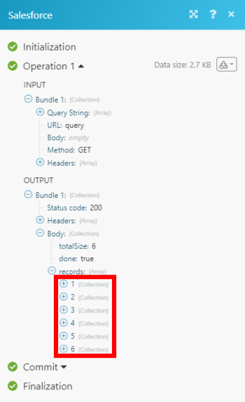

# Salesforce modules

In a *Adobe Workfront Fusion* scenario, you can connect your *Salesforce* account to multiple third-party applications and services.

If you need instructions on creating a scenario, see [Create a scenario](../../workfront-fusion/scenarios/create-a-scenario.md).

For information about modules, see [Modules in Adobe Workfront Fusion](../../workfront-fusion/modules/modules.md).

>[!NOTE]
>
>* Not all editions of Salesforce have API access. For details, see the information about Salesforce editions with API access on the Salesforce Community site.
>* For information on specific errors returned from the Salesforce API, see the Salesforce API docs. You can also check the status of the Salesforce API for any possible service outages.
>

## Access requirements

You must have the following access to use the functionality in this article:

<table cellspacing="0"> 
 <col> 
 <col> 
 <tbody> 
  <tr> 
   <td role="rowheader"><em>Adobe Workfront</em> plan*</td> 
   <td> <p><em>Pro</em> or higher</p> </td> 
  </tr> <draft-comment>
   <tr data-mc-conditions=""> 
    <td role="rowheader"><em>Adobe Workfront</em> license*</td> 
    <td> <p>Plan, Work</p> </td> 
   </tr>
  </draft-comment>
  <tr data-mc-conditions=""> 
   <td role="rowheader"><em>Adobe Workfront</em> license*</td> 
   <td> <p>Plan, Work</p> </td> 
  </tr> 
  <tr> 
   <td role="rowheader"><em>Adobe Workfront Fusion</em> license**</td> 
   <td> <p><em>Workfront Fusion for Work Automation and Integration</em> </p> </td> 
  </tr> 
  <tr> 
   <td role="rowheader">Product</td> 
   <td>Your organization must purchase <em>Adobe Workfront Fusion</em> as well as <em>Adobe Workfront</em> to use functionality described in this article.</td> 
  </tr> <draft-comment>
   <tr data-mc-conditions="QuicksilverOrClassic.Draft mode"> 
    <td role="rowheader">Access level configurations*</td> 
    <td> <draft-comment>
      <p data-mc-conditions="QuicksilverOrClassic.Draft mode">You must be a <em>Workfront Fusion</em> administrator for your organization.</p>
     </draft-comment><p data-mc-conditions="QuicksilverOrClassic.Draft mode">You must be a <em>Workfront Fusion</em> administrator for your organization.</p> <draft-comment>
      <p data-mc-conditions="QuicksilverOrClassic.Draft mode">You must be a <em>Workfront Fusion</em> administrator for your team.</p>
     </draft-comment><p data-mc-conditions="QuicksilverOrClassic.Draft mode">You must be a <em>Workfront Fusion</em> administrator for your team.</p> </td> 
   </tr>
  </draft-comment>
  <tr data-mc-conditions="QuicksilverOrClassic.Draft mode"> 
   <td role="rowheader">Access level configurations*</td> 
   <td> <p data-mc-conditions="QuicksilverOrClassic.Draft mode">You must be a <em>Workfront Fusion</em> administrator for your organization.</p> <p data-mc-conditions="QuicksilverOrClassic.Draft mode">You must be a <em>Workfront Fusion</em> administrator for your team.</p> </td> 
  </tr> 
 </tbody> 
</table>

&#42;To find out what plan, license type, or access you have, contact your *Workfront administrator*.

&#42;&#42;For information on *Adobe Workfront Fusion* licenses, see [Adobe Workfront Fusion licenses](../../workfront-fusion/get-started/license-automation-vs-integration.md)

## Prerequisites

To use Salesforce modules, you must have a Salesforce account.

## About searching for Salesforce objects

When searching for objects, you can either enter individual search words or create a more complex query using wild cards and operators:

* Use the asterisk wild card (&#42;) as a substitute for zero or more characters. For example, a search for Ca&#42; finds items that start with Ca
* Use a question mark wild card (?) as a substitute for a single character. For example, a search for Jo?n finds items with the term John or Joan but not Jon
* Use the quotation marks operator (" ") to find an exact phrase match. For example: "Monday meeting"

For more information about search possibilities, see the Salesforce developer documentation about SOQL and SOSL.

## Salesforce modules and their fields

* [Triggers](#triggers) 
* [Actions](#actions) 
* [Searches](#searches)

### Triggers

* [Watch for Records](#watch) 
* [Watch Outbound Messages](#watch2) 
* [Watch a field](#watch3)

#### Watch for Records

This trigger module executes a scenario when *a record in an object is created or updated*

<!--
<MadCap:conditionalText data-mc-conditions="SnippetConditions.HIDE">
in
<em>Salesforce</em>
</MadCap:conditionalText>
-->

`<MadCap:conditionalText data-mc-conditions="SnippetConditions.HIDE">  in  <em>Salesforce</em></MadCap:conditionalText>`. The module *returns all standard fields associated with the record or records, along with any custom fields and values that the connection accesses*. You can map *this information* in subsequent modules in the scenario.

When you are configuring this module, the following fields display

<!--
<MadCap:conditionalText data-mc-conditions="SnippetConditions.HIDE">
, along with any other available
<em>Salesforce</em> fields, depending on the connection and options you choose
</MadCap:conditionalText>
-->

`<MadCap:conditionalText data-mc-conditions="SnippetConditions.HIDE"> , along with any other available  <em>Salesforce</em> fields, depending on the connection and options you choose</MadCap:conditionalText>`.

<table> 
 <col> 
 <col> 
 <tbody> 
  <tr> 
   <td>Connection</td> 
   <td> <p>For instructions about connecting your <em>Salesforce</em> account to <em>Workfront Fusion</em>, see <a href="../../workfront-fusion/connections/connect-to-fusion-general.md" class="MCXref xref" data-mc-variable-override="">Create a connection to Workfront Fusion - Basic instructions</a></p> </td> 
  </tr> 
  <tr> 
   <td>Type </td> 
   <td> <p>Select the type of <em>Salesforce</em> record that you want the module to <em>watch</em>.</p> </td> 
  </tr> 
  <tr> 
   <td>Record Fields</td> 
   <td>Select the fields that you want the module to watch. Available fields depend on the type of record.</td> 
  </tr> 
  <tr> 
   <td>Maximal count of records</td> 
   <td> <p>Enter or map the maximum number of <em>record</em>s you want the module to <em>return</em> during each scenario execution cycle.</p> </td> 
  </tr> 
  <tr> 
   <td>Watch</td> 
   <td> <p>Determine whether you want the scenario to watch only new records of the type you selected, or new records of the type you selected and all other changes to records of that type.</p> </td> 
  </tr> 
 </tbody> 
</table>

#### Watch Outbound Messages

This trigger module executes a scenario when *someone sends a message*

<!--
<MadCap:conditionalText data-mc-conditions="SnippetConditions.HIDE">
in
<em>Salesforce</em>
</MadCap:conditionalText>
-->

`<MadCap:conditionalText data-mc-conditions="SnippetConditions.HIDE">  in  <em>Salesforce</em></MadCap:conditionalText>`. The module *returns all standard fields associated with the record or records, along with any custom fields and values that the connection accesses*. You can map *this information* in subsequent modules in the scenario.

<!--
<span style="color: #ff1493;" data-mc-conditions="QuicksilverOrClassic.Draft mode">Is this correct?</span>
-->

`Is this correct?`

This module requires some extra setup:

1. Go to the Salesforce setup page.

   To access the setup page, locate and click the button labeled “Setup” in the upper-right hand corner of the Salesforce account. From the Salesforce setup page, locate the “Quick Find / Search” bar on the left hand side. Search for “Workflow Rules.” 

1. Click `Workflow Rules`. This will take you to .
1. On the the Workflow Rules page that appears, click `New Rule` and select the object type the rule will apply to (such as. “Opportunity” if you are monitoring updates to Opportunity records).
1. Click `Next`.
1. Set a rule name, evaluation criteria, and rule criteria, then click `Save` and `Next`.

1. Click `Done`.
1. From the newly created Workflow rule, click `Edit`..
1. From the `Add Workflow Action` drop-down list, select `New Outbound Message`.

1. Specify name, description, Endpoint URL, and fields you want to include in the new outbound message, then click `Save`.

   The `Endpoint URL` field contains the URL provided on the Salesforce Outbound Message 

   <!--
   <MadCap:conditionalText data-mc-conditions="QuicksilverOrClassic.Draft mode">
   card
   </MadCap:conditionalText>
   -->

   `<MadCap:conditionalText data-mc-conditions="QuicksilverOrClassic.Draft mode"> card </MadCap:conditionalText>`in Workfront Fusion.

1. Configure a scenario beginning with the Outbound Message event 

   <!--
   <MadCap:conditionalText data-mc-conditions="QuicksilverOrClassic.Draft mode">
   card
   </MadCap:conditionalText>
   -->

   `<MadCap:conditionalText data-mc-conditions="QuicksilverOrClassic.Draft mode"> card</MadCap:conditionalText>`.

1. Click the `</>` icon in the bottom right and copy the provided URL.
1. Return to the `Workflow Rules` page, locate the newly created rule, then click `Activate`.

When you are configuring this module, the following fields display

<!--
<MadCap:conditionalText data-mc-conditions="SnippetConditions.HIDE">
, along with any other available
<em>Salesforce</em> fields, depending on the connection and options you choose
</MadCap:conditionalText>
-->

`<MadCap:conditionalText data-mc-conditions="SnippetConditions.HIDE"> , along with any other available  <em>Salesforce</em> fields, depending on the connection and options you choose</MadCap:conditionalText>`.

<!--
<table data-mc-conditions="QuicksilverOrClassic.Draft mode">
<col>
<col>
<tbody>
<tr>
<td>Connection</td>
<td> <p>For instructions about connecting your <em>Salesforce</em> account to <em>Workfront Fusion</em>, see <a href="../../workfront-fusion/connections/connect-to-fusion-general.md" class="MCXref xref" data-mc-variable-override="">Create a connection to Workfront Fusion - Basic instructions</a></p> </td>
</tr>
</tbody>
</table>
-->

<table data-mc-conditions="QuicksilverOrClassic.Draft mode"> 
 <col> 
 <col> 
 <tbody> 
  <tr> 
   <td>Connection</td> 
   <td> <p>For instructions about connecting your <em>Salesforce</em> account to <em>Workfront Fusion</em>, see <a href="../../workfront-fusion/connections/connect-to-fusion-general.md" class="MCXref xref" data-mc-variable-override="">Create a connection to Workfront Fusion - Basic instructions</a></p> </td> 
  </tr> 
 </tbody> 
</table>

<table> 
 <col> 
 <col> 
 <tbody> 
  <tr> 
   <td>Webhook</td> 
   <td> <p>Select the webhook that you want to use to watch outgoing messages. To add a webhook, click <span class="bold">Add </span>and enter the webhook's name and connection.</p> <p>For instructions about connecting your <em>Salesforce</em> account to <em>Workfront Fusion</em>, see <a href="../../workfront-fusion/connections/connect-to-fusion-general.md" class="MCXref xref" data-mc-variable-override="">Create a connection to Workfront Fusion - Basic instructions</a></p> </td> 
  </tr> 
  <tr> 
   <td>Record Type </td> 
   <td> <p>Select the type of Salesforce record that you want the module to watch for outgoing messages.</p> </td> 
  </tr> 
  <tr> 
   <td>Fields</td> 
   <td> <p>Select the fields that you want the module to watch for outgoing messages. Available fields depend on the type of record.</p> </td> 
  </tr> 
 </tbody> 
</table>

#### Watch a field

This trigger module starts a scenario when a field is updated in Salesforce.

<table> 
 <col> 
 <col> 
 <tbody> 
  <tr> 
   <td>Connection</td> 
   <td> <p>For instructions about connecting your <em>Salesforce</em> account to <em>Workfront Fusion</em>, see <a href="../../workfront-fusion/connections/connect-to-fusion-general.md" class="MCXref xref" data-mc-variable-override="">Create a connection to Workfront Fusion - Basic instructions</a></p> </td> 
  </tr> 
  <tr> 
   <td>Record Type </td> 
   <td> <p>Select the type of record that contains the field you want the module to watch. You must choose a record type that has Field History turned on in Salesforce setup. For more information, see <a href="https://help.salesforce.com/articleView?id=tracking_field_history.htm&amp;type=5">Field History Tracking</a> in the Salesforce documentation. </p> </td> 
  </tr> 
  <tr> 
   <td>Field</td> 
   <td> <p>Select the fields that you want the module to watch for changes.</p> </td> 
  </tr> 
  <tr> 
   <td>Limit</td> 
   <td> <p>Enter or map the maximum number of <em>field</em>s you want the module to <em>return</em> during each scenario execution cycle.</p> </td> 
  </tr> 
 </tbody> 
</table>

### Actions

  <!--
  <li data-mc-conditions="QuicksilverOrClassic.Draft mode"><a href="#create2" class="MCXref xref">Create a Record (Static Fields)</a> </li>
  -->

* [Create a Record (Static Fields)](#create2) 
* [Create a Record](#create) 
* [Read a Record](#read) 
* [Delete a Record](#delete2) 
* [Custom API Call](#make2) 
* [Upload Attachment/Document](#upload) 
* [Download Attachment/Document](#download2)

  <!--
  <li data-mc-conditions="QuicksilverOrClassic.Draft mode"><a href="#update3" class="MCXref xref">Update a Record (Static Fields)</a> </li>
  -->

* [Update a Record (Static Fields)](#update3) 
* [Create a Record](#create)

<!--
<div data-mc-conditions="QuicksilverOrClassic.Draft mode">
<h4><a name="Create2"></a>Create a Record (Static Fields)</h4>
<p>This action module <em>creates a new record in an object</em><draft-comment>
<MadCap:conditionalText data-mc-conditions="SnippetConditions.HIDE">
in
<em>Salesforce</em>
</MadCap:conditionalText>
</draft-comment><MadCap:conditionalText data-mc-conditions="SnippetConditions.HIDE">
in
<em>Salesforce</em>
</MadCap:conditionalText>.</p>
<p>You specify the type of <em>record</em>.</p>
<p>The module returns the ID of the <draft-comment>
<MadCap:conditionalText data-mc-conditions="SnippetConditions.HIDE">
<em>new</em>
</MadCap:conditionalText>
</draft-comment><MadCap:conditionalText data-mc-conditions="SnippetConditions.HIDE">
<em>new</em>
</MadCap:conditionalText> <em>record</em> and any associated fields, along with any custom fields and values that the connection accesses. You can map <em>this information</em> in subsequent modules in the scenario.</p>
<p>When you are configuring this module, the following fields display<draft-comment>
<MadCap:conditionalText data-mc-conditions="SnippetConditions.HIDE">
, along with any other available
<em>Salesforce</em> fields, depending on the connection and options you choose
</MadCap:conditionalText>
</draft-comment><MadCap:conditionalText data-mc-conditions="SnippetConditions.HIDE">
, along with any other available
<em>Salesforce</em> fields, depending on the connection and options you choose
</MadCap:conditionalText>.</p>
<table>
<col>
<col>
<tbody>
<tr>
<td>Connection</td>
<td> <p>For instructions about connecting your <em>Salesforce</em> account to <em>Workfront Fusion</em>, see <a href="../../workfront-fusion/connections/connect-to-fusion-general.md" class="MCXref xref" data-mc-variable-override="">Create a connection to Workfront Fusion - Basic instructions</a></p> </td>
</tr>
<tr>
<td> <p>Record Type </p> </td>
<td> <p>Select the type of <em>Salesforce</em> record that you want the module to <em>create</em>. Fields become available based on the type of record selected in the Record Type field. These fields are based on the Salesforce API.</p> </td>
</tr>
</tbody>
</table>
</div>
-->

#### Create a Record (Static Fields)

This action module *creates a new record in an object*`<MadCap:conditionalText data-mc-conditions="SnippetConditions.HIDE">  in  <em>Salesforce</em></MadCap:conditionalText>`.

You specify the type of *record*.

The module returns the ID of the `<MadCap:conditionalText data-mc-conditions="SnippetConditions.HIDE">  <em>new</em></MadCap:conditionalText>` *record* and any associated fields, along with any custom fields and values that the connection accesses. You can map *this information* in subsequent modules in the scenario.

When you are configuring this module, the following fields display`<MadCap:conditionalText data-mc-conditions="SnippetConditions.HIDE"> , along with any other available  <em>Salesforce</em> fields, depending on the connection and options you choose</MadCap:conditionalText>`.

<table> 
 <col> 
 <col> 
 <tbody> 
  <tr> 
   <td>Connection</td> 
   <td> <p>For instructions about connecting your <em>Salesforce</em> account to <em>Workfront Fusion</em>, see <a href="../../workfront-fusion/connections/connect-to-fusion-general.md" class="MCXref xref" data-mc-variable-override="">Create a connection to Workfront Fusion - Basic instructions</a></p> </td> 
  </tr> 
  <tr> 
   <td> <p>Record Type </p> </td> 
   <td> <p>Select the type of <em>Salesforce</em> record that you want the module to <em>create</em>. Fields become available based on the type of record selected in the Record Type field. These fields are based on the Salesforce API.</p> </td> 
  </tr> 
 </tbody> 
</table>

#### Create a Record

This action module *creates a new record in an object*

<!--
<MadCap:conditionalText data-mc-conditions="SnippetConditions.HIDE">
in
<em>Salesforce</em>
</MadCap:conditionalText>
-->

`<MadCap:conditionalText data-mc-conditions="SnippetConditions.HIDE">  in  <em>Salesforce</em></MadCap:conditionalText>`.

The module allows you to select which of the object's fields are available in the module. This reduces the number of fields you must scroll through when setting up the module.

The module returns the ID of the 

<!--
<MadCap:conditionalText data-mc-conditions="SnippetConditions.HIDE">
<em>new</em>
</MadCap:conditionalText>
-->

`<MadCap:conditionalText data-mc-conditions="SnippetConditions.HIDE">  <em>new</em></MadCap:conditionalText>` *record* and any associated fields, along with any custom fields and values that the connection accesses. You can map *this information* in subsequent modules in the scenario.

When you are configuring this module, the following fields display

<!--
<MadCap:conditionalText data-mc-conditions="SnippetConditions.HIDE">
, along with any other available
<em>Salesforce</em> fields, depending on the connection and options you choose
</MadCap:conditionalText>
-->

`<MadCap:conditionalText data-mc-conditions="SnippetConditions.HIDE"> , along with any other available  <em>Salesforce</em> fields, depending on the connection and options you choose</MadCap:conditionalText>`.

<table> 
 <col> 
 <col> 
 <tbody> 
  <tr> 
   <td>Connection</td> 
   <td> <p>For instructions about connecting your <em>Salesforce</em> account to <em>Workfront Fusion</em>, see <a href="../../workfront-fusion/connections/connect-to-fusion-general.md" class="MCXref xref" data-mc-variable-override="">Create a connection to Workfront Fusion - Basic instructions</a></p> </td> 
  </tr> 
  <tr> 
   <td> <p>Record Type </p> </td> 
   <td> <p>Select the type of <em>Salesforce</em> record that you want the module to <em>create</em>. Fields become available based on the type of record selected in the Record Type field. These fields are based on the Salesforce API.</p> </td> 
  </tr> 
  <tr> 
   <td>Select fields to map</td> 
   <td> <p>Select the fields that you want the module to configure when creating the new record. Required fields are at the top of the list. </p> <p>The fields you select open below this field. You can now enter values into these fields.</p> </td> 
  </tr> 
 </tbody> 
</table>

#### Read a Record

This action module reads *data from a single object* in *Salesforce*.

You specify the

<!--
<MadCap:conditionalText data-mc-conditions="SnippetConditions.HIDE">
type and
</MadCap:conditionalText>
-->

`<MadCap:conditionalText data-mc-conditions="SnippetConditions.HIDE">  type and</MadCap:conditionalText>` ID of the *record*.

The module returns the ID of the *record* and any associated fields, along with any custom fields and values that the connection accesses. You can map *this information* in subsequent modules in the scenario.

When you are configuring this module, the following fields display

<!--
<MadCap:conditionalText data-mc-conditions="SnippetConditions.HIDE">
, along with any other available
<em>Salesforce</em> fields, depending on the connection and options you choose
</MadCap:conditionalText>
-->

`<MadCap:conditionalText data-mc-conditions="SnippetConditions.HIDE"> , along with any other available  <em>Salesforce</em> fields, depending on the connection and options you choose</MadCap:conditionalText>`.

<table> <draft-comment>
  <col data-mc-conditions="">
 </draft-comment>
 <col data-mc-conditions=""> <draft-comment>
  <col data-mc-conditions="">
 </draft-comment>
 <col data-mc-conditions=""> 
 <tbody> 
  <tr> <draft-comment>
    <td data-mc-conditions="QuicksilverOrClassic.Draft mode">Connection</td>
   </draft-comment>
   <td data-mc-conditions="QuicksilverOrClassic.Draft mode">Connection</td> 
   <td> <p>For instructions about connecting your <em>Salesforce</em> account to <em>Workfront Fusion</em>, see <a href="../../workfront-fusion/connections/connect-to-fusion-general.md" class="MCXref xref" data-mc-variable-override="">Create a connection to Workfront Fusion - Basic instructions</a></p> </td> 
  </tr> 
  <tr> <draft-comment>
    <td data-mc-conditions="QuicksilverOrClassic.Draft mode">Record Type</td>
   </draft-comment>
   <td data-mc-conditions="QuicksilverOrClassic.Draft mode">Record Type</td> <draft-comment>
    <td data-mc-conditions="QuicksilverOrClassic.Draft mode">Select the type of <em>Salesforce</em> record that you want the module to <em>[action]</em>.read.</td>
   </draft-comment>
   <td data-mc-conditions="QuicksilverOrClassic.Draft mode">Select the type of <em>Salesforce</em> record that you want the module to <em>[action]</em>.read.</td> 
  </tr> 
  <tr> <draft-comment>
    <td data-mc-conditions="QuicksilverOrClassic.Draft mode">Record Fields</td>
   </draft-comment>
   <td data-mc-conditions="QuicksilverOrClassic.Draft mode">Record Fields</td> <draft-comment>
    <td data-mc-conditions="QuicksilverOrClassic.Draft mode">Select the fields that you want the module to read. You must select at least one field.</td>
   </draft-comment>
   <td data-mc-conditions="QuicksilverOrClassic.Draft mode">Select the fields that you want the module to read. You must select at least one field.</td> 
  </tr> 
  <tr> <draft-comment>
    <td data-mc-conditions="QuicksilverOrClassic.Draft mode">ID</td>
   </draft-comment>
   <td data-mc-conditions="QuicksilverOrClassic.Draft mode">ID</td> <draft-comment>
    <td data-mc-conditions="QuicksilverOrClassic.Draft mode"> <p>Enter or map the unique <em>Salesforce</em> ID of the <em>record</em> that you want the module to <em>read</em>.</p> <p>To get the ID, open the <em>Salesforce</em> object in your browser and copy the text at the end of the URL after the last forward slash (/). For example: <code>https://eu5.salesforce.com/&lt;object ID&gt;</code></p> </td>
   </draft-comment>
   <td data-mc-conditions="QuicksilverOrClassic.Draft mode"> <p>Enter or map the unique <em>Salesforce</em> ID of the <em>record</em> that you want the module to <em>read</em>.</p> <p>To get the ID, open the <em>Salesforce</em> object in your browser and copy the text at the end of the URL after the last forward slash (/). For example: <code>https://eu5.salesforce.com/&lt;object ID&gt;</code></p> </td> 
  </tr> 
 </tbody> 
</table>

#### Delete a Record

This action module *deletes an existing record in an object*

<!--
<MadCap:conditionalText data-mc-conditions="SnippetConditions.HIDE">
in
<em>Salesforce</em>
</MadCap:conditionalText>
-->

`<MadCap:conditionalText data-mc-conditions="SnippetConditions.HIDE">  in  <em>Salesforce</em></MadCap:conditionalText>`.

You specify the

<!--
<MadCap:conditionalText data-mc-conditions="SnippetConditions.HIDE">
type and
</MadCap:conditionalText>
-->

`<MadCap:conditionalText data-mc-conditions="SnippetConditions.HIDE">  type and</MadCap:conditionalText>` ID of the *record*.

The module returns the ID of the 

<!--
<MadCap:conditionalText data-mc-conditions="SnippetConditions.HIDE">
<em>deleted</em>
</MadCap:conditionalText>
-->

`<MadCap:conditionalText data-mc-conditions="SnippetConditions.HIDE">  <em>deleted</em></MadCap:conditionalText>` *record* and any associated fields, along with any custom fields and values that the connection accesses. You can map *this information* in subsequent modules in the scenario.

When you are configuring this module, the following fields display

<!--
<MadCap:conditionalText data-mc-conditions="SnippetConditions.HIDE">
, along with any other available
<em>Salesforce</em> fields, depending on the connection and options you choose
</MadCap:conditionalText>
-->

`<MadCap:conditionalText data-mc-conditions="SnippetConditions.HIDE"> , along with any other available  <em>Salesforce</em> fields, depending on the connection and options you choose</MadCap:conditionalText>`.

<table> 
 <col> 
 <col> 
 <tbody> 
  <tr> 
   <td>Connection</td> 
   <td> <p>For instructions about connecting your <em>Salesforce</em> account to <em>Workfront Fusion</em>, see <a href="../../workfront-fusion/connections/connect-to-fusion-general.md" class="MCXref xref" data-mc-variable-override="">Create a connection to Workfront Fusion - Basic instructions</a></p> </td> 
  </tr> 
  <tr> 
   <td>Record Type </td> 
   <td> <p>Select the type of <em>Salesforce</em> record that you want the module to <em>delete</em>.</p> </td> 
  </tr> 
  <tr> 
   <td>ID</td> 
   <td> <p>Enter or map the unique <em>Salesforce</em> ID of the <em>record</em> that you want the module to <em>delete</em>.</p> <p>To get the ID, open the <em>Salesforce</em> object in your browser and copy the text at the end of the URL after the last forward slash (/). For example: <code>https://eu5.salesforce.com/&lt;object ID&gt;</code></p> </td> 
  </tr> 
 </tbody> 
</table>

#### Custom API Call

This action module lets you make a custom authenticated call to the *Salesforce* API

<!--
<MadCap:conditionalText data-mc-conditions="SnippetConditions.HIDE">
without having to think through authentication
</MadCap:conditionalText>
-->

`<MadCap:conditionalText data-mc-conditions="SnippetConditions.HIDE">  without having to think through authentication</MadCap:conditionalText>`. This way, you can create a data flow automation that can't be accomplished by the other *Salesforce* modules.

The module returns the following:

* `Status Code`(number): This indicates the success or failure of your HTTP request. These are standard codes that you can look up on the internet.
* `Headers`(object): A more detailed context for the response/status code that doesn’t relate to the output body. Not all headers that appear in a response header are response headers, so some might not be useful to you.

  The response headers depend on the HTTP request you chose when configuring the module.

* `Body`(object): Depending on the HTTP request you chose when configuring the module, you may receive some data back. That data, such as the data from a GET request, is contained in this object.

When you are configuring this module, the following fields display

<!--
<MadCap:conditionalText data-mc-conditions="SnippetConditions.HIDE">
, along with any other available
<em>Salesforce</em> fields, depending on the connection and options you choose
</MadCap:conditionalText>
-->

`<MadCap:conditionalText data-mc-conditions="SnippetConditions.HIDE"> , along with any other available  <em>Salesforce</em> fields, depending on the connection and options you choose</MadCap:conditionalText>`.

<table cellspacing="0"> 
 <col> 
 <col> 
 <tbody> 
  <tr> 
   <td role="rowheader">Connection</td> 
   <td> <p>For instructions about connecting your <em>Salesforce</em> account to <em>Workfront Fusion</em>, see <a href="../../workfront-fusion/connections/connect-to-fusion-general.md" class="MCXref xref" data-mc-variable-override="">Create a connection to Workfront Fusion - Basic instructions</a></p> </td> 
  </tr> 
  <tr> 
   <td role="rowheader"> <p>URL</p> </td> 
   <td> <p>Enter a path relative to<code> &lt;Instance URL&gt;/services/data/v46.0/</code>.</p> <p>For the list of available endpoints, refer to the <a href="https://developer.salesforce.com/docs/atlas.en-us.api_rest.meta/api_rest/intro_what_is_rest_api.htm">Salesforce REST API Developer Guide</a>.</p> </td> 
  </tr> 
  <tr> 
   <td role="rowheader"> <p>Method</p> </td> 
   <td> <p>Select the HTTP request method you need to configure the API call. For more information, see <a href="../../workfront-fusion/modules/http-request-methods.md" class="MCXref xref" data-mc-variable-override="">HTTP request methods</a>.</p> </td> 
  </tr> 
  <tr> 
   <td role="rowheader">Headers</td> 
   <td> <p>Add the headers of the request in the form of a standard JSON object.For example, <code>{"Content-type":"application/json"}</code>. <em>Workfront Fusion</em> adds the authorization headers for you.</p> </td> 
  </tr> 
  <tr> 
   <td role="rowheader">Query String</td> 
   <td> <p><![CDATA[	]]>Add the query for the API call in the form of a standard JSON object.For example: <code>{“name”:“something-urgent”}</code></p> </td> 
  </tr> 
  <tr> 
   <td role="rowheader">Body</td> 
   <td> <p>Add the body content for the API call in the form of a standard JSON object.</p> <p>Note:  <p>When using conditional statements such as <code>if</code> in your JSON, put the quotation marks outside of the conditional statement.</p> 
     <div class="example" data-mc-autonum="<b>Example: </b>"> 
      <p>  </p> 
     </div> </p> </td> 
  </tr> 
 </tbody> 
</table>

` `**Example: **`` The following API call returns the list of all users in your Salesforce account:

* `URL`: 

  ```
  query
  ```

* `Method`: GET
* `Query String`:
* `Key`: 

  ```
  q
  ```

* `Value`: 

  ```
  SELECT Id, Name, CreatedDate, LastModifiedDate FROM User LIMIT 10
  ```

Matches of the search can be found in the module's Output under `Bundle > Body > records`.

In our example, 6 users were returned:



#### Upload Attachment/Document

This action module *uploads a file and attaches it to a record you specify, or uploads a document*

<!--
<MadCap:conditionalText data-mc-conditions="SnippetConditions.HIDE">
in
<em>Salesforce</em>
</MadCap:conditionalText>
-->

`<MadCap:conditionalText data-mc-conditions="SnippetConditions.HIDE">  in  <em>Salesforce</em></MadCap:conditionalText>`.

The module returns the ID of the *attachment or document* and any associated fields, along with any custom fields and values that the connection accesses. You can map *this information* in subsequent modules in the scenario.

When you are configuring this module, the following fields display

<!--
<MadCap:conditionalText data-mc-conditions="SnippetConditions.HIDE">
, along with any other available
<em>Salesforce</em> fields, depending on the connection and options you choose
</MadCap:conditionalText>
-->

`<MadCap:conditionalText data-mc-conditions="SnippetConditions.HIDE"> , along with any other available  <em>Salesforce</em> fields, depending on the connection and options you choose</MadCap:conditionalText>`.

<table> <draft-comment>
  <col data-mc-conditions="">
 </draft-comment>
 <col data-mc-conditions=""> <draft-comment>
  <col data-mc-conditions="">
 </draft-comment>
 <col data-mc-conditions=""> 
 <tbody> 
  <tr> 
   <td>Connection</td> 
   <td> <p>For instructions about connecting your <em>Salesforce</em> account to <em>Workfront Fusion</em>, see <a href="../../workfront-fusion/connections/connect-to-fusion-general.md" class="MCXref xref" data-mc-variable-override="">Create a connection to Workfront Fusion - Basic instructions</a></p> </td> 
  </tr> 
  <tr> 
   <td>Type of Upload</td> 
   <td>Select whether you want the module to upload an attachment or a document.</td> 
  </tr> 
  <tr> 
   <td>ID</td> 
   <td>Enter or map the ID&nbsp;of the object you want to upload an attachment to.</td> 
  </tr> 
  <tr> 
   <td>Folder</td> 
   <td>Select the folder containing the file you want the module to upload. </td> 
  </tr> 
  <tr> 
   <td>Source File</td> 
   <td>Select a source file from a previous module, or map the source file's name and data.</td> 
  </tr> 
 </tbody> 
</table>

#### Download Attachment/Document

This action module *downloads a document or attachment from a record*

<!--
<MadCap:conditionalText data-mc-conditions="SnippetConditions.HIDE">
in
<em>Salesforce</em>
</MadCap:conditionalText>
-->

`<MadCap:conditionalText data-mc-conditions="SnippetConditions.HIDE">  in  <em>Salesforce</em></MadCap:conditionalText>`.

You specify the ID of the record and the type of download you want.

The module returns the ID of the 

<!--
<MadCap:conditionalText data-mc-conditions="SnippetConditions.HIDE">
<em>downloaded</em>
</MadCap:conditionalText>
-->

`<MadCap:conditionalText data-mc-conditions="SnippetConditions.HIDE">  <em>downloaded</em></MadCap:conditionalText>` *attachment or document* and any associated fields, along with any custom fields and values that the connection accesses. You can map *this information* in subsequent modules in the scenario.

When you are configuring this module, the following fields display

<!--
<MadCap:conditionalText data-mc-conditions="SnippetConditions.HIDE">
, along with any other available
<em>Salesforce</em> fields, depending on the connection and options you choose
</MadCap:conditionalText>
-->

`<MadCap:conditionalText data-mc-conditions="SnippetConditions.HIDE"> , along with any other available  <em>Salesforce</em> fields, depending on the connection and options you choose</MadCap:conditionalText>`.

<table> <draft-comment>
  <col data-mc-conditions="">
 </draft-comment>
 <col data-mc-conditions=""> <draft-comment>
  <col data-mc-conditions="">
 </draft-comment>
 <col data-mc-conditions=""> 
 <tbody> 
  <tr> <draft-comment>
    <td data-mc-conditions="QuicksilverOrClassic.Draft mode">Connection</td>
   </draft-comment>
   <td data-mc-conditions="QuicksilverOrClassic.Draft mode">Connection</td> 
   <td> <p>For instructions about connecting your <em>Salesforce</em> account to <em>Workfront Fusion</em>, see <a href="../../workfront-fusion/connections/connect-to-fusion-general.md" class="MCXref xref" data-mc-variable-override="">Create a connection to Workfront Fusion - Basic instructions</a></p> </td> 
  </tr> 
  <tr> <draft-comment>
    <td data-mc-conditions="QuicksilverOrClassic.Draft mode">Type of Download</td>
   </draft-comment>
   <td data-mc-conditions="QuicksilverOrClassic.Draft mode">Type of Download</td> <draft-comment>
    <td data-mc-conditions="QuicksilverOrClassic.Draft mode"> <p>Specify the type of file that you want to download from Salesforce.</p> 
     <ul> 
      <li>Attachment</li> 
      <li>Document</li> 
      <li>ContentDocument (This is a document that has been uploaded to a library in Saleforce CRM Content or Salesforce Files.)</li> 
     </ul> </td>
   </draft-comment>
   <td data-mc-conditions="QuicksilverOrClassic.Draft mode"> <p>Specify the type of file that you want to download from Salesforce.</p> 
    <ul> 
     <li>Attachment</li> 
     <li>Document</li> 
     <li>ContentDocument (This is a document that has been uploaded to a library in Saleforce CRM Content or Salesforce Files.)</li> 
    </ul> </td> 
  </tr> 
  <tr> <draft-comment>
    <td data-mc-conditions="QuicksilverOrClassic.Draft mode"> <p>ID / </p> <p>Attachment ID / </p> <p>ContentDocument ID</p> </td>
   </draft-comment>
   <td data-mc-conditions="QuicksilverOrClassic.Draft mode"> <p>ID / </p> <p>Attachment ID / </p> <p>ContentDocument ID</p> </td> <draft-comment>
    <td data-mc-conditions="QuicksilverOrClassic.Draft mode"> <p>Enter or map the unique <em>Salesforce</em> ID of the <em>record</em> that you want the module to <em>download</em>.</p> <p>To get the ID, open the <em>Salesforce</em> object in your browser and copy the text at the end of the URL after the last forward slash (/). For example: <code>https://eu5.salesforce.com/&lt;object ID&gt;</code></p> </td>
   </draft-comment>
   <td data-mc-conditions="QuicksilverOrClassic.Draft mode"> <p>Enter or map the unique <em>Salesforce</em> ID of the <em>record</em> that you want the module to <em>download</em>.</p> <p>To get the ID, open the <em>Salesforce</em> object in your browser and copy the text at the end of the URL after the last forward slash (/). For example: <code>https://eu5.salesforce.com/&lt;object ID&gt;</code></p> </td> 
  </tr> 
 </tbody> 
</table>

<!--
<div data-mc-conditions="QuicksilverOrClassic.Draft mode">
<h4><a name="Update3"></a>Update a Record <draft-comment>
<MadCap:conditionalText data-mc-conditions="QuicksilverOrClassic.Draft mode">
(Static Fields)
</MadCap:conditionalText>
</draft-comment><MadCap:conditionalText data-mc-conditions="QuicksilverOrClassic.Draft mode">
(Static Fields)
</MadCap:conditionalText></h4>
<p>This action module <em>edits a record in an object</em><draft-comment>
<MadCap:conditionalText data-mc-conditions="SnippetConditions.HIDE">
in
<em>Salesforce</em>
</MadCap:conditionalText>
</draft-comment><MadCap:conditionalText data-mc-conditions="SnippetConditions.HIDE">
in
<em>Salesforce</em>
</MadCap:conditionalText>.</p>
<p>You specify the<draft-comment>
<MadCap:conditionalText data-mc-conditions="SnippetConditions.HIDE">
type and
</MadCap:conditionalText>
</draft-comment><MadCap:conditionalText data-mc-conditions="SnippetConditions.HIDE">
type and
</MadCap:conditionalText> ID of the <em>record</em>.</p>
<p>The module returns the ID of the <draft-comment>
<MadCap:conditionalText data-mc-conditions="SnippetConditions.HIDE">
<em>updated</em>
</MadCap:conditionalText>
</draft-comment><MadCap:conditionalText data-mc-conditions="SnippetConditions.HIDE">
<em>updated</em>
</MadCap:conditionalText> <em>record</em> and any associated fields, along with any custom fields and values that the connection accesses. You can map <em>this information</em> in subsequent modules in the scenario.</p>
<p>When you are configuring this module, the following fields display<draft-comment>
<MadCap:conditionalText data-mc-conditions="SnippetConditions.HIDE">
, along with any other available
<em>Salesforce</em> fields, depending on the connection and options you choose
</MadCap:conditionalText>
</draft-comment><MadCap:conditionalText data-mc-conditions="SnippetConditions.HIDE">
, along with any other available
<em>Salesforce</em> fields, depending on the connection and options you choose
</MadCap:conditionalText>.</p>
<table>
<col>
<col>
<tbody>
<tr>
<td>Connection</td>
<td> <p>For instructions about connecting your <em>Salesforce</em> account to <em>Workfront Fusion</em>, see <a href="../../workfront-fusion/connections/connect-to-fusion-general.md" class="MCXref xref" data-mc-variable-override="">Create a connection to Workfront Fusion - Basic instructions</a></p> </td>
</tr>
<tr>
<td>ID</td>
<td>Enter or map the unique <em>Salesforce</em> ID of the <em>record</em> that you want the module to <em>update</em>.<p>To get the ID, open the <em>Salesforce</em> object in your browser and copy the text at the end of the URL after the last forward slash (/). For example: <code>https://eu5.salesforce.com/<object ID></code></p></td>
</tr>
<tr>
<td>Record Type </td>
<td> <p>Select the type of <em>Salesforce</em> record that you want the module to <em>[action]</em>.update. Fields become available based on the type of record selected in the Record Type field. These fields are based on the Salesforce API.</p> </td>
</tr>
</tbody>
</table>
<p>See also the information about working with records in the Salesforce REST API Developer Guide.</p>
</div>
-->

#### Update a Record `<MadCap:conditionalText data-mc-conditions="QuicksilverOrClassic.Draft mode"> (Static Fields)</MadCap:conditionalText>`

This action module *edits a record in an object*`<MadCap:conditionalText data-mc-conditions="SnippetConditions.HIDE">  in  <em>Salesforce</em></MadCap:conditionalText>`.

You specify the`<MadCap:conditionalText data-mc-conditions="SnippetConditions.HIDE">  type and</MadCap:conditionalText>` ID of the *record*.

The module returns the ID of the `<MadCap:conditionalText data-mc-conditions="SnippetConditions.HIDE">  <em>updated</em></MadCap:conditionalText>` *record* and any associated fields, along with any custom fields and values that the connection accesses. You can map *this information* in subsequent modules in the scenario.

When you are configuring this module, the following fields display`<MadCap:conditionalText data-mc-conditions="SnippetConditions.HIDE"> , along with any other available  <em>Salesforce</em> fields, depending on the connection and options you choose</MadCap:conditionalText>`.

<table> 
 <col> 
 <col> 
 <tbody> 
  <tr> 
   <td>Connection</td> 
   <td> <p>For instructions about connecting your <em>Salesforce</em> account to <em>Workfront Fusion</em>, see <a href="../../workfront-fusion/connections/connect-to-fusion-general.md" class="MCXref xref" data-mc-variable-override="">Create a connection to Workfront Fusion - Basic instructions</a></p> </td> 
  </tr> 
  <tr> 
   <td>ID</td> 
   <td>Enter or map the unique <em>Salesforce</em> ID of the <em>record</em> that you want the module to <em>update</em>.<p>To get the ID, open the <em>Salesforce</em> object in your browser and copy the text at the end of the URL after the last forward slash (/). For example: <code>https://eu5.salesforce.com/&lt;object ID&gt;</code></p></td> 
  </tr> 
  <tr> 
   <td>Record Type </td> 
   <td> <p>Select the type of <em>Salesforce</em> record that you want the module to <em>[action]</em>.update. Fields become available based on the type of record selected in the Record Type field. These fields are based on the Salesforce API.</p> </td> 
  </tr> 
 </tbody> 
</table>

See also the information about working with records in the Salesforce REST API Developer Guide.

#### Update a Record

This action module *edits a record in an object*

<!--
<MadCap:conditionalText data-mc-conditions="SnippetConditions.HIDE">
in
<em>Salesforce</em>
</MadCap:conditionalText>
-->

`<MadCap:conditionalText data-mc-conditions="SnippetConditions.HIDE">  in  <em>Salesforce</em></MadCap:conditionalText>`.

The module allows you to select which of the object's fields are available in the module. This reduces the number of fields you must scroll through when setting up the module.

The module returns the ID of the 

<!--
<MadCap:conditionalText data-mc-conditions="SnippetConditions.HIDE">
<em>updated</em>
</MadCap:conditionalText>
-->

`<MadCap:conditionalText data-mc-conditions="SnippetConditions.HIDE">  <em>updated</em></MadCap:conditionalText>` *record* and any associated fields, along with any custom fields and values that the connection accesses. You can map *this information* in subsequent modules in the scenario.

When you are configuring this module, the following fields display

<!--
<MadCap:conditionalText data-mc-conditions="SnippetConditions.HIDE">
, along with any other available
<em>Salesforce</em> fields, depending on the connection and options you choose
</MadCap:conditionalText>
-->

`<MadCap:conditionalText data-mc-conditions="SnippetConditions.HIDE"> , along with any other available  <em>Salesforce</em> fields, depending on the connection and options you choose</MadCap:conditionalText>`.

<table> 
 <col> 
 <col> 
 <tbody> 
  <tr> 
   <td>Connection</td> 
   <td> <p>For instructions about connecting your <em>Salesforce</em> account to <em>Workfront Fusion</em>, see <a href="../../workfront-fusion/connections/connect-to-fusion-general.md" class="MCXref xref" data-mc-variable-override="">Create a connection to Workfront Fusion - Basic instructions</a></p> </td> 
  </tr> 
  <tr> 
   <td>ID</td> 
   <td>Enter or map the ID&nbsp;of the record that you want to update.</td> 
  </tr> 
  <tr> 
   <td> <p>Record Type </p> </td> 
   <td> <p>Select the type of <em>Salesforce</em> record that you want the module to <em>update</em>. Fields become available based on the type of record selected in the Record Type field. These fields are based on the Salesforce API.</p> </td> 
  </tr> 
  <tr> 
   <td>Select fields to map</td> 
   <td> <p>Select the fields that you want the module to configure when creating the new record. Required fields are at the top of the list. </p> <p>The fields you select open below this field. You can now enter values into these fields.</p> </td> 
  </tr> 
 </tbody> 
</table>

### Searches

#### Search with Query

This search module looks for *records in an object* in *Salesforce* that match the search query you specify.

<!--
<MadCap:conditionalText data-mc-conditions="SnippetConditions.HIDE">
The module
<em>returns the record' IDs</em>.
</MadCap:conditionalText>
-->

`<MadCap:conditionalText data-mc-conditions="SnippetConditions.HIDE"> The module  <em>returns the record' IDs</em>.</MadCap:conditionalText>` You can map *this information* in subsequent modules in the scenario.

When you are configuring this module, the following fields display

<!--
<MadCap:conditionalText data-mc-conditions="SnippetConditions.HIDE">
, along with any other available
<em>Salesforce</em> fields, depending on the connection and options you choose
</MadCap:conditionalText>
-->

`<MadCap:conditionalText data-mc-conditions="SnippetConditions.HIDE"> , along with any other available  <em>Salesforce</em> fields, depending on the connection and options you choose</MadCap:conditionalText>`.

<table> 
 <col> 
 <col> 
 <tbody> 
  <tr> 
   <td>Connection</td> 
   <td> <p>For instructions about connecting your <em>Salesforce</em> account to <em>Workfront Fusion</em>, see <a href="../../workfront-fusion/connections/connect-to-fusion-general.md" class="MCXref xref" data-mc-variable-override="">Create a connection to Workfront Fusion - Basic instructions</a></p> </td> 
  </tr> 
  <tr> 
   <td>Search Type</td> 
   <td> <p>Select the type of search you want the module to perform:</p> 
    <ul> 
     <li> <p>Simple</p> </li> 
     <li> <p>Using SOSL (Salesforce Object Search Language)</p> </li> 
     <li> <p>Using SOQL (Salesforce Object Query Language)</p> </li> 
    </ul> </td> 
  </tr> 
  <tr> 
   <td> <p>Type </p> </td> 
   <td> <p>If you selected the Simple search type, choose the type of Salesforce record that you want the module to search for.</p> </td> 
  </tr> 
  <tr> 
   <td>Query / SOSL Query / SOQL Query</td> 
   <td> <p>Enter the query that you want to search by.</p> <p>For more information on SOSL, see <a href="https://developer.salesforce.com/docs/atlas.en-us.soql_sosl.meta/soql_sosl/sforce_api_calls_sosl.htm">Salesforce Object Search Language (SOSL)</a> in the Salesforce documentation.</p> <p>For more information on SOQL, see <a href="https://developer.salesforce.com/docs/atlas.en-us.soql_sosl.meta/soql_sosl/sforce_api_calls_soql.htm">Salesforce Object Query Language (SOQL)</a> in the Salesforce documentation.</p> <p>Note: Please note that the value of the parameter <code>RETURNING </code>influences the output of the module. If you use <code>LIMIT</code>, Fusion will ignore the settings in the Maximal count of records field. If you don't set any limit, Fusion will insert the value LIMIT = Maximal count of records.</p> </td> 
  </tr> 
  <tr> 
   <td>Maximal count of records</td> 
   <td> <p>Enter or map the maximum number of <em>record</em>s you want the module to <em>return</em> during each scenario execution cycle.</p> </td> 
  </tr> 
 </tbody> 
</table>

#### Search

This action module retrieves all records meeting a given criteria.

<table cellspacing="0"> 
 <col> 
 <col> 
 <tbody> 
  <tr> 
   <td role="rowheader">Connection</td> 
   <td>For instructions about connecting your <em>Salesforce</em> account to <em>Workfront Fusion</em>, see <a href="../../workfront-fusion/connections/connect-to-fusion-general.md" class="MCXref xref" data-mc-variable-override="">Create a connection to Workfront Fusion - Basic instructions</a></td> 
  </tr> 
  <tr> 
   <td role="rowheader">Type</td> 
   <td> <p>Select the type of object that you want to search for.</p> </td> 
  </tr> 
  <tr> 
   <td role="rowheader">Search criteria</td> 
   <td>Select the field that you want to search by, the operator you want to use in your query, and the value that you are searching for in the field. You can connect queries by using AND or OR.</td> 
  </tr> 
  <tr> 
   <td role="rowheader">Outputs</td> 
   <td>Select the fields that you want to include in the module's output.</td> 
  </tr> 
  <tr> 
   <td role="rowheader">Result set</td> 
   <td>Select whether you want the module to return All Matching Records, or the First Matching Record only.</td> 
  </tr> 
  <tr> 
   <td role="rowheader">Maximal</td> 
   <td>Enter or map the maximum number of <em>record</em>s you want the module to <em>retrieve</em> during each scenario execution cycle.</td> 
  </tr> 
 </tbody> 
</table>

