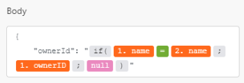

# SharePoint modules

In a *Adobe Workfront Fusion* scenario, you can connect your *SharePoint* account to multiple third-party applications and services.

If you need instructions on creating a scenario, see [Create a scenario](../../workfront-fusion/scenarios/create-a-scenario.md).

For information about modules, see [Modules in Adobe Workfront Fusion](../../workfront-fusion/modules/modules.md).

## Access requirements

You must have the following access to use the functionality in this article:

<table cellspacing="0"> 
 <col> 
 <col> 
 <tbody> 
  <tr> 
   <td role="rowheader"><em>Adobe Workfront</em> plan*</td> 
   <td> <p><em>Pro</em> or higher</p> </td> 
  </tr> <draft-comment>
   <tr data-mc-conditions=""> 
    <td role="rowheader"><em>Adobe Workfront</em> license*</td> 
    <td> <p>Plan, Work</p> </td> 
   </tr>
  </draft-comment>
  <tr data-mc-conditions=""> 
   <td role="rowheader"><em>Adobe Workfront</em> license*</td> 
   <td> <p>Plan, Work</p> </td> 
  </tr> 
  <tr> 
   <td role="rowheader"><em>Adobe Workfront Fusion</em> license**</td> 
   <td> <p><em>Workfront Fusion for Work Automation and Integration</em> </p> </td> 
  </tr> 
  <tr> 
   <td role="rowheader">Product</td> 
   <td>Your organization must purchase <em>Adobe Workfront Fusion</em> as well as <em>Adobe Workfront</em> to use functionality described in this article.</td> 
  </tr> <draft-comment>
   <tr data-mc-conditions="QuicksilverOrClassic.Draft mode"> 
    <td role="rowheader">Access level configurations*</td> 
    <td> <draft-comment>
      <p data-mc-conditions="QuicksilverOrClassic.Draft mode">You must be a <em>Workfront Fusion</em> administrator for your organization.</p>
     </draft-comment><p data-mc-conditions="QuicksilverOrClassic.Draft mode">You must be a <em>Workfront Fusion</em> administrator for your organization.</p> <draft-comment>
      <p data-mc-conditions="QuicksilverOrClassic.Draft mode">You must be a <em>Workfront Fusion</em> administrator for your team.</p>
     </draft-comment><p data-mc-conditions="QuicksilverOrClassic.Draft mode">You must be a <em>Workfront Fusion</em> administrator for your team.</p> </td> 
   </tr>
  </draft-comment>
  <tr data-mc-conditions="QuicksilverOrClassic.Draft mode"> 
   <td role="rowheader">Access level configurations*</td> 
   <td> <p data-mc-conditions="QuicksilverOrClassic.Draft mode">You must be a <em>Workfront Fusion</em> administrator for your organization.</p> <p data-mc-conditions="QuicksilverOrClassic.Draft mode">You must be a <em>Workfront Fusion</em> administrator for your team.</p> </td> 
  </tr> 
 </tbody> 
</table>

&#42;To find out what plan, license type, or access you have, contact your *Workfront administrator*.

&#42;&#42;For information on *Adobe Workfront Fusion* licenses, see [Adobe Workfront Fusion licenses](../../workfront-fusion/get-started/license-automation-vs-integration.md)

## Prerequisites

To use SharePoint modules, you must have a SharePoint account.

## Connect SharePoint to *Workfront Fusion*

* [Connect SharePoint to Workfront Fusion using a Microsoft account](#connect2) 
* [Connect SharePoint to Workfront Fusion using advanced settings](#connect3)

### Connect SharePoint to *Workfront Fusion* using a Microsoft account

You can use your Microsoft account to create a connection to SharePoint. For instructions about connecting your *Sharepoint* account to *Workfront Fusion*, see [Create a connection to Workfront Fusion - Basic instructions](../../workfront-fusion/connections/connect-to-fusion-general.md)

### Connect SharePoint to *Workfront Fusion* using advanced settings

To connect SharePoint to *Workfront Fusion* without a Microsoft account, you need a Client ID, Client Secret, and Tenant ID.

1. Click `Add` near the top of the `SharePoint` box to open the `Create a connection` box.

1. (Optional) Change the default `Connection name`.
1. Click `Show advanced settings`.
1. Enter the SharePoint `Client ID` and `Client Secret`.

1. Click `Continue`.
1. In the sign-in window that displays, enter your credentials to log in to the app if you haven't already done so.
1. (Conditional) If an `Allow` button displays, click the button to connect the app to *Workfront Fusion*.

## SharePoint modules and their fields

When you configure *SharePoint* modules, *Workfront Fusion* displays the fields listed below. Along with these, additional *SharePoint* fields might display, depending on factors such as your access level in the app or service. A bolded title in a module indicates a required field.

If you see the map button above a field or function, you can use it to set variables and functions for that field. For more information, see [Map information from one module to another](../../workfront-fusion/mapping/map-information-between-modules.md).


* [Item](#item) 
* [List](#list) 
* [Page (Beta)](#page) 
* [Site](#site) 
* [Other](#other)

### Item

* [Watch Items](#watch2) 
* [List Items](#list2) 
* [Get an Item](#get) 
* [Create an item](#create3) 
* [Update an item](#update2) 
* [Delete an item](#delete2)

#### Watch Items

This trigger module starts a scenario when an item is created or modified.

<table cellspacing="0"> 
 <col> 
 <col> 
 <tbody> 
  <tr> 
   <td role="rowheader">Connection</td> 
   <td> <p>For instructions about connecting your <em>SharePoint</em> account to <em>Workfront Fusion</em>, see <a href="#connect" class="MCXref xref" data-mc-variable-override="">Connect SharePoint to Workfront Fusion</a> in this article.</p> </td> 
  </tr> 
  <tr> 
   <td role="rowheader">Watch Lists</td> 
   <td>Select whether you want to watch lists by creation time (new items) or by modification time (updated items).</td> 
  </tr> 
  <tr> 
   <td role="rowheader">Enter Site and List ID</td> 
   <td> <p>Select how you want to identify the site and list that you want to watch.</p> 
    <ul> 
     <li> <p><span class="bold">Enter manually</span> </p> <p>Enter or map the <span class="bold">Site ID</span> and <span class="bold">List ID</span>&nbsp;in the fields that appear.</p> </li> 
     <li> <p><span class="bold">Select from the list that you follow</span> </p> <p>Select the site that you want to watch, then select the list. These drop-downs only retrieve followed sites.</p> </li> 
    </ul> </td> 
  </tr> 
  <tr> 
   <td role="rowheader">Limit</td> 
   <td> <p>Enter or map the maximum number of <em>item</em>s you want the module to <em>return</em> during each scenario execution cycle.</p> </td> 
  </tr> 
 </tbody> 
</table>

#### List Items

This action module retrieves a list of all items in a specified list.

<table cellspacing="0"> 
 <col> 
 <col> 
 <tbody> 
  <tr> 
   <td role="rowheader">Connection</td> 
   <td> <p>For instructions about connecting your <em>SharePoint</em> account to <em>Workfront Fusion</em>, see <a href="#connect" class="MCXref xref" data-mc-variable-override="">Connect SharePoint to Workfront Fusion</a> in this article.</p> </td> 
  </tr> 
  <tr> 
   <td role="rowheader">List Items</td> 
   <td> <p>Select how you want to identify the list that you want to retrieve items from.</p> 
    <ul> 
     <li> <p><span class="bold">Enter manually</span> </p> <p>Enter or map the <span class="bold">Site ID</span> and <span class="bold">List ID</span>&nbsp;in the fields that appear.</p> </li> 
     <li> <p><span class="bold">Select from the list</span> </p> <p>Select the site that contains the list you want to retrieve items from, then select the list. </p> </li> 
    </ul> </td> 
  </tr> 
  <tr> 
   <td role="rowheader">Limit</td> 
   <td> <p>Enter or map the maximum number of <em>item</em>s you want the module to <em>return</em> during each scenario execution cycle.</p> </td> 
  </tr> 
 </tbody> 
</table>

#### Get an Item

This action module returns the data of a specified item.

<table cellspacing="0"> 
 <col> 
 <col> 
 <tbody> 
  <tr> 
   <td role="rowheader">Connection</td> 
   <td> <p>For instructions about connecting your <em>SharePoint</em> account to <em>Workfront Fusion</em>, see <a href="#connect" class="MCXref xref" data-mc-variable-override="">Connect SharePoint to Workfront Fusion</a> in this article.</p> </td> 
  </tr> 
  <tr> 
   <td role="rowheader">Get an Item</td> 
   <td> <p>Select how you want to identify the site and list that contain the item you want to get.</p> 
    <ul> 
     <li> <p><span class="bold">Enter manually</span> </p> <p>Enter or map the <span class="bold">Site ID</span>, <span class="bold">List ID</span>,&nbsp;and <span class="bold">Item ID</span> in the fields that appear.</p> </li> 
     <li> <p><span class="bold">Select from the list</span> </p> <p>Select the site that contains the list you want to retrieve an item from, then select the list, then select the item. </p> </li> 
    </ul> </td> 
  </tr> 
 </tbody> 
</table>

#### Create an item

This action module creates a new item in a SharePoint list.

<table cellspacing="0"> 
 <col> 
 <col> 
 <tbody> 
  <tr> 
   <td role="rowheader">Connection</td> 
   <td> <p>For instructions about connecting your <em>SharePoint</em> account to <em>Workfront Fusion</em>, see <a href="#connect" class="MCXref xref" data-mc-variable-override="">Connect SharePoint to Workfront Fusion</a> in this article.</p> </td> 
  </tr> 
  <tr> 
   <td role="rowheader">Create an Item</td> 
   <td> <p>Select how you want to identify the site and list where you want to create an item.</p> 
    <ul> 
     <li> <p><span class="bold">Enter manually</span> </p> <p>Enter or map the <span class="bold">Site ID</span> and <span class="bold">List ID</span> in the fields that appear.</p> </li> 
     <li> <p><span class="bold">Select from the list</span> </p> <p>Select the site that contains the list where you want to create an item, then select the list. </p> </li> 
    </ul> </td> 
  </tr> 
  <tr> 
   <td role="rowheader">Fields</td> 
   <td>For each field that you want to set for the new item, enter the field's key (identifies the field), and the value that you want the new item to have for that field.</td> 
  </tr> 
 </tbody> 
</table>

#### Update an item

This action module updates an existing item in a SharePoint list.

<table cellspacing="0"> 
 <col> 
 <col> 
 <tbody> 
  <tr> 
   <td role="rowheader">Connection</td> 
   <td> <p>For instructions about connecting your <em>SharePoint</em> account to <em>Workfront Fusion</em>, see <a href="#connect" class="MCXref xref" data-mc-variable-override="">Connect SharePoint to Workfront Fusion</a> in this article.</p> </td> 
  </tr> 
  <tr> 
   <td role="rowheader">Update an Item</td> 
   <td> <p>Select how you want to identify the site and list that contain the item you want to update.</p> 
    <ul> 
     <li> <p><span class="bold">Enter manually</span> </p> <p>Enter or map the <span class="bold">Site ID</span>, <span class="bold">List ID</span>,&nbsp;and <span class="bold">Item ID</span> in the fields that appear.</p> </li> 
     <li> <p><span class="bold">Select from the list</span> </p> <p>Select the site that contains the item you want to update, then select the list, then select the item. </p> </li> 
    </ul> </td> 
  </tr> 
  <tr> 
   <td role="rowheader">Fields</td> 
   <td>For each field that you want to update for the new item, enter the field's key (identifies the field), and the new value that you want the item to have for that field.</td> 
  </tr> 
 </tbody> 
</table>

#### Delete an item

This action module deletes an existing item in a SharePoint list.

<table cellspacing="0"> 
 <col> 
 <col> 
 <tbody> 
  <tr> 
   <td role="rowheader">Connection</td> 
   <td> <p>For instructions about connecting your <em>SharePoint</em> account to <em>Workfront Fusion</em>, see <a href="#connect" class="MCXref xref" data-mc-variable-override="">Connect SharePoint to Workfront Fusion</a> in this article.</p> </td> 
  </tr> 
  <tr> 
   <td role="rowheader">Update an Item</td> 
   <td> <p>Select how you want to identify the site and list that contain the item you want to delete.</p> 
    <ul> 
     <li> <p><span class="bold">Enter manually</span> </p> <p>Enter or map the <span class="bold">Site ID</span>, <span class="bold">List ID</span>,&nbsp;and <span class="bold">Item ID</span> in the fields that appear.</p> </li> 
     <li> <p><span class="bold">Select from the list</span> </p> <p>Select the site that contains the item you want to delete, then select the list, then select the item. </p> </li> 
    </ul> </td> 
  </tr> 
 </tbody> 
</table>

### List

* [Watch Lists](#watch3) 
* [List Lists](#list3) 
* [Get a List](#get2) 
* [Create a List](#create4)

#### Watch Lists

This trigger module starts a scenario when a list is created or modified.

<table cellspacing="0"> 
 <col> 
 <col> 
 <tbody> 
  <tr> 
   <td role="rowheader">Connection</td> 
   <td> <p>For instructions about connecting your <em>SharePoint</em> account to <em>Workfront Fusion</em>, see <a href="#connect" class="MCXref xref" data-mc-variable-override="">Connect SharePoint to Workfront Fusion</a> in this article.</p> </td> 
  </tr> 
  <tr> 
   <td role="rowheader">Watch Lists</td> 
   <td>Select whether you want to watch lists by creation time (new items) or by modification time (updated items).</td> 
  </tr> 
  <tr> 
   <td role="rowheader">Enter Site and List ID</td> 
   <td> <p>Select how you want to identify the site and list that you want to watch.</p> 
    <ul> 
     <li> <p><span class="bold">Enter manually</span> </p> <p>Enter or map the <span class="bold">Site ID</span> where the list you want to watch is located.</p> </li> 
     <li> <p><span class="bold">Select from the list that you follow</span> </p> <p>Select the site that you want to watch. The drop-down only retrieves site you follow.</p> </li> 
    </ul> </td> 
  </tr> 
  <tr> 
   <td role="rowheader">Limit</td> 
   <td> <p>Enter or map the maximum number of <em>list</em>s you want the module to <em>return</em> during each scenario execution cycle.</p> </td> 
  </tr> 
 </tbody> 
</table>

#### List Lists

This action module retrieves a list of all items in a specified list.

<table cellspacing="0"> 
 <col> 
 <col> 
 <tbody> 
  <tr> 
   <td role="rowheader">Connection</td> 
   <td> <p>For instructions about connecting your <em>SharePoint</em> account to <em>Workfront Fusion</em>, see <a href="#connect" class="MCXref xref" data-mc-variable-override="">Connect SharePoint to Workfront Fusion</a> in this article.</p> </td> 
  </tr> 
  <tr> 
   <td role="rowheader">List Lists</td> 
   <td> <p>Select how you want to identify the site that you want to retrieve lists from.</p> 
    <ul> 
     <li> <p><span class="bold">Enter manually</span> </p> <p>Enter or map the <span class="bold">Site ID</span>.</p> </li> 
     <li> <p><span class="bold">Select from the list</span> </p> <p>Select the site that contains the lists you want to retrieve. The drop-down retrieves only sites you follow.</p> </li> 
    </ul> </td> 
  </tr> 
  <tr> 
   <td role="rowheader">Limit</td> 
   <td> <p>Enter or map the maximum number of <em>list</em>s you want the module to <em>return</em> during each scenario execution cycle.</p> </td> 
  </tr> 
 </tbody> 
</table>

#### Get a List

This action module returns the data of a specified list.

<table cellspacing="0"> 
 <col> 
 <col> 
 <tbody> 
  <tr> 
   <td role="rowheader">Connection</td> 
   <td> <p>For instructions about connecting your <em>SharePoint</em> account to <em>Workfront Fusion</em>, see <a href="#connect" class="MCXref xref" data-mc-variable-override="">Connect SharePoint to Workfront Fusion</a> in this article.</p> </td> 
  </tr> 
  <tr> 
   <td role="rowheader">Get a List</td> 
   <td> <p>Select how you want to identify the site and list that contain the item you want to get.</p> 
    <ul> 
     <li> <p><span class="bold">Enter manually</span> </p> <p>Enter or map the <span class="bold">Site ID</span> and <span class="bold">List ID</span> in the fields that appear.</p> </li> 
     <li> <p><span class="bold">Select from the list</span> </p> <p>Select the site that contains the list you want to retrieve, then select the list. </p> </li> 
    </ul> </td> 
  </tr> 
 </tbody> 
</table>

#### Create a List

This action module creates a new list in SharePoint.

<table cellspacing="0"> 
 <col> 
 <col> 
 <tbody> 
  <tr> 
   <td role="rowheader">Connection</td> 
   <td> <p>For instructions about connecting your <em>SharePoint</em> account to <em>Workfront Fusion</em>, see <a href="#connect" class="MCXref xref" data-mc-variable-override="">Connect SharePoint to Workfront Fusion</a> in this article.</p> </td> 
  </tr> 
  <tr> 
   <td role="rowheader">Enter a Site ID</td> 
   <td> <p>Select how you want to identify the site and list where you want to create a list.</p> 
    <ul> 
     <li> <p><span class="bold">Enter manually</span> </p> <p>Enter or map the <span class="bold">Site ID</span> where you want to create a list.</p> </li> 
     <li> <p><span class="bold">Select from the list</span> </p> <p>Select the site where you want to create a list. </p> </li> 
    </ul> </td> 
  </tr> 
  <tr> 
   <td role="rowheader">Display Name</td> 
   <td>Enter or map a name for the new list.</td> 
  </tr> 
  <tr> 
   <td role="rowheader">Description</td> 
   <td>Enter or map a description for the new list.</td> 
  </tr> 
  <tr> 
   <td role="rowheader">Add Columns</td> 
   <td>For each column that you want to set for the new list, enter a <span class="bold">Name </span>for the field, and select the <span class="bold">Type </span>of value that you want the new column to have.</td> 
  </tr> 
 </tbody> 
</table>

### Page (Beta)

>[!NOTE]
>
>APIs in the >
>```>
>beta
>```>
>version in Microsoft Graph are subject to change. The use of these APIs in production applications is not supported.

#### Get a Page

This action module returns the data of a specified page.

<table cellspacing="0"> 
 <col> 
 <col> 
 <tbody> 
  <tr> 
   <td role="rowheader">Connection</td> 
   <td> <p>For instructions about connecting your <em>SharePoint</em> account to <em>Workfront Fusion</em>, see <a href="#connect" class="MCXref xref" data-mc-variable-override="">Connect SharePoint to Workfront Fusion</a> in this article.</p> </td> 
  </tr> 
  <tr> 
   <td role="rowheader">Get a Page</td> 
   <td> <p>Select how you want to identify the page that you want to retrieve.</p> 
    <ul> 
     <li> <p><span class="bold">Enter manually</span> </p> <p>Enter or map the <span class="bold">Site ID</span>and <span class="bold">Page ID</span>.</p> </li> 
     <li> <p><span class="bold">Select from the list</span> </p> <p>Select the site that contains the page you want to retrieve, then select the page.</p> </li> 
    </ul> </td> 
  </tr> 
 </tbody> 
</table>

### Site

* [Search Sites](#search2) 
* [Get a Site](#get3)

#### Search Sites

This action module searches for sites by a parameter you specify.

<table cellspacing="0"> 
 <col> 
 <col> 
 <tbody> 
  <tr> 
   <td role="rowheader">Connection</td> 
   <td> <p>For instructions about connecting your <em>SharePoint</em> account to <em>Workfront Fusion</em>, see <a href="#connect" class="MCXref xref" data-mc-variable-override="">Connect SharePoint to Workfront Fusion</a> in this article.</p> </td> 
  </tr> 
  <tr> 
   <td role="rowheader">Keyword of Display Name</td> 
   <td> <p>Enter or map the search term that you want to search the sites for.</p> </td> 
  </tr> 
  <tr> 
   <td role="rowheader">Limit</td> 
   <td> <p>Enter or map the maximum number of <em>site</em>s you want the module to <em>return</em> during each scenario execution cycle.</p> </td> 
  </tr> 
 </tbody> 
</table>

#### Get a Site

This action module returns the data of a specified site.

<table cellspacing="0"> 
 <col> 
 <col> 
 <tbody> 
  <tr> 
   <td role="rowheader">Connection</td> 
   <td> <p>For instructions about connecting your <em>SharePoint</em> account to <em>Workfront Fusion</em>, see <a href="#connect" class="MCXref xref" data-mc-variable-override="">Connect SharePoint to Workfront Fusion</a> in this article.</p> </td> 
  </tr> 
  <tr> 
   <td role="rowheader">Get a Site</td> 
   <td> <p>Select how you want to identify the page that you want to retrieve.</p> 
    <ul> 
     <li> <p><span class="bold">Enter manually</span> </p> <p>Enter or map the <span class="bold">Site ID</span>..</p> </li> 
     <li> <p><span class="bold">Select from the list</span> </p> <p>Select the site that you want to retrieve.</p> </li> 
    </ul> </td> 
  </tr> 
 </tbody> 
</table>

### Other

#### Make an API&nbsp;Call

This module allows you to perform a custom API call.

<table cellspacing="0"> 
 <col> 
 <col> 
 <tbody> 
  <tr> 
   <td role="rowheader">Connection</td> 
   <td> <p>For instructions about connecting your <em>SharePoint</em> account to <em>Workfront Fusion</em>, see <a href="#connect" class="MCXref xref" data-mc-variable-override="">Connect SharePoint to Workfront Fusion</a> in this article.</p> </td> 
  </tr> 
  <tr> 
   <td role="rowheader"> <p>URL</p> </td> 
   <td> <p>Enter a path relative to <code>https://graph.microsoft.com</code>. Example:<code> /beta/sites</code></p> </td> 
  </tr> 
  <tr> 
   <td role="rowheader"> <p>Method</p> </td> 
   <td> <p>Select the HTTP request method you need to configure the API call. For more information, see <a href="../../workfront-fusion/modules/http-request-methods.md" class="MCXref xref" data-mc-variable-override="">HTTP request methods</a>.</p> </td> 
  </tr> 
  <tr> 
   <td role="rowheader">Headers</td> 
   <td> <p>Add the headers of the request in the form of a standard JSON object.For example, <code>{"Content-type":"application/json"}</code>. <em>Workfront Fusion</em> adds the authorization headers for you.</p> </td> 
  </tr> 
  <tr> 
   <td role="rowheader">Query String</td> 
   <td> <p> Add the query for the API call in the form of a standard JSON object.</p> </td> 
  </tr> 
  <tr> 
   <td role="rowheader">Type</td> 
   <td>Select the type of data that you want to send in your API call.</td> 
  </tr> 
  <tr> 
   <td role="rowheader">Body</td> 
   <td> <p>Add the body content for the API call in the form of a standard JSON object.</p> <p>Note:  <p>When using conditional statements such as <code>if</code> in your JSON, put the quotation marks outside of the conditional statement.</p> 
     <div class="example" data-mc-autonum="<b>Example: </b>"> 
      <p>  </p> 
     </div> </p> </td> 
  </tr> 
 </tbody> 
</table>

&nbsp;

<!--
<div data-mc-conditions="QuicksilverOrClassic.Draft mode">
<ul>
<li><a href="#watch" class="MCXref xref">Watch Records</a> </li>
<li><a href="#create" class="MCXref xref">Create a folder</a> </li>
<li><a href="#create2" class="MCXref xref">Create an item</a> </li>
<li><a href="#delete" class="MCXref xref">Delete an item</a> </li>
<li><a href="#download" class="MCXref xref">Download a file</a> </li>
<li><a href="#read" class="MCXref xref">Read a document</a> </li>
<li><a href="#read2" class="MCXref xref">Read an item</a> </li>
<li><a href="#update" class="MCXref xref">Update an item</a> </li>
<li><a href="#upload" class="MCXref xref">Upload a file</a> </li>
<li><a href="#search" class="MCXref xref">Search Documents</a> </li>
</ul>
<h3><a name="Watch"></a>Watch Records</h3>
<p>This trigger module executes a scenario when the scheduled poll shows that an object has been added or updated in SharePoint. The module returns all standard fields associated with the record or records, along with any custom fields and values that the connection accesses.You can map <em>this information</em> in subsequent modules in the scenario.This trigger module executes a scenario when <em>an object is added or updated</em><draft-comment>
<MadCap:conditionalText data-mc-conditions="SnippetConditions.HIDE">
in
<em>SharePoint</em>
</MadCap:conditionalText>
</draft-comment><MadCap:conditionalText data-mc-conditions="SnippetConditions.HIDE">
in
<em>SharePoint</em>
</MadCap:conditionalText>. The module <em>returns all standard fields associated with the record or records, along with any custom fields and values that the connection accesses</em>. You can map <em>this information</em> in subsequent modules in the scenario. This is a scheduled trigger module.</p>
<p>When you are configuring this module, the following fields display<draft-comment>
<MadCap:conditionalText data-mc-conditions="SnippetConditions.HIDE">
, along with any other available
<em>SharePoint</em> fields, depending on the connection and options you choose
</MadCap:conditionalText>
</draft-comment><MadCap:conditionalText data-mc-conditions="SnippetConditions.HIDE">
, along with any other available
<em>SharePoint</em> fields, depending on the connection and options you choose
</MadCap:conditionalText>.</p>
<table cellspacing="0">
<col>
<col>
<tbody>
<tr>
<td role="rowheader">Connection</td>
<td> <p>For instructions about connecting your <em>SharePoint</em> account to <em>Workfront Fusion</em>, see <a href="#connect" class="MCXref xref" data-mc-variable-override="">Connect SharePoint to Workfront Fusion</a> in this article.</p> </td>
</tr>
<tr>
<td role="rowheader">Record Type</td>
<td>Select the type of <em>SharePoint</em> record that you want the module to <em>watch</em>.</td>
</tr>
<tr>
<td role="rowheader">Site</td>
<td>Select the site that you want the module to watch.</td>
</tr>
<tr>
<td role="rowheader">Event types</td>
<td>Select whether you want to watch for new records, updated records, or both.</td>
</tr>
<tr>
<td role="rowheader">Limit</td>
<td> <p>Enter or map the maximum number of <em>record</em>s you want the module to <em>watch</em> during each scenario execution cycle.</p> </td>
</tr>
</tbody>
</table>
<h3><a name="Create"></a>Create a folder</h3>
<p>This action module <em>creates a new folder</em><draft-comment>
<MadCap:conditionalText data-mc-conditions="SnippetConditions.HIDE">
in
<em>SharePoint</em>
</MadCap:conditionalText>
</draft-comment><MadCap:conditionalText data-mc-conditions="SnippetConditions.HIDE">
in
<em>SharePoint</em>
</MadCap:conditionalText>.</p>
<p>When you are configuring this module, the following fields display<draft-comment>
<MadCap:conditionalText data-mc-conditions="SnippetConditions.HIDE">
, along with any other available
<em>SharePoint</em> fields, depending on the connection and options you choose
</MadCap:conditionalText>
</draft-comment><MadCap:conditionalText data-mc-conditions="SnippetConditions.HIDE">
, along with any other available
<em>SharePoint</em> fields, depending on the connection and options you choose
</MadCap:conditionalText>.</p>
<table cellspacing="0">
<col>
<col>
<tbody>
<tr>
<td role="rowheader">Connection</td>
<td> <p>For instructions about connecting your <em>SharePoint</em> account to <em>Workfront Fusion</em>, see <a href="#connect" class="MCXref xref" data-mc-variable-override="">Connect SharePoint to Workfront Fusion</a> in this article.</p> </td>
</tr>
<tr>
<td role="rowheader">Site</td>
<td>Select the location where you want to create a folder.</td>
</tr>
<tr>
<td role="rowheader">List</td>
<td>Select the list that you want to create a folder in.</td>
</tr>
<tr>
<td role="rowheader">Parent Folder</td>
<td>Select the folder that you want to create the new folder in.</td>
</tr>
<tr>
<td role="rowheader">Name</td>
<td>Enter or map a name for the new folder.</td>
</tr>
</tbody>
</table>
<h3><a name="Create2"></a>Create an item</h3>
<p>This action module creates a new item in a SharePoint list.</p>
<p>The module returns the ID of the new item and any associated fields, along with any custom fields and values that the connection accesses. You can map <em>this information</em> in subsequent modules in the scenario.</p>
<p>When you are configuring this module, the following fields display<draft-comment>
<MadCap:conditionalText data-mc-conditions="SnippetConditions.HIDE">
, along with any other available
<em>SharePoint</em> fields, depending on the connection and options you choose
</MadCap:conditionalText>
</draft-comment><MadCap:conditionalText data-mc-conditions="SnippetConditions.HIDE">
, along with any other available
<em>SharePoint</em> fields, depending on the connection and options you choose
</MadCap:conditionalText>.</p>
<table cellspacing="0">
<col>
<col>
<tbody>
<tr>
<td role="rowheader">Connection</td>
<td> <p>For instructions about connecting your <em>SharePoint</em> account to <em>Workfront Fusion</em>, see <a href="#connect" class="MCXref xref" data-mc-variable-override="">Connect SharePoint to Workfront Fusion</a> in this article.</p> </td>
</tr>
<tr>
<td role="rowheader">Site</td>
<td>Select the location where you want to create an item.</td>
</tr>
<tr>
<td role="rowheader">List</td>
<td>Select the list that you want to create a new item in.</td>
</tr>
<tr>
<td role="rowheader">Title</td>
<td>Enter or map a title for the new item.</td>
</tr>
</tbody>
</table>
<h3><a name="Delete"></a>Delete an item</h3>
<p>This action module <em>deletes an item that you identify</em><draft-comment>
<MadCap:conditionalText data-mc-conditions="SnippetConditions.HIDE">
in
<em>SharePoint</em>
</MadCap:conditionalText>
</draft-comment><MadCap:conditionalText data-mc-conditions="SnippetConditions.HIDE">
in
<em>SharePoint</em>
</MadCap:conditionalText>.</p>
<p>When you are configuring this module, the following fields display<draft-comment>
<MadCap:conditionalText data-mc-conditions="SnippetConditions.HIDE">
, along with any other available
<em>SharePoint</em> fields, depending on the connection and options you choose
</MadCap:conditionalText>
</draft-comment><MadCap:conditionalText data-mc-conditions="SnippetConditions.HIDE">
, along with any other available
<em>SharePoint</em> fields, depending on the connection and options you choose
</MadCap:conditionalText>.</p>
<table cellspacing="0">
<col>
<col>
<tbody>
<tr>
<td role="rowheader">Connection</td>
<td> <p>For instructions about connecting your <em>SharePoint</em> account to <em>Workfront Fusion</em>, see <a href="#connect" class="MCXref xref" data-mc-variable-override="">Connect SharePoint to Workfront Fusion</a> in this article.</p> </td>
</tr>
<tr>
<td role="rowheader">Site</td>
<td>Select the location of the item you want to delete.</td>
</tr>
<tr>
<td role="rowheader">List</td>
<td>Select the list where the item you want to delete is located.</td>
</tr>
<tr>
<td role="rowheader">Item ID</td>
<td>Enter or map a the ID of the item you want to delete.</td>
</tr>
</tbody>
</table>
<h3><a name="Download"></a>Download a file</h3>
<p>This action module downloads a file from a SharePoint drive.</p>
<p>You specify the<draft-comment>
<MadCap:conditionalText data-mc-conditions="SnippetConditions.HIDE">
type and
</MadCap:conditionalText>
</draft-comment><MadCap:conditionalText data-mc-conditions="SnippetConditions.HIDE">
type and
</MadCap:conditionalText> ID of the <em>file</em>.</p>
<p>The module returns the file's content, filename, file extension, and file size. You can map <em>this information</em> in subsequent modules in the scenario.</p>
<p>When you are configuring this module, the following fields display<draft-comment>
<MadCap:conditionalText data-mc-conditions="SnippetConditions.HIDE">
, along with any other available
<em>SharePoint</em> fields, depending on the connection and options you choose
</MadCap:conditionalText>
</draft-comment><MadCap:conditionalText data-mc-conditions="SnippetConditions.HIDE">
, along with any other available
<em>SharePoint</em> fields, depending on the connection and options you choose
</MadCap:conditionalText>.</p>
<table cellspacing="0">
<col>
<col>
<tbody>
<tr>
<td role="rowheader">Connection</td>
<td> <p>For instructions about connecting your <em>SharePoint</em> account to <em>Workfront Fusion</em>, see <a href="#connect" class="MCXref xref" data-mc-variable-override="">Connect SharePoint to Workfront Fusion</a> in this article.</p> </td>
</tr>
<tr>
<td role="rowheader">Site</td>
<td>Select the location of the file you want to download.</td>
</tr>
<tr>
<td role="rowheader">List</td>
<td>Select the list where the file you want to download is located.</td>
</tr>
<tr>
<td role="rowheader">File ID</td>
<td>Enter or map a the ID of the file you want to download .</td>
</tr>
</tbody>
</table>
<h3><a name="Read"></a>Read a document</h3>
<p>This action module reads a single document and returns a bundle of the document's fields.</p>
<p>When you are configuring this module, the following fields display<draft-comment>
<MadCap:conditionalText data-mc-conditions="SnippetConditions.HIDE">
, along with any other available
<em>SharePoint</em> fields, depending on the connection and options you choose
</MadCap:conditionalText>
</draft-comment><MadCap:conditionalText data-mc-conditions="SnippetConditions.HIDE">
, along with any other available
<em>SharePoint</em> fields, depending on the connection and options you choose
</MadCap:conditionalText>.</p>
<table cellspacing="0">
<col>
<col>
<tbody>
<tr>
<td role="rowheader">Connection</td>
<td> <p>For instructions about connecting your <em>SharePoint</em> account to <em>Workfront Fusion</em>, see <a href="#connect" class="MCXref xref" data-mc-variable-override="">Connect SharePoint to Workfront Fusion</a> in this article.</p> </td>
</tr>
<tr>
<td role="rowheader">Site</td>
<td>Select the location of the document you want to read.</td>
</tr>
<tr>
<td role="rowheader">List</td>
<td>Select the list where the document you want to read is located.</td>
</tr>
<tr>
<td role="rowheader">File ID</td>
<td>Enter or map the ID of the document you want to read.</td>
</tr>
</tbody>
</table>
<h3><a name="Read2"></a>Read an item</h3>
<p>This action module reads a single item and returns a bundle of the item's fields.</p>
<p>When you are configuring this module, the following fields display<draft-comment>
<MadCap:conditionalText data-mc-conditions="SnippetConditions.HIDE">
, along with any other available
<em>SharePoint</em> fields, depending on the connection and options you choose
</MadCap:conditionalText>
</draft-comment><MadCap:conditionalText data-mc-conditions="SnippetConditions.HIDE">
, along with any other available
<em>SharePoint</em> fields, depending on the connection and options you choose
</MadCap:conditionalText>.</p>
<table cellspacing="0">
<col>
<col>
<tbody>
<tr>
<td role="rowheader">Connection</td>
<td> <p>For instructions about connecting your <em>SharePoint</em> account to <em>Workfront Fusion</em>, see <a href="#connect" class="MCXref xref" data-mc-variable-override="">Connect SharePoint to Workfront Fusion</a> in this article.</p> </td>
</tr>
<tr>
<td role="rowheader">Site</td>
<td>Select the location of the item you want to read.</td>
</tr>
<tr>
<td role="rowheader">List</td>
<td>Select the list where the item you want to read is located.</td>
</tr>
<tr>
<td role="rowheader">Item ID</td>
<td>Enter or map a the ID of the item you want to read.</td>
</tr>
</tbody>
</table>
<h3><a name="Update"></a>Update an item</h3>
<p>This action module updates an existing item in a SharePoint list.</p>
<p>When you are configuring this module, the following fields display<draft-comment>
<MadCap:conditionalText data-mc-conditions="SnippetConditions.HIDE">
, along with any other available
<em>SharePoint</em> fields, depending on the connection and options you choose
</MadCap:conditionalText>
</draft-comment><MadCap:conditionalText data-mc-conditions="SnippetConditions.HIDE">
, along with any other available
<em>SharePoint</em> fields, depending on the connection and options you choose
</MadCap:conditionalText>.</p>
<table cellspacing="0">
<col>
<col>
<tbody>
<tr>
<td role="rowheader">Connection</td>
<td> <p>For instructions about connecting your <em>SharePoint</em> account to <em>Workfront Fusion</em>, see <a href="#connect" class="MCXref xref" data-mc-variable-override="">Connect SharePoint to Workfront Fusion</a> in this article.</p> </td>
</tr>
<tr>
<td role="rowheader">Site</td>
<td>Select the location of the item you want to update.</td>
</tr>
<tr>
<td role="rowheader">List</td>
<td>Select the list where the item you want to update is located.</td>
</tr>
<tr>
<td role="rowheader">Item ID</td>
<td>Enter or map a the ID of the item you want to update.</td>
</tr>
</tbody>
</table>
<h3><a name="Upload"></a>Upload a file</h3>
<p>This action module uploads a file to SharePoint</p>
<p>You specify the location for the file, the file you want to upload, and an optional new name for the file.</p>
<p>The module returns the ID of the <draft-comment>
<MadCap:conditionalText data-mc-conditions="SnippetConditions.HIDE">
<em>uploaded</em>
</MadCap:conditionalText>
</draft-comment><MadCap:conditionalText data-mc-conditions="SnippetConditions.HIDE">
<em>uploaded</em>
</MadCap:conditionalText> <em>file</em> and any associated fields, along with any custom fields and values that the connection accesses. You can map <em>this information</em> in subsequent modules in the scenario.</p>
<p>When you are configuring this module, the following fields display<draft-comment>
<MadCap:conditionalText data-mc-conditions="SnippetConditions.HIDE">
, along with any other available
<em>SharePoint</em> fields, depending on the connection and options you choose
</MadCap:conditionalText>
</draft-comment><MadCap:conditionalText data-mc-conditions="SnippetConditions.HIDE">
, along with any other available
<em>SharePoint</em> fields, depending on the connection and options you choose
</MadCap:conditionalText>.</p>
<table cellspacing="0">
<col>
<col>
<tbody>
<tr>
<td role="rowheader">Connection</td>
<td> <p>For instructions about connecting your <em>SharePoint</em> account to <em>Workfront Fusion</em>, see <a href="#connect" class="MCXref xref" data-mc-variable-override="">Connect SharePoint to Workfront Fusion</a> in this article.</p> </td>
</tr>
<tr>
<td role="rowheader">Site</td>
<td>Select the location where you want to upload a file.</td>
</tr>
<tr>
<td role="rowheader">List</td>
<td>Select the list that you want to upload a file to.</td>
</tr>
<tr>
<td role="rowheader">Parent Folder</td>
<td>Select the folder that you want to upload a file to.</td>
</tr>
<tr>
<td role="rowheader">Source File</td>
<td>Select whether the source file is empty, link a source file from a previous module, or map the source file's name and data.</td>
</tr>
</tbody>
</table>
<h3><a name="Search"></a>Search Documents</h3>
<p>This search module searches for a file or folder inside a SharePoint drive.</p>
<table cellspacing="0">
<col>
<col>
<tbody>
<tr>
<td role="rowheader">Connection</td>
<td> <p>For instructions about connecting your <em>SharePoint</em> account to <em>Workfront Fusion</em>, see <a href="#connect" class="MCXref xref" data-mc-variable-override="">Connect SharePoint to Workfront Fusion</a> in this article.</p> </td>
</tr>
<tr>
<td role="rowheader">Site</td>
<td>Select the location where you want to search for documents.</td>
</tr>
<tr>
<td role="rowheader">List</td>
<td>Select the list where you want to search for documents.</td>
</tr>
<tr>
<td role="rowheader">Search query</td>
<td>Enter the search query that determines which documents the module will return. </td>
</tr>
<tr>
<td role="rowheader">Limit</td>
<td>Set the maximum number of results to be worked with during one execution cycle.</td>
</tr>
</tbody>
</table>
</div>
-->

* [Watch Records](#watch) 
* [Create a folder](#create) 
* [Create an item](#create2) 
* [Delete an item](#delete) 
* [Download a file](#download) 
* [Read a document](#read) 
* [Read an item](#read2) 
* [Update an item](#update) 
* [Upload a file](#upload) 
* [Search Documents](#search)

### Watch Records

This trigger module executes a scenario when the scheduled poll shows that an object has been added or updated in SharePoint. The module returns all standard fields associated with the record or records, along with any custom fields and values that the connection accesses.You can map *this information* in subsequent modules in the scenario.This trigger module executes a scenario when *an object is added or updated*`<MadCap:conditionalText data-mc-conditions="SnippetConditions.HIDE">  in  <em>SharePoint</em></MadCap:conditionalText>`. The module *returns all standard fields associated with the record or records, along with any custom fields and values that the connection accesses*. You can map *this information* in subsequent modules in the scenario. This is a scheduled trigger module.

When you are configuring this module, the following fields display`<MadCap:conditionalText data-mc-conditions="SnippetConditions.HIDE"> , along with any other available  <em>SharePoint</em> fields, depending on the connection and options you choose</MadCap:conditionalText>`.

<table cellspacing="0"> 
 <col> 
 <col> 
 <tbody> 
  <tr> 
   <td role="rowheader">Connection</td> 
   <td> <p>For instructions about connecting your <em>SharePoint</em> account to <em>Workfront Fusion</em>, see <a href="#connect" class="MCXref xref" data-mc-variable-override="">Connect SharePoint to Workfront Fusion</a> in this article.</p> </td> 
  </tr> 
  <tr> 
   <td role="rowheader">Record Type</td> 
   <td>Select the type of <em>SharePoint</em> record that you want the module to <em>watch</em>.</td> 
  </tr> 
  <tr> 
   <td role="rowheader">Site</td> 
   <td>Select the site that you want the module to watch.</td> 
  </tr> 
  <tr> 
   <td role="rowheader">Event types</td> 
   <td>Select whether you want to watch for new records, updated records, or both.</td> 
  </tr> 
  <tr> 
   <td role="rowheader">Limit</td> 
   <td> <p>Enter or map the maximum number of <em>record</em>s you want the module to <em>watch</em> during each scenario execution cycle.</p> </td> 
  </tr> 
 </tbody> 
</table>

### Create a folder

This action module *creates a new folder*`<MadCap:conditionalText data-mc-conditions="SnippetConditions.HIDE">  in  <em>SharePoint</em></MadCap:conditionalText>`.

When you are configuring this module, the following fields display`<MadCap:conditionalText data-mc-conditions="SnippetConditions.HIDE"> , along with any other available  <em>SharePoint</em> fields, depending on the connection and options you choose</MadCap:conditionalText>`.

<table cellspacing="0"> 
 <col> 
 <col> 
 <tbody> 
  <tr> 
   <td role="rowheader">Connection</td> 
   <td> <p>For instructions about connecting your <em>SharePoint</em> account to <em>Workfront Fusion</em>, see <a href="#connect" class="MCXref xref" data-mc-variable-override="">Connect SharePoint to Workfront Fusion</a> in this article.</p> </td> 
  </tr> 
  <tr> 
   <td role="rowheader">Site</td> 
   <td>Select the location where you want to create a folder.</td> 
  </tr> 
  <tr> 
   <td role="rowheader">List</td> 
   <td>Select the list that you want to create a folder in.</td> 
  </tr> 
  <tr> 
   <td role="rowheader">Parent Folder</td> 
   <td>Select the folder that you want to create the new folder in.</td> 
  </tr> 
  <tr> 
   <td role="rowheader">Name</td> 
   <td>Enter or map a name for the new folder.</td> 
  </tr> 
 </tbody> 
</table>

### Create an item

This action module creates a new item in a SharePoint list.

The module returns the ID of the new item and any associated fields, along with any custom fields and values that the connection accesses. You can map *this information* in subsequent modules in the scenario.

When you are configuring this module, the following fields display`<MadCap:conditionalText data-mc-conditions="SnippetConditions.HIDE"> , along with any other available  <em>SharePoint</em> fields, depending on the connection and options you choose</MadCap:conditionalText>`.

<table cellspacing="0"> 
 <col> 
 <col> 
 <tbody> 
  <tr> 
   <td role="rowheader">Connection</td> 
   <td> <p>For instructions about connecting your <em>SharePoint</em> account to <em>Workfront Fusion</em>, see <a href="#connect" class="MCXref xref" data-mc-variable-override="">Connect SharePoint to Workfront Fusion</a> in this article.</p> </td> 
  </tr> 
  <tr> 
   <td role="rowheader">Site</td> 
   <td>Select the location where you want to create an item.</td> 
  </tr> 
  <tr> 
   <td role="rowheader">List</td> 
   <td>Select the list that you want to create a new item in.</td> 
  </tr> 
  <tr> 
   <td role="rowheader">Title</td> 
   <td>Enter or map a title for the new item.</td> 
  </tr> 
 </tbody> 
</table>

### Delete an item

This action module *deletes an item that you identify*`<MadCap:conditionalText data-mc-conditions="SnippetConditions.HIDE">  in  <em>SharePoint</em></MadCap:conditionalText>`.

When you are configuring this module, the following fields display`<MadCap:conditionalText data-mc-conditions="SnippetConditions.HIDE"> , along with any other available  <em>SharePoint</em> fields, depending on the connection and options you choose</MadCap:conditionalText>`.

<table cellspacing="0"> 
 <col> 
 <col> 
 <tbody> 
  <tr> 
   <td role="rowheader">Connection</td> 
   <td> <p>For instructions about connecting your <em>SharePoint</em> account to <em>Workfront Fusion</em>, see <a href="#connect" class="MCXref xref" data-mc-variable-override="">Connect SharePoint to Workfront Fusion</a> in this article.</p> </td> 
  </tr> 
  <tr> 
   <td role="rowheader">Site</td> 
   <td>Select the location of the item you want to delete.</td> 
  </tr> 
  <tr> 
   <td role="rowheader">List</td> 
   <td>Select the list where the item you want to delete is located.</td> 
  </tr> 
  <tr> 
   <td role="rowheader">Item ID</td> 
   <td>Enter or map a the ID of the item you want to delete.</td> 
  </tr> 
 </tbody> 
</table>

### Download a file

This action module downloads a file from a SharePoint drive.

You specify the`<MadCap:conditionalText data-mc-conditions="SnippetConditions.HIDE">  type and</MadCap:conditionalText>` ID of the *file*.

The module returns the file's content, filename, file extension, and file size. You can map *this information* in subsequent modules in the scenario.

When you are configuring this module, the following fields display`<MadCap:conditionalText data-mc-conditions="SnippetConditions.HIDE"> , along with any other available  <em>SharePoint</em> fields, depending on the connection and options you choose</MadCap:conditionalText>`.

<table cellspacing="0"> 
 <col> 
 <col> 
 <tbody> 
  <tr> 
   <td role="rowheader">Connection</td> 
   <td> <p>For instructions about connecting your <em>SharePoint</em> account to <em>Workfront Fusion</em>, see <a href="#connect" class="MCXref xref" data-mc-variable-override="">Connect SharePoint to Workfront Fusion</a> in this article.</p> </td> 
  </tr> 
  <tr> 
   <td role="rowheader">Site</td> 
   <td>Select the location of the file you want to download.</td> 
  </tr> 
  <tr> 
   <td role="rowheader">List</td> 
   <td>Select the list where the file you want to download is located.</td> 
  </tr> 
  <tr> 
   <td role="rowheader">File ID</td> 
   <td>Enter or map a the ID of the file you want to download .</td> 
  </tr> 
 </tbody> 
</table>

### Read a document

This action module reads a single document and returns a bundle of the document's fields.

When you are configuring this module, the following fields display`<MadCap:conditionalText data-mc-conditions="SnippetConditions.HIDE"> , along with any other available  <em>SharePoint</em> fields, depending on the connection and options you choose</MadCap:conditionalText>`.

<table cellspacing="0"> 
 <col> 
 <col> 
 <tbody> 
  <tr> 
   <td role="rowheader">Connection</td> 
   <td> <p>For instructions about connecting your <em>SharePoint</em> account to <em>Workfront Fusion</em>, see <a href="#connect" class="MCXref xref" data-mc-variable-override="">Connect SharePoint to Workfront Fusion</a> in this article.</p> </td> 
  </tr> 
  <tr> 
   <td role="rowheader">Site</td> 
   <td>Select the location of the document you want to read.</td> 
  </tr> 
  <tr> 
   <td role="rowheader">List</td> 
   <td>Select the list where the document you want to read is located.</td> 
  </tr> 
  <tr> 
   <td role="rowheader">File ID</td> 
   <td>Enter or map the ID of the document you want to read.</td> 
  </tr> 
 </tbody> 
</table>

### Read an item

This action module reads a single item and returns a bundle of the item's fields.

When you are configuring this module, the following fields display`<MadCap:conditionalText data-mc-conditions="SnippetConditions.HIDE"> , along with any other available  <em>SharePoint</em> fields, depending on the connection and options you choose</MadCap:conditionalText>`.

<table cellspacing="0"> 
 <col> 
 <col> 
 <tbody> 
  <tr> 
   <td role="rowheader">Connection</td> 
   <td> <p>For instructions about connecting your <em>SharePoint</em> account to <em>Workfront Fusion</em>, see <a href="#connect" class="MCXref xref" data-mc-variable-override="">Connect SharePoint to Workfront Fusion</a> in this article.</p> </td> 
  </tr> 
  <tr> 
   <td role="rowheader">Site</td> 
   <td>Select the location of the item you want to read.</td> 
  </tr> 
  <tr> 
   <td role="rowheader">List</td> 
   <td>Select the list where the item you want to read is located.</td> 
  </tr> 
  <tr> 
   <td role="rowheader">Item ID</td> 
   <td>Enter or map a the ID of the item you want to read.</td> 
  </tr> 
 </tbody> 
</table>

### Update an item

This action module updates an existing item in a SharePoint list.

When you are configuring this module, the following fields display`<MadCap:conditionalText data-mc-conditions="SnippetConditions.HIDE"> , along with any other available  <em>SharePoint</em> fields, depending on the connection and options you choose</MadCap:conditionalText>`.

<table cellspacing="0"> 
 <col> 
 <col> 
 <tbody> 
  <tr> 
   <td role="rowheader">Connection</td> 
   <td> <p>For instructions about connecting your <em>SharePoint</em> account to <em>Workfront Fusion</em>, see <a href="#connect" class="MCXref xref" data-mc-variable-override="">Connect SharePoint to Workfront Fusion</a> in this article.</p> </td> 
  </tr> 
  <tr> 
   <td role="rowheader">Site</td> 
   <td>Select the location of the item you want to update.</td> 
  </tr> 
  <tr> 
   <td role="rowheader">List</td> 
   <td>Select the list where the item you want to update is located.</td> 
  </tr> 
  <tr> 
   <td role="rowheader">Item ID</td> 
   <td>Enter or map a the ID of the item you want to update.</td> 
  </tr> 
 </tbody> 
</table>

### Upload a file

This action module uploads a file to SharePoint

You specify the location for the file, the file you want to upload, and an optional new name for the file.

The module returns the ID of the `<MadCap:conditionalText data-mc-conditions="SnippetConditions.HIDE">  <em>uploaded</em></MadCap:conditionalText>` *file* and any associated fields, along with any custom fields and values that the connection accesses. You can map *this information* in subsequent modules in the scenario.

When you are configuring this module, the following fields display`<MadCap:conditionalText data-mc-conditions="SnippetConditions.HIDE"> , along with any other available  <em>SharePoint</em> fields, depending on the connection and options you choose</MadCap:conditionalText>`.

<table cellspacing="0"> 
 <col> 
 <col> 
 <tbody> 
  <tr> 
   <td role="rowheader">Connection</td> 
   <td> <p>For instructions about connecting your <em>SharePoint</em> account to <em>Workfront Fusion</em>, see <a href="#connect" class="MCXref xref" data-mc-variable-override="">Connect SharePoint to Workfront Fusion</a> in this article.</p> </td> 
  </tr> 
  <tr> 
   <td role="rowheader">Site</td> 
   <td>Select the location where you want to upload a file.</td> 
  </tr> 
  <tr> 
   <td role="rowheader">List</td> 
   <td>Select the list that you want to upload a file to.</td> 
  </tr> 
  <tr> 
   <td role="rowheader">Parent Folder</td> 
   <td>Select the folder that you want to upload a file to.</td> 
  </tr> 
  <tr> 
   <td role="rowheader">Source File</td> 
   <td>Select whether the source file is empty, link a source file from a previous module, or map the source file's name and data.</td> 
  </tr> 
 </tbody> 
</table>

### Search Documents

This search module searches for a file or folder inside a SharePoint drive.

<table cellspacing="0"> 
 <col> 
 <col> 
 <tbody> 
  <tr> 
   <td role="rowheader">Connection</td> 
   <td> <p>For instructions about connecting your <em>SharePoint</em> account to <em>Workfront Fusion</em>, see <a href="#connect" class="MCXref xref" data-mc-variable-override="">Connect SharePoint to Workfront Fusion</a> in this article.</p> </td> 
  </tr> 
  <tr> 
   <td role="rowheader">Site</td> 
   <td>Select the location where you want to search for documents.</td> 
  </tr> 
  <tr> 
   <td role="rowheader">List</td> 
   <td>Select the list where you want to search for documents.</td> 
  </tr> 
  <tr> 
   <td role="rowheader">Search query</td> 
   <td>Enter the search query that determines which documents the module will return. </td> 
  </tr> 
  <tr> 
   <td role="rowheader">Limit</td> 
   <td>Set the maximum number of results to be worked with during one execution cycle.</td> 
  </tr> 
 </tbody> 
</table>

