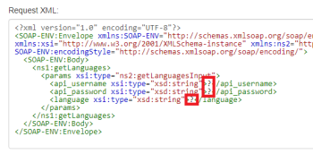

# SOAP module

You can use the SOAP module to connect to SOAP APIs.

## Access requirements

You must have the following access to use the functionality in this article:

<table cellspacing="0"> 
 <col> 
 <col> 
 <tbody> 
  <tr> 
   <td role="rowheader"><em>Adobe Workfront</em> plan*</td> 
   <td> <p><em>Pro</em> or higher</p> </td> 
  </tr> <draft-comment>
   <tr data-mc-conditions=""> 
    <td role="rowheader"><em>Adobe Workfront</em> license*</td> 
    <td> <p>Plan, Work</p> </td> 
   </tr>
  </draft-comment>
  <tr data-mc-conditions=""> 
   <td role="rowheader"><em>Adobe Workfront</em> license*</td> 
   <td> <p>Plan, Work</p> </td> 
  </tr> 
  <tr> 
   <td role="rowheader"><em>Adobe Workfront Fusion</em> license**</td> 
   <td> <p><em>Workfront Fusion for Work Automation and Integration</em> </p> </td> 
  </tr> 
  <tr> 
   <td role="rowheader">Product</td> 
   <td>Your organization must purchase <em>Adobe Workfront Fusion</em> as well as <em>Adobe Workfront</em> to use functionality described in this article.</td> 
  </tr> <draft-comment>
   <tr data-mc-conditions="QuicksilverOrClassic.Draft mode"> 
    <td role="rowheader">Access level configurations*</td> 
    <td> <draft-comment>
      <p data-mc-conditions="QuicksilverOrClassic.Draft mode">You must be a <em>Workfront Fusion</em> administrator for your organization.</p>
     </draft-comment><p data-mc-conditions="QuicksilverOrClassic.Draft mode">You must be a <em>Workfront Fusion</em> administrator for your organization.</p> <draft-comment>
      <p data-mc-conditions="QuicksilverOrClassic.Draft mode">You must be a <em>Workfront Fusion</em> administrator for your team.</p>
     </draft-comment><p data-mc-conditions="QuicksilverOrClassic.Draft mode">You must be a <em>Workfront Fusion</em> administrator for your team.</p> </td> 
   </tr>
  </draft-comment>
  <tr data-mc-conditions="QuicksilverOrClassic.Draft mode"> 
   <td role="rowheader">Access level configurations*</td> 
   <td> <p data-mc-conditions="QuicksilverOrClassic.Draft mode">You must be a <em>Workfront Fusion</em> administrator for your organization.</p> <p data-mc-conditions="QuicksilverOrClassic.Draft mode">You must be a <em>Workfront Fusion</em> administrator for your team.</p> </td> 
  </tr> 
 </tbody> 
</table>

&#42;To find out what plan, license type, or access you have, contact your *Workfront administrator*.

&#42;&#42;For information on *Adobe Workfront Fusion* licenses, see [Adobe Workfront Fusion licenses](../../workfront-fusion/get-started/license-automation-vs-integration.md)

## Using the SOAP module

The SOAP module is currently in beta and does not support:

* Redefine elements
* Fraction digits restrictions
* Total digits restrictions
* White space restrictions
* Multiple parts in input and output messages. Only single part messages are supported
* Custom XML Schema elements defined with the help of SOAP Encoding (http://schemas.xmlsoap.org) schemas and elements.

  ` `**Example: **`` The following would not be recognized correctly by *Workfront Fusion*:
  <pre><complexType name="ArrayOfFloat"></pre> `<blockquote> <pre><complexContent></pre> </blockquote>` `<blockquote>  <blockquote>  <pre><restriction base="soapenc:Array"></pre>  </blockquote> </blockquote>` `<blockquote>  <blockquote>   <blockquote>   <pre><attribute ref="soapenc:arrayType"</pre>   </blockquote>  </blockquote> </blockquote>` `<blockquote>  <blockquote>   <blockquote>    <blockquote>     <blockquote>     <pre>wsdl:arrayType="xsd:integer[]"/></pre>     </blockquote>    </blockquote>   </blockquote>  </blockquote> </blockquote>` `<blockquote>  <blockquote>  <pre></restriction></pre>  </blockquote> </blockquote>` `<blockquote> <pre></complexContent></pre> </blockquote>`<pre></complexType></pre>It includes the 

  ```
  soapenc:Array
  ```

  , 

  ```
  soapenc:arrayType
  ```

  and 

  ```
  wsdl:arrayType
  ```

  references, which are not yet supported in *Workfront Fusion*.

## Workaround

If the SOAP module refuses to process the WSDL file or throws various errors in the module's configuration, you may try using the universal `HTTP > Make a request` module instead:

<ol> 
 <li value="1">In <em>Workfront Fusion</em>, create a new scenario.</li> 
 <li value="2">Insert the <span class="bold">HTTP > Make a request</span> module in the scenario.</li> 
 <li value="3"> <p>Open the module's configuration and configure it like shown below:</p> <p>  </p> </li> 
 <li value="4">Open a new web browser window or tab.</li> 
 <li value="5"> <p>Paste the WSDL URL into the web browser's address bar and fetch the XML file. </p> <p>The WSDL URL usually ends with <code>?wsdl</code>, but not necessarily, for example http://voip.ms/api/v1/server.wsdl.</p> </li> 
 <li value="6">If the WSDL file does not display directly in the web browser, open the downloaded file in a text editor.</li> 
 <li value="7"> <p>Search for the <code><service></code> or <code><wsdl:service></code> tag:</p> <p>  </p> </li> 
 <li value="8">Once located, copy the URL from the <code>location </code>attribute.</li> 
 <li value="9">In <em>Workfront Fusion</em>, paste the URL into the HTTP module's URL field.</li> 
 <li value="10">Open the <a href="https://wsdlbrowser.com/">Online SOAP Client</a> in a new web browser window/tab.</li> 
 <li value="11">Paste the WSDL URL into the WSDL URL field.</li> 
 <li value="12">Click <span class="bold">Browse</span>.</li> 
 <li value="13">Pick from the list of functions to the left, for example <code>getLanguages</code>.</li> 
 <li value="14">Copy the content of the Request XML text area.</li> 
 <li value="15">In <em>Workfront Fusion</em>, paste the copied content to the module's URL field.</li> 
 <li value="16"> <p>Provide values for selected parameters by replacing the question marks with actual values:</p> <p>  </p> </li> 
 <li value="17">Close the module's configuration by clicking <span class="bold">OK</span>.</li> 
 <li value="18">Execute the scenario or module.</li> 
</ol>

