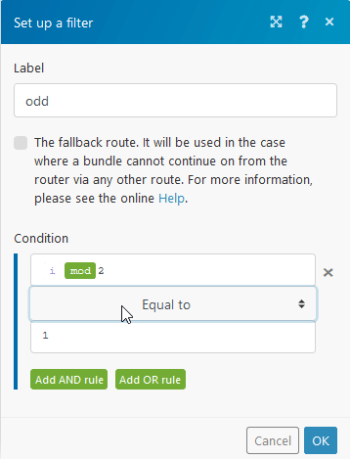

# Tools {#tools}

The *`Adobe Workfront Fusion`* Tools section includes several useful modules that can enhance your scenario.


Tools modules are available from the list of apps, or from the Tools icon  at the bottom of the screen.


## Access requirements {#access-requirements}

You must have the following access to use the functionality in this article:

<table style="width: 100%;margin-left: 0;margin-right: auto;mc-table-style: url('../../Resources/TableStyles/TableStyle-List-options-in-steps.css');" class="TableStyle-TableStyle-List-options-in-steps" cellspacing="0"> 
 <col class="TableStyle-TableStyle-List-options-in-steps-Column-Column1"> 
 <col class="TableStyle-TableStyle-List-options-in-steps-Column-Column2"> 
 <tbody> 
  <tr class="TableStyle-TableStyle-List-options-in-steps-Body-LightGray"> 
   <td class="TableStyle-TableStyle-List-options-in-steps-BodyE-Column1-LightGray" role="rowheader"><span class="mc-variable WFVariables.FullProdNameWF variable varname">Adobe Workfront</span> plan*</td> 
   <td class="TableStyle-TableStyle-List-options-in-steps-BodyD-Column2-LightGray"> <p><span class="mc-variable WFVariables.WFPlan-Pro variable varname">Pro</span> or higher</p> </td> 
  </tr> 
  <tr class="TableStyle-TableStyle-List-options-in-steps-Body-MediumGray"> 
   <td class="TableStyle-TableStyle-List-options-in-steps-BodyE-Column1-MediumGray" role="rowheader"><span class="mc-variable WFVariables.FullProdNameWFF variable varname">Adobe Workfront Fusion</span> license**</td> 
   <td class="TableStyle-TableStyle-List-options-in-steps-BodyD-Column2-MediumGray"> <p><span class="mc-variable WFVariables.WFFusionIntegration variable varname">Workfront Fusion for Work Automation and Integration</span> </p> <p data-mc-conditions="SnippetConditions.HIDE"><span class="mc-variable WFVariables.WFFusionAutomation variable varname">Workfront Fusion for Work Automation</span> </p> </td> 
  </tr> 
  <tr class="TableStyle-TableStyle-List-options-in-steps-Body-LightGray"> 
   <td class="TableStyle-TableStyle-List-options-in-steps-BodyB-Column1-LightGray" role="rowheader">Product</td> 
   <td class="TableStyle-TableStyle-List-options-in-steps-BodyA-Column2-LightGray">Your organization must purchase <span class="mc-variable WFVariables.FullProdNameWFF variable varname">Adobe Workfront Fusion</span> as well as <span class="mc-variable WFVariables.FullProdNameWF variable varname">Adobe Workfront</span> to use functionality described in this article.</td> 
  </tr> 
 </tbody> 
</table>

&#42;To find out what plan, license type, or access you have, contact your *`Workfront administrator`*.


## Tools and their fields {#tools-and-their-fields}


*  [Triggers](#triggers) 
*  [Actions](#actions) 
*  [Aggregators](#aggregat) 
*  [Transformers](#transfor) 


### Triggers {#triggers}


#### Basic trigger {#basic-trigger}

This module allows you to create a custom trigger and define its input bundles.


You can use this module, for example, for contacts or any other list that is scheduled to be sent to a specified email address (such as Email > Send an Email, or Gmail > Send an Email modules), or as a simple reminder to be triggered whenever you want.


### Actions {#actions}


*  [Get Multiple Variables](#get) 
*  [Get Variable](#get2) 
*  [Increment function](#incremen) 
*  [Set Multiple Variables](#set) [Set Variable](#set2) 
*  [Set Variable](#set2) 
*  [Sleep](#sleep) 


#### Get Multiple Variables {#get-multiple-variables}

This module retrieves values that were previously created by the Set Variable or Set Multiple Variables module.


This module can read variables that were set anywhere in the scenario, even if the variable was set in a different route than where the Get Multiple Variables module is located. The only requirement is that the Tools >Set Variable or Tools > Set Multiple Variable module is executed before the Tools > Get Variable module. For more information on the order in which modules are executed, see [Router module](router-module.md).


` `**Examples: **`` The following are possible uses of the Set/Get (multiple) variable(s) modules:


* To store a calculated value for later use, even in a different route. This is useful in cases when the value is used in multiple modules and the formula to calculate the value is overly complex.
* To debug a formula. If a formula used in a module does not seemingly provide a correct result, copy the formula and paste it into a Set Variable module that you insert before the relevant module. Disconnect the module(s) after the Set Variable module and execute the scenario. Verify the Set Variable module's output, adjust or simplify the formula, execute the scenario again, and continue to do so until the issue has been resolved.


#### Get Variable {#get-variable}

This module retrieves a value that was previously created by the Set Variable or Set Multiple Variables module.


This module can read variables that were set anywhere in the scenario, even if the variable was set in a different route than where the Get Multiple Variables module is located. The only requirement is that the Tools >Set Variable or Tools > Set Multiple Variable module is executed before the Tools > Get Variable module. For more information on the order in which modules are executed, see [Router module](router-module.md).

<table style="width: 717px;mc-table-style: url('../../Resources/TableStyles/TableStyle-List-options-in-steps.css');" class="TableStyle-TableStyle-List-options-in-steps" cellspacing="0"> 
 <col class="TableStyle-TableStyle-List-options-in-steps-Column-Column1"> 
 <col class="TableStyle-TableStyle-List-options-in-steps-Column-Column2"> 
 <tbody> 
  <tr class="TableStyle-TableStyle-List-options-in-steps-Body-LightGray"> 
   <td class="TableStyle-TableStyle-List-options-in-steps-BodyB-Column1-LightGray" role="rowheader">Variable name</td> 
   <td class="TableStyle-TableStyle-List-options-in-steps-BodyA-Column2-LightGray"> <p>Map the name of the variable that you want the module to get.</p> </td> 
  </tr> 
 </tbody> 
</table>


#### Increment function {#increment-function}

This module returns a value incremented by 1 after each module's operation.

<table style="width: 717px;mc-table-style: url('../../Resources/TableStyles/TableStyle-List-options-in-steps.css');" class="TableStyle-TableStyle-List-options-in-steps" cellspacing="0"> 
 <col class="TableStyle-TableStyle-List-options-in-steps-Column-Column1"> 
 <col class="TableStyle-TableStyle-List-options-in-steps-Column-Column2"> 
 <tbody> 
  <tr class="TableStyle-TableStyle-List-options-in-steps-Body-LightGray"> 
   <td class="TableStyle-TableStyle-List-options-in-steps-BodyB-Column1-LightGray" role="rowheader">Reset a value</td> 
   <td class="TableStyle-TableStyle-List-options-in-steps-BodyA-Column2-LightGray"> <p>Select when you want the module to increment the value. </p> 
    <ul> 
     <li>After one cycle</li> 
     <li>After one scenario run</li> 
     <li>Never</li> 
    </ul> </td> 
  </tr> 
 </tbody> 
</table>


` `**Example: **`` One of the module's uses is to implement a "round robin" assignment of tasks, leads, emails, and so on, to users in a group. The algorithm chooses the assignees from a group in some rational order, usually going from the top to the bottom of a list. When the algorithm reaches the end of the list, it would then give the next assignment to the user at the top of the list and continue to make assignments down the list.


The following scenario sends an email to the first recipient after every odd-numbered scenario run, and to the second recipient after every even-numbered scenario run.


1. To create this scenario: 
1. Set the module's `Reset a value` field to Never.
1.  Set the route for odd values. Set the filter for this route using the modulus math function that equals 

   ```
   1
   ```

   :


   


   >[!NOTE]
   >
   >Do not forget to change the Equal to operator from the default Text operator to the Numeric operator.


1. Set the route for even values using the modulus math function that equals 

   ```
   0
   ```

   :


The increment function adds one every time the scenario runs. The filters check the increment and act on its value, ensuring that the emails are evenly distributed.


#### Set Multiple Variables {#set-multiple-variables}

This module creates variables that can be mapped by other modules in the route. The variable can also be mapped to the Get Variable or Get Multiple Variables modules for any route in the scenario.

<table class="TableStyle-TableStyle-List-options-in-steps"> 
 <col class="TableStyle-TableStyle-List-options-in-steps-Column-Column1"> 
 <col class="TableStyle-TableStyle-List-options-in-steps-Column-Column2"> 
 <tbody> 
  <tr class="TableStyle-TableStyle-List-options-in-steps-Body-LightGray"> 
   <td class="TableStyle-TableStyle-List-options-in-steps-BodyE-Column1-LightGray">Variables</td> 
   <td class="TableStyle-TableStyle-List-options-in-steps-BodyD-Column2-LightGray">Add the variables that you want the module to set.</td> 
  </tr> 
  <tr class="TableStyle-TableStyle-List-options-in-steps-Body-LightGray"> 
   <td class="TableStyle-TableStyle-List-options-in-steps-BodyE-Column1-LightGray">Variable name </td> 
   <td class="TableStyle-TableStyle-List-options-in-steps-BodyD-Column2-LightGray">For each variable, enter the variable name. This name will be displayed when mapping the variable in other modules. </td> 
  </tr> 
  <tr class="TableStyle-TableStyle-List-options-in-steps-Body-LightGray"> 
   <td class="TableStyle-TableStyle-List-options-in-steps-BodyB-Column1-LightGray">Variable value </td> 
   <td class="TableStyle-TableStyle-List-options-in-steps-BodyA-Column2-LightGray">For each variable, enter the value for the variable. </td> 
  </tr> 
  <tr class="TableStyle-TableStyle-List-options-in-steps-Body-MediumGray"> 
   <td class="TableStyle-TableStyle-List-options-in-steps-BodyE-Column1-MediumGray">Variable lifetime </td> 
   <td class="TableStyle-TableStyle-List-options-in-steps-BodyD-Column2-MediumGray"> <p>Select how long you want the variables to remain valid (keep the same value).</p> 
    <ul> 
     <li><span class="bold">One cycle</span>: The variable is valid for one cycle. Useful when multiple webhooks in one scenario run are received (more webhooks = more cycles). </li> 
     <li><span class="bold">One execution</span>: The variable is valid for one scenario execution. One execution can contain one or more cycles.</li> 
    </ul> </td> 
  </tr> 
 </tbody> 
</table>


#### Set Variable {#set-variable}

This module creates a variable that can be mapped by other modules in the route. The variable can also be mapped to the Get Variable or Get Multiple Variables modules for any route in the scenario.

<table class="TableStyle-TableStyle-List-options-in-steps"> 
 <col class="TableStyle-TableStyle-List-options-in-steps-Column-Column1"> 
 <col class="TableStyle-TableStyle-List-options-in-steps-Column-Column2"> 
 <tbody> 
  <tr class="TableStyle-TableStyle-List-options-in-steps-Body-LightGray"> 
   <td class="TableStyle-TableStyle-List-options-in-steps-BodyE-Column1-LightGray">Variable name </td> 
   <td class="TableStyle-TableStyle-List-options-in-steps-BodyD-Column2-LightGray">Enter the variable name. This name will be displayed when mapping the variable in other modules. </td> 
  </tr> 
  <tr class="TableStyle-TableStyle-List-options-in-steps-Body-MediumGray"> 
   <td class="TableStyle-TableStyle-List-options-in-steps-BodyE-Column1-MediumGray">Variable lifetime </td> 
   <td class="TableStyle-TableStyle-List-options-in-steps-BodyD-Column2-MediumGray"> <p>Select how long you want the variables to remain valid (keep the same value).</p> 
    <ul> 
     <li><span class="bold">One cycle</span>: The variable is valid for one cycle. Useful when multiple webhooks in one scenario run are received (more webhooks = more cycles). </li> 
     <li><span class="bold">One execution</span>: The variable is valid for one scenario execution. One execution can contain one or more cycles.</li> 
    </ul> </td> 
  </tr> 
  <tr class="TableStyle-TableStyle-List-options-in-steps-Body-LightGray"> 
   <td class="TableStyle-TableStyle-List-options-in-steps-BodyB-Column1-LightGray">Variable value </td> 
   <td class="TableStyle-TableStyle-List-options-in-steps-BodyA-Column2-LightGray">Enter or map the value for the variable. </td> 
  </tr> 
 </tbody> 
</table>


#### Sleep {#sleep}

This module allows you to delay the scenario flow for up to 300 seconds (5 minutes).


This function can be useful, for example, if you want to lower the target service server load or to imitate human behavior when sending bulk SMS or emails.

<table class="TableStyle-TableStyle-List-options-in-steps"> 
 <col class="TableStyle-TableStyle-List-options-in-steps-Column-Column1"> 
 <col class="TableStyle-TableStyle-List-options-in-steps-Column-Column2"> 
 <tbody> 
  <tr class="TableStyle-TableStyle-List-options-in-steps-Body-LightGray"> 
   <td class="TableStyle-TableStyle-List-options-in-steps-BodyB-Column1-LightGray"> <p>Delay</p> </td> 
   <td class="TableStyle-TableStyle-List-options-in-steps-BodyA-Column2-LightGray"> <p>Enter the number of seconds the scenario will be paused for.</p> </td> 
  </tr> 
 </tbody> 
</table>


` `**Tip: **`` If you want to pause the flow for longer periods of time, we suggest to split your scenario into two scenarios:


* The first scenario would contain the part before the pause
* The second scenario would contain the part after it.


The first scenario would end up with storing all the necessary information in a data store together with the current timestamp. The second scenario would periodically check the data store for records with a timestamp older than the intended delay, retrieve the records, finalize the processing of the data and remove the records from the data store.


For more information on data stores, see [Data Stores](data-stores.md).


For more information on specific data store modules, see [Data store modules](data-store-modules.md).


### Aggregators {#aggregators}


*  [Numeric aggregator](#numeric) 
*  [Table aggregator](#table) 
*  [Text aggregator](#text) 


#### Numeric aggregator {#numeric-aggregator}

This module allows you to retrieve numerical values, then apply one of the selected functions (SUM, AVG, COUNT, MAX, MIN), and return the result in one bundle.

<table class="TableStyle-TableStyle-List-options-in-steps"> 
 <col class="TableStyle-TableStyle-List-options-in-steps-Column-Column1"> 
 <col class="TableStyle-TableStyle-List-options-in-steps-Column-Column2"> 
 <tbody> 
  <tr class="TableStyle-TableStyle-List-options-in-steps-Body-LightGray"> 
   <td class="TableStyle-TableStyle-List-options-in-steps-BodyE-Column1-LightGray"> <p>Source module</p> </td> 
   <td class="TableStyle-TableStyle-List-options-in-steps-BodyD-Column2-LightGray"> <p>Select the module you want to aggregate fields from.</p> </td> 
  </tr> 
  <tr class="TableStyle-TableStyle-List-options-in-steps-Body-LightGray"> 
   <td class="TableStyle-TableStyle-List-options-in-steps-BodyE-Column1-LightGray"> <p>Aggregate function</p> </td> 
   <td class="TableStyle-TableStyle-List-options-in-steps-BodyD-Column2-LightGray"> <p>Select the function that you want to use to aggregate the values.</p> </td> 
  </tr> 
  <tr class="TableStyle-TableStyle-List-options-in-steps-Body-LightGray"> 
   <td class="TableStyle-TableStyle-List-options-in-steps-BodyB-Column1-LightGray"> <p>Group by</p> </td> 
   <td class="TableStyle-TableStyle-List-options-in-steps-BodyA-Column2-LightGray"> <p>Define an expression that you want to group the aggregated output by. This expression can contain one or more mapped items. The aggregated data is then separated into groups using this expression's value. Each group outputs as a separate bundle with a key (the evaluated expression) and a value (the aggregated value). You can use the key as a filter in subsequent modules.</p> </td> 
  </tr> 
  <tr class="TableStyle-TableStyle-List-options-in-steps-Body-LightGray"> 
   <td class="TableStyle-TableStyle-List-options-in-steps-BodyB-Column1-LightGray">Stop processing after an empty aggregation</td> 
   <td class="TableStyle-TableStyle-List-options-in-steps-BodyA-Column2-LightGray">Enable this option to stop the scenario when there are no results.</td> 
  </tr> 
  <tr class="TableStyle-TableStyle-List-options-in-steps-Body-MediumGray"> 
   <td class="TableStyle-TableStyle-List-options-in-steps-BodyE-Column1-MediumGray"> <p>Value</p> </td> 
   <td class="TableStyle-TableStyle-List-options-in-steps-BodyD-Column2-MediumGray"> <p>Enter or map the value that you want to aggregate.</p> </td> 
  </tr> 
 </tbody> 
</table>


` `**Example: **`` The module sums up values under the number parameter.


#### Table aggregator {#table-aggregator}

This module merges values from the selected fields of received bundles into a single bundle using a specified column and row separator (which allows you to create a table).

<table class="TableStyle-TableStyle-List-options-in-steps"> 
 <col class="TableStyle-TableStyle-List-options-in-steps-Column-Column1"> 
 <col class="TableStyle-TableStyle-List-options-in-steps-Column-Column2"> 
 <tbody> 
  <tr class="TableStyle-TableStyle-List-options-in-steps-Body-LightGray"> 
   <td class="TableStyle-TableStyle-List-options-in-steps-BodyE-Column1-LightGray"> <p>Source module</p> </td> 
   <td class="TableStyle-TableStyle-List-options-in-steps-BodyD-Column2-LightGray"> <p>Select the module you want to aggregate fields from.</p> </td> 
  </tr> 
  <tr class="TableStyle-TableStyle-List-options-in-steps-Body-MediumGray"> 
   <td class="TableStyle-TableStyle-List-options-in-steps-BodyE-Column1-MediumGray">Aggregated fields</td> 
   <td class="TableStyle-TableStyle-List-options-in-steps-BodyD-Column2-MediumGray"> <p> Select the fields from the module selected above that contain values you want to aggregate into the one bundle.</p> </td> 
  </tr> 
  <tr class="TableStyle-TableStyle-List-options-in-steps-Body-LightGray"> 
   <td class="TableStyle-TableStyle-List-options-in-steps-BodyE-Column1-LightGray"> <p>Column separator</p> </td> 
   <td class="TableStyle-TableStyle-List-options-in-steps-BodyD-Column2-LightGray"> <p>Select or enter the type of separator that will separate the field value columns in the resulting bundle. If you select Other, enter the character you want to use to separate values into the separator field.</p> </td> 
  </tr> 
  <tr class="TableStyle-TableStyle-List-options-in-steps-Body-MediumGray"> 
   <td class="TableStyle-TableStyle-List-options-in-steps-BodyE-Column1-MediumGray"> <p>Row separator</p> </td> 
   <td class="TableStyle-TableStyle-List-options-in-steps-BodyD-Column2-MediumGray"> <p>Select or enter the type of separator that will separate the field value rows in the resulting bundle. If you select Other, enter the character you want to use to separate values into the separator field.</p> </td> 
  </tr> 
  <tr class="TableStyle-TableStyle-List-options-in-steps-Body-LightGray"> 
   <td class="TableStyle-TableStyle-List-options-in-steps-BodyB-Column1-LightGray"> <p>Group by</p> </td> 
   <td class="TableStyle-TableStyle-List-options-in-steps-BodyA-Column2-LightGray"> <p>Define an expression that you want to group the aggregated output by. This expression can contain one or more mapped items. The aggregated data will be then separated into groups using this expression's value. Each group outputs as a separate bundle with a key (the evaluated expression) and a value (the aggregated value). You can use the key as a filter in subsequent modules.</p> </td> 
  </tr> 
  <tr class="TableStyle-TableStyle-List-options-in-steps-Body-LightGray"> 
   <td class="TableStyle-TableStyle-List-options-in-steps-BodyB-Column1-LightGray">Stop processing after an empty aggregation</td> 
   <td class="TableStyle-TableStyle-List-options-in-steps-BodyA-Column2-LightGray">Select this option to stop the scenario when there are no results.</td> 
  </tr> 
 </tbody> 
</table>


#### Text aggregator {#text-aggregator}

This module merges values from the selected fields of received bundles into a single bundle.

<table class="TableStyle-TableStyle-List-options-in-steps"> 
 <col class="TableStyle-TableStyle-List-options-in-steps-Column-Column1"> 
 <col class="TableStyle-TableStyle-List-options-in-steps-Column-Column2"> 
 <tbody> 
  <tr class="TableStyle-TableStyle-List-options-in-steps-Body-LightGray"> 
   <td class="TableStyle-TableStyle-List-options-in-steps-BodyE-Column1-LightGray"> <p>Source module</p> </td> 
   <td class="TableStyle-TableStyle-List-options-in-steps-BodyD-Column2-LightGray"> <p>Select the module you want to aggregate fields from.</p> </td> 
  </tr> 
  <tr class="TableStyle-TableStyle-List-options-in-steps-Body-MediumGray"> 
   <td class="TableStyle-TableStyle-List-options-in-steps-BodyE-Column1-MediumGray"> <p>Row separator</p> </td> 
   <td class="TableStyle-TableStyle-List-options-in-steps-BodyD-Column2-MediumGray"> <p>Select or enter the type of separator that will separate the field value rows in the resulting bundle. If you select Other, enter the character you want to use to separate values into the separator field.</p> </td> 
  </tr> 
  <tr class="TableStyle-TableStyle-List-options-in-steps-Body-LightGray"> 
   <td class="TableStyle-TableStyle-List-options-in-steps-BodyB-Column1-LightGray"> <p>Group by</p> </td> 
   <td class="TableStyle-TableStyle-List-options-in-steps-BodyA-Column2-LightGray"> <p>Define an expression containing one or more mapped items. The aggregated data is separated under Groups with the same expression's value. Each Group outputs as a separate bundle containing a Key with the evaluated expression and the aggregated text. By doing this, you can use the Key as a filter in subsequent modules.</p> </td> 
  </tr> 
  <tr class="TableStyle-TableStyle-List-options-in-steps-Body-MediumGray"> 
   <td class="TableStyle-TableStyle-List-options-in-steps-BodyE-Column1-MediumGray">Text</td> 
   <td class="TableStyle-TableStyle-List-options-in-steps-BodyD-Column2-MediumGray"> <p> Enter or map the text that you want the module to aggregate.</p> </td> 
  </tr> 
  <tr class="TableStyle-TableStyle-List-options-in-steps-Body-MediumGray"> 
   <td class="TableStyle-TableStyle-List-options-in-steps-BodyE-Column1-MediumGray">Stop processing after an empty aggregation</td> 
   <td class="TableStyle-TableStyle-List-options-in-steps-BodyD-Column2-MediumGray">Select this option to stop the scenario when there are no results.</td> 
  </tr> 
 </tbody> 
</table>

` `**Example: **``You can use the text aggregator to insert more values (for example, customer names or notes)into a single bundle and send an email containing all the values in the email body or the email subject.


### Transformers {#transformers}


*  [Compose a string](#compose) 
*  [Convert the encoding of the text](#convert) 
*  [Switch](#switch) 


#### Compose a string {#compose-a-string}

Converts any value to a string data type (text). It makes the mapping easier when mapping, for example, binary data.

<table style="width: 717px;mc-table-style: url('../../Resources/TableStyles/TableStyle-List-options-in-steps.css');" class="TableStyle-TableStyle-List-options-in-steps" cellspacing="0"> 
 <col class="TableStyle-TableStyle-List-options-in-steps-Column-Column1"> 
 <col class="TableStyle-TableStyle-List-options-in-steps-Column-Column2"> 
 <tbody> 
  <tr class="TableStyle-TableStyle-List-options-in-steps-Body-LightGray"> 
   <td class="TableStyle-TableStyle-List-options-in-steps-BodyB-Column1-LightGray" role="rowheader">Text</td> 
   <td class="TableStyle-TableStyle-List-options-in-steps-BodyA-Column2-LightGray"> <p>Enter or map the data that you want to covert into text.</p> </td> 
  </tr> 
 </tbody> 
</table>


#### Convert the encoding of the text {#convert-the-encoding-of-the-text}

Converts entered input text (or binary data) to the selected encoding.

<table class="TableStyle-TableStyle-List-options-in-steps"> 
 <col class="TableStyle-TableStyle-List-options-in-steps-Column-Column1"> 
 <col class="TableStyle-TableStyle-List-options-in-steps-Column-Column2"> 
 <tbody> 
  <tr class="TableStyle-TableStyle-List-options-in-steps-Body-LightGray"> 
   <td class="TableStyle-TableStyle-List-options-in-steps-BodyE-Column1-LightGray"> <p>Input data</p> </td> 
   <td class="TableStyle-TableStyle-List-options-in-steps-BodyD-Column2-LightGray"> <p>Enter or map the content you want to convert.</p> </td> 
  </tr> 
  <tr class="TableStyle-TableStyle-List-options-in-steps-Body-MediumGray"> 
   <td class="TableStyle-TableStyle-List-options-in-steps-BodyE-Column1-MediumGray">Input data codepage</td> 
   <td class="TableStyle-TableStyle-List-options-in-steps-BodyD-Column2-MediumGray"> <p>Select the encoding type of the input data. </p> </td> 
  </tr> 
  <tr class="TableStyle-TableStyle-List-options-in-steps-Body-LightGray"> 
   <td class="TableStyle-TableStyle-List-options-in-steps-BodyB-Column1-LightGray"> <p>Output data codepage</p> </td> 
   <td class="TableStyle-TableStyle-List-options-in-steps-BodyA-Column2-LightGray"> <p>Select the encoding type of your target (output) data.</p> </td> 
  </tr> 
 </tbody> 
</table>


#### Switch {#switch}

Checks the input value for a match with the provided list of values. Returns output based on the result.

<table class="TableStyle-TableStyle-List-options-in-steps"> 
 <col class="TableStyle-TableStyle-List-options-in-steps-Column-Column1"> 
 <col class="TableStyle-TableStyle-List-options-in-steps-Column-Column2"> 
 <tbody> 
  <tr class="TableStyle-TableStyle-List-options-in-steps-Body-LightGray"> 
   <td class="TableStyle-TableStyle-List-options-in-steps-BodyE-Column1-LightGray"> <p>Input</p> </td> 
   <td class="TableStyle-TableStyle-List-options-in-steps-BodyD-Column2-LightGray"> <p>Enter the expression you want to evaluate.</p> </td> 
  </tr> 
  <tr class="TableStyle-TableStyle-List-options-in-steps-Body-LightGray"> 
   <td class="TableStyle-TableStyle-List-options-in-steps-BodyE-Column1-LightGray">Use regular expressions to match</td> 
   <td class="TableStyle-TableStyle-List-options-in-steps-BodyD-Column2-LightGray"> <p>Enable this option to use regular expressions. The module determines the cases based on the regular expression, rather than an exact match.</p> 
    <div> 
     <p>A regular expression is a sequence of characters in which each character is either a metacharacter, having a special meaning, or a regular character that has a literal meaning. These character and metacharacters identify a pattern that can be used to search text. For example, if you wanted to search for names, you could set up a regular expression to search for a pattern that consists of two consecutive words that begin with capital letters. Regular expressions are a powerful tool for searching and manipulating text.</p> 
     <p>A discussion of regular expressions is beyond the scope of this article. We recommend the following resources:</p> 
     <ul> 
      <li>For the complete list of metacharacters, see <a href="https://developer.mozilla.org/en-US/docs/Web/JavaScript/Guide/Regular_Expressions">Regular expressions</a> in MDN web docs.</li> 
      <li>For a tutorial on how to create regular expressions, we recommend <a href="https://regexone.com/">RegexOne</a>.</li> 
      <li>For experimenting with regular expressions, we recommend the <a href="https://regex101.com/">Regular Expressions 101</a> website. Select the ECMAScript (JavaScript) FLAVOR in the left panel.</li> 
     </ul> 
    </div> </td> 
  </tr> 
  <tr class="TableStyle-TableStyle-List-options-in-steps-Body-MediumGray"> 
   <td class="TableStyle-TableStyle-List-options-in-steps-BodyE-Column1-MediumGray">Cases </td> 
   <td class="TableStyle-TableStyle-List-options-in-steps-BodyD-Column2-MediumGray"> <p>If the input contains a value entered to the Pattern field, then the value entered to the Output field is returned.</p> <p>If the input does not match any of the values that you have set in a Pattern field, then one of the following occurs:</p> 
    <ul> 
     <li>The value from the Else field is returned</li> 
     <li>If there is no value in the Else field, no output is returned.</li> 
    </ul> </td> 
  </tr> 
  <tr class="TableStyle-TableStyle-List-options-in-steps-Body-LightGray"> 
   <td class="TableStyle-TableStyle-List-options-in-steps-BodyB-Column1-LightGray"> <p>Else</p> </td> 
   <td class="TableStyle-TableStyle-List-options-in-steps-BodyA-Column2-LightGray"> <p>Enter the value that is returned when the criteria set in the Cases field are not met. </p> </td> 
  </tr> 
 </tbody> 
</table>

