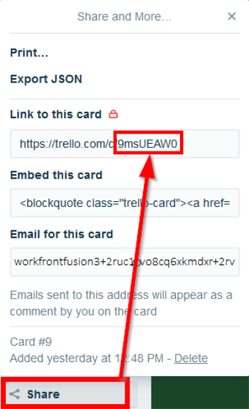

# Trello modules {#trello-modules}

In a *`Adobe Workfront Fusion`* scenario, you can connect your *`Trello`* account to multiple third-party applications and services.


If you need instructions on creating a scenario, see [Create a scenario](create-a-scenario.md). 


For information about modules, see [Modules in Adobe Workfront Fusion](_modules.md).


## Access requirements {#access-requirements}

You must have the following access to use the functionality in this article:

<table style="width: 100%;margin-left: 0;margin-right: auto;mc-table-style: url('../../Resources/TableStyles/TableStyle-List-options-in-steps.css');" class="TableStyle-TableStyle-List-options-in-steps" cellspacing="0"> 
 <col class="TableStyle-TableStyle-List-options-in-steps-Column-Column1"> 
 <col class="TableStyle-TableStyle-List-options-in-steps-Column-Column2"> 
 <tbody> 
  <tr class="TableStyle-TableStyle-List-options-in-steps-Body-LightGray"> 
   <td class="TableStyle-TableStyle-List-options-in-steps-BodyE-Column1-LightGray" role="rowheader"><span class="mc-variable WFVariables.FullProdNameWF variable varname">Adobe Workfront</span> plan*</td> 
   <td class="TableStyle-TableStyle-List-options-in-steps-BodyD-Column2-LightGray"> <p><span class="mc-variable WFVariables.WFPlan-Pro variable varname">Pro</span> or higher</p> </td> 
  </tr> 
  <tr class="TableStyle-TableStyle-List-options-in-steps-Body-MediumGray"> 
   <td class="TableStyle-TableStyle-List-options-in-steps-BodyE-Column1-MediumGray" role="rowheader"><span class="mc-variable WFVariables.FullProdNameWFF variable varname">Adobe Workfront Fusion</span> license**</td> 
   <td class="TableStyle-TableStyle-List-options-in-steps-BodyD-Column2-MediumGray"> <p><span class="mc-variable WFVariables.WFFusionIntegration variable varname">Workfront Fusion for Work Automation and Integration</span> </p> </td> 
  </tr> 
  <tr class="TableStyle-TableStyle-List-options-in-steps-Body-LightGray"> 
   <td class="TableStyle-TableStyle-List-options-in-steps-BodyB-Column1-LightGray" role="rowheader">Product</td> 
   <td class="TableStyle-TableStyle-List-options-in-steps-BodyA-Column2-LightGray">Your organization must purchase <span class="mc-variable WFVariables.FullProdNameWFF variable varname">Adobe Workfront Fusion</span> as well as <span class="mc-variable WFVariables.FullProdNameWF variable varname">Adobe Workfront</span> to use functionality described in this article.</td> 
  </tr> 
 </tbody> 
</table>

&#42;To find out what plan, license type, or access you have, contact your *`Workfront administrator`*.


## Prerequisites {#prerequisites}

To use Trello modules, you must have a Trello account.


## Connect Trello to *`Workfront Fusion`* {#connect-trello-to-workfront-fusion}

For instructions about connecting your *`Trello`* account to *`Workfront Fusion`*, see [Create a connection to Workfront Fusion - Basic instructions](connect-to-fusion-general.md)


## Trello modules and their fields {#trello-modules-and-their-fields}

When you configure *`Trello`* modules, *`Workfront Fusion`* displays the fields listed below. Along with these, additional *`Trello`* fields might display, depending on factors such as your access level in the app or service. A bolded title in a module indicates a required field.


If you see the map button above a field or function, you can use it to set variables and functions for that field. For more information, see [Map information from one module to another](map-information-between-modules.md).


* [Boards](#boards) 
* [Lists](#lists) 
* [Cards](#cards) 
* [Members](#members) 
* [Checklists](#checklis) 
* [Labels](#labels) 
* [Comments](#comments) 


### Boards {#boards}


* [Watch Boards](#watch) 
* [Create a Board](#create) 
* [Edit a Board](#edit) 
* [Get a Board](#get) 
* [Search for Boards](#search) 
* [Archive or Unarchive a Board](#archive) 
* [Assign a Member to a Board](#assign) 
* [Unassign a Member from a Board](#unassign) 


#### Watch Boards {#watch-boards}

This trigger module begins a scenario when a new board is added.

<table style="width: 100%;mc-table-style: url('../../Resources/TableStyles/TableStyle-List-options-in-steps.css');" class="TableStyle-TableStyle-List-options-in-steps" cellspacing="0"> 
 <col class="TableStyle-TableStyle-List-options-in-steps-Column-Column1"> 
 <col class="TableStyle-TableStyle-List-options-in-steps-Column-Column2"> 
 <tbody> 
  <tr class="TableStyle-TableStyle-List-options-in-steps-Body-LightGray"> 
   <td class="TableStyle-TableStyle-List-options-in-steps-BodyE-Column1-LightGray" role="rowheader">Connection </td> 
   <td class="TableStyle-TableStyle-List-options-in-steps-BodyD-Column2-LightGray"> <p>For instructions about connecting your <span class="mc-variable WFVariables.WFFusion-Apps variable varname">Trello</span> account to <span class="mc-variable WFVariables.ProdNameWFF variable varname">Workfront Fusion</span>, see <a href="connect-to-fusion-general.md" class="MCXref xref" data-mc-variable-override="">Create a connection to Workfront Fusion - Basic instructions</a></p> </td> 
  </tr> 
  <tr class="TableStyle-TableStyle-List-options-in-steps-Body-MediumGray"> 
   <td class="TableStyle-TableStyle-List-options-in-steps-BodyB-Column1-MediumGray" role="rowheader">Limit </td> 
   <td class="TableStyle-TableStyle-List-options-in-steps-BodyA-Column2-MediumGray"> <p>The maximum number of boards <span class="mc-variable WFVariables.ProdNameWFF variable varname">Workfront Fusion</span> will return during one execution cycle.</p> </td> 
  </tr> 
 </tbody> 
</table>


#### Create a Board {#create-a-board}

This action module creates a new board with the selected settings.

<table style="width: 100%;mc-table-style: url('../../Resources/TableStyles/TableStyle-List-options-in-steps.css');" class="TableStyle-TableStyle-List-options-in-steps" cellspacing="0"> 
 <col class="TableStyle-TableStyle-List-options-in-steps-Column-Column1"> 
 <col class="TableStyle-TableStyle-List-options-in-steps-Column-Column2"> 
 <tbody> 
  <tr class="TableStyle-TableStyle-List-options-in-steps-Body-LightGray"> 
   <td class="TableStyle-TableStyle-List-options-in-steps-BodyE-Column1-LightGray" role="rowheader">Connection </td> 
   <td class="TableStyle-TableStyle-List-options-in-steps-BodyD-Column2-LightGray"> <p>For instructions about connecting your <span class="mc-variable WFVariables.WFFusion-Apps variable varname">Trello</span> account to <span class="mc-variable WFVariables.ProdNameWFF variable varname">Workfront Fusion</span>, see <a href="connect-to-fusion-general.md" class="MCXref xref" data-mc-variable-override="">Create a connection to Workfront Fusion - Basic instructions</a></p> </td> 
  </tr> 
  <tr class="TableStyle-TableStyle-List-options-in-steps-Body-MediumGray"> 
   <td class="TableStyle-TableStyle-List-options-in-steps-BodyE-Column1-MediumGray" role="rowheader">Name </td> 
   <td class="TableStyle-TableStyle-List-options-in-steps-BodyD-Column2-MediumGray"> <p>Enter or map a name for the new board.</p> </td> 
  </tr> 
  <tr class="TableStyle-TableStyle-List-options-in-steps-Body-LightGray"> 
   <td class="TableStyle-TableStyle-List-options-in-steps-BodyE-Column1-LightGray" role="rowheader">Description</td> 
   <td class="TableStyle-TableStyle-List-options-in-steps-BodyD-Column2-LightGray"> <p>Enter or map the board description if needed.</p> </td> 
  </tr> 
  <tr class="TableStyle-TableStyle-List-options-in-steps-Body-MediumGray"> 
   <td class="TableStyle-TableStyle-List-options-in-steps-BodyE-Column1-MediumGray" role="rowheader"> <p>Organization ID</p> </td> 
   <td class="TableStyle-TableStyle-List-options-in-steps-BodyD-Column2-MediumGray"> <p>Enter or map the ID of the organization. The Organization ID can be retrieved by using another module, such as the Watch Activities module.</p> <p>  </p> </td> 
  </tr> 
  <tr class="TableStyle-TableStyle-List-options-in-steps-Body-LightGray"> 
   <td class="TableStyle-TableStyle-List-options-in-steps-BodyE-Column1-LightGray" role="rowheader"> <p>Permission level</p> </td> 
   <td class="TableStyle-TableStyle-List-options-in-steps-BodyD-Column2-LightGray"> <p>Boards have different voting and commenting rules for each permission level. For example: if your board is Private and you set the voting and commenting rules as All, you receive an error. </p> <p>Voting and commenting is limited to the following groups for each permission level:</p> 
    <ul> 
     <li><span class="bold">Private</span>: Members, Members and Observers</li> 
     <li><span class="bold">For organization</span>: Members, Members and Observers, Organization Members</li> 
     <li><span class="bold">Public</span>: Members, Members and Observers, Organization Members, All</li> 
    </ul> </td> 
  </tr> 
  <tr class="TableStyle-TableStyle-List-options-in-steps-Body-MediumGray"> 
   <td class="TableStyle-TableStyle-List-options-in-steps-BodyE-Column1-MediumGray" role="rowheader"> <p>Voting</p> </td> 
   <td class="TableStyle-TableStyle-List-options-in-steps-BodyD-Column2-MediumGray"> <p>Select an option to specify who can vote on this board. See the Permission level field for voting limitations on permission levels.</p> </td> 
  </tr> 
  <tr class="TableStyle-TableStyle-List-options-in-steps-Body-LightGray"> 
   <td class="TableStyle-TableStyle-List-options-in-steps-BodyE-Column1-LightGray" role="rowheader"> <p>Comments</p> </td> 
   <td class="TableStyle-TableStyle-List-options-in-steps-BodyD-Column2-LightGray"> <p>Select an option to specify who can comment on cards for this board. See the Permission level field for commenting limitations on permission levels.</p> </td> 
  </tr> 
  <tr class="TableStyle-TableStyle-List-options-in-steps-Body-MediumGray"> 
   <td class="TableStyle-TableStyle-List-options-in-steps-BodyE-Column1-MediumGray" role="rowheader"> <p>Invitations</p> </td> 
   <td class="TableStyle-TableStyle-List-options-in-steps-BodyD-Column2-MediumGray"> <p>Select who can invite other people to this board.</p> </td> 
  </tr> 
  <tr class="TableStyle-TableStyle-List-options-in-steps-Body-LightGray"> 
   <td class="TableStyle-TableStyle-List-options-in-steps-BodyE-Column1-LightGray" role="rowheader"> <p>Self-join</p> </td> 
   <td class="TableStyle-TableStyle-List-options-in-steps-BodyD-Column2-LightGray"> <p>Select whether team members can join the board themselves or they have to be invited.</p> </td> 
  </tr> 
  <tr class="TableStyle-TableStyle-List-options-in-steps-Body-MediumGray"> 
   <td class="TableStyle-TableStyle-List-options-in-steps-BodyE-Column1-MediumGray" role="rowheader"> <p>Default labels</p> </td> 
   <td class="TableStyle-TableStyle-List-options-in-steps-BodyD-Column2-MediumGray"> <p>Select whether to use the default set of labels for the new board.</p> </td> 
  </tr> 
  <tr class="TableStyle-TableStyle-List-options-in-steps-Body-LightGray"> 
   <td class="TableStyle-TableStyle-List-options-in-steps-BodyE-Column1-LightGray" role="rowheader"> <p>Default lists</p> </td> 
   <td class="TableStyle-TableStyle-List-options-in-steps-BodyD-Column2-LightGray"> <p>Select whether to add the default set of lists to the board (To Do, Doing, Done).</p> </td> 
  </tr> 
  <tr class="TableStyle-TableStyle-List-options-in-steps-Body-MediumGray"> 
   <td class="TableStyle-TableStyle-List-options-in-steps-BodyE-Column1-MediumGray" role="rowheader"> <p>Board source ID</p> </td> 
   <td class="TableStyle-TableStyle-List-options-in-steps-BodyD-Column2-MediumGray"> <p>Select or map the ID of the board that you want to copy into the new board.</p> </td> 
  </tr> 
  <tr class="TableStyle-TableStyle-List-options-in-steps-Body-LightGray"> 
   <td class="TableStyle-TableStyle-List-options-in-steps-BodyE-Column1-LightGray" role="rowheader"> <p>Card Covers</p> </td> 
   <td class="TableStyle-TableStyle-List-options-in-steps-BodyD-Column2-LightGray"> <p>Select <span class="bold">Yes</span> if you want to enable card covers for the board.</p> </td> 
  </tr> 
  <tr class="TableStyle-TableStyle-List-options-in-steps-Body-MediumGray"> 
   <td class="TableStyle-TableStyle-List-options-in-steps-BodyE-Column1-MediumGray" role="rowheader"> <p>Background</p> </td> 
   <td class="TableStyle-TableStyle-List-options-in-steps-BodyD-Column2-MediumGray"> <p>Select the color of the background or the custom background.</p> <p>Note: Custom backgrounds are available only to Trello Gold and Business Class subscribers.</p> </td> 
  </tr> 
  <tr class="TableStyle-TableStyle-List-options-in-steps-Body-LightGray"> 
   <td class="TableStyle-TableStyle-List-options-in-steps-BodyB-Column1-LightGray" role="rowheader"> <p>Card aging</p> </td> 
   <td class="TableStyle-TableStyle-List-options-in-steps-BodyA-Column2-LightGray"> <p>Select between two modes of card aging. </p> 
    <ul> 
     <li><span class="bold">Regular</span>: Cards become progressively more transparent as they age. </li> 
     <li><span class="bold">Pirate</span>: Cards will tear, yellow, and crack like an old pirate map as they age.</li> 
    </ul> </td> 
  </tr> 
 </tbody> 
</table>


#### Edit a Board {#edit-a-board}

This action module edits the settings of an existing board.

<table style="width: 100%;mc-table-style: url('../../Resources/TableStyles/TableStyle-List-options-in-steps.css');" class="TableStyle-TableStyle-List-options-in-steps" cellspacing="0"> 
 <col class="TableStyle-TableStyle-List-options-in-steps-Column-Column1"> 
 <col class="TableStyle-TableStyle-List-options-in-steps-Column-Column2"> 
 <tbody> 
  <tr class="TableStyle-TableStyle-List-options-in-steps-Body-LightGray"> 
   <td class="TableStyle-TableStyle-List-options-in-steps-BodyE-Column1-LightGray" role="rowheader">Connection </td> 
   <td class="TableStyle-TableStyle-List-options-in-steps-BodyD-Column2-LightGray"> <p>For instructions about connecting your <span class="mc-variable WFVariables.WFFusion-Apps variable varname">Trello</span> account to <span class="mc-variable WFVariables.ProdNameWFF variable varname">Workfront Fusion</span>, see <a href="connect-to-fusion-general.md" class="MCXref xref" data-mc-variable-override="">Create a connection to Workfront Fusion - Basic instructions</a></p> </td> 
  </tr> 
  <tr class="TableStyle-TableStyle-List-options-in-steps-Body-MediumGray"> 
   <td class="TableStyle-TableStyle-List-options-in-steps-BodyE-Column1-MediumGray" role="rowheader"> <p>Board ID</p> </td> 
   <td class="TableStyle-TableStyle-List-options-in-steps-BodyD-Column2-MediumGray"> <p>Enter or map the unique <span class="mc-variable Snippet_Variables.Fusion-Apps variable varname">Trello</span> ID of the <span class="mc-variable Snippet_Variables.Fusion-Record variable varname">board</span> that you want the module to <span class="mc-variable Snippet_Variables.FusionAction variable varname">create</span>. You can retrieve the Board ID using another module, such as the Watch Boards module</p> <p>  </p> </td> 
  </tr> 
  <tr class="TableStyle-TableStyle-List-options-in-steps-Body-LightGray"> 
   <td class="TableStyle-TableStyle-List-options-in-steps-BodyE-Column1-LightGray" role="rowheader">New name</td> 
   <td class="TableStyle-TableStyle-List-options-in-steps-BodyD-Column2-LightGray"> <p> Enter or map a new name for the board.</p> </td> 
  </tr> 
  <tr class="TableStyle-TableStyle-List-options-in-steps-Body-MediumGray"> 
   <td class="TableStyle-TableStyle-List-options-in-steps-BodyE-Column1-MediumGray" role="rowheader">New description</td> 
   <td class="TableStyle-TableStyle-List-options-in-steps-BodyD-Column2-MediumGray"> <p> Enter or map a new board description if needed.</p> </td> 
  </tr> 
  <tr class="TableStyle-TableStyle-List-options-in-steps-Body-LightGray"> 
   <td class="TableStyle-TableStyle-List-options-in-steps-BodyE-Column1-LightGray" role="rowheader"> <p>Organization ID</p> </td> 
   <td class="TableStyle-TableStyle-List-options-in-steps-BodyD-Column2-LightGray"> <p>Enter or map the unique <span class="mc-variable Snippet_Variables.Fusion-Apps variable varname">Trello</span> ID of the <span class="mc-variable Snippet_Variables.Fusion-Record variable varname">board</span> that you want the module to <span class="mc-variable Snippet_Variables.FusionAction variable varname">edit</span>. You can retrieve the Board ID using another module, such as the Watch Activities module.</p> <p>  </p> </td> 
  </tr> 
  <tr class="TableStyle-TableStyle-List-options-in-steps-Body-MediumGray"> 
   <td class="TableStyle-TableStyle-List-options-in-steps-BodyE-Column1-MediumGray" role="rowheader">Subscribe </td> 
   <td class="TableStyle-TableStyle-List-options-in-steps-BodyD-Column2-MediumGray"> <p>Select an option to specify whether the acting user is subscribed to the board.</p> </td> 
  </tr> 
  <tr class="TableStyle-TableStyle-List-options-in-steps-Body-LightGray"> 
   <td class="TableStyle-TableStyle-List-options-in-steps-BodyE-Column1-LightGray" role="rowheader"> <p>Permission level</p> </td> 
   <td class="TableStyle-TableStyle-List-options-in-steps-BodyD-Column2-LightGray"> <p>Boards have different voting and commenting rules for each permission level. For example: if your board is Private and you set the voting and commenting rules as All, you receive an error. </p> <p>Voting and commenting is limited to the following groups for each permission level:</p> 
    <ul> 
     <li><span class="bold">Private</span>: Members, Members and Observers</li> 
     <li><span class="bold">For organization</span>: Members, Members and Observers, Organization Members</li> 
     <li><span class="bold">Public</span>: Members, Members and Observers, Organization Members, All</li> 
    </ul> </td> 
  </tr> 
  <tr class="TableStyle-TableStyle-List-options-in-steps-Body-MediumGray"> 
   <td class="TableStyle-TableStyle-List-options-in-steps-BodyE-Column1-MediumGray" role="rowheader"> <p>Voting</p> </td> 
   <td class="TableStyle-TableStyle-List-options-in-steps-BodyD-Column2-MediumGray"> <p>Select an option to specify who can vote on this board. See the Permission level field for voting limitations on permission levels.</p> </td> 
  </tr> 
  <tr class="TableStyle-TableStyle-List-options-in-steps-Body-LightGray"> 
   <td class="TableStyle-TableStyle-List-options-in-steps-BodyE-Column1-LightGray" role="rowheader"> <p>Comments</p> </td> 
   <td class="TableStyle-TableStyle-List-options-in-steps-BodyD-Column2-LightGray"> <p>Select an option to specify who can comment on cards for this board. See the Permission level field for commenting limitations on permission levels.</p> </td> 
  </tr> 
  <tr class="TableStyle-TableStyle-List-options-in-steps-Body-MediumGray"> 
   <td class="TableStyle-TableStyle-List-options-in-steps-BodyE-Column1-MediumGray" role="rowheader">Invitations </td> 
   <td class="TableStyle-TableStyle-List-options-in-steps-BodyD-Column2-MediumGray"> <p>Select who can invite people to this board.</p> </td> 
  </tr> 
  <tr class="TableStyle-TableStyle-List-options-in-steps-Body-LightGray"> 
   <td class="TableStyle-TableStyle-List-options-in-steps-BodyE-Column1-LightGray" role="rowheader">Self-join</td> 
   <td class="TableStyle-TableStyle-List-options-in-steps-BodyD-Column2-LightGray"> <p> Select whether team members can join the board themselves or they have to be invited.</p> </td> 
  </tr> 
  <tr class="TableStyle-TableStyle-List-options-in-steps-Body-MediumGray"> 
   <td class="TableStyle-TableStyle-List-options-in-steps-BodyE-Column1-MediumGray" role="rowheader">Card covers</td> 
   <td class="TableStyle-TableStyle-List-options-in-steps-BodyD-Column2-MediumGray"> <p> Select whether card covers should be displayed on this board.</p> </td> 
  </tr> 
  <tr class="TableStyle-TableStyle-List-options-in-steps-Body-LightGray"> 
   <td class="TableStyle-TableStyle-List-options-in-steps-BodyE-Column1-LightGray" role="rowheader">Background </td> 
   <td class="TableStyle-TableStyle-List-options-in-steps-BodyD-Column2-LightGray"> <p>Select the color of the background or the custom background.</p> <p>Note: Custom backgrounds are available only to Trello Gold and Business Class subscribers.</p> </td> 
  </tr> 
  <tr class="TableStyle-TableStyle-List-options-in-steps-Body-MediumGray"> 
   <td class="TableStyle-TableStyle-List-options-in-steps-BodyE-Column1-MediumGray" role="rowheader">Background ID</td> 
   <td class="TableStyle-TableStyle-List-options-in-steps-BodyD-Column2-MediumGray"> <p> If you have selected to use a custom background in the Background field, enter or map the ID&nbsp;of the background you want to use..</p> </td> 
  </tr> 
  <tr class="TableStyle-TableStyle-List-options-in-steps-Body-LightGray"> 
   <td class="TableStyle-TableStyle-List-options-in-steps-BodyE-Column1-LightGray" role="rowheader"> <p>Card aging</p> </td> 
   <td class="TableStyle-TableStyle-List-options-in-steps-BodyD-Column2-LightGray"> <p>Select between two modes of card aging. </p> 
    <ul> 
     <li><span class="bold">Regular</span>: Cards become progressively more transparent as they age. </li> 
     <li><span class="bold">Pirate</span>: Cards will tear, yellow, and crack like an old pirate map as they age.</li> 
    </ul> </td> 
  </tr> 
  <tr class="TableStyle-TableStyle-List-options-in-steps-Body-MediumGray"> 
   <td class="TableStyle-TableStyle-List-options-in-steps-BodyE-Column1-MediumGray" role="rowheader">Calendar feed enabled</td> 
   <td class="TableStyle-TableStyle-List-options-in-steps-BodyD-Column2-MediumGray"> <p> Select whether the calendar feed is enabled or not.</p> </td> 
  </tr> 
  <tr class="TableStyle-TableStyle-List-options-in-steps-Body-LightGray"> 
   <td class="TableStyle-TableStyle-List-options-in-steps-BodyE-Column1-LightGray" role="rowheader">&lt;Color&gt; label name</td> 
   <td class="TableStyle-TableStyle-List-options-in-steps-BodyD-Column2-LightGray"> <p> Assign a name to the desired color label.</p> </td> 
  </tr> 
  <tr class="TableStyle-TableStyle-List-options-in-steps-Body-MediumGray"> 
   <td class="TableStyle-TableStyle-List-options-in-steps-BodyB-Column1-MediumGray" role="rowheader">Archive </td> 
   <td class="TableStyle-TableStyle-List-options-in-steps-BodyA-Column2-MediumGray"> <p>Select an option to indicate whether you want to archive (close) the board. </p> </td> 
  </tr> 
 </tbody> 
</table>


#### Get a Board {#get-a-board}

This action module retrieves a board's details.

<table style="width: 100%;mc-table-style: url('../../Resources/TableStyles/TableStyle-List-options-in-steps.css');" class="TableStyle-TableStyle-List-options-in-steps" cellspacing="0"> 
 <col class="TableStyle-TableStyle-List-options-in-steps-Column-Column1"> 
 <col class="TableStyle-TableStyle-List-options-in-steps-Column-Column2"> 
 <tbody> 
  <tr class="TableStyle-TableStyle-List-options-in-steps-Body-LightGray"> 
   <td class="TableStyle-TableStyle-List-options-in-steps-BodyE-Column1-LightGray" role="rowheader">Connection </td> 
   <td class="TableStyle-TableStyle-List-options-in-steps-BodyD-Column2-LightGray"> <p>For instructions about connecting your <span class="mc-variable WFVariables.WFFusion-Apps variable varname">Trello</span> account to <span class="mc-variable WFVariables.ProdNameWFF variable varname">Workfront Fusion</span>, see <a href="connect-to-fusion-general.md" class="MCXref xref" data-mc-variable-override="">Create a connection to Workfront Fusion - Basic instructions</a></p> </td> 
  </tr> 
  <tr class="TableStyle-TableStyle-List-options-in-steps-Body-MediumGray"> 
   <td class="TableStyle-TableStyle-List-options-in-steps-BodyB-Column1-MediumGray" role="rowheader"> <p>Board ID</p> </td> 
   <td class="TableStyle-TableStyle-List-options-in-steps-BodyA-Column2-MediumGray"> <p>Enter or map the ID of the board you want to retrieve information about.</p> </td> 
  </tr> 
 </tbody> 
</table>


#### Search for Boards {#search-for-boards}

This search module retrieves information about a board that you specify .

<table style="width: 100%;mc-table-style: url('../../Resources/TableStyles/TableStyle-List-options-in-steps.css');" class="TableStyle-TableStyle-List-options-in-steps" cellspacing="0"> 
 <col class="TableStyle-TableStyle-List-options-in-steps-Column-Column1"> 
 <col class="TableStyle-TableStyle-List-options-in-steps-Column-Column2"> 
 <tbody> 
  <tr class="TableStyle-TableStyle-List-options-in-steps-Body-LightGray"> 
   <td class="TableStyle-TableStyle-List-options-in-steps-BodyE-Column1-LightGray" role="rowheader">Connection </td> 
   <td class="TableStyle-TableStyle-List-options-in-steps-BodyD-Column2-LightGray"> <p>For instructions about connecting your <span class="mc-variable WFVariables.WFFusion-Apps variable varname">Trello</span> account to <span class="mc-variable WFVariables.ProdNameWFF variable varname">Workfront Fusion</span>, see <a href="connect-to-fusion-general.md" class="MCXref xref" data-mc-variable-override="">Create a connection to Workfront Fusion - Basic instructions</a></p> </td> 
  </tr> 
  <tr class="TableStyle-TableStyle-List-options-in-steps-Body-MediumGray"> 
   <td class="TableStyle-TableStyle-List-options-in-steps-BodyE-Column1-MediumGray" role="rowheader">Query </td> 
   <td class="TableStyle-TableStyle-List-options-in-steps-BodyD-Column2-MediumGray"> <p>Enter or map the name (or a part of the name) of the board that you want to get information about.</p> </td> 
  </tr> 
  <tr class="TableStyle-TableStyle-List-options-in-steps-Body-LightGray"> 
   <td class="TableStyle-TableStyle-List-options-in-steps-BodyE-Column1-LightGray" role="rowheader">Maximum number of returned boards</td> 
   <td class="TableStyle-TableStyle-List-options-in-steps-BodyD-Column2-LightGray"> <p><![CDATA[	]]>Enter the maximum number of boards <span class="mc-variable WFVariables.ProdNameWFF variable varname">Workfront Fusion</span> will return during one execution cycle. This value must be less than or equal to 1000.</p> </td> 
  </tr> 
  <tr class="TableStyle-TableStyle-List-options-in-steps-Body-MediumGray"> 
   <td class="TableStyle-TableStyle-List-options-in-steps-BodyE-Column1-MediumGray" role="rowheader"> <p>Partial </p> </td> 
   <td class="TableStyle-TableStyle-List-options-in-steps-BodyD-Column2-MediumGray"> <p>By default, this module searches member content for exact matches of each word in your query. When Partial is enabled, the module looks for content that starts with any word in your query.</p> <p> For example If you are using the word “development” to look for a board titled "My Development Status Report," by default you would need to search for the entire word. If you have Partial enabled, you would be able to search for "dev" but not "velopment."</p> </td> 
  </tr> 
  <tr class="TableStyle-TableStyle-List-options-in-steps-Body-LightGray"> 
   <td class="TableStyle-TableStyle-List-options-in-steps-BodyB-Column1-LightGray" role="rowheader">Boards </td> 
   <td class="TableStyle-TableStyle-List-options-in-steps-BodyA-Column2-LightGray"> <p>Enter "mine," or map a comma-separated list of board IDs.</p> </td> 
  </tr> 
 </tbody> 
</table>


#### Archive or Unarchive a Board {#archive-or-unarchive-a-board}

This action module closes or re-opens a board that you specify .

<table style="width: 100%;mc-table-style: url('../../Resources/TableStyles/TableStyle-List-options-in-steps.css');" class="TableStyle-TableStyle-List-options-in-steps" cellspacing="0"> 
 <col class="TableStyle-TableStyle-List-options-in-steps-Column-Column1"> 
 <col class="TableStyle-TableStyle-List-options-in-steps-Column-Column2"> 
 <tbody> 
  <tr class="TableStyle-TableStyle-List-options-in-steps-Body-LightGray"> 
   <td class="TableStyle-TableStyle-List-options-in-steps-BodyE-Column1-LightGray" role="rowheader">Connection </td> 
   <td class="TableStyle-TableStyle-List-options-in-steps-BodyD-Column2-LightGray"> <p>For instructions about connecting your <span class="mc-variable WFVariables.WFFusion-Apps variable varname">Trello</span> account to <span class="mc-variable WFVariables.ProdNameWFF variable varname">Workfront Fusion</span>, see <a href="connect-to-fusion-general.md" class="MCXref xref" data-mc-variable-override="">Create a connection to Workfront Fusion - Basic instructions</a></p> </td> 
  </tr> 
  <tr class="TableStyle-TableStyle-List-options-in-steps-Body-MediumGray"> 
   <td class="TableStyle-TableStyle-List-options-in-steps-BodyE-Column1-MediumGray" role="rowheader">Board ID</td> 
   <td class="TableStyle-TableStyle-List-options-in-steps-BodyD-Column2-MediumGray"> <p> Enter or map the ID of the board you want to close or re-open.</p> </td> 
  </tr> 
  <tr class="TableStyle-TableStyle-List-options-in-steps-Body-LightGray"> 
   <td class="TableStyle-TableStyle-List-options-in-steps-BodyB-Column1-LightGray" role="rowheader">Archive or unarchive</td> 
   <td class="TableStyle-TableStyle-List-options-in-steps-BodyA-Column2-LightGray"> <p> Select whether you want to close (archive) or re-open (unarchive) the board.</p> </td> 
  </tr> 
 </tbody> 
</table>


#### Assign a Member to a Board {#assign-a-member-to-a-board}

This action module assigns a member to a board that you specify .

<table style="width: 100%;mc-table-style: url('../../Resources/TableStyles/TableStyle-List-options-in-steps.css');" class="TableStyle-TableStyle-List-options-in-steps" cellspacing="0"> 
 <col class="TableStyle-TableStyle-List-options-in-steps-Column-Column1"> 
 <col class="TableStyle-TableStyle-List-options-in-steps-Column-Column2"> 
 <tbody> 
  <tr class="TableStyle-TableStyle-List-options-in-steps-Body-LightGray"> 
   <td class="TableStyle-TableStyle-List-options-in-steps-BodyE-Column1-LightGray" role="rowheader">Connection </td> 
   <td class="TableStyle-TableStyle-List-options-in-steps-BodyD-Column2-LightGray"> <p>For instructions about connecting your <span class="mc-variable WFVariables.WFFusion-Apps variable varname">Trello</span> account to <span class="mc-variable WFVariables.ProdNameWFF variable varname">Workfront Fusion</span>, see <a href="connect-to-fusion-general.md" class="MCXref xref" data-mc-variable-override="">Create a connection to Workfront Fusion - Basic instructions</a></p> </td> 
  </tr> 
  <tr class="TableStyle-TableStyle-List-options-in-steps-Body-MediumGray"> 
   <td class="TableStyle-TableStyle-List-options-in-steps-BodyE-Column1-MediumGray" role="rowheader">Board ID</td> 
   <td class="TableStyle-TableStyle-List-options-in-steps-BodyD-Column2-MediumGray"> <p> Select the board where you want to add a member.</p> </td> 
  </tr> 
  <tr class="TableStyle-TableStyle-List-options-in-steps-Body-LightGray"> 
   <td class="TableStyle-TableStyle-List-options-in-steps-BodyE-Column1-LightGray" role="rowheader">Email address</td> 
   <td class="TableStyle-TableStyle-List-options-in-steps-BodyD-Column2-LightGray"> <p> Enter or map the email address of the member you want to add to the board.</p> </td> 
  </tr> 
  <tr class="TableStyle-TableStyle-List-options-in-steps-Body-MediumGray"> 
   <td class="TableStyle-TableStyle-List-options-in-steps-BodyE-Column1-MediumGray" role="rowheader"> <p>Member type</p> </td> 
   <td class="TableStyle-TableStyle-List-options-in-steps-BodyD-Column2-MediumGray"> <p>Select the type of member you want to add to the board.</p> 
    <ul> 
     <li><span class="bold">Admin</span>: A board administrator can perform any board action on the board.</li> 
     <li><span class="bold">Normal</span>: A normal member is simply a member of the board.</li> 
     <li><span class="bold">Observer</span>: An observer is a member with read-only access to the board. <br>Observers are only available to teams with Trello Business Class.</li> 
    </ul> </td> 
  </tr> 
  <tr class="TableStyle-TableStyle-List-options-in-steps-Body-LightGray"> 
   <td class="TableStyle-TableStyle-List-options-in-steps-BodyB-Column1-LightGray" role="rowheader">Full name</td> 
   <td class="TableStyle-TableStyle-List-options-in-steps-BodyA-Column2-LightGray"> <p> Enter the full name of the user you want to add to the board.</p> </td> 
  </tr> 
 </tbody> 
</table>


#### Unassign a Member from a Board {#unassign-a-member-from-a-board}

This action module removes a member from a board.

<table style="width: 100%;mc-table-style: url('../../Resources/TableStyles/TableStyle-List-options-in-steps.css');" class="TableStyle-TableStyle-List-options-in-steps" cellspacing="0"> 
 <col class="TableStyle-TableStyle-List-options-in-steps-Column-Column1"> 
 <col class="TableStyle-TableStyle-List-options-in-steps-Column-Column2"> 
 <tbody> 
  <tr class="TableStyle-TableStyle-List-options-in-steps-Body-LightGray"> 
   <td class="TableStyle-TableStyle-List-options-in-steps-BodyE-Column1-LightGray" role="rowheader">Connection </td> 
   <td class="TableStyle-TableStyle-List-options-in-steps-BodyD-Column2-LightGray"> <p>For instructions about connecting your <span class="mc-variable WFVariables.WFFusion-Apps variable varname">Trello</span> account to <span class="mc-variable WFVariables.ProdNameWFF variable varname">Workfront Fusion</span>, see <a href="connect-to-fusion-general.md" class="MCXref xref" data-mc-variable-override="">Create a connection to Workfront Fusion - Basic instructions</a></p> </td> 
  </tr> 
  <tr class="TableStyle-TableStyle-List-options-in-steps-Body-MediumGray"> 
   <td class="TableStyle-TableStyle-List-options-in-steps-BodyE-Column1-MediumGray" role="rowheader">Board ID</td> 
   <td class="TableStyle-TableStyle-List-options-in-steps-BodyD-Column2-MediumGray"> <p> Enter (map or select) the ID of the board you want to remove the user from.</p> </td> 
  </tr> 
  <tr class="TableStyle-TableStyle-List-options-in-steps-Body-LightGray"> 
   <td class="TableStyle-TableStyle-List-options-in-steps-BodyB-Column1-LightGray" role="rowheader">Member </td> 
   <td class="TableStyle-TableStyle-List-options-in-steps-BodyA-Column2-LightGray"> <p>Select the member you want to remove from the board.</p> </td> 
  </tr> 
 </tbody> 
</table>


### Lists {#lists}


* [Watch cards moved to a list](#watch2) 
* [Create a List](#create2) 
* [Edit a List](#edit2) 
* [Get a List](#get2) 


#### Watch cards moved to a list {#watch-cards-moved-to-a-list}

This trigger module activates when a card is moved to a specific list.

<table style="width: 100%;mc-table-style: url('../../Resources/TableStyles/TableStyle-List-options-in-steps.css');" class="TableStyle-TableStyle-List-options-in-steps" cellspacing="0"> 
 <col class="TableStyle-TableStyle-List-options-in-steps-Column-Column1"> 
 <col class="TableStyle-TableStyle-List-options-in-steps-Column-Column2"> 
 <tbody> 
  <tr class="TableStyle-TableStyle-List-options-in-steps-Body-LightGray"> 
   <td class="TableStyle-TableStyle-List-options-in-steps-BodyE-Column1-LightGray" role="rowheader">Connection </td> 
   <td class="TableStyle-TableStyle-List-options-in-steps-BodyD-Column2-LightGray"> <p>For instructions about connecting your <span class="mc-variable WFVariables.WFFusion-Apps variable varname">Trello</span> account to <span class="mc-variable WFVariables.ProdNameWFF variable varname">Workfront Fusion</span>, see <a href="connect-to-fusion-general.md" class="MCXref xref" data-mc-variable-override="">Create a connection to Workfront Fusion - Basic instructions</a></p> </td> 
  </tr> 
  <tr class="TableStyle-TableStyle-List-options-in-steps-Body-MediumGray"> 
   <td class="TableStyle-TableStyle-List-options-in-steps-BodyE-Column1-MediumGray" role="rowheader">Board</td> 
   <td class="TableStyle-TableStyle-List-options-in-steps-BodyD-Column2-MediumGray">Select the board that contains the list that you want to watch for cards.</td> 
  </tr> 
  <tr class="TableStyle-TableStyle-List-options-in-steps-Body-LightGray"> 
   <td class="TableStyle-TableStyle-List-options-in-steps-BodyE-Column1-LightGray" role="rowheader">List</td> 
   <td class="TableStyle-TableStyle-List-options-in-steps-BodyD-Column2-LightGray">Select the list that you want to watch for cards.</td> 
  </tr> 
  <tr class="TableStyle-TableStyle-List-options-in-steps-Body-MediumGray"> 
   <td class="TableStyle-TableStyle-List-options-in-steps-BodyB-Column1-MediumGray" role="rowheader">Limit </td> 
   <td class="TableStyle-TableStyle-List-options-in-steps-BodyA-Column2-MediumGray"> <p>The maximum number of cards <span class="mc-variable WFVariables.ProdNameWFF variable varname">Workfront Fusion</span> will return during one execution cycle.</p> </td> 
  </tr> 
 </tbody> 
</table>


#### Create a List {#create-a-list}

This action module creates a list on a board that you specify .

<table style="width: 100%;mc-table-style: url('../../Resources/TableStyles/TableStyle-List-options-in-steps.css');" class="TableStyle-TableStyle-List-options-in-steps" cellspacing="0"> 
 <col class="TableStyle-TableStyle-List-options-in-steps-Column-Column1"> 
 <col class="TableStyle-TableStyle-List-options-in-steps-Column-Column2"> 
 <tbody> 
  <tr class="TableStyle-TableStyle-List-options-in-steps-Body-LightGray"> 
   <td class="TableStyle-TableStyle-List-options-in-steps-BodyE-Column1-LightGray" role="rowheader">Connection </td> 
   <td class="TableStyle-TableStyle-List-options-in-steps-BodyD-Column2-LightGray"> <p>For instructions about connecting your <span class="mc-variable WFVariables.WFFusion-Apps variable varname">Trello</span> account to <span class="mc-variable WFVariables.ProdNameWFF variable varname">Workfront Fusion</span>, see <a href="connect-to-fusion-general.md" class="MCXref xref" data-mc-variable-override="">Create a connection to Workfront Fusion - Basic instructions</a></p> </td> 
  </tr> 
  <tr class="TableStyle-TableStyle-List-options-in-steps-Body-MediumGray"> 
   <td class="TableStyle-TableStyle-List-options-in-steps-BodyE-Column1-MediumGray" role="rowheader">Board ID</td> 
   <td class="TableStyle-TableStyle-List-options-in-steps-BodyD-Column2-MediumGray"> <p> Enter or map the ID of the board where you want to create a list.</p> </td> 
  </tr> 
  <tr class="TableStyle-TableStyle-List-options-in-steps-Body-LightGray"> 
   <td class="TableStyle-TableStyle-List-options-in-steps-BodyE-Column1-LightGray" role="rowheader">Name </td> 
   <td class="TableStyle-TableStyle-List-options-in-steps-BodyD-Column2-LightGray"> <p>Enter or map a name for the new list.</p> </td> 
  </tr> 
  <tr class="TableStyle-TableStyle-List-options-in-steps-Body-MediumGray"> 
   <td class="TableStyle-TableStyle-List-options-in-steps-BodyE-Column1-MediumGray" role="rowheader">Position </td> 
   <td class="TableStyle-TableStyle-List-options-in-steps-BodyD-Column2-MediumGray"> <p>Select whether you want to add the list to the top or append it to the bottom of the card.</p> </td> 
  </tr> 
  <tr class="TableStyle-TableStyle-List-options-in-steps-Body-LightGray"> 
   <td class="TableStyle-TableStyle-List-options-in-steps-BodyB-Column1-LightGray" role="rowheader">Copy list</td> 
   <td class="TableStyle-TableStyle-List-options-in-steps-BodyA-Column2-LightGray"> <p> Select how you want to enter the ID of the list you want to copy.</p> 
    <ul> 
     <li> <p><span class="bold">Enter manually</span> </p> <p>In the <span class="bold">List ID</span> field, enter or map the ID&nbsp;of the list you want to copy.<br></p> </li> 
     <li> <p><span class="bold">Select</span> </p> <p>Select the board that contains the list you want to copy, then select the list.</p> </li> 
    </ul> </td> 
  </tr> 
 </tbody> 
</table>


#### Edit a List {#edit-a-list}

This action module edits an existing list.

<table style="width: 100%;mc-table-style: url('../../Resources/TableStyles/TableStyle-List-options-in-steps.css');" class="TableStyle-TableStyle-List-options-in-steps" cellspacing="0"> 
 <col class="TableStyle-TableStyle-List-options-in-steps-Column-Column1"> 
 <col class="TableStyle-TableStyle-List-options-in-steps-Column-Column2"> 
 <tbody> 
  <tr class="TableStyle-TableStyle-List-options-in-steps-Body-LightGray"> 
   <td class="TableStyle-TableStyle-List-options-in-steps-BodyE-Column1-LightGray" role="rowheader">Connection </td> 
   <td class="TableStyle-TableStyle-List-options-in-steps-BodyD-Column2-LightGray"> <p>For instructions about connecting your <span class="mc-variable WFVariables.WFFusion-Apps variable varname">Trello</span> account to <span class="mc-variable WFVariables.ProdNameWFF variable varname">Workfront Fusion</span>, see <a href="connect-to-fusion-general.md" class="MCXref xref" data-mc-variable-override="">Create a connection to Workfront Fusion - Basic instructions</a></p> </td> 
  </tr> 
  <tr class="TableStyle-TableStyle-List-options-in-steps-Body-MediumGray"> 
   <td class="TableStyle-TableStyle-List-options-in-steps-BodyE-Column1-MediumGray" role="rowheader">List ID</td> 
   <td class="TableStyle-TableStyle-List-options-in-steps-BodyD-Column2-MediumGray"> <p><![CDATA[	]]>Enter or map the ID of the list you want to update.</p> </td> 
  </tr> 
  <tr class="TableStyle-TableStyle-List-options-in-steps-Body-LightGray"> 
   <td class="TableStyle-TableStyle-List-options-in-steps-BodyE-Column1-LightGray" role="rowheader">Name </td> 
   <td class="TableStyle-TableStyle-List-options-in-steps-BodyD-Column2-LightGray"> <p>Enter or map a new name for the list.</p> </td> 
  </tr> 
  <tr class="TableStyle-TableStyle-List-options-in-steps-Body-MediumGray"> 
   <td class="TableStyle-TableStyle-List-options-in-steps-BodyE-Column1-MediumGray" role="rowheader">Board ID</td> 
   <td class="TableStyle-TableStyle-List-options-in-steps-BodyD-Column2-MediumGray"> <p> Map or select the board where you want to move the list.</p> </td> 
  </tr> 
  <tr class="TableStyle-TableStyle-List-options-in-steps-Body-LightGray"> 
   <td class="TableStyle-TableStyle-List-options-in-steps-BodyE-Column1-LightGray" role="rowheader">Position </td> 
   <td class="TableStyle-TableStyle-List-options-in-steps-BodyD-Column2-LightGray"> <p>Select whether you want to add the list to the top or append it to the bottom of the card.</p> </td> 
  </tr> 
  <tr class="TableStyle-TableStyle-List-options-in-steps-Body-MediumGray"> 
   <td class="TableStyle-TableStyle-List-options-in-steps-BodyB-Column1-MediumGray" role="rowheader">Subscribed</td> 
   <td class="TableStyle-TableStyle-List-options-in-steps-BodyA-Column2-MediumGray"> <p>Enable this option if you want to subscribe the active member to the list.</p> </td> 
  </tr> 
 </tbody> 
</table>


#### Get a List {#get-a-list}

This action module retrieves details about a specific list.

<table style="width: 100%;mc-table-style: url('../../Resources/TableStyles/TableStyle-List-options-in-steps.css');" class="TableStyle-TableStyle-List-options-in-steps" cellspacing="0"> 
 <col class="TableStyle-TableStyle-List-options-in-steps-Column-Column1"> 
 <col class="TableStyle-TableStyle-List-options-in-steps-Column-Column2"> 
 <tbody> 
  <tr class="TableStyle-TableStyle-List-options-in-steps-Body-LightGray"> 
   <td class="TableStyle-TableStyle-List-options-in-steps-BodyE-Column1-LightGray" role="rowheader">Connection </td> 
   <td class="TableStyle-TableStyle-List-options-in-steps-BodyD-Column2-LightGray"> <p>For instructions about connecting your <span class="mc-variable WFVariables.WFFusion-Apps variable varname">Trello</span> account to <span class="mc-variable WFVariables.ProdNameWFF variable varname">Workfront Fusion</span>, see <a href="connect-to-fusion-general.md" class="MCXref xref" data-mc-variable-override="">Create a connection to Workfront Fusion - Basic instructions</a></p> </td> 
  </tr> 
  <tr class="TableStyle-TableStyle-List-options-in-steps-Body-MediumGray"> 
   <td class="TableStyle-TableStyle-List-options-in-steps-BodyB-Column1-MediumGray" role="rowheader"> <p>List ID</p> </td> 
   <td class="TableStyle-TableStyle-List-options-in-steps-BodyA-Column2-MediumGray"> <p>Enter or map the ID of the list you want to retrieve information about.</p> </td> 
  </tr> 
 </tbody> 
</table>


### Cards {#cards}


* [Watch cards](#watch3) 
* [Create a card](#create3) 
* [Edit a Card](#edit3) 
* [Get a Card](#get3) 
* [Search for Cards](#search2) 
* [Archive or Unarchive a Card](#archive2) 
* [Add an Attachment](#add) 


#### Watch cards {#watch-cards}

This trigger module activated when a new card is added.

<table style="width: 100%;mc-table-style: url('../../Resources/TableStyles/TableStyle-List-options-in-steps.css');" class="TableStyle-TableStyle-List-options-in-steps" cellspacing="0"> 
 <col class="TableStyle-TableStyle-List-options-in-steps-Column-Column1"> 
 <col class="TableStyle-TableStyle-List-options-in-steps-Column-Column2"> 
 <tbody> 
  <tr class="TableStyle-TableStyle-List-options-in-steps-Body-LightGray"> 
   <td class="TableStyle-TableStyle-List-options-in-steps-BodyE-Column1-LightGray" role="rowheader">Connection </td> 
   <td class="TableStyle-TableStyle-List-options-in-steps-BodyD-Column2-LightGray"> <p>For instructions about connecting your <span class="mc-variable WFVariables.WFFusion-Apps variable varname">Trello</span> account to <span class="mc-variable WFVariables.ProdNameWFF variable varname">Workfront Fusion</span>, see <a href="connect-to-fusion-general.md" class="MCXref xref" data-mc-variable-override="">Create a connection to Workfront Fusion - Basic instructions</a></p> </td> 
  </tr> 
  <tr class="TableStyle-TableStyle-List-options-in-steps-Body-MediumGray"> 
   <td class="TableStyle-TableStyle-List-options-in-steps-BodyE-Column1-MediumGray" role="rowheader">Watched object</td> 
   <td class="TableStyle-TableStyle-List-options-in-steps-BodyD-Column2-MediumGray"> <p>Select the location you want to watch for cards.</p> 
    <ul> 
     <li><span class="bold">All cards</span> </li> 
     <li> <p><span class="bold">Cards on specific board</span> </p> <p>Select the board that you want to watch for cards</p> </li> 
     <li> <p><span class="bold">Cards on specific list</span> </p> <p>Select the board that contains the list you want to watch for cards, then select the list.</p> </li> 
    </ul> </td> 
  </tr> 
  <tr class="TableStyle-TableStyle-List-options-in-steps-Body-LightGray"> 
   <td class="TableStyle-TableStyle-List-options-in-steps-BodyB-Column1-LightGray" role="rowheader">Limit </td> 
   <td class="TableStyle-TableStyle-List-options-in-steps-BodyA-Column2-LightGray"> <p>The maximum number of cards <span class="mc-variable WFVariables.ProdNameWFF variable varname">Workfront Fusion</span> will return during one execution cycle.</p> </td> 
  </tr> 
 </tbody> 
</table>


#### Create a card {#create-a-card}

This action module creates a card in a selected list.

<table style="width: 100%;mc-table-style: url('../../Resources/TableStyles/TableStyle-List-options-in-steps.css');" class="TableStyle-TableStyle-List-options-in-steps" cellspacing="0"> 
 <col class="TableStyle-TableStyle-List-options-in-steps-Column-Column1"> 
 <col class="TableStyle-TableStyle-List-options-in-steps-Column-Column2"> 
 <tbody> 
  <tr class="TableStyle-TableStyle-List-options-in-steps-Body-LightGray"> 
   <td class="TableStyle-TableStyle-List-options-in-steps-BodyE-Column1-LightGray" role="rowheader">Connection </td> 
   <td class="TableStyle-TableStyle-List-options-in-steps-BodyD-Column2-LightGray"> <p>For instructions about connecting your <span class="mc-variable WFVariables.WFFusion-Apps variable varname">Trello</span> account to <span class="mc-variable WFVariables.ProdNameWFF variable varname">Workfront Fusion</span>, see <a href="connect-to-fusion-general.md" class="MCXref xref" data-mc-variable-override="">Create a connection to Workfront Fusion - Basic instructions</a></p> </td> 
  </tr> 
  <tr class="TableStyle-TableStyle-List-options-in-steps-Body-MediumGray"> 
   <td class="TableStyle-TableStyle-List-options-in-steps-BodyE-Column1-MediumGray" role="rowheader">Enter a list ID</td> 
   <td class="TableStyle-TableStyle-List-options-in-steps-BodyD-Column2-MediumGray"> <p> Select how you want to enter the ID of the list where you want to add a card.</p> 
    <ul> 
     <li> <p><span class="bold">Enter manually</span> </p> <p>In the <span class="bold">List ID</span> field, enter or map the ID&nbsp;of the list where you want to add a card.<br></p> </li> 
     <li> <p><span class="bold">Select</span> </p> <p>Select the board that contains the list you want to copy, then select the list.</p> </li> 
    </ul> </td> 
  </tr> 
  <tr class="TableStyle-TableStyle-List-options-in-steps-Body-LightGray"> 
   <td class="TableStyle-TableStyle-List-options-in-steps-BodyE-Column1-LightGray" role="rowheader">Labels </td> 
   <td class="TableStyle-TableStyle-List-options-in-steps-BodyD-Column2-LightGray"> <p>For each label that you want to add to the card, enter the ID of the label. The ID can be retrieved, for example, using the Retrieve Labels module.</p> </td> 
  </tr> 
  <tr class="TableStyle-TableStyle-List-options-in-steps-Body-MediumGray"> 
   <td class="TableStyle-TableStyle-List-options-in-steps-BodyE-Column1-MediumGray" role="rowheader">Members</td> 
   <td class="TableStyle-TableStyle-List-options-in-steps-BodyD-Column2-MediumGray">For each member that you want to add to the card, enter the ID of the member. </td> 
  </tr> 
  <tr class="TableStyle-TableStyle-List-options-in-steps-Body-LightGray"> 
   <td class="TableStyle-TableStyle-List-options-in-steps-BodyE-Column1-LightGray" role="rowheader">Name </td> 
   <td class="TableStyle-TableStyle-List-options-in-steps-BodyD-Column2-LightGray"> <p>Enter a name for the new card.</p> </td> 
  </tr> 
  <tr class="TableStyle-TableStyle-List-options-in-steps-Body-MediumGray"> 
   <td class="TableStyle-TableStyle-List-options-in-steps-BodyE-Column1-MediumGray" role="rowheader"> <p>Description</p> </td> 
   <td class="TableStyle-TableStyle-List-options-in-steps-BodyD-Column2-MediumGray"> <p>Enter the description for the card.</p> </td> 
  </tr> 
  <tr class="TableStyle-TableStyle-List-options-in-steps-Body-LightGray"> 
   <td class="TableStyle-TableStyle-List-options-in-steps-BodyE-Column1-LightGray" role="rowheader">Position </td> 
   <td class="TableStyle-TableStyle-List-options-in-steps-BodyD-Column2-LightGray"> <p>Select whether you want to add the card to the top or append the card to the bottom of the list.</p> </td> 
  </tr> 
  <tr class="TableStyle-TableStyle-List-options-in-steps-Body-MediumGray"> 
   <td class="TableStyle-TableStyle-List-options-in-steps-BodyE-Column1-MediumGray" role="rowheader">Due date</td> 
   <td class="TableStyle-TableStyle-List-options-in-steps-BodyD-Column2-MediumGray"> <p> Enter a due date for the card. For a list of supported date and time formats, see <a href="type-coercion.md" class="MCXref xref">Type coercion</a>.</p> </td> 
  </tr> 
  <tr class="TableStyle-TableStyle-List-options-in-steps-Body-LightGray"> 
   <td class="TableStyle-TableStyle-List-options-in-steps-BodyE-Column1-LightGray" role="rowheader">Due complete</td> 
   <td class="TableStyle-TableStyle-List-options-in-steps-BodyD-Column2-LightGray"> <p> Enable this option to mark the card is complete on the due date.</p> </td> 
  </tr> 
  <tr class="TableStyle-TableStyle-List-options-in-steps-Body-MediumGray"> 
   <td class="TableStyle-TableStyle-List-options-in-steps-BodyE-Column1-MediumGray" role="rowheader">File URL</td> 
   <td class="TableStyle-TableStyle-List-options-in-steps-BodyD-Column2-MediumGray"> <p>Enter or map the URL of a file that you want to add as an attachment to the card.</p> </td> 
  </tr> 
  <tr class="TableStyle-TableStyle-List-options-in-steps-Body-LightGray"> 
   <td class="TableStyle-TableStyle-List-options-in-steps-BodyE-Column1-LightGray" role="rowheader"> <p>Source file</p> </td> 
   <td class="TableStyle-TableStyle-List-options-in-steps-BodyD-Column2-LightGray"> <p>Enter or map information for a file you to want to add as an attachment to the card.</p> 
    <ul> 
     <li>File name: Enter or map the file name, including the file extension.</li> 
     <li> <p>File data: Enter or map the file data (from previous module, e.g. <span class="bold">Dropbox &gt; Get a File or Google Drive &gt; Get a File</span>)</p> <p>Note: There is a 10 MB file upload limit per attachment. However, Business Class and Trello Gold members have a 250 MB file upload limit per attachment.</p> </li> 
    </ul> </td> 
  </tr> 
  <tr class="TableStyle-TableStyle-List-options-in-steps-Body-MediumGray"> 
   <td class="TableStyle-TableStyle-List-options-in-steps-BodyB-Column1-MediumGray" role="rowheader">Copy card</td> 
   <td class="TableStyle-TableStyle-List-options-in-steps-BodyA-Column2-MediumGray"> <p> Select how you want to enter the ID of the card you want to copy.</p> 
    <ul> 
     <li> <p><span class="bold">Enter manually</span> </p> <p>In the <span class="bold">Card ID</span> field, enter or map the ID&nbsp;of the card you want to copy.<br></p> </li> 
     <li> <p><span class="bold">Select</span> </p> <p>Select the board that contains the card you want to copy, then select the list that contains the card, then select the card.</p> </li> 
    </ul> </td> 
  </tr> 
 </tbody> 
</table>


#### Edit a Card {#edit-a-card}

This action module edits an existing card.

<table style="width: 100%;mc-table-style: url('../../Resources/TableStyles/TableStyle-List-options-in-steps.css');" class="TableStyle-TableStyle-List-options-in-steps" cellspacing="0"> 
 <col class="TableStyle-TableStyle-List-options-in-steps-Column-Column1"> 
 <col class="TableStyle-TableStyle-List-options-in-steps-Column-Column2"> 
 <tbody> 
  <tr class="TableStyle-TableStyle-List-options-in-steps-Body-LightGray"> 
   <td class="TableStyle-TableStyle-List-options-in-steps-BodyE-Column1-LightGray" role="rowheader">Connection </td> 
   <td class="TableStyle-TableStyle-List-options-in-steps-BodyD-Column2-LightGray"> <p>For instructions about connecting your <span class="mc-variable WFVariables.WFFusion-Apps variable varname">Trello</span> account to <span class="mc-variable WFVariables.ProdNameWFF variable varname">Workfront Fusion</span>, see <a href="connect-to-fusion-general.md" class="MCXref xref" data-mc-variable-override="">Create a connection to Workfront Fusion - Basic instructions</a></p> </td> 
  </tr> 
  <tr class="TableStyle-TableStyle-List-options-in-steps-Body-MediumGray"> 
   <td class="TableStyle-TableStyle-List-options-in-steps-BodyE-Column1-MediumGray" role="rowheader">Enter Card ID</td> 
   <td class="TableStyle-TableStyle-List-options-in-steps-BodyD-Column2-MediumGray"> <p> Select how you want to enter the ID of the card you want to edit.</p> 
    <ul> 
     <li> <p><span class="bold">Enter manually</span> </p> <p>In the <span class="bold">Card ID</span> field, enter or map the ID&nbsp;of the card you want to edit.<br></p> </li> 
     <li> <p><span class="bold">Select</span> </p> <p>Select the board that contains the card you want to edit, then select the list that contains the card, then select the card.</p> </li> 
    </ul> </td> 
  </tr> 
  <tr class="TableStyle-TableStyle-List-options-in-steps-Body-LightGray"> 
   <td class="TableStyle-TableStyle-List-options-in-steps-BodyE-Column1-LightGray" role="rowheader">New name</td> 
   <td class="TableStyle-TableStyle-List-options-in-steps-BodyD-Column2-LightGray"> <p>Enter or map a new name for the card.</p> </td> 
  </tr> 
  <tr class="TableStyle-TableStyle-List-options-in-steps-Body-MediumGray"> 
   <td class="TableStyle-TableStyle-List-options-in-steps-BodyE-Column1-MediumGray" role="rowheader"> <p>New description</p> </td> 
   <td class="TableStyle-TableStyle-List-options-in-steps-BodyD-Column2-MediumGray"> <p>Enter or map a new description for the card.</p> </td> 
  </tr> 
  <tr class="TableStyle-TableStyle-List-options-in-steps-Body-LightGray"> 
   <td class="TableStyle-TableStyle-List-options-in-steps-BodyE-Column1-LightGray" role="rowheader"> <p>Move a card</p> </td> 
   <td class="TableStyle-TableStyle-List-options-in-steps-BodyD-Column2-LightGray"> <p>Select the board or the board and list where you want to move the card.</p> </td> 
  </tr> 
  <tr class="TableStyle-TableStyle-List-options-in-steps-Body-MediumGray"> 
   <td class="TableStyle-TableStyle-List-options-in-steps-BodyE-Column1-MediumGray" role="rowheader">Labels </td> 
   <td class="TableStyle-TableStyle-List-options-in-steps-BodyD-Column2-MediumGray"> <p>Add the IDs of any labels you want to add to the card. </p> </td> 
  </tr> 
  <tr class="TableStyle-TableStyle-List-options-in-steps-Body-LightGray"> 
   <td class="TableStyle-TableStyle-List-options-in-steps-BodyE-Column1-LightGray" role="rowheader">Position </td> 
   <td class="TableStyle-TableStyle-List-options-in-steps-BodyD-Column2-LightGray"> <p>Select whether you want to add the card to the top or append the card to the bottom of the list.</p> </td> 
  </tr> 
  <tr class="TableStyle-TableStyle-List-options-in-steps-Body-MediumGray"> 
   <td class="TableStyle-TableStyle-List-options-in-steps-BodyE-Column1-MediumGray" role="rowheader">Due date</td> 
   <td class="TableStyle-TableStyle-List-options-in-steps-BodyD-Column2-MediumGray"> <p> Enter a due date for the card. For a list of supported date and time formats, see <a href="type-coercion.md" class="MCXref xref">Type coercion</a>.</p> </td> 
  </tr> 
  <tr class="TableStyle-TableStyle-List-options-in-steps-Body-LightGray"> 
   <td class="TableStyle-TableStyle-List-options-in-steps-BodyE-Column1-LightGray" role="rowheader">Due complete</td> 
   <td class="TableStyle-TableStyle-List-options-in-steps-BodyD-Column2-LightGray"> <p> If this option is enabled the card is marked complete on the due date.</p> </td> 
  </tr> 
  <tr class="TableStyle-TableStyle-List-options-in-steps-Body-MediumGray"> 
   <td class="TableStyle-TableStyle-List-options-in-steps-BodyE-Column1-MediumGray" role="rowheader">Members </td> 
   <td class="TableStyle-TableStyle-List-options-in-steps-BodyD-Column2-MediumGray"> <p>Add or map the ID of any members you want to add to the card.</p> </td> 
  </tr> 
  <tr class="TableStyle-TableStyle-List-options-in-steps-Body-LightGray"> 
   <td class="TableStyle-TableStyle-List-options-in-steps-BodyE-Column1-LightGray" role="rowheader"> <p>Attachment cover ID</p> </td> 
   <td class="TableStyle-TableStyle-List-options-in-steps-BodyD-Column2-LightGray"> <p>Enter or map the ID of the image attachment that you want the card to use as its cover.</p> </td> 
  </tr> 
  <tr class="TableStyle-TableStyle-List-options-in-steps-Body-MediumGray"> 
   <td class="TableStyle-TableStyle-List-options-in-steps-BodyE-Column1-MediumGray" role="rowheader">Subscribe </td> 
   <td class="TableStyle-TableStyle-List-options-in-steps-BodyD-Column2-MediumGray"> <p>Select whether the member should be subscribed to the card.</p> </td> 
  </tr> 
  <tr class="TableStyle-TableStyle-List-options-in-steps-Body-LightGray"> 
   <td class="TableStyle-TableStyle-List-options-in-steps-BodyB-Column1-LightGray" role="rowheader">Archive </td> 
   <td class="TableStyle-TableStyle-List-options-in-steps-BodyA-Column2-LightGray"> <p>Select an option to indicate whether you want to archive (close) the card. </p> </td> 
  </tr> 
 </tbody> 
</table>


#### Get a Card {#get-a-card}

This action module retrieves a selected card's details.

<table style="width: 100%;mc-table-style: url('../../Resources/TableStyles/TableStyle-List-options-in-steps.css');" class="TableStyle-TableStyle-List-options-in-steps" cellspacing="0"> 
 <col class="TableStyle-TableStyle-List-options-in-steps-Column-Column1"> 
 <col class="TableStyle-TableStyle-List-options-in-steps-Column-Column2"> 
 <tbody> 
  <tr class="TableStyle-TableStyle-List-options-in-steps-Body-LightGray"> 
   <td class="TableStyle-TableStyle-List-options-in-steps-BodyE-Column1-LightGray" role="rowheader">Connection </td> 
   <td class="TableStyle-TableStyle-List-options-in-steps-BodyD-Column2-LightGray"> <p>For instructions about connecting your <span class="mc-variable WFVariables.WFFusion-Apps variable varname">Trello</span> account to <span class="mc-variable WFVariables.ProdNameWFF variable varname">Workfront Fusion</span>, see <a href="connect-to-fusion-general.md" class="MCXref xref" data-mc-variable-override="">Create a connection to Workfront Fusion - Basic instructions</a></p> </td> 
  </tr> 
  <tr class="TableStyle-TableStyle-List-options-in-steps-Body-MediumGray"> 
   <td class="TableStyle-TableStyle-List-options-in-steps-BodyE-Column1-MediumGray" role="rowheader">Board ID</td> 
   <td class="TableStyle-TableStyle-List-options-in-steps-BodyD-Column2-MediumGray"> <p>Enter the ID of the board that contains the card that you want to retrieve details about. This allows you to see names of the board's custom fields.</p> </td> 
  </tr> 
  <tr class="TableStyle-TableStyle-List-options-in-steps-Body-LightGray"> 
   <td class="TableStyle-TableStyle-List-options-in-steps-BodyB-Column1-LightGray" role="rowheader">Enter card ID</td> 
   <td class="TableStyle-TableStyle-List-options-in-steps-BodyA-Column2-LightGray"> <p> Select how you want to enter the ID of the card you want to retrieve details about.</p> 
    <ul> 
     <li> <p><span class="bold">Enter manually</span> </p> <p>In the <span class="bold">Card ID</span> field, enter or map the ID&nbsp;of the card you want to retrieve details about.<br></p> </li> 
     <li> <p><span class="bold">Select</span> </p> <p>Select the board that contains the card you want to retrieve details about, then select the list that contains the card, then select the card.</p> </li> 
    </ul> </td> 
  </tr> 
 </tbody> 
</table>


#### Search for Cards {#search-for-cards}

This action module returns cards that match the search query.

<table style="width: 100%;mc-table-style: url('../../Resources/TableStyles/TableStyle-List-options-in-steps.css');" class="TableStyle-TableStyle-List-options-in-steps" cellspacing="0"> 
 <col class="TableStyle-TableStyle-List-options-in-steps-Column-Column1"> 
 <col class="TableStyle-TableStyle-List-options-in-steps-Column-Column2"> 
 <tbody> 
  <tr class="TableStyle-TableStyle-List-options-in-steps-Body-LightGray"> 
   <td class="TableStyle-TableStyle-List-options-in-steps-BodyE-Column1-LightGray" role="rowheader">Connection </td> 
   <td class="TableStyle-TableStyle-List-options-in-steps-BodyD-Column2-LightGray"> <p>For instructions about connecting your <span class="mc-variable WFVariables.WFFusion-Apps variable varname">Trello</span> account to <span class="mc-variable WFVariables.ProdNameWFF variable varname">Workfront Fusion</span>, see <a href="connect-to-fusion-general.md" class="MCXref xref" data-mc-variable-override="">Create a connection to Workfront Fusion - Basic instructions</a></p> </td> 
  </tr> 
  <tr class="TableStyle-TableStyle-List-options-in-steps-Body-MediumGray"> 
   <td class="TableStyle-TableStyle-List-options-in-steps-BodyE-Column1-MediumGray" role="rowheader">Board </td> 
   <td class="TableStyle-TableStyle-List-options-in-steps-BodyD-Column2-MediumGray"> <p>Select the boards you want to search through. If no board is selected, all boards will be searched.</p> </td> 
  </tr> 
  <tr class="TableStyle-TableStyle-List-options-in-steps-Body-LightGray"> 
   <td class="TableStyle-TableStyle-List-options-in-steps-BodyE-Column1-LightGray" role="rowheader"> <p>Query</p> </td> 
   <td class="TableStyle-TableStyle-List-options-in-steps-BodyD-Column2-LightGray"> <p>Enter the search query. You can refine your search using the following search operators:</p> 
    <ul> 
     <li><pre><span class="bold">-operator</span><![CDATA[	]]></pre> <p>You can add “-” to any operator to do a negative search, such as <code>-has:members</code> to search for cards without any members assigned.</p> </li> 
     <li><pre><span class="bold">@name</span><![CDATA[	]]></pre> <p>Returns cards assigned to a member. You can also use <code>member:</code>. Use <code>@me</code> to include only your cards.</p> </li> 
     <li><pre><span class="bold">#label</span><![CDATA[	]]></pre> <p>Returns labeled cards. You can also use <code>label:</code>. For example, <code>label:"FIX IT"</code> will return cards with the label named “FIX IT”.</p> </li> 
     <li><pre><span class="bold">board:id</span><![CDATA[	]]></pre> <p>Returns cards within a specific board. For example, <code>board:Trello</code> will return cards on boards with Trello in the board name.</p> </li> 
     <li><pre><span class="bold">list:name</span><![CDATA[	]]></pre> <p>Returns cards within the list named “name”.</p> </li> 
     <li><pre><span class="bold">has:attachments</span><![CDATA[	]]></pre> <p>Returns cards with attachments. The <code>has</code>: operator can also be used with other attributes, such as <code>has:description</code>, <code>has:cover</code>, <code>has:members</code>, or <code>has:stickers</code>.</p> </li> 
     <li><pre><span class="bold">due:day</span><![CDATA[	]]></pre> <p>Returns cards due within 24 hours. The <code>due:</code> operator can also be used with other timeframes, such as <code>due:week</code>, <code>due:month</code>, or <code>due:overdue</code>. You can also search for a specific day range. For example, adding <code>due:14</code> to search includes cards due in the next 14 days.</p> </li> 
     <li><pre><span class="bold">created:day</span><![CDATA[	]]></pre> <p>Returns cards created in the last 24 hours. The<code> created:</code> operator can also be used with other timeframes such as <code>created:week</code> or <code>created:month</code>. You can also search for a specific day range. For example, adding <code>created:14</code> to the search includes cards created in the last 14 days.</p> </li> 
     <li><pre><span class="bold">edited:day</span><![CDATA[	]]></pre> <p>Returns cards edited in the last 24 hours. The <code>edited:</code> operator can also be used with other timeframes, such as <code>edited:week</code> or <code>edited:month</code>. You can also search for a specific day range. For example, adding <code>edited:21</code> to the search includes cards edited in the last 21 days.</p> </li> 
     <li><pre><span class="bold">description:</span>, <span class="bold">checklist:</span>, <span class="bold">comment:</span>, and <span class="bold">name:</span><![CDATA[	]]></pre> <p>Returns cards matching the text of card descriptions, checklists, comments, or names. For example, comment:"FIX IT" will return cards with “FIX IT” in a comment.</p> </li> 
     <li><pre><span class="bold">is:open</span> and <span class="bold">is:archived</span><![CDATA[	]]></pre> <p>Returns cards that are open or archived. If neither is specified, Trello returns both types.</p> </li> 
     <li><pre><span class="bold">is:starred	</span></pre> <p>Only includes cards on starred boards.</p> </li> 
    </ul> </td> 
  </tr> 
  <tr class="TableStyle-TableStyle-List-options-in-steps-Body-MediumGray"> 
   <td class="TableStyle-TableStyle-List-options-in-steps-BodyE-Column1-MediumGray" role="rowheader">Maximum number of returned cards</td> 
   <td class="TableStyle-TableStyle-List-options-in-steps-BodyD-Column2-MediumGray"> <p> The maximum number of cards <span class="mc-variable WFVariables.ProdNameWFF variable varname">Workfront Fusion</span> will return during one execution cycle. This value must be less than or equal to 1000.</p> </td> 
  </tr> 
  <tr class="TableStyle-TableStyle-List-options-in-steps-Body-LightGray"> 
   <td class="TableStyle-TableStyle-List-options-in-steps-BodyE-Column1-LightGray" role="rowheader">Partial </td> 
   <td class="TableStyle-TableStyle-List-options-in-steps-BodyD-Column2-LightGray"> <p>By default, this module searches member content for exact matches of each word in your query. When Partial is enabled, the module looks for content that starts with any word in your query.</p> <p> For example If you are using the word “development” to look for a board titled "My Development Status Report," by default you would need to search for the entire word. If you have Partial enabled, you would be able to search for "dev" but not "velopment."</p> </td> 
  </tr> 
  <tr class="TableStyle-TableStyle-List-options-in-steps-Body-MediumGray"> 
   <td class="TableStyle-TableStyle-List-options-in-steps-BodyB-Column1-MediumGray" role="rowheader">Cards </td> 
   <td class="TableStyle-TableStyle-List-options-in-steps-BodyA-Column2-MediumGray"> <p>Add any cards you want to specifically search for.</p> </td> 
  </tr> 
 </tbody> 
</table>


#### Archive or Unarchive a Card {#archive-or-unarchive-a-card}

This action module archives or sends a card back to the board.

<table style="width: 100%;mc-table-style: url('../../Resources/TableStyles/TableStyle-List-options-in-steps.css');" class="TableStyle-TableStyle-List-options-in-steps" cellspacing="0"> 
 <col class="TableStyle-TableStyle-List-options-in-steps-Column-Column1"> 
 <col class="TableStyle-TableStyle-List-options-in-steps-Column-Column2"> 
 <tbody> 
  <tr class="TableStyle-TableStyle-List-options-in-steps-Body-LightGray"> 
   <td class="TableStyle-TableStyle-List-options-in-steps-BodyE-Column1-LightGray" role="rowheader">Connection </td> 
   <td class="TableStyle-TableStyle-List-options-in-steps-BodyD-Column2-LightGray"> <p>For instructions about connecting your <span class="mc-variable WFVariables.WFFusion-Apps variable varname">Trello</span> account to <span class="mc-variable WFVariables.ProdNameWFF variable varname">Workfront Fusion</span>, see <a href="connect-to-fusion-general.md" class="MCXref xref" data-mc-variable-override="">Create a connection to Workfront Fusion - Basic instructions</a></p> </td> 
  </tr> 
  <tr class="TableStyle-TableStyle-List-options-in-steps-Body-MediumGray"> 
   <td class="TableStyle-TableStyle-List-options-in-steps-BodyE-Column1-MediumGray" role="rowheader">Card ID</td> 
   <td class="TableStyle-TableStyle-List-options-in-steps-BodyD-Column2-MediumGray"> <p> Enter or map the ID of the card you want to archive or send back to the board.</p> </td> 
  </tr> 
  <tr class="TableStyle-TableStyle-List-options-in-steps-Body-LightGray"> 
   <td class="TableStyle-TableStyle-List-options-in-steps-BodyB-Column1-LightGray" role="rowheader">Archive or unarchive</td> 
   <td class="TableStyle-TableStyle-List-options-in-steps-BodyA-Column2-LightGray"> <p> Select whether you want to close the card (archive) or send it back to the board (unarchive).</p> </td> 
  </tr> 
 </tbody> 
</table>


#### Add an Attachment {#add-an-attachment}

This action module adds an attachment to the selected card.

<table style="width: 100%;mc-table-style: url('../../Resources/TableStyles/TableStyle-List-options-in-steps.css');" class="TableStyle-TableStyle-List-options-in-steps" cellspacing="0"> 
 <col class="TableStyle-TableStyle-List-options-in-steps-Column-Column1"> 
 <col class="TableStyle-TableStyle-List-options-in-steps-Column-Column2"> 
 <tbody> 
  <tr class="TableStyle-TableStyle-List-options-in-steps-Body-LightGray"> 
   <td class="TableStyle-TableStyle-List-options-in-steps-BodyE-Column1-LightGray" role="rowheader">Connection </td> 
   <td class="TableStyle-TableStyle-List-options-in-steps-BodyD-Column2-LightGray"> <p>For instructions about connecting your <span class="mc-variable WFVariables.WFFusion-Apps variable varname">Trello</span> account to <span class="mc-variable WFVariables.ProdNameWFF variable varname">Workfront Fusion</span>, see <a href="connect-to-fusion-general.md" class="MCXref xref" data-mc-variable-override="">Create a connection to Workfront Fusion - Basic instructions</a></p> </td> 
  </tr> 
  <tr class="TableStyle-TableStyle-List-options-in-steps-Body-MediumGray"> 
   <td class="TableStyle-TableStyle-List-options-in-steps-BodyE-Column1-MediumGray" role="rowheader">Enter card ID</td> 
   <td class="TableStyle-TableStyle-List-options-in-steps-BodyD-Column2-MediumGray"> <p> Select how you want to enter the ID of the card you want to retrieve details about.</p> 
    <ul> 
     <li> <p><span class="bold">Enter manually</span> </p> <p>In the <span class="bold">Card ID</span> field, enter or map the ID&nbsp;of the card you want to retrieve details about.<br></p> </li> 
     <li> <p><span class="bold">Select</span> </p> <p>Select the board that contains the card you want to retrieve details about, then select the list that contains the card, then select the card.</p> </li> 
    </ul> </td> 
  </tr> 
  <tr class="TableStyle-TableStyle-List-options-in-steps-Body-LightGray"> 
   <td class="TableStyle-TableStyle-List-options-in-steps-BodyB-Column1-LightGray" role="rowheader"> <p>Attachment type</p> </td> 
   <td class="TableStyle-TableStyle-List-options-in-steps-BodyA-Column2-LightGray"> <p>Select whether you want to upload the file directly or provide a URL to the file.</p> 
    <ul> 
     <li> <p><span class="bold">File</span> </p> <p>Select a source file from a previous module, or map the source file's name and data.</p> </li> 
     <li> <p><span class="bold">URL</span> </p> <p>Enter the URL to the file, and provide a name for the attachment.</p> </li> 
    </ul> </td> 
  </tr> 
 </tbody> 
</table>


### Members {#members}


* [Assign a Member to a Board](#assign2) 
* [Unassign a Member from a Board](#unassign2) 
* [Add a Member to a Card](#add2) 
* [Search for Members](#search3) 


#### Assign a Member to a Board {#assign-a-member-to-a-board-1}

See [Assign a Member to a Board](#assign) in this article.


#### Unassign a Member from a Board {#unassign-a-member-from-a-board-1}

See [Unassign a Member from a Board](#unassign) in this article.


#### Add a Member to a Card {#add-a-member-to-a-card}

This action module adds the specified member to the specified card.

<table style="width: 100%;mc-table-style: url('../../Resources/TableStyles/TableStyle-List-options-in-steps.css');" class="TableStyle-TableStyle-List-options-in-steps" cellspacing="0"> 
 <col class="TableStyle-TableStyle-List-options-in-steps-Column-Column1"> 
 <col class="TableStyle-TableStyle-List-options-in-steps-Column-Column2"> 
 <tbody> 
  <tr class="TableStyle-TableStyle-List-options-in-steps-Body-LightGray"> 
   <td class="TableStyle-TableStyle-List-options-in-steps-BodyE-Column1-LightGray" role="rowheader">Connection </td> 
   <td class="TableStyle-TableStyle-List-options-in-steps-BodyD-Column2-LightGray"> <p>For instructions about connecting your <span class="mc-variable WFVariables.WFFusion-Apps variable varname">Trello</span> account to <span class="mc-variable WFVariables.ProdNameWFF variable varname">Workfront Fusion</span>, see <a href="connect-to-fusion-general.md" class="MCXref xref" data-mc-variable-override="">Create a connection to Workfront Fusion - Basic instructions</a></p> </td> 
  </tr> 
  <tr class="TableStyle-TableStyle-List-options-in-steps-Body-MediumGray"> 
   <td class="TableStyle-TableStyle-List-options-in-steps-BodyB-Column1-MediumGray" role="rowheader"> <p>Enter card ID and member ID</p> </td> 
   <td class="TableStyle-TableStyle-List-options-in-steps-BodyA-Column2-MediumGray"> <p>Choose how you want to enter the card ID and the member ID.</p> 
    <ul> 
     <li> <p><span class="bold">Enter manually</span> </p> <p>Enter or map the <span class="bold">Card ID</span> and the <span class="bold">Member ID</span>.</p> </li> 
     <li> <p><span class="bold">Select</span> </p> <p>Select the board that contains the card you want to add a member to, then select the list that contains the card, the card itself, and the member that you want to add to the card.</p> </li> 
    </ul> </td> 
  </tr> 
 </tbody> 
</table>


#### Search for Members {#search-for-members}

This action module retrieves information about Trello members.

<table style="width: 100%;mc-table-style: url('../../Resources/TableStyles/TableStyle-List-options-in-steps.css');" class="TableStyle-TableStyle-List-options-in-steps" cellspacing="0"> 
 <col class="TableStyle-TableStyle-List-options-in-steps-Column-Column1"> 
 <col class="TableStyle-TableStyle-List-options-in-steps-Column-Column2"> 
 <tbody> 
  <tr class="TableStyle-TableStyle-List-options-in-steps-Body-LightGray"> 
   <td class="TableStyle-TableStyle-List-options-in-steps-BodyE-Column1-LightGray" role="rowheader">Connection </td> 
   <td class="TableStyle-TableStyle-List-options-in-steps-BodyD-Column2-LightGray"> <p>For instructions about connecting your <span class="mc-variable WFVariables.WFFusion-Apps variable varname">Trello</span> account to <span class="mc-variable WFVariables.ProdNameWFF variable varname">Workfront Fusion</span>, see <a href="connect-to-fusion-general.md" class="MCXref xref" data-mc-variable-override="">Create a connection to Workfront Fusion - Basic instructions</a></p> </td> 
  </tr> 
  <tr class="TableStyle-TableStyle-List-options-in-steps-Body-MediumGray"> 
   <td class="TableStyle-TableStyle-List-options-in-steps-BodyE-Column1-MediumGray" role="rowheader">Query </td> 
   <td class="TableStyle-TableStyle-List-options-in-steps-BodyD-Column2-MediumGray"> <p>Enter the full name or username of the user you want to find.</p> </td> 
  </tr> 
  <tr class="TableStyle-TableStyle-List-options-in-steps-Body-LightGray"> 
   <td class="TableStyle-TableStyle-List-options-in-steps-BodyE-Column1-LightGray" role="rowheader">Partial </td> 
   <td class="TableStyle-TableStyle-List-options-in-steps-BodyD-Column2-LightGray"> <p>By default, this module searches member content for exact matches of each word in your query. When Partial is enabled, the module looks for content that starts with any word in your query.</p> <p> For example If you are using the word “development” to look for a board titled "My Development Status Report," by default you would need to search for the entire word. If you have Partial enabled, you would be able to search for "dev" but not "velopment."</p> </td> 
  </tr> 
  <tr class="TableStyle-TableStyle-List-options-in-steps-Body-MediumGray"> 
   <td class="TableStyle-TableStyle-List-options-in-steps-BodyB-Column1-MediumGray" role="rowheader">Maximum number of returned members</td> 
   <td class="TableStyle-TableStyle-List-options-in-steps-BodyA-Column2-MediumGray"> <p> The maximum number of members <span class="mc-variable WFVariables.ProdNameWFF variable varname">Workfront Fusion</span> will return during one execution cycle.</p> </td> 
  </tr> 
 </tbody> 
</table>


### Checklists {#checklists}


* [Create a Checklist](#create4) 
* [Create a Checklist Item](#create5) 
* [Edit a Checklist Item](#edit4) 


#### Create a Checklist {#create-a-checklist}

This action module creates a checklist on the selected card.

<table style="width: 100%;mc-table-style: url('../../Resources/TableStyles/TableStyle-List-options-in-steps.css');" class="TableStyle-TableStyle-List-options-in-steps" cellspacing="0"> 
 <col class="TableStyle-TableStyle-List-options-in-steps-Column-Column1"> 
 <col class="TableStyle-TableStyle-List-options-in-steps-Column-Column2"> 
 <tbody> 
  <tr class="TableStyle-TableStyle-List-options-in-steps-Body-LightGray"> 
   <td class="TableStyle-TableStyle-List-options-in-steps-BodyE-Column1-LightGray" role="rowheader">Connection </td> 
   <td class="TableStyle-TableStyle-List-options-in-steps-BodyD-Column2-LightGray"> <p>For instructions about connecting your <span class="mc-variable WFVariables.WFFusion-Apps variable varname">Trello</span> account to <span class="mc-variable WFVariables.ProdNameWFF variable varname">Workfront Fusion</span>, see <a href="connect-to-fusion-general.md" class="MCXref xref" data-mc-variable-override="">Create a connection to Workfront Fusion - Basic instructions</a></p> </td> 
  </tr> 
  <tr class="TableStyle-TableStyle-List-options-in-steps-Body-MediumGray"> 
   <td class="TableStyle-TableStyle-List-options-in-steps-BodyE-Column1-MediumGray" role="rowheader">Enter a card ID</td> 
   <td class="TableStyle-TableStyle-List-options-in-steps-BodyD-Column2-MediumGray"> <p> Select how you want to enter the ID of the card where you want to add a checklist.</p> 
    <ul> 
     <li> <p><span class="bold">Enter manually</span> </p> <p>In the <span class="bold">Card ID</span> field, enter or map the ID&nbsp;of the card where you want to add a checklist.<br></p> </li> 
     <li> <p><span class="bold">Select</span> </p> <p>Select the board that contains the card where you want to add a checklist, then select the list that contains the card, then select the card.</p> </li> 
    </ul> </td> 
  </tr> 
  <tr class="TableStyle-TableStyle-List-options-in-steps-Body-LightGray"> 
   <td class="TableStyle-TableStyle-List-options-in-steps-BodyE-Column1-LightGray" role="rowheader">Name </td> 
   <td class="TableStyle-TableStyle-List-options-in-steps-BodyD-Column2-LightGray"> <p>Enter or map a name for the checklist.</p> </td> 
  </tr> 
  <tr class="TableStyle-TableStyle-List-options-in-steps-Body-MediumGray"> 
   <td class="TableStyle-TableStyle-List-options-in-steps-BodyE-Column1-MediumGray" role="rowheader">Position </td> 
   <td class="TableStyle-TableStyle-List-options-in-steps-BodyD-Column2-MediumGray"> <p>Select whether you want to add the checklist to the top or append the checklist to the bottom of the card.</p> </td> 
  </tr> 
  <tr class="TableStyle-TableStyle-List-options-in-steps-Body-LightGray"> 
   <td class="TableStyle-TableStyle-List-options-in-steps-BodyB-Column1-LightGray" role="rowheader"> <p>Enter checklist ID</p> </td> 
   <td class="TableStyle-TableStyle-List-options-in-steps-BodyA-Column2-LightGray"> <p>Enter or map the ID of a source checklist that you want to copy into the new one.</p> </td> 
  </tr> 
 </tbody> 
</table>


#### Create a Checklist Item {#create-a-checklist-item}

This action module adds an item to a specific checklist.

<table style="width: 100%;mc-table-style: url('../../Resources/TableStyles/TableStyle-List-options-in-steps.css');" class="TableStyle-TableStyle-List-options-in-steps" cellspacing="0"> 
 <col class="TableStyle-TableStyle-List-options-in-steps-Column-Column1"> 
 <col class="TableStyle-TableStyle-List-options-in-steps-Column-Column2"> 
 <tbody> 
  <tr class="TableStyle-TableStyle-List-options-in-steps-Body-LightGray"> 
   <td class="TableStyle-TableStyle-List-options-in-steps-BodyE-Column1-LightGray" role="rowheader">Connection </td> 
   <td class="TableStyle-TableStyle-List-options-in-steps-BodyD-Column2-LightGray"> <p>For instructions about connecting your <span class="mc-variable WFVariables.WFFusion-Apps variable varname">Trello</span> account to <span class="mc-variable WFVariables.ProdNameWFF variable varname">Workfront Fusion</span>, see <a href="connect-to-fusion-general.md" class="MCXref xref" data-mc-variable-override="">Create a connection to Workfront Fusion - Basic instructions</a></p> </td> 
  </tr> 
  <tr class="TableStyle-TableStyle-List-options-in-steps-Body-MediumGray"> 
   <td class="TableStyle-TableStyle-List-options-in-steps-BodyE-Column1-MediumGray" role="rowheader">Enter checklist ID</td> 
   <td class="TableStyle-TableStyle-List-options-in-steps-BodyD-Column2-MediumGray"> <p> Select how you want to enter the ID of the checklist where you want to add an item.</p> 
    <ul> 
     <li> <p><span class="bold">Enter manually</span> </p> <p>In the <span class="bold">Checklist ID</span> field, enter or map the ID&nbsp;of the card where you want to add a checklist.<br></p> </li> 
     <li> <p><span class="bold">Select</span> </p> <p>Select the board that contains the card where you want to add a checklist, then select the list that contains the card, then select the card, then select the checklist.</p> </li> 
    </ul> </td> 
  </tr> 
  <tr class="TableStyle-TableStyle-List-options-in-steps-Body-LightGray"> 
   <td class="TableStyle-TableStyle-List-options-in-steps-BodyE-Column1-LightGray" role="rowheader"> <p>Item name</p> </td> 
   <td class="TableStyle-TableStyle-List-options-in-steps-BodyD-Column2-LightGray"> <p>Enter or map a name for the new item.</p> </td> 
  </tr> 
  <tr class="TableStyle-TableStyle-List-options-in-steps-Body-MediumGray"> 
   <td class="TableStyle-TableStyle-List-options-in-steps-BodyE-Column1-MediumGray" role="rowheader"> <p>Position</p> </td> 
   <td class="TableStyle-TableStyle-List-options-in-steps-BodyD-Column2-MediumGray"> <p>Select whether you want to add the item to the top or append to the bottom of the checklist.</p> </td> 
  </tr> 
  <tr class="TableStyle-TableStyle-List-options-in-steps-Body-LightGray"> 
   <td class="TableStyle-TableStyle-List-options-in-steps-BodyB-Column1-LightGray" role="rowheader"> <p>Checked</p> </td> 
   <td class="TableStyle-TableStyle-List-options-in-steps-BodyA-Column2-LightGray"> <p>Enable this option if you want to add the item as already checked.</p> </td> 
  </tr> 
 </tbody> 
</table>


#### Edit a Checklist Item {#edit-a-checklist-item}

This action module edits an existing checklist.

<table style="width: 100%;mc-table-style: url('../../Resources/TableStyles/TableStyle-List-options-in-steps.css');" class="TableStyle-TableStyle-List-options-in-steps" cellspacing="0"> 
 <col class="TableStyle-TableStyle-List-options-in-steps-Column-Column1"> 
 <col class="TableStyle-TableStyle-List-options-in-steps-Column-Column2"> 
 <tbody> 
  <tr class="TableStyle-TableStyle-List-options-in-steps-Body-LightGray"> 
   <td class="TableStyle-TableStyle-List-options-in-steps-BodyE-Column1-LightGray" role="rowheader">Connection </td> 
   <td class="TableStyle-TableStyle-List-options-in-steps-BodyD-Column2-LightGray"> <p>For instructions about connecting your <span class="mc-variable WFVariables.WFFusion-Apps variable varname">Trello</span> account to <span class="mc-variable WFVariables.ProdNameWFF variable varname">Workfront Fusion</span>, see <a href="connect-to-fusion-general.md" class="MCXref xref" data-mc-variable-override="">Create a connection to Workfront Fusion - Basic instructions</a></p> </td> 
  </tr> 
  <tr class="TableStyle-TableStyle-List-options-in-steps-Body-MediumGray"> 
   <td class="TableStyle-TableStyle-List-options-in-steps-BodyE-Column1-MediumGray" role="rowheader">Enter a Card ID and Checklist Item ID</td> 
   <td class="TableStyle-TableStyle-List-options-in-steps-BodyD-Column2-MediumGray"> <p> Select how you want to enter the ID of the card and checklist where you want to edit an item.</p> 
    <ul> 
     <li> <p><span class="bold">Enter manually</span> </p> <p>In the <span class="bold">Checklist ID</span> field, enter or map the ID&nbsp;of the card where you want to add a checklist.</p> <p>In the <span class="bold">Checklist Item ID</span> field, enter or map the ID&nbsp;of the checklist.</p> </li> 
     <li> <p><span class="bold">Select</span> </p> <p>Select the board that contains the card where you want to add a checklist, then select the list that contains the card, then select the card, then select the checklist.</p> </li> 
    </ul> </td> 
  </tr> 
  <tr class="TableStyle-TableStyle-List-options-in-steps-Body-LightGray"> 
   <td class="TableStyle-TableStyle-List-options-in-steps-BodyE-Column1-LightGray" role="rowheader">Checklist ID</td> 
   <td class="TableStyle-TableStyle-List-options-in-steps-BodyD-Column2-LightGray">Select or map the checklist that you want to move the checklist item to.</td> 
  </tr> 
  <tr class="TableStyle-TableStyle-List-options-in-steps-Body-MediumGray"> 
   <td class="TableStyle-TableStyle-List-options-in-steps-BodyE-Column1-MediumGray" role="rowheader"> <p>Item name</p> </td> 
   <td class="TableStyle-TableStyle-List-options-in-steps-BodyD-Column2-MediumGray"> <p>Enter or map a name for the new item.</p> </td> 
  </tr> 
  <tr class="TableStyle-TableStyle-List-options-in-steps-Body-LightGray"> 
   <td class="TableStyle-TableStyle-List-options-in-steps-BodyE-Column1-LightGray" role="rowheader"> <p>Position</p> </td> 
   <td class="TableStyle-TableStyle-List-options-in-steps-BodyD-Column2-LightGray"> <p>Select whether you want to add the item to the top or append to the bottom of the checklist.</p> </td> 
  </tr> 
  <tr class="TableStyle-TableStyle-List-options-in-steps-Body-MediumGray"> 
   <td class="TableStyle-TableStyle-List-options-in-steps-BodyB-Column1-MediumGray" role="rowheader"> <p>State</p> </td> 
   <td class="TableStyle-TableStyle-List-options-in-steps-BodyA-Column2-MediumGray"> <p>Select whether the checklist item is complete or incomplete.</p> </td> 
  </tr> 
 </tbody> 
</table>


### Labels {#labels}


#### Add a Label to a Card {#add-a-label-to-a-card}

This action module adds a label to a selected card.

<table style="width: 100%;mc-table-style: url('../../Resources/TableStyles/TableStyle-List-options-in-steps.css');" class="TableStyle-TableStyle-List-options-in-steps" cellspacing="0"> 
 <col class="TableStyle-TableStyle-List-options-in-steps-Column-Column1"> 
 <col class="TableStyle-TableStyle-List-options-in-steps-Column-Column2"> 
 <tbody> 
  <tr class="TableStyle-TableStyle-List-options-in-steps-Body-LightGray"> 
   <td class="TableStyle-TableStyle-List-options-in-steps-BodyE-Column1-LightGray" role="rowheader">Connection </td> 
   <td class="TableStyle-TableStyle-List-options-in-steps-BodyD-Column2-LightGray"> <p>For instructions about connecting your <span class="mc-variable WFVariables.WFFusion-Apps variable varname">Trello</span> account to <span class="mc-variable WFVariables.ProdNameWFF variable varname">Workfront Fusion</span>, see <a href="connect-to-fusion-general.md" class="MCXref xref" data-mc-variable-override="">Create a connection to Workfront Fusion - Basic instructions</a></p> </td> 
  </tr> 
  <tr class="TableStyle-TableStyle-List-options-in-steps-Body-MediumGray"> 
   <td class="TableStyle-TableStyle-List-options-in-steps-BodyB-Column1-MediumGray" role="rowheader">Enter card ID</td> 
   <td class="TableStyle-TableStyle-List-options-in-steps-BodyA-Column2-MediumGray"> <p> Select how you want to enter the ID of the card where you want to add a checklist.</p> 
    <ul> 
     <li> <p><span class="bold">Enter manually</span> </p> <p>In the <span class="bold">Card ID</span> field, enter or map the ID&nbsp;of the card where you want to add a checklist. In the<span class="bold"> Label ID</span> field, enter or map the ID&nbsp;of the label that you want to add.<br></p> </li> 
     <li> <p><span class="bold">Select</span> </p> <p>Select the board that contains the card where you want to add a checklist, then select the list that contains the card, then select the card. </p> <p>Select the label that you want to add to the card.</p> </li> 
    </ul> </td> 
  </tr> 
 </tbody> 
</table>


### Comments {#comments}


* [Watch Comments](#watch4) 
* [Create a Comment in a Card](#create6) 
* [List Comments in a Card](#list) 


#### Watch Comments {#watch-comments}

Retrieves comment details when there is a new comment in a specified location.

<table style="width: 100%;mc-table-style: url('../../Resources/TableStyles/TableStyle-List-options-in-steps.css');" class="TableStyle-TableStyle-List-options-in-steps" cellspacing="0"> 
 <col class="TableStyle-TableStyle-List-options-in-steps-Column-Column1"> 
 <col class="TableStyle-TableStyle-List-options-in-steps-Column-Column2"> 
 <tbody> 
  <tr class="TableStyle-TableStyle-List-options-in-steps-Body-LightGray"> 
   <td class="TableStyle-TableStyle-List-options-in-steps-BodyE-Column1-LightGray" role="rowheader">Connection </td> 
   <td class="TableStyle-TableStyle-List-options-in-steps-BodyD-Column2-LightGray"> <p>For instructions about connecting your <span class="mc-variable WFVariables.WFFusion-Apps variable varname">Trello</span> account to <span class="mc-variable WFVariables.ProdNameWFF variable varname">Workfront Fusion</span>, see <a href="connect-to-fusion-general.md" class="MCXref xref" data-mc-variable-override="">Create a connection to Workfront Fusion - Basic instructions</a></p> </td> 
  </tr> 
  <tr class="TableStyle-TableStyle-List-options-in-steps-Body-MediumGray"> 
   <td class="TableStyle-TableStyle-List-options-in-steps-BodyE-Column1-MediumGray" role="rowheader">Watched object</td> 
   <td class="TableStyle-TableStyle-List-options-in-steps-BodyD-Column2-MediumGray"> <p>Select the location you want to watch for comments.</p> 
    <ul> 
     <li><span class="bold">All cards everywhere</span> </li> 
     <li> <p><span class="bold">Board</span> </p> <p>Select the board that you want to watch for comments</p> </li> 
     <li> <p><span class="bold">List</span> </p> <p>Select the board that contains the list you want to watch for comments, then select the list.</p> </li> 
     <li><span class="bold">Card</span> </li> 
     <li>Select the board that contains the card you want to watch for comments, then select the list that contains the card, then select the card.</li> 
    </ul> </td> 
  </tr> 
  <tr class="TableStyle-TableStyle-List-options-in-steps-Body-LightGray"> 
   <td class="TableStyle-TableStyle-List-options-in-steps-BodyB-Column1-LightGray" role="rowheader">Limit </td> 
   <td class="TableStyle-TableStyle-List-options-in-steps-BodyA-Column2-LightGray"> <p>The maximum number of comments <span class="mc-variable WFVariables.ProdNameWFF variable varname">Workfront Fusion</span> will return during one execution cycle.</p> </td> 
  </tr> 
 </tbody> 
</table>


#### Create a Comment in a Card {#create-a-comment-in-a-card}

This action module adds a comment to a selected card.

<table style="width: 100%;mc-table-style: url('../../Resources/TableStyles/TableStyle-List-options-in-steps.css');" class="TableStyle-TableStyle-List-options-in-steps" cellspacing="0"> 
 <col class="TableStyle-TableStyle-List-options-in-steps-Column-Column1"> 
 <col class="TableStyle-TableStyle-List-options-in-steps-Column-Column2"> 
 <tbody> 
  <tr class="TableStyle-TableStyle-List-options-in-steps-Body-LightGray"> 
   <td class="TableStyle-TableStyle-List-options-in-steps-BodyE-Column1-LightGray" role="rowheader">Connection </td> 
   <td class="TableStyle-TableStyle-List-options-in-steps-BodyD-Column2-LightGray"> <p>For instructions about connecting your <span class="mc-variable WFVariables.WFFusion-Apps variable varname">Trello</span> account to <span class="mc-variable WFVariables.ProdNameWFF variable varname">Workfront Fusion</span>, see <a href="connect-to-fusion-general.md" class="MCXref xref" data-mc-variable-override="">Create a connection to Workfront Fusion - Basic instructions</a></p> </td> 
  </tr> 
  <tr class="TableStyle-TableStyle-List-options-in-steps-Body-MediumGray"> 
   <td class="TableStyle-TableStyle-List-options-in-steps-BodyE-Column1-MediumGray" role="rowheader">Enter a card ID</td> 
   <td class="TableStyle-TableStyle-List-options-in-steps-BodyD-Column2-MediumGray"> <p> Select how you want to enter the ID of the card where you want to add a comment.</p> 
    <ul> 
     <li> <p><span class="bold">Enter manually</span> </p> <p>In the <span class="bold">Card ID</span> field, enter or map the ID&nbsp;of the card where you want to add a comment.<br></p> </li> 
     <li> <p><span class="bold">Select</span> </p> <p>Select the board that contains the card where you want to add a comment, then select the list that contains the card, then select the card.</p> </li> 
    </ul> </td> 
  </tr> 
  <tr class="TableStyle-TableStyle-List-options-in-steps-Body-LightGray"> 
   <td class="TableStyle-TableStyle-List-options-in-steps-BodyB-Column1-LightGray" role="rowheader">Comment </td> 
   <td class="TableStyle-TableStyle-List-options-in-steps-BodyA-Column2-LightGray"> <p>Enter the comment that you want to add to the selected card.</p> </td> 
  </tr> 
 </tbody> 
</table>


#### List Comments in a Card {#list-comments-in-a-card}


<table style="width: 100%;mc-table-style: url('../../Resources/TableStyles/TableStyle-List-options-in-steps.css');" class="TableStyle-TableStyle-List-options-in-steps" cellspacing="0"> 
 <col class="TableStyle-TableStyle-List-options-in-steps-Column-Column1"> 
 <col class="TableStyle-TableStyle-List-options-in-steps-Column-Column2"> 
 <tbody> 
  <tr class="TableStyle-TableStyle-List-options-in-steps-Body-LightGray"> 
   <td class="TableStyle-TableStyle-List-options-in-steps-BodyE-Column1-LightGray" role="rowheader">Connection </td> 
   <td class="TableStyle-TableStyle-List-options-in-steps-BodyD-Column2-LightGray"> <p>For instructions about connecting your <span class="mc-variable WFVariables.WFFusion-Apps variable varname">Trello</span> account to <span class="mc-variable WFVariables.ProdNameWFF variable varname">Workfront Fusion</span>, see <a href="connect-to-fusion-general.md" class="MCXref xref" data-mc-variable-override="">Create a connection to Workfront Fusion - Basic instructions</a></p> </td> 
  </tr> 
  <tr class="TableStyle-TableStyle-List-options-in-steps-Body-MediumGray"> 
   <td class="TableStyle-TableStyle-List-options-in-steps-BodyE-Column1-MediumGray" role="rowheader">Enter a card ID</td> 
   <td class="TableStyle-TableStyle-List-options-in-steps-BodyD-Column2-MediumGray"> <p> Select how you want to enter the ID of the card where you want to add a comment.</p> 
    <ul> 
     <li> <p><span class="bold">Enter manually</span> </p> <p>In the <span class="bold">Card ID</span> field, enter or map the ID&nbsp;of the card where you want to add a comment.<br></p> </li> 
     <li> <p><span class="bold">Select</span> </p> <p>Select the board that contains the card where you want to add a comment, then select the list that contains the card, then select the card.</p> </li> 
    </ul> </td> 
  </tr> 
  <tr class="TableStyle-TableStyle-List-options-in-steps-Body-LightGray"> 
   <td class="TableStyle-TableStyle-List-options-in-steps-BodyE-Column1-LightGray" role="rowheader">Maximum number of returned comments</td> 
   <td class="TableStyle-TableStyle-List-options-in-steps-BodyD-Column2-LightGray"> <p> Enter the maximum number of comments <span class="mc-variable WFVariables.ProdNameWFF variable varname">Workfront Fusion</span> will return during one execution cycle.</p> </td> 
  </tr> 
  <tr class="TableStyle-TableStyle-List-options-in-steps-Body-MediumGray"> 
   <td class="TableStyle-TableStyle-List-options-in-steps-BodyE-Column1-MediumGray" role="rowheader">Since </td> 
   <td class="TableStyle-TableStyle-List-options-in-steps-BodyD-Column2-MediumGray"> <p>Set the start date of the period in which the comment was created. For a list of supported date and time formats, see <a href="type-coercion.md" class="MCXref xref">Type coercion</a>.</p> </td> 
  </tr> 
  <tr class="TableStyle-TableStyle-List-options-in-steps-Body-LightGray"> 
   <td class="TableStyle-TableStyle-List-options-in-steps-BodyB-Column1-LightGray" role="rowheader">Before </td> 
   <td class="TableStyle-TableStyle-List-options-in-steps-BodyA-Column2-LightGray"> <p>Set the end date of the period in which the comment was created. For a list of supported date and time formats, see <a href="type-coercion.md" class="MCXref xref">Type coercion</a>.</p> </td> 
  </tr> 
 </tbody> 
</table>


## Trello Object IDs {#trello-object-ids}


* [How to find the ID or the shortlink of a card in Trello](#how) 
* [How to find IDs of other objects in Trello](#how2) 


### How to find the ID or the shortlink of a card in Trello {#how-to-find-the-id-or-the-shortlink-of-a-card-in-trello}

If you want to edit a card or create a new comment, you need to know the ID of the card or its shortlink. You can get this information from the output of the New Card trigger. The shortlink for a card can also be obtained by opening the card and clicking on the Share button. The shortlink can be found in the Link to this card box, at the end of the URL after 

```
https://trello.com/c/
```

.





### How to find IDs of other objects in Trello {#how-to-find-ids-of-other-objects-in-trello}

Board, list and comment IDs can only be obtained using triggers. The trello.com website does not show these IDs.
