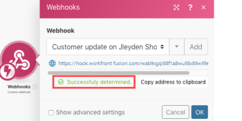

# Webhooks

*Adobe Workfront Fusion* requires an *Adobe Workfront Fusion* license in addition to an *Adobe Workfront* license.

## Creating Custom Webhooks

>[!NOTE]
>
>To call a third party webhook (outgoing webhooks) use one of the [HTTP](http-modules.md) modules.

Any application that is connected to the Internet and allows the sending of HTTP requests can send webhooks to *Adobe Workfront Fusion*. To connect such an app to *Workfront Fusion*, add the `Webhooks > Custom Webhook` instant trigger module to your scenario. When setting this trigger, click the `Add` button next to the Webhook field and enter a name for the new webhook.


>[!NOTE]
>
>Once you create a webhook, you can use it in more than one scenario at the same time. Each scenario may contain different modules and have a different schedule. The data is duplicated, that's why the individual scenarios do not influence each other.

## Determine the webhook's data structure

Once you create a webhook, you will see a unique URL that *Workfront Fusion* will listen for. The data sent to this address is first validated and then passed on for processing in the scenario. To enable the option to map items outputted from the webhook, *Workfront Fusion* needs to determine the data structure of the incoming payload so the other modules know what to expect from the webhook. That's why *Workfront Fusion* will ask you to send sample data to the displayed address.

There are two ways to supply the sample data:

* Generate a webhook in the given service/app where you have registered the webhook. Make a certain change in the service or app that will make the service or app call the webhook. For example, you could remove a file. 
* Send the sample data via the HTTP > Make a request module.

To use the second option:

<ol> 
 <li value="1"> <p>Create a new scenario with the HTTP > Make a request module and set it up like this:</p> 
  <table cellspacing="0"> 
   <col> 
   <col> 
   <tbody> 
    <tr> 
     <td role="rowheader"> <p>URL </p> </td> 
     <td>url of the webhook</td> 
    </tr> 
    <tr> 
     <td role="rowheader">Method </td> 
     <td> <p>POST</p> </td> 
    </tr> 
    <tr> 
     <td role="rowheader">Body type</td> 
     <td> <p> Raw</p> </td> 
    </tr> 
    <tr> 
     <td role="rowheader">Content type</td> 
     <td> <p> JSON (application/json)</p> </td> 
    </tr> 
    <tr> 
     <td role="rowheader">Request content</td> 
     <td> <p> raw JSON expected in the webhook</p> </td> 
    </tr> 
   </tbody> 
  </table> <p>  </p> </li> 
 <li value="2"> <p>Have both scenarios (the one with the HTTP module and the one with the Webhooks module) open in separate browser tabs/windows. Open the scenario with the Webhooks module and click <span class="bold">Redetermine data structure</span> button to make <em>Workfront Fusion</em> listen for the data (you don't have to unlink other modules, the data won't be used anywhere).</p> <p>  </p> </li> 
 <li value="3">Switch to the scenario with the HTTP module and run it.</li> 
 <li value="4"> <p>Switch back to the scenario with the Webhooks module. </p> <p>The data structure of the webhook should be determined and you should see a "Successfully determined" message .</p> <p>  </p> </li> 
 <li value="5"> <p>Click <span class="bold">OK</span> to save the data structure.</p> <p>The webhook's items should be now available in the mapping panel for mapping to fields in the configuration of modules connected after the Webhooks module.</p> <p>  </p> </li> 
</ol>

## Queue

At the moment of delivering a webhook notification, there must be at least one scenario that listens for this webhook data. If the scenario is not active, the data is stored in the queue. Once you activate the scenario, all bundles waiting in the queue will be processed sequentially.

` `**Warning: **``Webhook queues are shared among scenarios that employ the same webhook. If one of the scenarios is disabled, the queue will be filling up with incoming webhooks.

## Supported Incoming Data Formats

*Workfront Fusion* supports 3 formats of incoming data - Query String, Form Data and JSON. *Workfront Fusion* validates all incoming data against the selected data structure and then depending on the settings of the scenario, the data is either stored in the queue for processing or processed immediately.

If any part of the data does not pass the validation, *Workfront Fusion* returns a 400 HTTP status code and specifies in the body of the HTTP response the reason why the incoming data failed the validation checks. If the validation of the incoming data succeeds, *Workfront Fusion* returns a 200 Accepted' status in response.

<!--
<h3 data-mc-conditions="QuicksilverOrClassic.Draft mode">Query String</h3>
-->

### Query String

<!--
<pre data-mc-conditions="QuicksilverOrClassic.Draft mode">GET https://hook.integromat.com/yourunique32characterslongstring?name=Integromat&job=automate</pre>
-->

<pre data-mc-conditions="QuicksilverOrClassic.Draft mode">GET https://hook.integromat.com/yourunique32characterslongstring?name=Integromat&job=automate</pre>

<!--
<h3 data-mc-conditions="QuicksilverOrClassic.Draft mode">Form Data</h3>
-->

### Form Data

<!--
<pre data-mc-conditions="QuicksilverOrClassic.Draft mode">POST https://hook.integromat.com/yourunique32characterslongstring</pre>
-->

<pre data-mc-conditions="QuicksilverOrClassic.Draft mode">POST https://hook.integromat.com/yourunique32characterslongstring</pre>

<!--
<pre data-mc-conditions="QuicksilverOrClassic.Draft mode">Content-Type: application/x-www-form-urlencoded</pre>
-->

<pre data-mc-conditions="QuicksilverOrClassic.Draft mode">Content-Type: application/x-www-form-urlencoded</pre>

<!--
<pre data-mc-conditions="QuicksilverOrClassic.Draft mode">name=Integrobot&job=automate</pre>
-->

<pre data-mc-conditions="QuicksilverOrClassic.Draft mode">name=Integrobot&job=automate</pre>

<!--
<h3 data-mc-conditions="QuicksilverOrClassic.Draft mode">Multipart</h3>
-->

### Multipart

<!--
<pre data-mc-conditions="QuicksilverOrClassic.Draft mode">POST https://hook.integromat.com/yourunique32characterslongstring</pre>
-->

<pre data-mc-conditions="QuicksilverOrClassic.Draft mode">POST https://hook.integromat.com/yourunique32characterslongstring</pre>

<!--
<pre data-mc-conditions="QuicksilverOrClassic.Draft mode">Content-Type: multipart/form-data; boundary=---generatedboundary</pre>
-->

<pre data-mc-conditions="QuicksilverOrClassic.Draft mode">Content-Type: multipart/form-data; boundary=---generatedboundary</pre>

<!--
<pre data-mc-conditions="QuicksilverOrClassic.Draft mode">---generatedboundary</pre>
-->

<pre data-mc-conditions="QuicksilverOrClassic.Draft mode">---generatedboundary</pre>

<!--
<pre data-mc-conditions="QuicksilverOrClassic.Draft mode">Content-Disposition: form-data; name="file"; filename="file.txt"</pre>
-->

<pre data-mc-conditions="QuicksilverOrClassic.Draft mode">Content-Disposition: form-data; name="file"; filename="file.txt"</pre>

<!--
<pre data-mc-conditions="QuicksilverOrClassic.Draft mode">Content-Type: text/plain</pre>
-->

<pre data-mc-conditions="QuicksilverOrClassic.Draft mode">Content-Type: text/plain</pre>

<!--
<pre data-mc-conditions="QuicksilverOrClassic.Draft mode">Content of file.txt</pre>
-->

<pre data-mc-conditions="QuicksilverOrClassic.Draft mode">Content of file.txt</pre>

<!--
<pre data-mc-conditions="QuicksilverOrClassic.Draft mode">---generatedboundary</pre>
-->

<pre data-mc-conditions="QuicksilverOrClassic.Draft mode">---generatedboundary</pre>

<!--
<pre data-mc-conditions="QuicksilverOrClassic.Draft mode">Content-Disposition: form-data; name="name"</pre>
-->

<pre data-mc-conditions="QuicksilverOrClassic.Draft mode">Content-Disposition: form-data; name="name"</pre>

<!--
<pre data-mc-conditions="QuicksilverOrClassic.Draft mode">Workfont Fusion</pre>
-->

<pre data-mc-conditions="QuicksilverOrClassic.Draft mode">Workfont Fusion</pre>

<!--
<pre data-mc-conditions="QuicksilverOrClassic.Draft mode">---generatedboundary</pre>
-->

<pre data-mc-conditions="QuicksilverOrClassic.Draft mode">---generatedboundary</pre>

<!--
<p data-mc-conditions="QuicksilverOrClassic.Draft mode">In order to receive files encoded with <code>multipart/form-data</code>, it is necessary to configure a data structure with a <code>collection</code> type field that contains the nested fields <code>name</code>, <code>mime</code> and <code>data</code>. The field <code>name</code> is a <code>text</code> type and contains the name of the uploaded file. The <code>mime</code> is a <code>text</code> type and contains a file in the [MIME] format (https://en.wikipedia.org/wiki/MIME). The field <code>data</code> is a <code>buffer</code> type and contains binary data for the file being transferred.</p>
-->

In order to receive files encoded with 

```
multipart/form-data
```

, it is necessary to configure a data structure with a 

```
collection
```

type field that contains the nested fields 

```
name
```

, 

```
mime
```

and 

```
data
```

. The field 

```
name
```

is a 

```
text
```

type and contains the name of the uploaded file. The 

```
mime
```

is a 

```
text
```

type and contains a file in the [MIME] format (https://en.wikipedia.org/wiki/MIME). The field 

```
data
```

is a 

```
buffer
```

type and contains binary data for the file being transferred.

<!--
<h3 data-mc-conditions="QuicksilverOrClassic.Draft mode">JSON</h3>
-->

### JSON

<!--
<pre data-mc-conditions="QuicksilverOrClassic.Draft mode">POST https://hook.integromat.com/yourunique32characterslongstring</pre>
-->

<pre data-mc-conditions="QuicksilverOrClassic.Draft mode">POST https://hook.integromat.com/yourunique32characterslongstring</pre>

<!--
<pre data-mc-conditions="QuicksilverOrClassic.Draft mode">Content-Type: application/json</pre>
-->

<pre data-mc-conditions="QuicksilverOrClassic.Draft mode">Content-Type: application/json</pre>

<!--
<pre data-mc-conditions="QuicksilverOrClassic.Draft mode">{"name": "Integrobot", "job": "automate"}</pre>
-->

<pre data-mc-conditions="QuicksilverOrClassic.Draft mode">{"name": "Integrobot", "job": "automate"}</pre>
` `**Tip: **`` If you want to access the original JSON, open the webhook's settings and enable the JSON pass-through option.


## Webhook headers

To access the webhook's headers, enable the Get request headers option in the webhook's setup.


You can than extract a particular header value with the combination of 

```
map()
```

& 

```
get()
```

functions. The example below shows a formula that extracts the value of the 

```
authorization
```

header from the 

```
Headers[]
```

array. The formula is used in a filter that compares the extracted value with the given text to pass only webhooks if there is a match.


For further information on obtaining an array's element with a given key, see [Map an array's element with a given key](../../workfront-fusion/mapping/map-information-between-modules.md#mapping) in the article [Map information from one module to another](../../workfront-fusion/mapping/map-information-between-modules.md).

## Responding to webhooks

The default response to a webhook call contains just a simple text, "Accepted" and the response is returned to the webhook's caller right away during the execution of the Custom Webhook module. You can easily test it like this:

1. Place the Custom Webhook module in your scenario.
1. Add a new webhook in the module's configuration.
1. Copy the webhook's URL to your clipboard.
1. Run the scenario - the Custom Webhook module should be waiting for the webhook call (see on the right)
1. Open a new browser window, paste the copied URL in the address bar and press `Enter`.

   The Custom Webhook module is triggered and the browser will display a new page.

1. If you want to customize the webhook's response, employ the module Webhook Response.

   The configuration of the module contains two fields: Status and Body. The Status field should contain [HTTP response status codes](https://en.wikipedia.org/wiki/List_of_HTTP_status_codes) like 2xx for Success (for example, 

   ```
   200
   ```

   for OK), 3xx for Redirection (for example, 

   ```
   307
   ```

   for Temporary Redirect), 4xx for Client errors (for example, 

   ```
   400
   ```

   for Bad Request), and so on. The Body field should contain anything that will be accepted by the webhook's call. It can be a simple text, HTML, XML, JSON, and so on. It is advisable to set the 

   ```
   Content-Type
   ```

   header to the corresponding mime type: 

   ```
   text/plain
   ```

   for plain text, 

   ```
   text/html
   ```

   for HTML, 

   ```
   application/json
   ```

   for JSON, 

   ```
   application/xml
   ```

   for XML, and so on.

   Timeout for sending a response is 40 seconds. If the response is not available within that period, *Workfront Fusion* returns a '200 Accepted' status.

### HTML Response example

Configure the Webhook Response module as follows:

<table cellspacing="0"> 
 <col> 
 <col> 
 <tbody> 
  <tr> 
   <td role="rowheader">Status </td> 
   <td> <p>2xx success HTTP status code, e.g. 200</p> </td> 
  </tr> 
  <tr> 
   <td role="rowheader">Body </td> 
   <td> <p>HTML code</p> </td> 
  </tr> 
  <tr> 
   <td role="rowheader"> <p>Custom headers</p> </td> 
   <td> 
    <ul> 
     <li><span class="bold">Key</span>: Content-type</li> 
     <li><span class="bold">Value</span>: text/html</li> 
    </ul> </td> 
  </tr> 
 </tbody> 
</table>


It will produce an HTML response that will be displayed like this in a web browser:


### Redirect example

Configure the Webhook Response module as follows:

<table cellspacing="0"> 
 <col> 
 <col> 
 <tbody> 
  <tr> 
   <td role="rowheader">Status </td> 
   <td> <p>3xx redirection HTTP status code, e.g. 303</p> </td> 
  </tr> 
  <tr> 
   <td role="rowheader"> <p>Custom headers</p> </td> 
   <td> 
    <ul> 
     <li><span class="bold">Key</span>: Location</li> 
     <li><span class="bold">Value</span>: The URL you would like to redirect to.</li> 
    </ul> </td> 
  </tr> 
 </tbody> 
</table>


## Troubleshooting

### Missing items in the mapping panel

If some items are missing in the mapping panel in the setup of the modules following the Webhooks > Custom Webhook module, click on the `Webhooks > Custom Webhook` module to open its setup and click the `Re-determine data structure` button:


Then follow the steps described in the section [Determine the webhook's data structure](#determin) in this article.
