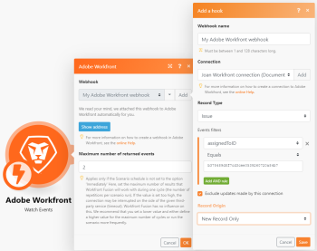
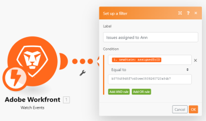

# *`Adobe Workfront`* modules {#adobe-workfront-modules}

You can use the *`Adobe Workfront`* connector to automate your processes within *`Workfront`*. If you have a *`Workfront Fusion for Work Automation and Integration`* license, you can also use it to connect to third-party apps and services.


The *`Workfront`* connector does not count against the number of active apps available to your organization. All scenarios, even if they use only the *`Workfront`* app, do count against your organization's total scenario count.


For more information on your organization's available apps and scenarios, see [Organizations](organizations-and-teams.md#organiza2) in [Adobe Workfront Fusion organizations and teams](organizations-and-teams.md).


If you need instructions on creating a scenario, see [Create a scenario](create-a-scenario.md). For information about modules, see [Modules in Adobe Workfront Fusion](_modules.md).


## Access requirements {#access-requirements}

You must have the following access to use the functionality in this article:

<table style="width: 100%;margin-left: 0;margin-right: auto;mc-table-style: url('../../Resources/TableStyles/TableStyle-List-options-in-steps.css');" class="TableStyle-TableStyle-List-options-in-steps" cellspacing="0"> 
 <col class="TableStyle-TableStyle-List-options-in-steps-Column-Column1"> 
 <col class="TableStyle-TableStyle-List-options-in-steps-Column-Column2"> 
 <tbody> 
  <tr class="TableStyle-TableStyle-List-options-in-steps-Body-LightGray"> 
   <td class="TableStyle-TableStyle-List-options-in-steps-BodyE-Column1-LightGray" role="rowheader"><span class="mc-variable WFVariables.FullProdNameWF variable varname">Adobe Workfront</span> plan*</td> 
   <td class="TableStyle-TableStyle-List-options-in-steps-BodyD-Column2-LightGray"> <p><span class="mc-variable WFVariables.WFPlan-Pro variable varname">Pro</span> or higher</p> </td> 
  </tr> 
  <tr class="TableStyle-TableStyle-List-options-in-steps-Body-MediumGray"> 
   <td class="TableStyle-TableStyle-List-options-in-steps-BodyE-Column1-MediumGray" role="rowheader"><span class="mc-variable WFVariables.FullProdNameWFF variable varname">Adobe Workfront Fusion</span> license**</td> 
   <td class="TableStyle-TableStyle-List-options-in-steps-BodyD-Column2-MediumGray"> <p><span class="mc-variable WFVariables.WFFusionIntegration variable varname">Workfront Fusion for Work Automation and Integration</span> </p> <p data-mc-conditions="SnippetConditions.HIDE"><span class="mc-variable WFVariables.WFFusionAutomation variable varname">Workfront Fusion for Work Automation</span> </p> </td> 
  </tr> 
  <tr class="TableStyle-TableStyle-List-options-in-steps-Body-LightGray"> 
   <td class="TableStyle-TableStyle-List-options-in-steps-BodyB-Column1-LightGray" role="rowheader">Product</td> 
   <td class="TableStyle-TableStyle-List-options-in-steps-BodyA-Column2-LightGray">Your organization must purchase <span class="mc-variable WFVariables.FullProdNameWFF variable varname">Adobe Workfront Fusion</span> as well as <span class="mc-variable WFVariables.FullProdNameWF variable varname">Adobe Workfront</span> to use functionality described in this article.</td> 
  </tr> 
 </tbody> 
</table>

&#42;To find out what plan, license type, or access you have, contact your *`Workfront administrator`*.


## Connect *`Workfront`* to *`Workfront Fusion`* {#connect-workfront-to-workfront-fusion}

The Workfront connector uses OAuth 2.0 to connect to *`Workfront`*. 


You can create a connection to your *`Workfront`* account directly from inside a *`Workfront Fusion`* module.


1.  In any Workfront app module, click `Add`next to the Connection box.
1.  Enter the name of your instance into the URL. Example: 

   ```
   https://<your instance>.my.workfront.com
   ```

   .
1.  Click `Next`.
1.  Click `SAML log in` to create the connection and go back to the module.


   Or


   Enter your Username and Password, then click `Log in` to create the connection and go back to the module.


   >[!NOTE]
   >
   >
   >    
   >    
   >    *  If you do not see a SAML log in button, your organization has not enabled Single Sign-On (SSO). You can log in with your Username and Password.
   >    
   >    
   >      For more information on SSO, see [Overview of single sign-on in Adobe Workfront](sso-in-workfront.md)
   >    
   >    *  OAuth 2.0 connections to the Workfront API no longer rely on API keys. 
   >    
   >    


## *`Workfront`* modules and their fields {#workfront-modules-and-their-fields}

When you configure *`Workfront`* modules, *`Workfront Fusion`* displays the fields listed below. Along with these, additional *`Workfront`* fields might display, depending on factors such as your access level in the app or service. A bolded title in a module indicates a required field.


If you see the map button above a field or function, you can use it to set variables and functions for that field. For more information, see [Map information from one module to another](map-information-between-modules.md).


*  [Triggers](#triggers) 
*  [Actions](#actions) 
*  [Searches](#searches) 


### Triggers {#triggers}


*  [Watch Events](#watch3) 
*  [Watch Record](#watch) 
*  [Watch Field](#watch2) 


#### Watch Events {#watch-events}

This trigger module executes a scenario in real time when objects of a specific type are added, updated, or deleted in *`Workfront`*


The module returns any standard fields associated with the record`<MadCap:conditionalText data-mc-conditions="SnippetConditions.HIDE">  or records</MadCap:conditionalText>`, along with any custom fields and values that the connection accesses. You can map *`this information`* in subsequent modules in the scenario.


1. Click `Add` to the right of the `Webhook` box.

1.  Configure the webhook in the `Add a hook` box that displays.


   When you are configuring this module, the following fields display`<MadCap:conditionalText data-mc-conditions="SnippetConditions.HIDE"> , along with any other available  <span class="mc-variable Snippet_Variables.Fusion-Apps variable varname">Workfront</span> fields, depending on the connection and options you choose</MadCap:conditionalText>`.

<table class="TableStyle-TableStyle-List-options-in-steps"> 
 <col class="TableStyle-TableStyle-List-options-in-steps-Column-Column1"> 
 <col class="TableStyle-TableStyle-List-options-in-steps-Column-Column2"> 
 <tbody> 
  <tr class="TableStyle-TableStyle-List-options-in-steps-Body-LightGray"> 
   <td class="TableStyle-TableStyle-List-options-in-steps-BodyE-Column1-LightGray">Webhook name</td> 
   <td class="TableStyle-TableStyle-List-options-in-steps-BodyD-Column2-LightGray">(Optional) Type a new name for the webhook</td> 
  </tr> 
  <tr class="TableStyle-TableStyle-List-options-in-steps-Body-MediumGray"> 
   <td class="TableStyle-TableStyle-List-options-in-steps-BodyE-Column1-MediumGray">Connection</td> 
   <td class="TableStyle-TableStyle-List-options-in-steps-BodyD-Column2-MediumGray"> <p>For instructions about connecting your <span class="mc-variable WFVariables.ProdNameWF variable varname">Workfront</span> app to <span class="mc-variable WFVariables.ProdNameWFF variable varname">Workfront Fusion</span>, see <a href="#connect" class="MCXref xref">Connect Workfront to Workfront Fusion</a> in this article.</p> </td> 
  </tr> 
  <tr class="TableStyle-TableStyle-List-options-in-steps-Body-LightGray"> 
   <td class="TableStyle-TableStyle-List-options-in-steps-BodyE-Column1-LightGray">Record Type</td> 
   <td class="TableStyle-TableStyle-List-options-in-steps-BodyD-Column2-LightGray">Select the type of <span class="mc-variable Snippet_Variables.Fusion-Apps variable varname">Workfront</span> record that you want the module to <span class="mc-variable Snippet_Variables.FusionAction variable varname">watch</span>.</td> 
  </tr> 
  <tr class="TableStyle-TableStyle-List-options-in-steps-Body-LightGray" data-mc-conditions=""> 
   <td class="TableStyle-TableStyle-List-options-in-steps-BodyE-Column1-LightGray"> <p>Events filters</p> </td> 
   <td class="TableStyle-TableStyle-List-options-in-steps-BodyD-Column2-LightGray"> <p>You can set filters to watch for only records that meet criteria you select.</p> <p>For each filter, enter the field you want the filter to evaluate, the operator, and the value that you want the filter to allow. You can use more than one filter by adding AND rules.</p> <p>Note: You cannot edit filters in existing Workfront webhooks. To set up different filters for Workfront event subscriptions, remove the current webhook and create a new one.</p> <p>For more information on event filters, see <a href="#event" class="MCXref xref">Event subscription filters in the Workfront &gt; Watch Events modules</a> in this article.</p> </td> 
  </tr> 
  <tr class="TableStyle-TableStyle-List-options-in-steps-Body-MediumGray" data-mc-conditions=""> 
   <td class="TableStyle-TableStyle-List-options-in-steps-BodyB-Column1-MediumGray">Exclude events made by this connection</td> 
   <td class="TableStyle-TableStyle-List-options-in-steps-BodyA-Column2-MediumGray">Enable this option to exclude events created or updated using the same connector that this trigger module uses. This can prevent situations where a scenario might trigger itself, causing it to repeat in an endless loop.</td> 
  </tr> 
  <tr class="TableStyle-TableStyle-List-options-in-steps-Body-MediumGray"> 
   <td class="TableStyle-TableStyle-List-options-in-steps-BodyB-Column1-MediumGray">Record Origin</td> 
   <td class="TableStyle-TableStyle-List-options-in-steps-BodyA-Column2-MediumGray"> <p>Choose whether you want the scenario to watch <span class="bold">New Records Only</span>, <span class="bold">Updated Records Only</span>, <span class="bold">New and Updated Records</span>, or <span class="bold">Deleted Records Only</span>.</p> <p>Note: If you choose <span class="bold">New and Updated Records</span>, the webhook creation creates 2 event subscriptions (for the same webhook address).</p> </td> 
  </tr> 
 </tbody> 
</table>


Once the webhook is created, you should be able to view the address of the endpoint that events are sent to.


For more information, see the section [Examples of Event Payloads](event-subs-api.md#examples-of-event-payloads) in the Workfront Help article [Event Subscription API](event-subs-api.md).


See a list of the *`Workfront`* objects types for which you can use this module in [Object types available for each Workfront trigger module](#object).


#### Watch Field {#watch-field}

This trigger module executes a scenario when *`a field that you specify is updated`*`<MadCap:conditionalText data-mc-conditions="SnippetConditions.HIDE">  in  <span class="mc-variable Snippet_Variables.Fusion-Apps variable varname">Workfront</span></MadCap:conditionalText>`. The module *`returns both the old and the new value of the field you specify`*. You can map *`this information`* in subsequent modules in the scenario.


When you are configuring this module, the following fields display`<MadCap:conditionalText data-mc-conditions="SnippetConditions.HIDE"> , along with any other available  <span class="mc-variable Snippet_Variables.Fusion-Apps variable varname">Workfront</span> fields, depending on the connection and options you choose</MadCap:conditionalText>`.

<table class="TableStyle-TableStyle-List-options-in-steps"> 
 <col class="TableStyle-TableStyle-List-options-in-steps-Column-Column1"> 
 <col class="TableStyle-TableStyle-List-options-in-steps-Column-Column2"> 
 <tbody> 
  <tr class="TableStyle-TableStyle-List-options-in-steps-Body-LightGray"> 
   <td class="TableStyle-TableStyle-List-options-in-steps-BodyE-Column1-LightGray">Connection</td> 
   <td class="TableStyle-TableStyle-List-options-in-steps-BodyD-Column2-LightGray"> <p>For instructions about connecting your <span class="mc-variable WFVariables.ProdNameWF variable varname">Workfront</span> app to <span class="mc-variable WFVariables.ProdNameWFF variable varname">Workfront Fusion</span>, see <a href="#connect" class="MCXref xref">Connect Workfront to Workfront Fusion</a> in this article.</p> </td> 
  </tr> 
  <tr class="TableStyle-TableStyle-List-options-in-steps-Body-MediumGray"> 
   <td class="TableStyle-TableStyle-List-options-in-steps-BodyE-Column1-MediumGray">Record Type</td> 
   <td class="TableStyle-TableStyle-List-options-in-steps-BodyD-Column2-MediumGray"> <p>Select the type of <span class="mc-variable Snippet_Variables.Fusion-Apps variable varname">Workfront</span> record that you want the module to <span class="mc-variable Snippet_Variables.FusionAction variable varname">watch</span>.</p> <p>For example, select Task if you want to start executing the scenario each time a record field is updated in a task.</p> </td> 
  </tr> 
  <tr class="TableStyle-TableStyle-List-options-in-steps-Body-LightGray"> 
   <td class="TableStyle-TableStyle-List-options-in-steps-BodyE-Column1-LightGray">Field</td> 
   <td class="TableStyle-TableStyle-List-options-in-steps-BodyD-Column2-LightGray">Select the field that you want the module to watch for updates. These fields reflect the fields that your Workfront administrator has set up for tracking.</td> 
  </tr> 
  <tr class="TableStyle-TableStyle-List-options-in-steps-Body-MediumGray"> 
   <td class="TableStyle-TableStyle-List-options-in-steps-BodyE-Column1-MediumGray">Outputs</td> 
   <td class="TableStyle-TableStyle-List-options-in-steps-BodyD-Column2-MediumGray">Select the information you want included in the output bundle for this module.</td> 
  </tr> 
  <tr class="TableStyle-TableStyle-List-options-in-steps-Body-LightGray"> 
   <td class="TableStyle-TableStyle-List-options-in-steps-BodyB-Column1-LightGray">Limit</td> 
   <td class="TableStyle-TableStyle-List-options-in-steps-BodyA-Column2-LightGray"> <p>Enter or map the maximum number of <span class="mc-variable Snippet_Variables.Fusion-Record variable varname">record</span>s you want the module to <span class="mc-variable Snippet_Variables.FusionAction variable varname">return</span> during each scenario execution cycle.</p> </td> 
  </tr> 
 </tbody> 
</table>

See a list of the *`Workfront`* objects types for which you can use this module in [Object types available for each Workfront trigger module](#object).


#### Watch Record {#watch-record}

This trigger module executes a scenario when *`objects of a specific type are added, updated, or both`*`<MadCap:conditionalText data-mc-conditions="SnippetConditions.HIDE">  in  <span class="mc-variable Snippet_Variables.Fusion-Apps variable varname">Workfront</span></MadCap:conditionalText>`. The module *`returns all standard fields associated with the record or records, along with any custom fields and values that the connection accesses`*. You can map *`this information`* in subsequent modules in the scenario. In the output, the module indicates whether each record is new or updated. 


Records that were both added and updated in the given time period are returned as new records.


When you are configuring this module, the following fields display`<MadCap:conditionalText data-mc-conditions="SnippetConditions.HIDE"> , along with any other available  <span class="mc-variable Snippet_Variables.Fusion-Apps variable varname">Workfront</span> fields, depending on the connection and options you choose</MadCap:conditionalText>`.

<table class="TableStyle-TableStyle-List-options-in-steps" style="margin-left: 0;margin-right: auto;mc-table-style: url('../../Resources/TableStyles/TableStyle-List-options-in-steps.css');" cellspacing="0"> 
 <col class="TableStyle-TableStyle-List-options-in-steps-Column-Column1"> 
 <col class="TableStyle-TableStyle-List-options-in-steps-Column-Column2"> 
 <tbody> 
  <tr class="TableStyle-TableStyle-List-options-in-steps-Body-LightGray"> 
   <td class="TableStyle-TableStyle-List-options-in-steps-BodyE-Column1-LightGray" role="rowheader">Connection</td> 
   <td class="TableStyle-TableStyle-List-options-in-steps-BodyD-Column2-LightGray"> <p>For instructions about connecting your <span class="mc-variable WFVariables.ProdNameWF variable varname">Workfront</span> app to <span class="mc-variable WFVariables.ProdNameWFF variable varname">Workfront Fusion</span>, see <a href="#connect" class="MCXref xref">Connect Workfront to Workfront Fusion</a> in this article.</p> </td> 
  </tr> 
  <tr class="TableStyle-TableStyle-List-options-in-steps-Body-MediumGray"> 
   <td class="TableStyle-TableStyle-List-options-in-steps-BodyE-Column1-MediumGray" role="rowheader">Filter</td> 
   <td class="TableStyle-TableStyle-List-options-in-steps-BodyD-Column2-MediumGray"> <p>Choose whether you want the scenario to watch <span class="bold">New Records Only</span>, <span class="bold">Updated Records Only</span>, or <span class="bold">New and Updated Records</span>.</p> </td> 
  </tr> 
  <tr class="TableStyle-TableStyle-List-options-in-steps-Body-LightGray"> 
   <td class="TableStyle-TableStyle-List-options-in-steps-BodyE-Column1-LightGray" role="rowheader">Record Type</td> 
   <td class="TableStyle-TableStyle-List-options-in-steps-BodyD-Column2-LightGray"> <p>(Displays after you choose a <span class="bold">Filter</span>.) Select the type of <span class="mc-variable Snippet_Variables.Fusion-Apps variable varname">Workfront</span> record that you want the module to <span class="mc-variable Snippet_Variables.FusionAction variable varname">watch</span>.</p> <p>For example, if you want to start the scenario each time a new Project is created, select Project</p> </td> 
  </tr> 
  <tr class="TableStyle-TableStyle-List-options-in-steps-Body-MediumGray"> 
   <td class="TableStyle-TableStyle-List-options-in-steps-BodyE-Column1-MediumGray" role="rowheader">Outputs</td> 
   <td class="TableStyle-TableStyle-List-options-in-steps-BodyD-Column2-MediumGray"> <p>Select the information you want included in the output bundle for this module.</p> </td> 
  </tr> 
  <tr class="TableStyle-TableStyle-List-options-in-steps-Body-LightGray"> 
   <td class="TableStyle-TableStyle-List-options-in-steps-BodyE-Column1-LightGray" role="rowheader">Optional Filter</td> 
   <td class="TableStyle-TableStyle-List-options-in-steps-BodyD-Column2-LightGray"> <p>(Advanced) Type an API code string to define any additional parameters or code that will refine your criteria. </p> </td> 
  </tr> 
  <tr class="TableStyle-TableStyle-List-options-in-steps-Body-MediumGray"> 
   <td class="TableStyle-TableStyle-List-options-in-steps-BodyB-Column1-MediumGray" role="rowheader">Limit</td> 
   <td class="TableStyle-TableStyle-List-options-in-steps-BodyA-Column2-MediumGray"> <p>Enter or map the maximum number of <span class="mc-variable Snippet_Variables.Fusion-Record variable varname">record</span>s you want the module to <span class="mc-variable Snippet_Variables.FusionAction variable varname">return</span> during each scenario execution cycle.</p> </td> 
  </tr> 
 </tbody> 
</table>

See a list of the *`Workfront`* objects types for which you can use this module in [Object types available for each Workfront trigger module](#object).


### Actions {#actions}


*  [Convert object](#convert) 
*  [Create a record (attaching custom forms)](#create2) 
*  [Create a record (attaching custom forms)](#create2) 
*  [Custom API Call](#custom) 
*  [Delete Record](#delete) 
*  [Download Document](#download) 
*  [Misc Action](#misc) 
*  [Read a Record](#read) 
*  [Update Record](#update2) 
*  [Upload Document](#upload) 


#### Convert object {#convert-object}

This action module makes one of the following conversions:


*  Convert Issue to Project
*  Convert Issue to Task
*  Convert Task to Project


<table class="TableStyle-TableStyle-List-options-in-steps"> 
 <col class="TableStyle-TableStyle-List-options-in-steps-Column-Column1"> 
 <col class="TableStyle-TableStyle-List-options-in-steps-Column-Column2"> 
 <tbody> 
  <tr class="TableStyle-TableStyle-List-options-in-steps-Body-LightGray"> 
   <td class="TableStyle-TableStyle-List-options-in-steps-BodyE-Column1-LightGray">Connection</td> 
   <td class="TableStyle-TableStyle-List-options-in-steps-BodyD-Column2-LightGray"> <p>For instructions about connecting your <span class="mc-variable WFVariables.ProdNameWF variable varname">Workfront</span> app to <span class="mc-variable WFVariables.ProdNameWFF variable varname">Workfront Fusion</span>, see <a href="#connect" class="MCXref xref">Connect Workfront to Workfront Fusion</a> in this article.</p> </td> 
  </tr> 
  <tr class="TableStyle-TableStyle-List-options-in-steps-Body-MediumGray" data-mc-conditions=""> 
   <td class="TableStyle-TableStyle-List-options-in-steps-BodyE-Column1-MediumGray">Object type</td> 
   <td class="TableStyle-TableStyle-List-options-in-steps-BodyD-Column2-MediumGray"> <p>Select the type of object that you want to convert. This is the type that the object has before the conversion.</p> </td> 
  </tr> 
  <tr class="TableStyle-TableStyle-List-options-in-steps-Body-LightGray" data-mc-conditions=""> 
   <td class="TableStyle-TableStyle-List-options-in-steps-BodyB-Column1-LightGray">Convert to</td> 
   <td class="TableStyle-TableStyle-List-options-in-steps-BodyA-Column2-LightGray">Select the object that you want to convert it to. This is the type that the object has after the conversion.</td> 
  </tr> 
  <tr class="TableStyle-TableStyle-List-options-in-steps-Body-LightGray"> 
   <td class="TableStyle-TableStyle-List-options-in-steps-BodyB-Column1-LightGray">&lt;Object&gt; ID</td> 
   <td class="TableStyle-TableStyle-List-options-in-steps-BodyA-Column2-LightGray"> <p>Enter the object's ID. </p> <p>Note: When entering the ID&nbsp;of an object, you can begin typing the name of the object, then select it from the list. The module then enters the appropriate ID into the field.</p> </td> 
  </tr> 
  <tr class="TableStyle-TableStyle-List-options-in-steps-Body-LightGray" data-mc-conditions=""> 
   <td class="TableStyle-TableStyle-List-options-in-steps-BodyB-Column1-LightGray">Template ID</td> 
   <td class="TableStyle-TableStyle-List-options-in-steps-BodyA-Column2-LightGray"> <p>If you are converting to a project, select the Template ID&nbsp;that you want to use for the project.</p> <p>Note: When entering the ID&nbsp;of an object, you can begin typing the name of the object, then select it from the list. The module then enters the appropriate ID into the field.</p> </td> 
  </tr> 
  <tr class="TableStyle-TableStyle-List-options-in-steps-Body-LightGray" data-mc-conditions=""> 
   <td class="TableStyle-TableStyle-List-options-in-steps-BodyB-Column1-LightGray">Custom forms</td> 
   <td class="TableStyle-TableStyle-List-options-in-steps-BodyA-Column2-LightGray">Select any custom forms that you want to add to the newly converted object, then enter values for the custom form's fields.</td> 
  </tr> 
  <tr class="TableStyle-TableStyle-List-options-in-steps-Body-LightGray" data-mc-conditions=""> 
   <td class="TableStyle-TableStyle-List-options-in-steps-BodyB-Column1-LightGray">Options</td> 
   <td class="TableStyle-TableStyle-List-options-in-steps-BodyA-Column2-LightGray"> <p>Enable any options you want when converting the object. Options are available depending on which object you are converting to or from.</p> </td> 
  </tr> 
 </tbody> 
</table>


#### Create a record (attaching custom forms) {#create-a-record-attaching-custom-forms}

This action module creates an object, such as a project, task, or issue in *`Workfront`*, and allows you to add a custom form to the new object. The module allows you to select which of the object's fields are available in the module.


You specify the`<MadCap:conditionalText data-mc-conditions="SnippetConditions.HIDE">  type and</MadCap:conditionalText>` ID of the *`record`*.


The module returns the ID of the `<MadCap:conditionalText data-mc-conditions="SnippetConditions.HIDE">  <span class="mc-variable Snippet_Variables.FusionAction variable varname">new</span></MadCap:conditionalText>` *`record`* and any associated fields, along with any custom fields and values that the connection accesses. You can map *`this information`* in subsequent modules in the scenario.


You could use this module, for example, to create a task in *`Workfront`* when a client adds a new row in a Google Sheets list of tasks that need to be done.


When you are configuring this module, the following fields display`<MadCap:conditionalText data-mc-conditions="SnippetConditions.HIDE"> , along with any other available  <span class="mc-variable Snippet_Variables.Fusion-Apps variable varname">Workfront</span> fields, depending on the connection and options you choose</MadCap:conditionalText>`.


Make sure you provide the minimum number of input fields. For example, if you want to create an issue, you need to provide a valid parent project ID in the Project ID field to indicate where the issue should live in *`Workfront`*. You can use the mapping panel to map this information from another module in your scenario, or you can enter it manually by typing in the name and then selecting it from the list.

<table class="TableStyle-TableStyle-List-options-in-steps"> 
 <col class="TableStyle-TableStyle-List-options-in-steps-Column-Column1"> 
 </col> 
 <col class="TableStyle-TableStyle-List-options-in-steps-Column-Column2"> 
 </col> 
 <tbody> 
  <tr class="TableStyle-TableStyle-List-options-in-steps-Body-LightGray"> 
   <td class="TableStyle-TableStyle-List-options-in-steps-BodyE-Column1-LightGray">Connection</td> 
   <td class="TableStyle-TableStyle-List-options-in-steps-BodyD-Column2-LightGray"> <p>For instructions about connecting your <span class="mc-variable WFVariables.ProdNameWF variable varname">Workfront</span> app to <span class="mc-variable WFVariables.ProdNameWFF variable varname">Workfront Fusion</span>, see <a href="#connect" class="MCXref xref">Connect Workfront to Workfront Fusion</a> in this article.</p> </td> 
  </tr> 
  <tr class="TableStyle-TableStyle-List-options-in-steps-Body-MediumGray"> 
   <td class="TableStyle-TableStyle-List-options-in-steps-BodyB-Column1-MediumGray">Record Type</td> 
   <td class="TableStyle-TableStyle-List-options-in-steps-BodyA-Column2-MediumGray"> <p>Select the type of <span class="mc-variable Snippet_Variables.Fusion-Apps variable varname">Workfront</span> record that you want the module to <span class="mc-variable Snippet_Variables.FusionAction variable varname">create</span>.</p> <p>For example, if you want to <span class="mc-variable Snippet_Variables.FusionAction variable varname">create</span> a Project, select Project from the dropdown list and then make sure that you have access to data (from previous modules in the scenario) that will populate the project.</p> </td> 
  </tr> 
  <tr class="TableStyle-TableStyle-List-options-in-steps-Body-MediumGray" data-mc-conditions=""> 
   <td class="TableStyle-TableStyle-List-options-in-steps-BodyB-Column1-MediumGray">Select fields to map</td> 
   <td class="TableStyle-TableStyle-List-options-in-steps-BodyA-Column2-MediumGray"> <p>Select the fields that you want available for data input. This allows you to use these fields without having to scroll through the ones you don't need.</p> <p>For fields in custom forms, use the <b>Attach Custom Form</b> field.</p> </td> 
  </tr> 
  <tr class="TableStyle-TableStyle-List-options-in-steps-Body-MediumGray" data-mc-conditions=""> 
   <td class="TableStyle-TableStyle-List-options-in-steps-BodyB-Column1-MediumGray">Attach Custom Form</td> 
   <td class="TableStyle-TableStyle-List-options-in-steps-BodyA-Column2-MediumGray">Select any custom forms that you want to add to the new object, then enter values for those fields.</td> 
  </tr> 
 </tbody> 
</table>

See a list of the *`Workfront`* objects types for which you can use this module in [Object types available for each Workfront action module](#object2).


>[!NOTE]
>
>
>
>
>*  When entering the ID&nbsp;of an object, you can begin typing the name of the object, then select it from the list. The module then enters the appropriate ID into the field.
>*  When entering the text for a custom field or a Note object (Comment or reply), you can use HTML tags in the Note Text field to create rich text, such as bold or italic text.
>
>
>  For more information on rich text in updates, see [Add an update to a work item](update-work.md#add) in [Update work](update-work.md).
>
>
>


#### Create Record {#create-record}

This action module creates an object, such as a project, task, or issue in *`Workfront`*. The module allows you to select which of the object's fields are available in the module.


You specify the`<MadCap:conditionalText data-mc-conditions="SnippetConditions.HIDE">  type and</MadCap:conditionalText>` ID of the *`record`*.


The module returns the ID of the `<MadCap:conditionalText data-mc-conditions="SnippetConditions.HIDE">  <span class="mc-variable Snippet_Variables.FusionAction variable varname">new</span></MadCap:conditionalText>` *`record`* and any associated fields, along with any custom fields and values that the connection accesses. You can map *`this information`* in subsequent modules in the scenario.


You could use this module, for example, to create a task in *`Workfront`* when a client adds a new row in a Google Sheets list of tasks that need to be done.


When you are configuring this module, the following fields display`<MadCap:conditionalText data-mc-conditions="SnippetConditions.HIDE"> , along with any other available  <span class="mc-variable Snippet_Variables.Fusion-Apps variable varname">Workfront</span> fields, depending on the connection and options you choose</MadCap:conditionalText>`.


Make sure you provide the minimum number of input fields. For example, if you want to create an issue, you need to provide a valid parent project ID in the Project ID field to indicate where the issue should live in *`Workfront`*. You can use the mapping panel to map this information from another module in your scenario, or you can enter it manually by typing in the name and then selecting it from the list.

<table class="TableStyle-TableStyle-List-options-in-steps"> 
 <col class="TableStyle-TableStyle-List-options-in-steps-Column-Column1"> 
 </col> 
 <col class="TableStyle-TableStyle-List-options-in-steps-Column-Column2"> 
 </col> 
 <tbody> 
  <tr class="TableStyle-TableStyle-List-options-in-steps-Body-LightGray"> 
   <td class="TableStyle-TableStyle-List-options-in-steps-BodyE-Column1-LightGray">Connection</td> 
   <td class="TableStyle-TableStyle-List-options-in-steps-BodyD-Column2-LightGray"> <p>For instructions about connecting your <span class="mc-variable WFVariables.ProdNameWF variable varname">Workfront</span> app to <span class="mc-variable WFVariables.ProdNameWFF variable varname">Workfront Fusion</span>, see <a href="#connect" class="MCXref xref">Connect Workfront to Workfront Fusion</a> in this article.</p> </td> 
  </tr> 
  <tr class="TableStyle-TableStyle-List-options-in-steps-Body-MediumGray"> 
   <td class="TableStyle-TableStyle-List-options-in-steps-BodyB-Column1-MediumGray">Record Type</td> 
   <td class="TableStyle-TableStyle-List-options-in-steps-BodyA-Column2-MediumGray"> <p>Select the type of <span class="mc-variable Snippet_Variables.Fusion-Apps variable varname">Workfront</span> record that you want the module to <span class="mc-variable Snippet_Variables.FusionAction variable varname">create</span>.</p> <p>For example, if you want to <span class="mc-variable Snippet_Variables.FusionAction variable varname">create</span> a Project, select Project from the dropdown list and then make sure that you have access to data (from previous modules in the scenario) that will populate the project.</p> </td> 
  </tr> 
  <tr class="TableStyle-TableStyle-List-options-in-steps-Body-MediumGray" data-mc-conditions=""> 
   <td class="TableStyle-TableStyle-List-options-in-steps-BodyB-Column1-MediumGray">Select fields to map</td> 
   <td class="TableStyle-TableStyle-List-options-in-steps-BodyA-Column2-MediumGray">Select the fields that you want available for data input. This allows you to use these fields without having to scroll through the ones you don't need.</td> 
  </tr> 
 </tbody> 
</table>

See a list of the *`Workfront`* objects types for which you can use this module in [Object types available for each Workfront action module](#object2).


>[!NOTE]
>
>
>
>
>*  When entering the ID&nbsp;of an object, you can begin typing the name of the object, then select it from the list. The module then enters the appropriate ID into the field.
>*  When entering the text for a custom field or a Note object (Comment or reply), you can use HTML tags in the Note Text field to create rich text, such as bold or italic text.
>
>
>  For more information on rich text in updates, see [Add an update to a work item](update-work.md#add) in [Update work](update-work.md).
>
>
>


#### Custom API Call {#custom-api-call}

This action module lets you make a custom authenticated call to the *`Workfront`* API`<MadCap:conditionalText data-mc-conditions="SnippetConditions.HIDE">  without having to think through authentication</MadCap:conditionalText>`. This way, you can create a data flow automation that can't be accomplished by the other *`Workfront`* modules. 


The module returns the following information:


* `Status Code`(number): This indicates the success or failure of your HTTP request. These are standard codes that you can look up on the internet.
*  `Headers`(object): A more detailed context for the response/status code that doesn’t relate to the output body. Not all headers that appear in a response header are response headers, so some might not be useful to you.


  The response headers depend on the HTTP request you chose when configuring the module.

* `Body`(object): Depending on the HTTP request you chose when configuring the module, you may receive some data back. That data, such as the data from a GET request, is contained in this object.


You can map *`this information`* in subsequent modules in the scenario.


When you are configuring this module, the following fields display`<MadCap:conditionalText data-mc-conditions="SnippetConditions.HIDE"> , along with any other available  <span class="mc-variable Snippet_Variables.Fusion-Apps variable varname">Workfront</span> fields, depending on the connection and options you choose</MadCap:conditionalText>`.

<table style="mc-table-style: url('../../Resources/TableStyles/TableStyle-List-options-in-steps.css');" class="TableStyle-TableStyle-List-options-in-steps" cellspacing="0"> 
 <col class="TableStyle-TableStyle-List-options-in-steps-Column-Column1"> 
 <col class="TableStyle-TableStyle-List-options-in-steps-Column-Column2"> 
 <tbody> 
  <tr class="TableStyle-TableStyle-List-options-in-steps-Body-LightGray"> 
   <td class="TableStyle-TableStyle-List-options-in-steps-BodyE-Column1-LightGray" role="rowheader">Connection</td> 
   <td class="TableStyle-TableStyle-List-options-in-steps-BodyD-Column2-LightGray"> <p>For instructions about connecting your <span class="mc-variable WFVariables.ProdNameWF variable varname">Workfront</span> app to <span class="mc-variable WFVariables.ProdNameWFF variable varname">Workfront Fusion</span>, see <a href="#connect" class="MCXref xref">Connect Workfront to Workfront Fusion</a> in this article.</p> </td> 
  </tr> 
  <tr class="TableStyle-TableStyle-List-options-in-steps-Body-MediumGray"> 
   <td class="TableStyle-TableStyle-List-options-in-steps-BodyE-Column1-MediumGray" role="rowheader">URL</td> 
   <td class="TableStyle-TableStyle-List-options-in-steps-BodyD-Column2-MediumGray"> <p>Enter a path relative to<code> https://&lt;WORKFRONT_DOMAIN&gt;/attask/api/&lt;API_VERSION&gt;/</code>.</p> </td> 
  </tr> 
  <tr class="TableStyle-TableStyle-List-options-in-steps-Body-LightGray"> 
   <td class="TableStyle-TableStyle-List-options-in-steps-BodyE-Column1-LightGray" role="rowheader">API Version</td> 
   <td class="TableStyle-TableStyle-List-options-in-steps-BodyD-Column2-LightGray">Select the version of the Workfront API that you want the module to use.</td> 
  </tr> 
  <tr class="TableStyle-TableStyle-List-options-in-steps-Body-MediumGray"> 
   <td class="TableStyle-TableStyle-List-options-in-steps-BodyE-Column1-MediumGray" role="rowheader">Method</td> 
   <td class="TableStyle-TableStyle-List-options-in-steps-BodyD-Column2-MediumGray"> <p>Select the HTTP request method you need to configure the API call. For more information, see <a href="http-request-methods.md" class="MCXref xref" data-mc-variable-override="">HTTP request methods</a>.</p> </td> 
  </tr> 
  <tr class="TableStyle-TableStyle-List-options-in-steps-Body-LightGray"> 
   <td class="TableStyle-TableStyle-List-options-in-steps-BodyE-Column1-LightGray" role="rowheader">Headers</td> 
   <td class="TableStyle-TableStyle-List-options-in-steps-BodyD-Column2-LightGray"> <p>Add the headers of the request in the form of a standard JSON object. This determines the content type of the request.</p> <p>For example,<code> {“Content-type”:“application/json”}</code></p> <p>Note: If you’re getting errors and it's difficult to determine their origin, consider modifying headers based on the Workfront documentation. If your Custom API Call returns a 422 HTTP Request Error, try using a “Content-Type”:“text/plain” header.</p> </td> 
  </tr> 
  <tr class="TableStyle-TableStyle-List-options-in-steps-Body-MediumGray"> 
   <td class="TableStyle-TableStyle-List-options-in-steps-BodyE-Column1-MediumGray" role="rowheader">Query String</td> 
   <td class="TableStyle-TableStyle-List-options-in-steps-BodyD-Column2-MediumGray"> <p>Add the query for the API call in the form of a standard JSON object.</p> <p>For example: <code>{“name”:“something-urgent”}</code></p> <p>Tip: We recommend that you send information through the JSON body rather than as query parameters.</p> </td> 
  </tr> 
  <tr class="TableStyle-TableStyle-List-options-in-steps-Body-LightGray"> 
   <td class="TableStyle-TableStyle-List-options-in-steps-BodyB-Column1-LightGray" role="rowheader">Body</td> 
   <td class="TableStyle-TableStyle-List-options-in-steps-BodyA-Column2-LightGray"> <p>Add the body content for the API call in the form of a standard JSON object.</p> <p>Note:  <p>When using conditional statements such as <code>if</code> in your JSON, put the quotation marks outside of the conditional statement.</p> 
     <div class="example" data-mc-autonum="<b>Example: </b>"> 
      <p>  </p> 
     </div> </p> </td> 
  </tr> 
 </tbody> 
</table>

See a list of the *`Workfront`* objects types for which you can use this module in [Object types available for each Workfront action module](#object2).


#### Delete Record {#delete-record}

This action module deletes an object, such as a project, task, or issue in *`Workfront`*. 


You specify the`<MadCap:conditionalText data-mc-conditions="SnippetConditions.HIDE">  type and</MadCap:conditionalText>` ID of the *`record`*.


The module returns the ID of the `<MadCap:conditionalText data-mc-conditions="SnippetConditions.HIDE">  <span class="mc-variable Snippet_Variables.FusionAction variable varname">deleted</span></MadCap:conditionalText>` *`record`* and any associated fields, along with any custom fields and values that the connection accesses. You can map *`this information`* in subsequent modules in the scenario.


When you are configuring this module, the following fields display`<MadCap:conditionalText data-mc-conditions="SnippetConditions.HIDE"> , along with any other available  <span class="mc-variable Snippet_Variables.Fusion-Apps variable varname">Workfront</span> fields, depending on the connection and options you choose</MadCap:conditionalText>`.

<table class="TableStyle-TableStyle-List-options-in-steps"> 
 <col class="TableStyle-TableStyle-List-options-in-steps-Column-Column1"> 
 <col class="TableStyle-TableStyle-List-options-in-steps-Column-Column2"> 
 <tbody> 
  <tr class="TableStyle-TableStyle-List-options-in-steps-Body-LightGray"> 
   <td class="TableStyle-TableStyle-List-options-in-steps-BodyE-Column1-LightGray">Connection</td> 
   <td class="TableStyle-TableStyle-List-options-in-steps-BodyD-Column2-LightGray"> <p>For instructions about connecting your <span class="mc-variable WFVariables.ProdNameWF variable varname">Workfront</span> app to <span class="mc-variable WFVariables.ProdNameWFF variable varname">Workfront Fusion</span>, see <a href="#connect" class="MCXref xref">Connect Workfront to Workfront Fusion</a> in this article.</p> </td> 
  </tr> 
  <tr class="TableStyle-TableStyle-List-options-in-steps-Body-LightGray"> 
   <td class="TableStyle-TableStyle-List-options-in-steps-BodyE-Column1-LightGray">Force delete</td> 
   <td class="TableStyle-TableStyle-List-options-in-steps-BodyD-Column2-LightGray">Enable this option to ensure that the record is deleted, even if the Workfront UI would request confirmation of the deletion.</td> 
  </tr> 
  <tr class="TableStyle-TableStyle-List-options-in-steps-Body-MediumGray" data-mc-conditions=""> 
   <td class="TableStyle-TableStyle-List-options-in-steps-BodyE-Column1-MediumGray">ID</td> 
   <td class="TableStyle-TableStyle-List-options-in-steps-BodyD-Column2-MediumGray"> <p>Enter the unique <span class="mc-variable WFVariables.ProdNameWF variable varname">Workfront</span> ID of the <span class="mc-variable Snippet_Variables.Fusion-Record variable varname">record</span> that you want the module to delete.</p> <p>To get the ID, open the <span class="mc-variable WFVariables.WFFusion-Apps variable varname">Workfront</span> object in your browser and copy the text at the end of the URL after "ID=." For example: https://my.workfront.com/project/view?ID=<i>5e43010c03286a2a555e1d0a75d6a86e</i></p> </td> 
  </tr> 
  <tr class="TableStyle-TableStyle-List-options-in-steps-Body-LightGray"> 
   <td class="TableStyle-TableStyle-List-options-in-steps-BodyB-Column1-LightGray">Record Type</td> 
   <td class="TableStyle-TableStyle-List-options-in-steps-BodyA-Column2-LightGray">Select the type of <span class="mc-variable Snippet_Variables.Fusion-Apps variable varname">Workfront</span> record that you want the module to <span class="mc-variable Snippet_Variables.FusionAction variable varname">delete</span>.</td> 
  </tr> 
 </tbody> 
</table>

See a list of the *`Workfront`* objects types for which you can use this module in [Object types available for each Workfront action module](#object2).


#### Download Document {#download-document}

This action module downloads a document from *`Workfront`*. 


You specify the`<MadCap:conditionalText data-mc-conditions="SnippetConditions.HIDE">  type and</MadCap:conditionalText>` ID of the *`record`*.


The module returns the document's content, filename, file extension, and file size. You can map *`this information`* in subsequent modules in the scenario.


When you are configuring this module, the following fields display`<MadCap:conditionalText data-mc-conditions="SnippetConditions.HIDE"> , along with any other available  <span class="mc-variable Snippet_Variables.Fusion-Apps variable varname">Workfront</span> fields, depending on the connection and options you choose</MadCap:conditionalText>`.

<table class="TableStyle-TableStyle-List-options-in-steps"> 
 <col class="TableStyle-TableStyle-List-options-in-steps-Column-Column1"> 
 <col class="TableStyle-TableStyle-List-options-in-steps-Column-Column2"> 
 <tbody> 
  <tr class="TableStyle-TableStyle-List-options-in-steps-Body-LightGray"> 
   <td class="TableStyle-TableStyle-List-options-in-steps-BodyE-Column1-LightGray">Connection</td> 
   <td class="TableStyle-TableStyle-List-options-in-steps-BodyD-Column2-LightGray"> <p>For instructions about connecting your <span class="mc-variable WFVariables.ProdNameWF variable varname">Workfront</span> app to <span class="mc-variable WFVariables.ProdNameWFF variable varname">Workfront Fusion</span>, see <a href="#connect" class="MCXref xref">Connect Workfront to Workfront Fusion</a> in this article.</p> </td> 
  </tr> 
  <tr class="TableStyle-TableStyle-List-options-in-steps-Body-MediumGray"> 
   <td class="TableStyle-TableStyle-List-options-in-steps-BodyB-Column1-MediumGray">Document ID</td> 
   <td class="TableStyle-TableStyle-List-options-in-steps-BodyA-Column2-MediumGray"> <p>Map or manually enter the unique <span class="mc-variable WFVariables.ProdNameWF variable varname">Workfront</span> ID of the document that you want the module to download.</p> <p>To get the ID, open the <span class="mc-variable WFVariables.WFFusion-Apps variable varname">Workfront</span> object in your browser and copy the text at the end of the URL after "ID=." For example: https://my.workfront.com/project/view?ID=<i>5e43010c03286a2a555e1d0a75d6a86e</i></p> </td> 
  </tr> 
 </tbody> 
</table>

See a list of the *`Workfront`* objects types for which you can use this module in [Object types available for each Workfront action module](#object2).


#### Misc Action {#misc-action}

This action module lets you perform actions against the API.


When you are configuring this module, the following fields display`<MadCap:conditionalText data-mc-conditions="SnippetConditions.HIDE"> , along with any other available  <span class="mc-variable Snippet_Variables.Fusion-Apps variable varname">Workfront</span> fields, depending on the connection and options you choose</MadCap:conditionalText>`.

<table class="TableStyle-TableStyle-List-options-in-steps"> 
 <col class="TableStyle-TableStyle-List-options-in-steps-Column-Column1"> 
 <col class="TableStyle-TableStyle-List-options-in-steps-Column-Column2"> 
 <tbody> 
  <tr class="TableStyle-TableStyle-List-options-in-steps-Body-LightGray"> 
   <td class="TableStyle-TableStyle-List-options-in-steps-BodyE-Column1-LightGray">Connection</td> 
   <td class="TableStyle-TableStyle-List-options-in-steps-BodyD-Column2-LightGray"> <p>For instructions about connecting your <span class="mc-variable WFVariables.ProdNameWF variable varname">Workfront</span> app to <span class="mc-variable WFVariables.ProdNameWFF variable varname">Workfront Fusion</span>, see <a href="#connect" class="MCXref xref">Connect Workfront to Workfront Fusion</a> in this article.</p> </td> 
  </tr> 
  <tr class="TableStyle-TableStyle-List-options-in-steps-Body-MediumGray" data-mc-conditions=""> 
   <td class="TableStyle-TableStyle-List-options-in-steps-BodyE-Column1-MediumGray">Record Type</td> 
   <td class="TableStyle-TableStyle-List-options-in-steps-BodyD-Column2-MediumGray"> <p>Select the type of <span class="mc-variable Snippet_Variables.Fusion-Apps variable varname">Workfront</span> record that you want the module to <span class="mc-variable Snippet_Variables.FusionAction variable varname">interact with</span>.</p> </td> 
  </tr> 
  <tr class="TableStyle-TableStyle-List-options-in-steps-Body-LightGray" data-mc-conditions=""> 
   <td class="TableStyle-TableStyle-List-options-in-steps-BodyE-Column1-LightGray">ID</td> 
   <td class="TableStyle-TableStyle-List-options-in-steps-BodyD-Column2-LightGray">Enter or map the unique <span class="mc-variable Snippet_Variables.Fusion-Apps variable varname">Workfront</span> ID of the <span class="mc-variable Snippet_Variables.Fusion-Record variable varname">record</span> that you want the module to <span class="mc-variable Snippet_Variables.FusionAction variable varname">interact with</span>.<p>To get the ID, open the <span class="mc-variable WFVariables.WFFusion-Apps variable varname">Workfront</span> object in your browser and copy the text at the end of the URL after "ID=." For example: https://my.workfront.com/project/view?ID=<i>5e43010c03286a2a555e1d0a75d6a86e</i></p></td> 
  </tr> 
  <tr class="TableStyle-TableStyle-List-options-in-steps-Body-MediumGray" data-mc-conditions=""> 
   <td class="TableStyle-TableStyle-List-options-in-steps-BodyB-Column1-MediumGray">Action</td> 
   <td class="TableStyle-TableStyle-List-options-in-steps-BodyA-Column2-MediumGray"> <p>Select the action you want the module to perform.</p> <p>You may need to fill out additional fields, depending on the Record Type and Action you choose. Some combinations of these two settings may require only a record ID, while others (such as Project for the <span class="bold">Record Type</span> and Attach Template for the <span class="bold">Action</span>) require additional information (such as an Object ID and a Template ID).</p> </td> 
  </tr> 
 </tbody> 
</table>

See a list of the *`Workfront`* objects types for which you can use this module in [Object types available for each Workfront action module](#object2).


#### Read a Record {#read-a-record}

This action module *`retrieves data from a single record`*`<MadCap:conditionalText data-mc-conditions="SnippetConditions.HIDE">  in  <span class="mc-variable Snippet_Variables.Fusion-Apps variable varname">Workfront</span></MadCap:conditionalText>`.


You specify the`<MadCap:conditionalText data-mc-conditions="SnippetConditions.HIDE">  type and</MadCap:conditionalText>` ID of the *`record`*. You can also specify which related records you want the module to read. 


For example, if the record that the module is reading is a project, you can specify that you want the project's tasks read.


The module returns an array of data from the standard fields for the output you specified.


When you are configuring this module, the following fields display`<MadCap:conditionalText data-mc-conditions="SnippetConditions.HIDE"> , along with any other available  <span class="mc-variable Snippet_Variables.Fusion-Apps variable varname">Workfront</span> fields, depending on the connection and options you choose</MadCap:conditionalText>`.

<table class="TableStyle-TableStyle-List-options-in-steps"> 
 <col class="TableStyle-TableStyle-List-options-in-steps-Column-Column1"> 
 <col class="TableStyle-TableStyle-List-options-in-steps-Column-Column2"> 
 <tbody> 
  <tr class="TableStyle-TableStyle-List-options-in-steps-Body-LightGray"> 
   <td class="TableStyle-TableStyle-List-options-in-steps-BodyE-Column1-LightGray" data-mc-conditions="QuicksilverOrClassic.Draft mode">Connection</td> 
   <td class="TableStyle-TableStyle-List-options-in-steps-BodyD-Column2-LightGray"> <p>For instructions about connecting your <span class="mc-variable WFVariables.ProdNameWF variable varname">Workfront</span> app to <span class="mc-variable WFVariables.ProdNameWFF variable varname">Workfront Fusion</span>, see <a href="#connect" class="MCXref xref">Connect Workfront to Workfront Fusion</a> in this article.</p> </td> 
  </tr> 
  <tr class="TableStyle-TableStyle-List-options-in-steps-Body-MediumGray"> 
   <td class="TableStyle-TableStyle-List-options-in-steps-BodyE-Column1-MediumGray" data-mc-conditions="QuicksilverOrClassic.Draft mode">Record Type</td> 
   <td class="TableStyle-TableStyle-List-options-in-steps-BodyD-Column2-MediumGray">Choose the <span class="mc-variable WFVariables.ProdNameWF variable varname">Workfront</span> object type that you want the module to read.</td> 
  </tr> 
  <tr class="TableStyle-TableStyle-List-options-in-steps-Body-MediumGray"> 
   <td class="TableStyle-TableStyle-List-options-in-steps-BodyB-Column1-MediumGray" data-mc-conditions="QuicksilverOrClassic.Draft mode">Outputs</td> 
   <td class="TableStyle-TableStyle-List-options-in-steps-BodyA-Column2-MediumGray"> <p>Select the information you want included in the output bundle for this module.</p> </td> 
  </tr> 
  <tr class="TableStyle-TableStyle-List-options-in-steps-Body-MediumGray"> 
   <td class="TableStyle-TableStyle-List-options-in-steps-BodyB-Column1-MediumGray" data-mc-conditions="QuicksilverOrClassic.Draft mode">References</td> 
   <td class="TableStyle-TableStyle-List-options-in-steps-BodyA-Column2-MediumGray">Select any reference fields that you want to include in the output.</td> 
  </tr> 
  <tr class="TableStyle-TableStyle-List-options-in-steps-Body-MediumGray"> 
   <td class="TableStyle-TableStyle-List-options-in-steps-BodyB-Column1-MediumGray" data-mc-conditions="QuicksilverOrClassic.Draft mode">Collections</td> 
   <td class="TableStyle-TableStyle-List-options-in-steps-BodyA-Column2-MediumGray">Select any reference fields that you want to include in the output.</td> 
  </tr> 
  <tr class="TableStyle-TableStyle-List-options-in-steps-Body-LightGray"> 
   <td class="TableStyle-TableStyle-List-options-in-steps-BodyE-Column1-LightGray" data-mc-conditions="QuicksilverOrClassic.Draft mode">ID</td> 
   <td class="TableStyle-TableStyle-List-options-in-steps-BodyD-Column2-LightGray"> <p>Enter the unique <span class="mc-variable WFVariables.ProdNameWF variable varname">Workfront</span> ID of the <span class="mc-variable Snippet_Variables.Fusion-Record variable varname">record</span> that you want the module to read.</p> <p>To get the ID, open the <span class="mc-variable WFVariables.WFFusion-Apps variable varname">Workfront</span> object in your browser and copy the text at the end of the URL after "ID=." For example: https://my.workfront.com/project/view?ID=<i>5e43010c03286a2a555e1d0a75d6a86e</i></p> </td> 
  </tr> 
 </tbody> 
</table>

See a list of the *`Workfront`* objects types for which you can use this module in [Object types available for each Workfront action module](#object2).


#### Update Record {#update-record}

This action module updates an object, such as a project, task, or issue. The module allows you to select which of the object's fields are available in the module. 


You specify the`<MadCap:conditionalText data-mc-conditions="SnippetConditions.HIDE">  type and</MadCap:conditionalText>` ID of the *`record`*.


The module returns the ID of the `<MadCap:conditionalText data-mc-conditions="SnippetConditions.HIDE">  <span class="mc-variable Snippet_Variables.FusionAction variable varname">updated</span></MadCap:conditionalText>` *`object`* and any associated fields, along with any custom fields and values that the connection accesses. You can map *`this information`* in subsequent modules in the scenario.


When you are configuring this module, the following fields display`<MadCap:conditionalText data-mc-conditions="SnippetConditions.HIDE"> , along with any other available  <span class="mc-variable Snippet_Variables.Fusion-Apps variable varname">Workfront</span> fields, depending on the connection and options you choose</MadCap:conditionalText>`.

<table class="TableStyle-TableStyle-List-options-in-steps"> 
 <col class="TableStyle-TableStyle-List-options-in-steps-Column-Column1"> 
 </col> 
 <col class="TableStyle-TableStyle-List-options-in-steps-Column-Column2"> 
 </col> 
 <tbody> 
  <tr class="TableStyle-TableStyle-List-options-in-steps-Body-LightGray"> 
   <td class="TableStyle-TableStyle-List-options-in-steps-BodyE-Column1-LightGray">Connection</td> 
   <td class="TableStyle-TableStyle-List-options-in-steps-BodyD-Column2-LightGray"> <p>For instructions about connecting your <span class="mc-variable WFVariables.ProdNameWF variable varname">Workfront</span> app to <span class="mc-variable WFVariables.ProdNameWFF variable varname">Workfront Fusion</span>, see <a href="#connect" class="MCXref xref">Connect Workfront to Workfront Fusion</a> in this article.</p> </td> 
  </tr> 
  <tr class="TableStyle-TableStyle-List-options-in-steps-Body-MediumGray" data-mc-conditions=""> 
   <td class="TableStyle-TableStyle-List-options-in-steps-BodyE-Column1-MediumGray">ID</td> 
   <td class="TableStyle-TableStyle-List-options-in-steps-BodyD-Column2-MediumGray"> <p>Enter the unique <span class="mc-variable WFVariables.ProdNameWF variable varname">Workfront</span> ID of the <span class="mc-variable Snippet_Variables.Fusion-Record variable varname">record</span> that you want the module to update.</p> <p>To get the ID, open the <span class="mc-variable WFVariables.WFFusion-Apps variable varname">Workfront</span> object in your browser and copy the text at the end of the URL after "ID=." For example: https://my.workfront.com/project/view?ID=<i>5e43010c03286a2a555e1d0a75d6a86e</i></p> </td> 
  </tr> 
  <tr class="TableStyle-TableStyle-List-options-in-steps-Body-LightGray"> 
   <td class="TableStyle-TableStyle-List-options-in-steps-BodyB-Column1-LightGray">Record Type</td> 
   <td class="TableStyle-TableStyle-List-options-in-steps-BodyA-Column2-LightGray"> <p>Select the type of <span class="mc-variable Snippet_Variables.Fusion-Apps variable varname">Workfront</span> record that you want the module to <span class="mc-variable Snippet_Variables.FusionAction variable varname">update</span>.</p> </td> 
  </tr> 
  <tr class="TableStyle-TableStyle-List-options-in-steps-Body-LightGray" data-mc-conditions=""> 
   <td class="TableStyle-TableStyle-List-options-in-steps-BodyB-Column1-LightGray">Select fields to map</td> 
   <td class="TableStyle-TableStyle-List-options-in-steps-BodyA-Column2-LightGray">Select the fields that you want available for data input. This allows you to use these fields without having to scroll through the ones you don't need.</td> 
  </tr> 
 </tbody> 
</table>

See a list of the *`Workfront`* objects types for which you can use this module in [Object types available for each Workfront action module](#object2).


>[!NOTE]
>
>
>
>
>*  When entering the ID&nbsp;of an object, you can begin typing the name of the object, then select it from the list. The module then enters the appropriate ID into the field.
>*  When entering the text for a custom field or a Note object (Comment or reply), you can use HTML tags in the Note Text field to create rich text, such as bold or italic text.
>
>
>  For more information on rich text in updates, see [Add an update to a work item](update-work.md#add) in [Update work](update-work.md).
>
>
>


#### Upload Document {#upload-document}

This action module uploads a document to a *`Workfront`* object, such as a project, task, or issue. 


You specify the location for the document, the file you want to upload, and an optional new name for the file.


The module returns the ID of the `<MadCap:conditionalText data-mc-conditions="SnippetConditions.HIDE">  <span class="mc-variable Snippet_Variables.FusionAction variable varname">uploaded</span></MadCap:conditionalText>` *`document`* and any associated fields, along with any custom fields and values that the connection accesses. You can map *`this information`* in subsequent modules in the scenario.


When you are configuring this module, the following fields display`<MadCap:conditionalText data-mc-conditions="SnippetConditions.HIDE"> , along with any other available  <span class="mc-variable Snippet_Variables.Fusion-Apps variable varname">Workfront</span> fields, depending on the connection and options you choose</MadCap:conditionalText>`.

<table class="TableStyle-TableStyle-List-options-in-steps"> 
 <col class="TableStyle-TableStyle-List-options-in-steps-Column-Column1"> 
 <col class="TableStyle-TableStyle-List-options-in-steps-Column-Column2"> 
 <tbody> 
  <tr class="TableStyle-TableStyle-List-options-in-steps-Body-LightGray"> 
   <td class="TableStyle-TableStyle-List-options-in-steps-BodyE-Column1-LightGray">Connection</td> 
   <td class="TableStyle-TableStyle-List-options-in-steps-BodyD-Column2-LightGray"> <p>For instructions about connecting your <span class="mc-variable WFVariables.ProdNameWF variable varname">Workfront</span> app to <span class="mc-variable WFVariables.ProdNameWFF variable varname">Workfront Fusion</span>, see <a href="#connect" class="MCXref xref">Connect Workfront to Workfront Fusion</a> in this article.</p> </td> 
  </tr> 
  <tr class="TableStyle-TableStyle-List-options-in-steps-Body-MediumGray" data-mc-conditions=""> 
   <td class="TableStyle-TableStyle-List-options-in-steps-BodyE-Column1-MediumGray">Related Record ID</td> 
   <td class="TableStyle-TableStyle-List-options-in-steps-BodyD-Column2-MediumGray">Enter the unique <span class="mc-variable WFVariables.ProdNameWF variable varname">Workfront</span> ID of the record to which you want to upload the document.</td> 
  </tr> 
  <tr class="TableStyle-TableStyle-List-options-in-steps-Body-LightGray"> 
   <td class="TableStyle-TableStyle-List-options-in-steps-BodyE-Column1-LightGray">Related Record Type</td> 
   <td class="TableStyle-TableStyle-List-options-in-steps-BodyD-Column2-LightGray">Select the type of <span class="mc-variable Snippet_Variables.Fusion-Apps variable varname">Workfront</span> record where you want the module to <span class="mc-variable Snippet_Variables.FusionAction variable varname">upload the document</span>.</td> 
  </tr> 
  <tr class="TableStyle-TableStyle-List-options-in-steps-Body-LightGray"> 
   <td class="TableStyle-TableStyle-List-options-in-steps-BodyB-Column1-LightGray">Source file</td> 
   <td class="TableStyle-TableStyle-List-options-in-steps-BodyA-Column2-LightGray"> <p>Map the file you want to upload from the previous module (for example, the HTTP &gt; Get a File or Dropbox &gt; Get a file module). Or enter the file name and file data manually.</p> </td> 
  </tr> 
 </tbody> 
</table>

See a list of the *`Workfront`* objects types for which you can use this module in [Object types available for each Workfront action module](#object2).


### Searches {#searches}


*  [Read Related Records](#read2) 
*  [Search](#search2) 


#### Read Related Records {#read-related-records}

This search module reads records that match the search query you specify, in a particular parent object.


You specify which fields you want included in the output. You can map *`this information`* in subsequent modules in the scenario.


When you are configuring this module, the following fields display`<MadCap:conditionalText data-mc-conditions="SnippetConditions.HIDE"> , along with any other available  <span class="mc-variable Snippet_Variables.Fusion-Apps variable varname">Workfront</span> fields, depending on the connection and options you choose</MadCap:conditionalText>`.

<table class="TableStyle-TableStyle-List-options-in-steps"> 
 <col class="TableStyle-TableStyle-List-options-in-steps-Column-Column1"> 
 <col class="TableStyle-TableStyle-List-options-in-steps-Column-Column2"> 
 <tbody> 
  <tr class="TableStyle-TableStyle-List-options-in-steps-Body-LightGray"> 
   <td class="TableStyle-TableStyle-List-options-in-steps-BodyE-Column1-LightGray">Connection</td> 
   <td class="TableStyle-TableStyle-List-options-in-steps-BodyD-Column2-LightGray"> <p>For instructions about connecting your <span class="mc-variable WFVariables.ProdNameWF variable varname">Workfront</span> app to <span class="mc-variable WFVariables.ProdNameWFF variable varname">Workfront Fusion</span>, see <a href="#connect" class="MCXref xref">Connect Workfront to Workfront Fusion</a> in this article.</p> </td> 
  </tr> 
  <tr class="TableStyle-TableStyle-List-options-in-steps-Body-MediumGray" data-mc-conditions=""> 
   <td class="TableStyle-TableStyle-List-options-in-steps-BodyE-Column1-MediumGray">Record Type</td> 
   <td class="TableStyle-TableStyle-List-options-in-steps-BodyD-Column2-MediumGray"> <p>Select the type of the parent record (<span class="mc-variable WFVariables.ProdNameWF variable varname">Workfront</span> object) whose associated records you want to read.</p> <p>See a list of the <span class="mc-variable WFVariables.ProdNameWF variable varname">Workfront</span> objects types for which you can use this module in <a href="#object3" class="MCXref xref">Object types available for each Workfront search module</a> in this article.</p> </td> 
  </tr> 
  <tr class="TableStyle-TableStyle-List-options-in-steps-Body-LightGray" data-mc-conditions=""> 
   <td class="TableStyle-TableStyle-List-options-in-steps-BodyE-Column1-LightGray">Parent Record ID</td> 
   <td class="TableStyle-TableStyle-List-options-in-steps-BodyD-Column2-LightGray"> <p>Enter or map the ID of the parent record whose associated records you want to read.</p> <p>To get the ID, open the <span class="mc-variable WFVariables.WFFusion-Apps variable varname">Workfront</span> object in your browser and copy the text at the end of the URL after "ID=." For example: https://my.workfront.com/project/view?ID=<i>5e43010c03286a2a555e1d0a75d6a86e</i></p> </td> 
  </tr> 
  <tr class="TableStyle-TableStyle-List-options-in-steps-Body-MediumGray" data-mc-conditions=""> 
   <td class="TableStyle-TableStyle-List-options-in-steps-BodyE-Column1-MediumGray">Collections</td> 
   <td class="TableStyle-TableStyle-List-options-in-steps-BodyD-Column2-MediumGray">Select or map the type of child record that you want the module to read.</td> 
  </tr> 
  <tr class="TableStyle-TableStyle-List-options-in-steps-Body-LightGray"> 
   <td class="TableStyle-TableStyle-List-options-in-steps-BodyB-Column1-LightGray">Outputs</td> 
   <td class="TableStyle-TableStyle-List-options-in-steps-BodyA-Column2-LightGray"> <p>Select the information you want included in the output bundle for this module.</p> </td> 
  </tr> 
 </tbody> 
</table>


#### Search {#search}

This search module looks for *`records in an object`* in *`Workfront`* that match the search query you specify.


`<MadCap:conditionalText data-mc-conditions="SnippetConditions.HIDE"> The module  <span class="mc-variable Snippet_Variables.Fusion-ModuleReturns variable varname">returns all standard fields associated with the record or records, along with any custom fields and values that the connection accesses</span>.</MadCap:conditionalText>` You can map *`this information`* in subsequent modules in the scenario.


When you are configuring this module, the following fields display`<MadCap:conditionalText data-mc-conditions="SnippetConditions.HIDE"> , along with any other available  <span class="mc-variable Snippet_Variables.Fusion-Apps variable varname">Workfront</span> fields, depending on the connection and options you choose</MadCap:conditionalText>`.

<table class="TableStyle-TableStyle-List-options-in-steps"> 
 <col class="TableStyle-TableStyle-List-options-in-steps-Column-Column1"> 
 <col class="TableStyle-TableStyle-List-options-in-steps-Column-Column2"> 
 <tbody> 
  <tr class="TableStyle-TableStyle-List-options-in-steps-Body-LightGray"> 
   <td class="TableStyle-TableStyle-List-options-in-steps-BodyE-Column1-LightGray">Connection</td> 
   <td class="TableStyle-TableStyle-List-options-in-steps-BodyD-Column2-LightGray"> <p>For instructions about connecting your <span class="mc-variable WFVariables.ProdNameWF variable varname">Workfront</span> app to <span class="mc-variable WFVariables.ProdNameWFF variable varname">Workfront Fusion</span>, see <a href="#connect" class="MCXref xref">Connect Workfront to Workfront Fusion</a> in this article.</p> </td> 
  </tr> 
  <tr class="TableStyle-TableStyle-List-options-in-steps-Body-MediumGray"> 
   <td class="TableStyle-TableStyle-List-options-in-steps-BodyE-Column1-MediumGray">Record Type</td> 
   <td class="TableStyle-TableStyle-List-options-in-steps-BodyD-Column2-MediumGray"> <p>Select the type of <span class="mc-variable Snippet_Variables.Fusion-Apps variable varname">Workfront</span> record that you want the module to <span class="mc-variable Snippet_Variables.FusionAction variable varname">search for</span>.</p> </td> 
  </tr> 
  <tr class="TableStyle-TableStyle-List-options-in-steps-Body-LightGray"> 
   <td class="TableStyle-TableStyle-List-options-in-steps-BodyE-Column1-LightGray">Result Set</td> 
   <td class="TableStyle-TableStyle-List-options-in-steps-BodyD-Column2-LightGray">Select an option to specify whether you want the module to get the first result that matches your search criteria or all the results that match it.</td> 
  </tr> 
  <tr class="TableStyle-TableStyle-List-options-in-steps-Body-MediumGray"> 
   <td class="TableStyle-TableStyle-List-options-in-steps-BodyE-Column1-MediumGray">Maximal</td> 
   <td class="TableStyle-TableStyle-List-options-in-steps-BodyD-Column2-MediumGray"> <p>Enter or map the maximum number of <span class="mc-variable Snippet_Variables.Fusion-Record variable varname">record</span>s you want the module to <span class="mc-variable Snippet_Variables.FusionAction variable varname">return</span> during each scenario execution cycle.</p> </td> 
  </tr> 
  <tr class="TableStyle-TableStyle-List-options-in-steps-Body-MediumGray"> 
   <td class="TableStyle-TableStyle-List-options-in-steps-BodyE-Column1-MediumGray">Search criteria</td> 
   <td class="TableStyle-TableStyle-List-options-in-steps-BodyD-Column2-MediumGray"> <p>Enter the field that you want to search by, the operator you want to use in your query, and the value that you are searching for in the field.</p> <p>Note: Do not use <code>username </code>in your search criteria. Including <code>username </code>in an API query to <span class="mc-variable WFVariables.ProdNameWF variable varname">Workfront</span> logs the user into <span class="mc-variable WFVariables.ProdNameWF variable varname">Workfront</span>, and the search will not be successful.</p> </td> 
  </tr> 
  <tr class="TableStyle-TableStyle-List-options-in-steps-Body-LightGray" data-mc-conditions=""> 
   <td class="TableStyle-TableStyle-List-options-in-steps-BodyB-Column1-LightGray">Outputs</td> 
   <td class="TableStyle-TableStyle-List-options-in-steps-BodyA-Column2-LightGray"> <p>Select the fields that you want to include in the output for this module.</p> </td> 
  </tr> 
  <tr class="TableStyle-TableStyle-List-options-in-steps-Body-LightGray" data-mc-conditions=""> 
   <td class="TableStyle-TableStyle-List-options-in-steps-BodyB-Column1-LightGray">References</td> 
   <td class="TableStyle-TableStyle-List-options-in-steps-BodyA-Column2-LightGray">Select any reference fields that you want to include in the search.</td> 
  </tr> 
  <tr class="TableStyle-TableStyle-List-options-in-steps-Body-LightGray" data-mc-conditions=""> 
   <td class="TableStyle-TableStyle-List-options-in-steps-BodyB-Column1-LightGray">Collections</td> 
   <td class="TableStyle-TableStyle-List-options-in-steps-BodyA-Column2-LightGray">Select any collections that you want to add to the search.</td> 
  </tr> 
 </tbody> 
</table>

See a list of the *`Workfront`* objects types for which you can use this module in [Object types available for each Workfront search module](#object3).


## *`Workfront`* object types available for each *`Workfront`* module {#workfront-object-types-available-for-each-workfront-module}


* [Object types available for each Workfront trigger module](#object) 
* [Object types available for each Workfront action module](#object2) 
* [Object types available for each Workfront search module](#object3) 


### Object types available for each *`Workfront`* trigger module {#object-types-available-for-each-workfront-trigger-module}


### Object types available for each *`Workfront`* action module {#object-types-available-for-each-workfront-action-module}


>[!NOTE]
>
>The Download Document module is not included in this table because *`Workfront`* object types are not part of its configuration. 


<table class="TableStyle-TableStyle-HeaderRow"> 
 <col class="TableStyle-TableStyle-HeaderRow-Column-Column1"> 
 <col class="TableStyle-TableStyle-HeaderRow-Column-Column1"> 
 <col class="TableStyle-TableStyle-HeaderRow-Column-Column1"> 
 <col class="TableStyle-TableStyle-HeaderRow-Column-Column1"> 
 <col class="TableStyle-TableStyle-HeaderRow-Column-Column1"> 
 <col class="TableStyle-TableStyle-HeaderRow-Column-Column1"> 
 <col class="TableStyle-TableStyle-HeaderRow-Column-Column1"> 
 <col class="TableStyle-TableStyle-HeaderRow-Column-Column1"> 
 <thead> 
  <tr class="TableStyle-TableStyle-HeaderRow-Head-Header1"> 
   <th class="TableStyle-TableStyle-HeaderRow-HeadE-Column1-Header1">&nbsp;</th> 
   <th class="TableStyle-TableStyle-HeaderRow-HeadE-Column1-Header1">Create a record</th> 
   <th class="TableStyle-TableStyle-HeaderRow-HeadE-Column1-Header1">Update a record</th> 
   <th class="TableStyle-TableStyle-HeaderRow-HeadE-Column1-Header1">Delete a record</th> 
   <th class="TableStyle-TableStyle-HeaderRow-HeadE-Column1-Header1">Upload Document</th> 
   <th class="TableStyle-TableStyle-HeaderRow-HeadE-Column1-Header1">Read a record</th> 
   <th class="TableStyle-TableStyle-HeaderRow-HeadE-Column1-Header1">Custom API Call</th> 
   <th class="TableStyle-TableStyle-HeaderRow-HeadD-Column1-Header1">Misc Action</th> 
  </tr> 
 </thead> 
 <tbody> 
  <tr class="TableStyle-TableStyle-HeaderRow-Body-LightGray"> 
   <td class="TableStyle-TableStyle-HeaderRow-BodyE-Column1-LightGray">Approval Process</td> 
   <td class="TableStyle-TableStyle-HeaderRow-BodyE-Column1-LightGray">✓</td> 
   <td class="TableStyle-TableStyle-HeaderRow-BodyE-Column1-LightGray">✓</td> 
   <td class="TableStyle-TableStyle-HeaderRow-BodyE-Column1-LightGray">✓</td> 
   <td class="TableStyle-TableStyle-HeaderRow-BodyE-Column1-LightGray">✓</td> 
   <td class="TableStyle-TableStyle-HeaderRow-BodyE-Column1-LightGray">✓</td> 
   <td class="TableStyle-TableStyle-HeaderRow-BodyE-Column1-LightGray">✓</td> 
   <td class="TableStyle-TableStyle-HeaderRow-BodyD-Column1-LightGray">✓</td> 
  </tr> 
  <tr class="TableStyle-TableStyle-HeaderRow-Body-MediumGray"> 
   <td class="TableStyle-TableStyle-HeaderRow-BodyE-Column1-MediumGray">Assignment</td> 
   <td class="TableStyle-TableStyle-HeaderRow-BodyE-Column1-MediumGray">✓</td> 
   <td class="TableStyle-TableStyle-HeaderRow-BodyE-Column1-MediumGray">✓</td> 
   <td class="TableStyle-TableStyle-HeaderRow-BodyE-Column1-MediumGray">✓</td> 
   <td class="TableStyle-TableStyle-HeaderRow-BodyE-Column1-MediumGray">&nbsp;</td> 
   <td class="TableStyle-TableStyle-HeaderRow-BodyE-Column1-MediumGray">✓</td> 
   <td class="TableStyle-TableStyle-HeaderRow-BodyE-Column1-MediumGray">✓</td> 
   <td class="TableStyle-TableStyle-HeaderRow-BodyD-Column1-MediumGray">✓</td> 
  </tr> 
  <tr class="TableStyle-TableStyle-HeaderRow-Body-LightGray" data-mc-conditions=""> 
   <td class="TableStyle-TableStyle-HeaderRow-BodyE-Column1-LightGray">Billing Record</td> 
   <td style="font-weight: bold;text-align: left;" class="TableStyle-TableStyle-HeaderRow-BodyE-Column1-LightGray">✓</td> 
   <td class="TableStyle-TableStyle-HeaderRow-BodyE-Column1-LightGray">✓</td> 
   <td class="TableStyle-TableStyle-HeaderRow-BodyE-Column1-LightGray">✓</td> 
   <td class="TableStyle-TableStyle-HeaderRow-BodyE-Column1-LightGray">&nbsp;</td> 
   <td class="TableStyle-TableStyle-HeaderRow-BodyE-Column1-LightGray">✓</td> 
   <td class="TableStyle-TableStyle-HeaderRow-BodyE-Column1-LightGray">&nbsp;</td> 
   <td class="TableStyle-TableStyle-HeaderRow-BodyD-Column1-LightGray">&nbsp;</td> 
  </tr> 
  <tr class="TableStyle-TableStyle-HeaderRow-Body-LightGray"> 
   <td class="TableStyle-TableStyle-HeaderRow-BodyE-Column1-LightGray">Billing Rate</td> 
   <td style="font-weight: bold;text-align: left;" class="TableStyle-TableStyle-HeaderRow-BodyE-Column1-LightGray">✓</td> 
   <td class="TableStyle-TableStyle-HeaderRow-BodyE-Column1-LightGray">✓</td> 
   <td class="TableStyle-TableStyle-HeaderRow-BodyE-Column1-LightGray">✓</td> 
   <td class="TableStyle-TableStyle-HeaderRow-BodyE-Column1-LightGray">✓</td> 
   <td class="TableStyle-TableStyle-HeaderRow-BodyE-Column1-LightGray">✓</td> 
   <td class="TableStyle-TableStyle-HeaderRow-BodyE-Column1-LightGray">&nbsp;</td> 
   <td class="TableStyle-TableStyle-HeaderRow-BodyD-Column1-LightGray">&nbsp;</td> 
  </tr> 
  <tr class="TableStyle-TableStyle-HeaderRow-Body-MediumGray"> 
   <td class="TableStyle-TableStyle-HeaderRow-BodyE-Column1-MediumGray">Company</td> 
   <td style="font-weight: bold;text-align: left;" class="TableStyle-TableStyle-HeaderRow-BodyE-Column1-MediumGray">✓</td> 
   <td class="TableStyle-TableStyle-HeaderRow-BodyE-Column1-MediumGray">✓</td> 
   <td class="TableStyle-TableStyle-HeaderRow-BodyE-Column1-MediumGray">✓</td> 
   <td class="TableStyle-TableStyle-HeaderRow-BodyE-Column1-MediumGray">✓</td> 
   <td class="TableStyle-TableStyle-HeaderRow-BodyE-Column1-MediumGray">✓</td> 
   <td class="TableStyle-TableStyle-HeaderRow-BodyE-Column1-MediumGray">✓</td> 
   <td class="TableStyle-TableStyle-HeaderRow-BodyD-Column1-MediumGray">✓</td> 
  </tr> 
  <tr class="TableStyle-TableStyle-HeaderRow-Body-LightGray"> 
   <td class="TableStyle-TableStyle-HeaderRow-BodyE-Column1-LightGray">Document</td> 
   <td class="TableStyle-TableStyle-HeaderRow-BodyE-Column1-LightGray">✓</td> 
   <td class="TableStyle-TableStyle-HeaderRow-BodyE-Column1-LightGray">✓</td> 
   <td class="TableStyle-TableStyle-HeaderRow-BodyE-Column1-LightGray">✓</td> 
   <td class="TableStyle-TableStyle-HeaderRow-BodyE-Column1-LightGray">✓</td> 
   <td class="TableStyle-TableStyle-HeaderRow-BodyE-Column1-LightGray">✓</td> 
   <td class="TableStyle-TableStyle-HeaderRow-BodyE-Column1-LightGray">✓</td> 
   <td class="TableStyle-TableStyle-HeaderRow-BodyD-Column1-LightGray">✓</td> 
  </tr> 
  <tr class="TableStyle-TableStyle-HeaderRow-Body-MediumGray"> 
   <td class="TableStyle-TableStyle-HeaderRow-BodyE-Column1-MediumGray">Document Folder</td> 
   <td class="TableStyle-TableStyle-HeaderRow-BodyE-Column1-MediumGray">✓</td> 
   <td class="TableStyle-TableStyle-HeaderRow-BodyE-Column1-MediumGray">✓</td> 
   <td class="TableStyle-TableStyle-HeaderRow-BodyE-Column1-MediumGray">✓</td> 
   <td class="TableStyle-TableStyle-HeaderRow-BodyE-Column1-MediumGray">✓</td> 
   <td class="TableStyle-TableStyle-HeaderRow-BodyE-Column1-MediumGray">✓</td> 
   <td class="TableStyle-TableStyle-HeaderRow-BodyE-Column1-MediumGray">✓</td> 
   <td class="TableStyle-TableStyle-HeaderRow-BodyD-Column1-MediumGray">✓</td> 
  </tr> 
  <tr class="TableStyle-TableStyle-HeaderRow-Body-LightGray"> 
   <td class="TableStyle-TableStyle-HeaderRow-BodyE-Column1-LightGray">Document Version</td> 
   <td class="TableStyle-TableStyle-HeaderRow-BodyE-Column1-LightGray">✓</td> 
   <td class="TableStyle-TableStyle-HeaderRow-BodyE-Column1-LightGray">✓</td> 
   <td class="TableStyle-TableStyle-HeaderRow-BodyE-Column1-LightGray">✓</td> 
   <td class="TableStyle-TableStyle-HeaderRow-BodyE-Column1-LightGray">✓</td> 
   <td class="TableStyle-TableStyle-HeaderRow-BodyE-Column1-LightGray">✓</td> 
   <td class="TableStyle-TableStyle-HeaderRow-BodyE-Column1-LightGray">✓</td> 
   <td class="TableStyle-TableStyle-HeaderRow-BodyD-Column1-LightGray">✓</td> 
  </tr> 
  <tr class="TableStyle-TableStyle-HeaderRow-Body-MediumGray"> 
   <td class="TableStyle-TableStyle-HeaderRow-BodyE-Column1-MediumGray">Expense</td> 
   <td class="TableStyle-TableStyle-HeaderRow-BodyE-Column1-MediumGray">✓</td> 
   <td class="TableStyle-TableStyle-HeaderRow-BodyE-Column1-MediumGray">✓</td> 
   <td class="TableStyle-TableStyle-HeaderRow-BodyE-Column1-MediumGray">✓</td> 
   <td class="TableStyle-TableStyle-HeaderRow-BodyE-Column1-MediumGray">✓</td> 
   <td class="TableStyle-TableStyle-HeaderRow-BodyE-Column1-MediumGray">✓</td> 
   <td class="TableStyle-TableStyle-HeaderRow-BodyE-Column1-MediumGray">✓</td> 
   <td class="TableStyle-TableStyle-HeaderRow-BodyD-Column1-MediumGray">✓</td> 
  </tr> 
  <tr class="TableStyle-TableStyle-HeaderRow-Body-LightGray"> 
   <td class="TableStyle-TableStyle-HeaderRow-BodyE-Column1-LightGray">Expense Type</td> 
   <td class="TableStyle-TableStyle-HeaderRow-BodyE-Column1-LightGray">✓</td> 
   <td class="TableStyle-TableStyle-HeaderRow-BodyE-Column1-LightGray">✓</td> 
   <td class="TableStyle-TableStyle-HeaderRow-BodyE-Column1-LightGray">✓</td> 
   <td class="TableStyle-TableStyle-HeaderRow-BodyE-Column1-LightGray">&nbsp;</td> 
   <td class="TableStyle-TableStyle-HeaderRow-BodyE-Column1-LightGray">✓</td> 
   <td class="TableStyle-TableStyle-HeaderRow-BodyE-Column1-LightGray">&nbsp;</td> 
   <td class="TableStyle-TableStyle-HeaderRow-BodyD-Column1-LightGray">&nbsp;</td> 
  </tr> 
  <tr class="TableStyle-TableStyle-HeaderRow-Body-MediumGray"> 
   <td class="TableStyle-TableStyle-HeaderRow-BodyE-Column1-MediumGray">Group</td> 
   <td class="TableStyle-TableStyle-HeaderRow-BodyE-Column1-MediumGray">✓</td> 
   <td class="TableStyle-TableStyle-HeaderRow-BodyE-Column1-MediumGray">✓</td> 
   <td class="TableStyle-TableStyle-HeaderRow-BodyE-Column1-MediumGray">✓</td> 
   <td class="TableStyle-TableStyle-HeaderRow-BodyE-Column1-MediumGray">✓</td> 
   <td class="TableStyle-TableStyle-HeaderRow-BodyE-Column1-MediumGray">✓</td> 
   <td class="TableStyle-TableStyle-HeaderRow-BodyE-Column1-MediumGray">✓</td> 
   <td class="TableStyle-TableStyle-HeaderRow-BodyD-Column1-MediumGray">✓</td> 
  </tr> 
  <tr class="TableStyle-TableStyle-HeaderRow-Body-LightGray"> 
   <td class="TableStyle-TableStyle-HeaderRow-BodyE-Column1-LightGray">Hour</td> 
   <td class="TableStyle-TableStyle-HeaderRow-BodyE-Column1-LightGray">✓</td> 
   <td class="TableStyle-TableStyle-HeaderRow-BodyE-Column1-LightGray">✓</td> 
   <td class="TableStyle-TableStyle-HeaderRow-BodyE-Column1-LightGray">✓</td> 
   <td class="TableStyle-TableStyle-HeaderRow-BodyE-Column1-LightGray">✓</td> 
   <td class="TableStyle-TableStyle-HeaderRow-BodyE-Column1-LightGray">✓</td> 
   <td class="TableStyle-TableStyle-HeaderRow-BodyE-Column1-LightGray">&nbsp;</td> 
   <td class="TableStyle-TableStyle-HeaderRow-BodyD-Column1-LightGray">&nbsp;</td> 
  </tr> 
  <tr class="TableStyle-TableStyle-HeaderRow-Body-MediumGray"> 
   <td class="TableStyle-TableStyle-HeaderRow-BodyE-Column1-MediumGray">Hour Type</td> 
   <td class="TableStyle-TableStyle-HeaderRow-BodyE-Column1-MediumGray">✓</td> 
   <td class="TableStyle-TableStyle-HeaderRow-BodyE-Column1-MediumGray">✓</td> 
   <td class="TableStyle-TableStyle-HeaderRow-BodyE-Column1-MediumGray">✓</td> 
   <td class="TableStyle-TableStyle-HeaderRow-BodyE-Column1-MediumGray">&nbsp;</td> 
   <td class="TableStyle-TableStyle-HeaderRow-BodyE-Column1-MediumGray">✓</td> 
   <td class="TableStyle-TableStyle-HeaderRow-BodyE-Column1-MediumGray">&nbsp;</td> 
   <td class="TableStyle-TableStyle-HeaderRow-BodyD-Column1-MediumGray">&nbsp;</td> 
  </tr> 
  <tr class="TableStyle-TableStyle-HeaderRow-Body-LightGray"> 
   <td class="TableStyle-TableStyle-HeaderRow-BodyE-Column1-LightGray">Issue</td> 
   <td class="TableStyle-TableStyle-HeaderRow-BodyE-Column1-LightGray">✓</td> 
   <td class="TableStyle-TableStyle-HeaderRow-BodyE-Column1-LightGray">✓</td> 
   <td class="TableStyle-TableStyle-HeaderRow-BodyE-Column1-LightGray">✓</td> 
   <td class="TableStyle-TableStyle-HeaderRow-BodyE-Column1-LightGray">✓</td> 
   <td class="TableStyle-TableStyle-HeaderRow-BodyE-Column1-LightGray">✓</td> 
   <td class="TableStyle-TableStyle-HeaderRow-BodyE-Column1-LightGray">✓</td> 
   <td class="TableStyle-TableStyle-HeaderRow-BodyD-Column1-LightGray">✓</td> 
  </tr> 
  <tr class="TableStyle-TableStyle-HeaderRow-Body-MediumGray"> 
   <td class="TableStyle-TableStyle-HeaderRow-BodyE-Column1-MediumGray">Iteration</td> 
   <td class="TableStyle-TableStyle-HeaderRow-BodyE-Column1-MediumGray">✓</td> 
   <td class="TableStyle-TableStyle-HeaderRow-BodyE-Column1-MediumGray">✓</td> 
   <td class="TableStyle-TableStyle-HeaderRow-BodyE-Column1-MediumGray">✓</td> 
   <td class="TableStyle-TableStyle-HeaderRow-BodyE-Column1-MediumGray">✓</td> 
   <td class="TableStyle-TableStyle-HeaderRow-BodyE-Column1-MediumGray">✓</td> 
   <td class="TableStyle-TableStyle-HeaderRow-BodyE-Column1-MediumGray">&nbsp;</td> 
   <td class="TableStyle-TableStyle-HeaderRow-BodyD-Column1-MediumGray">&nbsp;</td> 
  </tr> 
  <tr class="TableStyle-TableStyle-HeaderRow-Body-LightGray"> 
   <td class="TableStyle-TableStyle-HeaderRow-BodyE-Column1-LightGray">Job Role</td> 
   <td class="TableStyle-TableStyle-HeaderRow-BodyE-Column1-LightGray">✓</td> 
   <td class="TableStyle-TableStyle-HeaderRow-BodyE-Column1-LightGray">✓</td> 
   <td class="TableStyle-TableStyle-HeaderRow-BodyE-Column1-LightGray">✓</td> 
   <td class="TableStyle-TableStyle-HeaderRow-BodyE-Column1-LightGray">✓</td> 
   <td class="TableStyle-TableStyle-HeaderRow-BodyE-Column1-LightGray">✓</td> 
   <td class="TableStyle-TableStyle-HeaderRow-BodyE-Column1-LightGray">&nbsp;</td> 
   <td class="TableStyle-TableStyle-HeaderRow-BodyD-Column1-LightGray">&nbsp;</td> 
  </tr> 
  <tr class="TableStyle-TableStyle-HeaderRow-Body-MediumGray"> 
   <td class="TableStyle-TableStyle-HeaderRow-BodyE-Column1-MediumGray">Journal Entry</td> 
   <td class="TableStyle-TableStyle-HeaderRow-BodyE-Column1-MediumGray">✓</td> 
   <td class="TableStyle-TableStyle-HeaderRow-BodyE-Column1-MediumGray">✓</td> 
   <td class="TableStyle-TableStyle-HeaderRow-BodyE-Column1-MediumGray">✓</td> 
   <td class="TableStyle-TableStyle-HeaderRow-BodyE-Column1-MediumGray">&nbsp;</td> 
   <td class="TableStyle-TableStyle-HeaderRow-BodyE-Column1-MediumGray">✓</td> 
   <td class="TableStyle-TableStyle-HeaderRow-BodyE-Column1-MediumGray">✓</td> 
   <td class="TableStyle-TableStyle-HeaderRow-BodyD-Column1-MediumGray">✓</td> 
  </tr> 
  <tr class="TableStyle-TableStyle-HeaderRow-Body-LightGray"> 
   <td class="TableStyle-TableStyle-HeaderRow-BodyE-Column1-LightGray">Milestone</td> 
   <td class="TableStyle-TableStyle-HeaderRow-BodyE-Column1-LightGray">✓</td> 
   <td class="TableStyle-TableStyle-HeaderRow-BodyE-Column1-LightGray">✓</td> 
   <td class="TableStyle-TableStyle-HeaderRow-BodyE-Column1-LightGray">✓</td> 
   <td class="TableStyle-TableStyle-HeaderRow-BodyE-Column1-LightGray">✓</td> 
   <td class="TableStyle-TableStyle-HeaderRow-BodyE-Column1-LightGray">✓</td> 
   <td class="TableStyle-TableStyle-HeaderRow-BodyE-Column1-LightGray">&nbsp;</td> 
   <td class="TableStyle-TableStyle-HeaderRow-BodyD-Column1-LightGray">&nbsp;</td> 
  </tr> 
  <tr class="TableStyle-TableStyle-HeaderRow-Body-MediumGray"> 
   <td class="TableStyle-TableStyle-HeaderRow-BodyE-Column1-MediumGray">Milestone Path</td> 
   <td class="TableStyle-TableStyle-HeaderRow-BodyE-Column1-MediumGray">✓</td> 
   <td class="TableStyle-TableStyle-HeaderRow-BodyE-Column1-MediumGray">✓</td> 
   <td class="TableStyle-TableStyle-HeaderRow-BodyE-Column1-MediumGray">✓</td> 
   <td class="TableStyle-TableStyle-HeaderRow-BodyE-Column1-MediumGray">✓</td> 
   <td class="TableStyle-TableStyle-HeaderRow-BodyE-Column1-MediumGray">✓</td> 
   <td class="TableStyle-TableStyle-HeaderRow-BodyE-Column1-MediumGray">&nbsp;</td> 
   <td class="TableStyle-TableStyle-HeaderRow-BodyD-Column1-MediumGray">&nbsp;</td> 
  </tr> 
  <tr class="TableStyle-TableStyle-HeaderRow-Body-LightGray"> 
   <td class="TableStyle-TableStyle-HeaderRow-BodyE-Column1-LightGray">Note</td> 
   <td class="TableStyle-TableStyle-HeaderRow-BodyE-Column1-LightGray">✓</td> 
   <td class="TableStyle-TableStyle-HeaderRow-BodyE-Column1-LightGray">✓</td> 
   <td class="TableStyle-TableStyle-HeaderRow-BodyE-Column1-LightGray">✓</td> 
   <td class="TableStyle-TableStyle-HeaderRow-BodyE-Column1-LightGray">✓</td> 
   <td class="TableStyle-TableStyle-HeaderRow-BodyE-Column1-LightGray">✓</td> 
   <td class="TableStyle-TableStyle-HeaderRow-BodyE-Column1-LightGray">✓</td> 
   <td class="TableStyle-TableStyle-HeaderRow-BodyD-Column1-LightGray">✓</td> 
  </tr> 
  <tr class="TableStyle-TableStyle-HeaderRow-Body-MediumGray"> 
   <td class="TableStyle-TableStyle-HeaderRow-BodyE-Column1-MediumGray">Note Tag</td> 
   <td class="TableStyle-TableStyle-HeaderRow-BodyE-Column1-MediumGray">✓</td> 
   <td class="TableStyle-TableStyle-HeaderRow-BodyE-Column1-MediumGray">✓</td> 
   <td class="TableStyle-TableStyle-HeaderRow-BodyE-Column1-MediumGray">✓</td> 
   <td class="TableStyle-TableStyle-HeaderRow-BodyE-Column1-MediumGray">✓</td> 
   <td class="TableStyle-TableStyle-HeaderRow-BodyE-Column1-MediumGray">✓</td> 
   <td class="TableStyle-TableStyle-HeaderRow-BodyE-Column1-MediumGray">&nbsp;</td> 
   <td class="TableStyle-TableStyle-HeaderRow-BodyD-Column1-MediumGray">&nbsp;</td> 
  </tr> 
  <tr class="TableStyle-TableStyle-HeaderRow-Body-LightGray"> 
   <td class="TableStyle-TableStyle-HeaderRow-BodyE-Column1-LightGray">Portfolio</td> 
   <td class="TableStyle-TableStyle-HeaderRow-BodyE-Column1-LightGray">✓</td> 
   <td class="TableStyle-TableStyle-HeaderRow-BodyE-Column1-LightGray">✓</td> 
   <td class="TableStyle-TableStyle-HeaderRow-BodyE-Column1-LightGray">✓</td> 
   <td class="TableStyle-TableStyle-HeaderRow-BodyE-Column1-LightGray">✓</td> 
   <td class="TableStyle-TableStyle-HeaderRow-BodyE-Column1-LightGray">✓</td> 
   <td class="TableStyle-TableStyle-HeaderRow-BodyE-Column1-LightGray">✓</td> 
   <td class="TableStyle-TableStyle-HeaderRow-BodyD-Column1-LightGray">✓</td> 
  </tr> 
  <tr class="TableStyle-TableStyle-HeaderRow-Body-MediumGray"> 
   <td class="TableStyle-TableStyle-HeaderRow-BodyE-Column1-MediumGray">Program</td> 
   <td class="TableStyle-TableStyle-HeaderRow-BodyE-Column1-MediumGray">✓</td> 
   <td class="TableStyle-TableStyle-HeaderRow-BodyE-Column1-MediumGray">✓</td> 
   <td class="TableStyle-TableStyle-HeaderRow-BodyE-Column1-MediumGray">✓</td> 
   <td class="TableStyle-TableStyle-HeaderRow-BodyE-Column1-MediumGray">✓</td> 
   <td class="TableStyle-TableStyle-HeaderRow-BodyE-Column1-MediumGray">✓</td> 
   <td class="TableStyle-TableStyle-HeaderRow-BodyE-Column1-MediumGray">✓</td> 
   <td class="TableStyle-TableStyle-HeaderRow-BodyD-Column1-MediumGray">✓</td> 
  </tr> 
  <tr class="TableStyle-TableStyle-HeaderRow-Body-LightGray"> 
   <td class="TableStyle-TableStyle-HeaderRow-BodyE-Column1-LightGray">Project</td> 
   <td class="TableStyle-TableStyle-HeaderRow-BodyE-Column1-LightGray">✓</td> 
   <td class="TableStyle-TableStyle-HeaderRow-BodyE-Column1-LightGray">✓</td> 
   <td class="TableStyle-TableStyle-HeaderRow-BodyE-Column1-LightGray">✓</td> 
   <td class="TableStyle-TableStyle-HeaderRow-BodyE-Column1-LightGray">✓</td> 
   <td class="TableStyle-TableStyle-HeaderRow-BodyE-Column1-LightGray">✓</td> 
   <td class="TableStyle-TableStyle-HeaderRow-BodyE-Column1-LightGray">✓</td> 
   <td class="TableStyle-TableStyle-HeaderRow-BodyD-Column1-LightGray">✓</td> 
  </tr> 
  <tr class="TableStyle-TableStyle-HeaderRow-Body-MediumGray"> 
   <td class="TableStyle-TableStyle-HeaderRow-BodyE-Column1-MediumGray">Project User</td> 
   <td class="TableStyle-TableStyle-HeaderRow-BodyE-Column1-MediumGray">✓</td> 
   <td class="TableStyle-TableStyle-HeaderRow-BodyE-Column1-MediumGray">✓</td> 
   <td class="TableStyle-TableStyle-HeaderRow-BodyE-Column1-MediumGray">✓</td> 
   <td class="TableStyle-TableStyle-HeaderRow-BodyE-Column1-MediumGray">✓</td> 
   <td class="TableStyle-TableStyle-HeaderRow-BodyE-Column1-MediumGray">✓</td> 
   <td class="TableStyle-TableStyle-HeaderRow-BodyE-Column1-MediumGray">&nbsp;</td> 
   <td class="TableStyle-TableStyle-HeaderRow-BodyD-Column1-MediumGray">&nbsp;</td> 
  </tr> 
  <tr class="TableStyle-TableStyle-HeaderRow-Body-LightGray"> 
   <td class="TableStyle-TableStyle-HeaderRow-BodyE-Column1-LightGray">Reserved Time* </td> 
   <td class="TableStyle-TableStyle-HeaderRow-BodyE-Column1-LightGray">✓</td> 
   <td class="TableStyle-TableStyle-HeaderRow-BodyE-Column1-LightGray">✓</td> 
   <td class="TableStyle-TableStyle-HeaderRow-BodyE-Column1-LightGray">✓</td> 
   <td class="TableStyle-TableStyle-HeaderRow-BodyE-Column1-LightGray">✓</td> 
   <td class="TableStyle-TableStyle-HeaderRow-BodyE-Column1-LightGray">✓</td> 
   <td class="TableStyle-TableStyle-HeaderRow-BodyE-Column1-LightGray">&nbsp;</td> 
   <td class="TableStyle-TableStyle-HeaderRow-BodyD-Column1-LightGray">&nbsp;</td> 
  </tr> 
  <tr class="TableStyle-TableStyle-HeaderRow-Body-MediumGray"> 
   <td class="TableStyle-TableStyle-HeaderRow-BodyE-Column1-MediumGray">Risk</td> 
   <td class="TableStyle-TableStyle-HeaderRow-BodyE-Column1-MediumGray">✓</td> 
   <td class="TableStyle-TableStyle-HeaderRow-BodyE-Column1-MediumGray">✓</td> 
   <td class="TableStyle-TableStyle-HeaderRow-BodyE-Column1-MediumGray">✓</td> 
   <td class="TableStyle-TableStyle-HeaderRow-BodyE-Column1-MediumGray">✓</td> 
   <td class="TableStyle-TableStyle-HeaderRow-BodyE-Column1-MediumGray">✓</td> 
   <td class="TableStyle-TableStyle-HeaderRow-BodyE-Column1-MediumGray">&nbsp;</td> 
   <td class="TableStyle-TableStyle-HeaderRow-BodyD-Column1-MediumGray">&nbsp;</td> 
  </tr> 
  <tr class="TableStyle-TableStyle-HeaderRow-Body-LightGray"> 
   <td class="TableStyle-TableStyle-HeaderRow-BodyE-Column1-LightGray">Risk Type</td> 
   <td class="TableStyle-TableStyle-HeaderRow-BodyE-Column1-LightGray">✓</td> 
   <td class="TableStyle-TableStyle-HeaderRow-BodyE-Column1-LightGray">✓</td> 
   <td class="TableStyle-TableStyle-HeaderRow-BodyE-Column1-LightGray">✓</td> 
   <td class="TableStyle-TableStyle-HeaderRow-BodyE-Column1-LightGray">&nbsp;</td> 
   <td class="TableStyle-TableStyle-HeaderRow-BodyE-Column1-LightGray">✓</td> 
   <td class="TableStyle-TableStyle-HeaderRow-BodyE-Column1-LightGray">&nbsp;</td> 
   <td class="TableStyle-TableStyle-HeaderRow-BodyD-Column1-LightGray">&nbsp;</td> 
  </tr> 
  <tr class="TableStyle-TableStyle-HeaderRow-Body-MediumGray"> 
   <td class="TableStyle-TableStyle-HeaderRow-BodyE-Column1-MediumGray">Step Approver</td> 
   <td class="TableStyle-TableStyle-HeaderRow-BodyE-Column1-MediumGray">✓</td> 
   <td class="TableStyle-TableStyle-HeaderRow-BodyE-Column1-MediumGray">✓</td> 
   <td class="TableStyle-TableStyle-HeaderRow-BodyE-Column1-MediumGray">✓</td> 
   <td class="TableStyle-TableStyle-HeaderRow-BodyE-Column1-MediumGray">✓</td> 
   <td class="TableStyle-TableStyle-HeaderRow-BodyE-Column1-MediumGray">✓</td> 
   <td class="TableStyle-TableStyle-HeaderRow-BodyE-Column1-MediumGray">&nbsp;</td> 
   <td class="TableStyle-TableStyle-HeaderRow-BodyD-Column1-MediumGray">&nbsp;</td> 
  </tr> 
  <tr class="TableStyle-TableStyle-HeaderRow-Body-LightGray"> 
   <td class="TableStyle-TableStyle-HeaderRow-BodyE-Column1-LightGray">Task</td> 
   <td class="TableStyle-TableStyle-HeaderRow-BodyE-Column1-LightGray">✓</td> 
   <td class="TableStyle-TableStyle-HeaderRow-BodyE-Column1-LightGray">✓</td> 
   <td class="TableStyle-TableStyle-HeaderRow-BodyE-Column1-LightGray">✓</td> 
   <td class="TableStyle-TableStyle-HeaderRow-BodyE-Column1-LightGray">✓</td> 
   <td class="TableStyle-TableStyle-HeaderRow-BodyE-Column1-LightGray">✓</td> 
   <td class="TableStyle-TableStyle-HeaderRow-BodyE-Column1-LightGray">✓</td> 
   <td class="TableStyle-TableStyle-HeaderRow-BodyD-Column1-LightGray">✓</td> 
  </tr> 
  <tr class="TableStyle-TableStyle-HeaderRow-Body-MediumGray"> 
   <td class="TableStyle-TableStyle-HeaderRow-BodyE-Column1-MediumGray">Team</td> 
   <td class="TableStyle-TableStyle-HeaderRow-BodyE-Column1-MediumGray">✓</td> 
   <td class="TableStyle-TableStyle-HeaderRow-BodyE-Column1-MediumGray">✓</td> 
   <td class="TableStyle-TableStyle-HeaderRow-BodyE-Column1-MediumGray">✓</td> 
   <td class="TableStyle-TableStyle-HeaderRow-BodyE-Column1-MediumGray">✓</td> 
   <td class="TableStyle-TableStyle-HeaderRow-BodyE-Column1-MediumGray">✓</td> 
   <td class="TableStyle-TableStyle-HeaderRow-BodyE-Column1-MediumGray">&nbsp;</td> 
   <td class="TableStyle-TableStyle-HeaderRow-BodyD-Column1-MediumGray">&nbsp;</td> 
  </tr> 
  <tr class="TableStyle-TableStyle-HeaderRow-Body-LightGray"> 
   <td class="TableStyle-TableStyle-HeaderRow-BodyE-Column1-LightGray">Template</td> 
   <td class="TableStyle-TableStyle-HeaderRow-BodyE-Column1-LightGray">✓</td> 
   <td class="TableStyle-TableStyle-HeaderRow-BodyE-Column1-LightGray">✓</td> 
   <td class="TableStyle-TableStyle-HeaderRow-BodyE-Column1-LightGray">✓</td> 
   <td class="TableStyle-TableStyle-HeaderRow-BodyE-Column1-LightGray">✓</td> 
   <td class="TableStyle-TableStyle-HeaderRow-BodyE-Column1-LightGray">✓</td> 
   <td class="TableStyle-TableStyle-HeaderRow-BodyE-Column1-LightGray">&nbsp;</td> 
   <td class="TableStyle-TableStyle-HeaderRow-BodyD-Column1-LightGray">&nbsp;</td> 
  </tr> 
  <tr class="TableStyle-TableStyle-HeaderRow-Body-MediumGray"> 
   <td class="TableStyle-TableStyle-HeaderRow-BodyE-Column1-MediumGray">Template Task</td> 
   <td class="TableStyle-TableStyle-HeaderRow-BodyE-Column1-MediumGray">✓</td> 
   <td class="TableStyle-TableStyle-HeaderRow-BodyE-Column1-MediumGray">✓</td> 
   <td class="TableStyle-TableStyle-HeaderRow-BodyE-Column1-MediumGray">✓</td> 
   <td class="TableStyle-TableStyle-HeaderRow-BodyE-Column1-MediumGray">✓</td> 
   <td class="TableStyle-TableStyle-HeaderRow-BodyE-Column1-MediumGray">✓</td> 
   <td class="TableStyle-TableStyle-HeaderRow-BodyE-Column1-MediumGray">✓</td> 
   <td class="TableStyle-TableStyle-HeaderRow-BodyD-Column1-MediumGray">✓</td> 
  </tr> 
  <tr class="TableStyle-TableStyle-HeaderRow-Body-LightGray"> 
   <td class="TableStyle-TableStyle-HeaderRow-BodyE-Column1-LightGray">Timesheet</td> 
   <td class="TableStyle-TableStyle-HeaderRow-BodyE-Column1-LightGray">✓</td> 
   <td class="TableStyle-TableStyle-HeaderRow-BodyE-Column1-LightGray">✓</td> 
   <td class="TableStyle-TableStyle-HeaderRow-BodyE-Column1-LightGray">✓</td> 
   <td class="TableStyle-TableStyle-HeaderRow-BodyE-Column1-LightGray">✓</td> 
   <td class="TableStyle-TableStyle-HeaderRow-BodyE-Column1-LightGray">✓</td> 
   <td class="TableStyle-TableStyle-HeaderRow-BodyE-Column1-LightGray">&nbsp;</td> 
   <td class="TableStyle-TableStyle-HeaderRow-BodyD-Column1-LightGray">&nbsp;</td> 
  </tr> 
  <tr class="TableStyle-TableStyle-HeaderRow-Body-MediumGray"> 
   <td class="TableStyle-TableStyle-HeaderRow-BodyE-Column1-MediumGray">User</td> 
   <td class="TableStyle-TableStyle-HeaderRow-BodyE-Column1-MediumGray">✓</td> 
   <td class="TableStyle-TableStyle-HeaderRow-BodyE-Column1-MediumGray">✓</td> 
   <td class="TableStyle-TableStyle-HeaderRow-BodyE-Column1-MediumGray">✓</td> 
   <td class="TableStyle-TableStyle-HeaderRow-BodyE-Column1-MediumGray">✓</td> 
   <td class="TableStyle-TableStyle-HeaderRow-BodyE-Column1-MediumGray">✓</td> 
   <td class="TableStyle-TableStyle-HeaderRow-BodyE-Column1-MediumGray">✓</td> 
   <td class="TableStyle-TableStyle-HeaderRow-BodyD-Column1-MediumGray">✓</td> 
  </tr> 
  <tr class="TableStyle-TableStyle-HeaderRow-Body-LightGray"> 
   <td class="TableStyle-TableStyle-HeaderRow-BodyB-Column1-LightGray">Update</td> 
   <td class="TableStyle-TableStyle-HeaderRow-BodyB-Column1-LightGray">&nbsp;</td> 
   <td class="TableStyle-TableStyle-HeaderRow-BodyB-Column1-LightGray">✓</td> 
   <td class="TableStyle-TableStyle-HeaderRow-BodyB-Column1-LightGray">&nbsp;</td> 
   <td class="TableStyle-TableStyle-HeaderRow-BodyB-Column1-LightGray">&nbsp;</td> 
   <td class="TableStyle-TableStyle-HeaderRow-BodyB-Column1-LightGray">&nbsp;</td> 
   <td class="TableStyle-TableStyle-HeaderRow-BodyB-Column1-LightGray">&nbsp;</td> 
   <td class="TableStyle-TableStyle-HeaderRow-BodyA-Column1-LightGray"> <p>&nbsp;</p> </td> 
  </tr> 
 </tbody> 
</table>


### Object types available for each *`Workfront`* search module {#object-types-available-for-each-workfront-search-module}


&#42; We recommend that you double check to ensure this works the way you would expect it to.


## Event subscription filters in the Workfront > Watch Events modules {#event-subscription-filters-in-the-workfront-watch-events-modules}


>[!NOTE]
>
>We highly recommend using event subscription filters in your Watch Events modules.


The *`Workfront`* Watch Events module triggers scenarios based on a webhook that creates an event subscription in the *`Workfront`* API. The event subscription is a set of data that determines which events are sent to the webhook. For example, if you set up a Watch Events module that is watching for issues, then the event subscription sends only events related to issues.


By using event subscription filters, Fusion users can create event subscriptions that are a better fit for their use cases. For example, you can set up an event subscription in the *`Workfront`* API to send only issues that are in a specific project to the webhook, ensuring that the Watch Events module will only trigger for issues in that project. The ability to create narrower triggers improves scenario design by reducing the number of irrelevant triggers. 


This is different from setting up a filter in the Workfront Fusion scenario. Without an event subscription filter, your webhook receives all events related to the object type you select. Most of these events would be irrelevant to the scenario, and must be filtered out before the scenario can continue. 


>[!NOTE]
>
>You cannot edit filters in existing Workfront webhooks. To set up different filters for Workfront event subscriptions, remove the current webhook and create a new one.


` `**Example: **`` Consider a scenario that processes new issues that are assigned to a specific user, Ana.


### Filter events by using an event subscription filter (recommended)  {#filter-events-by-using-an-event-subscription-filter-recommended}

Using the event filter, you can set up the webhook to trigger the scenario when an issue is assigned to Ana when the issue is created. Ana has the userID b378489d8f7cd3cee0539260720a84b7.





If 100 issues are created in a day, but only two of them are assigned to Ana, the scenario would execute twice.


### Filter events inside the scenario (not recommended) {#filter-events-inside-the-scenario-not-recommended}

To filter events so that only issues assigned to Ana are processed, you could create a filter after the Watch Events module. 





If 100 issues are created in a day, but only two of them are assigned to Ana, the scenario would execute 100 times. 98 of the executions would stop at the filter, but the trigger module is still consuming data and performing operations in all of the executions.
For more information on event subscriptions, see [FAQs - Event Subscriptions](event-subs-faq.md).


For more information on webhooks, see [Instant triggers (webhooks)](instant-triggers-webhooks.md)


For more information on filters in scenarios, see [Add a filter to a scenario](add-a-filter-to-a-scenario.md).
