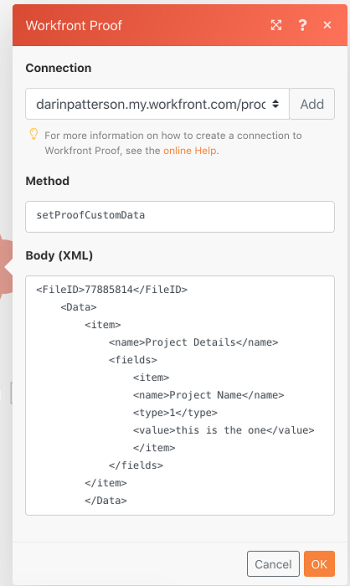

# `Workfront Proof` modules

In a `Adobe Workfront Fusion` scenario, you can connect your `Workfront Proof` account to multiple third-party applications and services.

This is useful if you need to execute tasks currently not supported in proofing within `Workfront` or in `Workfront Proof`, such as updating proofs based on certain events and searching for a `proof`'s recipients.

The `Workfront Proof`connector does not count against the number of active apps available to your organization. All scenarios, even if they use only the `Workfront Proof`app, do count against your organization's total scenario count.

If you need instructions on creating a scenario, see [Create a scenario](../../workfront-fusion/scenarios/create-a-scenario.md).

For information about modules, see [Modules in Adobe Workfront Fusion](../../workfront-fusion/modules/modules.md).

## Access requirements

You must have the following access to use the functionality in this article:

<table cellspacing="0"> 
 <col> 
 <col> 
 <tbody> 
  <tr> 
   <td role="rowheader">Adobe Workfront plan*</td> 
   <td> 
Pro or higher
 </td> 
  </tr> Adobe Workfront license* Plan, Work 
  <tr> 
   <td role="rowheader">Adobe Workfront Fusion license**</td> 
   <td> 
Workfront Fusion for Work Automation and Integration 
  </td> 
  </tr> 
  <tr> 
   <td role="rowheader">Product</td> 
   <td>Your organization must purchase Adobe Workfront Fusion as well as Adobe Workfront to use functionality described in this article.</td> 
  </tr> <!--
   Access level configurations* You must be a Workfront Fusion administrator for your organization. You must be a Workfront Fusion administrator for your team.
  --> 
 </tbody> 
</table>

&#42;To find out what plan, license type, or access you have, contact your `Workfront administrator`.

&#42;&#42;For information on `Adobe Workfront Fusion` licenses, see [Adobe Workfront Fusion licenses](../../workfront-fusion/get-started/license-automation-vs-integration.md)

## `Workfront Proof` modules and their fields

When you configure `Workfront Proof` modules, `Workfront Fusion` displays the fields listed below. Along with these, additional `Workfront Proof` fields might display, depending on factors such as your access level in the app or service. A bolded title in a module indicates a required field.

If you see the map button above a field or function, you can use it to set variables and functions for that field. For more information, see [Map information from one module to another](../../workfront-fusion/mapping/map-information-between-modules.md).

* [Triggers](#triggers) 
* [Actions](#actions) 
* [Searches](#searches)

### Triggers

* [Watch Proofs](#watch) 
* [Watch for PDF Summary](#watch2) 
* [Watch for PDF Summary](#watch2)

#### Watch Proofs

This scheduled trigger module executes a scenario when someone creates or makes a decision on a proof.

The module returns a list of all of the records it finds during the period you specify, along with their types. It also returns the values of the fields you specify. If the module found decisions make on the proof, it includes both the previous and the current values, in separate fields. You can map `this information` in subsequent modules in the scenario.

This happens on a regularly scheduled interval that you specify.

You must have sufficient permissions to access the `proof or proofs` in `Workfront Proof` in order to retrieve this information.

When you are configuring this module, the following fields display.

<table cellspacing="0"> 
 <col> 
 <col> 
 <tbody> 
  <tr> 
   <td role="rowheader">Connection</td> 
   <td> 
For instructions about connecting your Workfront Proof account to Workfront Fusion, see <a href="../../workfront-fusion/connections/connect-to-fusion-general.md" class="MCXref xref" data-mc-variable-override="">Create a connection to Workfront Fusion - Basic instructions</a>
 </td> 
  </tr> 
  <tr> 
   <td role="rowheader">Record Type</td> 
   <td>Select the type of Workfront Proof record that you want the module to watch.</td> 
  </tr> Outputs Select the information you want included in the output bundle for this module. Limit Enter or map the maximum number of records you want the module to return during each scenario execution cycle. 
 </tbody> 
</table>

#### Watch for PDF Summary

This instant trigger module executes a scenario when someone creates a PDF summary for a `proof`.

A webhook is required in this module.

The module returns all standard fields associated with the `proof`, along with any custom fields and values that the connection accesses. It also creates a new event subscription for PDF summaries and outputs the content from the “pdf_url” attribute sent in the payload. You can map `this information` in subsequent modules in the scenario.

When you are configuring this module, the following fields display.

<table> 
 <col> 
 <col> 
 <tbody> 
  <tr> 
   <td>Connection</td> 
   <td> 
For instructions about connecting your Workfront Proof account to Workfront Fusion, see <a href="../../workfront-fusion/connections/connect-to-fusion-general.md" class="MCXref xref" data-mc-variable-override="">Create a connection to Workfront Fusion - Basic instructions</a>
 </td> 
  </tr> 
  <tr> 
   <td>Webhook</td> 
   <td>You can select an existing webhook or create a new one. For more information, see <a href="../../workfront-fusion/webhooks/instant-triggers-webhooks.md" class="MCXref xref">Instant triggers (webhooks)</a>. </td> 
  </tr> 
  <tr> 
   <td>Limit</td> 
   <td>Enter or map the maximum number of records you want the module to return during each scenario execution cycle.</td> 
  </tr> 
 </tbody> 
</table>

#### Watch Proof Activity

This trigger module executes a scenario whena specified activity occurs on a proof `proof`.

The module returns all standard fields associated with the `proof`, along with any custom fields and values that the connection accesses. It also creates a new event subscription for PDF summaries and outputs the content from the “pdf_url” attribute sent in the payload. You can map `this information` in subsequent modules in the scenario.

When you are configuring this module, the following fields display.

<table> 
 <col> 
 <col> 
 <tbody> 
  <tr> 
   <td>Connection</td> 
   <td> 
For instructions about connecting your Workfront Proof account to Workfront Fusion, see <a href="../../workfront-fusion/connections/connect-to-fusion-general.md" class="MCXref xref" data-mc-variable-override="">Create a connection to Workfront Fusion - Basic instructions</a>
 </td> 
  </tr> 
  <tr> 
   <td>Activity type</td> 
   <td>Select whether you want to watch any new decision (including proof status changes), or overall proof status changes only.</td> 
  </tr> 
  <tr> 
   <td>Limit</td> 
   <td>Enter or map the maximum number of records you want the module to return during each scenario execution cycle.</td> 
  </tr> 
 </tbody> 
</table>

### Actions

* [Create Proof](#create) 
* [Custom API Call](#custom) 
* [Download Proof](#download) 
* [Read a Record](#read) 
* [Request PDF Summary](#request) 
* [Possible error](#possible) 
* [Update Proof](#update) 
* [Upload File](#upload)

#### Create Proof

This action module creates a new `proof` or a new version of a `proof` in `Workfront Proof`.

You specify the parameters for the new `proof` and the source `proof` if you are creating a new version.

The module returns the ID of the new `proof` or `proof` version.You can map `this information` in subsequent modules in the scenario.

When you are configuring this module, the following fields display.

<table> 
 <col> 
 <col> 
 <tbody> 
  <tr> 
   <td>Connection</td> 
   <td> 
For instructions about connecting your Workfront Proof account to Workfront Fusion, see <a href="../../workfront-fusion/connections/connect-to-fusion-general.md" class="MCXref xref" data-mc-variable-override="">Create a connection to Workfront Fusion - Basic instructions</a>
 </td> 
  </tr> 
  <tr> 
   <td>Proof Type</td> 
   <td> 
Specify whether you want the proof that is created to have a basic workflow or an Automated Workflow.
 
Then fill out the fields that display for the proof type you chose. For example, if you chose Automated Workflow, fill out the Workflow Stages field to configure the stages.
 
You can use output from the Build module here if you include and run that module earlier in the scenario. For more information, see <a href="#build" class="MCXref xref">Build</a> in this article. <!--
      Is this correct?
     -->
 </td> 
  </tr> Allow original file to be downloaded Select whether you want to allow the original file that the proof was created from to be downloaded. Classic Proof Viewer Select whether you are using the Classic Proof Viewer. Combine all files into single proof Enable this option to combine all files into a single multi-page proof. 
  <tr> 
   <td>Create a new proof version<!--
     ?
    --></td> 
   <td>Select this option if you want the module to create a new version of an existing proof. Then, in the Existing Proof ID field that displays, map or enter the unique ID of the proof.</td> 
  </tr> 
  <tr> 
   <td>Custom Link Label</td> 
   <td>Enter or map a label for the custom proof link.</td> 
  </tr> 
  <tr> 
   <td>Custom Link URL</td> 
   <td>Enter or map the URL for the custom link.</td> 
  </tr> Default email notifications for subscribers Type one of the following numbers to indicate which of the following default email notification settings you want to use for the proof that is created. 1 - All new comments and replies 2 - Replies to my comments 3 - Daily summary 4 - Hourly summary 5 - Decisions only 9 - Disabled Disable Excel Summary Select whether you want to disable the ability to download proof comments to an Excel file. Disable PDF Summary Select whether you want to disable the ability to download proof comments to a PDF file. Disable Subscription Email Select whether you want to disable the subscription email for this proof. Enable Embed Player Select whether you want to enable the embedded player for this proof. Enable Subscriptions Select whether people who are not participants are allowed to subscribe to the proof. If you select this option, you can also select the Default Role for subscribers, as described in this table. Enable Subscriptions Validation Select whether you want to enable subscription email validation. If this is enabled, the subscriber must click a link in an email to access a proof. Enable Team URL Select whether you want the proof that is created to hide or show the team URL. File Hash or File Hashes Add the ID of the file or files from which you want to create a proof or proofs. File Names Add the file name or names for the proof that is created This is a required field. Lock proof when all required decisions are made Specify whether you want the proof that is created to lock after all required decisions are made. Notify recipients about this proof Select an option to indicate whether you want recipients notified when the proof is created. If you select yes, select an option to indicate/include (?) a Custom message subject, Custom message body 
  <tr> 
   <td>Proof name</td> 
   <td>Type a name for the proof that is created This is a required field. Use a pipe symbol (|) to separate names for multiple proofs.</td> 
  </tr> 
  <tr> 
   <td>Proof owner ID</td> 
   <td>Enter or map the ID&nbsp;of the proof owner. If this field is left blank, the proof owner is set to the current user.</td> 
  </tr> 
  <tr> 
   <td>Reference ID</td> 
   <td>Enter the reference ID for the proof.</td> 
  </tr> 
  <tr> 
   <td>Require electronic signature</td> 
   <td>Select whether you want to require an anyone who makes a decision on a proof to submit an electronic signature.</td> 
  </tr> Require login Specify whether you want the proof that is created to require a login. This is the same as the Login Required setting explained in Configure Proof Settings in Workfront Proof Resolution ID Enter the ID of the resolution you want to use for your proof. For a list of resolution IDs, see the Workfront Proof API documentation. SWF Enter the type of SWF proof. Show [item] For each item, select whether you want to show it in the proof. Workspace ID Enter the ID of the workspace you want to create the proof in. Recipients Add the email addresses of the recipients you want for the proof that is created . Deadline Specify the deadline you want for the proof that is created. Use the following date format: YYYY-MM-DD hh:mm 
 </tbody> 
</table>

#### Custom API Call

This action module lets you make a custom authenticated call to the `Workfront Proof` API. This way, you can create a data flow automation that can't be accomplished by the other `Workfront Proof` modules.

The module returns the status code, headers and body. You can map `this information` in subsequent modules in the scenario.

When you are configuring this module, the following fields display.

<table> 
 <col> 
 <col> 
 <tbody> 
  <tr> 
   <td>Connection</td> 
   <td> 
For instructions about connecting your Workfront Proof account to Workfront Fusion, see <a href="../../workfront-fusion/connections/connect-to-fusion-general.md" class="MCXref xref" data-mc-variable-override="">Create a connection to Workfront Fusion - Basic instructions</a>
 </td> 
  </tr> Method Set the action for the API call. For available actions, see the Proof API documentation. Body (XML) Add the body content for the API call in the form of a standard JSON object. Note: When using conditional statements such as if in your JSON, put the quotation marks outside of the conditional statement. Example: 
 </tbody> 
</table>

` `**Example: **``  

#### Download Proof

This action module downloads the source file of a particular `proof` that you identify using its ID.

You specify the `proof`'s ID.

The module returns the content of the source file used to create the `proof`.You can map `this information` in subsequent modules in the scenario.

You must have sufficient permissions to access the `record` in `Workfront Proof` in order to retrieve this information.

When you are configuring this module, the following fields display.

<table> 
 <col> 
 <col> 
 <tbody> 
  <tr> 
   <td>Connection</td> 
   <td> 
For instructions about connecting your Workfront Proof account to Workfront Fusion, see <a href="../../workfront-fusion/connections/connect-to-fusion-general.md" class="MCXref xref" data-mc-variable-override="">Create a connection to Workfront Fusion - Basic instructions</a>
 </td> 
  </tr> 
  <tr> 
   <td>Proof ID</td> 
   <td> 
Type the unique ID of the proof, found on the Proof Details page. For more information, see <a href="../../workfront-proof/wp-work-proofsfiles/manage-your-work/manage-proof-details.md" class="MCXref xref" data-mc-variable-override="">Manage Proof Details in Workfront Proof</a>.
 </td> 
  </tr> 
 </tbody> 
</table>

#### Read a Record

This action module reads data from a single `proof` in `Workfront Proof`.

You specify the proof's ID and the information you want from the proof.

The module returns the values of the fields you choose for the proof, along with their types. You can map `this information` in subsequent modules in the scenario.

You must have sufficient permissions to access the `record` in `Workfront Proof` in order to retrieve this information.

When you are configuring this module, the following fields display.

<table> 
 <col> 
 <col> 
 <tbody> 
  <tr> 
   <td>Connection</td> 
   <td> 
For instructions about connecting your Workfront Proof account to Workfront Fusion, see <a href="../../workfront-fusion/connections/connect-to-fusion-general.md" class="MCXref xref" data-mc-variable-override="">Create a connection to Workfront Fusion - Basic instructions</a>
 </td> 
  </tr> 
  <tr> 
   <td>Record Type</td> 
   <td>Select whether you want to read a proof, proof comments, or proof reviewers.</td> 
  </tr> 
  <tr> 
   <td>Outputs</td> 
   <td> 
Select the information you want included in the output bundle for this module.
 </td> 
  </tr> 
  <tr> 
   <td>ID</td> 
   <td>Enter or map the unique Workfront Proof ID of the record that you want the module to read.</td> 
  </tr> <!--
   ________ Select the type of information you want the module to read: proof, proof comments, proof reviewers, or Automated Workflow template. After you choose one of these 4 options, select the fields you want to include for that option.
  --> 
 </tbody> 
</table>

#### Request PDF Summary

This action module requests the PDF summary for a particular `proof` in `Workfront Proof`.

You specify the `proof`'s ID.

The module returns PDF summary information. You can map `this information` in subsequent modules in the scenario.

You must have sufficient permissions to access the `record` in `Workfront Proof` in order to retrieve this information.

When you are configuring this module, the following fields display.

<table> 
 <col> 
 <col> 
 <tbody> 
  <tr> 
   <td>Connection</td> 
   <td> 
For instructions about connecting your Workfront Proof account to Workfront Fusion, see <a href="../../workfront-fusion/connections/connect-to-fusion-general.md" class="MCXref xref" data-mc-variable-override="">Create a connection to Workfront Fusion - Basic instructions</a>
 </td> 
  </tr> 
  <tr> 
   <td>Proof ID</td> 
   <td> 
Enter the unique Workfront Proof ID of the proof for which you want to request a PDF summary.
 </td> 
  </tr> Callback URL Enter or map the URL where you want the PDF summary sent. <!--
   Proof versions Specify whether you want to include all versions of the proof or a specific one. I'm guessing on this
  --> <!--
   Webhook URL You can create a separate scenario that uses the Watch for PDF Summary trigger module with a new webhook to retrieve the URL. Is this right?
  --> 
 </tbody> 
</table>

##### Possible error

* `Error`: “You do not have privilege to perform this request. The stage must contain at least one recipient.”
* `Solution`: Make sure you are not the only one assigned to the stages of the workflow. There must be another user assigned to the stages of the workflow.

#### Update Proof

This action module updates an existing `proof` in `Workfront Proof`.

You specify the `proof`'s ID and record type and what fields you want to include in the output.

The module returns any standard fields associated with the record, along with any custom fields and values that the connection accesses. You can map `this information` in subsequent modules in the scenario.

You must have sufficient permissions to access the `record` in `Workfront Proof` in order to retrieve this information.

When you are configuring this module, the following fields display.

<table> 
 <col> 
 <col> 
 <tbody> 
  <tr> 
   <td>Connection</td> 
   <td> 
For instructions about connecting your Workfront Proof account to Workfront Fusion, see <a href="../../workfront-fusion/connections/connect-to-fusion-general.md" class="MCXref xref" data-mc-variable-override="">Create a connection to Workfront Fusion - Basic instructions</a>
 </td> 
  </tr> 
  <tr> 
   <td>Proof ID</td> 
   <td> 
Type the unique ID of the proof, found on the Proof Details page. For more information, see <a href="../../workfront-proof/wp-work-proofsfiles/manage-your-work/manage-proof-details.md" class="MCXref xref" data-mc-variable-override="">Manage Proof Details in Workfront Proof</a>.
 </td> 
  </tr> 
  <tr> 
   <td>Deadline</td> 
   <td> 
Specify the deadline you want for the proof that is created. Use the following date format:
 
YYYY-MM-DD hh:mm
 </td> 
  </tr> 
  <tr> 
   <td>Default email notifications for subscribers</td> 
   <td>Select which of the following default email notification settings you want to use for the proof that is created.
    <ul>
     <li> All new comments and replies</li>
     <li>Replies to my comments</li>
     <li>Daily summary</li>
     <li> Hourly summary</li>
     <li> Decisions only</li>
     <li> Disabled</li>
    </ul></td> 
  </tr> 
  <tr> 
   <td>Default Role</td> 
   <td>Select the default role for the proof.</td> 
  </tr> 
  <tr> 
   <td>Disable Subscription Email</td> 
   <td>Select whether you want to disable the subscription email for this proof.</td> 
  </tr> 
  <tr> 
   <td>Enable Subscriptions</td> 
   <td>Select whether people who are not participants are allowed to subscribe to the proof. If you select this option, you can also select the Default Role for subscribers, as described in this table.</td> 
  </tr> 
  <tr> 
   <td>Enable Subscriptions Validation</td> 
   <td>Select whether you want to enable subscription email validation. If this is enabled, the subscriber must click a link in an email to access a proof.</td> 
  </tr> 
  <tr> 
   <td>Enable Team URL</td> 
   <td>Select whether you want the proof that is created to hide or show the team URL.</td> 
  </tr> 
  <tr> 
   <td>Lock proof when all required decisions are made</td> 
   <td>Specify whether you want the proof that is created to lock after all required decisions are made.</td> 
  </tr> 
  <tr> 
   <td>Message</td> 
   <td>Enter or map a message that you want to accompany the proof.</td> 
  </tr> 
  <tr> 
   <td>Proof ID </td> 
   <td>Enter or map the ID&nbsp;of the proof you want to update.</td> 
  </tr> 
  <tr> 
   <td>Proof Name</td> 
   <td>Enter or map the name of the proof you want to update.</td> 
  </tr> 
  <tr> 
   <td>Require login</td> 
   <td> 
Specify whether you want the proof that is created to require a login. 
 
This is the same as the Login Required setting explained in <a href="../../workfront-proof/wp-work-proofsfiles/manage-your-work/configure-proof-settings.md" class="MCXref xref">Configure Proof Settings in Workfront Proof</a>
 </td> 
  </tr> 
  <tr> 
   <td>Show Versions Like</td> 
   <td>Select whether you want to show a link to other versions of this proof.</td> 
  </tr> 
  <tr> 
   <td>Subject</td> 
   <td>Enter or map the subject of the proof</td> 
  </tr> 
 </tbody> 
</table>

#### Upload File

This action module uploads a file for use with the Create Proof module in `Workfront Proof`.

The module returns a hash ID for the uploaded file. You can map `this information` in subsequent modules in the scenario.

When you are configuring this module, the following fields display.

<table> 
 <col> 
 <col> 
 <tbody> 
  <tr> 
   <td>Connection</td> 
   <td> 
For instructions about connecting your Workfront Proof account to Workfront Fusion, see <a href="../../workfront-fusion/connections/connect-to-fusion-general.md" class="MCXref xref" data-mc-variable-override="">Create a connection to Workfront Fusion - Basic instructions</a>
 </td> 
  </tr> 
  <tr> 
   <td>Source file</td> 
   <td> 
Select a source file from a previous module, or map the source file's name and data.
 </td> 
  </tr> <!--
   Name (Optional) Type a new file name for the uploaded file if you don't want to use the existing one. Is this correct?
  --> 
 </tbody> 
</table>

<!--
Are there more main fields for this module?
-->

### Searches

* [Search](#search) 
* [List Workflow Templates](#list)

#### Search

This search module looks for `records in an object` in `Workfront Proof` that match the search query you specify.

The module returns the `proof`'s ID if it's searching for a proof. Or it returns the recipients' user IDs, emails, names, positions, and email aliases, if it is searching for recipients.You can map `this information` in subsequent modules in the scenario.

You must have sufficient permissions to access the `record` in `Workfront Proof` in order to retrieve this information.

When you are configuring this module, the following fields display.

<table> 
 <col> 
 <col> 
 <tbody> 
  <tr> 
   <td>Connection</td> 
   <td> 
For instructions about connecting your Workfront Proof account to Workfront Fusion, see <a href="../../workfront-fusion/connections/connect-to-fusion-general.md" class="MCXref xref" data-mc-variable-override="">Create a connection to Workfront Fusion - Basic instructions</a>
 </td> 
  </tr> Search for Select the type of record you want the module to search for. Proof Enter the Proof Name of the proof you want to search for. Recipient Enter the email address of the recipient you want to search for. Result Set Indicate whether the module will search for All Matching Records or only the First Matching Record. Sort By Select the field that you want to sort results by. Sorting Direction Select whether you want to sort results ascending or descending. 
 </tbody> 
</table>

#### List Workflow Templates

This search module lists all available workflow templates.

<table> 
 <col> 
 <col> 
 <tbody> 
  <tr> 
   <td>Connection</td> 
   <td> 
For instructions about connecting your Workfront Proof account to Workfront Fusion, see <a href="../../workfront-fusion/connections/connect-to-fusion-general.md" class="MCXref xref" data-mc-variable-override="">Create a connection to Workfront Fusion - Basic instructions</a>
 </td> 
  </tr> 
  <tr> 
   <td>Outputs</td> 
   <td> 
Select the information you want included in the output bundle for this module.
 </td> 
  </tr> Limit Enter or map the maximum number of templates you want the module to return during each scenario execution cycle. 
 </tbody> 
</table>

<!--
Build I don't see this in Fusion 2 This action module creates a new proof recipient or stage in an Automated Workflow. The module returns reviewer or stage information (see the examples below the following table). You can map this information in subsequent modules in the scenario. When you are configuring this module, the following fields display. Connection For instructions about connecting your Workfront Proof account to Workfront Fusion, see Create a connection to Workfront Fusion - Basic instructions ________ Select an option to specify whether you are adding a reviewer or a stage in an Automated Workflow. Reviewer If you are adding a reviewer, select (or is it fill out?) the fields containing the reviewer information you want to use. Stage If you are adding a stage, select (or is it fill out?) the fields containing the stage information you want to use. Examples: For a reviewer, the module returns data such as the following: { "primary_decision_maker": true, "email_notification": 1, "role": 3, "email": "name@company.com" } For a stage, the module returns data such as the following: { "stage_id": 0, "start_dependent_time": "13.00", "start_dependent_stage_id": "2", "deadline_time": "", "name": "Stage Name", "stage_one_decision_only": true, "deadline_date": "01.01.2020", "stage_reviewers": [], "start_trigger": 1, "stage_locking": 4, "start_dependent_date": "01.02.2020", "stage_private": true, "deadline_calculate_on": 1 }
-->

