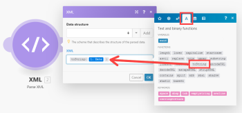
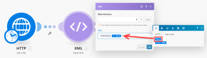

# XML

The XML app enables you to parse an XML formatted text via the XML > Parse XML module and convert it to a bundle to make the data available to other modules. You can also convert a bundle to an XML formatted text via the XML > Create XML module

## Access requirements

You must have the following access to use the functionality in this article:

<table cellspacing="0"> 
 <col> 
 <col> 
 <tbody> 
  <tr> 
   <td role="rowheader"><span>Adobe Workfront</span> plan*</td> 
   <td> <p><span>Pro</span> or higher</p> </td> 
  </tr> Adobe Workfront license* Plan, Work 
  <tr> 
   <td role="rowheader"><span>Adobe Workfront Fusion</span> license**</td> 
   <td> <p><span>Workfront Fusion for Work Automation and Integration</span> </p>  </td> 
  </tr> 
  <tr> 
   <td role="rowheader">Product</td> 
   <td>Your organization must purchase <span>Adobe Workfront Fusion</span> as well as <span>Adobe Workfront</span> to use functionality described in this article.</td> 
  </tr> <!--
   Access level configurations* You must be a Workfront Fusion administrator for your organization. You must be a Workfront Fusion administrator for your team.
  --> 
 </tbody> 
</table>

&#42;To find out what plan, license type, or access you have, contact your `Workfront administrator`.

&#42;&#42;For information on `Adobe Workfront Fusion` licenses, see [Adobe Workfront Fusion licenses](../../workfront-fusion/get-started/license-automation-vs-integration.md)

## Parse XML

The XML > Parse XML module parses an XML formatted text and outputs a single bundle containing all the information extracted from the XML.

<table cellspacing="0"> 
 <col> 
 <col> 
 <tbody> 
  <tr> 
   <td role="rowheader"> <p>Data structure</p> </td> 
   <td> <p>The data structure describes the structure of the XML to make the output of the module available in the mapping panel for the following modules.</p> <p>If you have a sample of the XML you would like to parse, you can use it to generate the data structure:</p> 
    <ol> 
     <li value="1">Click the <span class="bold">Add</span> button.</li> 
     <li value="2">Click the <span class="bold">Generator</span> button.</li> 
     <li value="3">Copy and paste the XML sample into the <span class="bold">Sample data</span> field.</li> 
     <li value="4">Click <span class="bold">Save</span>.</li> 
     <li value="5">Verify that the data structure has been successfully generated.</li> 
     <li value="6"> <p>Click the <span class="bold">Save</span> button to save the data structure.</p> <p>You can skip the steps 2-5 to supply an empty data structure. If the data structure is empty, the output of the module is not available in the mapping panel until the module has been executed at least once.</p> </li> 
    </ol> <p>For more information, see <a href="../../workfront-fusion/modules/data-structures.md" class="MCXref xref">Data structures</a>.</p> </td> 
  </tr> 
  <tr> 
   <td role="rowheader">Preserve numbers as text</td> 
   <td>Enable this option to ensure that numbers remain as text (string) values. Otherwise, numbers are cast to number values.</td> 
  </tr> 
  <tr> 
   <td role="rowheader"> <p>XML</p> </td> 
   <td> <p>Enter or map the XML formatted text you would like to parse.</p> <p>If you use a formula, make sure its result value type is (or can be automatically coerced to) the Text data type. </p> <p>  </p> <p>If the result value type is Buffer (binary data) then use the <code>toString()</code> function to convert it to the Text data type. For more information, see <a href="../../workfront-fusion/mapping/type-coercion.md" class="MCXref xref">Type coercion</a> and <a href="../../workfront-fusion/mapping/item-data-types.md" class="MCXref xref">Item data types</a>.</p> </td> 
  </tr> 
 </tbody> 
</table>

` `**Example: **`` To download an XML file from a URL and parse its content:

<ol> 
 <li value="1">Create a new scenario.</li> 
 <li value="2">Insert HTTP > Get a file module</li> 
 <li value="3"> <p>Open the module's configuration and configure it as follows:</p> <p><span class="bold">URL</span>: URL of the XML file (e.g. <code>https://siftrss.com/f/rqLy05ayMBJ</code>)</p> <p>  </p> </li> 
 <li value="4">Click <span class="bold">OK&nbsp;</span>to save and close the module's configuration.</li> 
 <li value="5"> <p>Add XML > Parse XML module, connect it after the HTTP > Get a file module and configure it as follows:</p> 
  <table cellspacing="0"> 
   <col> 
   <col> 
   <tbody> 
    <tr> 
     <td role="rowheader">Data structure</td> 
     <td> 
      <ol> 
       <li value="1">Click the <span class="bold">Add</span> button.</li> 
       <li value="2">Click the <span class="bold">Generator</span> button.</li> 
       <li value="3">In your web browser, open a new tab or window.</li> 
       <li value="4">Put the URL you used in the third step in the address bar and fetch the XML file.</li> 
       <li value="5">Select all the XML text and copy it into the clipboard.</li> 
       <li value="6">Close the tab or window and get back to your scenario.</li> 
       <li value="7">Paste the copied XML text into the Sample data field.</li> 
       <li value="8">Click <span class="bold">Save</span>.</li> 
       <li value="9">Verify that the data structure has been successfully generated.</li> 
       <li value="10">Click <span class="bold">Save</span> to save the data structure.</li> 
      </ol> <p>You can skip steps b through i to supply an empty data structure. If the data structure is empty, the output of the module is not available in the mapping panel until the module has been executed at least once.</p> </td> 
    </tr> 
    <tr> 
     <td role="rowheader">XML</td> 
     <td> <p>Map the <code>Data </code>item from the output of the HTTP > Get a file module into the field. Use the <code>toString()</code> function to convert its value from the Buffer (binary data) type to Text data type.</p> <p>You may copy and paste the formula's code into the field: <code>{{toString(1.data)}}</code></p> <p>For more information the Buffer and Text data types, see <a href="../../workfront-fusion/mapping/item-data-types.md" class="MCXref xref">Item data types</a>.</p> <p>  </p> </td> 
    </tr> 
   </tbody> 
  </table> </li> 
</ol>

## Parsing XML attributes

By default, the XML > Parse XML module puts attributes in a special collection 

```
_attributes
```

as a child of the node that has these attributes. If the node is a text node and it has attributes, then two special properties are added: 

```
_attributes
```

for attributes and 

```
_value
```

for the text content of the node.

` `**Example: **`` This XML:
<pre><root attr="1"></pre><pre><node attr="ABC">Hello, World</node></pre><pre></root></pre>is converted into this bundle:


## Create XML

The XML > Create XML module converts a bundle to an XML formatted text.

<table cellspacing="0"> 
 <col> 
 <col> 
 <tbody> 
  <tr> 
   <td role="rowheader"> <p>Data structure</p> </td> 
   <td> <p>The Data structure describes the structure of the resulting XML. If you have a sample of the XML you would like to create, you can use it to generate the data structure:</p> 
    <ol> 
     <li value="1">Click the <span class="bold">Add</span> button.</li> 
     <li value="2">Click the <span class="bold">Generator</span> button.</li> 
     <li value="3">Copy and paste the XML sample into the Sample data field.</li> 
     <li value="4">Click the <span class="bold">Save</span> button.</li> 
     <li value="5">Verify that the data structure has been successfully generated.</li> 
     <li value="6">Click <span class="bold">Save</span> to save the data structure.</li> 
    </ol> </td> 
  </tr> 
  <tr> 
   <td role="rowheader">Root element name</td> 
   <td>Enter the name of the XML's root element. The default value is <code>root</code>.</td> 
  </tr> 
  <tr> 
   <td role="rowheader">Doctype SYSTEM&nbsp;ID</td> 
   <td>Enter the file name to use in the<code> !DOCTYPE SYSTEM</code> declaration</td> 
  </tr> 
  <tr> 
   <td role="rowheader">Doctype PUBLIC ID</td> 
   <td>Enter the file name to use in the<code> !DOCTYPE PUBLIC</code> declaration</td> 
  </tr> 
  <tr> 
   <td role="rowheader">Strip Xml Declaration</td> 
   <td>Enable this option to remove the XML Declaration <code>&lt;?xml ... ?&gt;</code> and <code>&lt;!DOCTYPE ... &gt;</code>and leave only the XML root element and its contents.</td> 
  </tr> 
 </tbody> 
</table>

` `**Example: **`` A typical use case is to transform data from a Google spreadsheet into XML.

<ol> 
 <li value="1">Place the Google Sheets > Select rows module in your scenario to fetch the data. Set up the module to retrieve rows from your Google spreadsheet. Set the<span class="bold"> Maximum number of returned rows</span> to a small number, but larger than one for testing purposes (Example, three). Execute the Google Sheets module by right-clicking it and choosing "<span class="bold">Run this module only</span>." Verify the output of the module.</li> 
 <li value="2">Connect the Array Aggregator module after the Google Sheets module. In the module's setup choose the Google Sheets module in the <span class="bold">Source node</span> field. Leave the other fields as they are for the moment.</li> 
 <li value="3"> <p>Connect the XML > Create XML module after the Array Aggregator module. </p> <p>The module's setup requires a data structure that describes the structure of the XML output. Click the <span class="bold">Add</span> button to open the data structure setup. The easiest way to create this data structure is to generate it automatically from an XML sample. </p> </li> 
 <li value="4"> <p>Click the <span class="bold">Generator</span> button and paste your XML sample to the Sample data field:</p> <p>  </p> </li> 
 <li value="5">Click <span class="bold">Save</span>. The Specification field in the Data structure now contains the generated structure.</li> 
 <li value="6">Change the name of your Data structure to something more specific and click <span class="bold">Save</span>. A field corresponding to the root array attribute appears as a mappable field in the JSON module's setup.</li> 
 <li value="7">Click the <span class="bold">Map</span> button next to the field and map the <code>Array[]</code> item from the Array aggregator output to it:</li> 
 <li value="8"> Click <span class="bold">OK</span> to close the XML module's setup.</li> 
 <li value="9"> <p>Open the setup of the Array Aggregator module. Change the <span class="bold">Target structure</span> from Custom to an XML module's field corresponding to the parent XML element.Map items from the Google Sheets module to the appropriate fields.</p> </li> 
 <li value="10">Click <span class="bold">OK</span> to close the Array Aggregator module's setup.</li> 
 <li value="11"> <p>Run the scenario. </p> <p>The XML module outputs the correct XML file. </p> </li> 
 <li value="12"> <p>Open the setup of the Google Sheets module and increase the Maximum number of returned rows number to be larger than the number of rows in your spreadsheet to process all the data. </p> <p>The resulting XML can be saved to Dropbox, sent as an attachment via email, uploaded via FTP to a server, and so on.</p> </li> 
</ol>

## Adding XML attributes

If you want to add attributes to a complex node (a node that will contain other nodes), you must add a collection with the name 

```
_attributes
```

for the complex note in your custom data structure. This collection will be mapped to node attributes. If you want to add attributes to a text node (for example: 

```
<node attr="1">abc</node>
```

), you must add a collection 

```
_attributes
```

for attributes and a text property 

```
_value
```

for the node value for this node in your custom data structure.

` `**Example: **``<pre>{</pre> `<blockquote> <pre>"name": "node",</pre> <pre>"type": "collection",</pre> <pre>"spec": [</pre>  <blockquote>  <pre>{</pre>   <blockquote>   <pre>"name": "_attributes",</pre>   <pre>"type": "collection"</pre>   <pre>"spec": [</pre>    <blockquote>    <pre>{</pre>     <blockquote>     <pre>"name": "attr1",</pre>     <pre>"type": "text"</pre>     </blockquote>    <pre>}</pre>    </blockquote>   <pre>]</pre>   </blockquote>  <pre>},</pre>  <pre>{</pre>   <blockquote>   <pre>"name": "_value",</pre>   <pre>"type": "text"</pre>   </blockquote>  <pre>}</pre>  </blockquote> <pre>]</pre> </blockquote>`<pre>}</pre>

## Troubleshooting: Cannot map data from the Parse XML module

Make sure the data structure is defined correctly. Alternatively, you may use an empty data structure and execute the module at least once to process an XML input.
