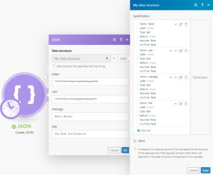

# Connect Adobe Workfront Fusion to a web service that uses API token authorization

Some services do not allow integration solutions such as Adobe Workfront Fusion to create an app that you can easily use in your scenario.

There is a workaround to this situation. You can connect the desired service (app) to Workfront Fusion using Workfront Fusion's HTTP module.

This article explains how to connect almost any web service to Workfront Fusion using an API Key/API token.

## Access requirements

You must have the following access to use the functionality in this article:

<table cellspacing="0"> 
 <col> 
 <col> 
 <tbody> 
  <tr> 
   <td role="rowheader">Adobe Workfront plan*</td> 
   <td> 
Pro or higher
 </td> 
  </tr> Adobe Workfront license* Plan, Work 
  <tr> 
   <td role="rowheader">Adobe Workfront Fusion license**</td> 
   <td> 
Workfront Fusion for Work Automation and Integration 
 </td> 
  </tr> 
  <tr> 
   <td role="rowheader">Product</td> 
   <td>Your organization must purchase Adobe Workfront Fusion as well as Adobe Workfront to use functionality described in this article.</td> 
  </tr> <!--
   Access level configurations* You must be a Workfront Fusion administrator for your organization. You must be a Workfront Fusion administrator for your team.
  --> 
 </tbody> 
</table>

&#42;To find out what plan, license type, or access you have, contact your Workfront administrator.

&#42;&#42;For information on Adobe Workfront Fusion licenses, see [Adobe Workfront Fusion licenses](../../workfront-fusion/get-started/license-automation-vs-integration.md)

## Connect to a web service that uses an API token

The procedure of connecting the service via an API token is similar for most web services.

1. Create an application on the web service's website, as explained in the section [Create a new application and obtain the API token](#create) in this article.
1. Obtain the API Key or API token.
1. Add Workfront Fusion's HTTP > Make a Request module to your scenario.
1. Set up the module according to the web service's API documentation and running the scenario, as explained in the section [Set up the HTTP module](#set) in this article.

>[!NOTE]
>
>We will use the Pushover notification service as an example throughout this article.

## Create a new application and obtain the API token

>[!NOTE]
>
>There are many different ways that web services create and distribute API keys or API tokens. For instructions on obtaining an API key and token for your desired web service, go to the service's website and search for "API&nbsp;key" or "API token."
>
>We are including instructions for obtaining a Pushover API key only as an example of what you might find.

1. Log in to your Pushover account.
1. Click `Create an Application/API Token` at the bottom of the page.
1. Fill in the Application Information and click `Create an Application`.
1. Store the provided API token in a safe place. You will need it for the Workfront Fusion HTTP > Make a Request module to connect to the desired web service (Pushover, in this case).

## Set up the HTTP module

To connect a web service to your Workfront Fusion scenario, you need to use the HTTP > Make a request module in the scenario and set up the module according to the web service's API&nbsp;documentation.

<ol> 
 <li value="1"> 
Add the HTTP > Make a Request module to your scenario.
 </li> 
 <li value="2"> 
To push a message using Workfront Fusion, set up the HTTP module as follows.
 <note type="note">
   These module settings correspond to the Pushover web service API documentation. Settings may be different for other web services. For example, the API token may be inserted to the Header and not to the Body field.
  </note> 
  <table cellspacing="0"> 
   <col> 
   <col> 
   <tbody> 
    <tr> 
     <td role="rowheader">URL</td> 
     <td> 
<code>https://api.pushover.net/1/messages.json</code> 
 
The URL field contains the endpoint that you can find in the web service's API documentation.
 </td> 
    </tr> 
    <tr> 
     <td role="rowheader">Method</td> 
     <td> 
<code>POST</code> 
 
The used method depends on the corresponding endpoint. The Pushover endpoint for pushing messages uses the POST method.
 </td> 
    </tr> 
    <tr> 
     <td role="rowheader"> 
Headers
 </td> 
     <td> 
Some web services may use Headers to specify the API token authentication or other parameters. This is not the case in our example as the Pushover's endpoint for pushing messages uses Body (see below) for all request types.
 </td> 
    </tr> 
    <tr> 
     <td role="rowheader"> 
Query String
 </td> 
     <td> 
Some web services may use a Query String to specify other parameters. This is not the case in our example as the Pushover web service uses Body (see below) for all request types.
 </td> 
    </tr> 
    <tr> 
     <td role="rowheader"> 
Body Type
 </td> 
     <td> 
<code>Raw</code> 
 
This setting allows you to select the JSON content type in the Content Type field below.
 </td> 
    </tr> 
    <tr> 
     <td role="rowheader"> 
Content Type
 </td> 
     <td> 
<code>JSON (application/json)</code> 
 
JSON is the required content type by the Pushover app. This may differ from other web services.
 </td> 
    </tr> 
    <tr> 
     <td role="rowheader"> 
Request Content
 </td> 
     <td> 
Enter the Body request content in the JSON format. You can use the JSON > Create JSON module as explained in <a href="#json" class="MCXref xref">JSON Body Mapped Using the JSON > Create JSON module</a> in this article. Or you can enter the JSON content manually, as explained in <a href="#json2" class="MCXref xref">JSON Body Entered Manually</a> in this article.
 
See the web service's API documentation for the required parameters for that web service.
 </td> 
    </tr> 
   </tbody> 
  </table> </li> 
</ol>

## JSON Body Entered Manually

Specify parameters and values in the JSON format.

` `**Example: **`` {"user":"12345c2ecu1hq42ypqzhswbyam34",

"token":"123459evz8aepwtxydndydgyumbfx",

"message":"Hello World!",

"title":"The Push Notification"}

<table cellspacing="0"> 
 <col> 
 <col> 
 <tbody> 
  <tr> 
   <td role="rowheader"> 
user
 </td> 
   <td> 
Your USER_KEY. This can be found in your Pushover dashboard.
 </td> 
  </tr> 
  <tr> 
   <td role="rowheader">token </td> 
   <td> 
Your API token/API Key that was generated you created your Pushover app.
 </td> 
  </tr> 
  <tr> 
   <td role="rowheader">message </td> 
   <td> 
The text content of the push notification that is sent to the device(s).
 </td> 
  </tr> 
  <tr> 
   <td role="rowheader">title </td> 
   <td> 
(Optional) Your message's title. If no value is entered, your app's name is used. 
 </td> 
  </tr> 
 </tbody> 
</table>

## JSON Body Mapped Using the JSON > Create JSON module

The Create JSON module makes the specifying JSON easier. It also gives you the possibility to define values dynamically.

For more information about the JSON modules, see [JSON modules](../../workfront-fusion/apps-and-their-modules/json-modules.md).

<ol> 
 <li value="1"> 
Enter or map the values you want to create JSON from.
 
  
 </li> 
 <li value="2"> 
Connect the JSON > Create JSON module to the HTTP > Make a Request module.
 </li> 
 <li value="3"> 
Map the JSON string from the Create JSON module to the Request content field in the HTTP > Make a Request module.
 <!--
  --> 
Now when you run the scenario, the push notification is sent to the device that has been registered in your Pushover account.
 </li> 
</ol>

