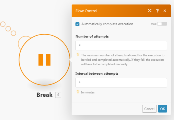
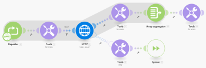

# Retry

In some cases it is useful to re-execute a failing module for a couple of times if there is a chance that the reason for the failure might pass over time.

## Access requirements

You must have the following access to use the functionality in this article:

<table cellspacing="0"> 
 <col> 
 <col> 
 <tbody> 
  <tr> 
   <td role="rowheader"><span>Adobe Workfront</span> plan*</td> 
   <td> <p><span>Pro</span> or higher</p> </td> 
  </tr> Adobe Workfront license* Plan, Work 
  <tr> 
   <td role="rowheader"><span>Adobe Workfront Fusion</span> license**</td> 
   <td> <p><span>Workfront Fusion for Work Automation and Integration</span> </p>  </td> 
  </tr> 
  <tr> 
   <td role="rowheader">Product</td> 
   <td>Your organization must purchase <span>Adobe Workfront Fusion</span> as well as <span>Adobe Workfront</span> to use functionality described in this article.</td> 
  </tr> <!--
   Access level configurations* You must be a Workfront Fusion administrator for your organization. You must be a Workfront Fusion administrator for your team.
  --> 
 </tbody> 
</table>

&#42;To find out what plan, license type, or access you have, contact your `Workfront administrator`.

&#42;&#42;For information on `Adobe Workfront Fusion` licenses, see [Adobe Workfront Fusion licenses](../../workfront-fusion/get-started/license-automation-vs-integration.md)

## Workarounds to the Retry error handling directive

`Adobe Workfront Fusion` currently does not offer the Retry error handling directive, though two workarounds can be employed to mimic its functionality. For more information, see [Directives for error handling](../../workfront-fusion/errors/directives-for-error-handling.md).

### Use the Break directive

<ol> 
 <li value="1">In the <a href="../../workfront-fusion/scenarios/scenario-settings-panel.md" class="MCXref xref">Scenario settings panel</a>, enable the <span class="bold">Allow storing of Incomplete Executions</span> option.</li> 
 <li value="2">Attach an error handler route to the module, as described in <a href="../../workfront-fusion/errors/error-handling.md" class="MCXref xref">Error handling</a>.</li> 
 <li value="3"> <p>Link the Break directive to the error handler route (see <a href="../../workfront-fusion/errors/directives-for-error-handling.md" class="MCXref xref">Directives for error handling</a>) and configure it.</p> <p>  </p> </li> 
</ol>

#### Drawbacks

* The minimum retry interval is one minute.
* If the module is processing multiple bundles and the processing of a bundle fails, the partial execution (only the bundle that caused the error) is moved to the [View and resolve incomplete executions](../../workfront-fusion/scenarios/view-and-resolve-incomplete-executions.md) folder and scheduled for retries according to the Break directive settings. However, the current execution continues and the module continues to process the subsequent bundles. At least you can enable the "Sequential processing" option in the Scenario settings to prevent the scenario from executing again until the execution stored in the the Incomplete executions folder has been successfully resolved.

### Use the Repeater module

1. Employ the `Repeater` module and set its Repeats field to the maximum number of attempts.
1. Link the potentially failing module to the `Repeater` module.
1. Attach an error handler route to this module (see [Error handling](../../workfront-fusion/errors/error-handling.md)).
1. Link the `Tools > Sleep` module to the error handler route and set its `Delay` field to the number of seconds between the attempts.

1. Link the `Ignore` directive after the `Tools > Sleep` module (see [Directives for error handling](../../workfront-fusion/errors/directives-for-error-handling.md)).

1. Link the `Tools > Set variable` module after the the potentially failing module and configure it to store the module's result in a variable named, for example, 

   ```
   Result
   ```

   .

1. Link the `Array aggregator` module after the `Tools > Set` variable and choose the `Repeater` module in its Source Module field.

1. Link the `Tools > Get variable` module to the `Array aggregator` module and configure it to obtain the value of the 

   ```
   Result
   ```

   variable.

1. Insert the `Tools > Get` variable module between the `Repeater` module and the potentially failing module and configure it obtain the value of the 

   ```
   Result
   ```

   variable.

1. Insert a filter between this `Tools > Get` variable module and the potentially failing module to continue only if the 

   ```
   Result
   ```

   variable does not exist.

` `**Example: **`` Here is a sample scenario where the HTTP > Make a request module represents the potentially failing module:



If the result of the potentially failing module is too complex to be stored in a simple variable, you may employ a data store to store/retrieve the result. The data store would contain just one record. The record's key can be, for example, 

```
Result
```

.

For more information on data stores, see [Data Stores](../../workfront-fusion/modules/data-stores.md)

#### Drawback

This workaround might appear a bit too complex and it is also more demanding in terms of operations.
