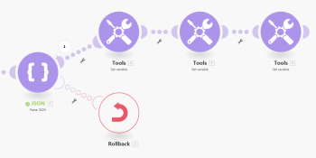

# Throw {#throw}

In some cases you may want to forcibly stop the scenario execution followed by [Rollback](scenario-execution-cycles-phases.md#rollback) or [Commit](scenario-execution-cycles-phases.md#commit) phase or to stop the processing of a route and optionally store it in the queue of [View and resolve incomplete executions](view-and-resolve-incomplete-executions.md).

Currently the [Directives for error handling](directives-for-error-handling.md) cannot be used out of the scope of an [Error handler route](error-handling.md#error) and *`Adobe Workfront Fusion`* does not offer a module that would enable you to easily conditionally generate (throw) errors.

## Access requirements {#access-requirements}

You must have the following access to use the functionality in this article:

<table style="width: 100%;margin-left: 0;margin-right: auto;mc-table-style: url('../../Resources/TableStyles/TableStyle-List-options-in-steps.css');" class="TableStyle-TableStyle-List-options-in-steps" cellspacing="0"> 
 <col class="TableStyle-TableStyle-List-options-in-steps-Column-Column1"> 
 <col class="TableStyle-TableStyle-List-options-in-steps-Column-Column2"> 
 <tbody> 
  <tr class="TableStyle-TableStyle-List-options-in-steps-Body-LightGray"> 
   <td class="TableStyle-TableStyle-List-options-in-steps-BodyE-Column1-LightGray" role="rowheader">Adobe Workfront plan*</td> 
   <td class="TableStyle-TableStyle-List-options-in-steps-BodyD-Column2-LightGray"> 
Pro or higher
 </td> 
  </tr> 
  <tr class="TableStyle-TableStyle-List-options-in-steps-Body-MediumGray"> 
   <td class="TableStyle-TableStyle-List-options-in-steps-BodyE-Column1-MediumGray" role="rowheader">Adobe Workfront Fusion license**</td> 
   <td class="TableStyle-TableStyle-List-options-in-steps-BodyD-Column2-MediumGray"> 
Workfront Fusion for Work Automation and Integration 
 
Workfront Fusion for Work Automation 
 </td> 
  </tr> 
  <tr class="TableStyle-TableStyle-List-options-in-steps-Body-LightGray"> 
   <td class="TableStyle-TableStyle-List-options-in-steps-BodyB-Column1-LightGray" role="rowheader">Product</td> 
   <td class="TableStyle-TableStyle-List-options-in-steps-BodyA-Column2-LightGray">Your organization must purchase Adobe Workfront Fusion as well as Adobe Workfront to use functionality described in this article.</td> 
  </tr> 
 </tbody> 
</table>

&#42;To find out what plan, license type, or access you have, contact your *`Workfront administrator`*.

## Workaround for Throw {#workaround-for-throw}

To conditionally throw an error, you may configure a module to make it optionally purposely fail during its operation. One possibility is to employ the JSON >&nbsp;Parse JSON module (see [JSON modules](json-modules.md)), configured to optionally throw an error (BundleValidationError in this case):

You can then attach one of the [Directives for error handling](directives-for-error-handling.md) to the error handling route to:

* force the scenario execution to stop and perform the rollback phase: Rollback
* force the scenario execution to stop and perform the commit phase: Commit
* stop the processing of a route: Ignore
* stop the processing of a route and store it in the queue of [View and resolve incomplete executions](view-and-resolve-incomplete-executions.md): Break

The following example shows the use of the Rollback directive:

