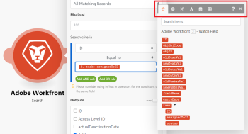

# Map items using functions {#map-items-using-functions}

When you map items, you can use functions to create simple or complex formulas. 

The functions available in *`Adobe Workfront Fusion`* are similar to functions in Excel and in some programming languages. They evaluate general logic, math, text, dates, and arrays. They let you perform conditional logic and transformations of item values, such as converting a text to uppercase, trimming text, converting a date into a different format, and more. For more information, see [Map information from one module to another](map-information-between-modules.md).

## Access requirements {#access-requirements}

You must have the following access to use the functionality in this article:

<table style="width: 100%;margin-left: 0;margin-right: auto;mc-table-style: url('../../Resources/TableStyles/TableStyle-List-options-in-steps.css');" class="TableStyle-TableStyle-List-options-in-steps" cellspacing="0"> 
 <col class="TableStyle-TableStyle-List-options-in-steps-Column-Column1"> 
 <col class="TableStyle-TableStyle-List-options-in-steps-Column-Column2"> 
 <tbody> 
  <tr class="TableStyle-TableStyle-List-options-in-steps-Body-LightGray"> 
   <td class="TableStyle-TableStyle-List-options-in-steps-BodyE-Column1-LightGray" role="rowheader">Adobe Workfront plan*</td> 
   <td class="TableStyle-TableStyle-List-options-in-steps-BodyD-Column2-LightGray"> 
Pro or higher
 </td> 
  </tr> 
  <tr class="TableStyle-TableStyle-List-options-in-steps-Body-MediumGray"> 
   <td class="TableStyle-TableStyle-List-options-in-steps-BodyE-Column1-MediumGray" role="rowheader">Adobe Workfront Fusion license**</td> 
   <td class="TableStyle-TableStyle-List-options-in-steps-BodyD-Column2-MediumGray"> 
Workfront Fusion for Work Automation and Integration 
 
Workfront Fusion for Work Automation 
 </td> 
  </tr> 
  <tr class="TableStyle-TableStyle-List-options-in-steps-Body-LightGray"> 
   <td class="TableStyle-TableStyle-List-options-in-steps-BodyB-Column1-LightGray" role="rowheader">Product</td> 
   <td class="TableStyle-TableStyle-List-options-in-steps-BodyA-Column2-LightGray">Your organization must purchase Adobe Workfront Fusion as well as Adobe Workfront to use functionality described in this article.</td> 
  </tr> 
 </tbody> 
</table>

&#42;To find out what plan, license type, or access you have, contact your *`Workfront administrator`*.

## Insert functions into fields {#insert-functions-into-fields}

If you click a field, the mapping panel displays. The mapping panel contains several tabs:

The first tab  (shown upon opening the panel) displays the items that you can map from other modules.

The other tabs contain the following types of functions:

* `General functions`  - See [General functions](general-functions.md) for more information.

* `Math functions`  - See [Math functions](math-functions.md) for more information.

* `Text and binary functions`  - See [String functions](string-functions.md) for more information.

* `Date and time`  - See [Date and time functions](date-and-time-functions.md) and the articles below for more information.
    
    
    * [Tokens for date and time formatting](tokens-for-date-and-time-formatting.md)
    * [Tokens for date and time parsing](tokens-for-date-and-time-parsing.md)
    
    

* `Functions for working with arrays`  - See [Array functions](array-functions.md) for more information.

To insert a function into a field:

1.  Click the function name.

   Or

   Drag the function into the field.

` `**Example: **`` Some data types prevent users from entering more than a certain number of characters. You can use the substring function to limit a value to a certain number of characters. 

In this example, the substring function limits project name to 50 characters.

## Nesting functions {#nesting-functions}

You can nest functions within each other to create limitless possibilities.

## Use Google Sheets functions {#use-google-sheets-functions}

If Workfront Fusion does not feature a function you want to use, but it is featured by Google Sheets, you can use it by following these steps:

1. In Google Sheets, create a new empty spreadsheet.
1. In *`Workfront Fusion`*, open your scenario.
1.  Add the `Google Sheets`> `Update a cell` module to the scenario.

   For instructions on adding a module, see [Add a module in a scenario](create-a-scenario.md#add) in the article [Create a scenario](create-a-scenario.md).

1.  Configure the module:  

    
    
    1. Choose the newly created spreadsheet in the `Spreadsheet` field.
    1.  Insert your formula containing the Google Sheets function(s) into the `Value` field. 
    
    
       You can use the output of preceding modules as usual.
    
    
           
    

    
    
    

1. Insert the `Google Sheets > Get a cell` module to obtain the calculated result.
1.  Configure the module, using the same Cell ID that you used in step 4.

   

