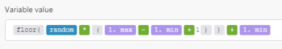

# Math variables

## Access requirements

You must have the following access to use the functionality in this article:

<table cellspacing="0"> 
 <col> 
 <col> 
 <tbody> 
  <tr> 
   <td role="rowheader"><em>Adobe Workfront</em> plan*</td> 
   <td> <p><em>Pro</em> or higher</p> </td> 
  </tr> <draft-comment>
   <tr data-mc-conditions=""> 
    <td role="rowheader"><em>Adobe Workfront</em> license*</td> 
    <td> <p>Plan, Work</p> </td> 
   </tr>
  </draft-comment>
  <tr data-mc-conditions=""> 
   <td role="rowheader"><em>Adobe Workfront</em> license*</td> 
   <td> <p>Plan, Work</p> </td> 
  </tr> 
  <tr> 
   <td role="rowheader"><em>Adobe Workfront Fusion</em> license**</td> 
   <td> <p><em>Workfront Fusion for Work Automation and Integration</em> </p> <draft-comment>
     <p data-mc-conditions="SnippetConditions.HIDE"><em>Workfront Fusion for Work Automation</em> </p>
    </draft-comment><p data-mc-conditions="SnippetConditions.HIDE"><em>Workfront Fusion for Work Automation</em> </p> </td> 
  </tr> 
  <tr> 
   <td role="rowheader">Product</td> 
   <td>Your organization must purchase <em>Adobe Workfront Fusion</em> as well as <em>Adobe Workfront</em> to use functionality described in this article.</td> 
  </tr> <draft-comment>
   <tr data-mc-conditions="QuicksilverOrClassic.Draft mode"> 
    <td role="rowheader">Access level configurations*</td> 
    <td> <draft-comment>
      <p data-mc-conditions="QuicksilverOrClassic.Draft mode">You must be a <em>Workfront Fusion</em> administrator for your organization.</p>
     </draft-comment><p data-mc-conditions="QuicksilverOrClassic.Draft mode">You must be a <em>Workfront Fusion</em> administrator for your organization.</p> <draft-comment>
      <p data-mc-conditions="QuicksilverOrClassic.Draft mode">You must be a <em>Workfront Fusion</em> administrator for your team.</p>
     </draft-comment><p data-mc-conditions="QuicksilverOrClassic.Draft mode">You must be a <em>Workfront Fusion</em> administrator for your team.</p> </td> 
   </tr>
  </draft-comment>
  <tr data-mc-conditions="QuicksilverOrClassic.Draft mode"> 
   <td role="rowheader">Access level configurations*</td> 
   <td> <p data-mc-conditions="QuicksilverOrClassic.Draft mode">You must be a <em>Workfront Fusion</em> administrator for your organization.</p> <p data-mc-conditions="QuicksilverOrClassic.Draft mode">You must be a <em>Workfront Fusion</em> administrator for your team.</p> </td> 
  </tr> 
 </tbody> 
</table>

&#42;To find out what plan, license type, or access you have, contact your *Workfront administrator*.

&#42;&#42;For information on *Adobe Workfront Fusion* licenses, see [Adobe Workfront Fusion licenses](../../workfront-fusion/get-started/license-automation-vs-integration.md)

## random

Returns a floating-point pseudo-random number in the range [

```
0
```

, 

```
1
```

] (inclusive of 

```
0
```

, but not 

```
1
```

).

Use the following formula to generate an integer pseudo-random number in the range [

```
min
```

, 

```
max
```

] (inclusive of both 

```
min
```

and 

```
max
```

):



You can copy and paste the formula's code into a field:
<pre>{{floor(random * (1.max - 1.min + 1)) + 1.min}}</pre>