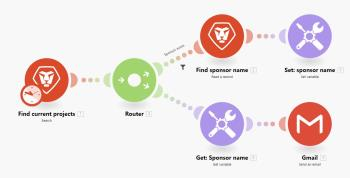

# Basic terms {#basic-terms}

*`Adobe Workfront Fusion`* requires an *`Adobe Workfront Fusion`* license in addition to an *`Adobe Workfront`* license.

<table style="width: 100%;margin-left: 0;margin-right: auto;mc-table-style: url('../../Resources/TableStyles/TableStyle-List-options-in-steps.css');" class="TableStyle-TableStyle-List-options-in-steps" cellspacing="0"> 
 <col class="TableStyle-TableStyle-List-options-in-steps-Column-Column1"> 
 <col class="TableStyle-TableStyle-List-options-in-steps-Column-Column2"> 
 <tbody> 
  <tr class="TableStyle-TableStyle-List-options-in-steps-Body-LightGray"> 
   <td class="TableStyle-TableStyle-List-options-in-steps-BodyE-Column1-LightGray" role="rowheader"> 
Action
 </td> 
   <td class="TableStyle-TableStyle-List-options-in-steps-BodyD-Column2-LightGray">A module that allows you to read or write bundles from or into a selected app or service.</td> 
  </tr> 
  <tr class="TableStyle-TableStyle-List-options-in-steps-Body-MediumGray"> 
   <td class="TableStyle-TableStyle-List-options-in-steps-BodyE-Column1-MediumGray" role="rowheader"> 
Aggregator
 </td> 
   <td class="TableStyle-TableStyle-List-options-in-steps-BodyD-Column2-MediumGray"> 
A type of module that merges together multiple bundles (multiple arrays of data) into one single bundle. For more information, see <a href="aggregator-module.md" class="MCXref xref">Aggregator module</a>.
 </td> 
  </tr> 
  <tr class="TableStyle-TableStyle-List-options-in-steps-Body-LightGray"> 
   <td class="TableStyle-TableStyle-List-options-in-steps-BodyE-Column1-LightGray" role="rowheader">API Key</td> 
   <td class="TableStyle-TableStyle-List-options-in-steps-BodyD-Column2-LightGray">A unique code that identifies the user, developer, or program that is calling a software's API, used for authentication. Since Adobe Workfront Fusion modules work by connecting APIs, API keys are sometimes necessary. API keys are distributed by the app that requires them. For example, if you need an API key for ActiveCampaign, you would request it though your ActiveCampaign account.</td> 
  </tr> 
  <tr class="TableStyle-TableStyle-List-options-in-steps-Body-MediumGray"> 
   <td class="TableStyle-TableStyle-List-options-in-steps-BodyE-Column1-MediumGray" role="rowheader">App or service</td> 
   <td class="TableStyle-TableStyle-List-options-in-steps-BodyD-Column2-MediumGray"> 
A software application, most commonly.
 
An app can also be a special function that manipulates data, such as an iterator or an aggregator. 
 
A service is a source of bundles that might include a web API, web page, different types of servers (FTP, SMTP, IMAP), and so on. 
 
  
 </td> 
  </tr> 
  <tr class="TableStyle-TableStyle-List-options-in-steps-Body-LightGray"> 
   <td class="TableStyle-TableStyle-List-options-in-steps-BodyE-Column1-LightGray" role="rowheader">App connector</td> 
   <td class="TableStyle-TableStyle-List-options-in-steps-BodyD-Column2-LightGray">An app that connects to another system.</td> 
  </tr> 
  <tr class="TableStyle-TableStyle-List-options-in-steps-Body-MediumGray"> 
   <td class="TableStyle-TableStyle-List-options-in-steps-BodyE-Column1-MediumGray" role="rowheader"> 
Bundle
 </td> 
   <td class="TableStyle-TableStyle-List-options-in-steps-BodyD-Column2-MediumGray"> 
A bundle is a basic unit that is returned or received by modules. A bundle consists of items.
 </td> 
  </tr> 
  <tr class="TableStyle-TableStyle-List-options-in-steps-Body-LightGray"> 
   <td class="TableStyle-TableStyle-List-options-in-steps-BodyE-Column1-LightGray" role="rowheader"> 
Connection
 </td> 
   <td class="TableStyle-TableStyle-List-options-in-steps-BodyD-Column2-LightGray"> 
When adding an app or service to a scenario, most likely you will have to first create a connection between Workfront Fusion and the app or service in order to retrieve or send the selected data. For more information, see <a href="about-connecting-wf-fusion-to-app-or-service.md" class="MCXref xref">About connecting Adobe Workfront Fusion to an app or service</a>.
 </td> 
  </tr> 
  <tr class="TableStyle-TableStyle-List-options-in-steps-Body-MediumGray"> 
   <td class="TableStyle-TableStyle-List-options-in-steps-BodyE-Column1-MediumGray" role="rowheader"> 
Cycle
 </td> 
   <td class="TableStyle-TableStyle-List-options-in-steps-BodyD-Column2-MediumGray"> 
A cycle refers to two phases of the scenario run: operation and commit. The scenario may consists of one or more cycles. For more detailed information, see <a href="scenario-execution-cycles-phases.md" class="MCXref xref">Scenario execution, cycles, and phases</a>.
 </td> 
  </tr> 
  <tr class="TableStyle-TableStyle-List-options-in-steps-Body-LightGray"> 
   <td class="TableStyle-TableStyle-List-options-in-steps-BodyE-Column1-LightGray" role="rowheader"> 
Data Store
 </td> 
   <td class="TableStyle-TableStyle-List-options-in-steps-BodyD-Column2-LightGray"> 
A tool that stores data from scenarios or allows you to transfer data between individual scenarios or scenario runs. For more information, see <a href="data-stores.md" class="MCXref xref">Data Stores</a>.
 </td> 
  </tr> 
  <tr class="TableStyle-TableStyle-List-options-in-steps-Body-MediumGray"> 
   <td class="TableStyle-TableStyle-List-options-in-steps-BodyE-Column1-MediumGray" role="rowheader"> 
Data Transfer
 </td> 
   <td class="TableStyle-TableStyle-List-options-in-steps-BodyD-Column2-MediumGray"> 
The amount of data transferred through your scenario. For more information, see <a href="scenario-detail.md" class="MCXref xref">Scenario detail</a>.
 </td> 
  </tr> 
  <tr class="TableStyle-TableStyle-List-options-in-steps-Body-LightGray"> 
   <td class="TableStyle-TableStyle-List-options-in-steps-BodyE-Column1-LightGray" role="rowheader"> 
Filter
 </td> 
   <td class="TableStyle-TableStyle-List-options-in-steps-BodyD-Column2-LightGray"> 
Additional features that can be applied between two modules. A filter allows you to then only work with bundles that fit certain criteria. There are a number of different filters you can apply. For more information, see <a href="add-a-filter-to-a-scenario.md" class="MCXref xref">Add a filter to a scenario</a>.
 </td> 
  </tr> 
  <tr class="TableStyle-TableStyle-List-options-in-steps-Body-MediumGray"> 
   <td class="TableStyle-TableStyle-List-options-in-steps-BodyE-Column1-MediumGray" role="rowheader"> 
ID
 </td> 
   <td class="TableStyle-TableStyle-List-options-in-steps-BodyD-Column2-MediumGray"> 
A name that is used to uniquely identify a bundle. An ID is usually used to differentiate a bundle that is to be updated or deleted from a given service.
 </td> 
  </tr> 
  <tr class="TableStyle-TableStyle-List-options-in-steps-Body-LightGray"> 
   <td class="TableStyle-TableStyle-List-options-in-steps-BodyE-Column1-LightGray" role="rowheader"> 
Items
 </td> 
   <td class="TableStyle-TableStyle-List-options-in-steps-BodyD-Column2-LightGray"> 
A part of a bundle. Bundles can consist of multiple items. There are several different types of items: text, number, boolean (yes/no), date, time, buffer (binary data), collections, select menu, array, and validation.
 </td> 
  </tr> 
  <tr class="TableStyle-TableStyle-List-options-in-steps-Body-MediumGray"> 
   <td class="TableStyle-TableStyle-List-options-in-steps-BodyE-Column1-MediumGray" role="rowheader"> 
Iterator
 </td> 
   <td class="TableStyle-TableStyle-List-options-in-steps-BodyD-Column2-MediumGray"> 
A type of module that allows you to take one bundle of data (an array of data) and divide into separate bundles. For more information, see <a href="iterator-module.md" class="MCXref xref">Iterator module</a>.
 </td> 
  </tr> 
  <tr class="TableStyle-TableStyle-List-options-in-steps-Body-LightGray"> 
   <td class="TableStyle-TableStyle-List-options-in-steps-BodyE-Column1-LightGray" role="rowheader"> 
Module
 </td> 
   <td class="TableStyle-TableStyle-List-options-in-steps-BodyD-Column2-LightGray"> 
A single step within a scenario that performs a function, such as creating a record, within the associated app or service.
 
Each app or service has various modules that define the way it responds to a request.
 
There are 4 types of modules: actions, triggers, iterators, and aggregators.
 
  
 
For more information, see <a href="module-types.md" class="MCXref xref">Types of modules</a>.
 </td> 
  </tr> 
  <tr class="TableStyle-TableStyle-List-options-in-steps-Body-MediumGray"> 
   <td class="TableStyle-TableStyle-List-options-in-steps-BodyE-Column1-MediumGray" role="rowheader"> 
Operation
 </td> 
   <td class="TableStyle-TableStyle-List-options-in-steps-BodyD-Column2-MediumGray"> 
A task performed by a module. 
 </td> 
  </tr> 
  <tr class="TableStyle-TableStyle-List-options-in-steps-Body-LightGray"> 
   <td class="TableStyle-TableStyle-List-options-in-steps-BodyE-Column1-LightGray" role="rowheader">Public/Private Keys</td> 
   <td class="TableStyle-TableStyle-List-options-in-steps-BodyD-Column2-LightGray">Public and private keys are used to encrypt and decrypt data. The public key can be distributed, and anyone with the public key can encrypt data, but only the private key can decrypt it. Similarly, a user with a private key can encrypt data that anyone with the public key can decrypt. The private key encryption assures that the data came from the owner of the private key and serves as validation of the data's source.</td> 
  </tr> 
  <tr class="TableStyle-TableStyle-List-options-in-steps-Body-MediumGray"> 
   <td class="TableStyle-TableStyle-List-options-in-steps-BodyE-Column1-MediumGray" role="rowheader"> 
Router
 </td> 
   <td class="TableStyle-TableStyle-List-options-in-steps-BodyD-Column2-MediumGray">Allows you to duplicate data or add new routes to a scenario, so to re-route data and handle different groups of data separately. For more information, see <a href="router-module.md" class="MCXref xref">Router module</a>.</td> 
  </tr> 
  <tr class="TableStyle-TableStyle-List-options-in-steps-Body-LightGray"> 
   <td class="TableStyle-TableStyle-List-options-in-steps-BodyE-Column1-LightGray" role="rowheader"> 
Scenario
 </td> 
   <td class="TableStyle-TableStyle-List-options-in-steps-BodyD-Column2-LightGray"> 
A user-created series of automated steps, each represented and performed by a module. The purpose of a scenario is to move and manipulate data.
 
  
 
 For more information, see <a href="create-a-scenario.md" class="MCXref xref">Create a scenario</a>.
 </td> 
  </tr> 
  <tr class="TableStyle-TableStyle-List-options-in-steps-Body-MediumGray"> 
   <td class="TableStyle-TableStyle-List-options-in-steps-BodyE-Column1-MediumGray" role="rowheader"> 
Transactions
 </td> 
   <td class="TableStyle-TableStyle-List-options-in-steps-BodyD-Column2-MediumGray"> 
Workfront Fusion uses transactional processing to capture the scenario lifecycle. A transaction consists of several phases during which data is transformed from one consistent state into another consistent state. There are 4 phases: initalization, operation (reading or writing), commit/rollback, and finalization.
 </td> 
  </tr> 
  <tr class="TableStyle-TableStyle-List-options-in-steps-Body-LightGray"> 
   <td class="TableStyle-TableStyle-List-options-in-steps-BodyE-Column1-LightGray" role="rowheader"> 
Trigger
 </td> 
   <td class="TableStyle-TableStyle-List-options-in-steps-BodyD-Column2-LightGray"> 
A module that allows you to grab bundles that were added or updated since the last run of a scenario. There are 2 types of triggers: polling and instant (webhooks). For more information, see <a href="instant-triggers-webhooks.md" class="MCXref xref">Instant triggers (webhooks)</a>.
 </td> 
  </tr> 
  <tr class="TableStyle-TableStyle-List-options-in-steps-Body-MediumGray"> 
   <td class="TableStyle-TableStyle-List-options-in-steps-BodyB-Column1-MediumGray" role="rowheader"> 
Webhook
 </td> 
   <td class="TableStyle-TableStyle-List-options-in-steps-BodyA-Column2-MediumGray"> 
A special type of trigger that allows you to run a scenario immediately after a new bundle is available. For more information, see <a href="instant-triggers-webhooks.md" class="MCXref xref">Instant triggers (webhooks)</a>.
 </td> 
  </tr> 
 </tbody> 
</table>

