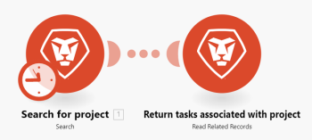
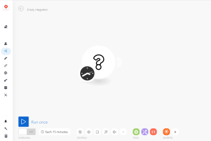
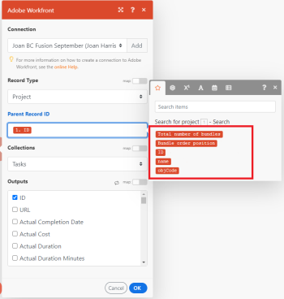
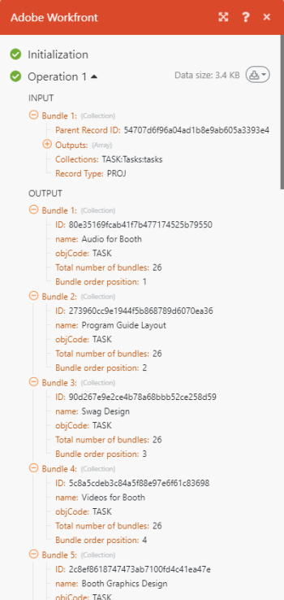

# Create a practice automation scenario

This article describes how to create an automation scenario with Adobe Workfront Fusion. Automation scenarios automate `Workfront` processes, including data manipulation and transformation. This example takes you through the process of creating a scenario that searches for a project and then returns all of the tasks associated with that project.

For instructions on building an integration scenario that connects separate apps, see [Create a practice integration scenario](../../workfront-fusion/get-started/create-a-practice-scenario.md).

For more information on functionality available with each `Workfront Fusion` license, see [Adobe Workfront Fusion licenses](../../workfront-fusion/get-started/license-automation-vs-integration.md).

## Access requirements

You must have the following access to use the functionality in this article:

<table cellspacing="0"> 
 <col> 
 <col> 
 <tbody> 
  <tr> 
   <td role="rowheader">Adobe Workfront plan*</td> 
   <td> 
Pro or higher
 </td> 
  </tr> Adobe Workfront license* Plan, Work 
  <tr> 
   <td role="rowheader">Adobe Workfront Fusion license**</td> 
   <td> 
Workfront Fusion for Work Automation and Integration 
  </td> 
  </tr> 
  <tr> 
   <td role="rowheader">Product</td> 
   <td>Your organization must purchase Adobe Workfront Fusion as well as Adobe Workfront to use functionality described in this article.</td> 
  </tr> <!--
   Access level configurations* You must be a Workfront Fusion administrator for your organization. You must be a Workfront Fusion administrator for your team.
  --> 
 </tbody> 
</table>

&#42;To find out what plan, license type, or access you have, contact your `Workfront administrator`.

&#42;&#42;For information on `Adobe Workfront Fusion` licenses, see [Adobe Workfront Fusion licenses](../../workfront-fusion/get-started/license-automation-vs-integration.md)

## Create a practice scenario

The role of `Adobe Workfront Fusion` is to seamlessly connect your apps and web services and automate your processes so that you can concentrate on new tasks rather than repeating the same tasks again and again. It works by linking actions within and between apps and services to create a scenario that transfers and transforms your data automatically. The scenario you create watches for data in an app or service and processes that data to provide the result you want.

A scenario is comprised of a series of modules that indicate how data should be transformed within an app or transferred between apps and web services.
This example takes you through the process of creating a scenario that searches for a `Workfront` project and returns the tasks in the project.

Creating a scenario consists of several main tasks:

## Choose the apps and name the scenario

<ol> 
 <li value="1">Sign into your Workfront Fusion account.</li> 
 <li value="2"> 
Click Scenarios  in the left panel.
 
In the left panel that displays, you can organize your scenarios into folders.
 
At the top of the main area to the right, you can view All scenarios you have built, your Active Scenarios, Inactive Scenarios, and Concepts. Concepts are scenarios that need some more work before Workfront Fusion can classify them as active or inactive.
 
  
 </li> 
 <li value="3">In the left panel, click the Add folder icon , then type a name like "Practice scenarios" for your first folder.</li> 
 <li value="4"> 
Open the folder, then click Create a new scenario in the upper-right corner of the page.
 
The landing page that displays lets you pre-load any apps you want to use in the scenario you are going to build.
 </li> 
 <li value="5"> 
For this exercise, search for and select the Workfront app.
 </li> 
 <li value="6"> 
Click Continue in the upper-right corner.
 
The scenario editor displays, containing an empty module in the center, the Workfront app you pre-loaded, and some options in the toolbar at the bottom.
 
  
 
When you begin creating a new scenario, it's a good idea to start by creating a name for it. 
 </li> 
 <li value="7">Select the New scenario placeholder name in the upper-left corner, then type a name such as "Practice scenario 1."</li> 
 <li value="8">Continue with <a href="#build" class="MCXref xref">Add and configure the first module</a> below.</li> 
</ol>

## Add and configure the first module

The empty module with a question mark represents the trigger module you need to add. This module will start the scenario each time it runs. The clock icon on the empty module indicates that is a scheduled module.

This module will contain the data that you want the scenario to watch for.

For this example, we are not using a trigger module. Instead, this scenario begins with a search.

<ol> 
 <li value="1"> 
Click the empty module to choose the app from which you will select a module.
 
The app you pre-loaded earlier displays next to the empty module. You can add any other apps that have modules using the Search box.
 
  
 </li> 
 <li value="2"> 
Click Workfront.
 
The list changes to display all Workfront modules that you can use as a trigger module.
 </li> 
 <li value="3"> 
Click the Search module Search.
 
Now you need to establish an authenticated connection to your Workfront account. Every module you add to a scenario must have a connection to its app.
 </li> 
 <li value="4"> 
In the Workfront box, under Connection, click Add, then type a name for the connection, such as "Olivia's Workfront account," then click Continue.
 </li> 
 <li value="5"> 
Authenticate the connection in the window that displays.
 
The process for authenticating a connection can vary a bit between apps. The following process is specific to Workfront, but the process is similar to many apps.
 
  <ol> 
   <li value="1"> 
Enter your Workfront domain, then click <b>Continue</b>. 
 </li> 
   <li value="2"> 
Log into Workfront.
 </li> 
   <li value="3"> 
Examine the access that Workfront Fusion is requesting, then click Allow Access.
 </li> 
  </ol> 
 If you need help, see <a href="../../workfront-fusion/connections/about-connecting-wf-fusion-to-app-or-service.md" class="MCXref xref">About connecting Adobe Workfront Fusion to an app or service</a>.
 </li> 
</ol>

## Configure the first module

After you connect `Workfront Fusion` to your `Workfront` account, you can specify a Workfront request queue that you have access to and the data there that you want the first module to process.

<ol> 
 <li value="1"> 
In the Record Type box, select <b>Project</b>. This sets the module to search only projects.
 <note type="tip">
   You can find 
   Project in the list if you start typing the word "project."
  </note> </li> 
 <li value="2"> 
In the Result Set box, select First Matching Record. This sets the module to return only the first record it finds that meets the criteria. For this example, we need only one record returned. 
 </li> 
 <li value="3"> 
In the Search criteria area, we'll set up a filter to return the specific project.
 
  <ol> 
   <li value="1"> 
In the first box under Search Criteria, select the field that you want to search the values of. For this example, select <b>Name</b>.
 </li> 
   <li value="2"> 
For the operator, select Contains (case insensitive). This allows the module to find projects with your chosen words in its name, even if you do not enter the entire name, or enter the name with the incorrect case (such as all caps).
 </li> 
   <li value="3"> 
In the last field under Search Criteria, enter a word or phrase that you know is in the name of the project you are searching for.
 </li> 
  </ol> </li> 
 <li value="4"> 
In the <b>Outputs</b> list, select the fields that you want the issue to output. For this example, select the <b>ID</b> and <b>Name</b> fields.
 <note type="tip">
   You can use 
   Command+F (Mac OS) or 
   Ctrl-F(Windows OS) to find a field quickly.
  </note> </li> 
 <li value="5"> 
Click OK.
 <note type="note"> 
   
(Information only) Since this is not a trigger module, you do not choose where to start it. When using a trigger module, you would now select where to start it. 
 
   
For more information, see <a href="../../workfront-fusion/modules/choose-where-trigger-module-starts.md" class="MCXref xref">Choose where a trigger module starts</a>.
 
  </note> </li> 
 <li value="6"> 
Right-click the module, click Rename, then type a name the describes what you want the module to do (such as "Search for project)," then click OK.
 
The name appears just below the module. Below that, Workfront Fusion includes a brief description of the type of action performed by the module.
 
  
 </li> 
 <li value="7">Continue with <a href="#configur" class="MCXref xref">Add and configure the second module</a>.</li> 
</ol>

## Add and configure the second module

<ol data-mc-continue="false"> 
 <li value="1"> 
Click the partial circle to the right of the of the module to Add another module.
 </li> 
 <li value="2"> 
Select Workfront from the list of applications, then choose the search module <b>Read Related Records</b>.
 </li> 
 <li value="3"> 
You already created a connection to Workfront for the previous module. You don't need to create it again here, but you must make sure this module is using the same connection as the previous module.  In the <b>Connection</b> box, select the connection that you created for the previous module.
 </li> 
 <li value="4"> 
 Click Record type, then select Project, because we want to read records related to a project.
 <note type="tip">
   You can find 
   Project in the list if you start typing the word "project."
  </note> </li> 
 <li value="5"> 
Click the Parent Record ID field. This field requires the Workfront ID&nbsp;of the project that you want to return tasks from.
 
Clicking the field opens the list of variables that you can use in the Parent Record ID field to identify the project in Workfront.
 
  
 </li> 
 <li value="6"> 
Click the variable ID to add it to the Parent Record ID field. This allows the ID&nbsp;returned from the first module to be used as the identifier for the project that you want to work with in the second module, which ensures that the tasks returned will belong to that project.
 </li> 
 <li value="7"> 
In the <b>Collections</b> field, select <b>Tasks</b>. This indicates that the module is to return tasks associated with the chosen project.
 </li> 
 <li value="8"> 
Click OK
 
Now you have a working scenario.
 </li> 
 <li value="9">Give the second module a name such as "Return tasks associated with project," then continue with <a href="#test" class="MCXref xref">Test the scenario</a>.</li> 
</ol>

## Test the scenario

Before you activate your scenario, it's important to test it by running it at least once and viewing the results. This helps you understand how data flows through the scenario and find any errors.

We chose to have 1 project returned, as well as the tasks associated with that project. If you run the scenario, that is what should happen.

<ol> 
 <li value="1"> 
Click Run once in the lower-left corner of the scenario editor.
 </li> 
 <li value="2"> 
After the scenario finishes running, click the bubble above the first module.
 
  
 
In the box that appears, you can view information about the bundle of data that the module processed, including the actual data that was pulled from the project that the module returned.
 
  
 </li> 
 <li value="3"> 
Click the execution inspector bubble above the Second module to see the input of information and the output, which is a collection of tasks contained in the project.
 
  
 
You can learn more about how to read scenario execution information in the following articles:
 
  <ul> 
   <li>For general information, see <a href="../../workfront-fusion/scenarios/scenario-execution-flow.md" class="MCXref xref">Scenario execution flow</a>.</li> 
   <li>For information about processed bundles, see <a href="../../workfront-fusion/scenarios/scenario-execution-cycles-phases.md" class="MCXref xref">Scenario execution, cycles, and phases</a>.</li> 
  </ul> </li> 
 <li value="4"> 
In Workfront Fusion, click Save  near the lower-left corner to save your progress on the scenario.
 <note type="important">
   Save often as you hone and test a scenario.
  </note> </li> 
</ol>

` `**Tip: **`` We recommend the optional but useful practice of adding notes about each module.

<ol> 
 <li value="1">Right-click a Workfront module, then click Add a note.</li> 
 <li value="2"> 
In the note that displays, type an overview for the module.
 
You can add multiple notes for a module.
 </li> 
 <li value="3"> 
Close the Notes area.
 
After you add a note to a scenario, an orange dot displays on the Notes icon  at the bottom of the scenario editor.
 </li> 
 <li value="4">Click the Notes icon  to view your notes.</li> 
</ol>

## Activate the scenario

This example scenario does not have a trigger module. If this were a scenario you would be using for real data it would start with a trigger module, and the last thing you would do is activate it. After you activate a scenario, by default, it runs every 15 minutes. You can change this by defining when and how often you want it to run.

For more information about activating scenarios, see [Activate or deactivate a scenario](../../workfront-fusion/scenarios/activate-or-inactivate-scenario.md).

For information about schedules, see [Schedule a scenario](../../workfront-fusion/scenarios/schedule-a-scenario.md).
