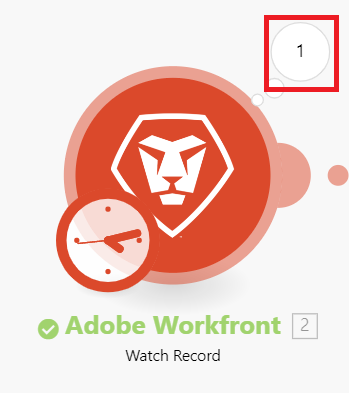

# Get started creating a scenario: Exercise 2

<!--

&nbsp;

-->

&nbsp;

<!--

--------------------

-->

--------------------

<!--

We will create a scenario that creates a new project in <em>Adobe Workfront Fusion</em> for every sales opportunity that is closed in Salesforce.

-->

We will create a scenario that creates a new project in *Adobe Workfront Fusion* for every sales opportunity that is closed in Salesforce.

<!--

RESHOOT - this is alloy

-->

RESHOOT - this is alloy

1. 

   <!--
   
In the Type box, select Opportunity to specify the type of information the module will be looking for.

   -->

   In the `Type` box, select `Opportunity` to specify the type of information the module will be looking for.

1. 

   <!--
   
In the Maximum count of records box, type the number of opportunities you want the module to watch to see if they close.

   -->

   In the `Maximum count of records` box, type the number of opportunities you want the module to watch to see if they close.

   <!--
   
We'll type 10 for this example.

   -->

   We'll type 10 for this example.

1. 

   <!--
   
In the Watch box, select an option to indicate whether you want the module to watch Only new records or New records and all changes.

   -->

   In the `Watch` box, select an option to indicate whether you want the module to watch `Only new records` or `New records and all changes`.

   <!--
   
Let's select New records and all changes.

   -->

   Let's select `New records and all changes`.

   <!--
   <li value="4" data-mc-conditions="QuicksilverOrClassic.Draft mode">Click OK.</li>
   -->

1. Click `OK`.
1. 

   <!--
   
In the Choose where to start box, specify where you want the module to start its processing.

   -->

   In the `Choose where to start` box, specify where you want the module to start its processing.

   <!--
   
Let's select Records from after a specific date, then select a date about 6 months ago.

   -->

   Let's select `Records from after a specific date`, then select a date about 6 months ago.

   <!--
   <li value="6" data-mc-conditions="QuicksilverOrClassic.Draft mode">Click OK.</li>
   -->

1. Click `OK`.

<!--

Mapping is the process of assigning a module's outputs, structured into items, to the module's input fields. You can learn a lot about mapping items between modules in the following articles:

-->

Mapping is the process of assigning a module's outputs, structured into items, to the module's input fields. You can learn a lot about mapping items between modules in the following articles:

  <!--
  <li data-mc-conditions="QuicksilverOrClassic.Draft mode">For more information about trigger modules, see <a href="../../workfront-fusion/modules/module-types.md" class="MCXref xref" xrefformat="{para}">Types of modules</a>.</li>
  -->

* For more information about trigger modules, see [Types of modules](../../workfront-fusion/modules/module-types.md).

  <!--
  <li data-mc-conditions="QuicksilverOrClassic.Draft mode">For more information about connecting <em>Workfront Fusion</em> to an app, see <a href="../../workfront-fusion/connections/about-connecting-wf-fusion-to-app-or-service.md" class="MCXref xref" xrefformat="{para}">About connecting Adobe Workfront Fusion to an app or service</a>.</li>
  -->

* For more information about connecting *Workfront Fusion* to an app, see [About connecting Adobe Workfront Fusion to an app or service](../../workfront-fusion/connections/about-connecting-wf-fusion-to-app-or-service.md).

  <!--
  <li data-mc-conditions="QuicksilverOrClassic.Draft mode">For more information on choosing where to start, see <a href="../../workfront-fusion/modules/choose-where-trigger-module-starts.md" class="MCXref xref" xrefformat="{para}">Choose where a trigger module starts</a>.</li>
  -->

* For more information on choosing where to start, see [Choose where a trigger module starts](../../workfront-fusion/modules/choose-where-trigger-module-starts.md).

  <!--
  <li data-mc-conditions="QuicksilverOrClassic.Draft mode">For more information on mapping items, see <a href="../../workfront-fusion/mapping/map-information-between-modules.md" class="MCXref xref" xrefformat="{para}">Map information from one module to another</a>.</li>
  -->

* For more information on mapping items, see [Map information from one module to another](../../workfront-fusion/mapping/map-information-between-modules.md).

<!--
<h2 data-mc-conditions="QuicksilverOrClassic.Draft mode">Add the second module and specify what it will do</h2>
-->

## Add the second module and specify what it will do

<ol data-mc-continue="false"> <draft-comment>
  <li value="1" data-mc-conditions="QuicksilverOrClassic.Draft mode">Click the right handle of the Salesforce module.</li>
 </draft-comment>
 <li value="1" data-mc-conditions="QuicksilverOrClassic.Draft mode">Click the right handle of the Salesforce module.</li> 
 <li value="2"> <draft-comment>
   
Click Workfront > Create Record.

  </draft-comment>
Click Workfront > Create Record.
 <draft-comment>
   
Normally, in the box that displays for setting up the module, you would need to create a connection between <em>Workfront Fusion</em> and the module. This won't be necessary for the <em>Workfront</em> module.

  </draft-comment>
Normally, in the box that displays for setting up the module, you would need to create a connection between <em>Workfront Fusion</em> and the module. This won't be necessary for the <em>Workfront</em> module.
 </li> 
 <li value="3"> <draft-comment>
   
 In the Workfront box, under Record type, click Project.

  </draft-comment>
 In the Workfront box, under Record type, click Project.
 <draft-comment>
   
The box expands to display all the fields available for a <em>Workfront</em> project. 

  </draft-comment>
The box expands to display all the fields available for a <em>Workfront</em> project. 
 </li> 
 <li value="4"> <draft-comment>
   
We're going to choose the Name field so that this module creates each project with the same name as the corresponding closed opportunity in Salesforce. 

  </draft-comment>
We're going to choose the Name field so that this module creates each project with the same name as the corresponding closed opportunity in Salesforce. 
 <draft-comment>
   
You can use Ctrl-F to find the field you want quickly.

  </draft-comment>
You can use Ctrl-F to find the field you want quickly.
 <draft-comment>
   
  

  </draft-comment>
  
 </li> <draft-comment>
  <li value="5" data-mc-conditions="QuicksilverOrClassic.Draft mode"> Click the Name field, then click the Name variable in the list that appears. </li>
 </draft-comment>
 <li value="5" data-mc-conditions="QuicksilverOrClassic.Draft mode"> Click the Name field, then click the Name variable in the list that appears. </li> 
</ol>

<!--
<h2 data-mc-conditions="QuicksilverOrClassic.Draft mode">Test the scenario</h2>
-->

## Test the scenario

<!--

Before you activate your scenario, it's important to test your scenario by running it at least once and viewing the results. This helps you understand how data flows through the scenario and find any errors it contains.

-->

Before you activate your scenario, it's important to test your scenario by running it at least once and viewing the results. This helps you understand how data flows through the scenario and find any errors it contains.

<ol> 
 <li value="1"> <draft-comment>
   
Click Run once in the lower-left corner of the scenario editor.

  </draft-comment>
Click Run once in the lower-left corner of the scenario editor.
 </li> 
 <li value="2"> <draft-comment>
   
After the scenario finishes running, click the bubble above a module. 

  </draft-comment>
After the scenario finishes running, click the bubble above a module. 
 <draft-comment>
   
  

  </draft-comment>
  
 </li> 
 <li value="3"> <draft-comment>
   
In the box that appears, view information about the bundles of data that the module processed, including the number of operations that occurred in it. 

  </draft-comment>
In the box that appears, view information about the bundles of data that the module processed, including the number of operations that occurred in it. 
 <draft-comment>
   
You can look at each individual operation to see which module settings were used and which bundles were returned by which module. 

  </draft-comment>
You can look at each individual operation to see which module settings were used and which bundles were returned by which module. 
 <draft-comment>
   
  

  </draft-comment>
  
 <draft-comment>
   
In the past 6 months, the scenario found 1 Salesforce opportunity that closed. 

  </draft-comment>
In the past 6 months, the scenario found 1 Salesforce opportunity that closed. 
 <draft-comment>
   
  

  </draft-comment>
  
 </li> 
</ol>

<!--

You can learn more about how to read scenario execution information in the following articles:

-->

You can learn more about how to read scenario execution information in the following articles:

  <!--
  <li data-mc-conditions="QuicksilverOrClassic.Draft mode">For general information, see <a href="../../workfront-fusion/scenarios/scenario-execution-flow.md" class="MCXref xref" xrefformat="{para}">Scenario execution flow</a>.</li>
  -->

* For general information, see [Scenario execution flow](../../workfront-fusion/scenarios/scenario-execution-flow.md).

  <!--
  <li data-mc-conditions="QuicksilverOrClassic.Draft mode">For information about processed bundles, see <a href="../../workfront-fusion/scenarios/scenario-execution-cycles-phases.md" class="MCXref xref" xrefformat="{para}">Scenario execution, cycles, and phases</a>.</li>
  -->

* For information about processed bundles, see [Scenario execution, cycles, and phases](../../workfront-fusion/scenarios/scenario-execution-cycles-phases.md).

  <!--
  <li data-mc-conditions="QuicksilverOrClassic.Draft mode">For information about number of operations, see .</li>
  -->

* For information about number of operations, see .

<!--
<h2 data-mc-conditions="QuicksilverOrClassic.Draft mode">Activate the scenario</h2>
-->

## Activate the scenario

<!--

Your scenario is almost ready for use, but it's still inactive.

-->

Your scenario is almost ready for use, but it's still inactive.

<!--

To activate the scenario:

-->

To activate the scenario:

<ol> 
 <li value="1"> <draft-comment>
   
Click the left arrow  near the upper-left corner of the scenario editor to exit the editor and return to the scenario page.

  </draft-comment>
Click the left arrow  near the upper-left corner of the scenario editor to exit the editor and return to the scenario page.
 </li> <draft-comment>
  <li value="2" data-mc-conditions="QuicksilverOrClassic.Draft mode">To activate the scenario, click the On/Off button at the top of the scenario page.</li>
 </draft-comment>
 <li value="2" data-mc-conditions="QuicksilverOrClassic.Draft mode">To activate the scenario, click the On/Off button at the top of the scenario page.</li> 
</ol>

<!--

After you active a scenario, it scenario runs according to its schedule.

-->

After you active a scenario, it scenario runs according to its schedule.

<!--

For more information about activating scenarios, see <a href="../../workfront-fusion/scenarios/activate-or-inactivate-scenario.md" class="MCXref xref" xrefformat="{para}">Activate or deactivate a scenario</a>.

-->

For more information about activating scenarios, see [Activate or deactivate a scenario](../../workfront-fusion/scenarios/activate-or-inactivate-scenario.md).

<!--

For more information about schedules, see <a href="../../workfront-fusion/scenarios/schedule-a-scenario.md" class="MCXref xref" xrefformat="{para}">Schedule a scenario</a>.

-->

For more information about schedules, see [Schedule a scenario](../../workfront-fusion/scenarios/schedule-a-scenario.md).

<!--

&nbsp;

-->

&nbsp;

<!--

&nbsp;

-->

&nbsp;

<!--

&nbsp;

-->

&nbsp;

<!--

Mapping is the process of assigning a module's outputs, structured into items, to the module's input fields. You can learn a lot about mapping items between modules in the following articles:

-->

Mapping is the process of assigning a module's outputs, structured into items, to the module's input fields. You can learn a lot about mapping items between modules in the following articles:

  <!--
  <li data-mc-conditions="QuicksilverOrClassic.Draft mode">For more information on triggers, see <a href="../../workfront-fusion/modules/module-types.md" class="MCXref xref" xrefformat="{para}">Types of modules</a>.</li>
  -->

* For more information on triggers, see [Types of modules](../../workfront-fusion/modules/module-types.md).

  <!--
  <li data-mc-conditions="QuicksilverOrClassic.Draft mode">For more information on connections, see <a href="../../workfront-fusion/connections/about-connecting-wf-fusion-to-app-or-service.md" class="MCXref xref" xrefformat="{para}">About connecting Adobe Workfront Fusion to an app or service</a>.</li>
  -->

* For more information on connections, see [About connecting Adobe Workfront Fusion to an app or service](../../workfront-fusion/connections/about-connecting-wf-fusion-to-app-or-service.md).

  <!--
  <li data-mc-conditions="QuicksilverOrClassic.Draft mode">For more information on choosing where to start, see <a href="../../workfront-fusion/modules/choose-where-trigger-module-starts.md" class="MCXref xref" xrefformat="{para}">Choose where a trigger module starts</a>.</li>
  -->

* For more information on choosing where to start, see [Choose where a trigger module starts](../../workfront-fusion/modules/choose-where-trigger-module-starts.md).

  <!--
  <li data-mc-conditions="QuicksilverOrClassic.Draft mode">For more information on mapping items, see <a href="../../workfront-fusion/mapping/map-information-between-modules.md" class="MCXref xref" xrefformat="{para}">Map information from one module to another</a>.</li>
  -->

* For more information on mapping items, see [Map information from one module to another](../../workfront-fusion/mapping/map-information-between-modules.md).

