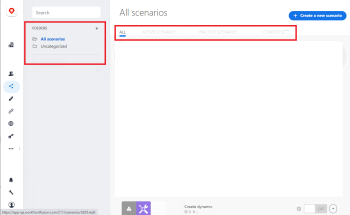
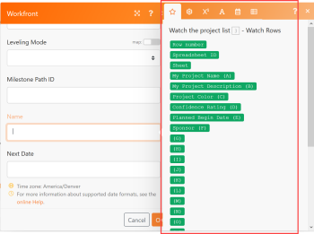
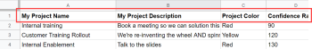
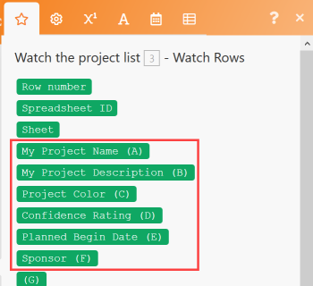
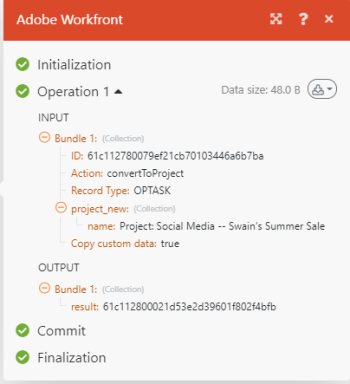

# Create a practice integration scenario

This article describes how to create an integration scenario with Adobe Workfront Fusion. Integration scenarios connect separate apps together, allowing your data to flow through different applications.

To create an integration scenario, your organization must have a Workfront Fusion for Work Automation and Integration license.

For instructions on building a Workfront-only automation scenario, see [Create a practice automation scenario](../../workfront-fusion/get-started/create-a-practice-automation-scenario.md)

For more information on Workfront Fusion licenses, see [Adobe Workfront Fusion licenses](../../workfront-fusion/get-started/license-automation-vs-integration.md).

## Access requirements

You must have the following access to use the functionality in this article:

<table cellspacing="0"> 
 <col> 
 <col> 
 <tbody> 
  <tr> 
   <td role="rowheader">Adobe Workfront plan*</td> 
   <td> 
Pro or higher
 </td> 
  </tr> Adobe Workfront license* Plan, Work 
  <tr> 
   <td role="rowheader">Adobe Workfront Fusion license**</td> 
   <td> 
Workfront Fusion for Work Automation and Integration 
 </td> 
  </tr> 
  <tr> 
   <td role="rowheader">Product</td> 
   <td>Your organization must purchase Adobe Workfront Fusion as well as Adobe Workfront to use functionality described in this article.</td> 
  </tr> <!--
   Access level configurations* You must be a Workfront Fusion administrator for your organization. You must be a Workfront Fusion administrator for your team.
  --> 
 </tbody> 
</table>

&#42;To find out what plan, license type, or access you have, contact your Workfront administrator.

&#42;&#42;For information on Adobe Workfront Fusion licenses, see [Adobe Workfront Fusion licenses](../../workfront-fusion/get-started/license-automation-vs-integration.md)

## Create a practice scenario

The role of Adobe Workfront Fusion is to seamlessly connect your apps and web services and automate your processes so that you can concentrate on new tasks rather than repeating the same tasks again and again. It works by linking actions within and between apps and services to create a scenario that transfers and transforms your data automatically. The scenario you create watches for data in an app or service and processes that data to provide the result you want.

A scenario is comprised of a series of modules that indicate how data should be transformed within an app or transferred between apps and web services.
To explain how to create a scenario and reinforce best practices as you learn to use Workfront Fusion, this article takes you through the process step-by-step. We will create a scenario that creates a new record in Workfront for every row in a Google Sheets spreadsheet.

>[!TIP]
>
>A scenario like this would be useful if you had a spreadsheet listing projects that need to be worked on using projects in Workfront. The scenario could "watch" the spreadsheet for new rows and add a new project in Workfront for each one.

Creating a scenario consists of several main tasks:

## Choose the apps and name the scenario

<ol> 
 <li value="1"> 
Download this <a href="https://cdn.experience.workfront.com/Documentation/Workfront+Fusion/Fusion+Practice+Scenario+Sample+Sheet.xlsx">spreadsheet</a>, then upload it to your Google Drive for use throughout this exercise.
 
Or
 
Create or find your own simple Google Sheets spreadsheet similar to this one:
 
  
 </li> 
 <li value="2">Sign into your Workfront Fusion account.</li> 
 <li value="3"> 
Click Scenarios  in the left panel.
 
In the left panel that displays, you can organize your scenarios into folders.
 
At the top of the main area to the right, you can view All scenarios you have built, your Active Scenarios and Inactive Scenarios, and Concepts, which are scenarios that need some more work before Workfront Fusion can classify them as active or inactive.
 
  
 </li> 
 <li value="4">In the left panel, click the Add folder icon , then type a name like "Practice scenarios" for your first folder.</li> 
 <li value="5"> 
Open the folder, then click Create a new scenario in the upper-right corner of the page.
 
The landing page that displays lets you pre-load any apps you want to use in the scenario you are going to build.
 </li> 
 <li value="6"> 
For this exercise, search for and select the Google Sheets app.
 </li> 
 <li value="7"> 
Click Continue in the upper-right corner.
 
The scenario editor displays, containing an empty module in the center, the Google Sheets app you pre-loaded, and some options in the toolbar at the bottom.
 
  
 
When you begin creating a new scenario, it's a good idea to start by creating a name for it. 
 </li> 
 <li value="8">Select the New scenario placeholder name in the upper-left corner, then type a name such as "Practice scenario 1."</li> 
 <li value="9">Continue with <a href="#build" class="MCXref xref">Add and configure the first module</a> below.</li> 
</ol>

## Add and configure the first module

The empty module with a question mark represents the trigger module you need to add. This module will start the scenario each time it runs. The clock icon on the empty module indicates that is a scheduled module.

This module will contain the data that you want the scenario to watch for.

<ol> 
 <li value="1"> 
Click the empty module to choose the app from which you will select a module.
 
The app you pre-loaded earlier displays next to the empty module. You can add any other apps that have modules using the Search box.
 
  
 </li> 
 <li value="2"> 
Click Google Sheets.
 
The list changes to display all Google Sheets modules that you can use as a trigger module.
 </li> 
 <li value="3"> 
Click the trigger module Watch for Records.
 
Now you need to establish an authenticated connection to your Google account. Every module you add to a scenario must have a connection to its app.
 </li> 
 <li value="4"> 
In the Google Sheets box, under Connection, click Add, then type a name for the connection, such as "Olivia's Google account," then click Continue.
 </li> 
 <li value="5"> 
Authenticate the connection in the window that displays.
 
The process for authenticating a connection can vary a bit between apps. You may need to log in to the app. You will usually need to click an Allow button. If you need help, see <a href="../../workfront-fusion/connections/about-connecting-wf-fusion-to-app-or-service.md" class="MCXref xref">About connecting Adobe Workfront Fusion to an app or service</a>.
 </li> 
</ol>

## Configure the first module

After you connect Workfront Fusion to your Google Sheets account, you can specify a Google Sheets spreadsheet that you have access to and the data there that you want the first module to process.

<ol> 
 <li value="1"> 
Click the Spreadsheet box, then select the Workfront Fusion practice scenario #1 spreadsheet in the list that appears.
 
This spreadsheet contains 2 sheets (tabs), so we need to specify which sheet contains the data we want:
 </li> 
 <li value="2"> 
In the Sheet drop-down list, select Projects.
 
Our spreadsheet contains headers and we want the module to use them to identify the data we want to process:
 
  
 </li> 
 <li value="3">Leave Yes selected for Table contains headers.</li> 
 <li value="4">In the Row with headers box, you could specify a range of rows that you want to include, but let's leave the default A1:Z1 there for this exercise.</li> 
 <li value="5"> 
 In the Limit box, type 1.
 
This way, every time you run the scenario, the module will process only 1 row in the spreadsheet. This is useful for simplifying your test runs while you are building the scenario.
 </li> 
 <li value="6"> 
Click OK.
 
The Choose where to start box prompts you to specify where in the spreadsheet you want the module to start processing.
 </li> 
 <li value="7"> 
Click Choose manually, select the top option in the list that appears, then click OK.
 </li> 
 <li value="8"> 
Right-click the module, click Rename, then type a name the describes what you want the module to do (such as "Watch the project list)," then click OK.
 
The name appears just below the module. Below that, Workfront Fusion includes a brief description of the type of action performed by the module.
 
  
 </li> 
 <li value="9">Continue with <a href="#configur" class="MCXref xref">Add and configure the second module</a>.</li> 
</ol>

## Add and configure the second module

<ol data-mc-continue="false"> 
 <li value="1"> 
Click the partial circle to the right of the of the module to Add another module.
 
This second module needs to be a Workfront module, but we didn't pre-load the Workfront app.
 </li> 
 <li value="2"> 
To find the Workfront app, start typing "workfront" and click the app when it appears.
 </li> 
 <li value="3"> 
In the list of Workfront modules that appears, click Create Record.
 <note type="important">
   As you continue these steps, don't click outside the Workfront box until you click OK in step 10. Clicking away from the box cancels the work you've done inside it.
  </note> </li> 
 <li value="4"> 
As you did before with the Google Sheets app, click Add in the Workfront box to add a connection between Workfront Fusion and Workfront.
 
Now we will start specifying what we want to do with the data from the spreadsheet.
 </li> 
 <li value="5"> 
 Click Record type, then select Project because we want to create a project in Workfront using a row from the spreadsheet.
 <note type="tip">
   You can easily find 
   Project in the list if you start typing the word "project."
  </note> 
The box expands to display all of the available Workfront project fields where you can put the information found by the first module.
 
We're going to use the Name field: we want this module to name each project in Workfront using the text in the corresponding Google Sheets row.
 </li> 
 <li value="6"> 
Find and click the Name field.
 <note type="tip">
   You can use 
   Command+F (Mac OS) or 
   Ctrl-F(Windows OS) to find a field quickly.
  </note> 
This opens the list of variables that you can use in the Name field to define the name for each project created in Workfront.
 
  
 
Notice that the variables near the top of the list correspond to the column headers in the spreadsheet.
 
  
 
  
 </li> 
 <li value="7"> 
Click the variable My Project Name (A) to add it to the Name field.
 
You have just mapped your first piece of data for this scenario.
 
Let's map one more piece of data from the spreadsheet to Workfront: the start date for each project.
 </li> 
 <li value="8">Find and click the Planned Start Date field, then click the Planned Begin Date (E) variable, to pull data from that column in the spreadsheet.</li> 
 <li value="9"> 
Click OK (and note again how important this step is).
 
Now you have a working scenario.
 </li> 
 <li value="10">Give the second module a name such as "Create Workfront project," then continue with <a href="#test" class="MCXref xref">Test the scenario</a>.</li> 
</ol>

## Test the scenario

Before you activate your scenario, it's important to test it by running it at least once and viewing the results. This helps you understand how data flows through the scenario and find any errors.

We chose to have 1 row from the spreadsheet processed to create a project in Workfront. If you run the scenario, that is what should happen.

<ol> 
 <li value="1"> 
Click Run once in the lower-left corner of the scenario editor.
 </li> 
 <li value="2"> 
After the scenario finishes running, click the bubble above the Google Sheets module.
 
  
 
In the box that appears, you can view information about the bundle of data that the module processed, including the actual data that was pulled from the spreadsheet for the row you started with.
 
  
 </li> 
 <li value="3"> 
Click the execution inspector bubble above the Workfront module to see the input of information and the output, which is the ID of the project now created in Workfront
 
  
 
You can learn more about how to read scenario execution information in the following articles:
 
  <ul> 
   <li>For general information, see <a href="../../workfront-fusion/scenarios/scenario-execution-flow.md" class="MCXref xref">Scenario execution flow</a>.</li> 
   <li>For information about processed bundles, see <a href="../../workfront-fusion/scenarios/scenario-execution-cycles-phases.md" class="MCXref xref">Scenario execution, cycles, and phases</a>.</li> 
  </ul> </li> 
 <li value="4"> 
Go to Workfront and search for "soho downtown loft" to see the project that the scenario created. This was the last row in the spreadsheet.
 </li> 
 <li value="5"> 
In Workfront Fusion, click Save  near the lower-left corner to save your progress on the scenario.
 <note type="important">
   Save often as you hone and test a scenario.
  </note> </li> 
</ol>

## Finalize the scenario and test it again

We still need to configure the scenario to create projects for all the other rows in the spreadsheet.

<ol> 
 <li value="1">Click the Watch Rows module you created for Google Sheets.</li> 
 <li value="2"> 
Change the Limit to 100.
 
Specifying a number higher than the number of rows you know are are in the spreadsheet assures that the scenario will capture all of them.
 </li> 
 <li value="3">Right-click the Watch Rows module, click Choose where to start, click All, then click OK.</li> 
 <li value="4"> 
Click Run once and watch what happens in the execution inspector bubbles.
 
The Google Sheets Watch Rows module runs once to read all of the rows. Then the Workfront Create Record module runs 20 times to create a project for each of the remaining 20 rows in the spreadsheet.
 </li> 
 <li value="5"> 
Click the execution inspector bubble for the Workfront module to view all 20 operations, then click one of the operations to view the information about the project created.
 </li> 
 <li value="6"> 
Click Save  near the lower-left corner.
 </li> 
 <li value="7">Go to Workfront to see the projects that the scenario created.</li> 
</ol>

` `**Tip: **`` We recommend the optional but useful practice of adding notes about each module.

<ol> 
 <li value="1">Right-click the Workfront module, then click Add a note.</li> 
 <li value="2"> 
In the note that displays, type an overview for the module.
 
This is helpful because you won't have to continually open the module to see what it does. You could type something like "Creates a project with Name, Planned Start Date, and Priority mapped from spreadsheet."
 
For the Google Sheets module, you could type something like "Watch Project List for new rows/projects added."
 
You can add multiple notes for a module.
 </li> 
 <li value="3"> 
Close the Notes area.
 
After you add a note to a scenario, an orange dot displays on the Notes icon  at the bottom of the scenario editor.
 </li> 
 <li value="4">Click the Notes icon  to view your notes.</li> 
</ol>

## Activate the scenario

If this were a scenario you would be using for real data, the last thing you would do is activate it. After you activate a scenario, by default, it runs every 15 minutes. You can change this by defining when and how often you want it to run.

For more information about activating scenarios, see [Activate or deactivate a scenario](../../workfront-fusion/scenarios/activate-or-inactivate-scenario.md).

For information about schedules, see [Schedule a scenario](../../workfront-fusion/scenarios/schedule-a-scenario.md).
