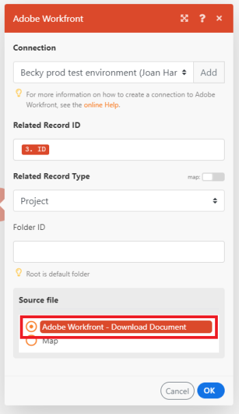
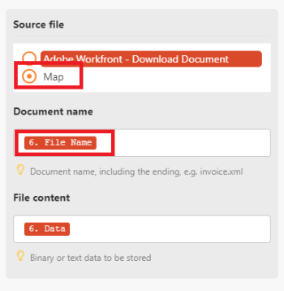

# About mapping files {#about-mapping-files}

Some modules have the capability to process files. These modules can either return an output file to be sent for further processing or require a file to be passed to them for processing. Before these modules can work together to process files, they have to be mapped to each other.

## Access requirements {#access-requirements}

You must have the following access to use the functionality in this article:

<table style="width: 100%;margin-left: 0;margin-right: auto;mc-table-style: url('../../Resources/TableStyles/TableStyle-List-options-in-steps.css');" class="TableStyle-TableStyle-List-options-in-steps" cellspacing="0"> 
 <col class="TableStyle-TableStyle-List-options-in-steps-Column-Column1"> 
 <col class="TableStyle-TableStyle-List-options-in-steps-Column-Column2"> 
 <tbody> 
  <tr class="TableStyle-TableStyle-List-options-in-steps-Body-LightGray"> 
   <td class="TableStyle-TableStyle-List-options-in-steps-BodyE-Column1-LightGray" role="rowheader">Adobe Workfront plan*</td> 
   <td class="TableStyle-TableStyle-List-options-in-steps-BodyD-Column2-LightGray"> 
Pro or higher
 </td> 
  </tr> 
  <tr class="TableStyle-TableStyle-List-options-in-steps-Body-MediumGray"> 
   <td class="TableStyle-TableStyle-List-options-in-steps-BodyE-Column1-MediumGray" role="rowheader">Adobe Workfront Fusion license**</td> 
   <td class="TableStyle-TableStyle-List-options-in-steps-BodyD-Column2-MediumGray"> 
Workfront Fusion for Work Automation and Integration 
 
Workfront Fusion for Work Automation 
 </td> 
  </tr> 
  <tr class="TableStyle-TableStyle-List-options-in-steps-Body-LightGray"> 
   <td class="TableStyle-TableStyle-List-options-in-steps-BodyB-Column1-LightGray" role="rowheader">Product</td> 
   <td class="TableStyle-TableStyle-List-options-in-steps-BodyA-Column2-LightGray">Your organization must purchase Adobe Workfront Fusion as well as Adobe Workfront to use functionality described in this article.</td> 
  </tr> 
 </tbody> 
</table>

&#42;To find out what plan, license type, or access you have, contact your *`Workfront administrator`*.

## Mapping Files {#mapping-files}

Modules that have the ability to work with files require two pieces of information:

* File name
* File content (data)

When you map a file, you choose the modules in your scenario from which you want to obtain the data. The file name and file content are then automatically mapped as they are.

` `**Example: **`` This example shows how to download documents from *`Adobe Workfront`* to Google Drive. The *`Workfront`* trigger Watch Record returns detailed information about each document, including its name and ID. 

The next module, Download Document, downloads the actual data so that it can be uploaded to Google Drive.

To map this information to Google Drive so that it can be uploaded, you need to specify the source file from which the information will be mapped. If you select the Workfront - Download Document option under the source file, Workfront Fusion maps the file name and file content so that the document from Workfront is uploaded to the specified Google folder.

However, if you wanted to rename the file, but keep the data as it is, you could use the Map option to map the file name and file content separately. You would enter the full file name, including the extension. Text formats and binary formats, such as photos, videos, and PDF, are supported.

