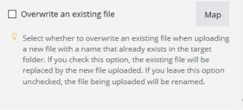
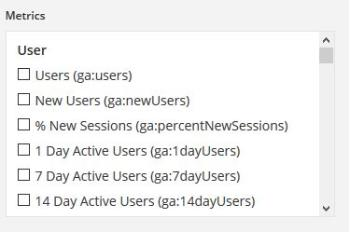

# Item data types {#item-data-types}

## Access requirements {#access-requirements}

You must have the following access to use the functionality in this article:

<table style="width: 100%;margin-left: 0;margin-right: auto;mc-table-style: url('../../Resources/TableStyles/TableStyle-List-options-in-steps.css');" class="TableStyle-TableStyle-List-options-in-steps" cellspacing="0"> 
 <col class="TableStyle-TableStyle-List-options-in-steps-Column-Column1"> 
 <col class="TableStyle-TableStyle-List-options-in-steps-Column-Column2"> 
 <tbody> 
  <tr class="TableStyle-TableStyle-List-options-in-steps-Body-LightGray"> 
   <td class="TableStyle-TableStyle-List-options-in-steps-BodyE-Column1-LightGray" role="rowheader">Adobe Workfront plan*</td> 
   <td class="TableStyle-TableStyle-List-options-in-steps-BodyD-Column2-LightGray"> 
Pro or higher
 </td> 
  </tr> 
  <tr class="TableStyle-TableStyle-List-options-in-steps-Body-MediumGray"> 
   <td class="TableStyle-TableStyle-List-options-in-steps-BodyE-Column1-MediumGray" role="rowheader">Adobe Workfront Fusion license**</td> 
   <td class="TableStyle-TableStyle-List-options-in-steps-BodyD-Column2-MediumGray"> 
Workfront Fusion for Work Automation and Integration 
 
Workfront Fusion for Work Automation 
 </td> 
  </tr> 
  <tr class="TableStyle-TableStyle-List-options-in-steps-Body-LightGray"> 
   <td class="TableStyle-TableStyle-List-options-in-steps-BodyB-Column1-LightGray" role="rowheader">Product</td> 
   <td class="TableStyle-TableStyle-List-options-in-steps-BodyA-Column2-LightGray">Your organization must purchase Adobe Workfront Fusion as well as Adobe Workfront to use functionality described in this article.</td> 
  </tr> 
 </tbody> 
</table>

&#42;To find out what plan, license type, or access you have, contact your *`Workfront administrator`*.

## Item data types {#item-data-types-1}

You can contain the types of items listed below in a bundle.

For information on which types of items *`Workfront Fusion`* allows for conversion between one other, see [Type coercion](type-coercion.md).

<table style="width: 100%;margin-left: 0;margin-right: auto;mc-table-style: url('../../Resources/TableStyles/TableStyle-List-options-in-steps.css');" class="TableStyle-TableStyle-List-options-in-steps" cellspacing="0"> 
 <col class="TableStyle-TableStyle-List-options-in-steps-Column-Column1"> 
 <col class="TableStyle-TableStyle-List-options-in-steps-Column-Column2"> 
 <tbody> 
  <tr class="TableStyle-TableStyle-List-options-in-steps-Body-LightGray"> 
   <td class="TableStyle-TableStyle-List-options-in-steps-BodyE-Column1-LightGray" role="rowheader"> 
Text
 </td> 
   <td class="TableStyle-TableStyle-List-options-in-steps-BodyD-Column2-LightGray"> 
The most common item type. For some text items, Adobe Workfront Fusion checks whether the maximum or minimum allowed length is met or whether the item performs format validation (email, URL or file name).
 </td> 
  </tr> 
  <tr class="TableStyle-TableStyle-List-options-in-steps-Body-MediumGray"> 
   <td class="TableStyle-TableStyle-List-options-in-steps-BodyE-Column1-MediumGray" role="rowheader"> 
Number
 </td> 
   <td class="TableStyle-TableStyle-List-options-in-steps-BodyD-Column2-MediumGray"> 
For some numerical items, Workfront Fusion may validate the input for a specified range (the minimum or maximum allowed value).
 </td> 
  </tr> 
  <tr class="TableStyle-TableStyle-List-options-in-steps-Body-LightGray"> 
   <td class="TableStyle-TableStyle-List-options-in-steps-BodyE-Column1-LightGray" role="rowheader"> 
Boolean (Yes/No)
 </td> 
   <td class="TableStyle-TableStyle-List-options-in-steps-BodyD-Column2-LightGray"> 
This type is used for items with only two possible values: true or false. 
 
When setting modules, the Boolean type can appear in two different forms:
 
    <ul> 
     <li> 
The compulsory check box is shown in case the field is mandatory and must be filled in.
 
  
 </li> 
     <li> 
Optional fields that can be left blank are displayed as a selection box, allowing selection among three values: <code>Yes</code>, <code>No</code>, and <code>Not defined</code> (default).
 
  
 </li> 
    </ul> 
You can click Map if you need to map the value to an item from another module.
 </td> 
  </tr> 
  <tr class="TableStyle-TableStyle-List-options-in-steps-Body-MediumGray"> 
   <td class="TableStyle-TableStyle-List-options-in-steps-BodyE-Column1-MediumGray" role="rowheader"> 
Date
 </td> 
   <td class="TableStyle-TableStyle-List-options-in-steps-BodyD-Column2-MediumGray"> 
Dates are entered in the ISO 8601 date format, for example, <code>2015-09-18T11:58Z</code>. You can change the time zone in your profile settings, as explained in <a href="change-profile-settings.md" class="MCXref xref">Change profile settings</a>. 
 
If you click a field that requires a date, a pop-up calendar displays in the module settings. The time is not required for some items.
 
Values of Date items are formatted using the local and Web timezone selected in your profile. You can display the ISO 8601 version of a date item's value by hovering over the item.
 
Note: If the ISO value does not display, the item is probably text, not a date.
 
The time is entered in the <code>hours:minutes:seconds</code> format, for example,<code>14:03:52</code>.
 </td> 
  </tr> 
  <tr class="TableStyle-TableStyle-List-options-in-steps-Body-LightGray"> 
   <td class="TableStyle-TableStyle-List-options-in-steps-BodyE-Column1-LightGray" role="rowheader"> 
Buffer (binary data)
 </td> 
   <td class="TableStyle-TableStyle-List-options-in-steps-BodyD-Column2-LightGray"> 
File content is usually sent as Buffer type content (image content, video file, and others). In some cases, text data is included in this type (for example, a text file). Workfront Fusion is able to automatically convert text data in binary code to text and text to text data in binary code. For more information, see <a href="about-mapping-files.md" class="MCXref xref">About mapping files</a>.
 </td> 
  </tr> 
  <tr class="TableStyle-TableStyle-List-options-in-steps-Body-MediumGray"> 
   <td class="TableStyle-TableStyle-List-options-in-steps-BodyE-Column1-MediumGray" role="rowheader"> 
Collection
 </td> 
   <td class="TableStyle-TableStyle-List-options-in-steps-BodyD-Column2-MediumGray"> 
A collection is an item consisting of multiple sub-items. The Sender item in an email message is an example of a collection: it contains the sender name (text type) and the sender email address (text type).
 </td> 
  </tr> 
  <tr class="TableStyle-TableStyle-List-options-in-steps-Body-LightGray"> 
   <td class="TableStyle-TableStyle-List-options-in-steps-BodyE-Column1-LightGray" role="rowheader"> 
Select (menu)
 </td> 
   <td class="TableStyle-TableStyle-List-options-in-steps-BodyD-Column2-LightGray"> 
When you configure the module settings as described in <a href="configure-a-modules-settings.md" class="MCXref xref">Configure a module's settings</a>, you can select from several items of the same type. An example is the folder select menu in the settings for the Dropbox modules. 
 
When setting modules, the select menu can appear in two forms:
 
 
If multiple selection is possible, several items with check boxes display.
 
  
 
 
If only one option is possible, a drop-down menu displays.
 
  
 
If you need to map an item from another module, use the Map button. This button opens a text field instead of the selection menu. For more information, see <a href="map-information-between-modules.md" class="MCXref xref">Map information from one module to another</a>.
 </td> 
  </tr> 
  <tr class="TableStyle-TableStyle-List-options-in-steps-Body-MediumGray"> 
   <td class="TableStyle-TableStyle-List-options-in-steps-BodyE-Column1-MediumGray" role="rowheader"> 
Array
 </td> 
   <td class="TableStyle-TableStyle-List-options-in-steps-BodyD-Column2-MediumGray"> 
You can use the array type to work with several values of the same type, including collections. An example is the Email modules:&nbsp;they return an array of attachments and each attachment contains name, content, size, and so on. For more information, see <a href="map-an-array.md" class="MCXref xref">Map an array</a>.
 </td> 
  </tr> 
  <tr class="TableStyle-TableStyle-List-options-in-steps-Body-LightGray"> 
   <td class="TableStyle-TableStyle-List-options-in-steps-BodyB-Column1-LightGray" role="rowheader"> 
Validation
 </td> 
   <td class="TableStyle-TableStyle-List-options-in-steps-BodyA-Column2-LightGray"> 
Workfront Fusion might perform validation on each type of item. If an item does not pass the validation, the module will stop processing because of a data error. For more information, see <a href="error-processing.md" class="MCXref xref">Error processing</a>. 
 </td> 
  </tr> 
 </tbody> 
</table>

