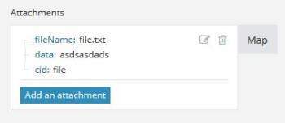

# Map an array {#map-an-array}

An array is a special type of item that can contain the following:

* One or more text values (simple array)
* One or more collections of the same type (complex array)

` `**Example: **``The Watch emails module returns an array of attachments for every email. Every attachment represents a collection that may contain a name, content, size, and so on.

For more information, see [Item data types](item-data-types.md).

## Access requirements {#access-requirements}

You must have the following access to use the functionality in this article:

<table style="width: 100%;margin-left: 0;margin-right: auto;mc-table-style: url('../../Resources/TableStyles/TableStyle-List-options-in-steps.css');" class="TableStyle-TableStyle-List-options-in-steps" cellspacing="0"> 
 <col class="TableStyle-TableStyle-List-options-in-steps-Column-Column1"> 
 <col class="TableStyle-TableStyle-List-options-in-steps-Column-Column2"> 
 <tbody> 
  <tr class="TableStyle-TableStyle-List-options-in-steps-Body-LightGray"> 
   <td class="TableStyle-TableStyle-List-options-in-steps-BodyE-Column1-LightGray" role="rowheader">Adobe Workfront plan*</td> 
   <td class="TableStyle-TableStyle-List-options-in-steps-BodyD-Column2-LightGray"> 
Pro or higher
 </td> 
  </tr> 
  <tr class="TableStyle-TableStyle-List-options-in-steps-Body-MediumGray"> 
   <td class="TableStyle-TableStyle-List-options-in-steps-BodyE-Column1-MediumGray" role="rowheader">Adobe Workfront Fusion license**</td> 
   <td class="TableStyle-TableStyle-List-options-in-steps-BodyD-Column2-MediumGray"> 
Workfront Fusion for Work Automation and Integration 
 
Workfront Fusion for Work Automation 
 </td> 
  </tr> 
  <tr class="TableStyle-TableStyle-List-options-in-steps-Body-LightGray"> 
   <td class="TableStyle-TableStyle-List-options-in-steps-BodyB-Column1-LightGray" role="rowheader">Product</td> 
   <td class="TableStyle-TableStyle-List-options-in-steps-BodyA-Column2-LightGray">Your organization must purchase Adobe Workfront Fusion as well as Adobe Workfront to use functionality described in this article.</td> 
  </tr> 
 </tbody> 
</table>

&#42;To find out what plan, license type, or access you have, contact your *`Workfront administrator`*.

## Map an array {#map-an-array-1}

1.  Click the button located in the target field. 

   ` `**Example: **`` For the example above, you would click the Add an attachment button for an email. 

   

1.  In the box that displays, enter the item. 

   The panel allows you to map fields in the same way as with any other type of item. If you do not want to fill in each item separately, but want to map another array into the target field, use the Map button. In this case, make sure that both arrays (the source array and the target array) have the same structure.

   You can add any number of items to an array.

You can divide an array into individual bundles using an iterator. Fore more information, see [Iterator module](iterator-module.md).
