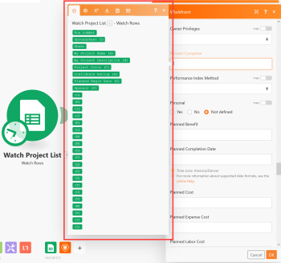
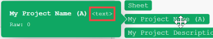

# The mapping panel

<!--
Finish this (original article)
-->

## Star tab

When the mapping panel displays, the star tab  is always open. This tab lists the items outputted from the preceding module or modules:

Note the following about this tab:

<ul> 
 <li>Each item's color is the same as the color of the module it came from.</li> 
 <li> 
 <!--
    You might see an example value displayed in grey next to an item.
   --> 
 </li> 
 <li>You can hover over an item to reveal additional information about it:
  <ul>
   <li>
A tooltip displays to tell you what type of information it represents: text, date, number, array, and so on.

</li>
   <li>The module that the item came from pulses at its edges in the scenario editor.</li>
  </ul></li> 
 <li> 
If the item happens to be the same color or type as another item in the list that is from a different app, you can tell what apps they are from by looking at the ID number diplayed in a grey box above the items.
 
For example, in the mapping panel shown above, the number 6 displays, indicating that the items below it came from the sixth module in the scenario.
 </li> 
</ul>

