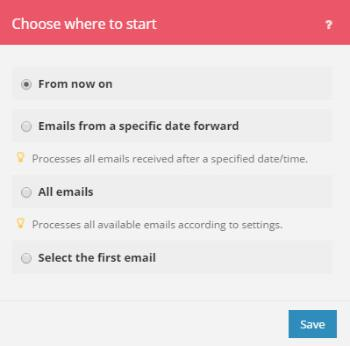

# Choose where a trigger module starts

Some trigger modules allow you to select the first bundle from which you want the retrieving of bundles to start.

You can also specify whether you want to retrieve all bundles or just the bundles from after a specific date.

For more information about trigger modules, see the section [Trigger modules](../../workfront-fusion/modules/module-types.md#triggers) in the article [Types of modules](../../workfront-fusion/modules/module-types.md).

## Access requirements

You must have the following access to use the functionality in this article:

<table cellspacing="0"> 
 <col> 
 <col> 
 <tbody> 
  <tr> 
   <td role="rowheader"><em>Adobe Workfront</em> plan*</td> 
   <td> 
<em>Pro</em> or higher
 </td> 
  </tr> <draft-comment>
   <tr data-mc-conditions=""> 
    <td role="rowheader"><em>Adobe Workfront</em> license*</td> 
    <td> 
Plan, Work
 </td> 
   </tr>
  </draft-comment>
  <tr data-mc-conditions=""> 
   <td role="rowheader"><em>Adobe Workfront</em> license*</td> 
   <td> 
Plan, Work
 </td> 
  </tr> 
  <tr> 
   <td role="rowheader"><em>Adobe Workfront Fusion</em> license**</td> 
   <td> 
<em>Workfront Fusion for Work Automation and Integration</em> 
 <draft-comment>
     
<em>Workfront Fusion for Work Automation</em> 

    </draft-comment>
<em>Workfront Fusion for Work Automation</em> 
 </td> 
  </tr> 
  <tr> 
   <td role="rowheader">Product</td> 
   <td>Your organization must purchase <em>Adobe Workfront Fusion</em> as well as <em>Adobe Workfront</em> to use functionality described in this article.</td> 
  </tr> <draft-comment>
   <tr data-mc-conditions="QuicksilverOrClassic.Draft mode"> 
    <td role="rowheader">Access level configurations*</td> 
    <td> <draft-comment>
      
You must be a <em>Workfront Fusion</em> administrator for your organization.

     </draft-comment>
You must be a <em>Workfront Fusion</em> administrator for your organization.
 <draft-comment>
      
You must be a <em>Workfront Fusion</em> administrator for your team.

     </draft-comment>
You must be a <em>Workfront Fusion</em> administrator for your team.
 </td> 
   </tr>
  </draft-comment>
  <tr data-mc-conditions="QuicksilverOrClassic.Draft mode"> 
   <td role="rowheader">Access level configurations*</td> 
   <td> 
You must be a <em>Workfront Fusion</em> administrator for your organization.
 
You must be a <em>Workfront Fusion</em> administrator for your team.
 </td> 
  </tr> 
 </tbody> 
</table>

&#42;To find out what plan, license type, or access you have, contact your *Workfront administrator*.

&#42;&#42;For information on *Adobe Workfront Fusion* licenses, see [Adobe Workfront Fusion licenses](../../workfront-fusion/get-started/license-automation-vs-integration.md)

## Choose where a trigger module starts

<ol> 
 <li value="1"> 
Save a trigger module.
 
Or
 
Change the trigger module's settings as described in <a href="../../workfront-fusion/modules/configure-a-modules-settings.md" class="MCXref xref">Configure a module's settings</a>.
 
Or
 
Right-click the icon for the trigger module in the Scenario editor, as described in <a href="../../workfront-fusion/scenarios/create-a-scenario.md" class="MCXref xref">Create a scenario</a>.
 </li> 
 <li value="2"> 
Select an option in the Choose where to start box that appears.
 
  
 
The options displayed depend on the possibilities of a given service. They may include the following:
 
  <table cellspacing="0"> 
   <col> 
   <col> 
   <tbody> 
    <tr> 
     <td role="rowheader">From now on (default)</td> 
     <td>Retrieves all bundles added or updated (depending on settings) from now on</td> 
    </tr> 
    <tr> 
     <td role="rowheader">From after a specific date</td> 
     <td>Retrieves all bundles added or updated (depending on settings) after a specified date/time</td> 
    </tr> 
    <tr> 
     <td role="rowheader">With ID greater than or equal to a specific value</td> 
     <td>Retrieves all bundles with an ID greater than or equal to a specified ID</td> 
    </tr> 
    <tr> 
     <td role="rowheader">All bundles</td> 
     <td>Retrieves all available bundles</td> 
    </tr> 
    <tr> 
     <td role="rowheader">Select the first bundle</td> 
     <td>Allows you to select the first bundle from which the retrieval of bundles is to start</td> 
    </tr> 
   </tbody> 
  </table> </li> 
</ol>

