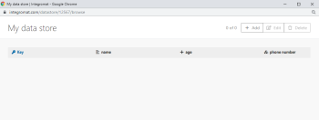

# Data Stores

A data store, similar to a database or a simple table, can store data from scenarios, making it possible to transfer data between individual scenarios or scenario runs. You can use a data store to store new data from various systems during synchronization.

<!--
For more information on scenarios, see Create a scenario
-->

The data store modules enable you to take the following actions on records in your `Adobe Workfront Fusion` data store:

* Add
* Replace
* Update
* Retrieve
* Delete
* Search
* Count

For information on using data store modules, see [Data store modules](../../workfront-fusion/apps-and-their-modules/data-store-modules.md).

## Access requirements

You must have the following access to use the functionality in this article:

<table cellspacing="0"> 
 <col> 
 <col> 
 <tbody> 
  <tr> 
   <td role="rowheader">Adobe Workfront plan*</td> 
   <td> 
Pro or higher
 </td> 
  </tr> Adobe Workfront license* Plan, Work 
  <tr> 
   <td role="rowheader">Adobe Workfront Fusion license**</td> 
   <td> 
Workfront Fusion for Work Automation and Integration 
  </td> 
  </tr> 
  <tr> 
   <td role="rowheader">Product</td> 
   <td>Your organization must purchase Adobe Workfront Fusion as well as Adobe Workfront to use functionality described in this article.</td> 
  </tr> <!--
   Access level configurations* You must be a Workfront Fusion administrator for your organization. You must be a Workfront Fusion administrator for your team.
  --> 
 </tbody> 
</table>

&#42;To find out what plan, license type, or access you have, contact your `Workfront administrator`.

&#42;&#42;For information on `Adobe Workfront Fusion` licenses, see [Adobe Workfront Fusion licenses](../../workfront-fusion/get-started/license-automation-vs-integration.md)

## Create a data store in `Workfront Fusion`

* [Set up the data store](#set) 
* [Set up the data structure](#setting)

### Set up the data store

Before you can use a data store in a module, you must create the data store in `Workfront Fusion`.

>[!NOTE]
>
>Your organization has a limited number of available data stores. If you attempt to create more data stores than you have available, Workfront returns a Maximum stores reached error.
>
>For more information, see [Maximum stores reached error](#maximum) in this article.

<ol> 
 <li value="1">Log in to your Workfront Fusion account.</li> 
 <li value="2">Click Data stores in the left navigation panel.</li> 
 <li value="3">Click Add data store in the upper-right corner of the screen.</li> 
 <li value="4"> 
Enter settings for the new data store.
 
A bolded title on a field in a Workfront Fusion module indicates a required setting.
 
  <table cellspacing="15"> 
   <col> 
   <col> 
   <tbody> 
    <tr> 
     <td>Data store name </td> 
     <td> 
Enter a name for the data store. 
 </td> 
    </tr> 
    <tr> 
     <td> 
Data Structure
 </td> 
     <td> 
A data structure is a list of the columns for a table. This list indicates the column name and data type.
 
Do one of the following:
 
      <ul> 
       <li style="font-weight: bold;">Select a data structure that has been already created</li> 
       <li> 
Add a new data structure
 
Click the Add button to create a new data structure.
 
For more information, see the <a href="#setting" class="MCXref xref">Set up the data structure</a> section in this article.
 </li> 
       <li style="font-weight: bold;"> 
Leave the field empty
 
If you don't select or add a data structure, the database will only contain the primary key. Such a database type is useful if you want to save keys only and are interested in knowing only whether or not a specific key exists in the database.
 </li> 
      </ul> </td> 
    </tr> 
    <tr> 
     <td> 
Data storage size in MB
 </td> 
     <td> 
Allocate the size for the data store from your total internal data storage.
 <note type="note">
       The reserved amount can be changed at any time later on.
      </note> <!--
       The total internal data storage capacity depends on the plan you have purchased.
      --> </td> 
    </tr> 
   </tbody> 
  </table> </li> 
</ol>

### Set up the data structure

<ol> 
 <li value="1">When creating or editing a data store, click Add.</li> 
 <li value="2"> 
In the Add data structure box that displays, configure the following fields:
 
  <table cellspacing="15"> 
   <col> 
   <col> 
   <tbody> 
    <tr> 
     <td>Data structure name</td> 
     <td> 
 Enter a name for the new data structure.
 </td> 
    </tr> 
    <tr> 
     <td> 
Specification
 </td> 
     <td> 
Do one of the following to set up your data store's columns.
 
      <ul> 
       <li> 
Click Add item to specify the properties of one column manually.
 
Enter the Name and Type for the data store column and define corresponding properties.
 </li> 
       <li> 
Click Generator to determine the columns from the sample data you provide.
 
        
Example: </b>">
         <b>Example: </b> 
         
For example, the following JSON sample data creates three columns: name, age, and phone number. Phone number is a collection of mobile and landline phone numbers.
 
         
<code>{</code> 
 
         
<code>"name":"John",</code> 
 
         
<code>"age":30,</code> 
 
         
<code>"phone number": {</code> 
 
         
<code>"mobile":"987654321",</code> 
 
         
<code>"landline":"123456789"</code> 
 
         
<code>}</code> 
 
         
<code>}</code> 
 
         
The empty columns in the data store view:
 
         
  
 
         
You can then add values to the data store manually or by using the Workfront Fusion data store modules.
 
        
 </li> 
      </ul> </td> 
    </tr> 
    <tr> 
     <td>Strict </td> 
     <td> 
Enable this option to ensure that the payload matches the data structures. Payloads that contain extra items not specified in the data structure are rejected.
 </td> 
    </tr> 
   </tbody> 
  </table> </li> 
</ol>

## Edit an existing data store

You can edit the properties and contents of an existing Data Store in the Data Store area of `Workfront Fusion`.

* [Edit the properties of a data store](#edit) 
* [Edit the contents of a data store](#edit2)

### Edit the properties of a data store

The properties of a data store include the data structure that the data store uses, as well as the data store's size.

<ol> 
 <li value="1"> 
Click Data Store  in the left navigation panel to open the Data Store area.
 </li> 
 <li value="2"> 
Click Edit next to the data store that you want to edit.
 </li> 
 <li value="3"> 
(Optional) If you want to change the data structure used by this data store to another existing data structure, select it from the Data structure drop-down.
 
Or
 
(Optional) If you want to change the data structure used by this data store to an entirely new data structure, see <a href="#setting" class="MCXref xref">Set up the data structure</a> in this article.
 </li> 
 <li value="4"> 
(Optional) Change the size of the data store by entering the new size into the Data storage size in MB field.
 </li> 
 <li value="5"> 
Click Save.
 </li> 
</ol>

### Edit the contents of a data store

<ol> 
 <li value="1"> 
Click the Data Store icon  in the left navigation panel to open the Data Store area.
 </li> 
 <li value="2"> 
Click Browse  next to the data store that you want to edit.
 </li> 
 <li value="3"> 
(Optional) Reorder columns by dragging them to the desired location.
 </li> 
 <li value="4"> 
(Optional) Edit a single cell by clicking the Edit icon in that cell, then entering the desired value.
 </li> 
 <li value="5"> 
(Optional) Add a new item to the data store by clicking Add, then entering the information for the new item.
 </li> 
 <li value="6"> 
Click Save.
 </li> 
</ol>

## Troubleshooting

* [Restoring lost data from a data store](#about) 
* [Out of space error](#out) 
* [Maximum stores reached error](#maximum)

### Restoring lost data from a data store

There is currently no tool which can automate restoring lost data.

#### Workaround

1. Examine all execution logs of scenarios where items were inserted to the data store.

   For more information on examining execution logs, see [View a scenario's execution history](../../workfront-fusion/scenarios/view-scenario-execution-history.md).

1. Copy the data.
1. Insert the data into your data store again.

   For information on inserting data into a data store, see [Edit the contents of a data store](#edit2) in this article.

### Out of space error

An Out of Space error occurs because your previously created data stores have already been assigned your allocated data store storage.

#### Workaround

1. Edit any of your existing data stores to use less space. This frees up space for your new data store.

   For more information, see [Edit the properties of a data store](#edit) in this article.

>[!NOTE]
>
>We recommend that you do not assign all of your space to a single data store unless you are certain you will not require more data stores.

### Maximum stores reached error

A Maximum stored reached error occurs because your organization has used all of its available data stores. An organization has a number of available data stores equal to twice the number of available scenarios. Therefore, the total number of available data stores depends on the plan you have purchased.

For example, if your organization has purchased a plan with 15 scenarios, the organization can have up to 30 data stores.

#### Workaround

To reduce the number of existing data stores, consider doing one of the following:

* Combine existing data stores
* Delete unused data stores

