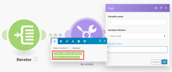

# Iterator module

An iterator module is a special type of module that converts an array into a series of bundles. Each array item is outputted as a separate bundle.

For more information, see [Types of modules](../../workfront-fusion/modules/module-types.md) and [Map an array](../../workfront-fusion/mapping/map-an-array.md).

## Access requirements

You must have the following access to use the functionality in this article:

<table cellspacing="0"> 
 <col> 
 <col> 
 <tbody> 
  <tr> 
   <td role="rowheader"><em>Adobe Workfront</em> plan*</td> 
   <td> <p><em>Pro</em> or higher</p> </td> 
  </tr> <draft-comment>
   <tr data-mc-conditions=""> 
    <td role="rowheader"><em>Adobe Workfront</em> license*</td> 
    <td> <p>Plan, Work</p> </td> 
   </tr>
  </draft-comment>
  <tr data-mc-conditions=""> 
   <td role="rowheader"><em>Adobe Workfront</em> license*</td> 
   <td> <p>Plan, Work</p> </td> 
  </tr> 
  <tr> 
   <td role="rowheader"><em>Adobe Workfront Fusion</em> license**</td> 
   <td> <p><em>Workfront Fusion for Work Automation and Integration</em> </p> <draft-comment>
     <p data-mc-conditions="SnippetConditions.HIDE"><em>Workfront Fusion for Work Automation</em> </p>
    </draft-comment><p data-mc-conditions="SnippetConditions.HIDE"><em>Workfront Fusion for Work Automation</em> </p> </td> 
  </tr> 
  <tr> 
   <td role="rowheader">Product</td> 
   <td>Your organization must purchase <em>Adobe Workfront Fusion</em> as well as <em>Adobe Workfront</em> to use functionality described in this article.</td> 
  </tr> <draft-comment>
   <tr data-mc-conditions="QuicksilverOrClassic.Draft mode"> 
    <td role="rowheader">Access level configurations*</td> 
    <td> <draft-comment>
      <p data-mc-conditions="QuicksilverOrClassic.Draft mode">You must be a <em>Workfront Fusion</em> administrator for your organization.</p>
     </draft-comment><p data-mc-conditions="QuicksilverOrClassic.Draft mode">You must be a <em>Workfront Fusion</em> administrator for your organization.</p> <draft-comment>
      <p data-mc-conditions="QuicksilverOrClassic.Draft mode">You must be a <em>Workfront Fusion</em> administrator for your team.</p>
     </draft-comment><p data-mc-conditions="QuicksilverOrClassic.Draft mode">You must be a <em>Workfront Fusion</em> administrator for your team.</p> </td> 
   </tr>
  </draft-comment>
  <tr data-mc-conditions="QuicksilverOrClassic.Draft mode"> 
   <td role="rowheader">Access level configurations*</td> 
   <td> <p data-mc-conditions="QuicksilverOrClassic.Draft mode">You must be a <em>Workfront Fusion</em> administrator for your organization.</p> <p data-mc-conditions="QuicksilverOrClassic.Draft mode">You must be a <em>Workfront Fusion</em> administrator for your team.</p> </td> 
  </tr> 
 </tbody> 
</table>

&#42;To find out what plan, license type, or access you have, contact your *Workfront administrator*.

&#42;&#42;For information on *Adobe Workfront Fusion* licenses, see [Adobe Workfront Fusion licenses](../../workfront-fusion/get-started/license-automation-vs-integration.md)

## Iterator module configuration

You set up an iterator module the same you set up any other module. The Array field contains the array to be convertedor split into separate bundles.


For more information, see [Configure a module's settings](../../workfront-fusion/modules/configure-a-modules-settings.md).

` `**Examples: **`` 

<ul> 
 <li> <p>The below scenario shows how to retrieve emails with attachments and save the attachments as single files in a selected Dropbox folder.</p> <p>Emails can contain an array of attachments. The iterator module inserted after the first module will enable you to handle each attachment separately. The iterator module splits the array of attachments into single bundles. Each bundle, with one attachment, is then saved one at a time in a selected Dropbox folder. The iterator module set-up is shown above: the Array field should contain the <code>Attachments[]</code> array.</p> <p>  </p> </li> 
</ul>

<ul> 
 <li> <p>For your convenience, many <em>Workfront Fusion</em> apps offer specialized iterator modules with a simplified setup. For example, the Email app contains the special iterator module Email > Iterate attachments that will produce the same results as the general It</p> <p>  </p> </li> 
</ul>

<!--
<h2 data-mc-conditions="QuicksilverOrClassic.Draft mode">Learn when to use an Iterator in your scenarios</h2>
-->

## Learn when to use an Iterator in your scenarios

<!--
<p data-mc-conditions="QuicksilverOrClassic.Draft mode">The video below is module 1 of the 3 part lesson titled Iterator and Array Aggregator. It explains the purpose of the Iterator and the Array Aggregator and with the help of a sample scenario, explains when to use an Iterator and what to do with the output.</p>
-->

The video below is module 1 of the 3 part lesson titled Iterator and Array Aggregator. It explains the purpose of the Iterator and the Array Aggregator and with the help of a sample scenario, explains when to use an Iterator and what to do with the output.

<!--
<p style="color: #ff1493;" data-mc-conditions="QuicksilverOrClassic.Draft mode">video</p>
-->

video

## Troubleshooting: Mapping panel does not display mappable items under iterator module

When an iterator module does not have an information about the structure of the array's items, the mapping panel in the modules following the iterator module display only 2 items under the iterator module :

```
Total number of bundles
```

and 

```
Bundle order position
```

:



This because each module is responsible for providing information about items it outputs so that these items can be properly displayed in the mapping panel in the subsequent modules. However, several modules might be unable to provide this information in some cases; for example, JSON > Parse JSON or Webhooks > Custom Webhook modules with missing Data structure.

The solution is to manually execute the scenario to make the module learn about the items it outputs so it can provide the information to the following modules.

For example, if you have a JSON > Parse JSON module without a Data structure as below:


And then if you connect an iterator module to it, you will not be able to map the output of the module to the Array field in the setup panel of the iterator module :


To resolve this, manually start the scenario in the scenario editor. You can un-link the modules after the JSON > Parse JSON module to prevent the flow from proceeding further. Or you can right-click the JSON > Parse JSON module and choose `Run this module only` from the context menu to execute only the JSON > Parse JSON module.

When the JSON > Parse JSON executes, it learns about the items that it outputs and provides this information to all the subsequent modules, including the iterator module. The mapping panel in the Iterator's setup then displays the items:


Moreover, the mapping panel in the modules that are connected after the iterator module display the items contained in the array's items:


If you cannot see some items in a module's mapping panel, run the scenario once so all the modules can learn about the items they output and provide this information to the following modules.
