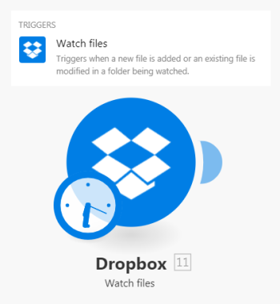

# Types of modules {#types-of-modules}

*`Adobe Workfront Fusion`* distinguishes five types of modules: action modules, search modules, trigger modules, aggregators, and iterators. Aggregators and Iterators are for advanced scenarios.


## Access requirements {#access-requirements}

You must have the following access to use the functionality in this article:

<table style="width: 100%;margin-left: 0;margin-right: auto;mc-table-style: url('../../Resources/TableStyles/TableStyle-List-options-in-steps.css');" class="TableStyle-TableStyle-List-options-in-steps" cellspacing="0"> 
 <col class="TableStyle-TableStyle-List-options-in-steps-Column-Column1"> 
 <col class="TableStyle-TableStyle-List-options-in-steps-Column-Column2"> 
 <tbody> 
  <tr class="TableStyle-TableStyle-List-options-in-steps-Body-LightGray"> 
   <td class="TableStyle-TableStyle-List-options-in-steps-BodyE-Column1-LightGray" role="rowheader"><span class="mc-variable WFVariables.FullProdNameWF variable varname">Adobe Workfront</span> plan*</td> 
   <td class="TableStyle-TableStyle-List-options-in-steps-BodyD-Column2-LightGray"> <p><span class="mc-variable WFVariables.WFPlan-Pro variable varname">Pro</span> or higher</p> </td> 
  </tr> 
  <tr class="TableStyle-TableStyle-List-options-in-steps-Body-MediumGray"> 
   <td class="TableStyle-TableStyle-List-options-in-steps-BodyE-Column1-MediumGray" role="rowheader"><span class="mc-variable WFVariables.FullProdNameWFF variable varname">Adobe Workfront Fusion</span> license**</td> 
   <td class="TableStyle-TableStyle-List-options-in-steps-BodyD-Column2-MediumGray"> <p><span class="mc-variable WFVariables.WFFusionIntegration variable varname">Workfront Fusion for Work Automation and Integration</span> </p> <p data-mc-conditions="SnippetConditions.HIDE"><span class="mc-variable WFVariables.WFFusionAutomation variable varname">Workfront Fusion for Work Automation</span> </p> </td> 
  </tr> 
  <tr class="TableStyle-TableStyle-List-options-in-steps-Body-LightGray"> 
   <td class="TableStyle-TableStyle-List-options-in-steps-BodyB-Column1-LightGray" role="rowheader">Product</td> 
   <td class="TableStyle-TableStyle-List-options-in-steps-BodyA-Column2-LightGray">Your organization must purchase <span class="mc-variable WFVariables.FullProdNameWFF variable varname">Adobe Workfront Fusion</span> as well as <span class="mc-variable WFVariables.FullProdNameWF variable varname">Adobe Workfront</span> to use functionality described in this article.</td> 
  </tr> 
 </tbody> 
</table>

&#42;To find out what plan, license type, or access you have, contact your *`Workfront administrator`*.


## Action modules {#action-modules}

Action modules are the most common type of module. A typical action module returns a single bundle, which then passes on to the next module for processing.


Unlike trigger modules, action modules can be placed at the beginning, middle or end of a scenario. Scenarios can contain an unlimited number of action modules.

` `**Examples: **`` 


* `Dropbox > Upload a file` sends a file to a selected Dropbox folder and returns its identifier.
* `Image > Resize` receives an image, resizes it to specified dimensions, and passes the resized image on to the next action.
* `Google Analytics > Create a report` gets information about web traffic and passes it on for further processing.


The Action type has four subtypes: Create, Read, Update, and Delete. The Update subtype enables the following three operations:


*  `Erase the content of a field`. This operation takes place when the content of the field is evaluated to erase keyword (not to be confused with *empty*).


  


*  `Leave the content of a field unchanged`. This operation takes place when the field is left empty or the content of the field is evaluated to empty (represented via null in JSON).


  


* `Replace the content of a field`. This operation takes place in all other cases than those two described above.


>[!NOTE]
>
>
>
>
>* If you do not see the >
>
>  ```>
>  erase
>  ```>
>
>  keyword in the mapping panel, the module is not an update module or it has not been updated to the latest specifications for the app.
>*  "Empty" doesn't change the field content. If it is necessary to erase the field, you can use the following formula:
>
>
>  >
>

>
>
>  Leaving a field unchanged when its content is evaluated as empty is currently not possible.
>
>
>


## Search modules {#search-modules}

A typical Search returns zero, one, or more bundles, which then pass on to the next module for processing.


You can place Searches at the beginning, middle, or end of a scenario.


Scenarios can contain an unlimited number of Searches.


` `**Example: **`` `Monday > List pulses in all boards` returns all of an account's pulses


## Trigger modules {#trigger-modules}

Triggers generate bundles when there has been a change in a given service. The change can be a creation of new records, deletion of a records, update of a records, and so on. 


Every Trigger can return zero, one, or more bundles which then pass on to the next module for processing.


Triggers can be placed only at the beginning of a scenario.


Each scenario can contain only one Trigger.


*`Workfront Fusion`* distinguishes between two types of triggers: Polling triggers and Instant triggers.


### Polling triggers {#polling-triggers}

Polling triggers regularly poll a given service even if there has been no change since their previous run. We recommend that you schedule a scenario containing a polling trigger to run at regular intervals. If there is a *change*, the trigger returns bundles containing information about the change. If there is no *change*, the trigger does not output any bundles. For instructions on scheduling a scenario, see [Schedule a scenario](schedule-a-scenario.md).


Polling triggers allow you to select the first bundle that they should output via the epoch panel. The panel displays automatically after you save a trigger or change the trigger settings. For more information, see [Choose where a trigger module starts](choose-where-trigger-module-starts.md).


>[!NOTE]
>
>Settings made in the epoch panel affect only the first execution of the module. Once the module is executed, it remembers the last outputted bundle and voids the settings made via the epoch panel.


` `**Examples: **`` 


*  `Dropbox > Watch files` returns files that were newly added since the last time the scenario was run


  


* `Google Sheets > Watch Rows` returns new rows added by the user since the last time the scenario was run


### Instant triggers {#instant-triggers}

Instant triggers enable the service to notify *`Workfront Fusion`* about a *change* immediately. We recommend that you schedule a scenario containing an instant trigger to run immediately. For instructions, see [Schedule a scenario](schedule-a-scenario.md). See also [Instant triggers (webhooks)](instant-triggers-webhooks.md) for details on how the incoming data is handled.

` `**Examples: **`` 


* `Workfront>Watch Events` returns information when a certain type of event occurs in *`Workfront`*, such as the creation of a task.

* `Google Sheets>Watch Changes` returns information whenever a cell is updated.


## Aggregators {#aggregators}

An Aggregator is a type of module that accumulates multiple bundles into one single bundle.


Every Aggregator returns only one bundle, which then passes on to the next module for further processing.


You can place Aggregators only in the middle of a scenario.


Scenarios can contain an unlimited number of aggregators.

` `**Examples: **`` 


* `Archive > Create an archive` compresses received files into a zip archive
* `CSV > Aggregate to CSV` merges multiple strings from a CSV file into a single row
* `Tools > Text aggregator` combines several strings together into one single string


For more information, see [Aggregator module](aggregator-module.md).


## Iterators {#iterators}

An Iterator is a type of module that splits arrays into multiple separate bundles.


Every iterator returns one or more bundles, which then pass on to the next module for processing.


You can place Iterators only in the middle of a scenario.


Scenarios can contain an unlimited number of iterators.


` `**Example: **`` `Email > Retrieve attachments` breaks an array of attachments into separate bundles


For more information, see [Iterator module](iterator-module.md) and [Map an array](map-an-array.md).
