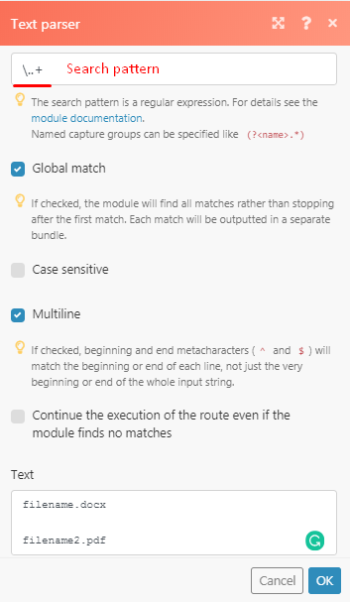
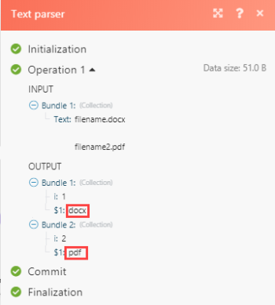

# Text parser troubleshooting {#text-parser-troubleshooting}

Use this information if you can not get text parser to produce any output.

## Access requirements {#access-requirements}

You must have the following access to use the functionality in this article:

<table style="width: 100%;margin-left: 0;margin-right: auto;mc-table-style: url('../../Resources/TableStyles/TableStyle-List-options-in-steps.css');" class="TableStyle-TableStyle-List-options-in-steps" cellspacing="0"> 
 <col class="TableStyle-TableStyle-List-options-in-steps-Column-Column1"> 
 <col class="TableStyle-TableStyle-List-options-in-steps-Column-Column2"> 
 <tbody> 
  <tr class="TableStyle-TableStyle-List-options-in-steps-Body-LightGray"> 
   <td class="TableStyle-TableStyle-List-options-in-steps-BodyE-Column1-LightGray" role="rowheader">Adobe Workfront plan*</td> 
   <td class="TableStyle-TableStyle-List-options-in-steps-BodyD-Column2-LightGray"> 
Pro or higher
 </td> 
  </tr> 
  <tr class="TableStyle-TableStyle-List-options-in-steps-Body-MediumGray"> 
   <td class="TableStyle-TableStyle-List-options-in-steps-BodyE-Column1-MediumGray" role="rowheader">Adobe Workfront Fusion license**</td> 
   <td class="TableStyle-TableStyle-List-options-in-steps-BodyD-Column2-MediumGray"> 
Workfront Fusion for Work Automation and Integration 
 
Workfront Fusion for Work Automation 
 </td> 
  </tr> 
  <tr class="TableStyle-TableStyle-List-options-in-steps-Body-LightGray"> 
   <td class="TableStyle-TableStyle-List-options-in-steps-BodyB-Column1-LightGray" role="rowheader">Product</td> 
   <td class="TableStyle-TableStyle-List-options-in-steps-BodyA-Column2-LightGray">Your organization must purchase Adobe Workfront Fusion as well as Adobe Workfront to use functionality described in this article.</td> 
  </tr> 
 </tbody> 
</table>

&#42;To find out what plan, license type, or access you have, contact your *`Workfront administrator`*.

## Troubleshooting {#troubleshooting}

Case scenario example, you would like to parse the filetype of a file document "filename.docx" and the extension of the filename always varies from DOCX to PDF to CSV.

The expression that you may choose to use in this case is \..+

If you were to use this on regex expression on regex101.com you will rightly find that you will get a full match.

As you will notice on the image above, the file extension was correctly matched. If you take this and try to implement it in your text parser:

you will not get a match:

The reason for this is that the "i" shows only the number of matches per match so in this case, we have 2 matches henceforth after the "i" there is a numerical value 1 and 2. The use case for this is that should you ever need to match or pass data through a filter only the second matched value you can specify which value that is represented by the numerical value.

To be able to get the match values that you require to add brackets to the part that you want to parse (for example, to extract from "filename.docx" - "docx" only), then, according to the regex expression we are using for this case scenario, the brackets should be applied on \.(.+) 

This captures the DOCX, places it in a group, and leave the "." out of it.

The output shown in the picture below, you will notice that the capturing group will match any character (except for line terminators)

Another workaround that also incorporates regex is using the replace function

{{replace("abcdefghijklmno pqr stuvw xyz.docx"; "/.&#42;\./"; ".")}}

Then replace abcdefghijklmno pqr stuvw xyz.docx with your actual filename variable.
