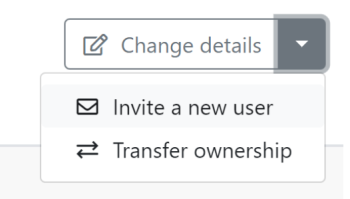

# `Adobe Workfront Fusion` organizations and teams

`Adobe Workfront Fusion`’s Organization and Teams features make it possible for enterprises to control access to scenarios and other features within Fusion.

## Access requirements

You must have the following access to use the functionality in this article:

<table cellspacing="0"> 
 <col> 
 <col> 
 <tbody> 
  <tr> 
   <td role="rowheader">Adobe Workfront plan*</td> 
   <td> 
Pro or higher
 </td> 
  </tr> <!--
   Adobe Workfront license* Plan, Work
  --> 
  <tr> 
   <td role="rowheader">Adobe Workfront Fusion license**</td> 
   <td> 
Workfront Fusion for Work Automation and Integration,
  </td> 
  </tr> 
  <tr> 
   <td role="rowheader">Product</td> 
   <td>Your organization must purchase Adobe Workfront Fusion as well as Adobe Workfront to use functionality described in this article.</td> 
  </tr> Access level configurations* You must be a Workfront Fusion administrator for your organization. You must be a Workfront Fusion administrator for your team. 
 </tbody> 
</table>

&#42;To find out what plan, license type, or access you have, contact your `Workfront administrator`.

<!--
**For information on Adobe Workfront Fusion licenses, see Adobe Workfront Fusion licenses
-->

## Organizations

Workfront Fusion users belong to an organization. Your Fusion license determines how many active scenarios and connectors are available in your organization.

Fusion licensing determines the number of active scenarios and active apps that are available to an organization. Fusion displays the current “Active scenarios” and “Active apps” count on the organization dashboard.

<!--

-->

* [Organization roles](#organiza) 
* [Inviting users to an organization](#inviting)

### Organization roles

A user has one of the following roles in an organization:

* **Owner**: The owner has all permissions available in the organization.
* `Admin`: The admin role enables a user to create and manage teams and users for the organization.
* `Member`: Members are able to use Workfront Fusion but unable to make organizational changes.
* `Accountant`: An accountant role only allows users to see license information on the organization dashboard.
* **App Developer**: Functionality for this role is currently unavailable, and will be made available in the near future. We do not recommend assigning users to this role at this time.

### Inviting users to an organization

By default, an organization owner (or authorized user) can invite another person to join their organization.

To invite a user to join an organization:

<ol> 
 <li value="1">Click Change details in the upper-right corner of the screen.</li> 
 <li value="2"> 
Select Invite a new user.
 
  
 </li> 
 <li value="3">Fill in the user's email address and name. </li> 
 <li value="4">Select a role for the user. For more information on roles, see <a href="#organiza" class="MCXref xref">Organization roles</a> in this document.</li> 
 <li value="5">(Optional) Add a note. This note appears in the invitation email that the user receives.</li> 
 <li value="6">Click Save.</li> 
</ol>

Fusion sends an email with an invitation to the specific organization and an Accept The Role button.

When the recipient clicks the button, they are redirected to the invitation page, where they can accept the invitation.

The invitation will expire in a day.

>[!NOTE]
>
>If the user is new to Fusion, Fusion automatically creates an account for them and sends an email with a temporary password, directing the new user to log in and change their password.

## Teams

Teams are groups of users that share access to specific resources. These resources may include:

* Scenarios
* Connections
* Webhooks
* Keys
* Data stores
* Data structures
* Email Notification Settings

>[!NOTE]
>
>Since teams control access to resources, it is sometimes useful for a team to have only one member. For example, users in training may create connections to their individual Google accounts. Any team members would also be able to connect to the individual Google account, so in this case it's best that the user be the only member of a training team.

Organizations may have as many teams as they need, and users may belong to one or more teams.

Users can select their team from the dropdown list in the left navigation panel. Users only see teams that they are members of. Selecting a team will allow a user to access that team's resources.

* [Team roles](#team2) 
* [Team Management](#team)

### Team roles

A user has one of the following roles in each of their teams:

* `Team Admin`: In addition to the capabilities of the other team roles, the Admin role allows the user to add, remove, or change the role of a team member.
* `Team Member`: The team member role allows users to create and execute scenarios.
* `Team Monitoring`: The monitoring role allows users to access execution information for scenarios, but they are unable to design scenarios or change their “Active” status.
* `Team Operator`: The operator role allows users to see execution data and change the “Active” status of scenarios.
* **Team Restricted Member**: Functionality for this role is currently unavailable, and will be made available in the near future. We do not recommend assigning users to this role at this time.

### Team Management

* [Create a team](#create) 
* [Set Team Notification Options](#set)

#### Create a team

Organization owners and administrators are able to create teams.

To create a team:

1. In the left navigation panel, click `Organization`
1. Select the `Team` tab.
1. Click `Add a new team` under the list of teams.
1. Enter a name for the new team, and click `Add`.

#### Set Team Notification Options

Email notification options are set on the team level.

<ol> 
 <li value="1"> 
In the left navigation panel, click Team 
 </li> 
 <li value="2"> 
Select the Notification Options tab.
 </li> 
 <li value="3"> 
Enable the notifications that you want the team to receive.
 
  <table cellspacing="0"> 
   <col> 
   <col> 
   <tbody> 
    <tr> 
     <td role="rowheader">Warning in scenario run</td> 
     <td> 
Receive an email when there is a warning in a scenario run
 </td> 
    </tr> 
    <tr> 
     <td role="rowheader">Errors in scenario run</td> 
     <td>Receive an email when there is an error in a scenario run.</td> 
    </tr> 
    <tr> 
     <td role="rowheader"> 
Scenario deactivation
 </td> 
     <td>Receive an email when a scenario deactivates.</td> 
    </tr> 
   </tbody> 
  </table> 
Changes to notification options save automatically
 </li> 
</ol>

<!--

-->

Team administrators are able to change team membership. Team management is accessible from the “Teams” option from left navigation. 
