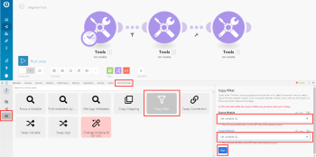

# Add a filter to a scenario {#add-a-filter-to-a-scenario}

In some scenarios, you need to work only with bundles that meet specific criteria. Filters can help you select those bundles easily.

For example, you could create a scenario with the Watch records trigger for Salesforce to capture only records containing a specific word written by a specific author.

You can add a filter between two modules and check whether bundles received from the preceding modules fulfill specific filter conditions:

*  If they do, the bundles pass on to the next module in the scenario. 
* If they don't, processing for the bundles terminates.

## Access requirements {#access-requirements}

You must have the following access to use the functionality in this article:

<table style="width: 100%;margin-left: 0;margin-right: auto;mc-table-style: url('../../Resources/TableStyles/TableStyle-List-options-in-steps.css');" class="TableStyle-TableStyle-List-options-in-steps" cellspacing="0"> 
 <col class="TableStyle-TableStyle-List-options-in-steps-Column-Column1"> 
 <col class="TableStyle-TableStyle-List-options-in-steps-Column-Column2"> 
 <tbody> 
  <tr class="TableStyle-TableStyle-List-options-in-steps-Body-LightGray"> 
   <td class="TableStyle-TableStyle-List-options-in-steps-BodyE-Column1-LightGray" role="rowheader">Adobe Workfront plan*</td> 
   <td class="TableStyle-TableStyle-List-options-in-steps-BodyD-Column2-LightGray"> 
Pro or higher
 </td> 
  </tr> 
  <tr class="TableStyle-TableStyle-List-options-in-steps-Body-MediumGray"> 
   <td class="TableStyle-TableStyle-List-options-in-steps-BodyE-Column1-MediumGray" role="rowheader">Adobe Workfront Fusion license**</td> 
   <td class="TableStyle-TableStyle-List-options-in-steps-BodyD-Column2-MediumGray"> 
Workfront Fusion for Work Automation and Integration 
 
Workfront Fusion for Work Automation 
 </td> 
  </tr> 
  <tr class="TableStyle-TableStyle-List-options-in-steps-Body-LightGray"> 
   <td class="TableStyle-TableStyle-List-options-in-steps-BodyB-Column1-LightGray" role="rowheader">Product</td> 
   <td class="TableStyle-TableStyle-List-options-in-steps-BodyA-Column2-LightGray">Your organization must purchase Adobe Workfront Fusion as well as Adobe Workfront to use functionality described in this article.</td> 
  </tr> 
 </tbody> 
</table>

&#42;To find out what plan, license type, or access you have, contact your *`Workfront administrator`*.

## Prerequisites {#prerequisites}

You must add both modules to a scenario before you can add a filter between them.

## Add a filter between two modules: {#add-a-filter-between-two-modules}

1.  Click Scenarios  in the left panel, then click the scenario to open it.
1. In the upper-right corner of the window, click `Edit`.
1. Click the connecting line between the modules. 
1. In the box that displays, type a `Label` for the filter.
1.  Define a filter `Condition`. 

   You can enter one or two operands in the two boxes. If you enter operands in both boxes, you can select an operator in the drop-down menu between them to specify the relation between them. 

   >[!TIP] {type="tip"}
   >
   >In the operand fields, you can enter values in the same way as you would map them, as described in [Map information from one module to another](map-information-between-modules.md).

   For example, if you wanted the filter to find files in *`Adobe Workfront`*ending with XML and pass them on to Dropbox, you would type `File name` in the first box and . `xml` in the second box. In the drop-down menu between them, you would select `Ends with (case insensitive)`. This filter would apply to incoming bundles from the first module (Workfront). Only bundles containing XML files would pass on to the next module (Dropbox).

   

1. Click `OK`.

## Copy a filter {#copy-a-filter}

Currently, the scenario editor doesn't include a feature for copying a filter.

>[!NOTE]
>
>If you copy the modules on either side of the filter, the filter is also copied. 
>
>
>For more information on copying modules, see [Copy modules or scenarios](copy-modules-or-scenarios.md)

To copy a filter without copying modules, you can use Google Chrome for the following workaround:

1. Install the *`Adobe Workfront Fusion`* DevTool Chrome extension.
1. In *`Workfront Fusion`*, open the scenario.
1. Click the Chrome three-dot menu, then click `More tools` > `Developer tools`. 

1.  In the Developer tools panel that displays, on the menu bar across the top, click the *`Workfront Fusion`* tab.

   

1. Click the `Tools` icon  in the left side bar.

1. Click `Copy Filter`, then configure the `Copy Filter` tool in the right side panel:
    
    
    1. Set the `Source Module` as the module right after the filter you want to copy.
    1. Set the `Target Module` as the module right before the filter you want to copy.
    
    

1.  Click `Run`.

