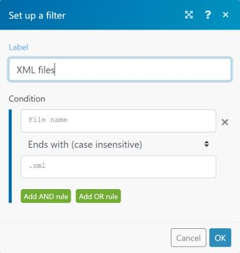

# Add a filter to a scenario

In some scenarios, you need to work only with bundles that meet specific criteria. Filters can help you select those bundles easily.

For example, you could create a scenario with the Watch records trigger for Salesforce to capture only records containing a specific word written by a specific author.

You can add a filter between two modules and check whether bundles received from the preceding modules fulfill specific filter conditions:

* If they do, the bundles pass on to the next module in the scenario. 
* If they don't, processing for the bundles terminates.

## Access requirements

You must have the following access to use the functionality in this article:

<table cellspacing="0"> 
 <col> 
 <col> 
 <tbody> 
  <tr> 
   <td role="rowheader"><em>Adobe Workfront</em> plan*</td> 
   <td> 
<em>Pro</em> or higher
 </td> 
  </tr> <draft-comment>
   <tr data-mc-conditions=""> 
    <td role="rowheader"><em>Adobe Workfront</em> license*</td> 
    <td> 
Plan, Work
 </td> 
   </tr>
  </draft-comment>
  <tr data-mc-conditions=""> 
   <td role="rowheader"><em>Adobe Workfront</em> license*</td> 
   <td> 
Plan, Work
 </td> 
  </tr> 
  <tr> 
   <td role="rowheader"><em>Adobe Workfront Fusion</em> license**</td> 
   <td> 
<em>Workfront Fusion for Work Automation and Integration</em> 
 <draft-comment>
     
<em>Workfront Fusion for Work Automation</em> 

    </draft-comment>
<em>Workfront Fusion for Work Automation</em> 
 </td> 
  </tr> 
  <tr> 
   <td role="rowheader">Product</td> 
   <td>Your organization must purchase <em>Adobe Workfront Fusion</em> as well as <em>Adobe Workfront</em> to use functionality described in this article.</td> 
  </tr> <draft-comment>
   <tr data-mc-conditions="QuicksilverOrClassic.Draft mode"> 
    <td role="rowheader">Access level configurations*</td> 
    <td> <draft-comment>
      
You must be a <em>Workfront Fusion</em> administrator for your organization.

     </draft-comment>
You must be a <em>Workfront Fusion</em> administrator for your organization.
 <draft-comment>
      
You must be a <em>Workfront Fusion</em> administrator for your team.

     </draft-comment>
You must be a <em>Workfront Fusion</em> administrator for your team.
 </td> 
   </tr>
  </draft-comment>
  <tr data-mc-conditions="QuicksilverOrClassic.Draft mode"> 
   <td role="rowheader">Access level configurations*</td> 
   <td> 
You must be a <em>Workfront Fusion</em> administrator for your organization.
 
You must be a <em>Workfront Fusion</em> administrator for your team.
 </td> 
  </tr> 
 </tbody> 
</table>

&#42;To find out what plan, license type, or access you have, contact your *Workfront administrator*.

&#42;&#42;For information on *Adobe Workfront Fusion* licenses, see [Adobe Workfront Fusion licenses](../../workfront-fusion/get-started/license-automation-vs-integration.md)

## Prerequisites

You must add both modules to a scenario before you can add a filter between them.

## Add a filter between two modules:

<ol> 
 <li value="1"> 
Click Scenarios  in the left panel, then click the scenario to open it.
 </li> 
 <li value="2">In the upper-right corner of the window, click Edit.</li> 
 <li value="3">Click the connecting line between the modules. </li> 
 <li value="4">In the box that displays, type a Label for the filter.</li> 
 <li value="5"> 
Define a filter Condition. 
 
You can enter one or two operands in the two boxes. If you enter operands in both boxes, you can select an operator in the drop-down menu between them to specify the relation between them. 
 <note type="tip">
   In the operand fields, you can enter values in the same way as you would map them, as described in 
   <a href="../../workfront-fusion/mapping/map-information-between-modules.md" class="MCXref xref">Map information from one module to another</a>.
  </note> 
For example, if you wanted the filter to find files in <em>Adobe Workfront</em>ending with XML and pass them on to Dropbox, you would type File name in the first box and .xml in the second box. In the drop-down menu between them, you would select Ends with (case insensitive). This filter would apply to incoming bundles from the first module (Workfront). Only bundles containing XML files would pass on to the next module (Dropbox).
 
  
 </li> 
 <li value="6">Click OK.</li> 
</ol>

## Copy a filter

Currently, the scenario editor doesn't include a feature for copying a filter.

>[!NOTE]
>
>If you copy the modules on either side of the filter, the filter is also copied. 
>
>For more information on copying modules, see [Copy modules or scenarios](../../workfront-fusion/scenarios/copy-modules-or-scenarios.md)

To copy a filter without copying modules, you can use Google Chrome for the following workaround:

<ol> 
 <li value="1">Install the <em>Adobe Workfront Fusion</em> DevTool Chrome extension.</li> 
 <li value="2">In <em>Workfront Fusion</em>, open the scenario.</li> 
 <li value="3">Click the Chrome three-dot menu, then click More tools > Developer tools. </li> 
 <li value="4"> 
In the Developer tools panel that displays, on the menu bar across the top, click the <em>Workfront Fusion</em> tab.
 
  
 </li> 
 <li value="5">Click the Tools icon  in the left side bar.</li> 
 <li value="6">Click Copy Filter, then configure the Copy Filter tool in the right side panel:
  <ol>
   <li value="1">Set the Source Module as the module right after the filter you want to copy.</li>
   <li value="2">Set the Target Module as the module right before the filter you want to copy.</li>
  </ol></li> 
 <li value="7"> 
Click Run.
 </li> 
</ol>

