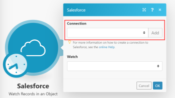
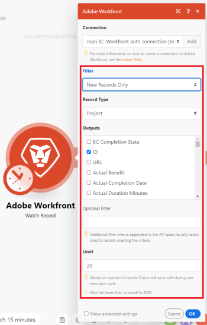
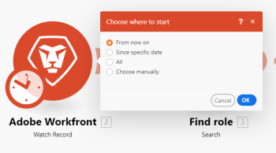

# Create a scenario {#create-a-scenario}

The following tasks explain how to create a *`Adobe Workfront Fusion`* scenario.

For a practice exercise that walks you through this process using data that we provide, see [Create a practice integration scenario](create-a-practice-scenario.md).

>[!NOTE]
>
>To create a scenario from a template, see [Create scenarios with Adobe Workfront Fusion templates](create-scenarios-with-fusion-templates.md).

## Access requirements {#access-requirements}

You must have the following access to use the functionality in this article:

<table style="width: 100%;margin-left: 0;margin-right: auto;mc-table-style: url('../../Resources/TableStyles/TableStyle-List-options-in-steps.css');" class="TableStyle-TableStyle-List-options-in-steps" cellspacing="0"> 
 <col class="TableStyle-TableStyle-List-options-in-steps-Column-Column1"> 
 <col class="TableStyle-TableStyle-List-options-in-steps-Column-Column2"> 
 <tbody> 
  <tr class="TableStyle-TableStyle-List-options-in-steps-Body-LightGray"> 
   <td class="TableStyle-TableStyle-List-options-in-steps-BodyE-Column1-LightGray" role="rowheader">Adobe Workfront plan*</td> 
   <td class="TableStyle-TableStyle-List-options-in-steps-BodyD-Column2-LightGray"> 
Pro or higher
 </td> 
  </tr> 
  <tr class="TableStyle-TableStyle-List-options-in-steps-Body-MediumGray"> 
   <td class="TableStyle-TableStyle-List-options-in-steps-BodyE-Column1-MediumGray" role="rowheader">Adobe Workfront Fusion license**</td> 
   <td class="TableStyle-TableStyle-List-options-in-steps-BodyD-Column2-MediumGray"> 
Workfront Fusion for Work Automation and Integration 
 
Workfront Fusion for Work Automation 
 </td> 
  </tr> 
  <tr class="TableStyle-TableStyle-List-options-in-steps-Body-LightGray"> 
   <td class="TableStyle-TableStyle-List-options-in-steps-BodyB-Column1-LightGray" role="rowheader">Product</td> 
   <td class="TableStyle-TableStyle-List-options-in-steps-BodyA-Column2-LightGray">Your organization must purchase Adobe Workfront Fusion as well as Adobe Workfront to use functionality described in this article.</td> 
  </tr> 
 </tbody> 
</table>

&#42;To find out what plan, license type, or access you have, contact your *`Workfront administrator`*.

## Begin creating a scenario {#begin-creating-a-scenario}

1. Click `Scenarios`  in the left panel.

1.  Click `Create a new scenario` in the upper-right corner of the page. 
1.  (Optional) Under `What services do you want to integrate`, if you are creating a new scenario, select apps you want to work with in the scenario, then click `Continue`.

   Or

   Click `Skip` if you want to choose the apps from within the scenario editor.

1. In the screen that appears (the scenario editor), if you are creating a new scenario, click `New scenario` in the upper-left corner and type a name for the scenario.
1. Continue on to [Add a module in a scenario](#add).

## Add a module in a scenario  
{#add-a-module-in-a-scenario}

1.  To add the first module to the scenario, click the question mark icon. 

   Or

   To add additional modules to the scenario, click the handle on the right side of the module you want it to follow.

1.  In the box that displays, find and click the app or service that you want to start with.

   If you selected any apps in step 2, they are displayed in the box for easy access (and in the `Favorites` section at the bottom of the screen).

   If you click `Add another module`, the modules that display depend on where in the scenario you are adding the module. Some modules can be placed only in between other modules, and others only at the beginning of the scenario. 

   >[!TIP] {type="tip"}
   >
   >The two most common types of modules are actions and triggers. For more information, see [Types of modules](module-types.md).

1.  In the list of modules that displays, click the first module you want to add to the scenario.

   The modules that display depend on where you want to add a module in your scenario. Some modules can be placed only in between other modules, and others only at the beginning of the scenario. 

   The two most common types of modules are actions and triggers. For more information, see [Types of modules](module-types.md).

1. Continue on to [Connect the module's app or web service to Workfront Fusion](#connect).

## Connect the module's app or web service to *`Workfront Fusion`* {#connect-the-modules-app-or-web-service-to-workfront-fusion}

Workfront Fusion modules that connect to an app (such as Workfront, Salesforce, or Jira) feature the Connection field. Here, you can specify the connection that you want this module to use to connect to the app. You can select an existing connection from the dropdown, or create a new connection.

When you select or create a connection for an app in a scenario, other modules for that app automatically use the same connection unless you select a different one when setting up the later modules.

For more information, see [About connecting Adobe Workfront Fusion to an app or service](about-connecting-wf-fusion-to-app-or-service.md).

To create a connection inside a *`Workfront Fusion`* module:

1.  Click `Add` to open the `Create a connection` box.
1. (Optional) Change the default `Connection name`.
1.  (Conditional) If the app requires advanced connection settings, such as an ID, key, or secret, enter that information.

   You might need to click `Show advanced settings` to display the fields where you can enter this kind of information.

1. Click `Continue`.
1. In the sign-in window that displays, enter your credentials to log in to the app if you haven't already done so.
1. (Conditional) If an `Allow` button displays, examine the actions that the connector will be able to take, then click the button to connect the app to *`Workfront Fusion`*.

1. Continue on to [Configure the module](#configur).

## Configure the module {#configure-the-module}

1.  In the fields below the Connection field, configure the settings for the module, then click `OK`.

   

   These settings are different for every module. A bolded title indicates a required setting.

   ` `**Tip: **`` As you work on your scenario, you can click the module to display this box of settings at any time. 

   If you see a black circle on a module, you haven't finished configuring its settings. Click the module to open it and continue configuring. 

   

1.  If you are adding the first module in your scenario, select an option to indicate where you want the scenario to start each time it runs.

   

1. Repeat the steps in the sections [Add a module in a scenario](#add) and [Configure the module](#configur) to add other modules to the scenario.

1. Continue on to [Configure and work with your scenario](#configur2).

## Configure and work with your scenario {#configure-and-work-with-your-scenario}

1.   Do any of the following to configure your scenario:

<table style="width: 100%;margin-left: 0;margin-right: auto;mc-table-style: url('../../Resources/TableStyles/TableStyle-List-options-in-steps.css');" class="TableStyle-TableStyle-List-options-in-steps" cellspacing="0"> 
 <col class="TableStyle-TableStyle-List-options-in-steps-Column-Column1"> 
 <col class="TableStyle-TableStyle-List-options-in-steps-Column-Column2"> 
 <tbody> 
  <tr class="TableStyle-TableStyle-List-options-in-steps-Body-LightGray"> 
   <td class="TableStyle-TableStyle-List-options-in-steps-BodyE-Column1-LightGray" role="rowheader">Specify when and how often the scenario will execute</td> 
   <td class="TableStyle-TableStyle-List-options-in-steps-BodyD-Column2-LightGray"> 
Click the clock icon. 
 
  
 
For more information, see <a href="schedule-a-scenario.md" class="MCXref xref">Schedule a scenario</a>.
 </td> 
  </tr> 
  <tr class="TableStyle-TableStyle-List-options-in-steps-Body-MediumGray"> 
   <td class="TableStyle-TableStyle-List-options-in-steps-BodyE-Column1-MediumGray" role="rowheader">Set up a route</td> 
   <td class="TableStyle-TableStyle-List-options-in-steps-BodyD-Column2-MediumGray"> 
Click the wrench icon  between the two modules and use any of the following options. For more information, see <a href="add-a-filter-to-a-scenario.md" class="MCXref xref">Add a filter to a scenario</a>.
 
    <ul> 
     <li>Set up a filter: Control which bundles are used at certain points in the scenario.</li> 
     <li>Unlink: Removes a route.</li> 
     <li>Add a router: Adds a router between modules. </li> 
     <li>Add a module: Adds a new module between modules.</li> 
     <li>Add a note: Adds a note to the route.</li> 
    </ul> </td> 
  </tr> 
  <tr class="TableStyle-TableStyle-List-options-in-steps-Body-LightGray"> 
   <td class="TableStyle-TableStyle-List-options-in-steps-BodyE-Column1-LightGray" role="rowheader">Configure the scenario settings</td> 
   <td class="TableStyle-TableStyle-List-options-in-steps-BodyD-Column2-LightGray">Click the Scenario settings icon.  These settings are intended primarily for advanced users. For more information, see <a href="scenario-settings-panel.md" class="MCXref xref">Scenario settings panel</a>.</td> 
  </tr> 
  <tr class="TableStyle-TableStyle-List-options-in-steps-Body-MediumGray"> 
   <td class="TableStyle-TableStyle-List-options-in-steps-BodyE-Column1-MediumGray" role="rowheader">Configure Flow Control settings</td> 
   <td class="TableStyle-TableStyle-List-options-in-steps-BodyD-Column2-MediumGray"> 
Click the Flow Control icon.  You can set a task to repeat a given number of times, convert an array into a series of bundles, and merge several bundles into one single bundle. For more information, see <a href="flow-control.md" class="MCXref xref">Flow control</a>.
 </td> 
  </tr> 
  <tr class="TableStyle-TableStyle-List-options-in-steps-Body-LightGray"> 
   <td class="TableStyle-TableStyle-List-options-in-steps-BodyE-Column1-LightGray" role="rowheader">Enhance the scenario using advanced tools</td> 
   <td class="TableStyle-TableStyle-List-options-in-steps-BodyD-Column2-LightGray">Click the Tools icon.  You can create triggers, actions, aggregators, and transformers. For more information, see <a href="tools-modules.md" class="MCXref xref">Tools</a>.</td> 
  </tr> 
  <tr class="TableStyle-TableStyle-List-options-in-steps-Body-MediumGray"> 
   <td class="TableStyle-TableStyle-List-options-in-steps-BodyB-Column1-MediumGray" role="rowheader">User text parsing tools</td> 
   <td class="TableStyle-TableStyle-List-options-in-steps-BodyA-Column2-MediumGray">Click the Text parser icon . You can retrieve elements from HTML code, find and extract string elements matching a search pattern, search and replace text, and "scrape" data from a website. For more information, see <a href="tools-modules.md" class="MCXref xref">Tools</a>.</td> 
  </tr> 
 </tbody> 
</table>

1.  Do any of the following to work with your scenario:

<table style="width: 100%;margin-left: 0;margin-right: auto;mc-table-style: url('../../Resources/TableStyles/TableStyle-List-options-in-steps.css');" class="TableStyle-TableStyle-List-options-in-steps" cellspacing="0"> 
 <col class="TableStyle-TableStyle-List-options-in-steps-Column-Column1"> 
 <col class="TableStyle-TableStyle-List-options-in-steps-Column-Column2"> 
 <tbody> 
  <tr class="TableStyle-TableStyle-List-options-in-steps-Body-LightGray"> 
   <td class="TableStyle-TableStyle-List-options-in-steps-BodyE-Column1-LightGray" role="rowheader">View a log of the events that occur when the scenario runs</td> 
   <td class="TableStyle-TableStyle-List-options-in-steps-BodyD-Column2-LightGray"> 
Click the Exit editing arrow  in the scenario editor to view the Scenario detail page. The log displays at the bottom of the window, or in the lower-right corner. It contains information about the difficulty of each phase and any errors encountered during the execution of the scenario.
 
To return to working with your scenario in the scenario editor, click anywhere on the Scenario detail page.
 
For more information about the Scenario detail page, see <a href="scenario-detail.md" class="MCXref xref">Scenario detail</a>.
 </td> 
  </tr> 
  <tr class="TableStyle-TableStyle-List-options-in-steps-Body-MediumGray"> 
   <td class="TableStyle-TableStyle-List-options-in-steps-BodyE-Column1-MediumGray" role="rowheader">Access your most commonly used apps and services</td> 
   <td class="TableStyle-TableStyle-List-options-in-steps-BodyD-Column2-MediumGray"> Click an icon in the Favorites section at the bottom of the screen. Icons display in this section automatically as you add apps and services to your scenario. You can also click the Add icon  to add apps and services to this area manually.</td> 
  </tr> 
  <tr class="TableStyle-TableStyle-List-options-in-steps-Body-LightGray"> 
   <td class="TableStyle-TableStyle-List-options-in-steps-BodyE-Column1-LightGray" role="rowheader">View an animation showing how data flows through the scenario</td> 
   <td class="TableStyle-TableStyle-List-options-in-steps-BodyD-Column2-LightGray">Click the Explain flow icon .</td> 
  </tr> 
  <tr class="TableStyle-TableStyle-List-options-in-steps-Body-MediumGray"> 
   <td class="TableStyle-TableStyle-List-options-in-steps-BodyE-Column1-MediumGray" role="rowheader">Auto-align the layout of the modules </td> 
   <td class="TableStyle-TableStyle-List-options-in-steps-BodyD-Column2-MediumGray">Click the Auto-align icon .</td> 
  </tr> 
  <tr class="TableStyle-TableStyle-List-options-in-steps-Body-LightGray"> 
   <td class="TableStyle-TableStyle-List-options-in-steps-BodyE-Column1-LightGray" role="rowheader">Type or view notes about the scenario</td> 
   <td class="TableStyle-TableStyle-List-options-in-steps-BodyD-Column2-LightGray">Click the Notes icon .</td> 
  </tr> 
  <tr class="TableStyle-TableStyle-List-options-in-steps-Body-MediumGray"> 
   <td class="TableStyle-TableStyle-List-options-in-steps-BodyB-Column1-MediumGray" role="rowheader">Remove a module</td> 
   <td class="TableStyle-TableStyle-List-options-in-steps-BodyA-Column2-MediumGray">Right-click the module, then click Delete module.</td> 
  </tr> 
 </tbody> 
</table>

1.  To test-run the scenario, click `Run once`.

   It's important to verify that the scenario runs as you expect before you activate it. Once activated, the scenario will execute according to its schedule. If everything does not run as expected, see [Error handling](error-handling.md).

1.  When you finish editing the scenario (or at any time while you are editing), click the Save icon at the bottom of the window .

For information about activating a scenario, see [Activate or deactivate a scenario](activate-or-inactivate-scenario.md).

## *`Workfront Fusion`* scenario keyboard shortcuts {#workfront-fusion-scenario-keyboard-shortcuts}

You can use the following keyboard shortcuts when creating or editing a scenario:

<table style="width: 717px;mc-table-style: url('../../Resources/TableStyles/TableStyle-List-options-in-steps.css');" class="TableStyle-TableStyle-List-options-in-steps" cellspacing="0"> 
 <col class="TableStyle-TableStyle-List-options-in-steps-Column-Column1" data-mc-conditions=""> 
 <col class="TableStyle-TableStyle-List-options-in-steps-Column-Column2" data-mc-conditions=""> 
 <col class="TableStyle-TableStyle-List-options-in-steps-Column-Column2" data-mc-conditions=""> 
 <thead> 
  <tr> 
   <th class="TableStyle-TableStyle-List-options-in-steps-HeadH-Column1-"> 
Action
 </th> 
   <th class="TableStyle-TableStyle-List-options-in-steps-HeadH-Column2-">Windows</th> 
   <th class="TableStyle-TableStyle-List-options-in-steps-HeadG-Column2-"> 
MacOS
 </th> 
  </tr> 
 </thead> 
 <tbody> 
  <tr class="TableStyle-TableStyle-List-options-in-steps-Body-LightGray"> 
   <td class="TableStyle-TableStyle-List-options-in-steps-BodyE-Column1-LightGray" role="rowheader">Save </td> 
   <td class="TableStyle-TableStyle-List-options-in-steps-BodyE-Column2-LightGray">Ctrl+Shift+S</td> 
   <td class="TableStyle-TableStyle-List-options-in-steps-BodyD-Column2-LightGray">Cmd+Shift+S </td> 
  </tr> 
  <tr class="TableStyle-TableStyle-List-options-in-steps-Body-MediumGray"> 
   <td class="TableStyle-TableStyle-List-options-in-steps-BodyB-Column1-MediumGray" role="rowheader">Run Once</td> 
   <td class="TableStyle-TableStyle-List-options-in-steps-BodyB-Column2-MediumGray">Ctrl+Shift+Enter</td> 
   <td class="TableStyle-TableStyle-List-options-in-steps-BodyA-Column2-MediumGray">Cmd+Shift+Enter </td> 
  </tr> 
 </tbody> 
</table>

