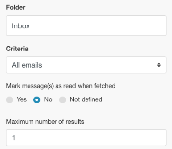
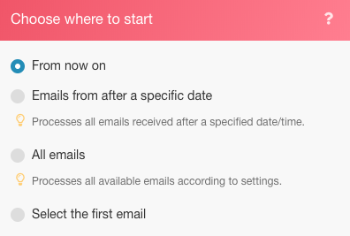
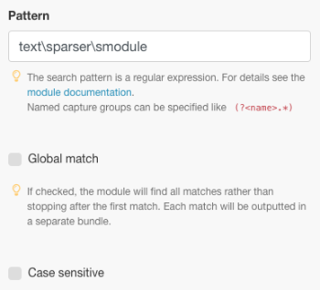
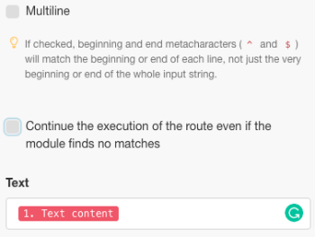
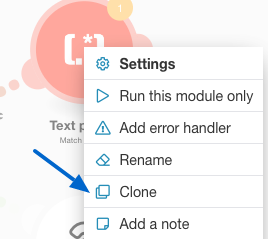
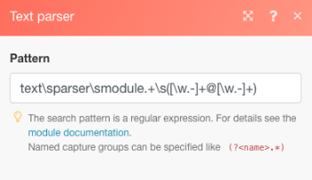
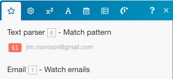
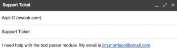
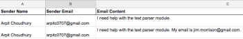
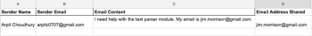

# Scenario example: Connect email, Text Parser, and Google Sheets

This scenario helps you create a log of all email messages and tag them for further action in a spreadsheet. It captures an email body in two separate tables in a spreadsheet using Regular Expressions (Regex) as search patterns. The first pattern searches for a phrase and the second searches for the same phrase and an email address.

## Access requirements

You must have the following access to use the functionality in this article:

<table cellspacing="0"> 
 <col> 
 <col> 
 <tbody> 
  <tr> 
   <td role="rowheader">Adobe Workfront plan*</td> 
   <td> 
Pro or higher
 </td> 
  </tr> Adobe Workfront license* Plan, Work 
  <tr> 
   <td role="rowheader">Adobe Workfront Fusion license**</td> 
   <td> 
Workfront Fusion for Work Automation and Integration 
  </td> 
  </tr> 
  <tr> 
   <td role="rowheader">Product</td> 
   <td>Your organization must purchase Adobe Workfront Fusion as well as Adobe Workfront to use functionality described in this article.</td> 
  </tr> <!--
   Access level configurations* You must be a Workfront Fusion administrator for your organization. You must be a Workfront Fusion administrator for your team.
  --> 
 </tbody> 
</table>

&#42;To find out what plan, license type, or access you have, contact your `Workfront administrator`.

&#42;&#42;For information on `Adobe Workfront Fusion` licenses, see [Adobe Workfront Fusion licenses](../../workfront-fusion/get-started/license-automation-vs-integration.md)

## Prerequisites

This tutorial requires basic knowledge of regular expressions. To learn about Regex, visit [https://regexone.com](https://regexone.com/).

## Task 1: Add the first module and configure it

<ol> 
 <li value="1"> 
Search for Email and choose Watch emails as the Trigger.
 <note type="note">
   While you can connect a Google account using the Email module, you can also use the inbuilt Gmail module instead.
  </note> </li> 
 <li value="2">Connect either a Google account or any other IMAP based email client (such as Outlook). </li> 
 <li value="3">Once connected, select a Folder whose incoming emails you want to watch, such as Inbox.</li> 
 <li value="4"> 
Under Criteria, choose All email (or narrow it down to read or unread emails).
 
You can also choose to mark fetched emails as read or unread.
 </li> 
 <li value="5"> 
Set the Maximum number of results to 1.
 
  
 
You can change this based on the volume of messages you receive. However, it’s recommended to set a low value and run the scenario more often.
 </li> 
 <li value="6"> 
Now click Show advanced settings at the bottom to see these filters:
 
  
 </li> 
 <li value="7"> 
Filter emails by the Sender address, Subject and Phrase.
 
This gives you the ability to watch only relevant emails. In this example, we have added only a Subject filter and left the other 2 blank.
 <note type="note">
   We will add a router to look for phrases in an email using the Match Pattern iterator and a Regular Expression (Regex) as a search pattern. This also enables us to build a multi-utility scenario.
  </note> </li> 
 <li value="8"> 
Once the configuration is done, and you are prompted to specify where to start watching your emails, click From now on.
 
  
 </li> 
 <li value="9">Continue to <a href="#search" class="MCXref xref">Task 2: Search for Flow Control and add a Router</a></li> 
</ol>

## Task 2: Search for Flow Control and add a Router

<ol> 
 <li value="1"> 
Add a router after any module to split or duplicate the data before sending it to the next module. 
 
Here, we have used a Router to send the Email body text to 2 separate tables in a Google Sheet. More on that in the next step.
 
  
 </li> 
</ol>

## Task 3: Use the Text Parser Module

<ol> 
 <li value="1"> 
 Add a Match Pattern transformer to search for a phrase in an email. 
 
We will search for the phrase “text parser module” in all incoming emails to capture the body text and sender’s name of the ones that match that phrase.
 
  <ol> 
   <li value="1"> 
Write the Pattern as a Regular Expression:
 
text\sparser\smodule
 </li> 
   <li value="2"> 
(Optional) Use any of the other Patter options. 
 
  
 
Multiline is useful if your text contains several lines and you need to search for the pattern in each line. For this tutorial we need to search for the pattern in the entire email body text, hence we will leave it unchecked.
 </li> 
   <li value="3"> 
In the Text field, click the attribute Text content in the list. 
 
  
 
This is the attribute that stores the text from the email body in which we will search for the pattern.
 </li> 
  </ol> </li> 
 <li value="2"> 
Add another Match Pattern that searches for the same phrase and an email address. 
 
This is particularly useful if you have customer accounts with multiple users. To save time, you can clone the Text Parser module you just created and link it to the Router.
 
  
 </li> 
 <li value="3"> 
Now edit the pattern as follows:
 
text\sparser\smodule.+\s([\w.-]+@[\w.-]+)
 
  
 
This pattern searches for the phrase “text parser module” and an email address like jim.morrison@gmail.com and returns only the email address.
 <note type="note">
   While it’s important to write your regex in accordance with the specification of the email addresses you accept, the one above takes care of most standard email addresses.
  </note> 
  <ul> 
   <li> 
If you’d like to search only for email address, you can use the regex below:
 
([\w.-]+@[\w.-]+)
 </li> 
   <li> 
You may also search only for phone numbers using the regex below:
 
^[+]?\(?(\d{1,3})\)?[\s-]?\(?(\d{3})\)?[\s-]?\d{3}[\s-]?\d{3,4}
 </li> 
  </ul> 
The above pattern covers most common formats in which a phone number is written.
 
To test your patterns, we recommend using <a href="https://regex101.com/">https://regex101.com</a> with javascript as the Flavor.
 
The rest of the configuration remains the same as the one before.
 </li> 
</ol>

## Task 4: Add the Google Sheets modules

Instead of Google Sheets, you can use another app like Airtable or a CRM such as InfusionSoft. For Sheets, we need to first create a spreadsheet with the requisite headers.

<ol> 
 <li value="1"> 
Create a spreadsheet with the columns under which you’d like to capture the user data. (Feel free to use an existing file too).
 
For example, create one called “Email Data: Support Ticket” with Sender Name, Sender Email and Email Content as columns. Name the worksheet "contains: text parser module."
 </li> 
 <li value="2"> 
Add the Google Sheets module with Add a row as the action.
 
  
 </li> 
 <li value="3"> 
Connect your Google account (if you haven’t already). Choose the File you created earlier, followed by choosing the Worksheet in which you’re capturing the data. 
 
Your setup should look like this:
 
  
 </li> 
 <li value="4"> 
Map the attributes in the relevant fields (columns) to finish the module setup.
 
  
 </li> 
 <li value="5">Clone the module you just created and link it to the second Text Parser module.
  <ol>
   <li value="1">
Go to your Spreadsheet, duplicate the worksheet you created earlier and give it a name. 

For example, name it "contains: text parser module and email."
</li>
   <li value="2">
Add another column to store the email address that the email body contains. 

For example, name it "Email Address Shared."
</li>
   <li value="3">Click the cloned Google Sheets module to configure the setup.</li>
   <li value="4">Change the worksheet to the new one you just created.</li>
   <li value="5">
Map the output from the Match Pattern module ($1) to the column where you want to store the email address (Email Address Shared).

</li>
   <li value="6">
Click OK, save the scenario, and take it for a test run.

You will need to send two separate emails to the connected email address as follows:

    <ul>
     <li>
Containing the phrase “text parser module” (and no email address)

</li>
     <li>
Containing the above phrase and an email address

If there are no errors in your setup, you will see that the first worksheet captures all emails containing the phrase “text parser module” while the second worksheet captures only those that contain the phrase “text parser module” and an email address. You may refer to the screenshots below.

Worksheet 1:

Worksheet 2:

</li>
    </ul></li>
  </ol></li> 
</ol>

## Resources

* [Free exercises](https://regexone.com/) to learn about Regular Expressions
* [Learn about Phone Number Matching](https://regexone.com/problem/matching_phone_numbers) using Regex
* [Learn about Email Matching](https://regexone.com/problem/matching_emails) using Regex
* [Test your Regular Expressions](https://regex101.com/)

